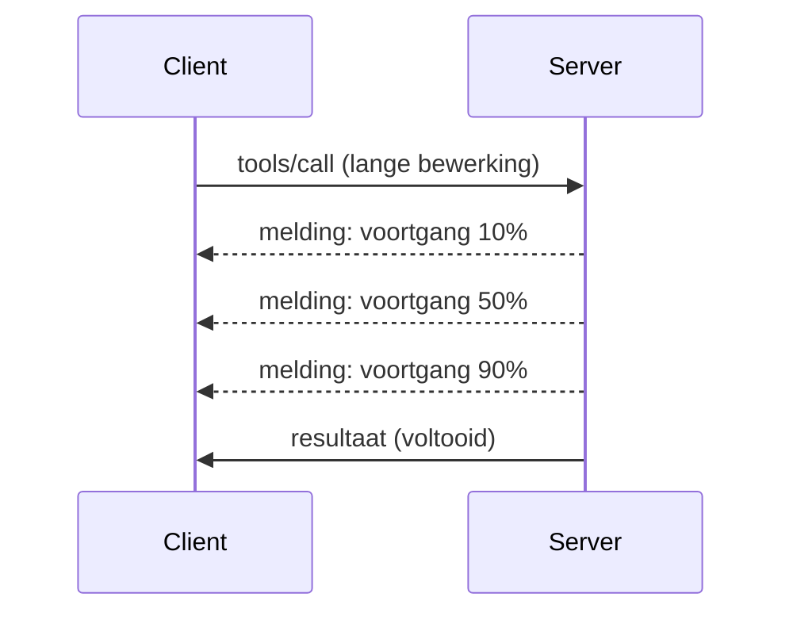

# MCP Protocol Functies Diepgaande Analyse

Deze gids onderzoekt geavanceerde MCP protocol functies die verder gaan dan basis tool- en resourcebeheer. Begrip van deze functies helpt je om robuustere, gebruiksvriendelijkere en productieklare MCP servers te bouwen.

> **Vooruitkijkend:** de releasekandidaat van `2026-07-28` schaft de Logging-primitive af (met voorkeur voor `stderr` voor stdio en OpenTelemetry voor gestructureerde observatie), verwijdert het `initialize`/sessiemodel dat hieronder wordt genoemd bij Server Lifecycle Events, en verplaatst de experimentele Tasks-functie naar een toegewijde Tasks-extensie met een nieuwe `tasks/get`/`tasks/update`/`tasks/cancel` levenscyclus. Zie [Wat Verandert in MCP: De 2026-07-28 Releasekandidaat](../../01-CoreConcepts/mcp-2026-07-28-release-candidate.md).

## Behandelde Functies

1. **Voortgangsnotificaties** - Voortgang rapporteren voor langlopende operaties  
2. **Annulering van Verzoeken** - Clients toestaan om lopende verzoeken te annuleren  
3. **Resource Sjablonen** - Dynamische resource-URI's met parameters  
4. **Server Levenscyclus Evenementen** - Correct initialiseren en afsluiten  
5. **Logging Beheer** - Serverzijde configuratie van logging  
6. **Foutafhandelingspatronen** - Consistente foutreacties  

---

## 1. Voortgangsnotificaties

Voor operaties die tijd kosten (gegevensverwerking, bestandsdownloads, API-aanroepen) houden voortgangsnotificaties gebruikers geïnformeerd.

### Hoe Het Werkt


  
### Python Implementatie

```python
from mcp.server import Server, NotificationOptions
from mcp.types import ProgressNotification
import asyncio

app = Server("progress-server")

@app.tool()
async def process_large_file(file_path: str, ctx) -> str:
    """Process a large file with progress updates."""
    
    # Bestandsgrootte ophalen voor voortgangsberekening
    file_size = os.path.getsize(file_path)
    processed = 0
    
    with open(file_path, 'rb') as f:
        while chunk := f.read(8192):
            # Verwerk chunk
            await process_chunk(chunk)
            processed += len(chunk)
            
            # Verstuur voortgangsmelding
            progress = (processed / file_size) * 100
            await ctx.send_notification(
                ProgressNotification(
                    progressToken=ctx.request_id,
                    progress=progress,
                    total=100,
                    message=f"Processing: {progress:.1f}%"
                )
            )
    
    return f"Processed {file_size} bytes"

@app.tool()
async def batch_operation(items: list[str], ctx) -> str:
    """Process multiple items with progress."""
    
    results = []
    total = len(items)
    
    for i, item in enumerate(items):
        result = await process_item(item)
        results.append(result)
        
        # Rapporteer voortgang na elk item
        await ctx.send_notification(
            ProgressNotification(
                progressToken=ctx.request_id,
                progress=i + 1,
                total=total,
                message=f"Processed {i + 1}/{total}: {item}"
            )
        )
    
    return f"Completed {total} items"
```
  
### TypeScript Implementatie

```typescript
import { Server } from "@modelcontextprotocol/sdk/server/index.js";

server.setRequestHandler(CallToolSchema, async (request, extra) => {
  const { name, arguments: args } = request.params;
  
  if (name === "process_data") {
    const items = args.items as string[];
    const results = [];
    
    for (let i = 0; i < items.length; i++) {
      const result = await processItem(items[i]);
      results.push(result);
      
      // Stuur voortgangsmelding
      await extra.sendNotification({
        method: "notifications/progress",
        params: {
          progressToken: request.id,
          progress: i + 1,
          total: items.length,
          message: `Processing item ${i + 1}/${items.length}`
        }
      });
    }
    
    return { content: [{ type: "text", text: JSON.stringify(results) }] };
  }
});
```
  
### Clientafhandeling (Python)

```python
async def handle_progress(notification):
    """Handle progress notifications from server."""
    params = notification.params
    print(f"Progress: {params.progress}/{params.total} - {params.message}")

# Registreer handler
session.on_notification("notifications/progress", handle_progress)

# Roep gereedschap aan (voortgangsupdates worden via handler ontvangen)
result = await session.call_tool("process_large_file", {"file_path": "/data/large.csv"})
```
  
---

## 2. Annulering van Verzoeken

Clients toestaan om verzoeken te annuleren die niet langer nodig zijn of te lang duren.

### Python Implementatie

```python
from mcp.server import Server
from mcp.types import CancelledError
import asyncio

app = Server("cancellable-server")

@app.tool()
async def long_running_search(query: str, ctx) -> str:
    """Search that can be cancelled."""
    
    results = []
    
    try:
        for page in range(100):  # Zoek door veel pagina's
            # Controleer of annulering is aangevraagd
            if ctx.is_cancelled:
                raise CancelledError("Search cancelled by user")
            
            # Simuleer paginazoektocht
            page_results = await search_page(query, page)
            results.extend(page_results)
            
            # Kleine vertraging maakt annuleringcontroles mogelijk
            await asyncio.sleep(0.1)
            
    except CancelledError:
        # Retourneer gedeeltelijke resultaten
        return f"Cancelled. Found {len(results)} results before cancellation."
    
    return f"Found {len(results)} total results"

@app.tool()
async def download_file(url: str, ctx) -> str:
    """Download with cancellation support."""
    
    async with aiohttp.ClientSession() as session:
        async with session.get(url) as response:
            total_size = int(response.headers.get('content-length', 0))
            downloaded = 0
            chunks = []
            
            async for chunk in response.content.iter_chunked(8192):
                if ctx.is_cancelled:
                    return f"Download cancelled at {downloaded}/{total_size} bytes"
                
                chunks.append(chunk)
                downloaded += len(chunk)
            
            return f"Downloaded {downloaded} bytes"
```
  
### Implementatie van Annuleringscontext

```python
class CancellableContext:
    """Context object that tracks cancellation state."""
    
    def __init__(self, request_id: str):
        self.request_id = request_id
        self._cancelled = asyncio.Event()
        self._cancel_reason = None
    
    @property
    def is_cancelled(self) -> bool:
        return self._cancelled.is_set()
    
    def cancel(self, reason: str = "Cancelled"):
        self._cancel_reason = reason
        self._cancelled.set()
    
    async def check_cancelled(self):
        """Raise if cancelled, otherwise continue."""
        if self.is_cancelled:
            raise CancelledError(self._cancel_reason)
    
    async def sleep_or_cancel(self, seconds: float):
        """Sleep that can be interrupted by cancellation."""
        try:
            await asyncio.wait_for(
                self._cancelled.wait(),
                timeout=seconds
            )
            raise CancelledError(self._cancel_reason)
        except asyncio.TimeoutError:
            pass  # Normale time-out, doorgaan
```
  
### Annulering aan Klantzijde

```python
import asyncio

async def search_with_timeout(session, query, timeout=30):
    """Search with automatic cancellation on timeout."""
    
    task = asyncio.create_task(
        session.call_tool("long_running_search", {"query": query})
    )
    
    try:
        result = await asyncio.wait_for(task, timeout=timeout)
        return result
    except asyncio.TimeoutError:
        # Annulering aanvragen
        await session.send_notification({
            "method": "notifications/cancelled",
            "params": {"requestId": task.request_id, "reason": "Timeout"}
        })
        return "Search timed out"
```
  
---

## 3. Resource Sjablonen

Resource sjablonen maken dynamische URI-constructies met parameters mogelijk, handig voor API's en databases.

### Sjablonen Definiëren

```python
from mcp.server import Server
from mcp.types import ResourceTemplate

app = Server("template-server")

@app.list_resource_templates()
async def list_templates() -> list[ResourceTemplate]:
    """Return available resource templates."""
    return [
        ResourceTemplate(
            uriTemplate="db://users/{user_id}",
            name="User Profile",
            description="Fetch user profile by ID",
            mimeType="application/json"
        ),
        ResourceTemplate(
            uriTemplate="api://weather/{city}/{date}",
            name="Weather Data",
            description="Historical weather for city and date",
            mimeType="application/json"
        ),
        ResourceTemplate(
            uriTemplate="file://{path}",
            name="File Content",
            description="Read file at given path",
            mimeType="text/plain"
        )
    ]

@app.read_resource()
async def read_resource(uri: str) -> str:
    """Read resource, expanding template parameters."""
    
    # Analyseer de URI om parameters te extraheren
    if uri.startswith("db://users/"):
        user_id = uri.split("/")[-1]
        return await fetch_user(user_id)
    
    elif uri.startswith("api://weather/"):
        parts = uri.replace("api://weather/", "").split("/")
        city, date = parts[0], parts[1]
        return await fetch_weather(city, date)
    
    elif uri.startswith("file://"):
        path = uri.replace("file://", "")
        return await read_file(path)
    
    raise ValueError(f"Unknown resource URI: {uri}")
```
  
### TypeScript Implementatie

```typescript
server.setRequestHandler(ListResourceTemplatesSchema, async () => {
  return {
    resourceTemplates: [
      {
        uriTemplate: "github://repos/{owner}/{repo}/issues/{issue_number}",
        name: "GitHub Issue",
        description: "Fetch a specific GitHub issue",
        mimeType: "application/json"
      },
      {
        uriTemplate: "db://tables/{table}/rows/{id}",
        name: "Database Row",
        description: "Fetch a row from a database table",
        mimeType: "application/json"
      }
    ]
  };
});

server.setRequestHandler(ReadResourceSchema, async (request) => {
  const uri = request.params.uri;
  
  // Parseer GitHub issue URI
  const githubMatch = uri.match(/^github:\/\/repos\/([^/]+)\/([^/]+)\/issues\/(\d+)$/);
  if (githubMatch) {
    const [_, owner, repo, issueNumber] = githubMatch;
    const issue = await fetchGitHubIssue(owner, repo, parseInt(issueNumber));
    return {
      contents: [{
        uri,
        mimeType: "application/json",
        text: JSON.stringify(issue, null, 2)
      }]
    };
  }
  
  throw new Error(`Unknown resource URI: ${uri}`);
});
```
  
---

## 4. Server Levenscyclus Evenementen

Correcte initialisatie en afsluiting zorgt voor schoon resourcebeheer.

### Python Levenscyclusbeheer

```python
from mcp.server import Server
from contextlib import asynccontextmanager

app = Server("lifecycle-server")

# Gedeelde status
db_connection = None
cache = None

@asynccontextmanager
async def lifespan(server: Server):
    """Manage server lifecycle."""
    global db_connection, cache
    
    # Opstarten
    print("🚀 Server starting...")
    db_connection = await create_database_connection()
    cache = await create_cache_client()
    print("✅ Resources initialized")
    
    yield  # Server draait hier
    
    # Afsluiten
    print("🛑 Server shutting down...")
    await db_connection.close()
    await cache.close()
    print("✅ Resources cleaned up")

app = Server("lifecycle-server", lifespan=lifespan)

@app.tool()
async def query_database(sql: str) -> str:
    """Use the shared database connection."""
    result = await db_connection.execute(sql)
    return str(result)
```
  
### TypeScript Levenscyclus

```typescript
import { Server } from "@modelcontextprotocol/sdk/server/index.js";

class ManagedServer {
  private server: Server;
  private dbConnection: DatabaseConnection | null = null;
  
  constructor() {
    this.server = new Server({
      name: "lifecycle-server",
      version: "1.0.0"
    });
    
    this.setupHandlers();
  }
  
  async start() {
    // Initialiseer bronnen
    console.log("🚀 Server starting...");
    this.dbConnection = await createDatabaseConnection();
    console.log("✅ Database connected");
    
    // Start server
    await this.server.connect(transport);
  }
  
  async stop() {
    // Ruim bronnen op
    console.log("🛑 Server shutting down...");
    if (this.dbConnection) {
      await this.dbConnection.close();
    }
    await this.server.close();
    console.log("✅ Cleanup complete");
  }
  
  private setupHandlers() {
    this.server.setRequestHandler(CallToolSchema, async (request) => {
      // Gebruik deze.dbConnection veilig
      // ...
    });
  }
}

// Gebruik met nette afsluiting
const server = new ManagedServer();

process.on('SIGINT', async () => {
  await server.stop();
  process.exit(0);
});

await server.start();
```
  
---

## 5. Logging Beheer

MCP ondersteunt serverzijde loggingniveaus die clients kunnen beheren.

### Loggingniveaus Implementeren

```python
from mcp.server import Server
from mcp.types import LoggingLevel
import logging

app = Server("logging-server")

# Map MCP-niveaus naar Python loggingniveaus
LEVEL_MAP = {
    LoggingLevel.DEBUG: logging.DEBUG,
    LoggingLevel.INFO: logging.INFO,
    LoggingLevel.WARNING: logging.WARNING,
    LoggingLevel.ERROR: logging.ERROR,
}

logger = logging.getLogger("mcp-server")

@app.set_logging_level()
async def set_logging_level(level: LoggingLevel) -> None:
    """Handle client request to change logging level."""
    python_level = LEVEL_MAP.get(level, logging.INFO)
    logger.setLevel(python_level)
    logger.info(f"Logging level set to {level}")

@app.tool()
async def debug_operation(data: str) -> str:
    """Tool with various logging levels."""
    logger.debug(f"Processing data: {data}")
    
    try:
        result = process(data)
        logger.info(f"Successfully processed: {result}")
        return result
    except Exception as e:
        logger.error(f"Processing failed: {e}")
        raise
```
  
### Logberichten Naar Client Verzenden

```python
@app.tool()
async def complex_operation(input: str, ctx) -> str:
    """Operation that logs to client."""
    
    # Verzenden logmelding naar client
    await ctx.send_log(
        level="info",
        message=f"Starting complex operation with input: {input}"
    )
    
    # Werk uitvoeren...
    result = await do_work(input)
    
    await ctx.send_log(
        level="debug",
        message=f"Operation complete, result size: {len(result)}"
    )
    
    return result
```
  
---

## 6. Foutafhandelingspatronen

Consistente foutafhandeling verbetert debugging en gebruikerservaring.

### MCP Foutcodes

```python
from mcp.types import McpError, ErrorCode

class ToolError(McpError):
    """Base class for tool errors."""
    pass

class ValidationError(ToolError):
    """Invalid input parameters."""
    def __init__(self, message: str):
        super().__init__(ErrorCode.INVALID_PARAMS, message)

class NotFoundError(ToolError):
    """Requested resource not found."""
    def __init__(self, resource: str):
        super().__init__(ErrorCode.INVALID_REQUEST, f"Not found: {resource}")

class PermissionError(ToolError):
    """Access denied."""
    def __init__(self, action: str):
        super().__init__(ErrorCode.INVALID_REQUEST, f"Permission denied: {action}")

class InternalError(ToolError):
    """Internal server error."""
    def __init__(self, message: str):
        super().__init__(ErrorCode.INTERNAL_ERROR, message)
```
  
### Gestructureerde Foutreacties

```python
@app.tool()
async def safe_operation(input: str) -> str:
    """Tool with comprehensive error handling."""
    
    # Valideer invoer
    if not input:
        raise ValidationError("Input cannot be empty")
    
    if len(input) > 10000:
        raise ValidationError(f"Input too large: {len(input)} chars (max 10000)")
    
    try:
        # Controleer permissies
        if not await check_permission(input):
            raise PermissionError(f"read {input}")
        
        # Voer bewerking uit
        result = await perform_operation(input)
        
        if result is None:
            raise NotFoundError(input)
        
        return result
        
    except ConnectionError as e:
        raise InternalError(f"Database connection failed: {e}")
    except TimeoutError as e:
        raise InternalError(f"Operation timed out: {e}")
    except Exception as e:
        # Log onverwachte fouten
        logger.exception(f"Unexpected error in safe_operation")
        raise InternalError(f"Unexpected error: {type(e).__name__}")
```
  
### Foutafhandeling in TypeScript

```typescript
import { McpError, ErrorCode } from "@modelcontextprotocol/sdk/types.js";

function validateInput(data: unknown): asserts data is ValidInput {
  if (typeof data !== "object" || data === null) {
    throw new McpError(
      ErrorCode.InvalidParams,
      "Input must be an object"
    );
  }
  // Meer validatie...
}

server.setRequestHandler(CallToolSchema, async (request) => {
  try {
    validateInput(request.params.arguments);
    
    const result = await performOperation(request.params.arguments);
    
    return {
      content: [{ type: "text", text: JSON.stringify(result) }]
    };
    
  } catch (error) {
    if (error instanceof McpError) {
      throw error;  // Al een MCP-fout
    }
    
    // Andere fouten omzetten
    if (error instanceof NotFoundError) {
      throw new McpError(ErrorCode.InvalidRequest, error.message);
    }
    
    // Onbekende fout
    console.error("Unexpected error:", error);
    throw new McpError(
      ErrorCode.InternalError,
      "An unexpected error occurred"
    );
  }
});
```
  
---

## Experimentele Functies (MCP 2025-11-25)

Deze functies zijn als experimenteel gemarkeerd in de specificatie:

### Taken (Langlopende Operaties)

```python
# Taken maken het mogelijk om langlopende operaties met status te volgen
@app.task()
async def training_task(model_id: str, data_path: str, ctx) -> str:
    """Long-running ML training task."""
    
    # Taak gestart rapporteren
    await ctx.report_status("running", "Initializing training...")
    
    # Trainingslus
    for epoch in range(100):
        await train_epoch(model_id, data_path, epoch)
        await ctx.report_status(
            "running",
            f"Training epoch {epoch + 1}/100",
            progress=epoch + 1,
            total=100
        )
    
    await ctx.report_status("completed", "Training finished")
    return f"Model {model_id} trained successfully"
```
  
### Tool Annotaties

```python
# Annotaties bieden metadata over het gedrag van de tool
@app.tool(
    annotations={
        "destructive": False,      # Wijzigt de gegevens niet
        "idempotent": True,        # Veilig om opnieuw te proberen
        "timeout_seconds": 30,     # Verwachte maximale duur
        "requires_approval": False # Geen gebruikersgoedkeuring nodig
    }
)
async def safe_query(query: str) -> str:
    """A read-only database query tool."""
    return await execute_read_query(query)
```
  
---

## Wat Volgt

- [Module 8 - Best Practices](../../08-BestPractices/README.md)  
- [5.14 - Context Engineering](../mcp-contextengineering/README.md)  
- [MCP Specificatie Wijzigingenlog](https://spec.modelcontextprotocol.io/)  

---

## Extra Bronnen

- [MCP Specificatie 2025-11-25](https://spec.modelcontextprotocol.io/specification/2025-11-25/)  
- [JSON-RPC 2.0 Foutcodes](https://www.jsonrpc.org/specification#error_object)  
- [Python SDK Voorbeelden](https://github.com/modelcontextprotocol/python-sdk/tree/main/examples)  
- [TypeScript SDK Voorbeelden](https://github.com/modelcontextprotocol/typescript-sdk/tree/main/examples)

---

<!-- CO-OP TRANSLATOR DISCLAIMER START -->
**Disclaimer**:
Dit document is vertaald met behulp van de AI vertaaldienst [Co-op Translator](https://github.com/Azure/co-op-translator). Hoewel we streven naar nauwkeurigheid, dient u er rekening mee te houden dat geautomatiseerde vertalingen fouten of onnauwkeurigheden kunnen bevatten. Het originele document in de oorspronkelijke taal moet worden beschouwd als de gezaghebbende bron. Voor kritieke informatie wordt professionele menselijke vertaling aanbevolen. Wij zijn niet aansprakelijk voor eventuele misverstanden of verkeerde interpretaties die voortvloeien uit het gebruik van deze vertaling.
<!-- CO-OP TRANSLATOR DISCLAIMER END -->