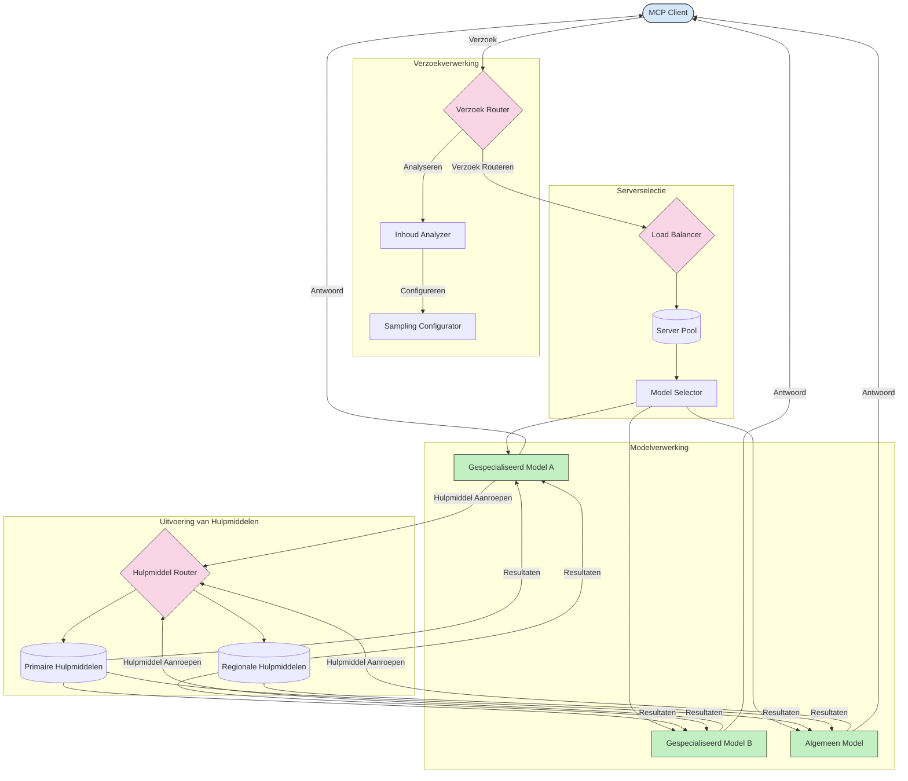

# Routing in Model Context Protocol

Routing is essentieel voor het doorsturen van verzoeken naar de juiste modellen, tools of services binnen een MCP-ecosysteem.

## Inleiding

Routing in het Model Context Protocol (MCP) houdt in dat verzoeken worden doorgestuurd naar de meest geschikte modellen of services op basis van verschillende criteria zoals inhoudstype, gebruikerscontext en systeembelasting. Dit zorgt voor efficiënte verwerking en optimale benutting van middelen.

## Leerdoelen

Aan het einde van deze les ben je in staat om:

- De principes van routing in MCP te begrijpen.
- Content-gebaseerde routing te implementeren om verzoeken naar gespecialiseerde services te sturen.
- Intelligente load balancing strategieën toe te passen om middelen optimaal te benutten.
- Dynamische tool-routing te implementeren op basis van de context van het verzoek.

## Content-gebaseerde Routing

Content-gebaseerde routing stuurt verzoeken naar gespecialiseerde services op basis van de inhoud van het verzoek. Bijvoorbeeld, verzoeken gerelateerd aan codegeneratie kunnen worden doorgestuurd naar een gespecialiseerd codemodel, terwijl creatieve schrijfverzoeken naar een creatief schrijvend model worden gestuurd.

Laten we een voorbeeldimplementatie bekijken in verschillende programmeertalen.

<details>
<summary>.NET</summary>

```csharp
// .NET Example: Content-based routing in MCP
public class ContentBasedRouter
{
    private readonly Dictionary<string, McpClient> _specializedClients;
    private readonly RoutingClassifier _classifier;
    
    public ContentBasedRouter()
    {
        // Initialize specialized clients for different domains
        _specializedClients = new Dictionary<string, McpClient>
        {
            ["code"] = new McpClient("https://code-specialized-mcp.com"),
            ["creative"] = new McpClient("https://creative-specialized-mcp.com"),
            ["scientific"] = new McpClient("https://scientific-specialized-mcp.com"),
            ["general"] = new McpClient("https://general-mcp.com")
        };
        
        // Initialize content classifier
        _classifier = new RoutingClassifier();
    }
    
    public async Task<McpResponse> RouteAndProcessAsync(string prompt, IDictionary<string, object> parameters = null)
    {
        // Classify the prompt to determine the best specialized service
        string category = await _classifier.ClassifyPromptAsync(prompt);
        
        // Get the appropriate client or fall back to general
        var client = _specializedClients.ContainsKey(category) 
            ? _specializedClients[category] 
            : _specializedClients["general"];
            
        Console.WriteLine($"Routing request to {category} specialized service");
        
        // Send request to the selected service
        return await client.SendPromptAsync(prompt, parameters);
    }
    
    // Simple classifier for routing decisions
    private class RoutingClassifier
    {
        public Task<string> ClassifyPromptAsync(string prompt)
        {
            prompt = prompt.ToLowerInvariant();
            
            if (prompt.Contains("code") || prompt.Contains("function") || 
                prompt.Contains("program") || prompt.Contains("algorithm"))
            {
                return Task.FromResult("code");
            }
            
            if (prompt.Contains("story") || prompt.Contains("creative") || 
                prompt.Contains("imagine") || prompt.Contains("design"))
            {
                return Task.FromResult("creative");
            }
            
            if (prompt.Contains("science") || prompt.Contains("research") || 
                prompt.Contains("analyze") || prompt.Contains("study"))
            {
                return Task.FromResult("scientific");
            }
            
            return Task.FromResult("general");
        }
    }
}
```

In de bovenstaande code hebben we:

- Een `ContentBasedRouter`-klasse gemaakt die verzoeken routert op basis van de inhoud van de prompt.
- Gespecialiseerde clients geïnitialiseerd voor verschillende domeinen (code, creatief, wetenschappelijk, algemeen).
- Een eenvoudige classifier geïmplementeerd die de categorie van de prompt bepaalt en deze naar de juiste gespecialiseerde service leidt.
- Een fallback-mechanisme gebruikt om verzoeken door te sturen naar een algemene service als er geen gespecialiseerde service beschikbaar is.
- Asynchrone verwerking geïmplementeerd om verzoeken efficiënt af te handelen.
- Een woordenboek gebruikt om contentcategorieën te koppelen aan gespecialiseerde MCP-clients.
- Een simpele classifier geïmplementeerd die de prompt analyseert en de juiste categorie teruggeeft.
- De gespecialiseerde client gebruikt om het verzoek te verzenden en een reactie te ontvangen.
- Gevallen afgehandeld waarin de prompt niet overeenkomt met een gespecialiseerde categorie door door te sturen naar een algemene service.

</details>

## Intelligente Load Balancing

Load balancing optimaliseert het gebruik van middelen en zorgt voor hoge beschikbaarheid van MCP-services. Er zijn verschillende manieren om load balancing te implementeren, zoals round-robin, gewogen responstijd, of content-aware strategieën.

Laten we een voorbeeldimplementatie bekijken die de volgende strategieën gebruikt:

- **Round Robin**: Verdeling van verzoeken gelijkmatig over beschikbare servers.
- **Gewogen Responstijd**: Verzoekroutering op basis van gemiddelde responstijd van servers.
- **Content-Aware**: Verzoekroutering naar gespecialiseerde servers op basis van de inhoud van het verzoek.

<details>
<summary>Java</summary>

```java
// Java Voorbeeld: Intelligent load balancing voor MCP-servers
public class McpLoadBalancer {
    private final List<McpServerNode> serverNodes;
    private final LoadBalancingStrategy strategy;
    
    public McpLoadBalancer(List<McpServerNode> nodes, LoadBalancingStrategy strategy) {
        this.serverNodes = new ArrayList<>(nodes);
        this.strategy = strategy;
    }
    
    public McpResponse processRequest(McpRequest request) {
        // Selecteer de beste server op basis van strategie
        McpServerNode selectedNode = strategy.selectNode(serverNodes, request);
        
        try {
            // Routeer het verzoek naar de geselecteerde node
            return selectedNode.processRequest(request);
        } catch (Exception e) {
            // Afhandeling van fouten - voer retry- of fallback-logica uit
            System.err.println("Error processing request on node " + selectedNode.getId() + ": " + e.getMessage());
            
            // Markeer node als mogelijk ongezond
            selectedNode.recordFailure();
            
            // Probeer de volgende beste node als fallback
            List<McpServerNode> remainingNodes = new ArrayList<>(serverNodes);
            remainingNodes.remove(selectedNode);
            
            if (!remainingNodes.isEmpty()) {
                McpServerNode fallbackNode = strategy.selectNode(remainingNodes, request);
                return fallbackNode.processRequest(request);
            } else {
                throw new RuntimeException("All MCP server nodes failed to process the request");
            }
        }
    }
    
    // Gezondheidscontrole taak voor node
    public void startHealthChecks(Duration interval) {
        ScheduledExecutorService scheduler = Executors.newScheduledThreadPool(1);
        scheduler.scheduleAtFixedRate(() -> {
            for (McpServerNode node : serverNodes) {
                try {
                    boolean isHealthy = node.checkHealth();
                    System.out.println("Node " + node.getId() + " health status: " + 
                                      (isHealthy ? "HEALTHY" : "UNHEALTHY"));
                } catch (Exception e) {
                    System.err.println("Health check failed for node " + node.getId());
                    node.setHealthy(false);
                }
            }
        }, 0, interval.toMillis(), TimeUnit.MILLISECONDS);
    }
    
    // Interface voor load balancing strategieën
    public interface LoadBalancingStrategy {
        McpServerNode selectNode(List<McpServerNode> nodes, McpRequest request);
    }
    
    // Round-robin strategie
    public static class RoundRobinStrategy implements LoadBalancingStrategy {
        private AtomicInteger counter = new AtomicInteger(0);
        
        @Override
        public McpServerNode selectNode(List<McpServerNode> nodes, McpRequest request) {
            List<McpServerNode> healthyNodes = nodes.stream()
                .filter(McpServerNode::isHealthy)
                .collect(Collectors.toList());
            
            if (healthyNodes.isEmpty()) {
                throw new RuntimeException("No healthy nodes available");
            }
            
            int index = counter.getAndIncrement() % healthyNodes.size();
            return healthyNodes.get(index);
        }
    }
    
    // Gewogen responstijd strategie
    public static class ResponseTimeStrategy implements LoadBalancingStrategy {
        @Override
        public McpServerNode selectNode(List<McpServerNode> nodes, McpRequest request) {
            return nodes.stream()
                .filter(McpServerNode::isHealthy)
                .min(Comparator.comparing(McpServerNode::getAverageResponseTime))
                .orElseThrow(() -> new RuntimeException("No healthy nodes available"));
        }
    }
    
    // Inhoudsbewuste strategie
    public static class ContentAwareStrategy implements LoadBalancingStrategy {
        @Override
        public McpServerNode selectNode(List<McpServerNode> nodes, McpRequest request) {
            // Bepaal kenmerken van het verzoek
            boolean isCodeRequest = request.getPrompt().contains("code") || 
                                   request.getAllowedTools().contains("codeInterpreter");
            
            boolean isCreativeRequest = request.getPrompt().contains("creative") || 
                                       request.getPrompt().contains("story");
            
            // Vind gespecialiseerde nodes
            Optional<McpServerNode> specializedNode = nodes.stream()
                .filter(McpServerNode::isHealthy)
                .filter(node -> {
                    if (isCodeRequest && node.getSpecialization().equals("code")) {
                        return true;
                    }
                    if (isCreativeRequest && node.getSpecialization().equals("creative")) {
                        return true;
                    }
                    return false;
                })
                .findFirst();
            
            // Retourneer gespecialiseerde node of minst belaste node
            return specializedNode.orElse(
                nodes.stream()
                    .filter(McpServerNode::isHealthy)
                    .min(Comparator.comparing(McpServerNode::getCurrentLoad))
                    .orElseThrow(() -> new RuntimeException("No healthy nodes available"))
            );
        }
    }
}
```

In de bovenstaande code hebben we:

- Een `McpLoadBalancer`-klasse gemaakt die een lijst met MCP-server nodes beheert en verzoeken routert op basis van de gekozen load balancing strategie.
- Verschillende load balancing strategieën geïmplementeerd: `RoundRobinStrategy`, `ResponseTimeStrategy`, en `ContentAwareStrategy`.
- Een `ScheduledExecutorService` gebruikt om periodiek de gezondheid van server nodes te controleren.
- Een health check-mechanisme geïmplementeerd dat nodes als gezond of ongezond markeert op basis van hun reacties op health checks.
- Verzoekverwerking met foutafhandeling en fallback-logica afgehandeld om hoge beschikbaarheid te garanderen.
- Een `McpServerNode`-klasse gebruikt om individuele MCP-server nodes te representeren, inclusief hun gezondheidsstatus, gemiddelde responstijd en huidige belasting.
- Een `McpRequest`-klasse geïmplementeerd om verzoekdetails te encapsuleren zoals de prompt en toegestane tools.
- Java Streams gebruikt om nodes te filteren en selecteren op basis van gezondheidsstatus en specialisatie.

</details>

## Dynamische Tool Routing

Tool routing zorgt ervoor dat tool-aanroepen worden doorgestuurd naar de meest geschikte service op basis van de context. Bijvoorbeeld, een weer tool kan worden doorgestuurd naar een regionaal endpoint op basis van de locatie van de gebruiker, of een rekenmachine tool kan een specifieke versie van de API moeten gebruiken.

Laten we een voorbeeldimplementatie bekijken die dynamische tool-routing demonstreert op basis van verzoekanalyse, regionale endpoints en versiebeheer.

<details>
<summary>Python</summary>

```python
# Python Voorbeeld: Dynamische toolroutering op basis van verzoekanalyse
class McpToolRouter:
    def __init__(self):
        # Registreer beschikbare tool-eindpunten
        self.tool_endpoints = {
            "weatherTool": "https://weather-service.example.com/api",
            "calculatorTool": "https://calculator-service.example.com/compute",
            "databaseTool": "https://database-service.example.com/query",
            "searchTool": "https://search-service.example.com/search"
        }
        
        # Regionale eindpunten voor wereldwijde distributie
        self.regional_endpoints = {
            "us": {
                "weatherTool": "https://us-west.weather-service.example.com/api",
                "searchTool": "https://us.search-service.example.com/search"
            },
            "europe": {
                "weatherTool": "https://eu.weather-service.example.com/api",
                "searchTool": "https://eu.search-service.example.com/search"
            },
            "asia": {
                "weatherTool": "https://asia.weather-service.example.com/api",
                "searchTool": "https://asia.search-service.example.com/search"
            }
        }
        
        # Ondersteuning voor toolversiebeheer
        self.tool_versions = {
            "weatherTool": {
                "default": "v2",
                "v1": "https://weather-service.example.com/api/v1",
                "v2": "https://weather-service.example.com/api/v2",
                "beta": "https://weather-service.example.com/api/beta"
            }
        }
    
    async def route_tool_request(self, tool_name, parameters, user_context=None):
        """Route a tool request to the appropriate endpoint based on context"""
        endpoint = self._select_endpoint(tool_name, parameters, user_context)
        
        if not endpoint:
            raise ValueError(f"No endpoint available for tool: {tool_name}")
        
        # Voer het daadwerkelijke verzoek uit naar het geselecteerde eindpunt
        return await self._execute_tool_request(endpoint, tool_name, parameters)
    
    def _select_endpoint(self, tool_name, parameters, user_context=None):
        """Select the most appropriate endpoint based on context"""
        # Basis-eindpunt uit register
        if tool_name not in self.tool_endpoints:
            return None
            
        base_endpoint = self.tool_endpoints[tool_name]
        
        # Controleer of we een specifieke toolversie moeten gebruiken
        if tool_name in self.tool_versions:
            version_info = self.tool_versions[tool_name]
            
            # Gebruik gespecificeerde versie of standaard
            requested_version = parameters.get("_version", version_info["default"])
            if requested_version in version_info:
                base_endpoint = version_info[requested_version]
        
        # Controleer op regionale routering als gebruikersregio bekend is
        if user_context and "region" in user_context:
            user_region = user_context["region"]
            
            if user_region in self.regional_endpoints:
                regional_tools = self.regional_endpoints[user_region]
                
                if tool_name in regional_tools:
                    # Gebruik regio-specifiek eindpunt
                    return regional_tools[tool_name]
        
        # Controleer op vereisten voor gegevensresidentie
        if user_context and "data_residency" in user_context:
            # Dit zou logica implementeren om te zorgen dat gegevens binnen de opgegeven jurisdictie blijven
            pass
        
        # Controleer op routering gebaseerd op latentie
        if user_context and "latency_sensitive" in user_context and user_context["latency_sensitive"]:
            # Dit zou logica implementeren om het eindpunt met de laagste latentie te selecteren
            pass
            
        return base_endpoint
        
    async def _execute_tool_request(self, endpoint, tool_name, parameters):
        """Execute the actual tool request to the selected endpoint"""
        try:
            async with aiohttp.ClientSession() as session:
                async with session.post(
                    endpoint,
                    json={"toolName": tool_name, "parameters": parameters},
                    headers={"Content-Type": "application/json"}
                ) as response:
                    if response.status == 200:
                        result = await response.json()
                        return result
                    else:
                        error_text = await response.text()
                        raise Exception(f"Tool execution failed: {error_text}")
        except Exception as e:
            # Implementeer retry-logica of fallback-strategie
            print(f"Error executing tool {tool_name} at {endpoint}: {str(e)}")
            raise
```

In de bovenstaande code hebben we:

- Een `McpToolRouter`-klasse gemaakt die tool-routing beheert op basis van verzoekanalyse, regionale endpoints en versiebeheer.
- Beschikbare tool endpoints en regionale endpoints geregistreerd voor wereldwijde distributie.
- Dynamische routinglogica geïmplementeerd die het juiste endpoint selecteert op basis van gebruikerscontext, zoals regio en dataresidentievereisten.
- Versiebeheer voor tools geïmplementeerd, waardoor gebruikers kunnen specificeren welke versie van een tool ze willen gebruiken.
- Asynchrone HTTP-verzoeken gebruikt om tool-aanroepen uit te voeren en reacties af te handelen.

</details>

## Sampling en Routing Architectuur in MCP

Sampling is een cruciaal onderdeel van het Model Context Protocol (MCP) dat efficiënte verwerking en routing van verzoeken mogelijk maakt. Het omvat het analyseren van binnenkomende verzoeken om het meest geschikte model of service te bepalen die deze kan afhandelen, op basis van verschillende criteria zoals inhoudstype, gebruikerscontext en systeembelasting.

Sampling en routing kunnen worden gecombineerd om een robuuste architectuur te creëren die de benutting van middelen optimaliseert en hoge beschikbaarheid waarborgt. Het samplingproces kan worden gebruikt om verzoeken te classificeren, terwijl routing ze doorstuurt naar de juiste modellen of services.

Het onderstaande diagram illustreert hoe sampling en routing samenwerken binnen een uitgebreide MCP-architectuur:



## Wat volgt

- [5.6 Sampling](../mcp-sampling/README.md)

---

<!-- CO-OP TRANSLATOR DISCLAIMER START -->
**Disclaimer**:
Dit document is vertaald met behulp van de AI vertaaldienst [Co-op Translator](https://github.com/Azure/co-op-translator). Hoewel we streven naar nauwkeurigheid, dient u er rekening mee te houden dat geautomatiseerde vertalingen fouten of onnauwkeurigheden kunnen bevatten. Het originele document in de oorspronkelijke taal moet worden beschouwd als de gezaghebbende bron. Voor kritieke informatie wordt professionele menselijke vertaling aanbevolen. Wij zijn niet aansprakelijk voor eventuele misverstanden of verkeerde interpretaties die voortvloeien uit het gebruik van deze vertaling.
<!-- CO-OP TRANSLATOR DISCLAIMER END -->