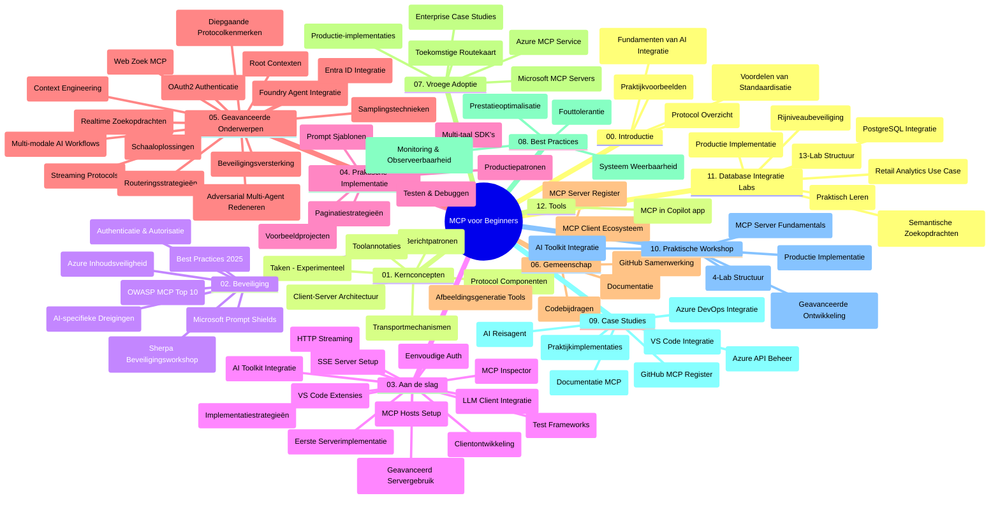

# Model Context Protocol (MCP) voor Beginners - Studiegids

Deze studiegids biedt een overzicht van de structuur en inhoud van de repository voor het curriculum "Model Context Protocol (MCP) voor Beginners". Gebruik deze gids om efficiënt door de repository te navigeren en optimaal gebruik te maken van de beschikbare resources.

## Overzicht van de Repository

Het Model Context Protocol (MCP) is een gestandaardiseerd raamwerk voor interacties tussen AI-modellen en clientapplicaties. Oorspronkelijk gecreëerd door Anthropic, wordt het MCP nu onderhouden door de bredere MCP-gemeenschap via de officiële GitHub-organisatie. Deze repository biedt een uitgebreid curriculum met praktische codevoorbeelden in C#, Java, JavaScript, Python en TypeScript, ontworpen voor AI-ontwikkelaars, systeemarchitecten en software engineers.

## Visuele Curriculumkaart

## Structuur van de Repository

De repository is georganiseerd in twaalf hoofdsecties, elk gericht op verschillende aspecten van MCP:

1. **Introductie (00-Introduction/)**
   - Overzicht van het Model Context Protocol
   - Waarom standaardisatie belangrijk is in AI-pijplijnen
   - Praktische use cases en voordelen

2. **Kernconcepten (01-CoreConcepts/)**
   - Client-server architectuur
   - Belangrijke protocolcomponenten
   - Berichtenpatronen in MCP
   - Vooruitblik: [Wat verandert er in MCP: De Release Candidate van 2026-07-28](./01-CoreConcepts/mcp-2026-07-28-release-candidate.md) — de stateless protocol core, Extensions framework, en Roots/Sampling/Logging verouderingen die verwacht worden in de volgende specificatieversie

3. **Beveiliging (02-Security/)**
   - Beveiligingsdreigingen in op MCP gebaseerde systemen
   - Best practices voor het beveiligen van implementaties
   - Authenticatie- en autorisatiestrategieën
   - **Uitgebreide Beveiligingsdocumentatie**:
     - MCP Security Best Practices 2025
     - Azure Content Safety Implementatiehandleiding
     - MCP Security Controls en Technieken
     - MCP Best Practices Quick Reference
   - **Belangrijke Beveiligingsthema’s**:
     - Prompt injection en tool poisoning aanvallen
     - Session hijacking en confused deputy problemen
     - Token passthrough kwetsbaarheden
     - Overmatige permissies en toegangscontrole
     - Supply chain beveiliging voor AI-componenten
     - Microsoft Prompt Shields integratie

4. **Aan de Slag (03-GettingStarted/)**
   - Omgevingsopzet en configuratie
   - Basis MCP-servers en clients creëren
   - Integratie met bestaande applicaties
   - Bevat secties voor:
     - Eerste serverimplementatie
     - Clientontwikkeling
     - LLM-clientintegratie
     - VS Code-integratie
     - Server-Sent Events (SSE) server
     - Geavanceerd servergebruik
     - HTTP streaming
     - AI Toolkit-integratie
     - Teststrategieën
     - Uitrolrichtlijnen

5. **Praktische Implementatie (04-PracticalImplementation/)**
   - Gebruik van SDK’s in verschillende programmeertalen
   - Debugging-, test- en validatietechnieken
   - Het maken van herbruikbare promptsjablonen en workflows
   - Voorbeeldprojecten met implementatievoorbeelden

6. **Geavanceerde Onderwerpen (05-AdvancedTopics/)**
   - Context engineering technieken
   - Foundry agent integratie
   - Multi-modale AI-workflows
   - OAuth2 authenticatie demo’s
   - Real-time zoekmogelijkheden
   - Real-time streaming
   - Implementatie van root contexts
   - Routingstrategieën
   - Samplingtechnieken
   - Scaling-benaderingen
   - Beveiligingsoverwegingen
   - Entra ID beveiligingsintegratie
   - Web zoekintegratie
   - Adversarial multi-agent reasoning (debate patronen)

7. **Community Bijdragen (06-CommunityContributions/)**
   - Hoe code en documentatie bijdragen
   - Samenwerken via GitHub
   - Community-gedreven verbeteringen en feedback
   - Gebruik van diverse MCP-clients (Claude Desktop, Cline, VSCode)
   - Werken met populaire MCP-servers inclusief image generation

8. **Lessen uit Vroege Adoptie (07-LessonsfromEarlyAdoption/)**
   - Implementaties uit de praktijk en succesverhalen
   - Bouwen en uitrollen van MCP-gebaseerde oplossingen
   - Trends en toekomstige roadmap
   - **Microsoft MCP Servers Gids**: Uitgebreide gids voor 10 productieklare Microsoft MCP-servers waaronder:
     - Microsoft Learn Docs MCP Server
     - Azure MCP Server (15+ gespecialiseerde connectors)
     - GitHub MCP Server
     - Azure DevOps MCP Server
     - MarkItDown MCP Server
     - SQL Server MCP Server
     - Playwright MCP Server
     - Dev Box MCP Server
     - Microsoft Foundry MCP Server
     - Microsoft 365 Agents Toolkit MCP Server

9. **Best Practices (08-BestPractices/)**
   - Prestatieafstemming en optimalisatie
   - Ontwerpen van fouttolerante MCP-systemen
   - Test- en veerkrachtstrategieën

10. **Casestudy’s (09-CaseStudy/)**
    - **Zeven uitgebreide casestudy’s** die de veelzijdigheid van MCP tonen in diverse scenario’s:
    - **Azure AI Travel Agents**: Multi-agent orchestratie met Azure OpenAI en AI Search
    - **Azure DevOps Integratie**: Automatiseren van workflowprocessen met YouTube data-updates
    - **Real-Time Documentatie Opvraging**: Python console client met streaming HTTP
    - **Interactieve Studieplangenerator**: Chainlit webapp met conversatie-AI
    - **Documentatie in Editor**: VS Code-integratie met GitHub Copilot workflows
    - **Azure API Management**: Enterprise API-integratie met MCP servercreatie
    - **GitHub MCP Registry**: Ecosysteemontwikkeling en agentische integratieplatform
    - Implementatievoorbeelden die enterprise-integratie, ontwikkelaarproductiviteit en ecosysteemontwikkeling omvatten

11. **Hands-on Workshop (10-StreamliningAIWorkflowsBuildingAnMCPServerWithAIToolkit/)**
    - Uitgebreide hands-on workshop die MCP combineert met AI Toolkit
    - Bouwen van intelligente applicaties die AI-modellen verbinden met echte tools
    - Praktische modules over de basisprincipes, eigen serverontwikkeling en productiedistributiestrategieën
    - **Labstructuur**:
      - Lab 1: MCP Server Fundamentals
      - Lab 2: Geavanceerde MCP Serverontwikkeling
      - Lab 3: AI Toolkit-integratie
      - Lab 4: Productie-uitrol en scaling
    - Lab-gebaseerde leerbenadering met stapsgewijze instructies

12. **MCP Server Database Integratie Labs (11-MCPServerHandsOnLabs/)**
    - **Uitgebreid 13-lab leertraject** voor het bouwen van productieklare MCP-servers met PostgreSQL-integratie
    - **Real-world retail analytics implementatie** met de Zava Retail use case
    - **Enterprise-grade patronen** waaronder Row Level Security (RLS), semantische zoekopdrachten en multi-tenant data toegang
    - **Volledige labstructuur**:
      - **Labs 00-03: Fundamenten** - Introductie, Architectuur, Beveiliging, Omgevingsopzet
      - **Labs 04-06: MCP Server Bouwen** - Databaseontwerp, MCP Server Implementatie, Toolontwikkeling
      - **Labs 07-09: Geavanceerde Functionaliteiten** - Semantisch zoeken, Testen & Debuggen, VS Code-integratie
      - **Labs 10-12: Productie & Best Practices** - Uitrol, Monitoring, Optimalisatie
    - **Behandelde technologieën**: FastMCP framework, PostgreSQL, Azure OpenAI, Azure Container Apps, Application Insights
    - **Leerresultaten**: Productieklare MCP-servers, database-integratiepatronen, AI-gestuurde analytics, enterprise beveiliging

13. **Tooling (12-tooling/)**
    - Leer hoe je MCP gebruikt in de Copilot-app en andere tools

## Aanvullende Bronnen

De repository bevat ondersteunende bronnen:

- **Afbeeldingenmap**: Bevat diagrammen en illustraties die door het curriculum heen worden gebruikt
- **Vertalingen**: Meertalige ondersteuning met automatische vertalingen van documentatie
- **Officiële MCP-bronnen**:
  - [MCP Documentatie](https://modelcontextprotocol.io/)
  - [MCP Specificatie](https://spec.modelcontextprotocol.io/)
  - [MCP GitHub Repository](https://github.com/modelcontextprotocol)

## Hoe deze Repository te Gebruiken

1. **Sequentieel Leren**: Volg de hoofdstukken op volgorde (00 tot en met 11) voor een gestructureerde leerervaring.
2. **Taalgerichte Focus**: Als je geïnteresseerd bent in een specifieke programmeertaal, verken dan de samples directories voor implementaties in jouw voorkeurs taal.
3. **Praktische Implementatie**: Begin met de sectie "Aan de Slag" om je omgeving op te zetten en je eerste MCP-server en client te maken.
4. **Geavanceerde Verkenning**: Zodra je comfortabel bent met de basis, duik in de geavanceerde onderwerpen om je kennis uit te breiden.
5. **Community Betrokkenheid**: Sluit je aan bij de MCP-gemeenschap via GitHub-discussies en Discord-kanalen om in contact te komen met experts en mede-ontwikkelaars.

## MCP Clients en Tools

Het curriculum behandelt verschillende MCP clients en tools:

1. **Officiële Clients**:
   - Visual Studio Code 
   - MCP in Visual Studio Code
   - Claude Desktop
   - Claude in VSCode 
   - Claude API

2. **Community Clients**:
   - Cline (terminal-gebaseerd)
   - Cursor (code-editor)
   - ChatMCP
   - Windsurf

3. **MCP Management Tools**:
   - MCP CLI
   - MCP Manager
   - MCP Linker
   - MCP Router

## Populaire MCP Servers

De repository introduceert diverse MCP servers, waaronder:

1. **Officiële Microsoft MCP Servers**:
   - Microsoft Learn Docs MCP Server
   - Azure MCP Server (15+ gespecialiseerde connectors)
   - GitHub MCP Server
   - Azure DevOps MCP Server
   - MarkItDown MCP Server
   - SQL Server MCP Server
   - Playwright MCP Server
   - Dev Box MCP Server
   - Microsoft Foundry MCP Server
   - Microsoft 365 Agents Toolkit MCP Server

2. **Officiële Referentieservers**:
   - Filesystem
   - Fetch
   - Memory
   - Sequential Thinking

3. **Afbeeldingengeneratie**:
   - Azure OpenAI DALL-E 3
   - Stable Diffusion WebUI
   - Replicate

4. **Ontwikkeltools**:
   - Git MCP
   - Terminal Control
   - Code Assistant

5. **Gespecialiseerde Servers**:
   - Salesforce
   - Microsoft Teams
   - Jira & Confluence

## Bijdragen

Deze repository verwelkomt bijdragen van de community. Zie de sectie Community Bijdragen voor richtlijnen over hoe effectief bij te dragen aan het MCP-ecosysteem.

----

*Deze studiegids is voor het laatst bijgewerkt op 5 februari 2026, met de meest recente MCP Specificatie 2025-11-25 en biedt een overzicht van de repository tot die datum. De inhoud van de repository kan na deze datum worden bijgewerkt.*

*Addendum (2 juli 2026): een les over de `2026-07-28` MCP Specificatie Release Candidate is toegevoegd onder [01-CoreConcepts](./01-CoreConcepts/mcp-2026-07-28-release-candidate.md); de curriculum-baseline blijft 2025-11-25 totdat de nieuwe specificatie wordt uitgebracht.*

---

<!-- CO-OP TRANSLATOR DISCLAIMER START -->
**Disclaimer**:
Dit document is vertaald met behulp van de AI vertaaldienst [Co-op Translator](https://github.com/Azure/co-op-translator). Hoewel we streven naar nauwkeurigheid, dient u er rekening mee te houden dat geautomatiseerde vertalingen fouten of onnauwkeurigheden kunnen bevatten. Het originele document in de oorspronkelijke taal moet worden beschouwd als de gezaghebbende bron. Voor kritieke informatie wordt professionele menselijke vertaling aanbevolen. Wij zijn niet aansprakelijk voor eventuele misverstanden of verkeerde interpretaties die voortvloeien uit het gebruik van deze vertaling.
<!-- CO-OP TRANSLATOR DISCLAIMER END -->