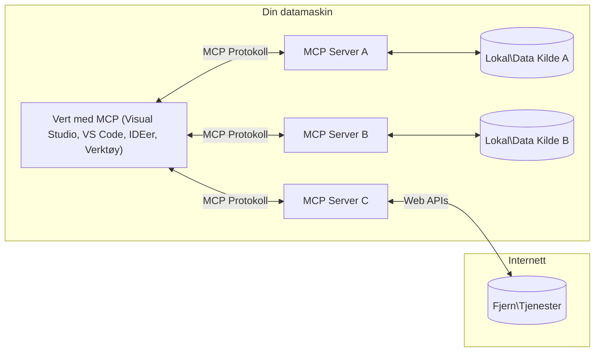

# MCP Kjernebegreper: Mestre Model Context Protocol for AI-integrasjon

[](https://youtu.be/earDzWGtE84)

_(Klikk på bildet over for å se videoen til denne leksjonen)_

[Model Context Protocol (MCP)](https://github.com/modelcontextprotocol) er et kraftig, standardisert rammeverk som optimaliserer kommunikasjon mellom store språkmodeller (LLMs) og eksterne verktøy, applikasjoner og datakilder.  
Denne veiledningen tar deg gjennom kjernen i MCP. Du vil lære om klient-server-arkitektur, viktige komponenter, kommunikasjonsmekanismer og beste praksis for implementering.

- **Eksplisitt bruker-samtykke**: All datatilgang og operasjoner krever eksplisitt godkjenning fra brukeren før utførelse. Brukere må klart forstå hvilke data som vil bli aksessert og hvilke handlinger som vil bli utført, med detaljert kontroll over tillatelser og autorisasjoner.

- **Beskyttelse av dataprivacy**: Brukerdata eksponeres kun med eksplisitt samtykke og må beskyttes med robuste tilgangskontroller gjennom hele interaksjonslivssyklusen. Implementeringer må forhindre uautorisert datatransmisjon og opprettholde strenge personverngrenser.

- **Sikker kjøring av verktøy**: Hver verktøys-kjøring krever eksplisitt bruker-samtykke med klar forståelse av verktøyets funksjonalitet, parametere og potensiell påvirkning. Gode sikkerhetsgrenser må forhindre utilsiktet, usikker eller ondsinnet verktøykjøring.

- **Transportlagssikkerhet**: Alle kommunikasjonskanaler bør bruke passende kryptering og autentiseringsmekanismer. Eksterne tilkoblinger bør implementere sikre transportprotokoller og riktig håndtering av legitimasjon.

#### Implementeringsretningslinjer:

- **Tillatelsesstyring**: Implementer detaljerte tillatelsessystemer som lar brukere kontrollere hvilke servere, verktøy og ressurser som er tilgjengelige  
- **Autentisering og autorisasjon**: Bruk sikre autentiseringsmetoder (OAuth, API-nøkler) med korrekt tokenstyring og utløp  
- **Inputvalidering**: Valider alle parametere og data i henhold til definerte skjemaer for å forhindre injeksjonsangrep  
- **Revisjonslogging**: Oppretthold omfattende logger av alle operasjoner for sikkerhetsovervåking og etterlevelse

## Oversikt

Denne leksjonen utforsker den grunnleggende arkitekturen og komponentene som utgjør Model Context Protocol (MCP)-økosystemet. Du vil lære om klient-server-arkitektur, nøkkelkomponenter og kommunikasjonsmekanismer som driver MCP-interaksjoner.

## Viktige læringsmål

Ved slutten av denne leksjonen vil du:

- Forstå MCPs klient-server-arkitektur.  
- Identifisere roller og ansvar for Hosts, Clients og Servers.  
- Analysere kjernefunksjonene som gjør MCP til et fleksibelt integrasjonslag.  
- Lære hvordan informasjon flyter innen MCP-økosystemet.  
- Få praktisk innsikt gjennom kodeeksempler i .NET, Java, Python og JavaScript.

## MCP-arkitektur: En dypere titt

MCP-økosystemet bygger på en klient-server-modell. Denne modulære strukturen lar AI-applikasjoner samhandle effektivt med verktøy, databaser, API-er og kontekstuelle ressurser. La oss bryte ned denne arkitekturen i dens kjernekomponenter.

I kjernen følger MCP en klient-server-arkitektur hvor en host-applikasjon kan koble seg til flere servere:



- **MCP Hosts**: Programmer som VSCode, Claude Desktop, IDEer eller AI-verktøy som ønsker tilgang til data gjennom MCP  
- **MCP Clients**: Protokollklienter som opprettholder 1:1-tilkoblinger med servere  
- **MCP Servers**: Lettvektsprogrammer som hver eksponerer spesifikke funksjoner gjennom den standardiserte Model Context Protocol  
- **Lokale datakilder**: Din datamaskins filer, databaser og tjenester som MCP-servere kan trygt aksessere  
- **Eksterne tjenester**: Systemer tilgjengelig over internett som MCP-servere kan koble seg til via API-er.

MCP-protokollen er en utviklende standard som bruker datobasert versjonering (YYYY-MM-DD-format). Den nåværende protokollversjonen er **2025-11-25**. Du kan se de siste oppdateringene til [protokollspesifikasjonen](https://modelcontextprotocol.io/specification/2025-11-25/)

> **Fremover:** En releasekandidat for neste spesifikasjonsversjon, **2026-07-28**, ble kunngjort i mai 2026 og er planlagt lansert 28. juli 2026. Den gjør protokollen stateless på transportlaget (fjerner `initialize`-håndtrykk og sesjons-ID-er), formaliserer et Extensions-rammeverk og nedgraderer Roots, Sampling og Logging til fordel for nyere mønstre. Se [Hva endres i MCP: Releasekandidaten 2026-07-28](./mcp-2026-07-28-release-candidate.md) for full gjennomgang.

### 1. Hosts

I Model Context Protocol (MCP) er **Hosts** AI-applikasjoner som tjener som hovedgrensesnittet der brukere interagerer med protokollen. Hosts koordinerer og administrerer tilkoblinger til flere MCP-servere ved å opprette dedikerte MCP-klienter for hver servertilkobling. Eksempler på Hosts inkluderer:

- **AI-applikasjoner**: Claude Desktop, Visual Studio Code, Claude Code  
- **Utviklingsmiljøer**: IDEer og kodeeditorer med MCP-integrasjon  
- **Egendefinerte applikasjoner**: Spesialbygde AI-agenter og verktøy

**Hosts** er applikasjoner som koordinerer AI-modellinteraksjoner. De:

- **Orkestrerer AI-modeller**: Kjører eller samhandler med LLMs for å generere svar og koordinere AI-arbeidsflyt  
- **Administrerer klienttilkoblinger**: Oppretter og vedlikeholder én MCP-klient per MCP-servertilkobling  
- **Kontrollerer brukergrensesnittet**: Håndterer samtaleflyt, brukerinteraksjoner og visning av svar  
- **Håndhever sikkerhet**: Kontrollerer tillatelser, sikkerhetsbegrensninger og autentisering  
- **Håndterer brukersamtykke**: Administrerer brukerens godkjenning for deling av data og verktøykjøring

### 2. Clients

**Clients** er essensielle komponenter som opprettholder dedikerte én-til-én-tilkoblinger mellom Hosts og MCP-servere. Hver MCP-klient opprettes av Host for å koble til en bestemt MCP-server, og sikrer organiserte og sikre kommunikasjonskanaler. Flere klienter lar Hosts koble til flere servere samtidig.

**Clients** er tilkoblingskomponenter innen host-applikasjonen. De:

- **Protokollkommunikasjon**: Sender JSON-RPC 2.0-forespørsler til servere med prompts og instruksjoner  
- **Funksjonsforhandling**: Forhandler støttede funksjoner og protokollversjoner med servere under initiering  
- **Verktøykjøring**: Håndterer forespørsler om verktøykjøring fra modeller og prosesserer svar  
- **Sanntidsoppdateringer**: Håndterer varsler og sanntidsoppdateringer fra servere  
- **Responsbehandling**: Prosesserer og formaterer serversvar for visning til brukere

### 3. Servers

**Servers** er programmer som gir kontekst, verktøy og kapasiteter til MCP-klienter. De kan kjøre lokalt (samme maskin som Host) eller eksternt (på eksterne plattformer), og er ansvarlige for å håndtere klientforespørsler og levere strukturerte svar. Servere eksponerer spesifikk funksjonalitet gjennom den standardiserte Model Context Protocol.

**Servers** er tjenester som tilbyr kontekst og kapasiteter. De:

- **Funksjonsregistrering**: Registrerer og eksponerer tilgjengelige primitive (ressurser, prompts, verktøy) til klienter  
- **Forespørselsbehandling**: Mottar og utfører verktøykall, ressursforespørsler og promptforespørsler fra klienter  
- **Kontekstlevering**: Gir kontekstuell informasjon og data for å forbedre modelsvar  
- **Tilstandshåndtering**: Opprettholder sesjonsstatus og håndterer tilstandsfylte interaksjoner når nødvendig  
- **Sanntidsvarsler**: Sender varsler om kapasitetsendringer og oppdateringer til tilkoblede klienter

Servere kan utvikles av hvem som helst for å utvide modellkapasiteter med spesialisert funksjonalitet, og de støtter både lokale og eksterne distribusjonsscenarier.

### 4. Server Primitives

Servere i Model Context Protocol (MCP) tilbyr tre kjerne-**primitive** som definerer de grunnleggende byggeklossene for rike interaksjoner mellom klienter, hosts og språkmodeller. Disse primitive spesifiserer hvilke typer kontekstuell informasjon og handlinger som er tilgjengelige gjennom protokollen.

MCP-servere kan eksponere en hvilken som helst kombinasjon av følgende tre kjerneprimitive:

#### Resources 

**Ressurser** er datakilder som tilbyr kontekstuell informasjon til AI-applikasjoner. De representerer statisk eller dynamisk innhold som kan forbedre modellforståelse og beslutningstaking:

- **Kontekstuelt data**: Strukturert informasjon og kontekst for AI-modellers konsum  
- **Kunnskapsbaser**: Dokumentarkiver, artikler, manualer og forskningsartikler  
- **Lokale datakilder**: Filer, databaser og lokal systeminformasjon  
- **Eksterne data**: API-responser, webtjenester og ekstern systemdata  
- **Dynamisk innhold**: Sanntidsdata som oppdateres basert på eksterne forhold

Ressurser identifiseres med URIer og støtter oppdagelse via `resources/list` og henting via `resources/read` metoder:

```text
file://documents/project-spec.md
database://production/users/schema
api://weather/current
```

#### Prompts

**Prompts** er gjenbrukbare maler som hjelper til med å strukturere interaksjoner med språkmodeller. De gir standardiserte interaksjonsmønstre og malbaserte arbeidsflyter:

- **Malm-baserte interaksjoner**: Forhåndsstrukturerte meldinger og samtalestartere  
- **Arbeidsflytmaler**: Standardiserte sekvenser for vanlige oppgaver og interaksjoner  
- **Få-skudd-eksempler**: Eksempeldrevne maler for modellinstruksjon  
- **Systemprompts**: Grunnleggende prompts som definerer modellatferd og kontekst  
- **Dynamiske maler**: Parametriserte prompts som tilpasses spesifikke kontekster

Prompts støtter variabelsubstitusjon og kan oppdages via `prompts/list` og hentes med `prompts/get`:

```markdown
Generate a {{task_type}} for {{product}} targeting {{audience}} with the following requirements: {{requirements}}
```

#### Tools

**Verktøy** er kjørbare funksjoner som AI-modeller kan påkalle for å utføre spesifikke handlinger. De representerer "verbene" i MCP-økosystemet, som gjør modeller i stand til å samhandle med eksterne systemer:

- **Kjørbare funksjoner**: Diskrete operasjoner som modeller kan påkalle med spesifikke parametere  
- **Integrasjon med eksterne systemer**: API-kall, databaseforespørsler, filoperasjoner, beregninger  
- **Unik identitet**: Hvert verktøy har et eget navn, beskrivelse og parameterskjema  
- **Strukturert I/O**: Verktøy aksepterer validerte parametere og returnerer strukturerte, typete svar  
- **Handlingsmuligheter**: Lar modeller utføre reelle handlinger og hente levende data

Verktøy defineres med JSON Schema for parameter-validering og oppdages via `tools/list` og kjøres gjennom `tools/call`. Verktøy kan også inkludere **ikoner** som ekstra metadata for bedre UI-presentasjon.

**Verktøyannotasjoner**: Verktøy støtter atferdsbeskrivelser (f.eks. `readOnlyHint`, `destructiveHint`) som angir om et verktøy er skrivbeskyttet eller destruktivt, noe som hjelper klienter å ta informerte beslutninger om verktøykjøring.

Eksempel på verktøydefinisjon:

```typescript
server.tool(
  "search_products", 
  {
    query: z.string().describe("Search query for products"),
    category: z.string().optional().describe("Product category filter"),
    max_results: z.number().default(10).describe("Maximum results to return")
  }, 
  async (params) => {
    // Utfør søk og returner strukturerte resultater
    return await productService.search(params);
  }
);
```

## Klientprimitiver

I Model Context Protocol (MCP) kan **klienter** eksponere primitive som gjør det mulig for servere å be om ekstra kapasiteter fra host-applikasjonen. Disse klient-side primitive muliggjør rikere, mer interaktive serverimplementasjoner som kan aksessere AI-modellkapasiteter og brukerinteraksjoner.

### Sampling

> **Nedgraderingsvarsel:** Releasekandidaten `2026-07-28` markerer Sampling som utfaset til fordel for direkte integrasjon med LLM-leverandør-APIer. Den fungerer fortsatt i `2025-11-25` og i minst ett år etter eventuelle nedgraderinger, men nye design bør foretrekke erstatningsmønsteret. Se [Hva endres i MCP: Releasekandidaten 2026-07-28](./mcp-2026-07-28-release-candidate.md).

**Sampling** gir servere mulighet til å be om språkmodellfullføringer fra klientens AI-applikasjon. Denne primitiven gjør det mulig for servere å få tilgang til LLM-kapasiteter uten å kreve egne modellavhengigheter:

- **Modelluavhengig tilgang**: Servere kan be om fullføringer uten å inkludere LLM-SDKer eller håndtere modelltilgang  
- **Serverinitiert AI**: Gir servere mulighet til autonomt å generere innhold med klientens AI-modell  
- **Rekursiv LLM-interaksjon**: Støtter komplekse scenarier der servere trenger AI-assistanse for prosessering  
- **Dynamisk innholdsproduksjon**: Lar servere skape kontekstuelle svar ved bruk av hostens modell  
- **Støtte for verktøypåcalling**: Servere kan inkludere `tools` og `toolChoice` parametere for å la klientens modell påkalle verktøy under sampling

Sampling initieres gjennom `sampling/complete`-metoden, hvor servere sender fullføringsforespørsler til klienter.

### Roots

> **Nedgraderingsvarsel:** Releasekandidaten `2026-07-28` markerer Roots som utfaset til fordel for verktøyparametere, ressurs-URIer eller serverkonfigurasjon. Den fungerer fortsatt i `2025-11-25` og i minst ett år etter eventuelle nedgraderinger. Se [Hva endres i MCP: Releasekandidaten 2026-07-28](./mcp-2026-07-28-release-candidate.md).

**Roots** gir en standardisert måte for klienter å eksponere filsystemgrenser for servere, som hjelper servere å forstå hvilke kataloger og filer de har tilgang til:

- **Filsystemgrenser**: Definerer grensene for hvor servere kan operere innen filsystemet  
- **Tilgangskontroll**: Hjelper servere å forstå hvilke kataloger og filer de har tillatelse til å aksessere  
- **Dynamiske oppdateringer**: Klienter kan varsle servere når listen over roots endres  
- **URI-basert identifikasjon**: Roots bruker `file://` URIer for å identifisere tilgjengelige kataloger og filer

Roots oppdages via `roots/list`-metoden, med klienter som sender `notifications/roots/list_changed` når roots endres.

### Elicitation  

**Elicitation** gjør det mulig for servere å be om ekstra informasjon eller bekreftelse fra brukere via klientgrensesnittet:

- **Forespørsler om brukerinput**: Servere kan be om ekstra informasjon når det trengs for verktøykjøring  
- **Bekreftelsesdialoger**: Be om brukerens godkjenning for sensitive eller betydningsfulle operasjoner  
- **Interaktive arbeidsflyter**: Lar servere lage trinnvise brukerinteraksjoner  
- **Dynamisk parameterinnsamling**: Samle inn manglende eller valgfrie parametere under verktøykjøring

Forespørsler om elicitation gjøres via `elicitation/request`-metoden for å hente brukerinput gjennom klientens grensesnitt.

**URL-modus elicitation**: Servere kan også be om URL-baserte brukerinteraksjoner, som gjør det mulig for servere å sende brukere til eksterne nettsider for autentisering, bekreftelse eller dataregistrering.

### Logging
> **Utfasingsvarsel:** utgavekandidaten `2026-07-28` markerer Logging som utfaset til fordel for `stderr` for stdio-transporter og OpenTelemetry for strukturert observabilitet. Det fortsetter å fungere i `2025-11-25` og i minst ett år etter eventuell utfasingsdato. Se [Hva som endres i MCP: Utgavekandidaten 2026-07-28](./mcp-2026-07-28-release-candidate.md).

**Logging** lar servere sende strukturerte loggmeldinger til klienter for feilsøking, overvåking og operasjonell synlighet:

- **Feilsøkingsstøtte**: Gjør det mulig for servere å gi detaljerte kjørelogger for problemløsning
- **Operasjonell overvåking**: Sender statusoppdateringer og ytelsesmetrikker til klienter
- **Feilrapportering**: Gir detaljert feilkontekst og diagnostisk informasjon
- **Revisjonsspor**: Lager omfattende logger over serveroperasjoner og beslutninger

Logging-meldinger sendes til klienter for å gi innsyn i serveroperasjoner og lette feilsøking.

## Informasjonsflyt i MCP

Model Context Protocol (MCP) definerer en strukturert informasjonsflyt mellom verter, klienter, servere og modeller. Å forstå denne flyten bidrar til å klargjøre hvordan brukerforespørsler behandles og hvordan eksterne verktøy og data integreres i modellresponsene.

- **Verten initierer forbindelse**  
  Vertsapplikasjonen (for eksempel en IDE eller chattegrensesnitt) etablerer en forbindelse til en MCP-server, vanligvis via STDIO, WebSocket eller en annen støttet transport.

- **Forhandling av kapabiliteter**  
  Klienten (innebygd i verten) og serveren utveksler informasjon om hvilke funksjoner, verktøy, ressurser og protokollversjoner de støtter. Dette sikrer at begge parter forstår hvilke muligheter som er tilgjengelige for økten.

- **Brukerforespørsel**  
  Brukeren interagerer med verten (f.eks. legger inn en prompt eller kommando). Verten samler inn dette og sender det til klienten for behandling.

- **Bruk av ressurs eller verktøy**  
  - Klienten kan be om mer kontekst eller ressurser fra serveren (som filer, databaseoppføringer eller kunnskapsartikler) for å berike modellens forståelse.  
  - Hvis modellen avgjør at et verktøy trengs (f.eks. for å hente data, utføre en beregning eller kalle en API), sender klienten en verktøyinnkallingsforespørsel til serveren, med verktøynavn og parametere.

- **Serverutførelse**  
  Serveren mottar ressurs- eller verktøyforespørselen, utfører nødvendige operasjoner (som å kjøre en funksjon, spørre en database eller hente en fil) og returnerer resultatene til klienten i et strukturert format.

- **Responsgenerering**  
  Klienten integrerer serverens svar (ressursdata, verktøyutdata osv.) i den pågående modellinteraksjonen. Modellen bruker denne informasjonen til å lage en omfattende og kontekstrelevant respons.

- **Resultatpresentasjon**  
  Verten mottar sluttresultatet fra klienten og presenterer det for brukeren, ofte inkludert både modellens genererte tekst og eventuelle resultater fra verktøykjøringer eller ressursoppslag.

Denne flyten gjør at MCP kan støtte avanserte, interaktive og kontekstbevisste AI-applikasjoner ved sømløst å koble modeller med eksterne verktøy og datakilder.

## Protokollarkitektur og lag

MCP består av to distinkte arkitekturlag som samarbeider for å tilby en komplett kommunikasjonsramme:

### Datalag

**Datalaget** implementerer kjernen i MCP-protokollen ved å bruke **JSON-RPC 2.0** som grunnlag. Dette laget definerer meldingsstruktur, semantikk og interaksjonsmønstre:

#### Kjernenheter:

- **JSON-RPC 2.0-protokoll**: All kommunikasjon bruker standardisert JSON-RPC 2.0 meldingsformat for metodekall, svar og varslinger  
- **Livssyklusadministrasjon**: Håndterer tilkoblingsinitialisering, kapabilitetsforhandling og øktavslutning mellom klienter og servere  
- **Serverprimitive**: Gjør det mulig for servere å tilby kjernefunksjonalitet gjennom verktøy, ressurser og prompts  
- **Klientprimitive**: Gjør det mulig for servere å be om sampling fra LLM-er, innhente brukerinput og sende loggmeldinger  
- **Sanntidsvarslinger**: Støtter asynkrone varslinger for dynamiske oppdateringer uten polling

#### Viktige funksjoner:

- **Protokollversjonsforhandling**: Bruker datobasert versjonering (ÅÅÅÅ-MM-DD) for å sikre kompatibilitet  
- **Kapabilitetsoppdagelse**: Klienter og servere utveksler informasjon om støttede funksjoner under initialisering  
- **Stateful Sessions**: Opprettholder tilkoblingsstatus gjennom flere interaksjoner for kontekstkontinuitet

### Transportlag

**Transportlaget** håndterer kommunikasjonskanaler, meldinginnramming og autentisering mellom MCP-deltakere:

#### Støttede transportmekanismer:

1. **STDIO-transport**:
   - Bruker standard input/output-strømmer for direkte prosesskommunikasjon  
   - Optimalt for lokale prosesser på samme maskin uten nettverkskostnad  
   - Vanlig brukt for lokale MCP-serverimplementasjoner

2. **Streambar HTTP-transport**:
   - Bruker HTTP POST for klient-til-server-meldinger  
   - Valgfritt Server-Sent Events (SSE) for streaming fra server til klient  
   - Muliggjør fjernserverkommunikasjon over nettverk  
   - Støtter standard HTTP-autentisering (bearer tokens, API-nøkler, egendefinerte headere)  
   - MCP anbefaler OAuth for sikker tokenbasert autentisering

#### Transportabstraksjon:

Transportlaget abstrakterer kommunikasjonsdetaljer fra datalaget, og muliggjør samme JSON-RPC 2.0 meldingsformat på tvers av alle transportmekanismer. Denne abstraksjonen gjør at applikasjoner kan bytte sømløst mellom lokale og fjernservere.

### Sikkerhetshensyn

MCP-implementeringer må følge flere viktige sikkerhetsprinsipper for å sikre trygge, pålitelige og sikre interaksjoner i alle protokolloperasjoner:

- **Brukersamtykke og kontroll**: Brukere må gi eksplisitt samtykke før noen data aksesseres eller operasjoner utføres. De skal ha klar kontroll over hvilke data som deles og hvilke handlinger som autoriseres, støttet av intuitive brukergrensesnitt for å vurdere og godkjenne aktiviteter.

- **Datapersonvern**: Brukerdata skal kun eksponeres med eksplisitt samtykke og må beskyttes med passende tilgangskontroller. MCP-implementasjoner må forhindre uautorisert dataoverføring og sikre personvern gjennom alle interaksjoner.

- **Verktøysikkerhet**: Før verktøy kalles opp, kreves eksplisitt brukersamtykke. Brukere skal ha god forståelse av hvert verktøys funksjonalitet, og robuste sikkerhetsgrenser må håndheves for å hindre utilsiktet eller usikker verktøykjøring.

Ved å følge disse sikkerhetsprinsippene sikrer MCP brukertillit, personvern og sikkerhet i alle protokollinteraksjoner, samtidig som styrkede AI-integrasjoner muliggjøres.

## Kodeeksempler: Nøkkelkomponenter

Nedenfor vises kodeeksempler i flere populære programmeringsspråk som illustrerer hvordan man implementerer viktige MCP-serverkomponenter og verktøy.

### .NET-eksempel: Lage en enkel MCP-server med verktøy

Her er et praktisk .NET-kodeeksempel som viser hvordan man implementerer en enkel MCP-server med egne verktøy. Dette eksemplet demonstrerer hvordan definere og registrere verktøy, håndtere forespørsler, og koble serveren ved hjelp av Model Context Protocol.

```csharp
using System;
using System.Threading.Tasks;
using ModelContextProtocol.Server;
using ModelContextProtocol.Server.Transport;
using ModelContextProtocol.Server.Tools;

public class WeatherServer
{
    public static async Task Main(string[] args)
    {
        // Create an MCP server
        var server = new McpServer(
            name: "Weather MCP Server",
            version: "1.0.0"
        );
        
        // Register our custom weather tool
        server.AddTool<string, WeatherData>("weatherTool", 
            description: "Gets current weather for a location",
            execute: async (location) => {
                // Call weather API (simplified)
                var weatherData = await GetWeatherDataAsync(location);
                return weatherData;
            });
        
        // Connect the server using stdio transport
        var transport = new StdioServerTransport();
        await server.ConnectAsync(transport);
        
        Console.WriteLine("Weather MCP Server started");
        
        // Keep the server running until process is terminated
        await Task.Delay(-1);
    }
    
    private static async Task<WeatherData> GetWeatherDataAsync(string location)
    {
        // This would normally call a weather API
        // Simplified for demonstration
        await Task.Delay(100); // Simulate API call
        return new WeatherData { 
            Temperature = 72.5,
            Conditions = "Sunny",
            Location = location
        };
    }
}

public class WeatherData
{
    public double Temperature { get; set; }
    public string Conditions { get; set; }
    public string Location { get; set; }
}
```

### Java-eksempel: MCP-serverkomponenter

Dette eksemplet viser samme MCP-server og verktøyregistrering som .NET-eksemplet ovenfor, men implementert i Java.

```java
import io.modelcontextprotocol.server.McpServer;
import io.modelcontextprotocol.server.McpToolDefinition;
import io.modelcontextprotocol.server.transport.StdioServerTransport;
import io.modelcontextprotocol.server.tool.ToolExecutionContext;
import io.modelcontextprotocol.server.tool.ToolResponse;

public class WeatherMcpServer {
    public static void main(String[] args) throws Exception {
        // Opprett en MCP-server
        McpServer server = McpServer.builder()
            .name("Weather MCP Server")
            .version("1.0.0")
            .build();
            
        // Registrer et værverktøy
        server.registerTool(McpToolDefinition.builder("weatherTool")
            .description("Gets current weather for a location")
            .parameter("location", String.class)
            .execute((ToolExecutionContext ctx) -> {
                String location = ctx.getParameter("location", String.class);
                
                // Hent værdata (forenklet)
                WeatherData data = getWeatherData(location);
                
                // Returner formatert svar
                return ToolResponse.content(
                    String.format("Temperature: %.1f°F, Conditions: %s, Location: %s", 
                    data.getTemperature(), 
                    data.getConditions(), 
                    data.getLocation())
                );
            })
            .build());
        
        // Koble serveren ved bruk av stdio-transport
        try (StdioServerTransport transport = new StdioServerTransport()) {
            server.connect(transport);
            System.out.println("Weather MCP Server started");
            // Hold serveren kjørende til prosessen avsluttes
            Thread.currentThread().join();
        }
    }
    
    private static WeatherData getWeatherData(String location) {
        // Implementeringen ville ringe en vær-API
        // Forenklet for eksempelets skyld
        return new WeatherData(72.5, "Sunny", location);
    }
}

class WeatherData {
    private double temperature;
    private String conditions;
    private String location;
    
    public WeatherData(double temperature, String conditions, String location) {
        this.temperature = temperature;
        this.conditions = conditions;
        this.location = location;
    }
    
    public double getTemperature() {
        return temperature;
    }
    
    public String getConditions() {
        return conditions;
    }
    
    public String getLocation() {
        return location;
    }
}
```

### Python-eksempel: Bygge en MCP-server

Dette eksemplet bruker fastmcp, så vær sikker på at du installerer det først:

```python
pip install fastmcp
```
Kodeeksempel:

```python
#!/usr/bin/env python3
import asyncio
from fastmcp import FastMCP
from fastmcp.transports.stdio import serve_stdio

# Opprett en FastMCP-server
mcp = FastMCP(
    name="Weather MCP Server",
    version="1.0.0"
)

@mcp.tool()
def get_weather(location: str) -> dict:
    """Gets current weather for a location."""
    return {
        "temperature": 72.5,
        "conditions": "Sunny",
        "location": location
    }

# Alternativ tilnærming ved bruk av en klasse
class WeatherTools:
    @mcp.tool()
    def forecast(self, location: str, days: int = 1) -> dict:
        """Gets weather forecast for a location for the specified number of days."""
        return {
            "location": location,
            "forecast": [
                {"day": i+1, "temperature": 70 + i, "conditions": "Partly Cloudy"}
                for i in range(days)
            ]
        }

# Registrer klasseredskaper
weather_tools = WeatherTools()

# Start serveren
if __name__ == "__main__":
    asyncio.run(serve_stdio(mcp))
```

### JavaScript-eksempel: Lage en MCP-server

Dette eksemplet viser opprettelse av en MCP-server i JavaScript og hvordan registrere to vær-relaterte verktøy.

```javascript
// Bruke den offisielle Model Context Protocol SDK
import { McpServer } from "@modelcontextprotocol/sdk/server/mcp.js";
import { StdioServerTransport } from "@modelcontextprotocol/sdk/server/stdio.js";
import { z } from "zod"; // For parameter validering

// Opprett en MCP-server
const server = new McpServer({
  name: "Weather MCP Server",
  version: "1.0.0"
});

// Definer et værverktøy
server.tool(
  "weatherTool",
  {
    location: z.string().describe("The location to get weather for")
  },
  async ({ location }) => {
    // Dette ville normalt ringe en vær-API
    // Forenklet for demonstrasjon
    const weatherData = await getWeatherData(location);
    
    return {
      content: [
        { 
          type: "text", 
          text: `Temperature: ${weatherData.temperature}°F, Conditions: ${weatherData.conditions}, Location: ${weatherData.location}` 
        }
      ]
    };
  }
);

// Definer et prognoseverktøy
server.tool(
  "forecastTool",
  {
    location: z.string(),
    days: z.number().default(3).describe("Number of days for forecast")
  },
  async ({ location, days }) => {
    // Dette ville normalt ringe en vær-API
    // Forenklet for demonstrasjon
    const forecast = await getForecastData(location, days);
    
    return {
      content: [
        { 
          type: "text", 
          text: `${days}-day forecast for ${location}: ${JSON.stringify(forecast)}` 
        }
      ]
    };
  }
);

// Hjelpefunksjoner
async function getWeatherData(location) {
  // Simuler API-anrop
  return {
    temperature: 72.5,
    conditions: "Sunny",
    location: location
  };
}

async function getForecastData(location, days) {
  // Simuler API-anrop
  return Array.from({ length: days }, (_, i) => ({
    day: i + 1,
    temperature: 70 + Math.floor(Math.random() * 10),
    conditions: i % 2 === 0 ? "Sunny" : "Partly Cloudy"
  }));
}

// Koble serveren ved hjelp av stdio transport
const transport = new StdioServerTransport();
server.connect(transport).catch(console.error);

console.log("Weather MCP Server started");
```

Dette JavaScript-eksemplet demonstrerer hvordan lage en MCP-server med Model Context Protocol SDK. Det viser hvordan registrere to verktøy kalt `weatherTool` og `forecastTool` og gjøre dem tilgjengelige for MCP-klienter via `StdioServerTransport`.

## Sikkerhet og autorisasjon

MCP inkluderer flere innebygde konsepter og mekanismer for å håndtere sikkerhet og autorisasjon gjennom protokollen:

1. **Verktøytillatelseskontroll**:  
  Klienter kan spesifisere hvilke verktøy en modell får bruke i løpet av en økt. Dette sikrer at bare eksplisitt autoriserte verktøy er tilgjengelige, og reduserer risikoen for utilsiktede eller usikre operasjoner. Tillatelser kan konfigureres dynamisk basert på brukerpreferanser, organisasjonspolicy eller konteksten for interaksjonen.

2. **Autentisering**:  
  Servere kan kreve autentisering før tilgang gis til verktøy, ressurser eller sensitive operasjoner. Dette kan innebære API-nøkler, OAuth-tokens eller andre autentiseringsmetoder. Korrekt autentisering sikrer at bare betrodde klienter og brukere kan påkalle serverfunksjonalitet.

3. **Validering**:  
  Parameter-validering håndheves for alle verktøyinnkallinger. Hvert verktøy definerer forventede typer, formater og begrensninger for sine parametere, og serveren validerer innkommende forespørsler i samsvar med dette. Dette forhindrer ufullstendig eller ondsinnet input fra å nå verktøyimplementasjoner og bidrar til å opprettholde operasjoners integritet.

4. **Ratebegrensning**:  
  For å hindre misbruk og sikre rettferdig bruk av serverressurser kan MCP-servere implementere ratebegrensning for verktøykall og ressursaksess. Ratebegrensninger kan anvendes per bruker, per økt eller globalt, og beskytter mot tjenestenektangrep eller overdreven ressursbruk.

Ved å kombinere disse mekanismene gir MCP et sikkert grunnlag for å integrere språkmodeller med eksterne verktøy og datakilder, samtidig som brukere og utviklere får detaljert kontroll over tilgang og bruk.

## Protokollmeldinger og kommunikasjonsflyt

MCP-kommunikasjon bruker strukturerte **JSON-RPC 2.0**-meldinger for å muliggjøre tydelige og pålitelige interaksjoner mellom verter, klienter og servere. Protokollen definerer spesifikke meldingsmønstre for ulike typer operasjoner:

### Kjernekategorier av meldinger:

#### **Initialiseringsmeldinger**
- **`initialize` Request**: Etablerer forbindelse og forhandler protokollversjon og kapabiliteter  
- **`initialize` Response**: Bekrefter støttede funksjoner og serverinformasjon  
- **`notifications/initialized`**: Signaliserer at initialisering er fullført og økten er klar

#### **Oppdagelsesmeldinger**
- **`tools/list` Request**: Oppdager tilgjengelige verktøy fra serveren  
- **`resources/list` Request**: Lister tilgjengelige ressurser (datakilder)  
- **`prompts/list` Request**: Henter tilgjengelige promptmaler

#### **Utførelsesmeldinger**  
- **`tools/call` Request**: Utfører et spesifikt verktøy med angitte parametere  
- **`resources/read` Request**: Henter innhold fra en spesifikk ressurs  
- **`prompts/get` Request**: Henter en promptmal med valgfrie parametere

#### **Klientside-meldinger**
- **`sampling/complete` Request**: Server ber om LLM-komplettering fra klient  
- **`elicitation/request`**: Server ber om brukerinput via klientgrensesnittet  
- **Logging-meldinger**: Server sender strukturerte loggmeldinger til klienten

#### **Varslingsmeldinger**
- **`notifications/tools/list_changed`**: Server varsler klient om endringer i verktøyliste  
- **`notifications/resources/list_changed`**: Server varsler klient om endringer i ressursliste  
- **`notifications/prompts/list_changed`**: Server varsler klient om endringer i promptliste

### Meldingsstruktur:

Alle MCP-meldinger følger JSON-RPC 2.0-format med:  
- **Forespørselmeldinger**: Inneholder `id`, `method` og valgfrie `params`  
- **Svarmeldinger**: Inneholder `id` og enten `result` eller `error`  
- **Varslingsmeldinger**: Inneholder `method` og valgfrie `params` (ingen `id` og ingen forventet svar)

Denne strukturerte kommunikasjonen sikrer pålitelige, sporbare og utvidbare interaksjoner som støtter avanserte scenarioer som sanntidsoppdateringer, verktøykjede og robust feilbehandling.

### Oppgaver (eksperimentelt)

> **Fremover:** utgavekandidaten `2026-07-28` flytter Oppgaver ut av den eksperimentelle kjernespecifikasjonen og inn i en dedikert Oppgaver-utvidelse med redesignet livssyklus (`tasks/get`, `tasks/update`, `tasks/cancel`; `tasks/list` fjernes). Hvis du utvikler mot den eksperimentelle API-en som beskrives nedenfor, planlegg å migrere. Se [Hva som endres i MCP: Utgavekandidaten 2026-07-28](./mcp-2026-07-28-release-candidate.md).

**Oppgaver** er en eksperimentell funksjon som gir holdbare utførelseswrappere som muliggjør utsatt resultatinnhenting og statussporing for MCP-forespørsler:

- **Langvarige operasjoner**: Spor ressurskrevende beregninger, arbeidsflytautomatisering og batchbehandling  
- **Utsatte resultater**: Poll på oppgavestatus og hent resultater når operasjoner er fullført  
- **Statussporing**: Overvåk oppgavefremdrift gjennom definerte livssyklusstadier  
- **Fleretrinnsoperasjoner**: Støtter komplekse arbeidsflyter som strekker seg over flere interaksjoner

Oppgaver pakker standard MCP-forespørsler for å muliggjøre asynkrone utførelsesmønstre for operasjoner som ikke kan fullføres umiddelbart.

## Viktige punkter

- **Arkitektur**: MCP bruker en klient-server-arkitektur der verter administrerer flere klientforbindelser til servere  
- **Deltakere**: Økosystemet inkluderer verter (AI-applikasjoner), klienter (protolltilkoblinger) og servere (kapabilitetsleverandører)  
- **Transportmekanismer**: Kommunikasjon støtter STDIO (lokal) og Streambar HTTP med valgfri SSE (fjern)  
- **Kjerne-primitive**: Servere eksponerer verktøy (eksekverbare funksjoner), ressurser (datakilder) og prompts (maler)  
- **Klientprimitive**: Servere kan be om sampling (LLM-kompletteringer med verktøysamtalestøtte), elicitation (brukerinput inkludert URL-modus), roots (filssystemgrenser) og logging fra klienter  
- **Eksperimentelle funksjoner**: Oppgaver gir holdbare utførelseswrappere for langvarige operasjoner  
- **Protokollgrunnlag**: Bygget på JSON-RPC 2.0 med datobasert versjonering (nåværende: 2025-11-25)  
- **Sanntidskapabiliteter**: Støtter varslinger for dynamiske oppdateringer og sanntidssynkronisering  
- **Sikkerhet først**: Eksplisitt brukersamtykke, datavern og sikker transport er kjernekriterier

## Øvelse

Design et enkelt MCP-verktøy som ville være nyttig i ditt domene. Definer:  
1. Hva verktøyet skal hete  
2. Hvilke parametere det skal akseptere  
3. Hvilket output det skal returnere  
4. Hvordan en modell kan bruke dette verktøyet for å løse brukerproblemer

---

## Hva kommer videre

Neste: [Kapittel 2: Sikkerhet](../02-Security/README.md)
Nysgjerrig på hva som kommer etter `2025-11-25`? Les [Hva som endres i MCP: Utgivelseskandidat for 2026-07-28](./mcp-2026-07-28-release-candidate.md).

---

<!-- CO-OP TRANSLATOR DISCLAIMER START -->
**Ansvarsfraskrivelse**:
Dette dokumentet er oversatt ved hjelp av AI-oversettelsestjenesten [Co-op Translator](https://github.com/Azure/co-op-translator). Selv om vi streber etter nøyaktighet, vær oppmerksom på at automatiske oversettelser kan inneholde feil eller unøyaktigheter. Det opprinnelige dokumentet på originalspråket skal betraktes som den autoritative kilden. For kritisk informasjon anbefales profesjonell menneskelig oversettelse. Vi er ikke ansvarlige for eventuelle misforståelser eller feiltolkninger som oppstår ved bruk av denne oversettelsen.
<!-- CO-OP TRANSLATOR DISCLAIMER END -->