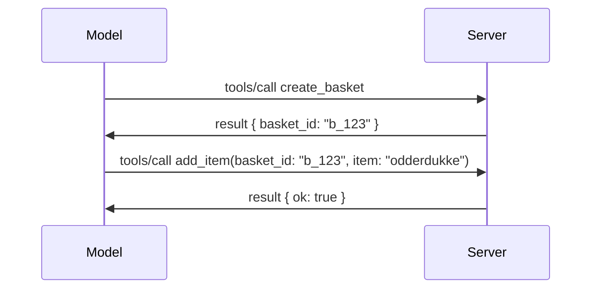

# Hva endres i MCP: Release Candidate 2026-07-28

> **Status:** Release Candidate. Spesifikasjonen `2026-07-28` er ikke endelig på tidspunktet for skriving. Den ble annonsert 21. mai 2026, og skal lanseres 28. juli 2026. Alt i denne leksjonen beskriver release candidate; sjekk [utkastspesifikasjonen](https://modelcontextprotocol.io/specification/draft) og dens [endringslogg](https://modelcontextprotocol.io/specification/draft/changelog) for siste status før du bygger mot den. Resten av dette læreplanmaterialet er skrevet mot dagens stabile utgivelse, **MCP Specification 2025-11-25**, og vil bli oppdatert når `2026-07-28` lanseres.

## Oversikt

`2026-07-28` er den største revisjonen av MCP siden lansering. Seks Specification Enhancement Proposals (SEPs) fjerner protkollnivåsessions og gjør MCP stateless på transportlaget, utvidelser blir en førsteklasses, versjonert mekanisme, og flere funksjoner du har lært tidligere i denne læreplanen (Roots, Sampling, Logging) markeres som deprecated under en ny livssykluspolitikk. Denne leksjonen oppsummerer hva som endres, hvorfor det er viktig og hva det betyr for koden du allerede har skrevet mot `2025-11-25`.

Kilde: [The 2026-07-28 MCP Specification Release Candidate](https://blog.modelcontextprotocol.io/posts/2026-07-28-release-candidate/) (Model Context Protocol Blog, David Soria Parra og Den Delimarsky).

## Læringsmål

Etter denne leksjonen skal du kunne:

- Forklare hvorfor MCP går over til en stateless protokollkjerne og hvilket problem det løser for horisontalt skalerte distribusjoner.
- Beskrive hvordan `initialize`/`initialized` handshake og `Mcp-Session-Id` header blir erstattet.
- Identifisere de nye `Mcp-Method` og `Mcp-Name` headerne og `ttlMs`/`cacheScope` caching metadata.
- Gjenkjenne Extensions-rammeverket og de to utvidelsene som følger med denne utgivelsen: MCP Apps og Tasks.
- Liste opp de seks autorisasjons-SEPene som forsterker OAuth 2.0 / OIDC-samsvar.
- Identifisere hvilke kjernefunksjoner (Roots, Sampling, Logging) som nå er deprecated, og hva det betyr i praksis.
- Forklare endringen til Full JSON Schema 2020-12 for verktøyets `inputSchema`/`outputSchema`.

## En Stateless Protokoll

Hovedendringen: MCP blir stateless på protokollaget.

### Før (2025-11-25): sessions binder deg til én serverinstans

Å kalle et verktøy over Streamable HTTP starter med en `initialize` handshake. Serveren svarer med en `Mcp-Session-Id` header som hver etterfølgende forespørsel må bære:

```http
POST /mcp HTTP/1.1
Mcp-Session-Id: 1868a90c-3a3f-4f5b
Content-Type: application/json

{"jsonrpc":"2.0","id":2,"method":"tools/call",
 "params":{"name":"search","arguments":{"q":"otters"}}}
```

Fordi session er bundet til den serverinstansen som opprettet den, trenger horisontalt skalerte distribusjoner **sticky routing** på lastbalansereren og en **delt session store** på tvers av instansene.

### Etter (2026-07-28): hver forespørsel er selvstendig

```http
POST /mcp HTTP/1.1
MCP-Protocol-Version: 2026-07-28
Mcp-Method: tools/call
Mcp-Name: search
Content-Type: application/json

{"jsonrpc":"2.0","id":1,"method":"tools/call",
 "params":{"name":"search","arguments":{"q":"otters"},
           "_meta":{"io.modelcontextprotocol/clientInfo":{"name":"my-app","version":"1.0"}}}}
```

Enhver serverinstans kan håndtere denne forespørselen. Viktige endringer:

- **`initialize`/`initialized` handshake fjernes** ([SEP-2575](https://github.com/modelcontextprotocol/modelcontextprotocol/pull/2575)). Protokollversjon, klientinfo og klientkapabiliteter flyttes inn i `_meta` på hver forespørsel. En ny `server/discover` metode lar en klient hente serverkapabiliteter på forhånd ved behov.
- **`Mcp-Session-Id` header og protokollnivå session fjernes** ([SEP-2567](https://github.com/modelcontextprotocol/modelcontextprotocol/pull/2567)). Sticky routing og delte session stores er ikke lenger nødvendig på protokollaget.

### Stateless protokoll, stateful applikasjoner

Fjerning av protokollnivå session betyr ikke at serveren din ikke kan være stateful. Det anbefalte mønsteret er det samme som HTTP-APIer alltid har brukt: opprett en eksplisitt håndtak (en `basket_id`, en `browser_id`) fra ett verktøykall, og la modellen sende dette håndtaket tilbake som et vanlig argument i senere kall.



Dette gjør staten synlig og rimelig for modellen i stedet for å skjule den i transportmetadata, og lar enhver serverinstans håndtere ethvert kall.

### Server-til-klient forespørsler, omstrukturert

En stateless protokoll trenger fortsatt en måte for en server å be klienten om noe midt i et kall (for eksempel en elicitation prompt):

- **Serverinitierte forespørsler kan bare utstedes mens serveren aktivt behandler en klientforespørsel** ([SEP-2260](https://github.com/modelcontextprotocol/modelcontextprotocol/pull/2260)) — tidligere en anbefaling, nå et krav. En bruker blir aldri bedt om noe uten forvarsel.
- **Multi Round-Trip Requests** ([SEP-2322](https://github.com/modelcontextprotocol/modelcontextprotocol/pull/2322)) erstatter det å holde en SSE-strøm åpen. I stedet returnerer serveren et `InputRequiredResult`:

  ```json
  {
    "resultType": "inputRequired",
    "inputRequests": {
      "confirm": {
        "type": "elicitation",
        "message": "Delete 3 files?",
        "schema": { "type": "boolean" }
      }
    },
    "requestState": "eyJzdGVwIjoxLCJmaWxlcyI6WyJhIiwiYiIsImMiXX0="
  }
  ```

  Klienten samler svarene og sender det opprinnelige kallet på nytt med `inputResponses` pluss det ekkoede `requestState`. Enhver serverinstans kan ta opp forsøket fordi alt som trengs ligger i nyttelasten.

### Rutbar, cachebar, sporbart

Tre mindre endringer gjør stateless trafikk enklere å drifte:

- **`Mcp-Method` og `Mcp-Name` headere kreves på Streamable HTTP** ([SEP-2243](https://github.com/modelcontextprotocol/modelcontextprotocol/pull/2243)), slik at lastbalanserere, gateway-er og rate limiters kan rute på operasjonen uten å inspisere JSON-kroppen. Servere avviser forespørsler hvor headere og kropp ikke stemmer overens.
- **`tools/list` og ressursleseresultater har med `ttlMs` og `cacheScope`** ([SEP-2549](https://github.com/modelcontextprotocol/modelcontextprotocol/pull/2549)), modellert etter HTTP `Cache-Control`. Klienter vet hvor lenge et listresultat er ferskt, og om det er trygt å dele på tvers av brukere, uten å trenge en langvarig SSE-strøm for å lære om endringer.
- **W3C Trace Context-propagasjon i `_meta` er dokumentert** ([SEP-414](https://github.com/modelcontextprotocol/modelcontextprotocol/pull/414)), og fikser nøkkelnavnene `traceparent`, `tracestate` og `baggage`, slik at en distribuert trace kan følge et kall på tvers av klient-SDK, MCP-server og nedstrøms systemer i en [OpenTelemetry](https://opentelemetry.io/)-kompatibel backend.

## Utvidelser Blir Førsteklasses

Utvidelser eksisterte uformelt i `2025-11-25`. [SEP-2133](https://github.com/modelcontextprotocol/modelcontextprotocol/pull/2133) formaliserer dem:

- Utvidelser identifiseres med reverse-DNS IDer.
- De forhandles gjennom et `extensions`-kart på klient- og serverkapabiliteter.
- De lever i egne `ext-*`-repos med delegerte vedlikeholdere og versjoneres uavhengig av kjernespecifikasjonen.
- En ny Extensions Track i SEP-prosessen gir dem en sti fra eksperimentell til offisiell.

Denne utgivelsen leverer to offisielle utvidelser.

### MCP Apps: server-renderte brukergrensesnitt

[MCP Apps](https://blog.modelcontextprotocol.io/posts/2026-01-26-mcp-apps/) ([SEP-1865](https://github.com/modelcontextprotocol/modelcontextprotocol/pull/1865)) lar servere levere interaktive HTML-grensesnitt som hosts rendrer i en sandkasse-iframe. Verktøy erklærer sine UI-maler på forhånd så hosts kan forhåndslaste, cache og sikkerhetsvurdere dem før noe kjører. Du har allerede dekket det grunnleggende i [Leksjon 15: MCP Apps](../03-GettingStarted/15-mcp-apps/README.md) — under Extensions-rammeverket er MCP Apps nå formelt en utvidelse i stedet for en eksperimentell kjernefunksjon.

### Tasks går over til utvidelse

Tasks ble levert som en eksperimentell kjernefunksjon i `2025-11-25`. Bruk i produksjon avdekket nok redesign at riktig hjem for den er en utvidelse: [Tasks-utvidelsen](https://github.com/modelcontextprotocol/modelcontextprotocol/pull/2663) omformer livssyklusen rundt den stateless modellen — en server kan svare `tools/call` med et task-håndtak, og klienten styrer fremdriften med `tasks/get`, `tasks/update` og `tasks/cancel`. Opprettelse av oppgaver er serverstyrt: klienten annonserer utvidelsen, og serveren bestemmer når et kall skal kjøres som en oppgave. `tasks/list` fjernes fullstendig fordi det ikke kan sikres uten sessions.

> **Migrasjonsnotat:** hvis du implementerte den eksperimentelle `2025-11-25` Tasks-APIen, må du migrere til den nye utvidelseslivssyklusen — den er ikke bakoverkompatibel.

## Autorisasjonsforsterkning

Seks SEPer styrker [autorisasjonsspesifikasjonen](https://modelcontextprotocol.io/specification/draft/basic/authorization) for å bedre samsvare med reelle OAuth 2.0 / OpenID Connect distribusjoner:

| SEP | Endring |
|---|---|
| [SEP-2468](https://github.com/modelcontextprotocol/modelcontextprotocol/pull/2468) | Klienter må validere `iss`-parameteren i autorisasjonssvar i henhold til [RFC 9207](https://www.rfc-editor.org/rfc/rfc9207), for å motvirke mix-up angrep vanlige i MCPs enkelt-klient, mange-server mønster. En fremtidig versjon vil kreve avvisning av svar uten `iss`. |
| [SEP-837](https://github.com/modelcontextprotocol/modelcontextprotocol/pull/837) | Klienter deklarerer OpenID Connect `application_type` under Dynamic Client Registration, for å unngå at autorisasjonsservere feilaktig tolker en desktop/CLI-klient som `"web"` og avviser dens localhost redirect URI. |
| [SEP-2352](https://github.com/modelcontextprotocol/modelcontextprotocol/pull/2352) | Klienter binder registrerte legitimasjoner til utstedende autorisasjonsservers `issuer` og må re-registrere når en ressurs flyttes mellom autorisasjonsservere. |
| [SEP-2207](https://github.com/modelcontextprotocol/modelcontextprotocol/pull/2207) | Dokumenterer hvordan man kan be om refresh tokens fra OpenID Connect-lignende autorisasjonsservere. |
| [SEP-2350](https://github.com/modelcontextprotocol/modelcontextprotocol/pull/2350) | Forenkler forklaring av akkumulering av scope ved step-up autorisasjon. |
| [SEP-2351](https://github.com/modelcontextprotocol/modelcontextprotocol/pull/2351) | Forenkler `.well-known` oppdagelses-suffiks. |

Hvis du bygger en autorisasjonsserver for MCP i dag, bør du begynne å levere `iss` på autorisasjonssvar nå — se [02-Security](../02-Security/README.md) for gjeldende autorisasjonsveiledning dette bygger på.

## Roots, Sampling og Logging er Deprecated

Under den nye [feature lifecycle policy](https://github.com/modelcontextprotocol/modelcontextprotocol/pull/2577) ([SEP-2577](https://github.com/modelcontextprotocol/modelcontextprotocol/pull/2577)), flyttes tre kjerneklientprimitiver du lærte om i [Core Concepts](./README.md#roots) til **Deprecated** status:

| Funksjon | Anbefalt erstatning |
|---|---|
| Roots | Verktøyparametere, ressurs-URIer, eller serverkonfigurasjon |
| Sampling | Direkte integrasjon med LLM-leverandørers APIer |
| Logging | `stderr` for stdio-transporter; OpenTelemetry for strukturert observabilitet |

Dette er **bare annotasjonsdepresjoner**: metoder, typer og kapabilitetsflagg fungerer fortsatt i denne utgivelsen og i alle spesifikasjonsversjoner publisert innen ett år etter den. Fjerning av noen av dem krever en separat SEP under livssykluspolitikken — så ingenting brytes i dine eksisterende [Sampling](../03-GettingStarted/14-sampling/README.md) eksempler i dag, men nye servere bør foretrekke erstatningsmønstrene ovenfor.

## Full JSON Schema 2020-12 for Verktøy

Verktøyenes `inputSchema` og `outputSchema` oppgraderes til full [JSON Schema 2020-12](https://json-schema.org/draft/2020-12) ([SEP-2106](https://github.com/modelcontextprotocol/modelcontextprotocol/pull/2106)):

- Inndataschemaer beholder `type: "object"` rotbegrensning, men tillater nå komposisjon (`oneOf`, `anyOf`, `allOf`), kondisjonaler, og referanser (`$ref`, `$defs`).
- Utgangsskjemaer er ubegrensede, og `structuredContent` kan nå være hvilken som helst JSON-verdi, ikke bare et objekt.
- Implementasjoner må ikke automatisk dereferere eksterne `$ref` URIs og bør begrense skjemaets dybde og valideringstid (et denial-of-service hensyn om du validerer skjema server-side).

Separat endres feilkode for manglende ressurs fra MCP-spesifikk `-32002` til JSON-RPC standard `-32602` (Invalid Params) ([SEP-2164](https://github.com/modelcontextprotocol/modelcontextprotocol/pull/2164)). Hvis klienten din sjekker bokstavelig på `-32002` verdien, må du oppdatere den.

## Hvordan Protokollen Utvikler Seg Videre

Denne utgivelsen inneholder bruddendringer, som MCP-vedlikeholderne ikke har til hensikt skal bli normen fremover. Tre styrings-SEPer har som mål å forhindre gjentakelser:

- **Feature lifecycle policy** gir hver funksjon en sti Active → Deprecated → Removed med minst tolv måneder mellom deprecasjon og tidligste mulige fjerning.
- **Extensions framework** lar nye kapabiliteter leveres som opsjonelle utvidelser og stabiliseres der før de eventuelt går inn i kjernespecifikasjonen.
- En Standards Track SEP kan ikke lenger oppnå Final-status før et tilsvarende scenario lander i [conformance suite](https://github.com/modelcontextprotocol/conformance) ([SEP-2484](https://github.com/modelcontextprotocol/modelcontextprotocol/pull/2484)) — den samme suite som [SDK tier system](https://github.com/modelcontextprotocol/modelcontextprotocol/pull/1777) scorer offisielle SDK-er mot.

## Utgivelsestidslinje og validering

- Releasekandidaten ble låst 21. mai 2026.
- Den endelige spesifikasjonen er planlagt til 28. juli 2026.
- Den ti ukers perioden mellom disse lar SDK-vedlikeholdere og klientimplementatører validere endringene mot reelle arbeidsmengder; Tier 1 SDK-er forventes å levere støtte innen denne perioden under [SDK tier system](https://modelcontextprotocol.io/docs/sdk).
- Følg hele settet med endringer i [utkastspesifikasjonen](https://modelcontextprotocol.io/specification/draft) og dens [endringslogg](https://modelcontextprotocol.io/specification/draft/changelog).

## Hva dette betyr for dette læreplanen

Alt du har lært så langt i dette kurset er rettet mot **2025-11-25**, som forblir den gjeldende stabile spesifikasjonen inntil `2026-07-28` lanseres. Konkret:

- **Økter og `initialize` håndtrykket** (dekket i [Core Concepts](./README.md) og [Lesson 6: HTTP Streaming](../03-GettingStarted/06-http-streaming/README.md)) fungerer fortsatt som dokumentert i dag, men forvent at de erstattes av den statsløse forespørselsmodellen ovenfor når du oppgraderer til `2026-07-28`-kompatible SDK-er.
- **Sampling og Roots** (også dekket i [Core Concepts](./README.md)) forblir fullt funksjonelle, men er foreldet — nye design bør foretrekke erstatningsmønstrene listet ovenfor.
- **Den eksperimentelle Tasks-funksjonen**, hvis du har brukt den, må migreres til den nye livssyklusen til Tasks-utvidelsen.
- **MCP-apper** ([Lesson 15](../03-GettingStarted/15-mcp-apps/README.md)) påvirkes ikke i praksis; den flyttes simpelthen under det formelle Extensions-rammeverket.

## Ytterligere ressurser

- [2026-07-28 MCP Specification Release Candidate (blogginnlegg)](https://blog.modelcontextprotocol.io/posts/2026-07-28-release-candidate/)
- [Fremtiden for MCP Transports](https://blog.modelcontextprotocol.io/posts/2025-12-19-mcp-transport-future/)
- [MCP Draft Specification](https://modelcontextprotocol.io/specification/draft)
- [MCP Draft Changelog](https://modelcontextprotocol.io/specification/draft/changelog)
- [SEP-retningslinjer](https://modelcontextprotocol.io/community/sep-guidelines)
- [MCP SDK Tier System](https://modelcontextprotocol.io/docs/sdk)

## Neste steg

Gå tilbake til [Core Concepts](./README.md) eller fortsett til [Security](../02-Security/README.md) for å se hvordan dagens `2025-11-25`-veiledning kobler til det som kommer.

---

<!-- CO-OP TRANSLATOR DISCLAIMER START -->
**Ansvarsfraskrivelse**:
Dette dokumentet er oversatt ved hjelp av AI-oversettelsestjenesten [Co-op Translator](https://github.com/Azure/co-op-translator). Selv om vi streber etter nøyaktighet, vær oppmerksom på at automatiske oversettelser kan inneholde feil eller unøyaktigheter. Det opprinnelige dokumentet på originalspråket skal betraktes som den autoritative kilden. For kritisk informasjon anbefales profesjonell menneskelig oversettelse. Vi er ikke ansvarlige for eventuelle misforståelser eller feiltolkninger som oppstår ved bruk av denne oversettelsen.
<!-- CO-OP TRANSLATOR DISCLAIMER END -->