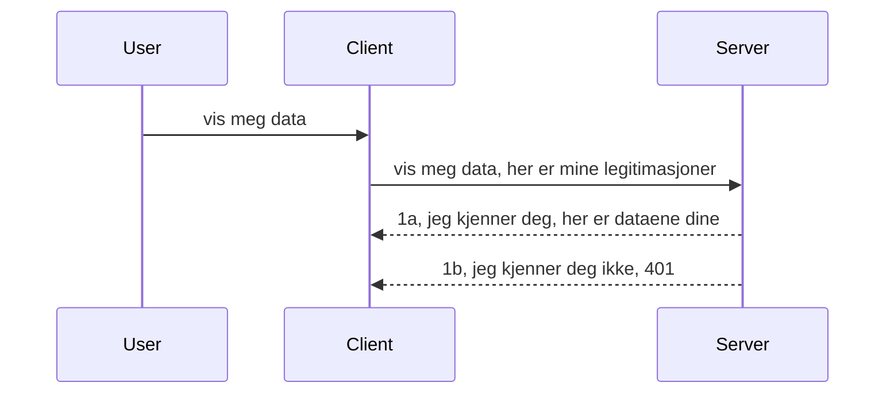

# Enkel autentisering

MCP SDK-er støtter bruk av OAuth 2.1 som for å være helt ærlig er en ganske involvert prosess som involverer konsepter som autorisasjonsserver, ressursserver, posting av legitimasjon, få en kode, bytte koden for en bearer-token inntil du endelig kan få ressursdataene dine. Hvis du ikke er vant til OAuth som er en flott ting å implementere, er det en god idé å begynne med et grunnleggende nivå av autentisering og bygge opp til bedre og bedre sikkerhet. Det er derfor dette kapittelet eksisterer, for å bygge deg opp til mer avansert autentisering.

## Autentisering, hva mener vi?

Autentisering er kort for autentisering og autorisasjon. Ideen er at vi må gjøre to ting:

- **Autentisering**, som er prosessen med å finne ut om vi lar en person komme inn i huset vårt, at de har rett til å være "her", det vil si ha tilgang til ressursserveren vår hvor MCP Server-funksjonene våre lever.
- **Autorisasjon**, er prosessen med å finne ut om en bruker skal ha tilgang til disse spesifikke ressursene de ber om, for eksempel disse ordrene eller disse produktene, eller om de kun har lov til å lese innholdet men ikke slette som et annet eksempel.

## Legitimasjon: hvordan vi forteller systemet hvem vi er

Vel, de fleste webutviklere tenker i form av å levere en legitimasjon til serveren, vanligvis en hemmelighet som sier om de har lov til å være her "Autentisering". Denne legitimasjonen er vanligvis en base64-kodet versjon av brukernavn og passord eller en API-nøkkel som entydig identifiserer en spesifikk bruker.

Dette involverer å sende den via en header kalt "Authorization" slik:

```json
{ "Authorization": "secret123" }
```

Dette kalles vanligvis grunnleggende autentisering. Hvordan den overordnede flyten da fungerer er på følgende måte:



Nå som vi forstår hvordan det fungerer fra et flytperspektiv, hvordan implementerer vi det? Vel, de fleste webservere har et konsept kalt middleware, en kodebit som kjører som en del av forespørselen som kan verifisere legitimasjon, og hvis legitimasjonen er gyldig kan la forespørselen passere gjennom. Hvis forespørselen ikke har gyldig legitimasjon får du en autentiseringsfeil. La oss se hvordan dette kan implementeres:

**Python**

```python
class AuthMiddleware(BaseHTTPMiddleware):
    async def dispatch(self, request, call_next):

        has_header = request.headers.get("Authorization")
        if not has_header:
            print("-> Missing Authorization header!")
            return Response(status_code=401, content="Unauthorized")

        if not valid_token(has_header):
            print("-> Invalid token!")
            return Response(status_code=403, content="Forbidden")

        print("Valid token, proceeding...")
       
        response = await call_next(request)
        # legg til eventuelle kundeoverskrifter eller endre i svaret på en eller annen måte
        return response


starlette_app.add_middleware(CustomHeaderMiddleware)
```

Her har vi:

- Laget en middleware kalt `AuthMiddleware` hvor dens `dispatch`-metode blir kalt av webserveren.
- Lagt til middleware i webserveren:

    ```python
    starlette_app.add_middleware(AuthMiddleware)
    ```

- Skrevet valideringslogikk som sjekker om Authorization-headeren er til stede og om hemmeligheten som sendes er gyldig:

    ```python
    has_header = request.headers.get("Authorization")
    if not has_header:
        print("-> Missing Authorization header!")
        return Response(status_code=401, content="Unauthorized")

    if not valid_token(has_header):
        print("-> Invalid token!")
        return Response(status_code=403, content="Forbidden")
    ```

    hvis hemmeligheten er til stede og gyldig lar vi forespørselen passere ved å kalle `call_next` og returnere responsen.

    ```python
    response = await call_next(request)
    # legg til eventuelle kundehoder eller endre svaret på en eller annen måte
    return response
    ```

Hvordan det fungerer er at hvis det gjøres en webforespørsel mot serveren, vil middleware bli kalt og gitt implementeringen vil den enten la forespørselen passere eller til slutt returnere en feil som indikerer at klienten ikke har tillatelse til å fortsette.

**TypeScript**

Her lager vi en middleware med det populære rammeverket Express og avskjærer forespørselen før den når MCP Server. Her er koden for det:

```typescript
function isValid(secret) {
    return secret === "secret123";
}

app.use((req, res, next) => {
    // 1. Autorisasjonshode til stede?
    if(!req.headers["Authorization"]) {
        res.status(401).send('Unauthorized');
    }
    
    let token = req.headers["Authorization"];

    // 2. Sjekk gyldighet.
    if(!isValid(token)) {
        res.status(403).send('Forbidden');
    }

   
    console.log('Middleware executed');
    // 3. Sender forespørselen videre til neste trinn i behandlingsrøret.
    next();
});
```

I denne koden:

1. Sjekker vi om Authorization-headeren i det hele tatt er til stede, hvis ikke sender vi en 401-feil.
2. Sikrer at legitimasjonen/token er gyldig, hvis ikke sender vi en 403-feil.
3. Til slutt sender vi forespørselen videre i pipeline og returnerer den etterspurte ressursen.

## Øvelse: Implementer autentisering

La oss ta kunnskapen vår og prøve å implementere det. Her er planen:

Server

- Lag en webserver og MCP-instans.
- Implementer en middleware for serveren.

Klient

- Send webforespørsel med legitimasjon via header.

### -1- Lag en webserver og MCP-instans

> **Ser fremover:** TypeScript-eksempelet nedenfor sporer HTTP-transporter i et `transports`-kart nøkkelt av `mcp-session-id`, i henhold til **MCP Specification 2025-11-25**. `2026-07-28` release candidate fjerner `initialize` handshake og sesjons-ID helt, så dette per-sesjons transportkartet blir borte til fordel for tilstandsløse, selvstendige forespørsler. Se [Hva endres i MCP: 2026-07-28 Release Candidate](../../01-CoreConcepts/mcp-2026-07-28-release-candidate.md).

I vårt første steg må vi lage webserverinstansen og MCP Server.

**Python**

Her lager vi en MCP-serverinstans, lager en starlette web-app og hoster den med uvicorn.

```python
# oppretter MCP-server

app = FastMCP(
    name="MCP Resource Server",
    instructions="Resource Server that validates tokens via Authorization Server introspection",
    host=settings["host"],
    port=settings["port"],
    debug=True
)

# oppretter starlette-webapp
starlette_app = app.streamable_http_app()

# serverer app via uvicorn
async def run(starlette_app):
    import uvicorn
    config = uvicorn.Config(
            starlette_app,
            host=app.settings.host,
            port=app.settings.port,
            log_level=app.settings.log_level.lower(),
        )
    server = uvicorn.Server(config)
    await server.serve()

run(starlette_app)
```

I denne koden:

- Lager vi MCP Server.
- Konstruerer starlette web-appen fra MCP Server, `app.streamable_http_app()`.
- Hoster og server web-appen med uvicorn `server.serve()`.

**TypeScript**

Her lager vi en MCP Server-instans.

```typescript
const server = new McpServer({
      name: "example-server",
      version: "1.0.0"
    });

    // ... sett opp serverressurser, verktøy og oppfordringer ...
```

Denne opprettelsen av MCP Server må skje innenfor vår POST /mcp rute, så la oss ta koden ovenfor og flytte den slik:

```typescript
import express from "express";
import { randomUUID } from "node:crypto";
import { McpServer } from "@modelcontextprotocol/sdk/server/mcp.js";
import { StreamableHTTPServerTransport } from "@modelcontextprotocol/sdk/server/streamableHttp.js";
import { isInitializeRequest } from "@modelcontextprotocol/sdk/types.js"

const app = express();
app.use(express.json());

// Kart for å lagre transporter etter sesjons-ID
const transports: { [sessionId: string]: StreamableHTTPServerTransport } = {};

// Håndter POST-forespørsler for klient-til-server kommunikasjon
app.post('/mcp', async (req, res) => {
  // Sjekk for eksisterende sesjons-ID
  const sessionId = req.headers['mcp-session-id'] as string | undefined;
  let transport: StreamableHTTPServerTransport;

  if (sessionId && transports[sessionId]) {
    // Gjenbruk eksisterende transport
    transport = transports[sessionId];
  } else if (!sessionId && isInitializeRequest(req.body)) {
    // Ny initieringsforespørsel
    transport = new StreamableHTTPServerTransport({
      sessionIdGenerator: () => randomUUID(),
      onsessioninitialized: (sessionId) => {
        // Lagre transporten etter sesjons-ID
        transports[sessionId] = transport;
      },
      // DNS-rebinding beskyttelse er som standard deaktivert for bakoverkompatibilitet. Hvis du kjører denne serveren
      // lokalt, sørg for å sette:
      // enableDnsRebindingProtection: true,
      // allowedHosts: ['127.0.0.1'],
    });

    // Rydd opp transport når den lukkes
    transport.onclose = () => {
      if (transport.sessionId) {
        delete transports[transport.sessionId];
      }
    };
    const server = new McpServer({
      name: "example-server",
      version: "1.0.0"
    });

    // ... sett opp serverressurser, verktøy og prompts ...

    // Koble til MCP-serveren
    await server.connect(transport);
  } else {
    // Ugyldig forespørsel
    res.status(400).json({
      jsonrpc: '2.0',
      error: {
        code: -32000,
        message: 'Bad Request: No valid session ID provided',
      },
      id: null,
    });
    return;
  }

  // Håndter forespørselen
  await transport.handleRequest(req, res, req.body);
});

// Gjenbrukbar håndterer for GET- og DELETE-forespørsler
const handleSessionRequest = async (req: express.Request, res: express.Response) => {
  const sessionId = req.headers['mcp-session-id'] as string | undefined;
  if (!sessionId || !transports[sessionId]) {
    res.status(400).send('Invalid or missing session ID');
    return;
  }
  
  const transport = transports[sessionId];
  await transport.handleRequest(req, res);
};

// Håndter GET-forespørsler for server-til-klient varsler via SSE
app.get('/mcp', handleSessionRequest);

// Håndter DELETE-forespørsler for sesjonsavslutning
app.delete('/mcp', handleSessionRequest);

app.listen(3000);
```

Nå ser du hvordan MCP Server-opprettelsen ble flyttet inn i `app.post("/mcp")`.

La oss gå videre til neste steg med å lage middleware slik at vi kan validere den innkommende legitimasjonen.

### -2- Implementer en middleware for serveren

La oss gå videre til middleware-delen. Her skal vi lage en middleware som ser etter en legitimasjon i `Authorization`-headeren og validerer den. Hvis den godtas, vil forespørselen gå videre for å gjøre det den trenger (f.eks liste verktøy, lese en ressurs eller hva enn MCP-funksjonalitet klienten ba om).

**Python**

For å lage middleware må vi lage en klasse som arver fra `BaseHTTPMiddleware`. Det er to interessante elementer:

- Forespørselen `request` , hvor vi leser header-informasjon fra.
- `call_next` callbacken vi må kalle hvis klienten har medbragt en legitimasjon vi godtar.

Først må vi håndtere tilfellet om `Authorization`-header mangler:

```python
has_header = request.headers.get("Authorization")

# ingen overskrift til stede, feiler med 401, ellers fortsetter.
if not has_header:
    print("-> Missing Authorization header!")
    return Response(status_code=401, content="Unauthorized")
```

Her sender vi en 401 Unauthorized melding siden klienten feiler autentisering.

Deretter, hvis en legitimasjon ble sendt inn, må vi sjekke gyldigheten slik:

```python
 if not valid_token(has_header):
    print("-> Invalid token!")
    return Response(status_code=403, content="Forbidden")
```

Legg merke til at vi sender en 403 Forbidden melding ovenfor. La oss se hele middlewaren nedenfor som implementerer alt vi nevnte over:

```python
class AuthMiddleware(BaseHTTPMiddleware):
    async def dispatch(self, request, call_next):

        has_header = request.headers.get("Authorization")
        if not has_header:
            print("-> Missing Authorization header!")
            return Response(status_code=401, content="Unauthorized")

        if not valid_token(has_header):
            print("-> Invalid token!")
            return Response(status_code=403, content="Forbidden")

        print("Valid token, proceeding...")
        print(f"-> Received {request.method} {request.url}")
        response = await call_next(request)
        response.headers['Custom'] = 'Example'
        return response

```

Flott, men hva med `valid_token`-funksjonen? Her er den nedenfor:

```python
# IKKE bruk til produksjon - forbedre det !!
def valid_token(token: str) -> bool:
    # fjern "Bearer " prefikset
    if token.startswith("Bearer "):
        token = token[7:]
        return token == "secret-token"
    return False
```

Dette bør åpenbart forbedres.

VIKTIG: Du bør ALDRI ha hemmeligheter som dette hardkodet i kode. Ideelt bør du hente verdien du sammenligner med fra en datakilde eller fra en IDP (identitetstjenesteleverandør), eller enda bedre, la IDP gjøre valideringen.

**TypeScript**

For å implementere dette med Express, må vi kalle `use`-metoden som tar middleware-funksjoner.

Vi må:

- Interagere med forespørselsvariabelen for å sjekke den sendte legitimasjonen i `Authorization`-feltet.
- Validere legitimasjonen, og hvis den godtas la forespørselen fortsette slik at klientens MCP-forespørsel kan gjøre det den skal (f.eks. liste verktøy, lese ressurs eller annet MCP-relatert).

Her sjekker vi om `Authorization`-headeren er til stede, og hvis ikke stopper vi forespørselen:

```typescript
if(!req.headers["authorization"]) {
    res.status(401).send('Unauthorized');
    return;
}
```

Hvis header ikke sendes i det hele tatt, får du en 401.

Deretter sjekker vi om legitimasjonen er gyldig, hvis ikke stopper vi igjen forespørselen, men med en litt annen melding:

```typescript
if(!isValid(token)) {
    res.status(403).send('Forbidden');
    return;
} 
```

Legg merke til at du nå får en 403-feil.

Her er hele koden:

```typescript
app.use((req, res, next) => {
    console.log('Request received:', req.method, req.url, req.headers);
    console.log('Headers:', req.headers["authorization"]);
    if(!req.headers["authorization"]) {
        res.status(401).send('Unauthorized');
        return;
    }
    
    let token = req.headers["authorization"];

    if(!isValid(token)) {
        res.status(403).send('Forbidden');
        return;
    }  

    console.log('Middleware executed');
    next();
});
```

Vi har satt opp webserveren til å akseptere en middleware som sjekker legitimasjonen som klienten forhåpentligvis sender oss. Hva med klienten selv?

### -3- Send webforespørsel med legitimasjon via header

Vi må sikre at klienten sender legitimasjonen gjennom headeren. Siden vi skal bruke en MCP-klient for å gjøre dette, må vi finne ut hvordan det gjøres.

**Python**

For klienten må vi sende en header med legitimasjonen slik:

```python
# IKKE hardkoding av verdien, ha den minst i en miljøvariabel eller en sikrere lagring
token = "secret-token"

async with streamablehttp_client(
        url = f"http://localhost:{port}/mcp",
        headers = {"Authorization": f"Bearer {token}"}
    ) as (
        read_stream,
        write_stream,
        session_callback,
    ):
        async with ClientSession(
            read_stream,
            write_stream
        ) as session:
            await session.initialize()
      
            # TODO, hva du ønsker gjort i klienten, f.eks. liste verktøy, kalle verktøy osv.
```

Legg merke til hvordan vi fyller `headers`-egenskapen slik ` headers = {"Authorization": f"Bearer {token}"}`.

**TypeScript**

Vi kan løse dette i to trinn:

1. Fylle et konfigurasjonsobjekt med legitimasjonen vår.
2. Sende konfigurasjonsobjektet til transporten.

```typescript

// IKKE hardkod verdien som vist her. Ha den minst som en miljøvariabel og bruk noe som dotenv (i utviklingsmodus).
let token = "secret123"

// definer et klient transport valg-objekt
let options: StreamableHTTPClientTransportOptions = {
  sessionId: sessionId,
  requestInit: {
    headers: {
      "Authorization": "secret123"
    }
  }
};

// send valg-objektet til transporten
async function main() {
   const transport = new StreamableHTTPClientTransport(
      new URL(serverUrl),
      options
   );
```

Her ser du over hvordan vi måtte lage et `options`-objekt og plassere headerne under `requestInit`-egenskapen.

VIKTIG: Hvordan forbedrer vi dette herfra? Vel, dagens implementasjon har noen utfordringer. For det første er det ganske risikabelt å sende legitimasjon slik med mindre du minst har HTTPS. Selv da kan legitimasjonen bli stjålet, så du trenger et system der du enkelt kan tilbakekalle token og legge til ekstra kontroller som hvor i verden den kommer fra, om forespørselen skjer for ofte (bot-lignende oppførsel), kort sagt, det er en hel rekke hensyn.

Det må sies likevel at for svært enkle API-er der du ikke vil at hvem som helst skal kalle API-et ditt uten å være autentisert, er det vi har her et godt utgangspunkt.

Med det sagt, la oss forsøke å styrke sikkerheten litt ved å bruke et standardisert format som JSON Web Token, også kjent som JWT eller «JOT» tokens.

## JSON Web Tokens, JWT

Så, vi prøver å forbedre ting fra å sende veldig enkle legitimasjoner. Hva er de umiddelbare forbedringene vi får ved å adoptere JWT?

- **Sikkerhetsforbedringer**. I grunnleggende autentisering sender du brukernavn og passord som en base64-kodet token (eller en API-nøkkel) om og om igjen, noe som øker risikoen. Med JWT sender du brukernavn og passord og får en token i retur som også er tidsbegrenset, det vil si at den utløper. JWT lar deg enkelt bruke finmasket tilgangskontroll ved hjelp av roller, scopas og tillatelser.
- **Tilstandsløshet og skalerbarhet**. JWT-er er selvinnholdende, de bærer all brukerinformasjon med seg og eliminerer behovet for å lagre sesjonsdata på serversiden. Token kan også valideres lokalt.
- **Interoperabilitet og federasjon**. JWT er sentralt i Open ID Connect og brukes med kjente identitetsleverandører som Entra ID, Google Identity og Auth0. De gjør det også mulig å bruke single sign-on og mye mer som gir bedriftsgrad.
- **Modularitet og fleksibilitet**. JWT kan også brukes med API-gatewayer som Azure API Management, NGINX og flere. De støtter også brukerautentiseringsscenarier og server-til-tjeneste kommunikasjon inkludert imitasjon og delegering.
- **Ytelse og caching**. JWT kan caches etter dekoding, noe som reduserer behovet for parsing. Dette hjelper spesielt med apper med høy trafikk siden det øker gjennomstrømningen og reduserer belastning på infrastrukturen.
- **Avanserte funksjoner**. Det støtter også introspeksjon (sjekke gyldighet på server) og tilbakekalling (gjøre en token ugyldig).

Med alle disse fordelene, la oss se hvordan vi kan ta implementeringen vår til neste nivå.

## Slik gjør vi basisautentisering til JWT

Så, endringene vi må gjøre på et overordnet nivå er å:

- **Lære å konstruere en JWT-token** og gjøre den klar til å sendes fra klient til server.
- **Validere en JWT-token**, og hvis den er gyldig, la klienten få tilgang til våre ressurser.
- **Sikker lagring av token**. Hvordan vi lagrer denne token.
- **Beskytt rutene**. Vi må beskytte rutene, i vårt tilfelle beskytte ruter og spesifikke MCP-funksjoner.
- **Legg til refresh tokens**. Sikre at vi lager kortlivede tokens, men også refresh tokens som er langlivede og kan brukes til å skaffe nye tokens hvis de utløper. Sørg også for at det finnes et refresh-endepunkt og en rotasjonsstrategi.

### -1- Konstruer en JWT-token

Først og fremst har en JWT-token følgende deler:

- **header**, algoritmen som brukes og token-typen.
- **payload**, claims, som sub (brukeren eller enheten token representerer. I en autentiseringsscenario er dette vanligvis bruker-ID), exp (når den utløper), role (rollen)
- **signature**, signert med en hemmelighet eller privat nøkkel.

Til dette må vi konstruere header, payload og den kodede token.

**Python**

```python

import jwt
import jwt
from jwt.exceptions import ExpiredSignatureError, InvalidTokenError
import datetime

# Hemmelig nøkkel brukt til å signere JWT-en
secret_key = 'your-secret-key'

header = {
    "alg": "HS256",
    "typ": "JWT"
}

# brukerinfoen, dens krav og utløpstid
payload = {
    "sub": "1234567890",               # Emne (bruker-ID)
    "name": "User Userson",                # Tilpasset krav
    "admin": True,                     # Tilpasset krav
    "iat": datetime.datetime.utcnow(),# Utstedt ved
    "exp": datetime.datetime.utcnow() + datetime.timedelta(hours=1)  # Utløp
}

# kodes
encoded_jwt = jwt.encode(payload, secret_key, algorithm="HS256", headers=header)
```

I koden ovenfor har vi:

- Definert en header som bruker HS256 som algoritme og type JWT.
- Konstruert en payload som inneholder et subject eller bruker-ID, et brukernavn, en rolle, når den ble utstedt og når den skal utløpe, og dermed implementerer den tidsbegrensede aspekten vi nevnte tidligere.

**TypeScript**

Her trenger vi noen avhengigheter som hjelper oss å konstruere JWT-token.

Avhengigheter

```sh

npm install jsonwebtoken
npm install --save-dev @types/jsonwebtoken
```

Nå som vi har det på plass, la oss lage header, payload og gjennom dette lage den kodede token.

```typescript
import jwt from 'jsonwebtoken';

const secretKey = 'your-secret-key'; // Bruk miljøvariabler i produksjon

// Definer nyttelasten
const payload = {
  sub: '1234567890',
  name: 'User usersson',
  admin: true,
  iat: Math.floor(Date.now() / 1000), // Utstedt ved
  exp: Math.floor(Date.now() / 1000) + 60 * 60 // Utløper om 1 time
};

// Definer overskriften (valgfritt, jsonwebtoken setter standarder)
const header = {
  alg: 'HS256',
  typ: 'JWT'
};

// Lag tokenet
const token = jwt.sign(payload, secretKey, {
  algorithm: 'HS256',
  header: header
});

console.log('JWT:', token);
```

Denne token er:

Signert med HS256
Gyldig i 1 time
Inkluderer claims som sub, name, admin, iat og exp.

### -2- Validere en token

Vi må også validere en token, dette er noe vi bør gjøre på server for å sikre at det klienten sender oss faktisk er gyldig. Det er mange kontroller vi bør gjøre her fra å validere strukturen til gyldigheten. Du oppfordres også til å legge til sjekker for om brukeren er i systemet ditt og mer.

For å validere en token må vi dekode den slik at vi kan lese den og deretter begynne å sjekke gyldigheten:

**Python**

```python

# Dekod og verifiser JWT
try:
    decoded = jwt.decode(token, secret_key, algorithms=["HS256"])
    print("✅ Token is valid.")
    print("Decoded claims:")
    for key, value in decoded.items():
        print(f"  {key}: {value}")
except ExpiredSignatureError:
    print("❌ Token has expired.")
except InvalidTokenError as e:
    print(f"❌ Invalid token: {e}")

```

I denne koden kaller vi `jwt.decode` med token, hemmelig nøkkel og valgt algoritme som input. Merk hvordan vi bruker en try-catch-konstruksjon ettersom en mislykket validering fører til at en feil kastes.

**TypeScript**

Her trenger vi å kalle `jwt.verify` for å få en dekodet versjon av token som vi kan analysere videre. Hvis dette kallet feiler, betyr det at strukturen til token er feil eller at det ikke lenger er gyldig.

```typescript

try {
  const decoded = jwt.verify(token, secretKey);
  console.log('Decoded Payload:', decoded);
} catch (err) {
  console.error('Token verification failed:', err);
}
```

MERK: som nevnt tidligere bør vi utføre ytterligere kontroller for å sikre at denne token peker på en bruker i vårt system, og sikre at brukeren har de rettighetene den påstår å ha.

Neste, la oss se på rollebasert tilgangskontroll, også kjent som RBAC.

## Legge til rollebasert tilgangskontroll

Ideen er at vi ønsker å uttrykke at forskjellige roller har forskjellige tillatelser. For eksempel antar vi at en admin kan gjøre alt og at en vanlig bruker kan lese/skrive og at en gjest kun kan lese. Derfor er her noen mulige tillatelsesnivåer:

- Admin.Write 
- User.Read
- Guest.Read

La oss se på hvordan vi kan implementere slik kontroll med mellomvare. Mellomvarer kan legges til per rute samt for alle ruter.

**Python**

```python
from starlette.middleware.base import BaseHTTPMiddleware
from starlette.responses import JSONResponse
import jwt

# IKKE ha hemmeligheten i koden, dette er kun for demonstrasjonsformål. Les den fra et sikkert sted.
SECRET_KEY = "your-secret-key" # legg dette i en miljøvariabel
REQUIRED_PERMISSION = "User.Read"

class JWTPermissionMiddleware(BaseHTTPMiddleware):
    async def dispatch(self, request, call_next):
        auth_header = request.headers.get("Authorization")
        if not auth_header or not auth_header.startswith("Bearer "):
            return JSONResponse({"error": "Missing or invalid Authorization header"}, status_code=401)

        token = auth_header.split(" ")[1]
        try:
            decoded = jwt.decode(token, SECRET_KEY, algorithms=["HS256"])
        except jwt.ExpiredSignatureError:
            return JSONResponse({"error": "Token expired"}, status_code=401)
        except jwt.InvalidTokenError:
            return JSONResponse({"error": "Invalid token"}, status_code=401)

        permissions = decoded.get("permissions", [])
        if REQUIRED_PERMISSION not in permissions:
            return JSONResponse({"error": "Permission denied"}, status_code=403)

        request.state.user = decoded
        return await call_next(request)


```

Det finnes noen forskjellige måter å legge til mellomvare som nedenfor:

```python

# Alternativ 1: legg til middleware mens du bygger starlette app
middleware = [
    Middleware(JWTPermissionMiddleware)
]

app = Starlette(routes=routes, middleware=middleware)

# Alternativ 2: legg til middleware etter at starlette app allerede er bygget
starlette_app.add_middleware(JWTPermissionMiddleware)

# Alternativ 3: legg til middleware per rute
routes = [
    Route(
        "/mcp",
        endpoint=..., # håndterer
        middleware=[Middleware(JWTPermissionMiddleware)]
    )
]
```

**TypeScript**

Vi kan bruke `app.use` og en mellomvare som kjører for alle forespørsler.

```typescript
app.use((req, res, next) => {
    console.log('Request received:', req.method, req.url, req.headers);
    console.log('Headers:', req.headers["authorization"]);

    // 1. Sjekk om autorisasjonsheader er sendt

    if(!req.headers["authorization"]) {
        res.status(401).send('Unauthorized');
        return;
    }
    
    let token = req.headers["authorization"];

    // 2. Sjekk om token er gyldig
    if(!isValid(token)) {
        res.status(403).send('Forbidden');
        return;
    }  

    // 3. Sjekk om tokenbruker eksisterer i systemet vårt
    if(!isExistingUser(token)) {
        res.status(403).send('Forbidden');
        console.log("User does not exist");
        return;
    }
    console.log("User exists");

    // 4. Verifiser at token har riktige tillatelser
    if(!hasScopes(token, ["User.Read"])){
        res.status(403).send('Forbidden - insufficient scopes');
    }

    console.log("User has required scopes");

    console.log('Middleware executed');
    next();
});

```

Det er ganske mange ting vi kan la vår mellomvare gjøre, og som vår mellomvare BØR gjøre, nemlig:

1. Sjekk om autorisasjonsheader er tilstede
2. Sjekk om token er gyldig, vi kaller `isValid` som er en metode vi har skrevet som sjekker integriteten og gyldigheten til JWT token.
3. Verifiser at brukeren eksisterer i vårt system, dette bør vi sjekke.

   ```typescript
    // brukere i DB
   const users = [
     "user1",
     "User usersson",
   ]

   function isExistingUser(token) {
     let decodedToken = verifyToken(token);

     // TODO, sjekk om bruker finnes i DB
     return users.includes(decodedToken?.name || "");
   }
   ```

   Ovenfor har vi laget en veldig enkel `users`-liste, som åpenbart bør være i en database.

4. I tillegg bør vi også sjekke at token har riktige tillatelser.

   ```typescript
   if(!hasScopes(token, ["User.Read"])){
        res.status(403).send('Forbidden - insufficient scopes');
   }
   ```

   I koden ovenfor fra mellomvaren sjekker vi at token inneholder User.Read-tillatelse, hvis ikke sender vi en 403-feil. Nedenfor er hjelpefunksjonen `hasScopes`.

   ```typescript
   function hasScopes(scope: string, requiredScopes: string[]) {
     let decodedToken = verifyToken(scope);
    return requiredScopes.every(scope => decodedToken?.scopes.includes(scope));
  }
   ```

Have a think which additional checks you should be doing, but these are the absolute minimum of checks you should be doing.

Using Express as a web framework is a common choice. There are helpers library when you use JWT so you can write less code.

- `express-jwt`, helper library that provides a middleware that helps decode your token.
- `express-jwt-permissions`, this provides a middleware `guard` that helps check if a certain permission is on the token.

Here's what these libraries can look like when used:

```typescript
const express = require('express');
const jwt = require('express-jwt');
const guard = require('express-jwt-permissions')();

const app = express();
const secretKey = 'your-secret-key'; // put this in env variable

// Decode JWT and attach to req.user
app.use(jwt({ secret: secretKey, algorithms: ['HS256'] }));

// Check for User.Read permission
app.use(guard.check('User.Read'));

// multiple permissions
// app.use(guard.check(['User.Read', 'Admin.Access']));

app.get('/protected', (req, res) => {
  res.json({ message: `Welcome ${req.user.name}` });
});

// Error handler
app.use((err, req, res, next) => {
  if (err.code === 'permission_denied') {
    return res.status(403).send('Forbidden');
  }
  next(err);
});

```

Nå har du sett hvordan mellomvare kan brukes både til autentisering og autorisasjon, men hva med MCP, endrer det hvordan vi gjør auth? La oss finne ut i neste seksjon.

### -3- Legg til RBAC for MCP

Du har så langt sett hvordan du kan legge til RBAC via mellomvare, men for MCP finnes det ikke en enkel måte å legge til RBAC per MCP-funksjon, så hva gjør vi? Vel, vi må bare legge inn kode som denne som sjekker i dette tilfellet om klienten har rettigheter til å kalle et bestemt verktøy:

Du har noen forskjellige valg for hvordan du kan oppnå RBAC per funksjon, her er noen:

- Legg til en sjekk for hvert verktøy, ressurs, prompt der du trenger å sjekke tillatelsesnivå.

   **python**

   ```python
   @tool()
   def delete_product(id: int):
      try:
          check_permissions(role="Admin.Write", request)
      catch:
        pass # klienten mislyktes i autorisasjon, kast autorisasjonsfeil
   ```

   **typescript**

   ```typescript
   server.registerTool(
    "delete-product",
    {
      title: Delete a product",
      description: "Deletes a product",
      inputSchema: { id: z.number() }
    },
    async ({ id }) => {
      
      try {
        checkPermissions("Admin.Write", request);
        // todo, send id til productService og remote entry
      } catch(Exception e) {
        console.log("Authorization error, you're not allowed");  
      }

      return {
        content: [{ type: "text", text: `Deletected product with id ${id}` }]
      };
    }
   );
   ```


- Bruk en avansert servertilnærming og request handlers slik at du minimerer hvor mange steder du må gjøre sjekken.

   **Python**

   ```python
   
   tool_permission = {
      "create_product": ["User.Write", "Admin.Write"],
      "delete_product": ["Admin.Write"]
   }

   def has_permission(user_permissions, required_permissions) -> bool:
      # user_permissions: liste over tillatelser brukeren har
      # required_permissions: liste over tillatelser som kreves for verktøyet
      return any(perm in user_permissions for perm in required_permissions)

   @server.call_tool()
   async def handle_call_tool(
     name: str, arguments: dict[str, str] | None
   ) -> list[types.TextContent]:
    # Anta at request.user.permissions er en liste over tillatelser for brukeren
     user_permissions = request.user.permissions
     required_permissions = tool_permission.get(name, [])
     if not has_permission(user_permissions, required_permissions):
        # Kast feil "Du har ikke tillatelse til å bruke verktøyet {name}"
        raise Exception(f"You don't have permission to call tool {name}")
     # fortsett og kall verktøyet
     # ...
   ```   
   

   **TypeScript**

   ```typescript
   function hasPermission(userPermissions: string[], requiredPermissions: string[]): boolean {
       if (!Array.isArray(userPermissions) || !Array.isArray(requiredPermissions)) return false;
       // Returner true hvis brukeren har minst én nødvendig tillatelse
       
       return requiredPermissions.some(perm => userPermissions.includes(perm));
   }
  
   server.setRequestHandler(CallToolRequestSchema, async (request) => {
      const { params: { name } } = request;
  
      let permissions = request.user.permissions;
  
      if (!hasPermission(permissions, toolPermissions[name])) {
         return new Error(`You don't have permission to call ${name}`);
      }
  
      // fortsett..
   });
   ```

   Merk at du må sørge for at din mellomvare tilordner en dekodet token til forespørselens bruker-egenskap slik at koden ovenfor blir enkel.

### Oppsummering

Nå som vi har diskutert hvordan man kan legge til støtte for RBAC generelt og for MCP spesielt, er det på tide å prøve å implementere sikkerhet på egenhånd for å sikre at du har forstått konseptene som er presentert for deg.

## Oppgave 1: Bygg en mcp-server og mcp-klient ved bruk av grunnleggende autentisering

Her skal du ta det du har lært om å sende legitimasjon gjennom headere.

## Løsning 1

[Løsning 1](./code/basic/README.md)

## Oppgave 2: Oppgrader løsningen fra Oppgave 1 til å bruke JWT

Ta den første løsningen, men denne gangen la oss forbedre den.

I stedet for å bruke Basic Auth, la oss bruke JWT.

## Løsning 2

[Løsning 2](./solution/jwt-solution/README.md)

## Utfordring

Legg til RBAC per verktøy slik vi beskriver i seksjonen "Legg til RBAC for MCP".

## Oppsummering

Du har forhåpentligvis lært mye i dette kapitlet, fra ingen sikkerhet i det hele tatt, til grunnleggende sikkerhet, til JWT og hvordan det kan legges til MCP.

Vi har bygget et solid fundament med tilpassede JWT-er, men ettersom vi skalerer, beveger vi oss mot en standardbasert identitetsmodell. Å ta i bruk en IdP som Entra eller Keycloak lar oss overføre utstedelse, validering og livsløpshåndtering av token til en pålitelig plattform — som frigjør oss til å fokusere på app-logikk og brukeropplevelse.

For det har vi et mer [avansert kapittel om Entra](../../05-AdvancedTopics/mcp-security-entra/README.md)

## Hva nå

- Neste: [Sette opp MCP-verter](../12-mcp-hosts/README.md)

---

<!-- CO-OP TRANSLATOR DISCLAIMER START -->
**Ansvarsfraskrivelse**:
Dette dokumentet er oversatt ved hjelp av AI-oversettelsestjenesten [Co-op Translator](https://github.com/Azure/co-op-translator). Selv om vi streber etter nøyaktighet, vær oppmerksom på at automatiske oversettelser kan inneholde feil eller unøyaktigheter. Det opprinnelige dokumentet på originalspråket skal betraktes som den autoritative kilden. For kritisk informasjon anbefales profesjonell menneskelig oversettelse. Vi er ikke ansvarlige for eventuelle misforståelser eller feiltolkninger som oppstår ved bruk av denne oversettelsen.
<!-- CO-OP TRANSLATOR DISCLAIMER END -->