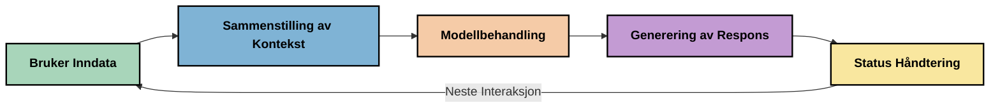
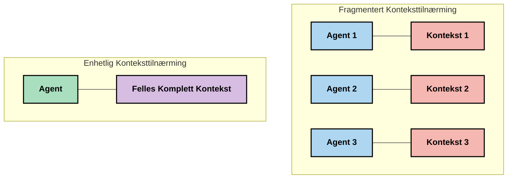
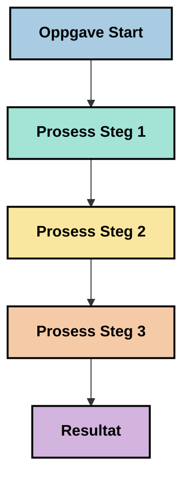
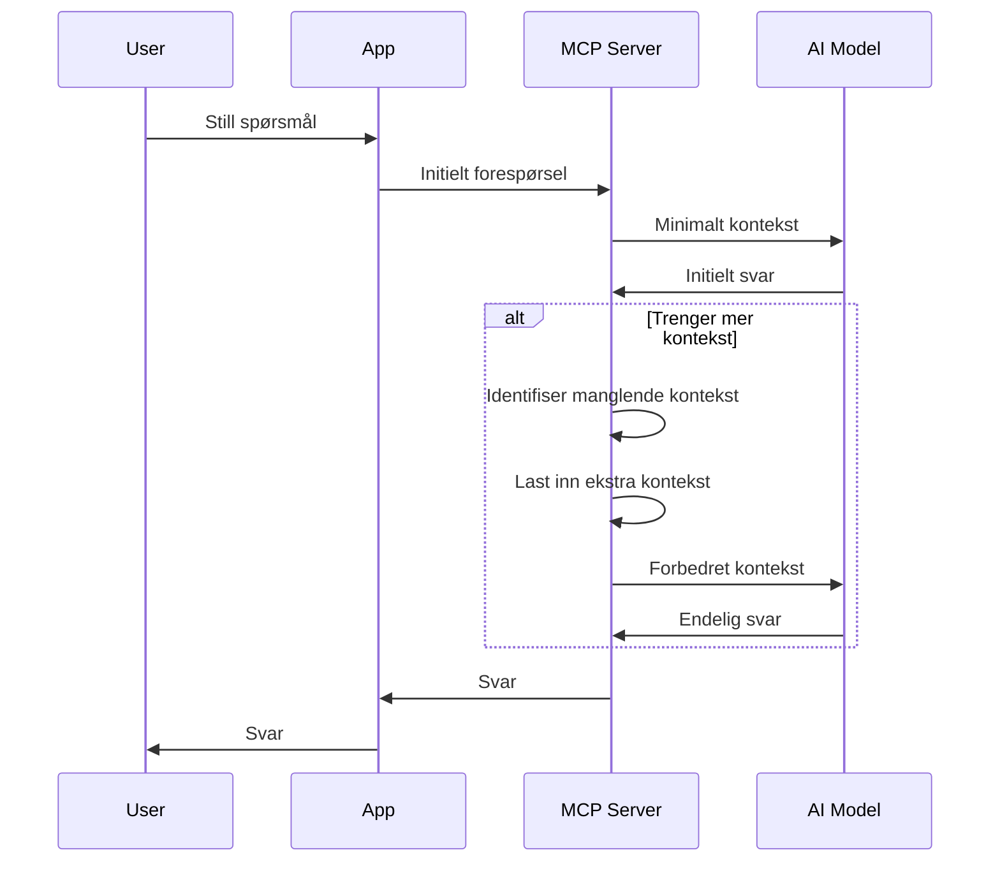
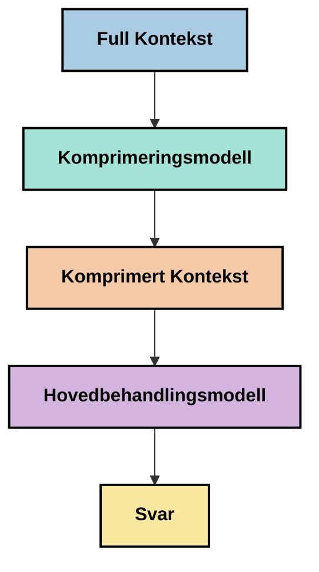
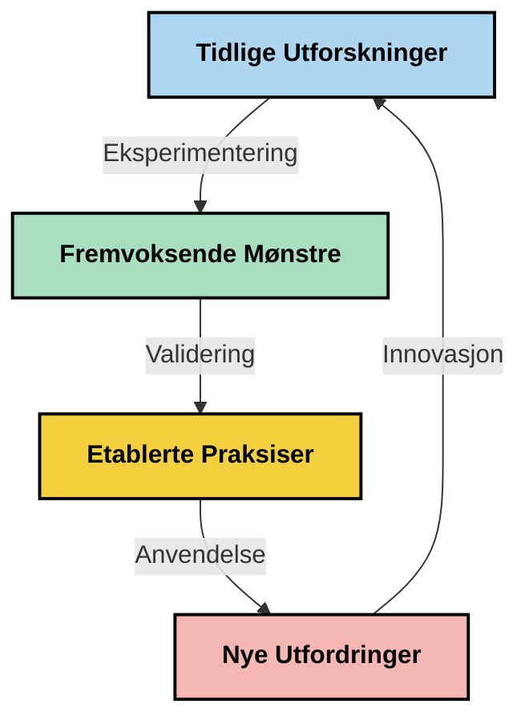

# Kontekstingeniørfag: Et Fremvoksende Konsept i MCP-Økosystemet

## Oversikt

Kontekstingeniørfag er et fremvoksende konsept innen AI-området som utforsker hvordan informasjon struktureres, leveres og opprettholdes gjennom interaksjoner mellom klienter og AI-tjenester. Etter hvert som Model Context Protocol (MCP)-økosystemet utvikler seg, blir det stadig viktigere å forstå hvordan man effektivt håndterer kontekst. Denne modulen introduserer konseptet kontekstingeniørfag og utforsker dets potensielle bruksområder i MCP-implementasjoner.

## Læringsmål

Ved slutten av denne modulen vil du kunne:

- Forstå det fremvoksende konseptet kontekstingeniørfag og dets potensielle rolle i MCP-applikasjoner
- Identifisere viktige utfordringer i kontekststyring som MCP-protokolldesignet adresserer
- Utforske teknikker for å forbedre modellens ytelse gjennom bedre kontekstbehandling
- Vurdere tilnærminger for å måle og evaluere konsteksteffektivitet
- Anvende disse fremvoksende konseptene for å forbedre AI-opplevelser gjennom MCP-rammeverket

## Introduksjon til kontekstingeniørfag

Kontekstingeniørfag er et fremvoksende konsept som fokuserer på bevisst design og styring av informasjonsflyt mellom brukere, applikasjoner og AI-modeller. I motsetning til etablerte felt som promptengineering, blir kontekstingeniørfag fortsatt definert av praktikere når de arbeider med å løse de unike utfordringene ved å gi AI-modeller riktig informasjon til rett tid.

Etter hvert som store språkmodeller (LLMs) har utviklet seg, har viktigheten av kontekst blitt stadig mer tydelig. Kvaliteten, relevansen og strukturen på konteksten vi tilbyr påvirker direkte modellens output. Kontekstingeniørfag utforsker dette forholdet og søker å utvikle prinsipper for effektiv kontekststyring.

> "I 2025 er modellene der ute ekstremt intelligente. Men selv de smarteste mennesker vil ikke kunne gjøre jobben effektivt uten konteksten av hva de blir bedt om å gjøre… 'Kontekstingeniørfag' er neste nivå av promptengineering. Det handler om å gjøre dette automatisk i et dynamisk system." — Walden Yan, Cognition AI

Kontekstingeniørfag kan omfatte:

1. **Kontekstvalg**: Bestemme hvilken informasjon som er relevant for en gitt oppgave  
2. **Kontekststrukturering**: Organisere informasjon for å maksimere modellforståelse  
3. **Kontekstlevering**: Optimalisere hvordan og når informasjon sendes til modeller  
4. **Kontekstvedlikehold**: Håndtere tilstand og utvikling av kontekst over tid  
5. **Kontestvurdering**: Måle og forbedre effektiviteten av konteksten  

Disse fokusområdene er spesielt relevante for MCP-økosystemet, som gir en standardisert måte for applikasjoner å gi kontekst til LLM-er.

## Perspektivet på kontekstreisen

En måte å visualisere kontekstingeniørfag på er å spore reisen informasjon tar gjennom et MCP-system:


  
### Viktige stadier i kontekstreisen:

1. **Brukerinput**: Rå informasjon fra brukeren (tekst, bilder, dokumenter)  
2. **Kontekstsammensetning**: Kombinerer brukerinput med systemkontekst, samtalehistorikk og annen hentet informasjon  
3. **Modellbehandling**: AI-modellen behandler den sammensatte konteksten  
4. **Svargenerering**: Modellen produserer output basert på den leverte konteksten  
5. **Tilstandsstyring**: Systemet oppdaterer sin interne tilstand basert på interaksjonen  

Dette perspektivet fremhever den dynamiske naturen til kontekst i AI-systemer og reiser viktige spørsmål om hvordan man best kan håndtere informasjon i hvert stadium.

## Fremvoksende prinsipper i kontekstingeniørfag

Etter hvert som feltet kontekstingeniørfag tar form, begynner noen tidlige prinsipper å dukke opp hos praktikere. Disse prinsippene kan bidra til å informere MCP-implementeringsvalg:

### Prinsipp 1: Del konteksten fullstendig

Kontekst bør deles fullstendig mellom alle komponenter i et system, heller enn å være fragmentert på tvers av flere agenter eller prosesser. Når kontekst distribueres, kan beslutninger gjort i én del av systemet komme i konflikt med beslutninger gjort andre steder.


  
I MCP-applikasjoner antyder dette å designe systemer hvor konteksten flyter sømløst gjennom hele kjeden, i stedet for å bli oppdelt.

### Prinsipp 2: Anerkjenn at handlinger bærer underforståtte beslutninger

Hver handling en modell utfører inneholder underforståtte beslutninger om hvordan konteksten skal tolkes. Når flere komponenter handler basert på forskjellige kontekster, kan disse underforståtte beslutningene komme i konflikt, noe som fører til inkonsistente resultater.

Dette prinsippet har viktige implikasjoner for MCP-applikasjoner:  
- Foretrekk lineær behandling av komplekse oppgaver fremfor parallell utførelse med fragmentert kontekst  
- Sørg for at alle beslutningspunkter har tilgang til samme kontekstuelle informasjon  
- Design systemer der senere steg kan se hele konteksten til tidligere beslutninger  

### Prinsipp 3: Balansér kontekstdybde med vindusbegrensninger

Etter hvert som samtaler og prosesser blir lengre, vil kontekstvinduene til slutt flyte over. Effektiv kontekstingeniørfag utforsker tilnærminger for å håndtere denne spenningen mellom omfattende kontekst og tekniske begrensninger.

Mulige tilnærminger som utforskes inkluderer:  
- Kontekstkomprimering som beholder essensiell informasjon samtidig som token-bruken reduseres  
- Progressiv lasting av kontekst basert på relevans til aktuelle behov  
- Oppsummering av tidligere interaksjoner samtidig som viktige beslutninger og fakta bevares  

## Kontekstutfordringer og MCP-protokolldesign

Model Context Protocol (MCP) ble designet med forståelse for de unike utfordringene ved kontekststyring. Å forstå disse utfordringene hjelper med å forklare viktige aspekter av MCP-protokolldesignet:

### Utfordring 1: Begrensninger i kontekstvindu  
De fleste AI-modeller har faste størrelser på kontekstvinduet, noe som begrenser hvor mye informasjon de kan håndtere samtidig.

**MCP-designsvar:**  
- Protokollen støtter strukturert, ressursbasert kontekst som kan refereres til effektivt  
- Ressurser kan deles opp i sider og lastes inn progressivt  

### Utfordring 2: Bestemmelse av relevans  
Å avgjøre hvilken informasjon som er mest relevant å inkludere i konteksten er vanskelig.

**MCP-designsvar:**  
- Fleksible verktøy muliggjør dynamisk innhenting av informasjon etter behov  
- Strukturerte prompts muliggjør konsekvent kontekstorganisering  

### Utfordring 3: Vedvarende kontekst  
Å styre tilstand på tvers av interaksjoner krever nøye oppfølging av konteksten.

**MCP-designsvar:**  
- Standardisert sesjonsstyring  
- Klart definerte interaksjonsmønstre for kontekstevolusjon  

### Utfordring 4: Multimodal kontekst  
Ulike typer data (tekst, bilder, strukturert data) krever ulik håndtering.

**MCP-designsvar:**  
- Protokolldesign tilrettelegger for ulike innholdstyper  
- Standardisert representasjon av multimodal informasjon  

### Utfordring 5: Sikkerhet og personvern  
Kontekst inneholder ofte sensitiv informasjon som må beskyttes.

**MCP-designsvar:**  
- Klare grenser mellom klient- og serveransvar  
- Lokale prosesseringsmuligheter for å minimere dataeksponering  

Å forstå disse utfordringene og hvordan MCP adresserer dem gir et grunnlag for å utforske mer avanserte teknikker innen kontekstingeniørfag.

## Fremvoksende tilnærminger i kontekstingeniørfag

Etter hvert som feltet kontekstingeniørfag utvikler seg, dukker flere lovende tilnærminger opp. Disse representerer nåværende tanker snarere enn etablerte beste praksiser, og vil sannsynligvis utvikle seg etter hvert som vi får mer erfaring med MCP-implementasjoner.

### 1. Enkelttrådet lineær behandling

I motsetning til fler-agent-arkitekturer som distribuerer kontekst, oppdager noen praktikere at enkelttrådet lineær behandling gir mer konsistente resultater. Dette stemmer overens med prinsippet om å opprettholde enhetlig kontekst.


  
Selv om denne tilnærmingen kan virke mindre effektiv enn parallell behandling, produserer den ofte mer sammenhengende og pålitelige resultater fordi hvert steg bygger på en komplett forståelse av tidligere beslutninger.

### 2. Oppdeling og prioritering av kontekst

Å bryte store kontekster opp i håndterbare deler og prioritere det som er viktigst.

```python
# Konseptuelt eksempel: Kontekstdeling og prioritering
def process_with_chunked_context(documents, query):
    # 1. Del dokumenter i mindre biter
    chunks = chunk_documents(documents)
    
    # 2. Beregn relevansscore for hver bit
    scored_chunks = [(chunk, calculate_relevance(chunk, query)) for chunk in chunks]
    
    # 3. Sorter biter etter relevansscore
    sorted_chunks = sorted(scored_chunks, key=lambda x: x[1], reverse=True)
    
    # 4. Bruk de mest relevante bitene som kontekst
    context = create_context_from_chunks([chunk for chunk, score in sorted_chunks[:5]])
    
    # 5. Behandle med den prioriterte konteksten
    return generate_response(context, query)
```
  
Konseptet over illustrerer hvordan vi kan dele store dokumenter opp i håndterbare deler og velge kun de mest relevante delene for kontekst. Denne tilnærmingen kan hjelpe med å jobbe innenfor begrensninger på kontekstvindu samtidig som vi fortsatt utnytter store kunnskapsbaser.

### 3. Progressiv lasting av kontekst

Laste inn kontekst progressivt etter behov i stedet for alt på én gang.


  
Progressiv lasting av kontekst starter med minimal kontekst og utvider kun når det er nødvendig. Dette kan betydelig redusere token-bruk for enkle forespørsler samtidig som evnen til å håndtere komplekse spørsmål opprettholdes.

### 4. Kontekstkomprimering og oppsummering

Redusere kontekstens størrelse samtidig som essensiell informasjon bevares.


  
Kontekstkomprimering fokuserer på:  
- Å fjerne overflødig informasjon  
- Oppsummering av langt innhold  
- Utdrag av nøkkelfakta og detaljer  
- Bevaring av viktige kontekstelementer  
- Optimalisering for token-effektivitet  

Denne tilnærmingen kan være spesielt verdifull for å opprettholde lange samtaler innenfor kontekstvinduer eller for effektiv behandling av store dokumenter. Noen praktikere bruker spesialiserte modeller spesielt for kontekstkomprimering og oppsummering av samtalehistorikk.

## Utforskende betraktninger om kontekstingeniørfag

Når vi utforsker det fremvoksende feltet kontekstingeniørfag, er det flere betraktninger det er verdt å ha i bakhodet når man arbeider med MCP-implementasjoner. Disse er ikke forskrifter om beste praksis, men snarere områder for utforskning som kan gi forbedringer i din spesifikke brukssituasjon.

### Vurder dine kontekstmål

Før du implementerer komplekse kontekststyringsløsninger, formuler tydelig hva du prøver å oppnå:  
- Hvilken spesifikk informasjon trenger modellen for å lykkes?  
- Hvilken informasjon er essensiell kontra supplerende?  
- Hva er dine ytelsesbegrensninger (latens, tokengrenser, kostnader)?  

### Utforsk lagdelte konteksttilnærminger

Noen praktikere oppnår suksess med kontekst arrangert i konseptuelle lag:  
- **Kjernelag**: Essensiell informasjon som modellen alltid trenger  
- **Situasjonslag**: Kontekst spesifikk for den aktuelle interaksjonen  
- **Støttelag**: Tilleggsinformasjon som kan være hjelpsom  
- **Tilbakefallslag**: Informasjon som bare brukes når det er nødvendig  

### Undersøk innhentingsstrategier

Effektiviteten til konteksten avhenger ofte av hvordan du henter informasjon:  
- Semantisk søk og embeddings for å finne konseptuelt relevant informasjon  
- Nøkkelordsbasert søk for spesifikke faktadetaljer  
- Hybride tilnærminger som kombinerer flere innhentingsmetoder  
- Metadatafiltrering for å begrense omfang basert på kategorier, datoer eller kilder  

### Eksperimenter med kontekstkoherens

Strukturen og flyten i din kontekst kan påvirke modellforståelse:  
- Å gruppere relatert informasjon sammen  
- Bruke konsistent formatering og organisering  
- Opprettholde logisk eller kronologisk rekkefølge der det er hensiktsmessig  
- Unngå motstridende informasjon  

### Vei fordeler og ulemper ved fler-agent-arkitekturer

Selv om fler-agent-arkitekturer er populære i mange AI-rammeverk, medfører de betydelige utfordringer for kontekststyring:  
- Fragmentering av kontekst kan føre til inkonsistente beslutninger mellom agenter  
- Parallell behandling kan introdusere konflikter som er vanskelige å løse  
- Kommunikasjonskostnader mellom agenter kan oppveie ytelsesgevinster  
- Kompleks tilstandshåndtering kreves for å opprettholde sammenheng  

I mange tilfeller kan en enkelt-agent-tilnærming med omfattende kontekststyring gi mer pålitelige resultater enn flere spesialiserte agenter med fragmentert kontekst.

### Utvikle evalueringsmetoder

For å forbedre kontekstingeniørfag over tid, vurder hvordan du vil måle suksess:  
- A/B-testing av forskjellige kontekststrukturer  
- Overvåking av tokenbruk og responstider  
- Sporing av brukertilfredshet og fullføringsgrad på oppgaver  
- Analyse av når og hvorfor kontekststrategier feiler  

Disse betraktningene representerer aktive utforskningsområder innen kontekstingeniørfag. Etter hvert som feltet modnes, vil mer definitive mønstre og praksiser sannsynligvis dukke opp.

## Måling av konsteksteffektivitet: Et utviklende rammeverk

Etter hvert som kontekstingeniørfag vokser fram som et konsept, begynner praktikere å utforske hvordan vi kan måle dens effektivitet. Det finnes ennå ikke noe etablert rammeverk, men forskjellige måleparametere vurderes som kan bidra til å veilede fremtidig arbeid.

### Potensielle måledimensjoner

#### 1. Effektivitetsbetraktninger for input

- **Kontekst-til-respons-forhold**: Hvor mye kontekst trengs i forhold til responssstørrelsen?  
- **Tokenbruk**: Hvilken prosentandel av de leverte konteksten-tokenene ser ut til å påvirke responsen?  
- **Kontektredusering**: Hvor effektivt kan vi komprimere rå informasjon?  

#### 2. Ytelsesbetraktninger

- **Latenspåvirkning**: Hvordan påvirker kontekststyring responstid?  
- **Tokenøkonomi**: Optimaliserer vi tokenbruk effektivt?  
- **Presisjon ved innhenting**: Hvor relevant er den innhentede informasjonen?  
- **Ressursbruk**: Hvilke datakraftressurser kreves?  

#### 3. Kvalitetsbetraktninger

- **Responsrelevans**: Hvor godt svarer responsen på forespørselen?  
- **Faktuell nøyaktighet**: Forbedrer kontekststyring faktanøyaktigheten?  
- **Konsistens**: Er svarene konsistente på tvers av lignende forespørsler?  
- **Hallusinasjonsrate**: Reduserer bedre kontekst modellhallusinasjoner?  

#### 4. Brukeropplevelsesbetraktninger

- **Oppfølgingsfrekvens**: Hvor ofte trenger brukere avklaringer?  
- **Oppgavefullføring**: Lykkes brukere i å oppnå sine mål?  
- **Tilfredshetsindikatorer**: Hvordan vurderer brukerne sin opplevelse?  

### Utforskende tilnærminger til måling

Når du eksperimenterer med kontekstingeniørfag i MCP-implementasjoner, vurder disse utforskende tilnærmingene:

1. **Baseline-sammenligninger**: Etabler en baseline med enkle konteksttilnærminger før du tester mer sofistikerte metoder  
2. **Trinnvise endringer**: Endre én del av kontekststyringen om gangen for å isolere effektene  
3. **Brukersentrert evaluering**: Kombiner kvantitative måleparametere med kvalitativ brukerfeedback  
4. **Feilanalyse**: Undersøk tilfeller hvor kontekststrategier feiler for å forstå potensielle forbedringer  
5. **Flerdimensjonal vurdering**: Vurder avveininger mellom effektivitet, kvalitet og brukeropplevelse  

Denne eksperimentelle, mangesidige tilnærmingen til måling stemmer overens med det fremvoksende preget til kontekstingeniørfag.

## Avsluttende tanker

Kontekstingeniørfag er et fremvoksende utforskningsområde som kan vise seg å være sentralt for effektive MCP-applikasjoner. Ved å tenke nøye gjennom hvordan informasjon flyter gjennom ditt system, kan du potensielt skape AI-opplevelser som er mer effektive, nøyaktige og verdifulle for brukerne.

Teknikkene og tilnærmingene som er skissert i denne modulen representerer tidlig tenkning på dette området, ikke etablerte praksiser. Kontekstingeniørfag kan utvikle seg til en mer definert disiplin ettersom AI-kapasiteter utvikler seg og vår forståelse utdypes. Foreløpig synes eksperimentering kombinert med nøye måling å være den mest produktive tilnærmingen.

## Mulige fremtidige retninger

Feltet kontekstingeniørfag er fortsatt i sin tidlige fase, men flere lovende retninger er under utvikling:

- Prinsipper for kontekstingeniørfag kan ha betydelig innvirkning på modellens ytelse, effektivitet, brukeropplevelse og pålitelighet  
- Enkelttrådede tilnærminger med omfattende kontekststyring kan overgå fler-agent-arkitekturer i mange brukstilfeller  
- Spesialiserte modeller for kontekstkomprimering kan bli standardkomponenter i AI-pipeliner  
- Spenningen mellom kontekstfullstendighet og tokenbegrensninger vil sannsynligvis drive innovasjon i kontekstbehandling  
- Etter hvert som modeller blir flinkere til effektiv menneskelignende kommunikasjon, kan ekte fler-agent-samarbeid bli mer gjennomførbart  
- MCP-implementasjoner kan utvikle seg til å standardisere kontekststyringsmønstre som oppstår gjennom dagens eksperimentering  


  
## Ressurser

### Offisielle MCP-ressurser  
- [Model Context Protocol-nettsted](https://modelcontextprotocol.io/)  
- [Model Context Protocol-spesifikasjon](https://github.com/modelcontextprotocol/modelcontextprotocol)
- [MCP-dokumentasjon](https://modelcontextprotocol.io/docs)
- [MCP C# SDK](https://github.com/modelcontextprotocol/csharp-sdk)
- [MCP Python SDK](https://github.com/modelcontextprotocol/python-sdk)
- [MCP TypeScript SDK](https://github.com/modelcontextprotocol/typescript-sdk)
- [MCP Inspector](https://github.com/modelcontextprotocol/inspector) - Verktøy for visuell testing av MCP-servere

### Artikler om konteksteknikk
- [Ikke bygg multi-agenter: Prinsipper for konteksteknikk](https://cognition.ai/blog/dont-build-multi-agents) - Walden Yans innsikt om prinsipper for konteksteknikk
- [En praktisk guide til å bygge agenter](https://cdn.openai.com/business-guides-and-resources/a-practical-guide-to-building-agents.pdf) - OpenAIs guide til effektiv agentdesign
- [Å bygge effektive agenter](https://www.anthropic.com/engineering/building-effective-agents) - Anthropics tilnærming til agentutvikling

### Relatert forskning
- [Dynamisk henteutvidelse for store språkmodeller](https://arxiv.org/abs/2310.01487) - Forskning på dynamiske hente-tilnærminger
- [Tapt i midten: Hvordan språkmodeller bruker lange kontekster](https://arxiv.org/abs/2307.03172) - Viktig forskning på mønstre i kontekstbehandling
- [Hierarkisk tekstbetinget bildegenerering med CLIP Latents](https://arxiv.org/abs/2204.06125) - DALL-E 2-artikkel med innsikter om kontekststrukturering
- [Utforske kontekstens rolle i arkitekturer for store språkmodeller](https://aclanthology.org/2023.findings-emnlp.124/) - Ny forskning på håndtering av kontekst
- [Samarbeid mellom multi-agenter: En undersøkelse](https://arxiv.org/abs/2304.03442) - Forskning på multi-agent systemer og deres utfordringer

### Ytterligere ressurser
- [Optimaliseringsteknikker for kontekstvinduet](https://learn.microsoft.com/en-us/azure/ai-services/openai/concepts/context-window)
- [Avanserte RAG-teknikker](https://www.microsoft.com/en-us/research/blog/retrieval-augmented-generation-rag-and-frontier-models/)
- [Semantic Kernel-dokumentasjon](https://github.com/microsoft/semantic-kernel)
- [AI-verktøykasse for kontekststyring](https://github.com/microsoft/aitoolkit)

## Hva kommer nå

- [5.15 MCP Custom Transport](../mcp-transport/README.md)

---

<!-- CO-OP TRANSLATOR DISCLAIMER START -->
**Ansvarsfraskrivelse**:
Dette dokumentet er oversatt ved hjelp av AI-oversettelsestjenesten [Co-op Translator](https://github.com/Azure/co-op-translator). Selv om vi streber etter nøyaktighet, vær oppmerksom på at automatiske oversettelser kan inneholde feil eller unøyaktigheter. Det opprinnelige dokumentet på originalspråket skal betraktes som den autoritative kilden. For kritisk informasjon anbefales profesjonell menneskelig oversettelse. Vi er ikke ansvarlige for eventuelle misforståelser eller feiltolkninger som oppstår ved bruk av denne oversettelsen.
<!-- CO-OP TRANSLATOR DISCLAIMER END -->