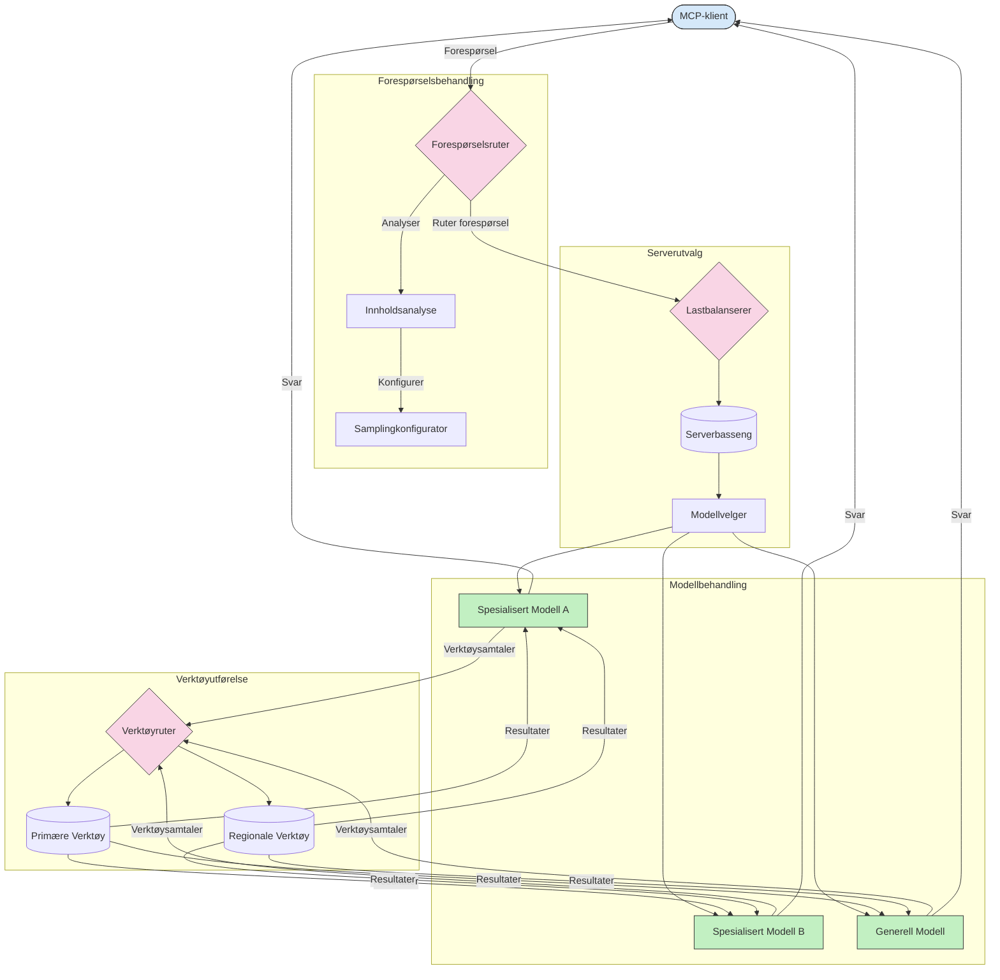

# Ruting i Model Context Protocol

Ruting er viktig for å dirigere forespørsler til de riktige modellene, verktøyene eller tjenestene innenfor et MCP-økosystem.

## Introduksjon

Ruting i Model Context Protocol (MCP) innebærer å dirigere forespørsler til de mest passende modellene eller tjenestene basert på ulike kriterier som innholdstype, brukerkontekst og systembelastning. Dette sikrer effektiv behandling og optimal ressursutnyttelse.

## Læringsmål

Når du er ferdig med denne leksjonen, vil du kunne:

- Forstå prinsippene for ruting i MCP.
- Implementere innholdsbasert ruting for å sende forespørsler til spesialiserte tjenester.
- Anvende intelligente lastbalanseringsstrategier for å optimalisere ressursutnyttelsen.
- Implementere dynamisk verktøyruting basert på forespørselens kontekst.

## Innholdsbasert ruting

Innholdsbasert ruting sender forespørsler til spesialiserte tjenester basert på innholdet i forespørselen. For eksempel kan forespørsler relatert til kodegenerering rutes til en spesialisert kode-modell, mens kreative skriveforespørsler kan sendes til en kreativ skrive-modell.

La oss se på et eksempel på implementering i forskjellige programmeringsspråk.

<details>
<summary>.NET</summary>

```csharp
// .NET Example: Content-based routing in MCP
public class ContentBasedRouter
{
    private readonly Dictionary<string, McpClient> _specializedClients;
    private readonly RoutingClassifier _classifier;
    
    public ContentBasedRouter()
    {
        // Initialize specialized clients for different domains
        _specializedClients = new Dictionary<string, McpClient>
        {
            ["code"] = new McpClient("https://code-specialized-mcp.com"),
            ["creative"] = new McpClient("https://creative-specialized-mcp.com"),
            ["scientific"] = new McpClient("https://scientific-specialized-mcp.com"),
            ["general"] = new McpClient("https://general-mcp.com")
        };
        
        // Initialize content classifier
        _classifier = new RoutingClassifier();
    }
    
    public async Task<McpResponse> RouteAndProcessAsync(string prompt, IDictionary<string, object> parameters = null)
    {
        // Classify the prompt to determine the best specialized service
        string category = await _classifier.ClassifyPromptAsync(prompt);
        
        // Get the appropriate client or fall back to general
        var client = _specializedClients.ContainsKey(category) 
            ? _specializedClients[category] 
            : _specializedClients["general"];
            
        Console.WriteLine($"Routing request to {category} specialized service");
        
        // Send request to the selected service
        return await client.SendPromptAsync(prompt, parameters);
    }
    
    // Simple classifier for routing decisions
    private class RoutingClassifier
    {
        public Task<string> ClassifyPromptAsync(string prompt)
        {
            prompt = prompt.ToLowerInvariant();
            
            if (prompt.Contains("code") || prompt.Contains("function") || 
                prompt.Contains("program") || prompt.Contains("algorithm"))
            {
                return Task.FromResult("code");
            }
            
            if (prompt.Contains("story") || prompt.Contains("creative") || 
                prompt.Contains("imagine") || prompt.Contains("design"))
            {
                return Task.FromResult("creative");
            }
            
            if (prompt.Contains("science") || prompt.Contains("research") || 
                prompt.Contains("analyze") || prompt.Contains("study"))
            {
                return Task.FromResult("scientific");
            }
            
            return Task.FromResult("general");
        }
    }
}
```

I den foregående koden har vi:

- Opprettet en `ContentBasedRouter`-klasse som ruter forespørsler basert på innholdet i prompten.
- Initialisert spesialiserte klienter for forskjellige domener (kode, kreativ, vitenskapelig, generell).
- Implementert en enkel klassifiserer som bestemmer kategorien til prompten og ruter den til passende spesialisert tjeneste.
- Brukt en fallback-mekanisme for å rute forespørsler til en generell tjeneste hvis ingen spesialisert tjeneste er tilgjengelig.
- Implementert asynkron behandling for å håndtere forespørsler effektivt.
- Brukt et ordbok (dictionary) for å koble innholdskategorier til spesialiserte MCP-klienter.
- Implementert en enkel klassifiserer som analyserer prompten og returnerer riktig kategori.
- Brukt den spesialiserte klienten til å sende forespørselen og motta svar.
- Håndtert tilfeller der prompten ikke passer til noen spesialisert kategori ved å rute til en generell tjeneste.

</details>

## Intelligent lastbalansering

Lastbalansering optimaliserer ressursutnyttelsen og sikrer høy tilgjengelighet for MCP-tjenester. Det finnes forskjellige måter å implementere lastbalansering på, slik som round-robin, vektet responstid eller innholdsbevisste strategier.

La oss se på et eksempel som bruker følgende strategier:

- **Round Robin**: Fordeler forespørsler jevnt over tilgjengelige servere.
- **Vektet Responstid**: Ruter forespørsler til servere basert på deres gjennomsnittlige responstid.
- **Innholdsbevisst**: Ruter forespørsler til spesialiserte servere basert på innholdet i forespørselen.

<details>
<summary>Java</summary>

```java
// Java-eksempel: Intelligent lastbalansering for MCP-servere
public class McpLoadBalancer {
    private final List<McpServerNode> serverNodes;
    private final LoadBalancingStrategy strategy;
    
    public McpLoadBalancer(List<McpServerNode> nodes, LoadBalancingStrategy strategy) {
        this.serverNodes = new ArrayList<>(nodes);
        this.strategy = strategy;
    }
    
    public McpResponse processRequest(McpRequest request) {
        // Velg den beste serveren basert på strategi
        McpServerNode selectedNode = strategy.selectNode(serverNodes, request);
        
        try {
            // Ruter forespørselen til den valgte noden
            return selectedNode.processRequest(request);
        } catch (Exception e) {
            // Håndter feil - implementer gjentakelse eller tilbakefallslogikk
            System.err.println("Error processing request on node " + selectedNode.getId() + ": " + e.getMessage());
            
            // Merk node som potensielt usunn
            selectedNode.recordFailure();
            
            // Prøv neste beste node som tilbakefall
            List<McpServerNode> remainingNodes = new ArrayList<>(serverNodes);
            remainingNodes.remove(selectedNode);
            
            if (!remainingNodes.isEmpty()) {
                McpServerNode fallbackNode = strategy.selectNode(remainingNodes, request);
                return fallbackNode.processRequest(request);
            } else {
                throw new RuntimeException("All MCP server nodes failed to process the request");
            }
        }
    }
    
    // Oppgave for helsesjekk av node
    public void startHealthChecks(Duration interval) {
        ScheduledExecutorService scheduler = Executors.newScheduledThreadPool(1);
        scheduler.scheduleAtFixedRate(() -> {
            for (McpServerNode node : serverNodes) {
                try {
                    boolean isHealthy = node.checkHealth();
                    System.out.println("Node " + node.getId() + " health status: " + 
                                      (isHealthy ? "HEALTHY" : "UNHEALTHY"));
                } catch (Exception e) {
                    System.err.println("Health check failed for node " + node.getId());
                    node.setHealthy(false);
                }
            }
        }, 0, interval.toMillis(), TimeUnit.MILLISECONDS);
    }
    
    // Grensesnitt for lastbalanseringsstrategier
    public interface LoadBalancingStrategy {
        McpServerNode selectNode(List<McpServerNode> nodes, McpRequest request);
    }
    
    // Round-robin-strategi
    public static class RoundRobinStrategy implements LoadBalancingStrategy {
        private AtomicInteger counter = new AtomicInteger(0);
        
        @Override
        public McpServerNode selectNode(List<McpServerNode> nodes, McpRequest request) {
            List<McpServerNode> healthyNodes = nodes.stream()
                .filter(McpServerNode::isHealthy)
                .collect(Collectors.toList());
            
            if (healthyNodes.isEmpty()) {
                throw new RuntimeException("No healthy nodes available");
            }
            
            int index = counter.getAndIncrement() % healthyNodes.size();
            return healthyNodes.get(index);
        }
    }
    
    // Vektet responstid-strategi
    public static class ResponseTimeStrategy implements LoadBalancingStrategy {
        @Override
        public McpServerNode selectNode(List<McpServerNode> nodes, McpRequest request) {
            return nodes.stream()
                .filter(McpServerNode::isHealthy)
                .min(Comparator.comparing(McpServerNode::getAverageResponseTime))
                .orElseThrow(() -> new RuntimeException("No healthy nodes available"));
        }
    }
    
    // Innholdsbevisst strategi
    public static class ContentAwareStrategy implements LoadBalancingStrategy {
        @Override
        public McpServerNode selectNode(List<McpServerNode> nodes, McpRequest request) {
            // Bestem forespørselens egenskaper
            boolean isCodeRequest = request.getPrompt().contains("code") || 
                                   request.getAllowedTools().contains("codeInterpreter");
            
            boolean isCreativeRequest = request.getPrompt().contains("creative") || 
                                       request.getPrompt().contains("story");
            
            // Finn spesialiserte noder
            Optional<McpServerNode> specializedNode = nodes.stream()
                .filter(McpServerNode::isHealthy)
                .filter(node -> {
                    if (isCodeRequest && node.getSpecialization().equals("code")) {
                        return true;
                    }
                    if (isCreativeRequest && node.getSpecialization().equals("creative")) {
                        return true;
                    }
                    return false;
                })
                .findFirst();
            
            // Returner spesialisert node eller minst belastede node
            return specializedNode.orElse(
                nodes.stream()
                    .filter(McpServerNode::isHealthy)
                    .min(Comparator.comparing(McpServerNode::getCurrentLoad))
                    .orElseThrow(() -> new RuntimeException("No healthy nodes available"))
            );
        }
    }
}
```

I den foregående koden har vi:

- Opprettet en `McpLoadBalancer`-klasse som håndterer en liste over MCP-servernoder og ruter forespørsler basert på den valgte lastbalanseringsstrategien.
- Implementert forskjellige lastbalanseringsstrategier: `RoundRobinStrategy`, `ResponseTimeStrategy`, og `ContentAwareStrategy`.
- Brukt en `ScheduledExecutorService` for periodisk å sjekke helsetilstand til servernodene.
- Implementert en helsesjekk-mekanisme som markerer noder som sunne eller usunne basert på deres respons på helsesjekker.
- Håndtert behandlingen av forespørsler med feilhåndtering og fallback-logikk for å sikre høy tilgjengelighet.
- Brukt en `McpServerNode`-klasse for å representere individuelle MCP-servernoder, inkludert deres helsestatus, gjennomsnittlig responstid og gjeldende belastning.
- Implementert en `McpRequest`-klasse for å pakke forespørselsdetaljer som prompt og tillatte verktøy.
- Brukt Java Streams for å filtrere og velge noder basert på helsestatus og spesialisering.

</details>

## Dynamisk verktøyruting

Verktøyruting sikrer at verktøy-kall blir dirigert til den mest passende tjenesten basert på kontekst. For eksempel kan et verktøykall for vær kreve å rutes til et regionalt endepunkt basert på brukerens plassering, eller et kalkulatorverktøy kan måtte bruke en spesifikk versjon av API-et.

La oss se på et eksempel som demonstrerer dynamisk verktøyruting basert på forespørselsanalyse, regionale endepunkter og versjonsstøtte.

<details>
<summary>Python</summary>

```python
# Python-eksempel: Dynamisk verktøyruting basert på forespørselsanalyse
class McpToolRouter:
    def __init__(self):
        # Registrer tilgjengelige verktøyendepunkter
        self.tool_endpoints = {
            "weatherTool": "https://weather-service.example.com/api",
            "calculatorTool": "https://calculator-service.example.com/compute",
            "databaseTool": "https://database-service.example.com/query",
            "searchTool": "https://search-service.example.com/search"
        }
        
        # Regionale endepunkter for global distribusjon
        self.regional_endpoints = {
            "us": {
                "weatherTool": "https://us-west.weather-service.example.com/api",
                "searchTool": "https://us.search-service.example.com/search"
            },
            "europe": {
                "weatherTool": "https://eu.weather-service.example.com/api",
                "searchTool": "https://eu.search-service.example.com/search"
            },
            "asia": {
                "weatherTool": "https://asia.weather-service.example.com/api",
                "searchTool": "https://asia.search-service.example.com/search"
            }
        }
        
        # Støtte for versjonering av verktøy
        self.tool_versions = {
            "weatherTool": {
                "default": "v2",
                "v1": "https://weather-service.example.com/api/v1",
                "v2": "https://weather-service.example.com/api/v2",
                "beta": "https://weather-service.example.com/api/beta"
            }
        }
    
    async def route_tool_request(self, tool_name, parameters, user_context=None):
        """Route a tool request to the appropriate endpoint based on context"""
        endpoint = self._select_endpoint(tool_name, parameters, user_context)
        
        if not endpoint:
            raise ValueError(f"No endpoint available for tool: {tool_name}")
        
        # Utfør den faktiske forespørselen til det valgte endepunktet
        return await self._execute_tool_request(endpoint, tool_name, parameters)
    
    def _select_endpoint(self, tool_name, parameters, user_context=None):
        """Select the most appropriate endpoint based on context"""
        # Grunnendepunkt fra registeret
        if tool_name not in self.tool_endpoints:
            return None
            
        base_endpoint = self.tool_endpoints[tool_name]
        
        # Sjekk om vi må bruke en spesifikk verktøyversjon
        if tool_name in self.tool_versions:
            version_info = self.tool_versions[tool_name]
            
            # Bruk spesifisert versjon eller standard
            requested_version = parameters.get("_version", version_info["default"])
            if requested_version in version_info:
                base_endpoint = version_info[requested_version]
        
        # Sjekk for regional ruting hvis brukerens region er kjent
        if user_context and "region" in user_context:
            user_region = user_context["region"]
            
            if user_region in self.regional_endpoints:
                regional_tools = self.regional_endpoints[user_region]
                
                if tool_name in regional_tools:
                    # Bruk region-spesifikt endepunkt
                    return regional_tools[tool_name]
        
        # Sjekk for krav til datalagring i bestemt jurisdiksjon
        if user_context and "data_residency" in user_context:
            # Dette vil implementere logikk for å sikre at data forblir i angitt jurisdiksjon
            pass
        
        # Sjekk for ruting basert på latenstid
        if user_context and "latency_sensitive" in user_context and user_context["latency_sensitive"]:
            # Dette vil implementere logikk for å velge endepunkt med lavest latenstid
            pass
            
        return base_endpoint
        
    async def _execute_tool_request(self, endpoint, tool_name, parameters):
        """Execute the actual tool request to the selected endpoint"""
        try:
            async with aiohttp.ClientSession() as session:
                async with session.post(
                    endpoint,
                    json={"toolName": tool_name, "parameters": parameters},
                    headers={"Content-Type": "application/json"}
                ) as response:
                    if response.status == 200:
                        result = await response.json()
                        return result
                    else:
                        error_text = await response.text()
                        raise Exception(f"Tool execution failed: {error_text}")
        except Exception as e:
            # Implementer logikk for gjentakelse eller fallback-strategi
            print(f"Error executing tool {tool_name} at {endpoint}: {str(e)}")
            raise
```

I den foregående koden har vi:

- Opprettet en `McpToolRouter`-klasse som håndterer verktøyruting basert på forespørselsanalyse, regionale endepunkter og versjonsstøtte.
- Registrert tilgjengelige verktøyendepunkter og regionale endepunkter for global distribusjon.
- Implementert dynamisk rutingslogikk som velger riktig endepunkt basert på brukerkontekst, slik som region og krav til datalokalisering.
- Implementert versjonsstøtte for verktøy, som lar brukere spesifisere hvilken versjon av et verktøy de ønsker å bruke.
- Brukt asynkrone HTTP-forespørsler for å utføre verktøykall og håndtere svar.

</details>

## Sampling- og rutearkitektur i MCP

Sampling er en kritisk komponent i Model Context Protocol (MCP) som muliggjør effektiv behandling og ruting av forespørsler. Det innebærer å analysere innkommende forespørsler for å avgjøre hvilken modell eller tjeneste som best kan håndtere dem, basert på ulike kriterier som innholdstype, brukerkontekst og systembelastning.

Sampling og ruting kan kombineres for å skape en robust arkitektur som optimaliserer ressursutnyttelsen og sikrer høy tilgjengelighet. Samplingsprosessen kan brukes til å klassifisere forespørsler, mens ruting dirigerer disse til riktige modeller eller tjenester.

Diagrammet under illustrerer hvordan sampling og ruting fungerer sammen i en omfattende MCP-arkitektur:



## Hva er det neste

- [5.6 Sampling](../mcp-sampling/README.md)

---

<!-- CO-OP TRANSLATOR DISCLAIMER START -->
**Ansvarsfraskrivelse**:
Dette dokumentet er oversatt ved hjelp av AI-oversettelsestjenesten [Co-op Translator](https://github.com/Azure/co-op-translator). Selv om vi streber etter nøyaktighet, vær oppmerksom på at automatiske oversettelser kan inneholde feil eller unøyaktigheter. Det opprinnelige dokumentet på originalspråket skal betraktes som den autoritative kilden. For kritisk informasjon anbefales profesjonell menneskelig oversettelse. Vi er ikke ansvarlige for eventuelle misforståelser eller feiltolkninger som oppstår ved bruk av denne oversettelsen.
<!-- CO-OP TRANSLATOR DISCLAIMER END -->