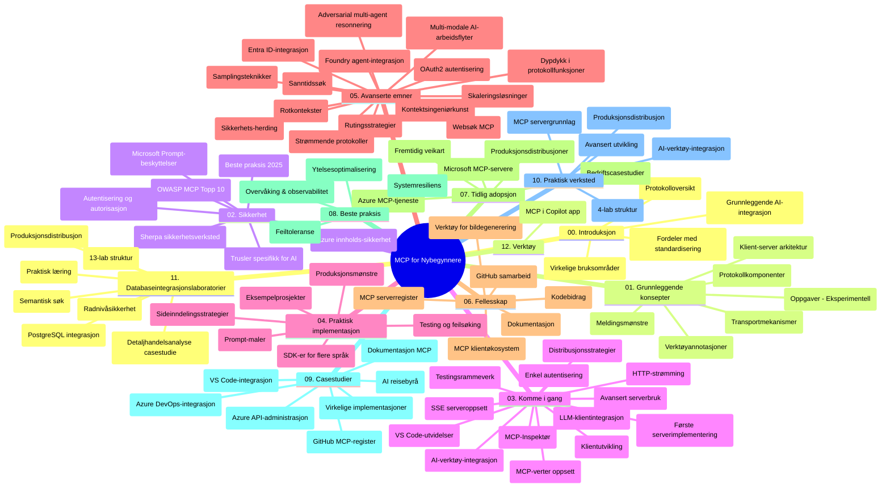

# Modellkontekstprotokoll (MCP) for nybegynnere - Studieveiledning

Denne studieveiledningen gir en oversikt over depotstrukturen og innholdet for læreplanen "Modellkontekstprotokoll (MCP) for nybegynnere". Bruk denne veiledningen for å navigere i depotet effektivt og få mest mulig ut av de tilgjengelige ressursene.

## Depotoversikt

Modellkontekstprotokollen (MCP) er et standardisert rammeverk for interaksjoner mellom AI-modeller og klientapplikasjoner. Opprinnelig laget av Anthropic, vedlikeholdes MCP nå av det bredere MCP-fellesskapet gjennom den offisielle GitHub-organisasjonen. Dette depotet tilbyr en omfattende læreplan med praktiske kodeeksempler i C#, Java, JavaScript, Python og TypeScript, designet for AI-utviklere, systemarkitekter og programvareingeniører.

## Visuell læreplankart

## Depotstruktur

Depotet er organisert i tolv hovedseksjoner, hver med fokus på ulike aspekter av MCP:

1. **Introduksjon (00-Introduction/)**
   - Oversikt over modellkontekstprotokollen
   - Hvorfor standardisering er viktig i AI-pipelines
   - Praktiske bruksområder og fordeler

2. **Kjernebegreper (01-CoreConcepts/)**
   - Klient-server-arkitektur
   - Viktige protokollkomponenter
   - Meldingsmønstre i MCP
   - Fremtidsrettet: [Hva endres i MCP: Release Candidate 2026-07-28](./01-CoreConcepts/mcp-2026-07-28-release-candidate.md) — den stateless protokollkjernen, Extensions-rammeverket og forventede utfasinger av Roots/Sampling/Logging i neste spesifikasjonsversjon

3. **Sikkerhet (02-Security/)**
   - Sikkerhetstrusler i MCP-baserte systemer
   - Beste praksis for å sikre implementeringer
   - Autentiserings- og autorisasjonsstrategier
   - **Omfattende sikkerhetsdokumentasjon**:
     - MCP Security Best Practices 2025
     - Azure Content Safety Implementation Guide
     - MCP Security Controls and Techniques
     - MCP Best Practices Quick Reference
   - **Nøkkeltemaer innen sikkerhet**:
     - Prompt-injeksjons- og verktøyforgiftningsangrep
     - Sesjonskapring og forvirret fullmakt-problemer
     - Token-passthrough-sårbarheter
     - Overdrevne tillatelser og tilgangskontroll
     - Leverandørkjede-sikkerhet for AI-komponenter
     - Microsoft Prompt Shields-integrasjon

4. **Kom i gang (03-GettingStarted/)**
   - Miljøoppsett og konfigurasjon
   - Opprette grunnleggende MCP-servere og -klienter
   - Integrasjon med eksisterende applikasjoner
   - Inkluderer seksjoner for:
     - Første serverimplementasjon
     - Klientutvikling
     - LLM-klientintegrasjon
     - VS Code-integrasjon
     - Server-Sent Events (SSE)-server
     - Avansert serverbruk
     - HTTP-strømming
     - AI Toolkit-integrasjon
     - Teststrategier
     - Distribusjonsretningslinjer

5. **Praktisk implementering (04-PracticalImplementation/)**
   - Bruke SDK-er på tvers av ulike programmeringsspråk
   - Feilsøking, testing og valideringsteknikker
   - Lage gjenbrukbare promptmaler og arbeidsflyter
   - Eksempelsprosjekter med implementasjons-eksempler

6. **Avanserte temaer (05-AdvancedTopics/)**
   - Konstekstvurderingsteknikker
   - Foundry-agentintegrasjon
   - Multi-modale AI-arbeidsflyter
   - OAuth2-autentiseringsdemoer
   - Sanntidssøk
   - Sanntidsstrømming
   - Implementasjon av root-kontekster
   - Rutingstrategier
   - Samplingsteknikker
   - Skaleringsmetoder
   - Sikkerhetshensyn
   - Entra ID-sikkerhetsintegrasjon
   - Websøkintegrasjon
   - Adversarial multi-agent resonnering (debattmønstre)

7. **Fellesskapsbidrag (06-CommunityContributions/)**
   - Hvordan bidra med kode og dokumentasjon
   - Samarbeid via GitHub
   - Fellesskapsdrevne forbedringer og tilbakemeldinger
   - Bruke ulike MCP-klienter (Claude Desktop, Cline, VSCode)
   - Jobbe med populære MCP-servere inkludert bilde-generering

8. **Erfaringer fra tidlig adopsjon (07-LessonsfromEarlyAdoption/)**
   - Virkelige implementeringer og suksesshistorier
   - Bygge og distribuere MCP-baserte løsninger
   - Trender og fremtidig veikart
   - **Microsoft MCP Servers Guide**: Omfattende guide til 10 produksjonsklare Microsoft MCP-servere inkludert:
     - Microsoft Learn Docs MCP Server
     - Azure MCP Server (15+ spesialiserte koblinger)
     - GitHub MCP Server
     - Azure DevOps MCP Server
     - MarkItDown MCP Server
     - SQL Server MCP Server
     - Playwright MCP Server
     - Dev Box MCP Server
     - Microsoft Foundry MCP Server
     - Microsoft 365 Agents Toolkit MCP Server

9. **Beste praksis (08-BestPractices/)**
   - Ytelsesoptimalisering og tuning
   - Designe feiltolerante MCP-systemer
   - Test- og robusthetsstrategier

10. **Case-studier (09-CaseStudy/)**
    - **Syv omfattende case-studier** som demonstrerer MCPs allsidighet på tvers av ulike scenarier:
    - **Azure AI reisebyråer**: Multi-agent-orchestrering med Azure OpenAI og AI Search
    - **Azure DevOps-integrasjon**: Automatisering av arbeidsflytprosesser med YouTube-oppdateringer
    - **Sanntidsdokumenttilgang**: Python-konsollklient med HTTP-strømming
    - **Interaktiv studieplan-generator**: Chainlit nettapp med konversasjonell AI
    - **Dokumentasjon i editor**: VS Code-integrasjon med GitHub Copilot-arbeidsflyter
    - **Azure API Management**: Enterprise API-integrasjon med MCP serveropprettelse
    - **GitHub MCP Register**: Økosystemutvikling og agentisk integrasjonsplattform
    - Implementasjonseksempler som spenner over enterprise-integrasjon, utviklerproduktivitet og økosystemutvikling

11. **Praktisk verksted (10-StreamliningAIWorkflowsBuildingAnMCPServerWithAIToolkit/)**
    - Omfattende praktisk verksted som kombinerer MCP med AI Toolkit
    - Bygge intelligente applikasjoner som kobler AI-modeller med virkelige verktøy
    - Praktiske moduler som dekker grunnprinsipper, tilpasset serverutvikling og produksjonsdistribusjonsstrategier
    - **Lab-struktur**:
      - Lab 1: MCP Server Fundamentals
      - Lab 2: Avansert MCP Server-utvikling
      - Lab 3: AI Toolkit-integrasjon
      - Lab 4: Produksjonsdistribusjon og skalering
    - Lab-basert læring med trinnvise instruksjoner

12. **MCP Server Database-integrasjonslaboratorier (11-MCPServerHandsOnLabs/)**
    - **Omfattende 13-lab læringsløype** for å bygge produksjonsklare MCP-servere med PostgreSQL-integrasjon
    - **Virkelighetsnær detaljhandelsanalyse-implementasjon** med Zava Retail brukerhistorie
    - **Enterprise-kvalitetsmønstre** inkludert Row Level Security (RLS), semantisk søk og multi-tenant data-tilgang
    - **Fullstendig labstruktur**:
      - **Labs 00-03: Grunnlag** - Introduksjon, Arkitektur, Sikkerhet, Miljøoppsett
      - **Labs 04-06: Bygge MCP-serveren** - Database-design, MCP-serverimplementasjon, Verktøyutvikling
      - **Labs 07-09: Avanserte funksjoner** - Semantisk søk, Testing & feilsøking, VS Code-integrasjon
      - **Labs 10-12: Produksjon & beste praksis** - Distribusjon, Overvåking, Optimalisering
    - **Dekker teknologier**: FastMCP-rammeverk, PostgreSQL, Azure OpenAI, Azure Container Apps, Application Insights
    - **Læringsutbytte**: Produksjonsklare MCP-servere, databaseintegrasjonsmønstre, AI-drevet analyse, enterprise-sikkerhet

13. **Verktøy (12-tooling/)**
    - Lær hvordan du bruker MCP i Copilot-appen og andre verktøy

## Ytterligere ressurser

Depotet inkluderer støtteressurser:

- **Bilder-mappe**: Inneholder diagrammer og illustrasjoner brukt i hele læreplanen
- **Oversettelser**: Flerspråklig støtte med automatiserte oversettelser av dokumentasjon
- **Offisielle MCP-ressurser**:
  - [MCP Documentation](https://modelcontextprotocol.io/)
  - [MCP Specification](https://spec.modelcontextprotocol.io/)
  - [MCP GitHub Repository](https://github.com/modelcontextprotocol)

## Hvordan bruke dette depotet

1. **Sekvensiell læring**: Følg kapitlene i rekkefølge (00 til 11) for en strukturert læringsopplevelse.
2. **Språkspesifikt fokus**: Hvis du er interessert i et bestemt programmeringsspråk, utforsk katalogene for eksempler for din foretrukne språkimplementasjon.
3. **Praktisk implementering**: Start med seksjonen "Kom i gang" for å sette opp miljøet ditt og opprette din første MCP-server og klient.
4. **Avansert utforskning**: Når du er komfortabel med det grunnleggende, gå videre til avanserte temaer for å utvide kunnskapen din.
5. **Fellesskapsengasjement**: Bli med i MCP-fellesskapet via GitHub-diskusjoner og Discord-kanaler for å knytte kontakt med eksperter og medutviklere.

## MCP-klienter og verktøy

Læreplanen dekker flere MCP-klienter og verktøy:

1. **Offisielle klienter**:
   - Visual Studio Code
   - MCP i Visual Studio Code
   - Claude Desktop
   - Claude i VSCode
   - Claude API

2. **Fellesskapsklienter**:
   - Cline (terminalbasert)
   - Cursor (kodeeditor)
   - ChatMCP
   - Windsurf

3. **MCP-administrasjonsverktøy**:
   - MCP CLI
   - MCP Manager
   - MCP Linker
   - MCP Router

## Populære MCP-servere

Depotet introduserer ulike MCP-servere, inkludert:

1. **Offisielle Microsoft MCP-servere**:
   - Microsoft Learn Docs MCP Server
   - Azure MCP Server (15+ spesialiserte koblinger)
   - GitHub MCP Server
   - Azure DevOps MCP Server
   - MarkItDown MCP Server
   - SQL Server MCP Server
   - Playwright MCP Server
   - Dev Box MCP Server
   - Microsoft Foundry MCP Server
   - Microsoft 365 Agents Toolkit MCP Server

2. **Offisielle referanseservere**:
   - Filesystem
   - Fetch
   - Memory
   - Sequential Thinking

3. **Bildegenerering**:
   - Azure OpenAI DALL-E 3
   - Stable Diffusion WebUI
   - Replicate

4. **Utviklingsverktøy**:
   - Git MCP
   - Terminal Control
   - Code Assistant

5. **Spesialiserte servere**:
   - Salesforce
   - Microsoft Teams
   - Jira & Confluence

## Bidra

Dette depotet ønsker bidrag fra fellesskapet velkommen. Se seksjonen Fellesskapsbidrag for veiledning om hvordan du bidrar effektivt til MCP-økosystemet.

----

*Denne studieveiledningen ble sist oppdatert 5. februar 2026, og gjenspeiler den siste MCP-spesifikasjonen 2025-11-25 og gir en oversikt over depotet per den datoen. Depotinnhold kan bli oppdatert etter denne datoen.*

*Tillegg (2. juli 2026): en leksjon om `2026-07-28` MCP Specification Release Candidate ble lagt til under [01-CoreConcepts](./01-CoreConcepts/mcp-2026-07-28-release-candidate.md); læreplanens basis forblir 2025-11-25 inntil den nye spesifikasjonen lanseres.*

---

<!-- CO-OP TRANSLATOR DISCLAIMER START -->
**Ansvarsfraskrivelse**:
Dette dokumentet er oversatt ved hjelp av AI-oversettelsestjenesten [Co-op Translator](https://github.com/Azure/co-op-translator). Selv om vi streber etter nøyaktighet, vær oppmerksom på at automatiske oversettelser kan inneholde feil eller unøyaktigheter. Det opprinnelige dokumentet på originalspråket skal betraktes som den autoritative kilden. For kritisk informasjon anbefales profesjonell menneskelig oversettelse. Vi er ikke ansvarlige for eventuelle misforståelser eller feiltolkninger som oppstår ved bruk av denne oversettelsen.
<!-- CO-OP TRANSLATOR DISCLAIMER END -->