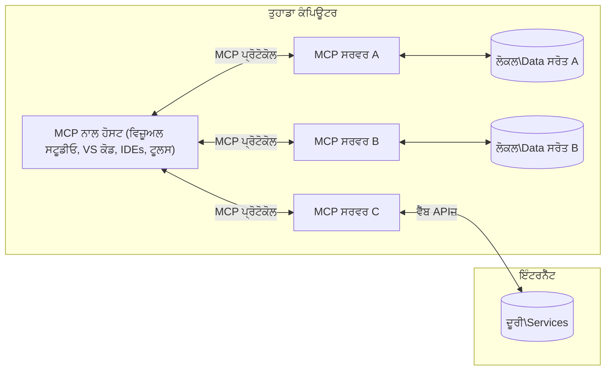

# MCP ਕੁੋਰ ਧਾਰਣਾਵਾਂ: AI ਇੰਟਿਗਰੇਸ਼ਨ ਲਈ ਮਾਡਲ ਕੌਂਟੈਕਸਟ ਪ੍ਰੋਟੋਕੋਲ 'ਤੇ ਮਾਹਰਤਾ ਹਾਸਲ ਕਰਨਾ

[](https://youtu.be/earDzWGtE84)

_(ਇਸ ਪਾਠ ਦਾ ਵੀਡੀਓ ਦੇਖਣ ਲਈ ਉਪਰ ਦੇ ਚਿੱਤਰ 'ਤੇ ਕਲਿੱਕ ਕਰੋ)_

[ਮਾਡਲ ਕੌਂਟੈਕਸਟ ਪ੍ਰੋਟੋਕੋਲ (MCP)](https://github.com/modelcontextprotocol) ਇੱਕ ਸ਼ਕਤੀਸ਼ਾਲੀ, ਮਿਆਰੀ ਢਾਂਚਾ ਹੈ ਜੋ ਵੱਡੇ ਭਾਸ਼ਾ ਮਾਡਲਾਂ (LLMs) ਅਤੇ ਬਾਹਰੀ ਸੰਦਾਂ, ਐਪਲੀਕੇਸ਼ਨਾਂ ਅਤੇ ਡੇਟਾ ਸਰੋਤਾਂ ਵਿਚਕਾਰ ਸੰਚਾਰ ਨੂੰ ਸੁਧਾਰਦਾ ਹੈ। 
ਇਹ ਗਾਈਡ ਤੁਹਾਨੂੰ MCP ਦੀਆਂ ਮੁੱਖ ਧਾਰਣਾਵਾਂ ਨਾਲ ਰੁਬਰੂ ਕਰਵਾਏਗੀ। ਤੁਸੀਂ ਇਸ ਦੀ ਕਲਾਇੰਟ-ਸਰਵਰ ਵਾਸ਼ਟੁਕਲਾ, ਜਰੂਰੀ ਹਿੱਸੇ, ਸੰਚਾਰ ਮਕੈਨਿਕਸ ਅਤੇ ਲਾਗੂ ਕਰਨ ਦੀਆਂ ਬੇਹਤਰੀਨ ਪ੍ਰਥਾਵਾਂ ਬਾਰੇ ਜਾਣੋਗੇ।

- **ਸਪਸ਼ਟ ਉਪਭੋਗਤਾ ਸਹਿਮਤੀ**: ਸਾਰੇ ਡੇਟਾ ਐਕਸੈਸ ਅਤੇ ਕਾਰਵਾਈਆਂ ਲਈ ਕਾਰਜਨੂੰਭਵ ਤੋਂ ਪਹਿਲਾਂ ਸਪਸ਼ਟ ਉਪਭੋਗਤਾ ਮਨਜ਼ੂਰੀ ਲਾਜ਼ਮੀ ਹੈ। ਉਪਭੋਗਤਾਵਾਂ ਨੂੰ ਸਪਸ਼ਟ ਤੌਰ 'ਤੇ ਸਮਝਣਾ ਚਾਹੀਦਾ ਹੈ ਕਿ ਕਿਹੜਾ ਡੇਟਾ ਐਕਸੈਸ ਕੀਤਾ ਜਾਵੇਗਾ ਅਤੇ ਕਿਹੜੇ ਕਦਮ ਲਏ ਜਾਣਗੇ, ਅਤੇ ਅਧਿਕਾਰਾਂ ਅਤੇ ਪ੍ਰਮਾਣਿਕਤਾ 'ਤੇ ਖਾਸ ਨਿਯੰਤਰਣ ਮਿਲੇ।

- **ਡੇਟਾ ਗੋਪਨੀਯਤਾ ਸੁਰੱਖਿਆ**: ਉਪਭੋਗਤਾ ਡੇਟਾ ਸਿਰਫ ਸਪਸ਼ਟ ਸਹਿਮਤੀ ਨਾਲ ਹੀ ਪ੍ਰਗਟ ਹੁੰਦਾ ਹੈ ਅਤੇ ਪੂਰੇ ਇੰਟਰੈਕਸ਼ਨ ਲਾਈਫਸਾਈਕਲ ਦੌਰਾਨ ਮਜ਼ਬੂਤ ਐਕਸੈਸ ਨਿਯੰਤਰਣਾਂ ਨਾਲ ਸੁਰੱਖਿਅਤ ਰੱਖਿਆ ਜਾਵੇ। ਲਾਗੂ ਕਰਨ ਵਾਲਿਆਂ ਨੂੰ ਬਿਨਾਂ ਪ੍ਰਮਾਣਿਕਤਾ ਡੇਟਾ ਪ੍ਰਸਾਰਣ ਤੋਂ ਰੋਕਣਾ ਚਾਹੀਦਾ ਹੈ ਅਤੇ ਗੋਪਨੀਯਤਾ ਦੀਆਂ ਕਠੋਰ ਸੀਮਾਵਾਂ ਬਣਾਈਆਂ ਜਾਣ।

- **ਸੰਦ ਚਲਾਉਣ ਦੀ ਸੁਰੱਖਿਆ**: ਹਰ ਸੰਦ ਦੀ ਕਾਲ ਲਈ ਸਪਸ਼ਟ ਉਪਭੋਗਤਾ ਸਹਿਮਤੀ ਲਾਜ਼ਮੀ ਹੈ ਜਿਸ ਨਾਲ ਸੰਦ ਦੀ ਕਾਰਗੁਜ਼ਾਰੀ, ਪੈਰਾਮੀਟਰ ਅਤੇ ਸੰਭਾਵਿਤ ਪ੍ਰਭਾਵ ਨੂੰ ਸਪਸ਼ਟ ਤੌਰ 'ਤੇ ਸਮਝਿਆ ਜਾਵੇ। ਮਜ਼ਬੂਤ ਸੁਰੱਖਿਆ ਸੀਮਾਵਾਂ ਨੂੰ ਅਣਚਾਹੀ, ਖ਼ਤਰਨਾਕ ਜਾਂ ਦੁਰਭਾਵਨਾਪੂਰਨ ਸੰਦ ਚਲਾਉਣ ਤੋਂ ਰੋਕਣਾ ਚਾਹੀਦਾ ਹੈ।

- **ਟਰਾਂਸਪੋਰਟ ਲੇਅਰ ਸੁਰੱਖਿਆ**: ਸਾਰੇ ਸੰਚਾਰ ਚੈਨਲਾਂ ਵਿੱਚ ਉਚਿਤ ਐਨਕ੍ਰਿਪਸ਼ਨ ਅਤੇ ਪ੍ਰਮਾਣਿਕਤਾ ਪ੍ਰਣਾਲੀਆਂ ਵਰਤੀਆਂ ਜਾਣ। ਦੂਰ ਦਾ ਕਨੈਕਸ਼ਨ ਸੁਰੱਖਿਅਤ ਟਰਾਂਸਪੋਰਟ ਪ੍ਰੋਟੋਕੋਲ ਅਤੇ ਠੀਕ ਕ੍ਰਿਡੇੰਸ਼ਲ ਪ੍ਰਬੰਧਨ ਦਾ ਲਾਗੂ ਕਰਨ।

#### ਲਾਗੂ ਕਰਨ ਦੀਆਂ ਰਾਹਨੁਮਾਈਆਂ:

- **ਪਰਮਿਸ਼ਨ ਪ੍ਰਬੰਧਨ**: ਇਸ ਤਰ੍ਹਾਂ ਦੇਨਾਂ ਪ੍ਰਣਾਲੀਆਂ ਨੂੰ ਲਾਗੂ ਕਰੋ ਜੋ ਉਪਭੋਗਤਾਵਾਂ ਨੂੰ ਕ੍ਰਮਬੱਧ ਤੌਰ 'ਤੇ ਸਰਵਰਾਂ, ਸੰਦਾਂ ਅਤੇ ਸਰੋਤਾਂ ਨੂੰ ਨਿਯੰਤਰਿਤ ਕਰਨ ਦੀ ਆਗਿਆ ਦਿੰਦੀਆਂ ਹਨ
- **ਪ੍ਰਮਾਣਿਕਤਾ ਅਤੇ ਪ੍ਰਧਾਨਤਾ**: ਸੁਰੱਖਿਅਤ ਪ੍ਰਮਾਣਿਕਤਾ ਤਰੀਕੇ ਵਰਤੋ (OAuth, API ਕੁੰਜੀਆਂ) ਸਹੀ ਟੋਕਨ ਪ੍ਰਬੰਧਨ ਅਤੇ ਮੇਅਦ ਉਚਿਤ ਰੂਪ ਵਿੱਚ
- **ਇਨਪੁੱਟ ਵੈਰੀਫਿਕੇਸ਼ਨ**: ਸਭ ਪੈਰਾਮੀਟਰ ਅਤੇ ਡੇਟਾ ਇਨਪੁੱਟਾਂ ਨੂੰ ਨਿਰਧਾਰਿਤ ਸਕੀਮਿਆਂ ਅਨੁਸਾਰ ਸੱਚੇ ਕਰੋ ਤਾਂ ਜੋ ਇੰਜੈਕਸ਼ਨ ਹਮਲਿਆਂ ਤੋਂ ਬਚਿਆ ਜਾ ਸਕੇ
- **ਆਡਿਟ ਲੌਗਿੰਗ**: ਸੁਰੱਖਿਆ ਨਿਗਰਾਨੀ ਅਤੇ ਕੌਮਪਲਾਇੰਸ ਲਈ ਸਾਰੀਆਂ ਕਾਰਵਾਈਆਂ ਦੇ ਵਿਸਥਾਰਪੂਰਕ ਲੌਗ ਬਣਾਓ

## ਜਾਇਜ਼ਾ

ਇਹ ਪਾਠ ਮਾਡਲ ਕੌਂਟੈਕਸਟ ਪ੍ਰੋਟੋਕੋਲ (MCP) ਪਰਿਵਾਰ ਦੀ ਬੁਨਿਆਦੀ ਵਾਸ਼ਟੁਕਲਾ ਅਤੇ ਹਿੱਸਿਆਂ ਦੀ ਖੋਜ ਕਰਦਾ ਹੈ। ਤੁਸੀਂ ਕਲਾਇੰਟ-ਸਰਵਰ ਵਾਸ਼ਟੁਕਲਾ, ਮੁੱਖ ਹਿੱਸੇ ਅਤੇ ਸੰਚਾਰ ਮਕੈਨਿਕਸ ਬਾਰੇ ਜਾਣੋਗੇ ਜੋ MCP ਇੰਟਰੈਕਸ਼ਨਾਂ ਨੂੰ ਚਾਲੂ ਕਰਦੇ ਹਨ।

## ਮੁੱਖ ਸਿੱਖਣ ਦੇ ਉਦੇਸ਼

ਇਸ ਪਾਠ ਦੇ ਅੰਤ ਤੱਕ, ਤੁਸੀਂ:

- MCP ਕਲਾਇੰਟ-ਸਰਵਰ ਵਾਸ਼ਟੁਕਲਾ ਨੂੰ ਸਮਝੋਗੇ।
- ਹੋਸਟ, ਕਲਾਇੰਟ ਅਤੇ ਸਰਵਰਾਂ ਦੇ ਭੂਮਿਕਾਵਾਂ ਅਤੇ ਜ਼ਿੰਮੇਵਾਰੀਆਂ ਦੀ ਪਹਿਚਾਣ ਕਰੋਗੇ।
- MCP ਨੂੰ ਇੱਕ ਲਚਕੀਲਾ ਇੰਟਿਗਰੇਸ਼ਨ ਪਰਤ ਬਣਾਉਣ ਵਾਲੀਆਂ ਮੁੱਖ ਵਿਸ਼ੇਸ਼ਤਾਵਾਂ ਦਾ ਵਿਸ਼ਲੇਸ਼ਣ ਕਰੋਗੇ।
- MCP ਪਰਿਵਾਰ ਵਿੱਚ ਜਾਣਕਾਰੀ ਦੇ ਪ੍ਰਵਾਹ ਬਾਰੇ ਸਿੱਖੋਗੇ।
- .NET, ਜਾਵਾ, ਪਾਇਥਨ ਅਤੇ ਜਾਵਾਸਕ੍ਰਿਪਟ ਵਿੱਚ ਕੋਡ ਉਦਾਹਰਣਾਂ ਰਾਹੀਂ ਪ੍ਰਯੋਗਕਾਰੀ ਸੂਝ-ਬੂਝ ਪ੍ਰਾਪਤ ਕਰੋਗੇ।

## MCP ਵਾਸ਼ਟੁਕਲਾ: ਇੱਕ ਡੂੰਘੀ ਨਿਗਾਹ

MCP ਪਰਿਵਾਰ ਇੱਕ ਕਲਾਇੰਟ-ਸਰਵਰ ਮਾਡਲ 'ਤੇ ਬਣਿਆ ਹੈ। ਇਹ ਮਾਡੂਲਰ ਢਾਂਚਾ AI ਐਪਲੀਕੇਸ਼ਨਾਂ ਨੂੰ ਸੰਦਾਂ, ਡੇਟਾਬੇਸਾਂ, APIs ਅਤੇ ਸੰਦਰਭ ਸਰੋਤਾਂ ਨਾਲ ਪ੍ਰਭਾਵਸ਼ਾਲੀ ਤਰੀਕੇ ਨਾਲ ਇੰਟਰੈਕਟ ਕਰਨ ਦੀ ਆਗਿਆ ਦਿੰਦਾ ਹੈ। ਆਓ ਇਸ ਵਾਸ਼ਟੁਕਲਾ ਨੂੰ ਉਸਦੇ ਮੁੱਖ ਹਿੱਸਿਆਂ ਵਿੱਚ ਵੰਡੀਏ।

ਆਪਣੇ ਮੂਲ ਵਿੱਚ, MCP ਇੱਕ ਕਲਾਇੰਟ-ਸਰਵਰ ਵਾਸ਼ਟੁਕਲਾ ਦਾ ਪਾਲਣ ਕਰਦਾ ਹੈ ਜਿੱਥੇ ਇੱਕ ਹੋਸਟ ਐਪਲੀਕੇਸ਼ਨ ਕਈ ਸਰਵਰਾਂ ਨਾਲ ਕਨੈਕਟ ਕਰ ਸਕਦਾ ਹੈ:



- **MCP ਹੋਸਟ**: VSCode, Claude ਡੈਸਕਟਾਪ, IDEs, ਜਾਂ AI ਸੰਦ ਜਿਹੜੇ MCP ਰਾਹੀਂ ਡੇਟਾ ਐਕਸੈਸ ਕਰਨਾ ਚਾਹੁੰਦੇ ਹਨ
- **MCP ਕਲਾਇੰਟ**: ਪ੍ਰੋਟੋਕੋਲ ਕਲਾਇੰਟ ਜੋ ਸਰਵਰਾਂ ਨਾਲ 1:1 ਸੰਪਰਕ ਬਣਾਉਂਦੇ ਹਨ
- **MCP ਸਰਵਰ**: ਹਲਕੇ پھلਕੇ ਪ੍ਰੋਗਰਾਮ ਜੋ ਹਰ ਇੱਕ ਵੱਖਰੀ ਯੋਗਤਾ ਨੂੰ ਮਿਆਰੀ ਮਾਡਲ ਕੌਂਟੈਕਸਟ ਪ੍ਰੋਟੋਕੋਲ ਰਾਹੀਂ ਉਪਲਬਧ ਕਰਵਾਉਂਦੇ ਹਨ
- **ਲੋਕਲ ਡੇਟਾ ਸਰੋਤ**: ਤੁਹਾਡੇ ਕੰਪਿਊਟਰ ਦੀਆਂ ਫਾਈਲਾਂ, ਡੇਟਾਬੇਸ ਅਤੇ ਸੇਵਾਵਾਂ ਜਿਨ੍ਹਾਂ ਨੂੰ MCP ਸਰਵਰ ਸੁਰੱਖਿਅਤ ਤਰੀਕੇ ਨਾਲ ਐਕਸੈਸ ਕਰ ਸਕਦੇ ਹਨ
- **ਦੂਰ ਸੇਵਾਵਾਂ**: ਬਾਹਰੀ ਸਿਸਟਮ ਜੋ ਇੰਟਰਨੈੱਟ ਰਾਹੀਂ ਉਪਲਬਧ ਹਨ ਅਤੇ ਜਿਨ੍ਹਾਂ ਨਾਲ MCP ਸਰਵਰ APIs ਦੇ ਜ਼ਰੀਏ ਜੁੜ ਸਕਦੇ ਹਨ।

MCP ਪ੍ਰੋਟੋਕੋਲ ਇੱਕ ਵਿਕਸਤ ਹੁੰਦਾ ਮਿਆਰ ਹੈ ਜੋ ਤਾਰੀਖ ਦੇ ਆਧਾਰ 'ਤੇ ਵਰਜਨ ਨੰਬਰ ਦਿੰਦਾ ਹੈ (YYYY-MM-DD ਫਾਰਮੈਟ)। ਮੌਜੂਦਾ ਪ੍ਰੋਟੋਕੋਲ ਵਰਜਨ **2025-11-25** ਹੈ। ਤੁਸੀਂ ਤਾਜ਼ਾ ਅਪਡੇਟਸ [ਪ੍ਰੋਟੋਕੋਲ ਵਿਸ਼ੇਸ਼ਾਣਾ](https://modelcontextprotocol.io/specification/2025-11-25/) 'ਤੇ ਦੇਖ ਸਕਦੇ ਹੋ।

> **ਅਗੇ ਦੇਖਦੇ ਹੋਏ:** ਅਗਲੇ ਵਿਸ਼ੇਸ਼ਣ ਵਰਜਨ ਲਈ, **2026-07-28**, ਇੱਕ ਰਿਲੀਜ਼ ਉਮੀਦਵਾਰ ਮਈ 2026 ਵਿੱਚ ਐਲਾਨ ਕੀਤਾ ਗਿਆ ਸੀ ਅਤੇ ਇਸਦੀ ਡਿਲਿਵਰੀ 28 ਜੁਲਾਈ 2026 ਨੂੰ ਨਿਯਤ ਹੈ। ਇਹ ਪ੍ਰੋਟੋਕੋਲ ਨੂੰ ਟਰਾਂਸਪੋਰਟ ਲੇਅਰ 'ਤੇ ਸਟੇਟਲੈੱਸ ਬਣਾਉਂਦਾ ਹੈ (ਜਿਸ ਨਾਲ `initialize` ਹੈਂਡਸ਼ੇਕ ਅਤੇ ਸੈਸ਼ਨ IDs ਹਟਾਏ ਜਾਂਦੇ ਹਨ), ਐਕਸਟੈਂਸ਼ਨ ਫਰੇਮਵਰਕ ਨੂੰ ਫਾਰਮਲ ਕਰਦਾ ਹੈ ਅਤੇ ਨਵੇਂ ਨਮੂਨਿਆਂ ਲਈ Roots, Sampling, ਅਤੇ Logging ਨੂੰ ਹਟਾਉਂਦਾ ਹੈ। ਪੂਰੀ ਵਿਸਥਾਰ ਲਈ [MCP ਵਿੱਚ ਕੀ ਬਦਲ ਰਿਹਾ ਹੈ: 2026-07-28 ਰਿਲੀਜ਼ ਉਮੀਦਵਾਰ](./mcp-2026-07-28-release-candidate.md) ਵੇਖੋ।

### 1. ਹੋਸਟ

ਮਾਡਲ ਕੌਂਟੈਕਸਟ ਪ੍ਰੋਟੋਕੋਲ (MCP) ਵਿੱਚ, **ਹੋਸਟ** AI ਐਪਲੀਕੇਸ਼ਨ ਹੁੰਦੇ ਹਨ ਜੋ ਪ੍ਰਮੁੱਖ ਇੰਟਰਫੇਸ ਵਜੋਂ ਕੰਮ ਕਰਦੇ ਹਨ ਜਿਸ ਵਿਚ ਉਪਭੋਗਤਾ ਸਹਿਮਤੀ ਨਾਲ ਪ੍ਰੋਟੋਕੋਲ ਨਾਲ ਇੰਟਰੈਕਟ ਕਰਦੇ ਹਨ। ਹੋਸਟ MCP ਸਰਵਰਾਂ ਨਾਲ ਕਨੈਕਸ਼ਨਾਂ ਦਾ ਸਮਨਵਯ ਅਤੇ ਪ੍ਰਬੰਧ ਕਰਦੇ ਹਨ ਅਤੇ ਹਰ ਸਰਵਰ ਕਨੈਕਸ਼ਨ ਲਈ ਜਾਣੂ MCP ਕਲਾਇੰਟ ਬਣਾਉਂਦੇ ਹਨ। ਹੋਸਟ ਦੇ ਉਦਾਹਰਣ ਹਨ:

- **AI ਐਪਲੀਕੇਸ਼ਨ**: Claude ਡੈਸਕਟਾਪ, Visual Studio Code, Claude ਕੋਡ
- **ਡਿਵੈਲਪਮੈਂਟ ਵਾਤਾਵਰਨ**: IDEs ਅਤੇ ਕੋਡ ਐਡਿਟਰ ਜੋ MCP ਇੰਟਿਗਰੇਸ਼ਨ ਨਾਲ ਲੈਸ ਹਨ  
- **ਕਸਟਮ ਐਪਲੀਕੇਸ਼ਨ**: ਖਾਸ ਤਿਆਰ ਕੀਤੇ AI ਏਜੰਟ ਅਤੇ ਸੰਦ

**ਹੋਸਟ** ਉਹ ਐਪਲੀਕੇਸ਼ਨ ਹਨ ਜੋ AI ਮਾਡਲ ਇੰਟਰੈਕਸ਼ਨਾਂ ਨੂੰ ਸਮਨਵਯਿਤ ਕਰਦੇ ਹਨ। ਇਹ:

- **AI ਮਾਡਲਾਂ ਦਾ ਆਯੋਜਨ**: LLMs ਨਾਲ ਸੰਵਾਦ ਜਾਂ ਇੰਟਰੈਕਸ਼ਨ ਕਰਕੇ ਪ੍ਰਤੀਕਿਰਿਆਵਾਂ ਤਿਆਰ ਕਰਦੇ ਅਤੇ AI ਕਾਰਜ ਪ੍ਰਬੰਧਨ ਕਰਦੇ ਹਨ
- **ਕਲਾਇੰਟ ਕਨੈਕਸ਼ਨਾਂ ਦਾ ਪ੍ਰਬੰਧਨ**: MCP ਸਰਵਰ ਹਰ ਕਨੈਕਸ਼ਨ ਲਈ ਇੱਕ MCP ਕਲਾਇੰਟ ਬਣਾਉਂਦੇ ਅਤੇ ਸੰਜੋਇਆ ਕਰਦੇ ਹਨ
- **ਉਪਭੋਗਤਾ ਇੰਟਰਫੇਸ ਨੂੰ ਨਿਯੰਤਰਿਤ ਕਰਨਾ**: ਗੱਲਬਾਤ ਰੁਝਾਨ, ਉਪਭੋਗਤਾ ਇੰਟਰੈਕਸ਼ਨ ਅਤੇ ਪ੍ਰਤੀਕਿਰਿਆ ਪ੍ਰਸਤੁਤੀ ਦਾ ਸੰਚਾਲਨ ਕਰਦੇ ਹਨ  
- **ਸੁਰੱਖਿਆ ਲਾਗੂ ਕਰਨੀ**: ਅਧਿਕਾਰ, ਸੁਰੱਖਿਆ ਸੀਮਾਵਾਂ ਅਤੇ ਪ੍ਰਮਾਣਿਕਤਾ ਨੂੰ ਨਿਯੰਤਰਿਤ ਕਰਦੇ ਹਨ
- **ਉਪਭੋਗਤਾ ਸਹਿਮਤੀ ਸੰਭਾਲਣਾ**: ਡੇਟਾ ਸਾਂਝਾ ਕਰਨ ਅਤੇ ਸੰਦ ਚਲਾਉਣ ਲਈ ਉਪਭੋਗਤਾ ਮਨਜ਼ੂਰੀ ਸੰਭਾਲਦੇ ਹਨ


### 2. ਕਲਾਇੰਟ

**ਕਲਾਇੰਟ** ਉਹ ਜਰੂਰੀ ਹਿੱਸੇ ਹਨ ਜੋ ਹੋਸਟ ਅਤੇ MCP ਸਰਵਰਾਂ ਵਿਚਕਾਰ ਸਮਰਪਿਤ ਇੱਕ-ਇੱਕ ਕਨੈਕਸ਼ਨ ਬਣਾਉਂਦੇ ਹਨ। ਹਰ MCP ਕਲਾਇੰਟ ਨੂੰ ਇੱਕ ਹੋਸਟ ਵੱਲੋਂ ਇੱਕ ਨਿਰਧਾਰਿਤ MCP ਸਰਵਰ ਨਾਲ ਜੋੜਨ ਲਈ ਤਿਆਰ ਕੀਤਾ ਜਾਂਦਾ ਹੈ, ਜਿਸ ਨਾਲ ਸੰਗਠਿਤ ਅਤੇ ਸੁਰੱਖਿਅਤ ਸੰਚਾਰ ਚੈਨਲ ਦੀ ਗਾਰੰਟੀ ਮਿਲਦੀ ਹੈ। ਕਈ ਕਲਾਇੰਟ ਹੋਸਟ ਨੂੰ ਕਈ ਸਰਵਰਾਂ ਨਾਲ ਇੱਕਠੇ ਜੁੜਨਿਆ ਦੀ ਆਗਿਆ ਦਿੰਦੇ ਹਨ।

**ਕਲਾਇੰਟ** ਹੋਸਟ ਐਪਲੀਕੇਸ਼ਨ ਵਿੱਚ ਕੰਨੈਕਟਰ ਹਿੱਸੇ ਹੁੰਦੇ ਹਨ। ਇਹ:

- **ਪ੍ਰੋਟੋਕੋਲ ਸੰਚਾਰ**: ਸਰਵਰਾਂ ਨੂੰ JSON-RPC 2.0 ਬੇਨਤੀਆਂ ਭੇਜਦੇ ਹਨ ਜਿਨ੍ਹਾਂ ਵਿੱਚ ਪ੍ਰਾਂਪਟ ਅਤੇ ਹੁਕਮ ਹੁੰਦੇ ਹਨ
- **ਯੋਗਤਾ ਵਿਚਾਰ-ਵਟਾਂਦਰਾ**: ਸ਼ੁਰੂਆਤ ਦੌਰਾਨ ਸਰਵਰਾਂ ਨਾਲ ਇੰਨੀ ਦੌਲਤ ਅਤੇ ਪ੍ਰੋਟੋਕੋਲ ਵਰਜਨਾਂ ਬਾਰੇ ਚਰਚਾ ਕਰਦੇ ਹਨ
- **ਸੰਦ ਚਲਾਉਣਾ**: ਮਾਡਲਾਂ ਤੋਂ ਸੰਦ ਚਲਾਉਣ ਦੀਆਂ ਬੇਨਤੀਆਂ ਦਾ ਪ੍ਰਬੰਧ ਕਰਦੇ ਅਤੇ ਜਵਾਬ ਪ੍ਰੋਸੈਸ ਕਰਦੇ ਹਨ
- **ਤੁਰੰਤ ਅਪਡੇਟ**: ਸਰਵਰਾਂ ਤੋਂ ਸੂਚਨਾਵਾਂ ਅਤੇ ਤੁਰੰਤ ਅਪਡੇਟਾਂ ਨੂੰ ਸੰਭਾਲਦੇ ਹਨ
- **ਜਵਾਬ ਪ੍ਰੋਸੈਸਿੰਗ**:ਤਿਆਰ ਕੀਤੇ ਜਵਾਬ ਉਪਭੋਗਤਾਵਾਂ ਲਈ ਦਿਖਾਉਣ ਲਈ ਸੰਪਾਦਿਤ ਕਰਦੇ ਹਨ

### 3. ਸਰਵਰ

**ਸਰਵਰ** ਉਹ ਪ੍ਰੋਗਰਾਮ ਹਨ ਜੋ MCP ਕਲਾਇੰਟਾਂ ਨੂੰ ਸੰਦਰਭ, ਸੰਦ ਅਤੇ ਯੋਗਤਾਵਾਂ ਪ੍ਰਦਾਨ ਕਰਦੇ ਹਨ। ਇਹ ਲੋਕਲ ਤੌਰ 'ਤੇ (ਉਹੀ ਮਸ਼ੀਨ ਜਿਸ 'ਤੇ ਹੋਸਟ ਚੱਲ ਰਿਹਾ ਹੈ) ਜਾਂ ਦੂਰਦਰਾਜ਼ (ਬਾਹਰੀ ਪਲੇਟਫਾਰਮਾਂ 'ਤੇ) ਚੱਲ ਸਕਦੇ ਹਨ, ਅਤੇ ਕਲਾਇੰਟ ਦੀਆਂ ਬੇਨਤੀਆਂ ਸੰਭਾਲਣ ਅਤੇ ਸੰਗਠਿਤ ਜਵਾਬ ਪ੍ਰਦਾਨ ਕਰਨ ਦੇ ਜਿੰਮੇਵਾਰ ਹੁੰਦੇ ਹਨ। ਸਰਵਰ ਮਿਆਰੀ ਮਾਡਲ ਕੌਂਟੈਕਸਟ ਪ੍ਰੋਟੋਕੋਲ ਰਾਹੀਂ ਖਾਸ ਕਾਰਜਕੁਸ਼ਲਤਾ ਪ੍ਰਗਟ ਕਰਦੇ ਹਨ।

**ਸਰਵਰ** ਉਹ ਸੇਵਾਵਾਂ ਹਨ ਜੋ ਸੰਦਰਭ ਅਤੇ ਯੋਗਤਾਵਾਂ ਦਿੱਤੀਆਂ ਹਨ। ਇਹ:

- **ਫੀਚਰ ਰਜਿਸਟ੍ਰੇਸ਼ਨ**: ਉਪਲਬਧ ਪ੍ਰਾਇਮੀਟੀਵਾਂ (ਸਰੋਤ, ਪ੍ਰਾਂਪਟ, ਸੰਦ) ਨੂੰ ਕਲਾਇੰਟਾਂ ਲਈ ਰਜਿਸਟਰ ਅਤੇ ਪ੍ਰਗਟ ਕਰਦੇ ਹਨ
- **ਬੇਨਤੀ ਪ੍ਰਕਿਰਿਆ**: ਕਲਾਇੰਟਾਂ ਤੋਂ ਸੰਦ ਕਾਲਾਂ, ਸਰੋਤ ਬੇਨਤੀਆਂ ਅਤੇ ਪ੍ਰਾਂਪਟ ਬੇਨਤੀਆਂ ਪ੍ਰਾਪਤ ਅਤੇ ਚਲਾਉਂਦੇ ਹਨ
- **ਸੰਦਰਭ ਪ੍ਰਦਾਨ**: ਮਾਡਲ ਜਵਾਬਾਂ ਨੂੰ ਬਹਿਤਰ ਬਣਾਉਣ ਲਈ ਸੰਦਰਭ ਜਾਣਕਾਰੀ ਅਤੇ ਡੇਟਾ ਪ੍ਰਦਾਨ ਕਰਦੇ ਹਨ
- **ਸਥਿਤੀ ਪਰਬੰਧਨ**: ਸੈਸ਼ਨ ਸਥਿਤੀ ਬਣਾਈ ਰੱਖਦੇ ਅਤੇ ਜਰੂਰਤ ਪੈਣ 'ਤੇ ਸਥਿਤੀ ਸੰਬੰਧੀ ਸੰਵਾਦਾਂ ਨੂੰ ਸੰਭਾਲਦੇ ਹਨ

- **ਰੀਅਲ-ਟਾਈਮ ਸੂਚਨਾਵਾਂ**: ਯੋਗਤਾ ਵਿੱਚ ਬਦਲਾਅ ਅਤੇ ਅੱਪਡੇਟਾਂ ਬਾਰੇ ਜੁੜੇ ਹੋਏ ਕਲਾਇੰਟਾਂ ਨੂੰ ਸੂਚਨਾਵਾਂ ਭੇਜੋ

ਸਰਵਰ ਕਿਸੇ ਵੀ ਵਿਅਕਤੀ ਵੱਲੋਂ ਮਾਡਲ ਦੀਆਂ ਯੋਗਤਾਵਾਂ ਨੂੰ ਵਿਸ਼ੇਸ਼ਤ ਫੰਕਸ਼ਨਲਿਟੀ ਨਾਲ ਵਧਾਉਣ ਲਈ ਵਿਕਸਿਤ ਕੀਤੇ ਜਾ ਸਕਦੇ ਹਨ, ਅਤੇ ਉਹ ਸਥਾਨਕ ਅਤੇ ਦੂਰਸਥ ਤैनਾਤੀਆਂ ਦ੍ਰਿਸ਼ਾਂ ਨੂੰ ਸਹਾਰਾ ਦਿੰਦੇ ਹਨ।

### 4. ਸਰਵਰ ਪ੍ਰੀਮਿਟਿਵਜ਼

ਮਾਡਲ ਕੰਟੈਕਸਟ ਪ੍ਰੋਟੋਕੌਲ (MCP) ਵਿੱਚ ਸਰਵਰ ਤਿੰਨ ਮੁੱਖ **ਪ੍ਰੀਮਿਟਿਵਜ਼** ਪ੍ਰਦਾਨ ਕਰਦੇ ਹਨ ਜੋ ਕਲਾਇੰਟਾਂ, ਹੋਸਟਾਂ ਅਤੇ ਭਾਸ਼ਾ ਮਾਡਲਾਂ ਵਿਚਕਾਰ ਧਨਵੰਤ ਇੰਟਰੈਕਸ਼ਨਾਂ ਲਈ ਬੁਨਿਆਦੀ ਇਮਾਰਤੀ ਇੱਟਾਂ ਨੂੰ ਪਰਿਭਾਸ਼ਿਤ ਕਰਦੇ ਹਨ। ਇਹ ਪ੍ਰੀਮਿਟਿਵਜ਼ ਪ੍ਰੋਟੋਕੌਲ ਰਾਹੀਂ ਉਪਲਬਧ ਪ੍ਰਸੰਗਿਕ ਜਾਣਕਾਰੀ ਅਤੇ ਕਾਰਵਾਈਆਂ ਦੀ ਕਿਸਮਾਂ ਨੂੰ ਨਿਰਧਾਰਤ ਕਰਦੇ ਹਨ।

MCP ਸਰਵਰ ਹੇਠਾਂ ਦਿੱਤੇ ਗਏ ਤਿੰਨ ਮੁੱਖ ਪ੍ਰੀਮਿਟਿਵਜ਼ ਵਿਚੋਂ ਕਿਸੇ ਵੀ ਸੰਯੋਗ ਨੂੰ ਪ੍ਰਗਟ ਕਰ ਸਕਦੇ ਹਨ:

#### ਸਾਧਨ

**ਸਾਧਨ** ਉਹ ਡੇਟਾ ਸਰੋਤ ਹਨ ਜੋ AI ਐਪਲੀਕੇਸ਼ਨਾਂ ਨੂੰ ਪ੍ਰਸੰਗਿਕ ਜਾਣਕਾਰੀ ਪ੍ਰਦਾਨ ਕਰਦੇ ਹਨ। ਉਹ ਸਥਿਰ ਜਾਂ ਗਤੀਸ਼ੀਲ ਸਮੱਗਰੀ ਦਾ ਪ੍ਰਤੀਨਿਧਿਤਵ ਕਰਦੇ ਹਨ ਜੋ ਮਾਡਲ ਦੀ ਸਮਝ ਅਤੇ ਫੈਸਲਾ ਲੈਣ ਵਿੱਚ ਸੁਧਾਰ ਕਰ ਸਕਦੀ ਹੈ:

- **ਪ੍ਰਸੰਗਿਕ ਡੇਟਾ**: AI ਮਾਡਲ ਦੀ ਖਪਤ ਲਈ ਸੰਰਚਿਤ ਜਾਣਕਾਰੀ ਅਤੇ ਪ੍ਰਸੰਗ
- **ਨੋਲੇਜ ਬੇਜ਼**: ਦਸਤਾਵੇਜ਼ ਭੰਡਾਰ, ਲੇਖ, ਮੈਨੂਅਲ ਅਤੇ ਰਿਸਰਚ ਪੇਪਰ
- **ਸਥਾਨਕ ਡੇਟਾ ਸਰੋਤ**: ਫਾਈਲਾਂ, ਡੇਟਾਬੇਸ, ਅਤੇ ਸਥਾਨਕ ਸਿਸਟਮ ਜਾਣਕਾਰੀ  
- **ਬਾਹਰੀ ਡੇਟਾ**: API ਜਵਾਬ, ਵੈੱਬ ਸਰਵਿਸਜ਼, ਅਤੇ ਦੂਰਸਥ ਸਿਸਟਮ ਡੇਟਾ
- **ਗਤੀਸ਼ੀਲ ਸਮੱਗਰੀ**: ਬਾਹਰੀ ਪਰਿਸ਼ਥਿਤੀਆਂ ਅਨੁਸਾਰ ਅਪਡੇਟ ਹੁੰਦਾ ਰੀਅਲ-ਟਾਈਮ ਡੇਟਾ

ਸਾਧਨ URI ਦੇ ਜ਼ਰੀਏ ਪਹਿਚਾਣੇ ਜਾਂਦੇ ਹਨ ਅਤੇ `resources/list` ਰਾਹੀਂ ਖੋਜ ਅਤੇ `resources/read` ਰਾਹੀਂ ਪ੍ਰਾਪਤ ਕੀਤੇ ਜਾ ਸਕਦੇ ਹਨ:

```text
file://documents/project-spec.md
database://production/users/schema
api://weather/current
```

#### ਪ੍ਰਾਡੰਪਟ

**ਪ੍ਰਾਡੰਪਟ** ਦੁਬਾਰਾ ਵਰਤਣ ਯੋਗ ਟੈਂਪਲੇਟ ਹਨ ਜੋ ਭਾਸ਼ਾ ਮਾਡਲਾਂ ਨਾਲ ਇੰਟਰੈਕਸ਼ਨ ਦੀ ਸੰਰਚਨਾ ਬਣਾਉਂਦੇ ਹਨ। ਇਹ ਪ੍ਰਮਾਣਿਤ ਇੰਟਰੈਕਸ਼ਨ ਪੈਟਰਨ ਅਤੇ ਟੈਂਪਲੇਟਵਾਰਕਫ਼ਲੋਜ਼ ਪ੍ਰਦਾਨ ਕਰਦੇ ਹਨ:

- **ਟੈਂਪਲੇਟ-ਆਧਾਰਿਤ ਇੰਟਰੈਕਸ਼ਨ**: ਪਹਿਲ ਤੋਂ ਬਣਾਏ ਗਏ ਸੁਨੇਹੇ ਅਤੇ ਗੱਲਬਾਤ ਦੀ ਸ਼ੁਰੂਆਤ ਲਈ
- **ਵਰਕਫਲੋ ਟੈਂਪਲੇਟ**: ਆਮ ਕਾਰਜਾਂ ਅਤੇ ਇੰਟਰੈਕਸ਼ਨਾਂ ਲਈ ਮਿਆਰੀ ਕ੍ਰਮਿਕਤਾਵਾਂ
- **ਫਿਊ-ਸ਼ਾਟ ਉਦਾਹਰਣ**: ਮਾਡਲ ਨਿਰਦੇਸ਼ ਲਈ ਉਦਾਹਰਣ-ਆਧਾਰਿਤ ਟੈਂਪਲੇਟ
- **ਸਿਸਟਮ ਪ੍ਰਾਡੰਪਟ**: ਮਾਡਲ ਦਾ ਵਿਹਾਰ ਅਤੇ ਪ੍ਰਸੰਗ ਪਰਿਭਾਸ਼ਿਤ ਕਰਨ ਵਾਲੇ ਬੁਨਿਆਦੀ ਪ੍ਰਾਡੰਪਟ
- **ਗਤੀਸ਼ੀਲ ਟੈਂਪਲੇਟ**: ਖਾਸ ਪ੍ਰਸੰਗਾਂ ਦੇ ਅਨੁਕੂਲ ਪਰਾਮੀਟਰ ਵਾਲੇ ਪ੍ਰਾਡੰਪਟ

ਪ੍ਰਾਡੰਪਟ ਵੈਰੀਏਬਲ ਬਦਲਾਅ ਦਾ ਸਹਾਰਾ ਦਿੰਦੇ ਹਨ ਅਤੇ ਇਹ `prompts/list` ਰਾਹੀਂ ਖੋਜੇ ਜਾ ਸਕਦੇ ਹਨ ਅਤੇ `prompts/get` ਨਾਲ ਪ੍ਰਾਪਤ ਕੀਤੇ ਜਾ ਸਕਦੇ ਹਨ:

```markdown
Generate a {{task_type}} for {{product}} targeting {{audience}} with the following requirements: {{requirements}}
```

#### ਟੂਲ

**ਟੂਲ** ਪ੍ਰਯੋਗਸ਼ੀਲ ਫੰਕਸ਼ਨਾਂ ਹਨ ਜੋ AI ਮਾਡਲ ਵਿਸ਼ੇਸ਼ ਕਾਰਵਾਈ ਕਰਨ ਲਈ ਕਾਲ ਕਰ ਸਕਦੇ ਹਨ। ਇਹ MCP ਪਰਿਵਾਰ ਦਾ "ਕਿਰਿਆ-ਪਦ" ਹਨ, ਜੋ ਮਾਡਲ ਨੂੰ ਬਾਹਰੀ ਸਿਸਟਮ ਨਾਲ ਇੰਟਰੈਕਟ ਕਰਨ ਯੋਗ ਬਣਾਂਦੇ ਹਨ:

- **ਚਲਾਊ ਫੰਕਸ਼ਨ**: ਵਿਸ਼ੇਸ਼ ਪਰਾਮੀਟਰਾਂ ਨਾਲ ਕਾਲ ਕੀਤੀਆਂ ਜਾਣ ਵਾਲੀਆਂ ਵਿਭਾਜਕ ਕਾਰਵਾਈਆਂ
- **ਬਾਹਰੀ ਸਿਸਟਮ ਏਕੀਕਰਨ**: API ਕਾਲ, ਡੇਟਾਬੇਸ ਪ੍ਰਸ਼ਨ, ਫਾਈਲ ਕਾਰਜ, ਗਣਨਾ
- **ਵਿਖੇੜੀ ਪਹਿਚਾਣ**: ਹਰ ਟੂਲ ਦਾ ਇੱਕ ਵੱਖਰਾ ਨਾਮ, ਵਰਣਨ, ਅਤੇ ਪਰਾਮੀਟਰ ਸਕੀਮਾ ਹੁੰਦਾ ਹੈ
- **ਸੰਰਚਿਤ ਇਨਪੁੱਟ/ਆਊਟਪੁੱਟ**: ਟੂਲ ਪ੍ਰਮਾਣਿਤ ਪਰਾਮੀਟਰ ਸਵੀਕਾਰ ਕਰਦੇ ਹਨ ਅਤੇ ਸੰਰਚਿਤ, ਟਾਈਪਡ ਜਵਾਬ ਦਿੰਦੇ ਹਨ
- **ਕਾਰਵਾਈ ਯੋਗਤਾਵਾਂ**: ਮਾਡਲਾਂ ਨੂੰ ਅਸਲੀ ਦੁਨੀਆ ਦੀਆਂ ਕਾਰਵਾਈਆਂ ਕਰਨ ਅਤੇ ਜੀਵੰਤ ਡੇਟਾ ਪ੍ਰਾਪਤ ਕਰਨ ਯੋਗ ਬਣਾਉਂਦੇ ਹਨ

ਟੂਲ JSON ਸਕੀਮਾ ਨਾਲ ਪਰਾਮੀਟਰ ਵੈਰੀਫਿਕੇਸ਼ਨ ਲਈ ਪਰਿਭਾਸ਼ਿਤ ਕੀਤੇ ਜਾਂਦੇ ਹਨ ਅਤੇ `tools/list` ਰਾਹੀਂ ਖੋਜੇ ਜਾਂਦੇ ਹਨ ਅਤੇ `tools/call` ਨਾਲ ਚਲਾਏ ਜਾਂਦੇ ਹਨ। ਟੂਲਾਂ ਵਿਚ ਵਧੀਆ UI ਪ੍ਰਸਤੁਤੀ ਲਈ ਇਕ ਹੋਰ ਮੈਟਾਡੇਟਾ ਵਜੋਂ **ਆਈਕਾਨ** ਵੀ ਸ਼ਾਮਿਲ ਕੀਤੇ ਜਾ ਸਕਦੇ ਹਨ।

**ਟੂਲ ਟਿੱਪਣੀਆਂ**: ਟੂਲ ਸਿਹਤਮੰਦ ਟਿੱਪਣੀਆਂ (ਜਿਵੇਂ ਕਿ `readOnlyHint`, `destructiveHint`) ਦਾ ਸਮਰਥਨ ਕਰਦੇ ਹਨ ਜੋ ਦੱਸਦੀਆਂ ਹਨ ਕਿ ਟੂਲ ਸਿਰਫ ਪੜ੍ਹਨ ਵਾਲਾ ਹੈ ਜਾਂ ਨਸ਼ਟ ਕਰਨ ਵਾਲਾ, ਜਿਸ ਨਾਲ ਕਲਾਇੰਟਾਂ ਨੂੰ ਟੂਲ ਚਲਾਉਣ ਬਾਰੇ ਸੋਚ-ਵਿਚਾਰ ਕਰਨ ਵਿੱਚ ਮਦਦ ਮਿਲਦੀ ਹੈ।

ਉਦਾਹਰਣ ਟੂਲ ਪਰਿਭਾਸ਼ਾ:

```typescript
server.tool(
  "search_products", 
  {
    query: z.string().describe("Search query for products"),
    category: z.string().optional().describe("Product category filter"),
    max_results: z.number().default(10).describe("Maximum results to return")
  }, 
  async (params) => {
    // ਖੋਜ ਨੂੰ ਚਲਾਓ ਅਤੇ ਬਣਦਬੱਧ ਨਤੀਜੇ ਵਾਪਸ ਕਰੋ
    return await productService.search(params);
  }
);
```

## ਕਲਾਇੰਟ ਪ੍ਰੀਮਿਟਿਵਜ਼

ਮਾਡਲ ਕੰਟੈਕਸਟ ਪ੍ਰੋਟੋਕੌਲ (MCP) ਵਿੱਚ, **ਕਲਾਇੰਟ** ਉਹ ਪ੍ਰੀਮਿਟਿਵਜ਼ ਪ੍ਰਗਟ ਕਰ ਸਕਦੇ ਹਨ ਜੋ ਸਰਵਰਾਂ ਨੂੰ ਹੋਸਟ ਐਪਲੀਕੇਸ਼ਨ ਤੋਂ ਵਾਧੂ ਯੋਗਤਾਵਾਂ ਦੀ ਮੰਗ ਕਰਨ ਦੇ ਯੋਗ ਬਨਾਉਂਦੇ ਹਨ। ਇਹ ਕਲਾਇੰਟ-ਪੱਖੀ ਪ੍ਰੀਮਿਟਿਵਜ਼ ਧਨੀ, ਵਧੇਰੇ ਇੰਟਰਐਕਟਿਵ ਸਰਵਰ ਨਿਰਮਾਣਾਂ ਦੀ ਆਗਿਆ ਦਿੰਦੀਆਂ ਹਨ ਜੋ AI ਮਾਡਲ ਦੀਆਂ ਯੋਗਤਾਵਾਂ ਅਤੇ ਯੂਜ਼ਰ ਇੰਟਰੈਕਸ਼ਨ ਤੱਕ ਪਹੁੰਚ ਸਕਦੇ ਹਨ।

### ਸੈਂਪਲਿੰਗ

> **ਪੁਰਾਣਾ ਕੀਤਿਆਂ ਜਾਣ ਦੀ ਸੂਚਨਾ:** `2026-07-28` ਰਿਲੀਜ਼ ਕੈਂਡੀਡੇਟ ਸੈਂਪਲਿੰਗ ਨੂੰ LLM ਪ੍ਰਦਾਤਾ API ਦੇ ਸਿੱਧਾ ਏਕੀਕਰਨ ਦੇ ਹੱਕ ਵਿੱਚ ਪੁਰਾਣਾ ਕਰਦਾ ਹੈ। ਇਹ `2025-11-25` ਵਿੱਚ ਵੀ ਕੰਮ ਕਰਦਾ ਹੈ ਅਤੇ ਕਿਸੇ ਵੀ ਪੁਰਾਣਾ ਕਰਨ ਤੋਂ ਇੱਕ ਸਾਲ ਤੱਕ ਕੰਮ ਕਰੇਗਾ, ਪਰ ਨਵੀਂ ਡਿਜ਼ਾਈਨਾਂ ਨੂੰ ਬਦਲੀ ਦੇ ਪੈਟਰਨ ਨੂੰ ਤਰਜੀਹ ਦੇਣੀ ਚਾਹੀਦੀ ਹੈ। ਵੇਖੋ [MCP ਵਿੱਚ ਕੀ ਬਦਲ ਰਿਹਾ ਹੈ: 2026-07-28 ਰਿਲੀਜ਼ ਕੈਂਡੀਡੇਟ](./mcp-2026-07-28-release-candidate.md)।

**ਸੈਂਪਲਿੰਗ** ਸਰਵਰਾਂ ਨੂੰ ਕਲਾਇੰਟ ਦੀ AI ਐਪਲੀਕੇਸ਼ਨ ਤੋਂ ਭਾਸ਼ਾ ਮਾਡਲ ਪੂਰੀਆਂ ਮੰਗਣ ਦੀ ਆਗਿਆ ਦਿੰਦੀ ਹੈ। ਇਹ ਪ੍ਰੀਮਿਟਿਵ ਸਰਵਰਾਂ ਨੂੰ ਆਪਣਾ ਮਾਡਲ ਨਿਰਭਰਤਾ ਬਿਨਾਂ LLM ਯੋਗਤਾਵਾਂ ਤੱਕ ਪਹੁੰਚ ਕਰਨ ਲਈ ਯੋਗ ਬਣਾਉਂਦਾ ਹੈ:

- **ਮਾਡਲ-ਅਨੁਪੇਕਸ਼ਤ ਪਹੁੰਚ**: ਸਰਵਰ LLM SDK ਸ਼ਾਮਿਲ ਕੀਤੇ ਬਿਨਾਂ ਪੂਰੀਆਂ ਦੀਆਂ ਮੰਗਾਂ ਕਰ ਸਕਦੇ ਹਨ ਜਾਂ ਮਾਡਲ ਪਹੁੰਚ ਸੰਭਾਲ ਸਕਦੇ ਹਨ
- **ਸਰਵਰ-ਆਰੰਭਿਕ AI**: ਸਰਵਰਾਂ ਨੂੰ ਕਲਾਇੰਟ ਦੇ AI ਮਾਡਲ ਦੀ ਵਰਤੋਂ ਕਰਕੇ ਖੁਦਮੁਖਤਿਆਰ ਸਮੱਗਰੀ ਬਣਾਉਣ ਦੀ ਆਗਿਆ ਦਿੰਦਾ ਹੈ
- **ਪੁਨਰਾਵਰਤੀ LLM ਇੰਟਰੈਕਸ਼ਨ**: ਉਨ੍ਹਾਂ ਸਥਿਤੀਆਂ ਦਾ ਸਹਾਰਾ ਕਰਦਾ ਹੈ ਜਿਥੇ ਸਰਵਰਾਂ ਨੂੰ ਪ੍ਰਕਿਰਿਆ ਲਈ AI ਮਦਦ ਦੀ ਲੋੜ ਹੁੰਦੀ ਹੈ
- **ਡਾਇਨਾਮਿਕ ਸਮੱਗਰੀ ਤਿਆਰ ਕਰਨਾ**: ਸਰਵਰਾਂ ਨੂੰ ਹੋਸਟ ਦੇ ਮਾਡਲ ਦੀ ਵਰਤੋਂ ਕਰਕੇ ਪ੍ਰਸੰਗਿਕ ਜਵਾਬ ਤਿਆਰ ਕਰਨ ਦਿੰਦਾ ਹੈ
- **ਟੂਲ ਕਾਲਿੰਗ ਸਹਾਰਾ**: ਸਰਵਰ `tools` ਅਤੇ `toolChoice` ਪਰਾਮੀਟਰ ਸ਼ਾਮਿਲ ਕਰ ਸਕਦੇ ਹਨ ਤਾਂ ਜੋ ਕਲਾਇੰਟ ਦਾ ਮਾਡਲ ਸੈਂਪਲਿੰਗ ਦੌਰਾਨ ਟੂਲ ਕਾਲ ਕਰ ਸਕੇ

ਸੈਂਪਲਿੰਗ `sampling/complete` ਵਿਧੀ ਰਾਹੀਂ ਸ਼ੁਰੂ ਕੀਤੀ ਜਾਂਦੀ ਹੈ, ਜਿੱਥੇ ਸਰਵਰ ਪੂਰੀਆਂ ਦੀਆਂ ਮੰਗਾਂ ਕਲਾਇੰਟਾਂ ਨੂੰ ਭੇਜਦੇ ਹਨ।

### ਰੂਟਸ

> **ਪੁਰਾਣਾ ਕੀਤਿਆਂ ਜਾਣ ਦੀ ਸੂਚਨਾ:** `2026-07-28` ਰਿਲੀਜ਼ ਕੈਂਡੀਡੇਟ ਰੂਟਸ ਨੂੰ ਟੂਲ ਪਰਾਮੀਟਰਾਂ, ਸਾਧਨ URI, ਜਾਂ ਸਰਵਰ ਸੰਰਚਨਾ ਦੇ ਹੱਕ ਵਿੱਚ ਪੁਰਾਣਾ ਕਰਦਾ ਹੈ। ਇਹ `2025-11-25` ਵਿੱਚ ਕੰਮ ਜਾਰੀ ਰੱਖਦਾ ਹੈ ਅਤੇ ਕਿਸੇ ਵੀ ਪੁਰਾਣਾ ਕਰਨ ਤੋਂ ਇੱਕ ਸਾਲ ਤੱਕ। ਵੇਖੋ [MCP ਵਿੱਚ ਕੀ ਬਦਲ ਰਿਹਾ ਹੈ: 2026-07-28 ਰਿਲੀਜ਼ ਕੈਂਡੀਡੇਟ](./mcp-2026-07-28-release-candidate.md)।

**ਰੂਟਸ** ਸਰਵਰਾਂ ਨੂੰ ਫਾਈਲ ਸਿਸਟਮ ਦੀਆਂ ਸੀਮਾਵਾਂ ਪ੍ਰਗਟ ਕਰਨ ਦਾ ਇੱਕ ਮਿਆਰੀ ਤਰੀਕਾ ਪ੍ਰਦਾਨ ਕਰਦੇ ਹਨ, ਜੋ ਸਰਵਰਾਂ ਨੂੰ ਸਮਝਣ ਵਿੱਚ ਮਦਦ ਕਰਦਾ ਹੈ ਕਿ ਉਹਨਾਂ ਕੋਲ ਕਿਹੜੇ ਡਾਇਰੈਕਟਰੀਆਂ ਅਤੇ ਫਾਈਲਾਂ ਤੱਕ ਪਹੁੰਚ ਹੈ:

- **ਫਾਈਲਸਿਸਟਮ ਸੀਮਾਵਾਂ**: ਉਹ ਸੀਮਾਵਾਂ ਪਰਿਭਾਸ਼ਿਤ ਕਰੋ ਜਿੱਥੇ ਸਰਵਰ ਫਾਈਲਸਿਸਟਮ ਅੰਦਰ ਕੰਮ ਕਰ ਸਕਦੇ ਹਨ
- **ਪਹੁੰਚ ਨਿਯੰਤਰਣ**: ਸਰਵਰਾਂ ਨੂੰ ਸਮਝਣ ਵਿੱਚ ਮਦਦ ਕਰਦਾ ਹੈ ਕਿ ਉਹਨਾਂ ਕੋਲ ਕਿਹੜੇ ਡਾਇਰੈਕਟਰੀ ਅਤੇ ਫਾਈਲਾਂ ਦੀ ਪਹੁੰਚ ਹੈ
- **ਗਤੀਸ਼ੀਲ ਅਪਡੇਟ**: ਕਲਾਇੰਟ ਸਰਵਰਾਂ ਨੂੰ ਜਦੋਂ ਰੂਟਸ ਦੀ ਲਿਸਟ ਬਦਲਦੀ ਹੈ ਤਦ ਸੂਚਿਤ ਕਰ ਸਕਦੇ ਹਨ
- **URI-ਆਧਾਰਿਤ ਪਹਿਚਾਣ**: ਰੂਟਸ `file://` URI'ਜ਼ ਦੀ ਵਰਤੋਂ ਕਰਕੇ ਪਹੁੰਚਯੋਗ ਡਾਇਰੈਕਟਰੀ ਅਤੇ ਫਾਈਲਾਂ ਪਛਾਣਦੇ ਹਨ

ਰੂਟਸ `roots/list` ਵਿੱਚ ਖੋਜੇ ਜਾਂਦੇ ਹਨ, ਅਤੇ ਜਦੋਂ ਰੂਟਸ ਬਦਲਦੇ ਹਨ ਤਾਂ ਕਲਾਇੰਟ `notifications/roots/list_changed` ਭੇਜਦੇ ਹਨ।

### ਇਲਿਸੀਟੇਸ਼ਨ  

**ਇਲਿਸੀਟੇਸ਼ਨ** ਸਰਵਰਾਂ ਨੂੰ ਯੂਜ਼ਰ ਤੋਂ ਵਾਧੂ ਜਾਣਕਾਰੀ ਜਾਂ ਪੁਸ਼ਟੀ ਉਚਿਤ ਤਰੀਕੇ ਨਾਲ ਕਲਾਇੰਟ ਇੰਟਰਫੇਸ ਰਾਹੀਂ ਮੰਗਣ ਦੀ ਆਗਿਆ ਦਿੰਦਾ ਹੈ:

- **ਯੂਜ਼ਰ ਇਨਪੁੱਟ ਬੇਨਤੀ**: ਸਰਵਰ ਟੂਲ ਚਲਾਉਣ ਲਈ ਲੋੜੀਂਦੀ ਵਾਧੂ ਜਾਣਕਾਰੀ ਮੰਗ ਸਕਦੇ ਹਨ
- **ਪੁਸ਼ਟੀ ਸੰਵਾਦ**: ਸੰਵੇਦਨਸ਼ੀਲ ਜਾਂ ਪ੍ਰਭਾਵਸ਼ালী ਕਾਰਵਾਈਆਂ ਲਈ ਯੂਜ਼ਰ ਦੀ ਮਨਜ਼ੂਰੀ ਮੰਗਣਾ
- **ਇੰਟਰਐਕਟਿਵ ਵਰਕਫਲੋਜ਼**: ਸਰਵਰਾਂ ਨੂੰ ਕਦਮ-ਦਰ-ਕਦਮ ਯੂਜ਼ਰ ਇੰਟਰੈਕਸ਼ਨ ਬਣਾਉਣ ਦੀ ਆਗਿਆ ਦਿੰਦਾ ਹੈ
- **ਗਤੀਸ਼ੀਲ ਪਰਾਮੀਟਰ ਸੰਗ੍ਰਹਿ**: ਟੂਲ ਚਲਾਉਣ ਦੌਰਾਨ ਗੁੰਮ ਜਾਂ ਵਿਕਲਪਿਕ ਪਰਾਮੀਟਰ ਇਕੱਤਰ ਕਰਨ

ਇਲਿਸੀਟੇਸ਼ਨ ਦੀਆਂ ਬੇਨਤੀਆਂ `elicitation/request` ਵਿਧੀ ਰਾਹੀਂ ਕੀਤੀਆਂ ਜਾਂਦੀਆਂ ਹਨ ਤਾਂ ਜੋ ਕਲਾਇੰਟ ਦੇ ਇੰਟਰਫੇਸ ਰਾਹੀਂ ਯੂਜ਼ਰ ਇਨਪੁੱਟ ਇਕੱਤਰ ਕੀਤਾ ਜਾਵੇ।

**URL ਮੋਡ ਇਲਿਸੀਟੇਸ਼ਨ**: ਸਰਵਰ URL-ਆਧਾਰਿਤ ਯੂਜ਼ਰ ਇੰਟਰੈਕਸ਼ਨ ਵੀ ਮੰਗ ਸਕਦੇ ਹਨ, ਜਿਨ੍ਹਾਂ ਰਾਹੀਂ ਸਰਵਰ ਯੂਜ਼ਰਾਂ ਨੂੰ ਪ੍ਰਮਾਣੀਕਰਨ, ਪੁਸ਼ਟੀ, ਜਾਂ ਡੇਟਾ ਐਂਟ੍ਰੀ ਲਈ ਬਾਹਰੀ ਵੈੱਬ ਪੰਨਿਆਂ ਤੇ ਭੇਜ ਸਕਦੇ ਹਨ।

### ਲੌਗਿੰਗ


> **ਡਿਪ੍ਰੀਕੇਸ਼ਨ ਨੋਟਿਸ:** `2026-07-28` ਰਿਲੀਜ਼ ਉਮੀਦਵਾਰ Logging ਨੂੰ stdio ਟਰਾਂਸਪੋਰਟਾਂ ਲਈ `stderr` ਅਤੇ ਸੰਰਚਿਤ ਅਵਲੇਖਣਯੋਗਤਾ ਲਈ OpenTelemetry ਦੇ ਹੱਕ ਵਿੱਚ ਡਿਪ੍ਰੀਕੇਟ ਕੀਤਾ ਗਿਆ ਹੈ। ਇਹ `2025-11-25` ਵਿੱਚ ਅਤੇ ਕਿਸੇ ਵੀ ਡਿਪ੍ਰੀਕੇਸ਼ਨ ਤੋਂ ਘੱਟੋ-ਘੱਟ ਇੱਕ ਸਾਲ ਬਾਅਦ ਵੀ ਕੰਮ ਕਰਦਾ ਰਹੇਗਾ। ਵੇਖੋ [MCP ਵਿੱਚ ਕੀ ਬਦਲ ਰਿਹਾ ਹੈ: 2026-07-28 ਰਿਲੀਜ਼ ਉਮੀਦਵਾਰ](./mcp-2026-07-28-release-candidate.md).

**ਲਾਗਿੰਗ** ਸਰਵਰਾਂ ਨੂੰ ਡਿਬੱਗਿੰਗ, ਮਾਨੀਟਰਿੰਗ, ਅਤੇ অপੇਰేషਨਲ ਦਿੱਖ ਲਈ ਗ੍ਰਾਹਕਾਂ ਤਕ ਸੰਰਚਿਤ ਲਾਗ ਸੁਨੇਹੇ ਭੇਜਣ ਦੀ ਆਗਿਆ ਦਿੰਦਾ ਹੈ:

- **ਡਿਬੱਗਿੰਗ ਸਹਾਇਤਾ**: ਸਮੱਸਿਆ ਨਿਵੇੜ ਲਈ ਸਰਵਰਾਂ ਨੂੰ ਵਿਸਤ੍ਰਿਤ ਕਾਰਜਨੂੰ ਲਾਗ ਪ੍ਰਦਾਨ ਕਰਨ ਦੇ ਯੋਗ ਬਣਾਓ
- **آپਰੇਸ਼ਨਲ ਮਾਨੀਟਰਿੰਗ**: ਗ੍ਰਾਹਕਾਂ ਤਕ ਸਥਿਤੀ ਅੱਪਡੇਟ ਅਤੇ ਕਾਰਗੁਜ਼ਾਰੀ ਮੈਟ੍ਰਿਕਸ ਭੇਜੋ
- **ਗਲਤੀ ਰਿਪੋਰਟਿੰਗ**: ਵਿਸਤ੍ਰਿਤ ਗਲਤੀ ਸੰਦਰਭ ਅਤੇ ਨਿਰੀਖਣ ਜਾਣਕਾਰੀ ਪ੍ਰਦਾਨ ਕਰੋ
- **ਆਡੀਟ ਟ੍ਰੇਲਜ਼**: ਸਰਵਰ ਕਾਰਜਾਂ ਅਤੇ ਫੈਸਲਿਆਂ ਦੇ ਸੰਪੂਰਣ ਲਾਗ ਬਣਾਓ

ਲਾਗ ਸਨੇਹੇ ਗ੍ਰਾਹਕਾਂ ਨੂੰ ਸਰਵਰ ਕਾਰਜਾਂ ਵਿੱਚ ਪਾਰਦਰਸ਼ਤਾ ਦਿੰਦੇ ਹਨ ਅਤੇ ਡਿਬੱਗ ਕਰਨ ਵਿੱਚ ਸਹਾਇਤਾ ਕਰਦੇ ਹਨ।

## MCP ਵਿੱਚ ਜਾਣਕਾਰੀ ਦਾ ਪ੍ਰਵਾਹ

ਮਾਡਲ ਸੰਦੇਸ਼ ਪ੍ਰੋਟੋਕੋਲ (MCP) ਹੋਸਟਾਂ, ਗ੍ਰਾਹਕਾਂ, ਸਰਵਰਾਂ, ਅਤੇ ਮਾਡਲਾਂ ਦਰਮਿਆਨ ਜਾਣਕਾਰੀ ਦਾ ਸੰਰਚਿਤ ਪ੍ਰਵਾਹ ਪਰਿਭਾਸ਼ਿਤ ਕਰਦਾ ਹੈ। ਇਸ ਪ੍ਰਵਾਹ ਨੂੰ ਸਮਝਣਾ ਇਸ ਗੱਲ ਨੂੰ ਸਪਸ਼ਟ ਕਰਦਾ ਹੈ ਕਿ ਯੂਜ਼ਰ ਦੀਆਂ ਬੇਨਤੀਆਂ ਕਿਵੇਂ ਪ੍ਰਕਿਰਿਆਤਮਕ ਹੁੰਦੀਆਂ ਹਨ ਅਤੇ ਵਿਦੇਸ਼ੀ ਟੂਲਾਂ ਅਤੇ ਡਾਟਾਂ ਕਿਵੇਂ ਮਾਡਲ ਜਵਾਬਾਂ ਵਿੱਚ ਸ਼ਾਮਲ ਕੀਤੀਆਂ ਜਾਂਦੀਆਂ ਹਨ।

- **ਹੋਸਟ ਸੰਪਰਕ ਸ਼ੁਰੂ ਕਰਦਾ ਹੈ**  
  ਹੋਸਟ ਐਪਲੀਕੇਸ਼ਨ (ਜਿਵੇਂ ਕਿ IDE ਜਾਂ ਚੈਟ ਇੰਟਰਫੇਸ) ਆਮ ਤੌਰ 'ਤੇ STDIO, ਵੈਬਸੋਕਟ ਜਾਂ ਕਿਸੇ ਹੋਰ ਸਮਰਥਿਤ ਟਰਾਂਸਪੋਰਟ ਰਾਹੀਂ MCP ਸਰਵਰ ਨਾਲ ਜੁੜਦੀ ਹੈ।

- **ਸਮਰੱਥਾ ਵਟਾਂਦਰਾ**  
  ਗ੍ਰਾਹਕ (ਹੋਸਟ ਵਿੱਚ ਨਿੱਘੜਾ) ਅਤੇ ਸਰਵਰ ਆਪਣੇ ਸਮਰਥਿਤ ਫੀਚਰਾਂ, ਟੂਲਾਂ, ਸਰੋਤਾਂ, ਅਤੇ ਪ੍ਰੋਟੋਕੋਲ ਸੰਸਕਰਣਾਂ ਬਾਰੇ ਜਾਣਕਾਰੀ ਅਦਲਾ-ਬਦਲੀ ਕਰਦੇ ਹਨ। ਇਹ ਯਕੀਨੀ ਬਨਾਉਂਦਾ ਹੈ ਕਿ ਦੋਹਾਂ ਪਾਸਿਆਂ ਨੂੰ ਸੈਸ਼ਨ ਲਈ ਉਪਲਬਧ ਸਮਰੱਥਾਵਾਂ ਦੀ ਪੂਰੀ ਜਾਣਕਾਰੀ ਹੋਵੇ।

- **ਯੂਜ਼ਰ ਬੇਨਤੀ**  
  ਯੂਜ਼ਰ ਹੋਸਟ ਨਾਲ ਸੰਵਾਦ ਕਰਦਾ ਹੈ (ਜਿਵੇਂ ਕਿ ਪ੍ਰੌਂਪਟ ਜਾਂ ਕਮਾਂਡ ਦਾ ਦਾਖਲਾ ਦਿੰਦਾ ਹੈ)। ਹੋਸਟ ਇਸ ਇਨਪੁੱਟ ਨੂੰ ਇਕੱਠਾ ਕਰਦਾ ਹੈ ਅਤੇ ਪ੍ਰਕਿਰਿਆ ਲਈ ਗ੍ਰਾਹਕ ਨੂੰ ਭੇਜਦਾ ਹੈ।

- **ਸਰੋਤ ਜਾਂ ਟੂਲ ਦੀ ਵਰਤੋਂ**  
  - ਗ੍ਰਾਹਕ ਮਾਡਲ ਦੀ ਸਮਝ ਨੂੰ ਵਧਾਉਣ ਲਈ ਸਰਵਰ ਤੋਂ ਵਾਧੂ ਸੰਦਰਭ ਜਾਂ ਸਰੋਤ (ਜਿਵੇਂ ਫਾਇਲਾਂ, ਡੇਟਾਬੇਸ ਐਂਟਰੀਆਂ, ਜਾਂ ਨੋਲੇਜ ਬੇਸ ਲੇਖ) ਦੀ ਬੇਨਤੀ ਕਰ ਸਕਦਾ ਹੈ।
  - ਜੇ ਮਾਡਲ ਨਿਰਣੈ ਕਰਦਾ ਹੈ ਕਿ ਕਿਸੇ ਟੂਲ ਦੀ ਲੋੜ ਹੈ (ਜਿਵੇਂ ਡਾਟਾ ਪ੍ਰਾਪਤ ਕਰਨ, ਗਣਨਾ ਕਰਨ, ਜਾਂ API ਕਾਲ ਕਰਨ ਲਈ), ਤਾਂ ਗ੍ਰਾਹਕ ਟੂਲ ਕਾਲ ਕਰਨ ਦੀ ਬੇਨਤੀ ਸਰਵਰ ਨੂੰ ਭੇਜਦਾ ਹੈ, ਜਿਸ ਵਿੱਚ ਟੂਲ ਦਾ ਨਾਮ ਅਤੇ ਪੈਰਾਮੀਟਰ ਸ਼ਾਮਲ ਹੁੰਦੇ ਹਨ।

- **ਸਰਵਰ ਲਾਗੂ ਕਰਦਾ ਹੈ**  
  ਸਰਵਰ ਸਰੋਤ ਜਾਂ ਟੂਲ ਦੀ ਬੇਨਤੀ ਪ੍ਰਾਪਤ ਕਰਦਾ ਹੈ, ਜਰੂਰੀ ਕਾਰਵਾਈ ਕਰਦਾ ਹੈ (ਜਿਵੇਂ ਕਿ ਫੰਕਸ਼ਨ ਚਲਾਉਣਾ, ਡੇਟਾਬੇਸ ਨੂੰ ਪੁੱਛਣਾ, ਜਾਂ ਫਾਇਲ ਪ੍ਰਾਪਤ ਕਰਨਾ), ਅਤੇ ਨਤੀਜੇ ਗ੍ਰਾਹਕ ਨੂੰ ਸੰਰਚਿਤ ਫੌਰਮੈਟ ਵਿੱਚ ਭੇਜਦਾ ਹੈ।

- **ਜਵਾਬ ਤਿਆਰ ਕਰਨਾ**  
  ਗ੍ਰਾਹਕ ਸਰਵਰ ਦੇ ਜਵਾਬਾਂ (ਸਰੋਤ ਡਾਟਾ, ਟੂਲ ਆਉਟਪੁੱਟ ਆਦਿ) ਨੂੰ ਮਾਡਲ ਸੰਵਾਦ ਵਿੱਚ ਸ਼ਾਮਲ ਕਰਦਾ ਹੈ। ਮਾਡਲ ਇਸ ਜਾਣਕਾਰੀ ਨੂੰ ਵਰਤ ਕੇ ਇੱਕ ਸੰਪੂਰਨ ਅਤੇ ਪ੍ਰਸੰਗਿਕ ਜਵਾਬ ਬਣਾਉਂਦਾ ਹੈ।

- **ਨਤੀਜੇ ਦੀ ਪੇਸ਼ਕਸ਼**  
  ਹੋਸਟ ਗ੍ਰਾਹਕ ਤੋਂ ਅੰਤਿਮ ਨਤੀਜਾ ਪ੍ਰਾਪਤ ਕਰਦਾ ਹੈ ਅਤੇ ਯੂਜ਼ਰ ਨੂੰ ਦਿਖਾਉਂਦਾ ਹੈ, ਇਹ ਅਕਸਰ ਮਾਡਲ ਵੱਲੋਂ ਬਣਾਇਆ ਗਇਆ ਪਾਠ ਅਤੇ ਕਿਸੇ ਵੀ ਟੂਲ ਕਾਰਜਾਂ ਜਾਂ ਸਰੋਤ ਲੁਕਅਪ ਤੋਂ ਨਤੀਜੇ ਦੋਹਾਂ ਸ਼ਾਮਲ ਹੁੰਦੇ ਹਨ।

ਇਹ ਪ੍ਰਵਾਹ MCP ਨੂੰ ਅਡਵਾਂਸਡ, ਇੰਟਰਐਕਟਿਵ, ਅਤੇ ਪ੍ਰਸੰਗ-ਸਚੇਤ AI ਐਪਲੀਕੇਸ਼ਨਾਂ ਦਾ ਸਮਰਥਨ ਕਰਨ ਯੋਗ ਬਣਾਉਂਦਾ ਹੈ, ਜਿਸ ਨਾਲ ਮਾਡਲ ਦੀ ਬਾਹਰੀ ਟੂਲਾਂ ਅਤੇ ਡਾਟਾ ਸਰੋਤਾਂ ਨਾਲ ਬੇਹਤਰੀਨ ਤਰ੍ਹਾਂ ਜੁੜਾਈ ਹੋ ਜਾਂਦੀ ਹੈ।

## ਪ੍ਰੋਟੋਕੋਲ ਆਰਕੀਟੈਕਚਰ ਅਤੇ ਲੇਅਰ

MCP ਦੋ ਵੱਖ-ਵੱਖ ਆਰਕੀਟੈਕਚੁਰਲ ਲੇਅਰਾਂ ਦਾ ਸਮੂਹ ਹੈ ਜੋ ਮਿਲ ਕੇ ਇੱਕ ਪੂਰਾ ਸੰਚਾਰ ਢਾਂਚਾ ਪ੍ਰਦਾਨ ਕਰਦੇ ਹਨ:

### ਡੇਟਾ ਲੇਅਰ

**ਡੇਟਾ ਲੇਅਰ** MCP ਪ੍ਰੋਟੋਕੋਲ ਦਾ ਮੁੱਖ ਹਿੱਸਾ ਹੈ ਜੋ **JSON-RPC 2.0** ਨੂੰ ਆਪਣੇ ਆਧਾਰ ਵਜੋਂ ਵਰਤਦਾ ਹੈ। ਇਹ ਲੇਅਰ ਸੁਨੇਹੇ ਦੀ ਰਚਨਾ, ਅਰਥ, ਅਤੇ ਇੰਟਰਐਕਸ਼ਨ ਪੈਟਰਨਾਂ ਦੀ ਪਰਿਭਾਸ਼ਾ ਕਰਦਾ ਹੈ:

#### ਮੁੱਖ ਭਾਗ:

- **JSON-RPC 2.0 ਪ੍ਰੋਟੋਕੋਲ**: ਸਾਰਾ ਸੰਚਾਰ ਮੈਥਡ ਕਾਲਾਂ, ਜਵਾਬਾਂ ਅਤੇ ਸੂਚਨਾਵਾਂ ਲਈ ਮਿਆਰੀਕ੍ਰਿਤ JSON-RPC 2.0 ਮੈਸੇਜ ਫਾਰਮੈਟ ਦੀ ਵਰਤੋਂ ਕਰਦਾ ਹੈ
- **ਲਾਈਫਸਾਈਕਲ ਪ੍ਰਬੰਧਨ**: ਸੰਪਰਕ ਸ਼ੁਰੂਆਤ, ਸਮਰੱਥਾ ਵਟਾਂਦਰਾ, ਅਤੇ ਸੈਸ਼ਨ ਅੰਤ ਦੀ ਪਰਵੰਧਨਾ ਕਰਦਾ ਹੈ
- **ਸਰਵਰ ਪ੍ਰਿਮਿਟਿਵਜ਼**: ਸਰਵਰਾਂ ਨੂੰ ਟੂਲਾਂ, ਸਰੋਤਾਂ, ਅਤੇ ਪ੍ਰੌਂਪਟਾਂ ਦੁਆਰਾ ਮੁੱਖ ਫੰਕਸ਼ਨਾਲਿਟੀ ਪ੍ਰਦਾਨ ਕਰਨ ਯੋਗ ਬਣਾਉਂਦਾ ਹੈ
- **ਗ੍ਰਾਹਕ ਪ੍ਰਿਮਿਟਿਵਜ਼**: ਸਰਵਰਾਂ ਨੂੰ LLM ਤੋਂ ਨਮੂਨੇ ਲੈਣ, ਯੂਜ਼ਰ ਇਨਪੁੱਟ ਲੈਣ, ਅਤੇ ਲਾਗ ਸੁਨੇਹੇ ਭੇਜਣ ਯੋਗ ਬਣਾਉਂਦਾ ਹੈ
- **ਰੀਅਲ-ਟਾਈਮ ਸੂਚਨਾਵਾਂ**: ਡਾਇਨਾਮਿਕ ਅੱਪਡੇਟਾਂ ਲਈ ਅਸਿੰਕ੍ਰੋਨਸ ਸੂਚਨਾਵਾਂ ਦਾ ਸਮਰਥਨ ਕਰਦਾ ਹੈ ਬਿਨਾਂ ਪੋਲਿੰਗ ਦੇ

#### ਮੁੱਖ ਵਿਸ਼ੇਸ਼ਤਾਵਾਂ:

- **ਪ੍ਰੋਟੋਕੋਲ ਸੰਸਕਰਣ ਵਟਾਂਦਰਾ**: ਅਨੁਕੂਲਤਾ ਨੂੰ ਯਕੀਨੀ ਬਣਾਉਣ ਲਈ ਤਾਰੀਖ-ਆਧਾਰਿਤ ਵਰਜਨਿੰਗ (YYYY-MM-DD) ਵਰਤਦਾ ਹੈ
- **ਸਮਰੱਥਾ ਖੋਜ**: ਸ਼ੁਰੂਆਤੀ ਸਥਿਤੀ ਵਿੱਚ ਗ੍ਰਾਹਕ ਅਤੇ ਸਰਵਰ ਆਪਣੇ ਸਮਰਥਿਤ ਫੀਚਰ ਜਾਣਕਾਰੀਆਂ ਦੀ ਅਦਲਾ-ਬਦਲੀ ਕਰਦੇ ਹਨ
- **ਸਥਿਤੀਆਂ ਵਾਲੇ ਸੈਸ਼ਨ**: ਸੰਦਰਭ ਲਗਾਤਾਰਤਾ ਲਈ ਕਈ ਇੰਟਰਐਕਸ਼ਨਾਂ ਵਿਚਕਾਰ ਸੰਪਰਕ ਸਥਿਤੀ ਨੂੰ ਬਰਕਰਾਰ ਰੱਖਦਾ ਹੈ

### ਟਰਾਂਸਪੋਰਟ ਲੇਅਰ

**ਟਰਾਂਸਪੋਰਟ ਲੇਅਰ** MCP ਭਾਗੀਦਾਰਾਂ ਦਰਮਿਆਨ ਸੰਚਾਰ ਚੈਨਲ, ਸੁਨੇਹਾ ਫ੍ਰੇਮਿੰਗ, ਅਤੇ ਪਰਮਾਣਿਕਤਾ ਦਾ ਪ੍ਰਬੰਧਨ ਕਰਦਾ ਹੈ:

#### ਸਮਰਥਿਤ ਟਰਾਂਸਪੋਰਟ ਮਕੈਨਿਜ਼ਮ:

1. **STDIO ਟਰਾਂਸਪੋਰਟ**:
   - ਸਿੱਧਾ ਪ੍ਰਕਿਰਿਆ ਸੰਚਾਰ ਲਈ ਮਿਆਰੀ ਇਨਪੁੱਟ/ਆਉਟਪੁੱਟ ਸਟ੍ਰੀਮ ਦੀ ਵਰਤੋਂ ਕਰਦਾ ਹੈ
   - ਇਕੋ ਮਸ਼ੀਨ 'ਤੇ ਸਥਾਨਕ ਪ੍ਰਕਿਰਿਆਂ ਲਈ ਸੁਝਾਏ ਜਾਂਦੇ ਹਨ ਜਿੱਥੇ ਕੋਈ ਨੈੱਟਵਰਕ ਓਵਰਹੈਡ ਨਹੀਂ ਹੁੰਦਾ
   - ਆਮ ਤੌਰ 'ਤੇ ਸਥਾਨਕ MCP ਸਰਵਰ ਨਿਰਮਾਣ ਲਈ ਵਰਤਿਆ ਜਾਂਦਾ ਹੈ

2. **ਸਟ੍ਰੀਮਬਲ HTTP ਟਰਾਂਸਪੋਰਟ**:
   - ਗ੍ਰਾਹਕ ਤੋਂ ਸਰਵਰ ਤੱਕ ਸੁਨੇਹਿਆਂ ਲਈ HTTP POST ਦੀ ਵਰਤੋਂ ਕਰਦਾ ਹੈ  
   - ਸਰਵਰ ਤੋਂ ਗ੍ਰਾਹਕ ਤੱਕ ਸਟ੍ਰੀਮਿੰਗ ਲਈ ਚੋਣੀਯੋਗ ਸਰਵਰ-ਸੈਂਟ ਇਵੈਂਟਸ (SSE)
   - ਨੈੱਟਵਰਕਾਂ ਦੇ ਪਾਰ ਰਿਮੋਟ ਸਰਵਰ ਸੰਚਾਰ ਯੋਗ ਬਣਾਉਂਦਾ ਹੈ
   - ਮਿਆਰੀ HTTP ਪਰਮਾਣਿਕਤਾ (ਬੇਅਰ ਟੋਕਨ, API ਕੀਜ਼, ਕਸਟਮ ਹੇਡਰ) ਦਾ ਸਮਰਥਨ ਕਰਦਾ ਹੈ
   - MCP ਸੁਰੱਖਿਅਤ ਟੋਕਨ ਅਧਾਰਤ ਪਰਮਾਣਿਕਤਾ ਲਈ OAuth ਦੀ ਸਿਫਾਰਸ਼ ਕਰਦਾ ਹੈ

#### ਟਰਾਂਸਪੋਰਟ ਅਭਿਆਸ:

ਟਰਾਂਸਪੋਰਟ ਲੇਅਰ ਡੇਟਾ ਲੇਅਰ ਤੋਂ ਸੰਚਾਰ ਵੇਰਵੇਂ ਨੂੰ ਸੰਪਰਕ ਕਰਦਾ ਹੈ, ਜਿਸ ਨਾਲ ਸਾਰੇ ਟਰਾਂਸਪੋਰਟ ਮਕੈਨਿਜ਼ਮਾਂ ‘ਚ ਇੱਕੋ JSON-RPC 2.0 ਸੁਨੇਹਾ ਫਾਰਮੈਟ ਵਰਤਣਾ ਸੰਭਵ ਹੁੰਦਾ ਹੈ। ਇਹ ਅਭਿਆਸ ਐਪਲੀਕੇਸ਼ਨਾਂ ਨੂੰ ਸਥਾਨਕ ਅਤੇ ਦੂਰੀ ਸਰਵਰਾਂ ਵਿਚਕਾਰ ਆਸਾਨੀ ਨਾਲ ਬਦਲਾਅ ਕਰਨ ਦਿੰਦਾ ਹੈ।

### ਸੁਰੱਖਿਆ ਵਿਚਾਰ

MCP ਕਾਰਜਾਂ ਦੇ ਸੁਰੱਖਿਅਤ, ਭਰੋਸੇਯੋਗ, ਅਤੇ ਸੁਰੱਖਿਅਤ ਇੰਟਰਐਕਸ਼ਨਾਂ ਲਈ ਕੁਝ ਮਹੱਤਵਪੂਰਨ ਸੁਰੱਖਿਆ ਨীতੀਆਂ ਦੀ ਪਾਲਣਾ ਕਰਨੀ ਲਾਜ਼ਮੀ ਹੈ:

- **ਯੂਜ਼ਰ ਸਹਿਮਤੀ ਅਤੇ ਨਿਯੰਤਰਣ**: ਕਿਸੇ ਵੀ ਡੇਟਾ ਤੱਕ ਪਹਿਲਾਂ ਯੂਜ਼ਰ ਦੀ ਵਿਆਕਰਾ ਸਹਿਮਤੀ ਲੈਣੀ ਜ਼ਰੂਰੀ ਹੈ। ਉਹਨਾਂ ਕੋਲ ਸਪਸ਼ਟ ਤੌਰ 'ਤੇ ਇਹ ਨਿਯੰਤਰਣ ਹੋਣਾ ਚਾਹੀਦਾ ਹੈ ਕਿ ਕਿਹੜਾ ਡੇਟਾ ਸਾਂਝਾ ਹੋਇਆ ਅਤੇ ਕਿਹੜੇ ਕਾਰਜ ਮੰਨਿਆ ਗਏ ਹਨ, ਇਸ ਦੇ ਸਮੀਖਿਆ ਅਤੇ ਮਨਜ਼ੂਰੀ ਲਈ ਸੌਖੇ ਯੂਜ਼ਰ ਇੰਟਰਫੇਸ ਵੀ ਪ੍ਰਦਾਨ ਕੀਤੇ ਜਾਣ।

- **ਡੇਟਾ ਪ੍ਰਾਈਵੇਸੀ**: ਯੂਜ਼ਰ ਡੇਟਾ ਸਿਰਫ ਵਿਆਕਰਾ ਸਹਿਮਤੀ ਨਾਲ ਹੀ ਪ੍ਰਗਟ ਕੀਤਾ ਜਾਣਾ ਚਾਹੀਦਾ ਹੈ ਅਤੇ ਉਚਿਤ ਪ੍ਰਵੇਸ਼ ਨਿਯੰਤਰਣ ਨਾਲ ਸੁਰੱਖਿਅਤ ਕੀਤਾ ਜਾਣਾ ਚਾਹੀਦਾ ਹੈ। MCP ਕਾਰਜਾਂ ਨੂੰ ਅਨਧਿਕਾਰਿਤ ਡੇਟਾ ਸੰਚਾਰ ਤੋਂ ਬਚਾਉਣਾ ਅਤੇ ਪ੍ਰਾਈਵੇਸੀ ਨੂੰ ਹਰ ਸੰਪਰਕ ਵਿੱਚ ਬਰਕਰਾਰ ਰੱਖਣਾ ਲਾਜ਼ਮੀ ਹੈ।

- **ਟੂਲ ਸੁਰੱਖਿਆ**: ਕਿਸੇ ਵੀ ਟੂਲ ਨੂੰ ਕਾਲ ਕਰਨ ਪਹਿਲਾਂ ਸਪਸ਼ਟ ਯੂਜ਼ਰ ਸਹਿਮਤੀ ਲਾਜ਼ਮੀ ਹੈ। ਯੂਜ਼ਰ ਨੂੰ ਹਰ ਟੂਲ ਦੀ ਕਾਰਗੁਜ਼ਾਰੀ ਦੀ ਪੂਰੀ ਸਮਝ ਹੋਣੀ ਚਾਹੀਦੀ ਹੈ ਅਤੇ ਗਲਤ ਜਾਂ ਅਸੁਰੱਖਿਅਤ ਟੂਲ ਚਲਾਣ ਤੋਂ ਰੋਕ ਲਈ ਮਜ਼ਬੂਤ ਸੁਰੱਖਿਆ ਸੀਮਾਵਾਂ ਲਾਗੂ ਕੀਤੀਆਂ ਜਾਣ।

ਇਨ੍ਹਾਂ ਸੁਰੱਖਿਆ ਨीतੀਆਂ ਦੀ ਪਾਲਣਾ ਕਰਕੇ MCP ਯੂਜ਼ਰ ਭਰੋਸਾ, ਗੋਪਨੀਅਤਾ, ਅਤੇ ਸੁਰੱਖਿਅਤਾ ਨੂੰ ਹਰ ਪ੍ਰੋਟੋਕੋਲ ਇੰਟਰਐਕਸ਼ਨ ਵਿਚ ਪ੍ਰਦਾਨ ਕਰਦਾ ਹੈ ਜਦਕਿ ਸ਼ਕਤੀਸ਼ਾਲੀ AI ਇੰਟਿਗ੍ਰੇਸ਼ਨਾਂ ਨੂੰ ਯੋਗ ਕਰਦਾ ਹੈ।

## ਕੋਡ ਉਦਾਹਰਨ: ਮੁੱਖ ਭਾਗ

ਹੇਠਾਂ ਕੁਝ ਲੋਕਪ੍ਰਿਯ ਪ੍ਰੋਗ੍ਰਾਮਿੰਗ ਭਾਸ਼ਾਵਾਂ ਵਿੱਚ ਕੁਝ ਉਦਾਹਰਨ ਦਿੱਤੀਆਂ ਗਈਆਂ ਹਨ ਜੋ MCP ਸਰਵਰ ਮੁੱਖ ਭਾਗ ਅਤੇ ਟੂਲਾਂ ਨੂੰ ਕਿਵੇਂ ਲਾਗੂ ਕਰਨਾ ਹੈ ਇਹ ਦਰਸਾਉਂਦੀਆਂ ਹਨ।

### .NET ਉਦਾਹਰਨ: ਸੌਖਾ MCP ਸਰਵਰ ਟੂਲਾਂ ਨਾਲ ਬਣਾਉਣਾ

ਇੱਥੇ ਇੱਕ ਵਿਹਾਰਤਮਕ .NET ਕੋਡ ਉਦਾਹਰਨ ਹੈ ਜੋ ਸੌਖਾ MCP ਸਰਵਰ ਕਸਟਮ ਟੂਲਾਂ ਨਾਲ ਬਣਾਉਂਦਾ ਹੈ। ਇਹ ਉਦਾਹਰਨ ਦਿਖਾਉਂਦਾ ਹੈ ਕਿ ਕਿਵੇਂ ਟੂਲ ਪਰਿਭਾਸ਼ਿਤ ਅਤੇ ਰਜਿਸਟਰ ਕਰਨ, ਬੇਨਤੀਆਂ ਸਾਂਭਣ, ਅਤੇ Model Context Protocol ਨਾਲ ਸਰਵਰ ਨੂੰ ਜੁੜਨ ਨੂੰ ਨਿਭਾਇਆ ਜਾ ਸਕਦਾ ਹੈ।

```csharp
using System;
using System.Threading.Tasks;
using ModelContextProtocol.Server;
using ModelContextProtocol.Server.Transport;
using ModelContextProtocol.Server.Tools;

public class WeatherServer
{
    public static async Task Main(string[] args)
    {
        // Create an MCP server
        var server = new McpServer(
            name: "Weather MCP Server",
            version: "1.0.0"
        );
        
        // Register our custom weather tool
        server.AddTool<string, WeatherData>("weatherTool", 
            description: "Gets current weather for a location",
            execute: async (location) => {
                // Call weather API (simplified)
                var weatherData = await GetWeatherDataAsync(location);
                return weatherData;
            });
        
        // Connect the server using stdio transport
        var transport = new StdioServerTransport();
        await server.ConnectAsync(transport);
        
        Console.WriteLine("Weather MCP Server started");
        
        // Keep the server running until process is terminated
        await Task.Delay(-1);
    }
    
    private static async Task<WeatherData> GetWeatherDataAsync(string location)
    {
        // This would normally call a weather API
        // Simplified for demonstration
        await Task.Delay(100); // Simulate API call
        return new WeatherData { 
            Temperature = 72.5,
            Conditions = "Sunny",
            Location = location
        };
    }
}

public class WeatherData
{
    public double Temperature { get; set; }
    public string Conditions { get; set; }
    public string Location { get; set; }
}
```

### ਜਾਵਾ ਉਦਾਹਰਨ: MCP ਸਰਵਰ ਭਾਗ

ਇਹ ਉਦਾਹਰਨ ਜਾਵਾ ਵਿੱਚ ਉਹੀ MCP ਸਰਵਰ ਅਤੇ ਟੂਲ ਰਜਿਸਟਰੇਸ਼ਨ ਦਰਸਾਉਂਦੀ ਹੈ ਜੋ ਉਪਰ ਦਿੱਤੀ.NET ਉਦਾਹਰਨ ਹੈ।

```java
import io.modelcontextprotocol.server.McpServer;
import io.modelcontextprotocol.server.McpToolDefinition;
import io.modelcontextprotocol.server.transport.StdioServerTransport;
import io.modelcontextprotocol.server.tool.ToolExecutionContext;
import io.modelcontextprotocol.server.tool.ToolResponse;

public class WeatherMcpServer {
    public static void main(String[] args) throws Exception {
        // ਇੱਕ MCP ਸਰਵਰ ਬਣਾਓ
        McpServer server = McpServer.builder()
            .name("Weather MCP Server")
            .version("1.0.0")
            .build();
            
        // ਮੌਸਮ ਉਪਕਾਰਣ ਨੂੰ ਰਜਿਸਟਰ ਕਰੋ
        server.registerTool(McpToolDefinition.builder("weatherTool")
            .description("Gets current weather for a location")
            .parameter("location", String.class)
            .execute((ToolExecutionContext ctx) -> {
                String location = ctx.getParameter("location", String.class);
                
                // ਮੌਸਮ ਦਾ ਡਾਟਾ ਪ੍ਰਾਪਤ ਕਰੋ (ਸਰਲ ਕੀਤਾ)
                WeatherData data = getWeatherData(location);
                
                // ਫਾਰਮੈਟ ਕੀਤਾ ਜਵਾਬ ਵਾਪਸ ਕਰੋ
                return ToolResponse.content(
                    String.format("Temperature: %.1f°F, Conditions: %s, Location: %s", 
                    data.getTemperature(), 
                    data.getConditions(), 
                    data.getLocation())
                );
            })
            .build());
        
        // stdio ਟਰਾਂਸਪੋਰਟ ਦੀ ਵਰਤੋਂ ਕਰਕੇ ਸਰਵਰ ਨੂੰ ਜੋੜੋ
        try (StdioServerTransport transport = new StdioServerTransport()) {
            server.connect(transport);
            System.out.println("Weather MCP Server started");
            // ਪ੍ਰਕਿਰਿਆ ਖਤਮ ਹੋਣ ਤੱਕ ਸਰਵਰ ਚਲਾਉਣ ਜਾਰੀ ਰੱਖੋ
            Thread.currentThread().join();
        }
    }
    
    private static WeatherData getWeatherData(String location) {
        // ਲਾਗੂ ਕਰਨ ਲਈ ਮੌਸਮ API ਨੂੰ ਕਾਲ ਕਰਨਾ ਹੋਵੇਗਾ
        // ਉਦਾਹਰਨ ਲਈ ਸਰਲ ਕੀਤਾ ਗਿਆ
        return new WeatherData(72.5, "Sunny", location);
    }
}

class WeatherData {
    private double temperature;
    private String conditions;
    private String location;
    
    public WeatherData(double temperature, String conditions, String location) {
        this.temperature = temperature;
        this.conditions = conditions;
        this.location = location;
    }
    
    public double getTemperature() {
        return temperature;
    }
    
    public String getConditions() {
        return conditions;
    }
    
    public String getLocation() {
        return location;
    }
}
```

### ਪਾਈਥਨ ਉਦਾਹਰਨ: MCP ਸਰਵਰ ਬਣਾਉਣਾ

ਇਹ ਉਦਾਹਰਨ fastmcp ਵਰਤਦਾ ਹੈ, ਕਿਰਪਾ ਕਰਕੇ ਪਹਿਲਾਂ ਇਸਨੂੰ ਇੰਸਟਾਲ ਕਰਨਾ ਯਕੀਨੀ ਬਣਾਓ:

```python
pip install fastmcp
```
Code Sample:

```python
#!/usr/bin/env python3
import asyncio
from fastmcp import FastMCP
from fastmcp.transports.stdio import serve_stdio

# ਇੱਕ ਫਾਸਟਐਮਸੀਪੀ ਸਰਵਰ ਬਣਾਓ
mcp = FastMCP(
    name="Weather MCP Server",
    version="1.0.0"
)

@mcp.tool()
def get_weather(location: str) -> dict:
    """Gets current weather for a location."""
    return {
        "temperature": 72.5,
        "conditions": "Sunny",
        "location": location
    }

# ਕਲਾਸ ਦੀ ਵਰਤੋਂ ਕਰਦਿਆਂ ਵਿਕਲਪਿਕ ਤਰੀਕਾ
class WeatherTools:
    @mcp.tool()
    def forecast(self, location: str, days: int = 1) -> dict:
        """Gets weather forecast for a location for the specified number of days."""
        return {
            "location": location,
            "forecast": [
                {"day": i+1, "temperature": 70 + i, "conditions": "Partly Cloudy"}
                for i in range(days)
            ]
        }

# ਕਲਾਸ ਟੂਲਜ਼ ਰਜਿਸਟਰ ਕਰੋ
weather_tools = WeatherTools()

# ਸਰਵਰ ਸ਼ੁਰੂ ਕਰੋ
if __name__ == "__main__":
    asyncio.run(serve_stdio(mcp))
```

### ਜਾਵਾਸਕ੍ਰਿਪਟ ਉਦਾਹਰਨ: MCP ਸਰਵਰ ਬਣਾਉਣਾ

ਇਹ ਉਦਾਹਰਨ MCP ਸਰਵਰ ਬਣਾਉਣ ਦੀ ਜਾਵਾਸਕ੍ਰਿਪਟ ਵਿੱਚ ਵਿਵਰਣ ਦਿੰਦਾ ਹੈ ਅਤੇ ਦੋ ਮੌਸਮ-ਸੰਬੰਧੀ ਟੂਲ ਰਜਿਸਟਰ ਕਰਨ ਦਿਖਾਉਂਦਾ ਹੈ।

```javascript
// ਅਧਿਕਾਰਿਕ ਮਾਡਲ ਕੰਟੈਕਸਟ ਪ੍ਰੋਟੋਕੋਲ SDK ਦੀ ਵਰਤੋਂ ਕਰਦੇ ਹੋਏ
import { McpServer } from "@modelcontextprotocol/sdk/server/mcp.js";
import { StdioServerTransport } from "@modelcontextprotocol/sdk/server/stdio.js";
import { z } from "zod"; // ਪੈਰਾਮੀਟਰ ਸਤਿਆਪਨ ਲਈ

// ਇੱਕ MCP ਸਰਵਰ ਬਣਾਓ
const server = new McpServer({
  name: "Weather MCP Server",
  version: "1.0.0"
});

// ਇੱਕ ਮੌਸਮ ਔਜ਼ਾਰ ਪਰਿਭਾਸ਼ਿਤ ਕਰੋ
server.tool(
  "weatherTool",
  {
    location: z.string().describe("The location to get weather for")
  },
  async ({ location }) => {
    // ਇਹ ਆਮ ਤੌਰ 'ਤੇ ਮੌਸਮ API ਨੂੰ ਕਾਲ ਕਰਦਾ
    // ਪ੍ਰਦਰਸ਼ਨ ਲਈ ਸਧਾਰਨ ਕੀਤਾ ਗਿਆ
    const weatherData = await getWeatherData(location);
    
    return {
      content: [
        { 
          type: "text", 
          text: `Temperature: ${weatherData.temperature}°F, Conditions: ${weatherData.conditions}, Location: ${weatherData.location}` 
        }
      ]
    };
  }
);

// ਇੱਕ ਅਨੁਮਾਨ ਔਜ਼ਾਰ ਪਰਿਭਾਸ਼ਿਤ ਕਰੋ
server.tool(
  "forecastTool",
  {
    location: z.string(),
    days: z.number().default(3).describe("Number of days for forecast")
  },
  async ({ location, days }) => {
    // ਇਹ ਆਮ ਤੌਰ 'ਤੇ ਮੌਸਮ API ਨੂੰ ਕਾਲ ਕਰਦਾ
    // ਪ੍ਰਦਰਸ਼ਨ ਲਈ ਸਧਾਰਨ ਕੀਤਾ ਗਿਆ
    const forecast = await getForecastData(location, days);
    
    return {
      content: [
        { 
          type: "text", 
          text: `${days}-day forecast for ${location}: ${JSON.stringify(forecast)}` 
        }
      ]
    };
  }
);

// ਸਹਾਇਕ ਫੰਕਸ਼ਨ
async function getWeatherData(location) {
  // API ਕਾਲ ਦੀ ਨਕਲ ਕਰੋ
  return {
    temperature: 72.5,
    conditions: "Sunny",
    location: location
  };
}

async function getForecastData(location, days) {
  // API ਕਾਲ ਦੀ ਨਕਲ ਕਰੋ
  return Array.from({ length: days }, (_, i) => ({
    day: i + 1,
    temperature: 70 + Math.floor(Math.random() * 10),
    conditions: i % 2 === 0 ? "Sunny" : "Partly Cloudy"
  }));
}

// stdio ਟਰਾਂਸਪੋਰਟ ਦੀ ਵਰਤੋਂ ਕਰਦੇ ਹੋਏ ਸਰਵਰ ਨਾਲ ਜੁੜੋ
const transport = new StdioServerTransport();
server.connect(transport).catch(console.error);

console.log("Weather MCP Server started");
```

ਇਹ ਜਾਵਾਸਕ੍ਰਿਪਟ ਉਦਾਹਰਨ ਦਿਖਾਉਂਦੀ ਹੈ ਕਿ ਕਿਵੇਂ Model Context Protocol SDK ਵਰਤ ਕੇ MCP ਸਰਵਰ ਬਣਾਇਆ ਜਾ ਸਕਦਾ ਹੈ। ਇਹ ਦਿਖਾਉਂਦਾ ਹੈ ਕਿਵੇਂ `weatherTool` ਅਤੇ `forecastTool` ਨਾਮਕ ਦੋ ਟੂਲ ਰਜਿਸਟਰ ਕਰਕੇ ਉਨ੍ਹਾਂ ਨੂੰ `StdioServerTransport` ਰਾਹੀਂ MCP ਗ੍ਰਾਹਕਾਂ ਲਈ ਉਪਲਬਧ ਕਰਵਾਇਆ ਜਾ ਸਕਦਾ ਹੈ।

## ਸੁਰੱਖਿਆ ਅਤੇ ਪ੍ਰਮਾਣਿਕਤਾ

MCP ਵਿੱਚ ਸੁਰੱਖਿਆ ਅਤੇ ਪ੍ਰਮਾਣਿਕਤਾ ਦਾ ਪ੍ਰਬੰਧ ਕਰਨ ਲਈ ਕੁਝ ਅੰਦਰੂਨੀ ਧਾਰਣਾ ਅਤੇ ਢਾਂਚੇ ਹਨ:

1. **ਟੂਲ ਪਰਮਿਸ਼ਨ ਕੰਟਰੋਲ**:  
  ਗ੍ਰਾਹਕ ਸੈਸ਼ਨ ਦੌਰਾਨ ਮਾਡਲ ਵੱਲੋਂ ਵਰਤੀ ਜਾ ਸਕਣ ਵਾਲੇ ਟੂਲਾਂ ਦਾ ਨਿਰਧਾਰਨ ਕਰ ਸਕਦੇ ਹਨ। ਇਹ ਯਕੀਨੀ ਬਣਾਉਂਦਾ ਹੈ ਕਿ ਸਿਰਫ ਉਹੇ ਟੂਲ ਐਕਸੈਸ ਕਰ ਸਕਦੇ ਹਨ ਜੋ ਖੁਲ੍ਹ ਕਰ ਮਨਜ਼ੂਰ ਕੀਤੇ ਗਏ ਹਨ, ਜਿਸ ਨਾਲ ਗਲਤੀ ਜਾਂ ਅਸੁਰੱਖਿਅਤ ਕਾਰਜਾਂ ਦਾ ਖਤਰਾ ਘਟਦਾ ਹੈ। ਪਰਮਿਸ਼ਨਾਂ ਨੂੰ ਯੂਜ਼ਰ ਪਸੰਦਾਂ, ਸੰਗਠਨਕ ਨੀਤੀਆਂ ਜਾਂ ਇੰਟਰਐਕਸ਼ਨ ਦੇ ਸੰਦਰਭ ਅਨੁਸਾਰ ਗਤੀਸ਼ੀਲ ਤੌਰ 'ਤੇ ਸੰਯੋਜਿਤ ਕੀਤਾ ਜਾ ਸਕਦਾ ਹੈ।

2. **ਪ੍ਰਮਾਣਿਕਤਾ**:  
  ਸਰਵਰ ਟੂਲਾਂ, ਸਰੋਤਾਂ ਜਾਂ ਸੰਵੇਦਨਸ਼ੀਲ ਕਾਰਜਾਂ ਤੱਕ ਪਹੁੰਚ ਦੇਣ ਤੋਂ ਪਹਿਲਾਂ ਪ੍ਰਮਾਣਿਕਤਾ ਮੰਗ ਸਕਦੇ ਹਨ। ਇਸ ਵਿੱਚ API ਕੀ, OAuth ਟੋਕਨ ਜਾਂ ਹੋਰ ਪ੍ਰਮਾਣਿਕਤਾ ਯੋਜਨਾਵਾਂ ਸ਼ਾਮਲ ਹੋ ਸਕਦੀਆਂ ਹਨ। ਠੀਕ ਪ੍ਰਮਾਣਿਕਤਾ ਯਕੀਨੀ ਬਣਾਉਂਦੀ ਹੈ ਕਿ ਸਿਰਫ ਭਰੋਸੇਯੋਗ ਗ੍ਰਾਹਕ ਅਤੇ ਯੂਜ਼ਰ ਸਰਵਰ-ਪਾਸੇ ਵਾਲੀਆਂ ਸਮਰੱਥਾਵਾਂ ਨੂੰ ਕਾਲ ਕਰ ਸਕਦੇ ਹਨ।

3. **ਵੈਧਤਾ ਜਾਂਚ**:  
  ਸਾਰੇ ਟੂਲ ਕਾਲਾਂ ਲਈ ਪੈਰਾਮੀਟਰ ਵੈਧਤਾ ਲਾਗੂ ਕੀਤੀ ਜਾਂਦੀ ਹੈ। ਹਰ ਟੂਲ ਆਪਣੇ ਪੈਰਾਮੀਟਰਾਂ ਲਈ ਉਮੀਦ ਕੀਤੇ ਤਰਜ਼, ਫਾਰਮੈਟ, ਅਤੇ ਸੀਮਾਵਾਂ ਨਿਰਧਾਰਿਤ ਕਰਦਾ ਹੈ, ਅਤੇ ਸਰਵਰ ਆਉਣ ਵਾਲੀਆਂ ਬੇਨਤੀਆਂ ਨੂੰ ਅਨੁਕੂਲ ਤੌਰ 'ਤੇ ਜਾਂਚਦਾ ਹੈ। ਇਹ ਖਰਾਬ ਜਾਂ ਦੁਰਪਯੋਗ ਇਨਪੁੱਟ ਨੂੰ ਟੂਲ ਲਾਗੂ ਕਰਨ ਤੋਂ ਰੋਕਦਾ ਹੈ ਅਤੇ ਕਾਰਜਾਂ ਦੀ ਸਥਿਰਤਾ ਬਣਾਈ ਰੱਖਦਾ ਹੈ।

4. **ਦਰ ਸੀਮਾ (ਰੇਟ ਲਿਮਿਟਿੰਗ)**:  
  ਬੇਵਸਤੀ ਰੋਕਣ ਅਤੇ ਸਰਵਰ ਸਰੋਤਾਂ ਦਾ ਨਿਆਂਪੂਰਕ ਉਪਯੋਗ ਯਕੀਨੀ ਬਣਾਉਣ ਲਈ MCP ਸਰਵਰ ਟੂਲ ਕਾਲਾਂ ਅਤੇ ਸਰੋਤ ਪਹੁੰਚ ਲਈ ਰੇਟ ਲਿਮਿਟਿੰਗ ਲਾਗੂ ਕਰ ਸਕਦੇ ਹਨ। ਦਰ ਸੀਮਾ ਯੂਜ਼ਰ, ਸੈਸ਼ਨ ਜਾਂ ਗਲੋਬਲ ਆਧਾਰ 'ਤੇ ਲਾਗੂ ਕੀਤੀ ਜਾ ਸਕਦੀ ਹੈ, ਜਿਸ ਨਾਲ ਡਿਨਾਇਲ ਆਫ ਸਰਵਿਸ ਹਮਲਿਆਂ ਜਾਂ ਅਤਿ ਵਰਤੋਂ ਤੋਂ ਸੁਰੱਖਿਆ ਹੁੰਦੀ ਹੈ।

ਇਹ ਮਕੈਨਿਜ਼ਮ ਮਿਲਾ ਕੇ MCP ਭਾਸ਼ਾ ਮਾਡਲਾਂ ਨੂੰ ਬਾਹਰੀ ਟੂਲਾਂ ਅਤੇ ਡਾਟਾ ਸਰੋਤਾਂ ਨਾਲ ਸੰਮਿਲਿਤ ਕਰਨ ਲਈ ਇੱਕ ਸੁਰੱਖਿਅਤ ਬੁਨਿਆਦ ਪ੍ਰਦਾਨ ਕਰਦਾ ਹੈ, ਜਦਕਿ ਯੂਜ਼ਰਾਂ ਅਤੇ ਡਿਵੈਲਪਰਾਂ ਨੂੰ ਪਹੁੰਚ ਅਤੇ ਵਰਤੋਂ ‘ਤੇ ਬਰੀਕੀ ਨਾਲ ਨਿਯੰਤਰਣ ਦੇਂਦਾ ਹੈ।

## ਪ੍ਰੋਟੋਕੋਲ ਸੁਨੇਹੇ ਅਤੇ ਸੰਚਾਰ ਪ੍ਰਵਾਹ

MCP ਸੰਚਾਰ ਸਾਫ਼ ਅਤੇ ਭਰੋਸੇਯੋਗ ਇੰਟਰਐਕਸ਼ਨਾਂ ਲਈ ਸੰਰਚਿਤ **JSON-RPC 2.0** ਸੁਨੇਹਿਆਂ ਦੀ ਵਰਤੋਂ ਕਰਦਾ ਹੈ ਜੋ ਹੋਸਟ, ਗ੍ਰਾਹਕ, ਅਤੇ ਸਰਵਰ ਦਰਮਿਆਨ ਹੁੰਦੇ ਹਨ। ਪ੍ਰੋਟੋਕੋਲ ਵੱਖ-ਵੱਖ ਕਾਰਜਾਂ ਲਈ ਵਿਸ਼ੇਸ਼ ਸੁਨੇਹਾ ਪੈਟਰਨ ਤੇ ਦਿਸ਼ਾ-ਨਿਰਦੇਸ਼ ਦਿੰਦਾ ਹੈ:

### ਮੁੱਖ ਸੁਨੇਹਾ ਕਿਸਮਾਂ:

#### **ਸ਼ੁਰੂਆਤੀ ਸੁਨੇਹੇ**
- **`initialize` ਬੇਨਤੀ**: ਸੰਪਰਕ ਸਥਾਪਿਤ ਕਰਦਾ ਹੈ ਅਤੇ ਪ੍ਰੋਟੋਕੋਲ ਸੰਸਕਰਣ ਅਤੇ ਸਮਰੱਥਾਵਾਂ ‘ਤੇ ਸਹਿਮਤੀ ਕਰਦਾ ਹੈ
- **`initialize` ਜਵਾਬ**: ਸਹਿਮਤ ਫੀਚਰਾਂ ਅਤੇ ਸਰਵਰ ਜਾਣਕਾਰੀ ਦੀ ਪੁਸ਼ਟੀ ਕਰਦਾ ਹੈ  
- **`notifications/initialized`**: ਸੰਕੇਤ ਦਿੰਦਾ ਹੈ ਕਿ ਸ਼ੁਰੂਆਤ ਮੁਕੰਮਲ ਹੋ ਚੁੱਕੀ ਹੈ ਅਤੇ ਸੈਸ਼ਨ ਤਿਆਰ ਹੈ

#### **ਖੋਜ ਸੁਨੇਹੇ**
- **`tools/list` ਬੇਨਤੀ**: ਸਰਵਰ ਤੋਂ ਉਪਲਬਧ ਟੂਲ ਖੋਜਦਾ ਹੈ
- **`resources/list` ਬੇਨਤੀ**: ਉਪਲਬਧ ਸਰੋਤਾਂ (ਡਾਟਾ ਸਰੋਤ) ਦੀ ਸੂਚੀ ਦਿਖਾਉਂਦਾ ਹੈ
- **`prompts/list` ਬੇਨਤੀ**: ਮੌਜੂਦ ਪ੍ਰੌਂਪਟ ਟੈਂਪਲੇਟ ਪ੍ਰਾਪਤ ਕਰਦਾ ਹੈ

#### **ਲਾਗੂ ਕਰਨ ਵਾਲੇ ਸੁਨੇਹੇ**  
- **`tools/call` ਬੇਨਤੀ**: ਦਿੱਤੇ ਪੈਰਾਮੀਟਰਾਂ ਨਾਲ ਕਿਸੇ ਵਿਸ਼ੇਸ਼ ਟੂਲ ਨੂੰ ਚਲਾਉਂਦਾ ਹੈ
- **`resources/read` ਬੇਨਤੀ**: ਕਿਸੇ ਵਿਸ਼ੇਸ਼ ਸਰੋਤ ਤੋਂ ਸਮੱਗਰੀ ਪ੍ਰਾਪਤ ਕਰਦਾ ਹੈ
- **`prompts/get` ਬੇਨਤੀ**: ਕਿਸੇ ਪ੍ਰੌਂਪਟ ਟੈਂਪਲੇਟ ਨੂੰ ਚੋਣਵੀਂ ਪੈਰਾਮੀਟਰਾਂ ਸਮੇਤ ਪ੍ਰਾਪਤ ਕਰਦਾ ਹੈ

#### **ਗ੍ਰਾਹਕ-ਪਾਸੇ ਸੁਨੇਹੇ**
- **`sampling/complete` ਬੇਨਤੀ**: ਸਰਵਰ ਗ੍ਰਾਹਕ ਤੋਂ LLM ਮੁਕੰਮਲਤਾ ਮੰਗਦਾ ਹੈ
- **`elicitation/request`**: ਸਰਵਰ ਗ੍ਰਾਹਕ ਇੰਟਰਫੇਸ ਰਾਹੀਂ ਯੂਜ਼ਰ ਇਨਪੁੱਟ ਮੰਗਦਾ ਹੈ
- **ਲਾਗਿੰਗ ਸੁਨੇਹੇ**: ਸਰਵਰ ਗ੍ਰਾਹਕ ਨੂੰ ਸੰਰਚਿਤ ਲਾਗ ਸੁਨੇਹੇ ਭੇਜਦਾ ਹੈ

#### **ਸੂਚਨਾ ਸੁਨੇਹੇ**
- **`notifications/tools/list_changed`**: ਸਰਵਰ ਗ੍ਰਾਹਕ ਨੂੰ ਟੂਲ ਬਦਲਾਅ ਦੀ ਸੂਚਨਾ ਦਿੰਦਾ ਹੈ
- **`notifications/resources/list_changed`**: ਸਰਵਰ ਗ੍ਰਾਹਕ ਨੂੰ ਸਰੋਤਾਂ ਦੇ ਬਦਲਾਅ ਦੀ ਸੂਚਨਾ ਦਿੰਦਾ ਹੈ  
- **`notifications/prompts/list_changed`**: ਸਰਵਰ ਗ੍ਰਾਹਕ ਨੂੰ ਪ੍ਰੌਂਪਟਾਂ ਦੇ ਬਦਲਾਅ ਦੀ ਸੂਚਨਾ ਦਿੰਦਾ ਹੈ

### ਸੁਨੇਹਾ ਢਾਂਚਾ:

ਸਾਰੇ MCP ਸੁਨੇਹੇ JSON-RPC 2.0 ਫਾਰਮੈਟ ਦੇ ਅਨੁਕੂਲ ਹੁੰਦੇ ਹਨ:
- **ਬੇਨਤੀ ਸੁਨੇਹੇ**: `id`, `method`, ਅਤੇ ਚੋਣਵੀਂ `params` ਸ਼ਾਮਲ ਹੁੰਦੇ ਹਨ
- **ਜਵਾਬ ਸੁਨੇਹੇ**: `id` ਅਤੇ ਜਾਂ ਤਾਂ `result` ਜਾਂ `error` ਸ਼ਾਮਲ ਹੁੰਦੇ ਹਨ  
- **ਸੂਚਨਾ ਸੁਨੇਹੇ**: `method` ਅਤੇ ਚੋਣਵੀਂ `params` ਸ਼ਾਮਲ ਹੁੰਦੇ ਹਨ (ਨਾ ਤਾਂ `id` ਹੁੰਦਾ ਹੈ ਨਾ ਜਵਾਬ ਦੀ ਉਮੀਦ)

ਇਹ ਸੰਰਚਿਤ ਸੰਚਾਰ ਭਰੋਸੇਯੋਗ, ਟ੍ਰੇਸ ਕਰਨ ਯੋਗ, ਅਤੇ ਵਧੀਆ ਇੰਟਰਐਕਸ਼ਨ ਲਈ ਯੋਗ ਬਣਾਉਂਦਾ ਹੈ ਜੋ ਅਡਵਾਂਸਡ ਪਟਰਨਾਂ ਜਿਵੇਂ ਕਿ ਰੀਅਲ-ਟਾਈਮ ਅੱਪਡੇਟ, ਟੂਲ ਚੇਨਿੰਗ, ਅਤੇ ਮਜ਼ਬੂਤ ਗਲਤੀ ਹੇਠਾਂ ਸੰਚਾਰ ਸਮਰੱਥਾ ਦਿੰਦਾ ਹੈ।

### ਕਾਰਜ (ਪਰਯੋਗਾਤਮਕ)

> **ਅੱਗੇ ਵੇਖਦੇ ਹੋਏ:** `2026-07-28` ਰਿਲੀਜ਼ ਉਮੀਦਵਾਰ ਟਾਸਕਜ਼ ਨੂੰ ਪਰਯੋਗਾਤਮਕ ਮੁੱਖ ਨਿਰਦੇਸ਼ ਤੋਂ ਵੱਖ ਕਰਕੇ ਇੱਕ ਸਮਰਪਿਤ ਟਾਸਕਸ ਐਕਸਟੈਂਸ਼ਨ ਵਿੱਚ ਭੇਜਦਾ ਹੈ ਜਿਸ ਦਾ ਜੀਵਨਚੱਕਰ ਨਵੀਂ ਤਰ੍ਹਾਂ ਬਣਾਇਆ ਗਿਆ ਹੈ (`tasks/get`, `tasks/update`, `tasks/cancel`; `tasks/list` ਨੂੰ ਹਟਾ ਦਿੱਤਾ ਗਿਆ ਹੈ)। ਜੇ ਤੁਸੀਂ ਹੇਠਾਂ ਦਿੱਤੇ ਪਰਯੋਗਾਤਮਕ API ਦੇ ਉੱਪਰ ਨਿਰਭਰ ਹੋ, ਤਾਂ ਮਾਈਗ੍ਰੇਸ਼ਨ ਕਰਨ ਦੀ ਯੋਜਨਾ ਬਣਾਓ। ਵੇਖੋ [MCP ਵਿੱਚ ਕੀ ਬਦਲ ਰਿਹਾ ਹੈ: 2026-07-28 ਰਿਲੀਜ਼ ਉਮੀਦਵਾਰ](./mcp-2026-07-28-release-candidate.md)।

**ਟਾਸਕਜ਼** ਇੱਕ ਪਰਯੋਗਾਤਮਕ ਫੀਚਰ ਹਨ ਜੋ MCP ਬੇਨਤੀਆਂ ਲਈ ਟਿਕਾਊ ਕਾਰਜ ਕਰ ਤਹਿ ਕਰਨ ਅਤੇ ਸਥਿਤੀ ਟਰੈਕਿੰਗ ਲਈ ਐਸਿੰਕ੍ਰੋਨਸ ਐਗਜ਼ਿਕਿਊਸ਼ਨ ਦੀ ਸਹੂਲਤ ਦਿੰਦੇ ਹਨ:

- **ਲੰਮੇ ਸਮੇਂ ਵਾਲੇ ਕਾਰਜ**: ਮਹਿੰਗੀ ਗਣਨਾਵਾਂ, ਵਰਕਫਲੋ ਆਟੋਮੇਸ਼ਨ, ਅਤੇ ਬੈਚ ਪ੍ਰੋਸੈਸਿੰਗ ਟਰੈਕ ਕਰਦੇ ਹਨ
- **ਟਿਕਾਊ ਨਤੀਜੇ**: ਕਾਰਜ ਦੀ ਸਥਿਤੀ ਲਈ ਪੋਲ ਕਰਦੇ ਹਨ ਅਤੇ ਕਾਰਜ ਮੁਕੰਮਲ ਹੋਣ 'ਤੇ ਨਤੀਜੇ ਪ੍ਰਾਪਤ ਕਰਦੇ ਹਨ
- **ਸਥਿਤੀ ਟਰੈਕਿੰਗ**: ਨਿਰਧਾਰਿਤ ਜੀਵਨਚੱਕਰ ਅਵਸਥਾਵਾਂ ਰਾਹੀਂ ਕਾਰਜ ਪ੍ਰਗਤੀ ਦੀ ਨਿਗਰਾਨੀ ਕਰਦੇ ਹਨ
- **ਕਈ ਕਦਮਾਂ ਵਾਲੇ ਕਾਰਜ**: ਬਹੁ-ਇੰਟਰਐਕਸ਼ਨ ਵਾਲੇ ਜਟਿਲ ਵਰਕਫਲੋਜ਼ ਦਾ ਸਮਰਥਨ ਕਰਦੇ ਹਨ

ਟਾਸਕਜ਼ ਆਮ MCP ਬੇਨਤੀਆਂ ਨੂੰ ਐਸਿੰਕ੍ਰੋਨਸ ਕਾਰਜ ਪੈਟਰਨ ਨਾਲ ਲਪੇਟਦੇ ਹਨ ਜੋ ਤੁਰੰਤ ਸਮਾਪਤ ਨਹੀਂ ਹੋ ਸਕਦੀਆਂ।

## ਮੁੱਖ ਨਿੱਕਾਸ਼

- **ਆਰਕੀਟੈਕਚਰ**: MCP ਇੱਕ ਕਲਾਇੰਟ-ਸਰਵਰ ਆਰਕੀਟੈਕਚਰ ਵਰਤਦਾ ਹੈ ਜਿੱਥੇ ਹੋਸਟ ਕਈ ਸੇਵਾ ਸਰਵਰਾਂ ਨਾਲ ਕਲਾਇੰਟ ਕਨੈਕਸ਼ਨਾਂ ਦਾ ਪ੍ਰਬੰਧਨ ਕਰਦੇ ਹਨ
- **ਭਾਗੀਦਾਰ**: ਸਕੀਮ ਵਿੱਚ ਹੋਸਟ (AI ਐਪਲੀਕੇਸ਼ਨ), ਕਲਾਇੰਟ (ਪ੍ਰੋਟੋਕੋਲ ਕਨੈਕਟਰ), ਅਤੇ ਸਰਵਰ (ਸਮਰੱਥਾ ਪ੍ਰਦਾਤਾ) ਸ਼ਾਮਲ ਹਨ
- **ਟਰਾਂਸਪੋਰਟ ਮਕੈਨਿਜ਼ਮ**: ਸੰਚਾਰ STDIO (ਸਥਾਨਕ) ਅਤੇ ਸਟ੍ਰੀਮਬਲ HTTP ਨਾਲ ਵਿਕਲਪਿਕ SSE (ਦੂਰੀ) ਸਮਰਥਿਤ ਹੈ
- **ਮੁੱਖ ਪ੍ਰਿਮਿਟਿਵਜ਼**: ਸਰਵਰ ਟੂਲ (ਚਲਾਉਣ ਯੋਗ ਫੰਕਸ਼ਨਾਂ), ਸਰੋਤ (ਡਾਟਾ ਸਰੋਤ), ਅਤੇ ਪ੍ਰੌਂਪਟ (ਟੈਂਪਲੇਟ) ਪ੍ਰਦਾਨ ਕਰਦੇ ਹਨ
- **ਕਲਾਇੰਟ ਪ੍ਰਿਮਿਟਿਵਜ਼**: ਸਰਵਰ LLM ਨਮੂਨਾ ਲੈਣ, ਯੂਜ਼ਰ ਇਨਪੁੱਟ ਲੈਣ, ਫਾਈਲ ਸੀਮਾਵਾਂ, ਅਤੇ ਲਾਗਿੰਗ ਲਈ ਗ੍ਰਾਹਕਾਂ ਨੂੰ ਬੇਨਤੀ ਕਰ ਸਕਦੇ ਹਨ
- **ਪਰਯੋਗਾਤਮਕ ਫੀਚਰ**: ਟਾਸਕਜ਼ ਲੰਮੇ ਸਮੇਂ ਵਾਲੇ ਕਾਰਜਾਂ ਲਈ ਟਿਕਾਊ ਕਾਰਜ ਰੈਪਰ ਪ੍ਰਦਾਨ ਕਰਦੇ ਹਨ
- **ਪ੍ਰੋਟੋਕੋਲ ਨਿਰਮਾਣ**: JSON-RPC 2.0 ਤੇ ਆਧਾਰਿਤ ਮਿਤੀ-ਆਧਾਰਿਤ ਵਰਜਨਿੰਗ ਨਾਲ (ਮੌਜੂਦਾ: 2025-11-25)
- **ਰੀਅਲ-ਟਾਈਮ ਸਮਰੱਥਾਵਾਂ**: ਡਾਇਨਾਮਿਕ ਅੱਪਡੇਟਾਂ ਅਤੇ ਰੀਅਲ-ਟਾਈਮ ਸਿੰਕਰੋਨਾਈਜ਼ੇਸ਼ਨ ਲਈ ਸੂਚਨਾਵਾਂ ਨੂੰ ਸਮਰਥਨ ਕਰਦਾ ਹੈ
- **ਸੁਰੱਖਿਆ ਪਹਿਲਾਂ**: ਵਿਆਕਰਾ ਯੂਜ਼ਰ ਸਹਿਮਤੀ, ਡੇਟਾ ਪ੍ਰਾਈਵੇਸੀ ਸੁਰੱਖਿਆ, ਅਤੇ ਸੁਰੱਖਿਅਤ ਟਰਾਂਸਪੋਰਟ ਮੂਲ ਜ਼ਰੂਰਤਾਂ ਹਨ

## ਅਭਿਆਸ

ਆਪਣੇ ਖੇਤਰ ਵਿੱਚ ਲਾਭਦਾਇਕ ਇੱਕ ਸਿੰਪਲ MCP ਟੂਲ ਡਿਜ਼ਾਈਨ ਕਰੋ। ਪਰਿਭਾਸ਼ਾ ਕਰੋ:
1. ਇਸ ਟੂਲ ਦਾ ਨਾਮ ਕੀ ਹੋਵੇਗਾ
2. ਇਹ ਕਿਹੜੇ ਪੈਰਾਮੀਟਰ ਸਵੀਕਾਰ ਕਰੇਗਾ
3. ਇਹ ਕਿਹੜਾ ਆਉਟਪੁੱਟ ਦੇਵੇਗਾ
4. ਮਾਡਲ ਇਸ ਟੂਲ ਨੂੰ ਵਰਤ ਕੇ ਯੂਜ਼ਰ ਸਮੱਸਿਆਵਾਂ ਕਿਵੇਂ ਹੱਲ ਕਰੇਗਾ


---

## ਅੱਗੇ ਕੀ ਹੈ

ਅਗਲਾ: [ਅਧਿਆਇ 2: ਸੁਰੱਖਿਆ](../02-Security/README.md)


ਜਾਣਨਾ ਚਾਹੁੰਦੇ ਹੋ ਕਿ `2025-11-25` ਤੋਂ ਬਾਅਦ ਕੀ ਆ ਰਿਹਾ ਹੈ? ਪੜ੍ਹੋ [MCP ਵਿੱਚ ਕੀ ਬਦਲ ਰਹਿਆ ਹੈ: 2026-07-28 ਰਿਲੀਜ਼ ਕੈਂਡਿਡੇਟ](./mcp-2026-07-28-release-candidate.md).

---

<!-- CO-OP TRANSLATOR DISCLAIMER START -->
**ਅਸਵੀਕਾਰੋਪਣ**:
ਇਸ ਦਸਤਾਵੇਜ਼ ਦਾ ਅਨੁਵਾਦ ਏਆਈ ਅਨੁਵਾਦ ਸੇਵਾ [Co-op Translator](https://github.com/Azure/co-op-translator) ਦੀ ਵਰਤੋਂ ਕਰਕੇ ਕੀਤਾ ਗਿਆ ਹੈ। ਜਦੋਂ ਕਿ ਅਸੀਂ ਸਹੀਤਾਵਾਂ ਲਈ ਯਤਨਸ਼ੀਲ ਹਾਂ, ਕਿਰਪਾ ਕਰਕੇ ਧਿਆਨ ਰੱਖੋ ਕਿ ਸਵੈਚਾਲਿਤ ਅਨੁਵਾਦਾਂ ਵਿੱਚ ਗਲਤੀਆਂ ਜਾਂ ਅਸਮੱਤਿਆਵਾਂ ਹੋ ਸਕਦੀਆਂ ਹਨ। ਮੂਲ ਦਸਤਾਵੇਜ਼ ਆਪਣੀ ਮੂਲ ਭਾਸ਼ਾ ਵਿੱਚ ਅਧਿਕਾਰਕ ਸਰੋਤ ਮੰਨਿਆ ਜਾਣਾ ਚਾਹੀਦਾ ਹੈ। ਜਰੂਰੀ ਜਾਣਕਾਰੀ ਲਈ, ਪੇਸ਼ੇਵਰ ਮਨੁੱਖੀ ਅਨੁਵਾਦ ਦੀ ਸਿਫ਼ਾਰਸ਼ ਕੀਤੀ ਜਾਂਦੀ ਹੈ। ਅਸੀਂ ਇਸ ਅਨੁਵਾਦ ਦੇ ਉਪਯੋਗ ਤੋਂ ਪੈਦਾ ਹੋਣ ਵਾਲੀਆਂ ਕਿਸੇ ਵੀ ਗਲਤਫਹਿਮੀਆਂ ਜਾਂ ਗਲਤ ਵਿਆਖਿਆਵਾਂ ਲਈ ਜਵਾਬਦੇਹ ਨਹੀਂ ਹਾਂ।
<!-- CO-OP TRANSLATOR DISCLAIMER END -->