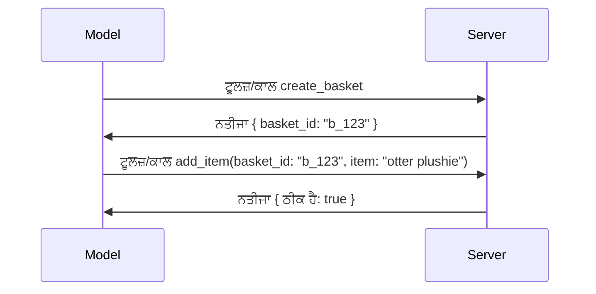

# MCP ਵਿੱਚ ਕੀ ਬਦਲ ਰਹਿਆ ਹੈ: 2026-07-28 ਰਿਲੀਜ਼ ਕੈਂਡਿਡੇਟ

> **ਸਥਿਤੀ:** ਰਿਲੀਜ਼ ਕੈਂਡਿਡੇਟ। `2026-07-28` ਵਿਸ਼ੇਸ਼ਤਾ ਲਿਖਣ ਦੇ ਸਮੇਂ ਅੰਤਿਮ ਨਹੀਂ ਹੈ। ਇਹ 21 ਮਈ, 2026 ਨੂੰ ਐਲਾਨ ਕੀਤਾ ਗਿਆ ਸੀ ਅਤੇ 28 ਜੁਲਾਈ, 2026 ਨੂੰ ਰਿਲੀਜ਼ ਕਰਨ ਲਈ ਨਿਰਧਾਰਿਤ ਹੈ। ਇਸ ਪਾਠ ਵਿੱਚ ਦਿੱਤਾ ਗਿਆ ਸਭ ਕੁਝ ਰਿਲੀਜ਼ ਕੈਂਡਿਡੇਟ ਨੂੰ ਵਰਣਨ ਕਰਦਾ ਹੈ; ਇਸ ਨਾਲ ਬਣਾਉਣ ਤੋਂ ਪਹਿਲਾਂ ਸਭ ਤੋਂ ਤਾਜ਼ਾ ਸਥਿਤੀ ਲਈ [ਡ੍ਰਾਫਟ ਵਿਸ਼ੇਸ਼ਤਾ](https://modelcontextprotocol.io/specification/draft) ਅਤੇ ਇਸ ਦਾ [ਚੇਂਜਲਾਗ](https://modelcontextprotocol.io/specification/draft/changelog) ਦੇਖੋ। ਬਾਕੀ ਇਹ ਸਿਲੇਬਸ ਮੌਜੂਦਾ ਸਥਿਰ ਰਿਲੀਜ਼, **MCP ਵਿਸ਼ੇਸ਼ਤਾ 2025-11-25** ਦੇ ਅਨੁਸਾਰ ਲਿਖਿਆ ਗਿਆ ਹੈ ਅਤੇ ਜਦੋਂ `2026-07-28` ਰਿਲੀਜ਼ ਹੋਵੇਗਾ ਤਾਂ ਇਸ ਨੂੰ ਅੱਪਡੇਟ ਕੀਤਾ ਜਾਵੇਗਾ।

## ਝਲਕ

`2026-07-28` MCP ਦਾ ਸਭ ਤੋਂ ਵੱਡਾ ਸੰਸ਼ੋਧਨ ਹੈ ਜਦੋਂ ਤੋਂ ਇਹ ਸ਼ੁਰੂਆਤ ਹੋਈ। ਛੇ Specification Enhancement Proposals (SEPs) ਪ੍ਰੋਟੋਕੋਲ ਪੱਧਰੀ ਸੈਸ਼ਨਾਂ ਨੂੰ ਹਟਾਉਂਦੀਆਂ ਹਨ ਅਤੇ MCP ਨੂੰ ਟ੍ਰਾਂਸਪੋਰਟ ਲੇਅਰ 'ਤੇ ਬਿਨਾ ਸਥਿਤੀ ਵਾਲਾ (stateless) ਬਣਾਉਂਦੀਆਂ ਹਨ, ਐਕਸਟੈਂਸ਼ਨ ਪਹਿਲੀ ਕਲਾਸ, ਵਰਜਨਡ ਮਕੈਨਿਜ਼ਮ ਬਣ ਜਾਂਦੇ ਹਨ ਅਤੇ ਅਗਲੇ ਪਾਠ ਵਿੱਚ ਤੁਸੀਂ ਸਿੱਖੇ ਗਏ ਕਈ ਫੀਚਰ (Roots, Sampling, Logging) ਨੂੰ ਨਵੇਂ ਲਾਈਫਸਾਈਕਲ ਨੀਤੀ ਅਧੀਨ ਡਿਪ੍ਰੀਕੇਟ ਡਿਕਲੇਅਰ ਕੀਤਾ ਗਿਆ ਹੈ। ਇਹ ਪਾਠ ਇਹ ਸਾਰ ਸਮੇਤਦਾ ਹੈ ਕਿ ਕੀ ਬਦਲ ਰਿਹਾ ਹੈ, ਇਹ ਕਿਉਂ ਮਾਇਨੇ ਰੱਖਦਾ ਹੈ, ਅਤੇ `2025-11-25` ਦਿਸ਼ਾ ਨੂੰ ਧਿਆਨ ਵਿੱਚ ਰੱਖ ਕੇ ਜੋ ਕੋਡ ਤੁਸੀਂ ਲਿਖਿਆ ਹੈ ਉਸ ਲਈ ਇਹ ਕੀ ਮਤਲਬ ਹੈ।

ਸਰੋਤ: [The 2026-07-28 MCP Specification Release Candidate](https://blog.modelcontextprotocol.io/posts/2026-07-28-release-candidate/) (ਮੌਡਲ ਕਾਂਟੈਕਸਟ ਪ੍ਰੋਟੋਕੋਲ ਬਲੌਗ, ਡੇਵਿਡ ਸੋਰੀਆ ਪਰਰਾ ਅਤੇ ਡੈਨ ਡੇਲਿਮਾਰਸਕੀ).

## ਸਿੱਖਿਆ ਦੇ ਉਦੇਸ਼

ਇਸ ਪਾਠ ਦੇ ਅੰਤ ਤੱਕ, ਤੁਸੀਂ ਸਮਰੱਥ ਹੋਵੋਗੇ:

- ਸਮਝਾਈਏ ਕਿ MCP ਸਥਿਤੀ-ਰਹਿਤ ਪ੍ਰੋਟੋਕੋਲ ਕੋਰ ਵੱਲ ਕਿਉਂ ਵਧ ਰਿਹਾ ਹੈ ਅਤੇ ਇਹ ਹੌਰਿਜੌਂਟਲ ਸਕੇਲਡ ਡਿਪਲੌਇਮੈਂਟ ਲਈ ਕਿਹੜਾ ਸਮੱਸਿਆ ਹੱਲ ਕਰਦਾ ਹੈ।
- ਕਿਵੇਂ `initialize`/`initialized` ਹੈਂਡਸ਼ੈਕ ਅਤੇ `Mcp-Session-Id` ਹੈਡਰ ਨੂੰ ਬਦਲਿਆ ਗਿਆ ਹੈ ਵੇਰਵਾ ਕਰੋ।
- ਨਵੇਂ `Mcp-Method` ਅਤੇ `Mcp-Name` ਹੈਡਰਾਂ ਅਤੇ `ttlMs`/`cacheScope` ਕੈਸ਼ਿੰਗ ਮੈਟਾਡੇਟਾ ਦੀ ਪਛਾਣ ਕਰੋ।
- ਐਕਸਟੈਂਸ਼ਨ ਫਰੇਮਵਰਕ ਨੂੰ ਪਛਾਣਿਆ ਜਾਵੇ ਅਤੇ ਇਸ ਰਿਲੀਜ਼ ਨਾਲ ਦੋ ਐਕਸਟੈਂਸ਼ਨ ਨਿੱਕਲ ਰਹੀ ਹਨ: MCP ਐਪਸ ਅਤੇ ਟਾਸਕਸ।
- ਛੇ ਲਾਇਸੈਂਸ SEPs ਦੀ ਸੂਚੀ ਬਤਾਓ ਜੋ OAuth 2.0 / OIDC ਅਨੁਕੂਲਤਾ ਨੂੰ ਮਜ਼ਬੂਤ ਕਰਦੇ ਹਨ।
- ਪਛਾਣੋ ਕਿ ਕਿਹੜੇ ਕੋਰ ਫੀਚਰ (Roots, Sampling, Logging) ਹੁਣ ਡਿਪ੍ਰੀਕੇਟ ਹਨ, ਅਤੇ ਕਾਰਵਾਈ ਵਿੱਚ ਇਸ ਦਾ ਕੀ ਅਰਥ ਹੈ।
- ਟੂਲ `inputSchema`/`outputSchema` ਲਈ ਫੁੱਲ JSON ਸਕੀਮਾ 2020-12 ਬਦਲਾਅ ਨੂੰ ਸਮਝਾਓ।

## ਇੱਕ ਸਥਿਤੀ-ਰਹਿਤ ਪ੍ਰੋਟੋਕੋਲ

ਮੁੱਖ ਬਦਲਾਅ: MCP ਪ੍ਰੋਟੋਕੋਲ ਲੇਅਰ 'ਤੇ ਸਥਿਤੀ-ਰਹਿਤ (stateless) ਹੋ ਜਾਂਦਾ ਹੈ।

### ਪਹਿਲਾਂ (2025-11-25): ਸੈਸ਼ਨ ਤੁਹਾਨੂੰ ਇੱਕ ਸਰਵਰ ਇੰਸਟੈਂਸ ਨਾਲ ਜੋੜਦੇ ਹਨ

Streamable HTTP ਰਾਹੀਂ ਇੱਕ ਟੂਲ ਕਾਲ ਕਰਨ ਵੇਲੇ ਇੱਕ `initialize` ਹੈਂਡਸ਼ੈਕ ਸਟਾਰਟ ਹੁੰਦਾ ਹੈ। ਸਰਵਰ ਜਵਾਬ ਦਿੰਦਾ ਹੈ `Mcp-Session-Id` ਹੈਡਰ ਨਾਲ, ਜਿਸ ਨੂੰ ਹਰ ਅਗਲੇ ਰਿਕਵੈਸਟ ਵਿੱਚ ਲੈ ਜਾਣਾ ਜਰੂਰੀ ਹੈ:

```http
POST /mcp HTTP/1.1
Mcp-Session-Id: 1868a90c-3a3f-4f5b
Content-Type: application/json

{"jsonrpc":"2.0","id":2,"method":"tools/call",
 "params":{"name":"search","arguments":{"q":"otters"}}}
```

ਕਿਉਂਕਿ ਸੈਸ਼ਨ ਕਿਸੇ ਵੀ ਸਰਵਰ ਇੰਸਟੈਂਸ ਜਿਸ ਨੇ ਇਸ ਨੂੰ ਜਾਰੀ ਕੀਤਾ, ਨਾਲ ਬੰਨ੍ਹਿਆ ਰਿਹਾ ਹੈ, ਇਸ ਲਈ ਹੌਰਿਜੈਸਟਨਲੀ ਸਕੇਲਡ ਡਿਪਲੌਇਮੈਂਟ ਨੂੰ ਲੋਡ ਬੈਲੈਂਸਰ 'ਤੇ **ਸਟਿੱਕੀ ਰਾਊਟਿੰਗ** ਅਤੇ ਇੰਸਟੈਂਸਾਂ ਵਿੱਚ **ਸਾਂਝਾ ਸੈਸ਼ਨ ਸਟੋਰ** ਦੀ ਜ਼ਰੂਰਤ ਹੁੰਦੀ ਹੈ।

### ਬਾਅਦ (2026-07-28): ਹਰ ਰਿਕਵੈਸਟ ਆਪਣੇ ਆਪ 'ਚ ਪੂਰੀ ਹੈ

```http
POST /mcp HTTP/1.1
MCP-Protocol-Version: 2026-07-28
Mcp-Method: tools/call
Mcp-Name: search
Content-Type: application/json

{"jsonrpc":"2.0","id":1,"method":"tools/call",
 "params":{"name":"search","arguments":{"q":"otters"},
           "_meta":{"io.modelcontextprotocol/clientInfo":{"name":"my-app","version":"1.0"}}}}
```

ਕੋਈ ਵੀ ਸਰਵਰ ਇੰਸਟੈਂਸ ਇਸ ਬੇਨਤੀ ਨੂੰ ਸੰਭਾਲ ਸਕਦਾ ਹੈ। ਮੁੱਖ ਬਦਲਾਅ:

- **`initialize`/`initialized` ਹੈਂਡਸ਼ੈਕ ਨੂੰ ਹਟਾ ਦਿੱਤਾ ਗਿਆ ਹੈ** ([SEP-2575](https://github.com/modelcontextprotocol/modelcontextprotocol/pull/2575))। ਪ੍ਰੋਟੋਕੋਲ ਵਰਜਨ, ਕਲਾਇੰਟ ਜਾਣਕਾਰੀ, ਅਤੇ ਕਲਾਇੰਟ ਸਮਰੱਥਾਵਾਂ ਹਰੇਕ ਬੇਨਤੀ ਵਿੱਚ `_meta` ਵਿੱਚ ਚਲੇ ਜਾਂਦੇ ਹਨ। ਇੱਕ ਨਵਾਂ `server/discover` ਮੈਥਡ ਕਲਾਇੰਟ ਨੂੰ ਸਰਵਰ ਦੀਆਂ ਸਮਰੱਥਾਵਾਂ ਪਹਿਲਾਂ ਪਰਾਪਤ ਕਰਨ ਦੀ ਆਗਿਆ ਦਿੰਦਾ ਹੈ ਜਦੋਂ ਉਹਨਾਂ ਦੀ ਲੋੜ ਹੋਵੇ।
- **`Mcp-Session-Id` ਹੈਡਰ ਅਤੇ ਪ੍ਰੋਟੋਕੋਲ ਪੱਧਰੀ ਸੈਸ਼ਨ ਨੂੰ ਹਟਾ ਦਿੱਤਾ ਗਿਆ ਹੈ** ([SEP-2567](https://github.com/modelcontextprotocol/modelcontextprotocol/pull/2567))। ਸਟਿੱਕੀ ਰਾਊਟਿੰਗ ਅਤੇ ਸਾਂਝਾ ਸੈਸ਼ਨ ਸਟੋਰ ਜ਼ਰੂਰੀ ਨਹੀਂ ਰਹਿ ਜਾਂਦੇ ਪ੍ਰੋਟੋਕੋਲ ਲੇਅਰ 'ਤੇ।

### ਸਥਿਤੀ-ਰਹਿਤ ਪ੍ਰੋਟੋਕੋਲ, ਸਥਿਤੀਵਾਨ ਐਪਲੀਕੇਸ਼ਨ

ਪ੍ਰੋਟੋਕੋਲ ਪੱਧਰੀ ਸੈਸ਼ਨ ਨੂੰ ਹਟਾਉਣ ਦਾ ਮਤਲਬ ਇਹ ਨਹੀਂ ਕਿ ਤੁਹਾਡਾ ਸਰਵਰ ਸਥਿਤੀਵਾਨ ਨਹੀਂ ਰਹਿ ਸਕਦਾ। ਸਿਫਾਰਸ਼ੀ ਰਵਾਇਤ ਉਹੀ ਹੈ ਜੋ HTTP API ਹਮੇਸ਼ਾਂ ਵਰਤੇ ਹਨ: ਇੱਕ ਖਾਸ ਹੈਂਡਲ ਬਣਾ ਕੇ (`basket_id`, `browser_id`) ਇੱਕ ਟੂਲ ਕਾਲ ਤੋਂ, ਅਤੇ ਮਾਡਲ ਨੂੰ ਉਸ ਹੈਂਡਲ ਨੂੰ ਬਾਅਦ ਵਾਲੀਆਂ ਕਾਲਾਂ ਵਿੱਚ ਆਮ ਦਲੀਲ ਵਜੋਂ ਵਾਪਸ ਪਾਸ ਕਰਵਾਉਣਾ।



ਇਹ ਸਥਿਤੀ ਨੂੰ ਮਾਡਲ ਲਈ ਵਿਖਾਈ ਦੇਣਯੋਗ ਅਤੇ ਤਰਕਯੋਗ ਬਣਾਉਂਦਾ ਹੈ ਬਜਾਏ ਇਸਦੇ ਕਿ ਟ੍ਰਾਂਸਪੋਰਟ ਮੈਟਾਡੇਟਾ ਵਿੱਚ ਛੁਪਾਉਂਦਾ ਰਹੇ, ਅਤੇ ਇਹ ਕਿਸੇ ਵੀ ਸਰਵਰ ਇੰਸਟੈਂਸ ਨੂੰ ਕਿਸੇ ਵੀ ਕਾਲ ਨੂੰ ਸੰਭਾਲਣ ਦੀ ਆਗਿਆ ਦਿੰਦਾ ਹੈ।

### ਸਰਵਰ-ਤੋਂ-ਕਲਾਇੰਟ ਬੇਨਤੀਆਂ, ਦੁਬਾਰਾ ਗਠਿਤ

ਇੱਕ ਸਥਿਤੀ-ਰਹਿਤ ਪ੍ਰੋਟੋਕੋਲ ਨੂੰ ਫਿਰ ਵੀ ਇੱਕ ਤਰੀਕਾ ਚਾਹੀਦਾ ਹੈ ਕਿ ਸਰਵਰ ਕਲਾਇੰਟ ਨੂੰ ਮੱਧ-ਕਾਲ ਵਿੱਚ ਕੁਝ ਮੰਗ ਸਕੇ (ਮਿਸਾਲ ਵਜੋਂ ਇੱਕ ਪ੍ਰੇਰਣਾ ਪ੍ਰਾਰੰਭ):

- **ਸਰਵਰ-ਸ਼ੁਰੂਆਤੀ ਬੇਨਤੀਆਂ ਸਿਰਫ ਉਦੋਂ ਜਾਰੀ ਕੀਤੀਆਂ ਜਾ ਸਕਦੀਆਂ ਹਨ ਜਦੋਂ ਸਰਵਰ ਕਲਾਇੰਟ ਬੇਨਤੀ ਨੂੰ ਸਰਗਰਮੀ ਨਾਲ ਪ੍ਰਕਿਰਿਆ ਕਰ ਰਿਹਾ ਹੋਵੇ** ([SEP-2260](https://github.com/modelcontextprotocol/modelcontextprotocol/pull/2260)) — ਇਨ੍ਹਾਂ ਨੂੰ ਪਹਿਲਾਂ ਸਿਫਾਰਸ਼ ਬਣਾਇਆ ਗਿਆ ਸੀ, ਹੁਣ ਜ਼ਰੂਰੀ। ਕਦੇ ਵੀ ਯੂਜ਼ਰ ਨੂੰ ਅਚਾਨਕ ਪ੍ਰੇਰਿਤ ਨਹੀਂ ਕੀਤਾ ਜਾਂਦਾ।
- **ਮਲਟੀ ਰਾਊਂਡ-ਟ੍ਰਿਪ ਬੇਨਤੀਆਂ** ([SEP-2322](https://github.com/modelcontextprotocol/modelcontextprotocol/pull/2322)) SSE ਸਟ੍ਰੀਮ ਖੁੱਲਾ ਰੱਖਣ ਦੀ ਜਗ੍ਹਾ ਲੈਂਦੀਆਂ ਹਨ। ਇਸ ਦੀ ਥਾਂ ਸਰਵਰ `InputRequiredResult` ਵਾਪਸ ਕਰਦਾ ਹੈ:

  ```json
  {
    "resultType": "inputRequired",
    "inputRequests": {
      "confirm": {
        "type": "elicitation",
        "message": "Delete 3 files?",
        "schema": { "type": "boolean" }
      }
    },
    "requestState": "eyJzdGVwIjoxLCJmaWxlcyI6WyJhIiwiYiIsImMiXX0="
  }
  ```

  ਕਲਾਇੰਟ ਜਵਾਬ ਇਕੱਤਰ ਕਰਦਾ ਹੈ ਅਤੇ ਮੁਲਤਵੀ ਕਾਲ ਨੂੰ `inputResponses` ਅਤੇ `requestState` ਨਾਲ ਦੁਬਾਰਾ ਭੇਜਦਾ ਹੈ। ਕੋਈ ਵੀ ਸਰਵਰ ਇੰਸਟੈਂਸ ਇਹ ਮੁੜ ਕੋਸ਼ਿਸ਼ ਸੰਭਾਲ ਸਕਦਾ ਹੈ ਕਿਉਂਕਿ ਲੋੜੀਂਦਾ ਸਮਾਂ-ਸੂਤਰ ਪੇਲੋਡ 'ਚ ਹੁੰਦਾ ਹੈ।

### ਰਾਊਟੇਬਲ, ਕੈਸ਼ੇਬਲ, ਟਰੇਸੇਬਲ

ਤਿੰਨ ਛੋਟੇ ਬਦਲਾਅ ਸਥਿਤੀ-ਰਹਿਤ ਟ੍ਰੈਫਿਕ ਚਲਾਉਣਾ ਸੌਖਾ ਬਣਾਉਂਦੇ ਹਨ:

- **Streamable HTTP 'ਤੇ `Mcp-Method` ਅਤੇ `Mcp-Name` ਹੈਡਰ ਜ਼ਰੂਰੀ ਹਨ** ([SEP-2243](https://github.com/modelcontextprotocol/modelcontextprotocol/pull/2243)), ਤਾ ਕਿ ਲੋਡ ਬੈਲੈਂਸਰ, ਗੇਟਵੇਜ਼, ਅਤੇ ਰੇਟ ਲਿਮਟਰ ਆਪਰੇਸ਼ਨ ਨੂੰ ਰੂਟ ਕਰ ਸਕਣ ਬਿਨਾਂ JSON ਬਾਡੀ ਦੀ ਜਾਂਚ ਕੀਤੇ। ਸਰਵਰ ਉਹ ਬੇਨਤੀਆਂ ਰੱਦ ਕਰਦੇ ਹਨ ਜਿੱਥੇ ਹੈਡਰ ਅਤੇ ਬਾਡੀ ਵਿੱਚ ਅਸਹਿਮਤੀ ਹੁੰਦੀ ਹੈ।
- **`tools/list` ਅਤੇ ਰਿਸੋਰਸ ਪੜ੍ਹਨ ਦੇ ਨਤੀਜੇ `ttlMs` ਅਤੇ `cacheScope` ਨਾਲ ਆਉਂਦੇ ਹਨ** ([SEP-2549](https://github.com/modelcontextprotocol/modelcontextprotocol/pull/2549)), HTTP `Cache-Control` ਦੇ ਮਾਡਲ ਤੇ। ਕਲਾਇੰਟ ਜਾਣਦੇ ਹਨ ਕਿ ਇੱਕ ਸੂਚੀ ਨਤੀਜਾ ਕਿੰਨੇ ਸਮੇਂ ਤਾਜ਼ਾ ਹੈ ਅਤੇ ਕੀ ਇਹ ਸੰਜਾਂ ਕਰਨਾ ਸੁਰੱਖਿਅਤ ਹੈ, ਬਿਨਾਂ ਕਿਸੇ ਲੰਬੇ ਸਮੇਂ ਵਾਲੀ SSE ਸਟ੍ਰੀਮ ਦੀ ਲੋੜ ਦੇ।
- **W3C Trace Context ਪ੍ਰਸਾਰਣ `_meta` ਵਿੱਚ ਦਸਤਾਵੇਜ਼ ਕੀਤਾ ਗਿਆ ਹੈ** ([SEP-414](https://github.com/modelcontextprotocol/modelcontextprotocol/pull/414)), `traceparent`, `tracestate`, ਅਤੇ `baggage` ਕੁੰਜੀ ਨਾਮਾਂ ਨੂੰ ਠੀਕ ਕਰਦਾ ਹੈ ਤਾਂ ਜੋ ਇੱਕ ਵਿਤਰਿਤ ਟਰੇਸ ਕਾਲ ਦੀ ਪਾਲਣਾ ਕਰ ਸਕੇ ਕਲਾਇੰਟ SDK, MCP ਸਰਵਰ, ਅਤੇ ਡਾਉਨਸਟਰੀਮ ਸਿਸਟਮਾਂ ਵਿੱਚ [OpenTelemetry](https://opentelemetry.io/)-ਅਨੁਕੂਲ ਬੈਕਐਂਡ ਵਿੱਚ।

## ਐਕਸਟੈਂਸ਼ਨ ਪਹਿਲੀ ਕਲਾਸ ਬਣ ਜਾਂਦੇ ਹਨ

ਐਕਸਟੈਂਸ਼ਨ `2025-11-25` ਵਿੱਚ ਗੈਰ-ਰਸਮੀ ਤੌਰ 'ਤੇ ਮੌਜੂਦ ਸਨ। [SEP-2133](https://github.com/modelcontextprotocol/modelcontextprotocol/pull/2133) ਉਨ੍ਹਾਂ ਨੂੰ ਫਾਰਮਲ ਕਰਦਾ ਹੈ:

- ਐਕਸਟੈਂਸ਼ਨ ਨੂੰ ਰਿਵਰਸ-DNS ਆਈਡੀਜ਼ ਨਾਲ ਪਛਾਣਿਆ ਜਾਂਦਾ ਹੈ।
- ਇਹਨੂੰ ਕਲਾਇੰਟ ਅਤੇ ਸਰਵਰ ਸਮਰੱਥਾਵਾਂ ਵਿੱਚ `extensions` ਮੈਪ ਰਾਹੀਂ ਸਹਿਮਤ ਕੀਤਾ ਜਾਂਦਾ ਹੈ।
- ਇਹ ਆਪਣੇ ਆਪਣੇ `ext-*` ਰਿਪੋਜ਼ਟਰੀਆਂ ਵਿੱਚ ਰਹਿੰਦੇ ਹਨ, ਜਿਹਨਾਂ ਦੁਆਰਾ ਦੇlegeਟ ਕੀਤੇ ਗਏ ਮੇਨਟੇਨਰ ਅਤੇ ਕੋਰ ਵਿਸ਼ੇਸ਼ਤਾ ਤੋਂ ਕਰਨਾਂ ਇੱਕੋ-ਦੂਜੇ ਤੋਂ ਅਜ਼ਾਦ ਵਰਜਨਿੰਗ ਹੁੰਦੀ ਹੈ।
- SEP ਪ੍ਰਕਿਰਿਆ ਵਿੱਚ ਨਵਾਂ ਐਕਸਟੈਂਸ਼ਨ ਟਰੈਕ ਉਹਨਾਂ ਨੂੰ ਅਜ਼ਮਾਇਸ਼ੀ ਤੋਂ ਅਧਿਕਾਰਿਕ ਤੱਕ ਦੇ ਰਸਤੇ ਦਿੰਦਾ ਹੈ।

ਇਹ ਰਿਲੀਜ਼ ਦੋ ਅਧਿਕਾਰਿਕ ਐਕਸਟੈਂਸ਼ਨ ਨੂੰ ਰਿਲੀਜ਼ ਕਰਦਾ ਹੈ।

### MCP ਐਪਸ: ਸਰਵਰ-ਰੈਂਡਰ ਕੀਤੇ ਯੂਜ਼ਰ ਇੰਟਰਫੇਸ

[MCP Apps](https://blog.modelcontextprotocol.io/posts/2026-01-26-mcp-apps/) ([SEP-1865](https://github.com/modelcontextprotocol/modelcontextprotocol/pull/1865)) ਸਰਵਰ ਨੂੰ ਇੰਟਰੈਕਟਿਵ HTML ਇੰਟਰਫੇਸ ਭੇਜਣ ਲਈ ਆਗਿਆ ਦਿੰਦਾ ਹੈ ਜੋ ਹੋਸਟ ਇੱਕ ਸੈਂਡਬਾਕਸ ਆਈਫ੍ਰੇਮ ਵਿੱਚ ਰੇਂਡਰ ਕਰਦੇ ਹਨ। ਟੂਲ ਆਪਣੇ ਯੂਆਈ ਟੈਂਪਲੇਟ ਪਹਿਲਾਂ ਹੀ ਘੋਸ਼ਿਤ ਕਰਦੇ ਹਨ ਤਾਂ ਜੋ ਹੋਸਟ ਪਹਿਲਾਂ ਤੋਂ ਪ੍ਰੀਫੈਚ, ਕੈਸ਼ ਅਤੇ ਸੁਰੱਖਿਆ ਸਮੀਖਿਆ ਕਰ ਸਕਣ। ਤੁਸੀਂ ਪਹਿਲਾਂ ਹੀ ਇਸ ਦੇ ਮੂਲ ਤੱਤ [Lesson 15: MCP Apps](../03-GettingStarted/15-mcp-apps/README.md) ਵਿੱਚ ਕਵਰ ਕਰ ਚੁੱਕੇ ਹੋ — ਐਕਸਟੈਂਸ਼ਨ ਫਰੇਮਵਰਕ ਦੇ ਤਹਤ MCP ਐਪਸ ਹੁਣ ਅਧਿਕਾਰਤ ਤੌਰ 'ਤੇ ਇੱਕ ਐਕਸਟੈਂਸ਼ਨ ਹੈ ਨਾ ਕਿ ਪ੍ਰਯੋਗਾਤਮਕ ਕੋਰ ਫੀਚਰ।

### ਟਾਸਕਸ ਇੱਕ ਐਕਸਟੈਂਸ਼ਨ ਵਜੋਂ ਗ੍ਰੈਜੂਏਟ

ਟਾਸਕਸ `2025-11-25` ਵਿੱਚ ਇੱਕ ਪ੍ਰਯੋਗਾਤਮਕ ਕੋਰ ਫੀਚਰ ਵਜੋਂ ਸ਼ਿਪ ਕੀਤੇ ਗਏ ਸਨ। ਪ੍ਰੋਡਕਸ਼ਨ ਵਰਤੋਂ ਨੇ ਇੰਨਾ ਨਵਾਂ ਡਿਜ਼ਾਈਨ ਕੀਤਾ ਕਿ ਇਸ ਦਾ ਸਹੀ ਘਰ ਇੱਕ ਐਕਸਟੈਂਸ਼ਨ ਹੈ: [Tasks extension](https://github.com/modelcontextprotocol/modelcontextprotocol/pull/2663) ਸਥਿਤੀ-ਰਹਿਤ ਮਾਡਲ ਦੇ ਆਲੇ-ਦੁਆਲੇ ਲਾਈਫਸਾਈਕਲ ਨੂੰ ਮੁੜ ਗਠਿਤ ਕਰਦਾ ਹੈ — ਇੱਕ ਸਰਵਰ `tools/call` ਦਾ ਜਵਾਬ ਟਾਸਕ ਹੈਂਡਲ ਨਾਲ ਦੇ ਸਕਦਾ ਹੈ, ਅਤੇ ਕਲਾਇੰਟ `tasks/get`, `tasks/update`, ਅਤੇ `tasks/cancel` ਨਾਲ ਇਸਨੂੰ ਅੱਗੇ ਚਲਾ ਸਕਦਾ ਹੈ। ਟਾਸਕ ਬਣਾਉਣਾ ਸਰਵਰ-ਦਿਸ਼ਾ-ਨਿਰਦੇਸ਼ਤ ਹੁੰਦਾ ਹੈ: ਕਲਾਇੰਟ ਐਕਸਟੈਂਸ਼ਨ ਨੂੰ ਪ੍ਰਚਾਰਿਤ ਕਰਦਾ ਹੈ, ਅਤੇ ਸਰਵਰ ਫੈਸਲਾ ਕਰਦਾ ਹੈ ਕਿ ਕਦੋਂ ਕਾਲ ਟਾਸਕ ਵਜੋਂ ਚਲਾਈ ਜਾਵੇ। `tasks/list` ਪੂਰੀ ਤਰ੍ਹਾਂ ਹਟਾ ਦਿੱਤਾ ਗਿਆ ਹੈ ਕਿਉਂਕਿ ਇਹ ਸੈਸ਼ਨਾਂ ਬਿਨਾਂ ਸੁਰੱਖਿਅਤ ਤਰੀਕੇ ਨਾਲ ਨਿਯੰਤ੍ਰਿਤ ਨਹੀਂ ਕੀਤਾ ਜਾ ਸਕਦਾ।

> **ਮਾਈਗ੍ਰੇਸ਼ਨ ਨੋਟ:** ਜੇਕਰ ਤੁਸੀਂ ਪ੍ਰਯੋਗਾਤਮਕ `2025-11-25` ਟਾਸਕ API ਨੂੰ ਲਾਗੂ ਕੀਤਾ ਸੀ, ਤਾਂ ਤੁਹਾਨੂੰ ਨਵੇਂ ਐਕਸਟੈਂਸ਼ਨ ਲਾਈਫਸਾਈਕਲ ਵਿੱਚ ਮਾਈਗ੍ਰੇਟ ਕਰਨਾ ਪਵੇਗਾ — ਇਹ ਪਿਛਲੇ ਵਰਜਨ ਨਾਲ ਅਨੁਕੂਲ ਨਹੀਂ ਹੈ।

## ਪ੍ਰाधिकਰਨ ਮਜ਼ਬੂਤੀ

ਛੇ SEPs [ਪ੍ਰाधिकਰਨ ਵਿਸ਼ੇਸ਼ਤਾ](https://modelcontextprotocol.io/specification/draft/basic/authorization) ਨੂੰ ਮਜ਼ਬੂਤ ਕਰਦੇ ਹਨ ਤਾਂ ਕਿ ਇਸਦਾ ਅਸਲੀ OAuth 2.0 / OpenID Connect ਡਿਪਲੌਇਮੈਂਟ ਨਾਲ ਜ਼ਿਆਦਾ ਸਮੰਵਯ ਹੋ ਸਕੇ:

| SEP | ਬਦਲਾਅ |
|---|---|
| [SEP-2468](https://github.com/modelcontextprotocol/modelcontextprotocol/pull/2468) | ਕਲਾਇੰਟ ਨੂੰ ਪ੍ਰाधिकਰਨ ਜਵਾਬਾਂ 'ਤੇ `iss` ਪੈਰਾਮੀਟਰ ਦੀ ਪ੍ਰਮਾਣਿਕਤਾ ਕਰਨੀ ਚਾਹੀਦੀ ਹੈ [RFC 9207](https://www.rfc-editor.org/rfc/rfc9207) ਅਨੁਸਾਰ, ਜਿਸ ਨਾਲ MCP ਦੇ ਇੱਕ ਕਲਾਇੰਟ, ਕਈ ਸਰਵਰ ਪੈਟਰਨ ਵਿੱਚ ਆਮ 'ਮਿਕਸ-ਅੱਪ' ਹਮਲਿਆਂ ਤੋਂ ਬਚਾਅ ਹੁੰਦਾ ਹੈ। ਭਵਿੱਖ ਦੀ ਵਰਜ਼ਨ `iss` ਵਾਂਗੂ ਜਵਾਬਾਂ ਨੂੰ ਅਸਵੀਕਾਰ ਕਰਨ ਦੀ ਮੰਗ ਕਰੇਗੀ। |
| [SEP-837](https://github.com/modelcontextprotocol/modelcontextprotocol/pull/837) | ਕਲਾਇੰਟ ਆਪਣੀ OpenID Connect `application_type` ਡਾਇਨਾਮਿਕ ਕਲਾਇੰਟ ਰਜਿਸਟਰੇਸ਼ਨ ਦੌਰਾਨ ਘੋਸ਼ਿਤ ਕਰਦੇ ਹਨ, ਜਿਸ ਨਾਲ ਪ੍ਰाधिकਰਨ ਸਰਵਰ ਡੈਸਕਟਾਪ/CLI ਕਲਾਇੰਟ ਨੂੰ `"web"` ਸਥਾਨ ਬਦਲਣ ਅਤੇ ਇਸਦੇ ਲੋਕਲਹੋਸਟ ਰੀਡਾਇਰੈਕਟ URI ਨੂੰ ਅਸਵਿਕਾਰ ਕਰਨ ਤੋਂ ਬਚ ਜਾਂਦੇ ਹਨ। |
| [SEP-2352](https://github.com/modelcontextprotocol/modelcontextprotocol/pull/2352) | ਕਲਾਇੰਟ ਰਜਿਸਟਰ ਕੀਤੀਆਂ ਸਾਖਾਂ ਨੂੰ ਪ੍ਰਮਾਣਿਕ ਕਰਨ ਵਾਲੇ ਪ੍ਰाधिकਰਨ ਸਰਵਰ ਦੇ `issuer` ਨਾਲ ਬਾਂਧਦੇ ਹਨ ਅਤੇ ਜਦੋਂ ਰਿਸੋਰਸ ਇੱਕ ਸਰਵਰ ਤੋਂ ਦੂਜੇ ਸਰਵਰ ਤੇ ਸਥਾਨਾਂਤਰਿਤ ਹੁੰਦਾ ਹੈ ਤਦ ਮੁੜ ਰਜਿਸਟਰ ਕਰਦੇ ਹਨ। |
| [SEP-2207](https://github.com/modelcontextprotocol/modelcontextprotocol/pull/2207) | ਦਸਤਾਵੇਜ਼ ਕਰਦਾ ਹੈ ਕਿ ਕਿਸ ਤਰ੍ਹਾਂ OpenID Connect-ਸ਼ੈਲੀ ਪ੍ਰाधिकਰਨ ਸਰਵਰ ਤੋਂ ਰੀਫਰੈਸ਼ ਟੋਕਨ ਮੰਗਣੇ ਹਨ। |
| [SEP-2350](https://github.com/modelcontextprotocol/modelcontextprotocol/pull/2350) | ਸਟੈਪ-ਅੱਪ ਪ੍ਰाधिकਰਨ ਦੌਰਾਨ ਸਕੋਪ ਇਕੱਤਰ ਕਰਨ ਨੂੰ ਸਪਸ਼ਟ ਕਰਦਾ ਹੈ। |
| [SEP-2351](https://github.com/modelcontextprotocol/modelcontextprotocol/pull/2351) | `.well-known` ਖੋਜ ਸਫਿਕਸ ਨੂੰ ਸਪਸ਼ਟ ਕਰਦਾ ਹੈ। |

ਜੇ ਤੁਸੀਂ ਅੱਜ ਦੇ MCP ਲਈ ਪ੍ਰाधिकਰਨ ਸਰਵਰ ਬਣਾ ਰਹੇ ਹੋ, ਤਾਂ ਪ੍ਰाधिकਰਨ ਜਵਾਬਾਂ ਵਿੱਚ ਹੁਣੇ `iss` ਪ੍ਰਦਾਨ ਕਰਨਾ ਸ਼ੁਰੂ ਕਰੋ — ਮੌਜੂਦਾ ਪ੍ਰाधिकਰਨ ਮਾਰਗਦਰਸ਼ਨ ਲਈ [02-Security](../02-Security/README.md) ਵੇਖੋ ਜਿਸ 'ਤੇ ਇਹ ਨਿਰਭਰ ਕਰੇਗਾ।

## Roots, Sampling, ਅਤੇ Logging ਨੂੰ ਡਿਪ੍ਰੀਕੇਟ ਕੀਤਾ ਗਿਆ ਹੈ

ਨਵੇਂ [ਫੀਚਰ ਲਾਈਫਸਾਈਕਲ ਨੀਤੀ](https://github.com/modelcontextprotocol/modelcontextprotocol/pull/2577) ([SEP-2577](https://github.com/modelcontextprotocol/modelcontextprotocol/pull/2577)) ਅਧੀਨ, ਤਿੰਨ ਮੁੱਖ ਕਲਾਇੰਟ ਪ੍ਰਿਮਿਟਿਵਜ਼ ਜੋ ਤੁਸੀਂ [Core Concepts](./README.md#roots) ਵਿੱਚ ਸਿੱਖੇ ਸਨ, ਉਹ **ਡਿਪ੍ਰੀਕੇਟਿਡ** ਸਥਿਤੀ ਵਿੱਚ ਚਲੇ ਜਾਂਦੇ ਹਨ:

| ਫੀਚਰ | ਸਿਫਾਰਸ਼ੀ ਬਦਲੀ |
|---|---|
| Roots | ਟੂਲ ਪੈਰਾਮੀਟਰ, ਰਿਸੋਰਸ URI, ਜਾਂ ਸਰਵਰ ਸੰਰਚਨਾ |
| Sampling | LLM ਪ੍ਰਦਾਤਾ API ਨਾਲ ਸਿੱਧੀ ਇੰਟੀਗ੍ਰੇਸ਼ਨ |
| Logging | stdio ਟ੍ਰਾਂਸਪੋਰਟ ਲਈ `stderr`; ਢਾਂਚਾ ਬਧੀ ਪ੍ਰੇਖਿਆ ਲਈ OpenTelemetry |

ਇਹ **ਸਿਰਫ ਟਿੱਪਣੀ ਲਈ ਡਿਪ੍ਰੀਕੇਸ਼ਨ** ਹਨ: ਮੈਥਡ, ਕਿਸਮਾਂ, ਅਤੇ ਸਮਰੱਥਾ ਫਲੈਗ ਇਸ ਰਿਲੀਜ਼ ਅਤੇ ਇਸ ਦੇ ਇੱਕ ਸਾਲ ਦੇ ਅੰਦਰ ਪ੍ਰਕਾਸ਼ਿਤ ਹਰ ਵਰਜ਼ਨ ਵਿੱਚ ਕੰਮ ਕਰਦੇ ਰਹਿਣਗੇ। ਓਹਨਾਂ ਵਿੱਚੋਂ ਕੁਰਸੀ ਤੋਂ ਹਟਾਉਣ ਲਈ ਲਾਈਫਸਾਈਕਲ ਨੀਤੀ ਅਧੀਨ ਵੱਖਰੇ SEP ਦੀ ਲੋੜ ਹੋਵੇਗੀ — ਇਸ ਲਈ ਤੁਹਾਡੇ ਮੌਜੂਦਾ [Sampling](../03-GettingStarted/14-sampling/README.md) ਨਮੂਨਾਂ ਨੂੰ ਅੱਜ ਕੋਈ ਨੁਕਸਾਨ ਨਹੀਂ ਹੋਏਗਾ, ਪਰ ਨਵੇਂ ਸਰਵਰ ਉਪਰੋਕਤ ਬਦਲੀ ਪੈਟਰਨ ਨੂੰ ਤਰਜੀਹ ਦੇਣ।

## ਟੂਲਾਂ ਲਈ ਫੁੱਲ JSON ਸਕੀਮਾ 2020-12

ਟੂਲ `inputSchema` ਅਤੇ `outputSchema` ਨੂੰ ਪੂਰੀ [JSON Schema 2020-12](https://json-schema.org/draft/2020-12) ਤੱਕ ਉੱਚਾ ਕੀਤਾ ਗਿਆ ਹੈ ([SEP-2106](https://github.com/modelcontextprotocol/modelcontextprotocol/pull/2106)):

- ਇਨਪੁੱਟ ਸਕੀਮਾਂ `type: "object"` ਮੂਲ ਸੀਮਾ ਬਰਕਰਾਰ ਰੱਖਦੀਆਂ ਹਨ ਪਰ ਹੁਣ ਸਮੇਟਣ (`oneOf`, `anyOf`, `allOf`), ਸ਼ਰਤੀ, ਅਤੇ ਸੰਦਰਭ (`$ref`, `$defs`) ਦੀ ਆਗਿਆ ਦਿੰਦੀਆਂ ਹਨ।
- ਆਉਟਪੁੱਟ ਸਕੀਮਾਂ ਅਣਬੰਧਤ ਹਨ, ਅਤੇ `structuredContent` ਹੁਣ ਕਿਸੇ ਵੀ JSON ਮੁੱਲ ਹੋ ਸਕਦਾ ਹੈ ਨਾ ਕਿ ਸਿਰਫ ਇੱਕ ਆਬਜੈਕਟ।
- ਇੰਪਲੀਮੇਟੇਸ਼ਨ ਨੂੰ ਬਾਹਰੀ `$ref` URIਾਂ ਸਵੈਚਲਿਤ ਤੌਰ 'ਤੇ ਦਰਜ ਨਹੀਂ ਕਰਨੀ ਚਾਹੀਦੀ ਅਤੇ ਸਕੀਮਾ ਗਹਿਰਾਈ ਅਤੇ ਸੱਚਾਈ ਸਮਾਂ ਸੀਮਾ ਵਿੱਚ ਰੱਖਣੀ ਚਾਹੀਦੀ ਹੈ (ਇੱਕ ਸੇਵਾ ਅਣਡੁੱਲਣ ਦੀ ਸੋਚ ਜੋ ਤੁਸੀਂ ਸਰਵਰ-ਪਾਸੇ ਸਕੀਮਾਂ ਦੀ ਸਚਾਈ ਕਰ ਰਹੇ ਹੋ ਤਾਂ ਸੀਮਿਤ ਕਰਨੀ ਚਾਹੀਦੀ ਹੈ)।

ਵੱਖਰਾ, ਗੁਮ ਰਿਸੋਰਸ ਲਈ ਗਲਤੀ ਕੋਡ MCP ਖਾਸ `-32002` ਤੋਂ JSON-RPC ਮਿਆਰੀ `-32602` (ਅਵੈਧ ਪੈਰਾਮ) ਵਿੱਚ ਬਦਲਦਾ ਹੈ ([SEP-2164](https://github.com/modelcontextprotocol/modelcontextprotocol/pull/2164))। ਜੇ ਤੁਹਾਡਾ ਕਲਾਇੰਟ ਸਿੱਧੀ `-32002` ਨੂੰ ਮਿਲਾਉਂਦਾ ਹੈ, ਤਦ ਤੁਹਾਨੂੰ ਇਸ ਨੂੰ ਅੱਪਡੇਟ کرنا ਪਵੇਗਾ।

## ਪ੍ਰੋਟੋਕੋਲ ਇੱਥੋਂ ਕਿਵੇਂ ਵਿਕਸਿਤ ਹੁੰਦਾ ਹੈ

ਇਹ ਰਿਲੀਜ਼ ਤੋੜ-ਫੋੜ ਵਾਲੇ ਬਦਲਾਅ ਲਿਆਉਂਦੀ ਹੈ, ਜਿਸਦਾ MCP ਮੇਨਟੇਨਰ ਭਵਿੱਖ ਵਿੱਚ ਆਮ ਕਰਨ ਦੀ ਸੋਚ ਨਹੀਂ ਰੱਖਦੇ। ਤਿੰਨ ਗਵਰਨੈਂਸ SEPs ਦੁਹਰਾਉਣ ਤੋਂ ਬਚਾਅ ਲਈ ਉਦੇਸ਼ਿਤ ਹਨ:

- **ਫੀਚਰ ਲਾਈਫਸਾਈਕਲ ਨੀਤੀ** ਹਰ ਫੀਚਰ ਨੂੰ ਸਰਗਰਮ → ਡਿਪ੍ਰੀਕੇਟ → ਹਟਾਏ ਜਾਣ ਦਾ ਰਸਤਾ ਦਿੰਦੀ ਹੈ, ਜਿਸ ਵਿੱਚ ਡਿਪ੍ਰੀਕੇਸ਼ਨ ਅਤੇ ਹਟਾਏ ਜਾਣ ਵਿੱਚ ਘੱਟੋ-ਘੱਟ ਬਾਰਾਂ ਮਹੀਨੇ ਹੁੰਦੇ ਹਨ।
- **ਐਕਸਟੈਂਸ਼ਨ ਫਰੇਮਵਰਕ** ਨਵੀਆਂ ਸਮਰੱਥਾਵਾਂ ਨੂੰ ਵਿਕਲਪਿਕ ਐਕਸਟੈਂਸ਼ਨ ਵਜੋਂ ਭੇਜਣ ਅਤੇ ਉੱਥੇ ਥਿਰ ਕਰਨ ਦੀ ਆਗਿਆ ਦਿੰਦਾ ਹੈ, ਫਿਰ (ਜੇ ਕਦੇ) ਉਹ ਮੂਲ ਵਿਸ਼ੇਸ਼ਤਾ ਵਿੱਚ ਸ਼ਾਮਿਲ ਕੀਤੀਆਂ ਜਾਂਦੀਆਂ ਹਨ।

- ਇੱਕ Standards Track SEP ਫਾਈਨਲ ਸਥਿਤੀ ਤੱਕ ਨਹੀਂ ਪਹੁੰਚ ਸਕਦਾ ਜਦ ਤੱਕ ਇੱਕ ਮਿਲਦੀ-ਜੁਲਦੀ ਸਥਿਤੀ [conformance suite](https://github.com/modelcontextprotocol/conformance) ਵਿੱਚ ਨਹੀਂ ਆਉਂਦੀ ([SEP-2484](https://github.com/modelcontextprotocol/modelcontextprotocol/pull/2484)) — ਜੋ ਕਿ ਓਹੀ ਸੁਟ ਹੈ ਜਿਸ 'ਤੇ [SDK tier system](https://github.com/modelcontextprotocol/modelcontextprotocol/pull/1777) ਅਧਿਕਾਰਤ SDKs ਨੂੰ ਸਕੋਰ ਕਰਦਾ ਹੈ।

## ਰਿਲੀਜ਼ ਟਾਈਮਲਾਈਨ ਅਤੇ ਵੈਲਡੇਸ਼ਨ

- ਰਿਲੀਜ਼ ਉਮੀਦਵਾਰ 21 ਮਈ, 2026 ਨੂੰ ਲੌਕ ਕੀਤਾ ਗਿਆ ਸੀ।
- ਅੰਤਿਮ ਵਿਸ਼ੇਸ਼ਤਾ 28 ਜੁਲਾਈ, 2026 ਨੂੰ ਨਿਯਤ ਹੈ।
- ਦੋਹਾਂ ਵਿਚਕਾਰ ਦਸ ਹਫ਼ਤੇ ਦਾ ਸਮਾਂ SDK ਮੈਨਟੇਨਰਾਂ ਅਤੇ ਕਲਾਇੰਟ ਇੰਪਲੀਮੈਂਟਰਾਂ ਨੂੰ ਬਦਲਾਵਾਂ ਨੂੰ ਅਸਲੀ ਕੰਮਕਾਜ ਦੇ ਮੁਕਾਬਲੇ ਵੈਰੀਫਾਈ ਕਰਨ ਲਈ ਦਿੰਦਾ ਹੈ; Tier 1 SDKs ਉਮੀਦ ਕੀਤੀ ਜਾਂਦੀ ਹੈ ਕਿ ਇਸ ਸਮੇਂ ਅੰਦਰ ਸਹਿਯੋਗ ਭੇਜਣਗੇ [SDK tier system](https://modelcontextprotocol.io/docs/sdk) ਅਣੁਸਾਰ।
- ਬਦਲਾਅ ਦੀ ਪੂਰੀ ਸੂਚੀ [ਡ੍ਰਾਫਟ ਵਿਸ਼ੇਸ਼ਤਾ](https://modelcontextprotocol.io/specification/draft) ਅਤੇ ਇਸਦੇ [ਚੇਂਜਲੌਗ](https://modelcontextprotocol.io/specification/draft/changelog) ਵਿੱਚ ਟ੍ਰੈਕ ਕਰੋ।

## ਇਸ ਸਿਲੇਬਸ ਲਈ ਇਸਦਾ ਕੀ ਮਤਲਬ ਹੈ

ਇਸ ਕੋਰਸ ਵਿੱਚ ਹੁਣ ਤੱਕ ਤੁਸੀਂ ਜੋ ਕੁਝ ਸਿੱਖਿਆ ਹੈ ਉਹ ਸਾਰੇ **2025-11-25** ਲਈ ਨਿਸ਼ਾਨਾ ਬਣਾਇਆ ਗਿਆ ਹੈ, ਜੋ ਕਿ ਵਰਤਮਾਨ ਸਥਿਰ ਵਿਸ਼ੇਸ਼ਤਾ ਰਹੇਗਾ ਜਦ ਤੱਕ `2026-07-28` ਜਾਰੀ ਹੁੰਦਾ ਹੈ। ਵਿਸਥਾਰ ਵਿੱਚ:

- **ਸੈਸ਼ਨ ਅਤੇ `initialize` ਹੈਂਡਸ਼ੇਕ** (ਜੋ ਕਿ [ਮੂਲ ਧਾਰਣਾਵਾਂ](./README.md) ਅਤੇ [ਪਾਠ 6: HTTP ਸਟ੍ਰੀਮਿੰਗ](../03-GettingStarted/06-http-streaming/README.md) ਵਿੱਚ ਕਵਰ ਕੀਤਾ ਗਿਆ ਹੈ) ਅੱਜ ਦੇ ਦਸਤਾਵੇਜ਼ਾਂ ਵਾਂਗ ਕੰਮ ਕਰਦੇ ਹਨ, ਪਰ ਉਮੀਦ ਹੈ ਕਿ ਇਹ `2026-07-28`-ਅਨੁਕੂਲ SDKs ਨੂੰ ਅਪਗ੍ਰੇਡ ਕਰਨ 'ਤੇ ਨਾਲ ਸਟੈਟਲੇਸ ਰਿਕਵੈਸਟ ਮਾਡਲ ਨਾਲ ਬਦਲ ਦਿੱਤੇ ਜਾਣਗੇ।
- **ਸੈਮਪਲਿੰਗ ਅਤੇ ਰੂਟਸ** (ਜੋ ਵੀ [ਮੂਲ ਧਾਰਣਾਵਾਂ](./README.md) ਵਿੱਚ ਕਵਰ ਕੀਤੇ ਗਏ ਹਨ) ਪੂਰੀ ਤਰ੍ਹਾਂ ਕਾਰਗਰ ਹਨ ਪਰ Deprecated ਹਨ — ਨਵੇਂ ਡਿਜ਼ਾਈਨਾਂ ਨੂੰ ਉਪਰ ਦਿੱਤੇ ਬਦਲੀ ਵਾਲੇ ਪੈਟਰਨ ਵਰਤਣੇ ਚਾਹੀਦੇ ਹਨ।
- **ਪ੍ਰਯੋਗਾਤਮਕ ਟਾਸਕ ਫੀਚਰ**, ਜੇ ਤੁਸੀਂ ਇਸਦਾ ਇਸਤੇਮਾਲ ਕੀਤਾ ਹੈ, ਤਾਂ ਇਹਨੂੰ ਟਾਸਕ ਐਕਸਟੇਨਸ਼ਨ ਦੇ ਨਵੇਂ ਲਾਈਫਸਾਈਕਲ ਨੂੰ ਮਾਈਗ੍ਰੇਟ ਕਰਨ ਦੀ ਲੋੜ ਹੋਵੇਗੀ।
- **MCP ਐਪਸ** ([ਪਾਠ 15](../03-GettingStarted/15-mcp-apps/README.md)) ਅਮਲੀ ਤੌਰ 'ਤੇ ਪ੍ਰਭਾਵਿਤ ਨਹੀਂ ਹੁੰਦੇ; ਇਹ ਸਿਰਫ਼ ਰਸਮੀ ਐਕਸਟੇਨਸ਼ਨ ਫਰੇਮਵਰਕ ਹੇਠਾਂ ਆ ਜਾਂਦੇ ਹਨ।

## ਵਧੇਰੇ ਸਰੋਤ

- [2026-07-28 MCP ਵਿਸ਼ੇਸ਼ਤਾ ਰਿਲੀਜ਼ ਉਮੀਦਵਾਰ (ਬਲੌਗ ਪੋਸਟ)](https://blog.modelcontextprotocol.io/posts/2026-07-28-release-candidate/)
- [MCP ਟ੍ਰਾਂਸਪੋਰਟ ਦਾ ਭਵਿੱਖ](https://blog.modelcontextprotocol.io/posts/2025-12-19-mcp-transport-future/)
- [MCP ਡ੍ਰਾਫਟ ਵਿਸ਼ੇਸ਼ਤਾ](https://modelcontextprotocol.io/specification/draft)
- [MCP ਡ੍ਰਾਫਟ ਚੇਂਜਲਾਗ](https://modelcontextprotocol.io/specification/draft/changelog)
- [SEP ਹਦਾਇਤਾਂ](https://modelcontextprotocol.io/community/sep-guidelines)
- [MCP SDK ਟੀਅਰ ਸਿਸਟਮ](https://modelcontextprotocol.io/docs/sdk)

## ਅਗਲੇ ਕਦਮ

ਮੁੜ ਜਾਓ [ਮੂਲ ਧਾਰਣਾਵਾਂ](./README.md) ਵੱਲ ਜਾਂ ਜਾਰੀ ਰੱਖੋ [ਸੁਰੱਖਿਆ](../02-Security/README.md) ਇਹ ਵੇਖਣ ਲਈ ਕਿ ਅੱਜ ਦਾ `2025-11-25` ਮਾਰਗਦਰਸ਼ਨ ਕਿਵੇਂ ਜਾ ਰਿਹਾ ਹੈ ਜੋ ਆ ਰਹਿਆ ਹੈ।

---

<!-- CO-OP TRANSLATOR DISCLAIMER START -->
**ਅਸਵੀਕਾਰੋਪਣ**:
ਇਸ ਦਸਤਾਵੇਜ਼ ਦਾ ਅਨੁਵਾਦ ਏਆਈ ਅਨੁਵਾਦ ਸੇਵਾ [Co-op Translator](https://github.com/Azure/co-op-translator) ਦੀ ਵਰਤੋਂ ਕਰਕੇ ਕੀਤਾ ਗਿਆ ਹੈ। ਜਦੋਂ ਕਿ ਅਸੀਂ ਸਹੀਤਾਵਾਂ ਲਈ ਯਤਨਸ਼ੀਲ ਹਾਂ, ਕਿਰਪਾ ਕਰਕੇ ਧਿਆਨ ਰੱਖੋ ਕਿ ਸਵੈਚਾਲਿਤ ਅਨੁਵਾਦਾਂ ਵਿੱਚ ਗਲਤੀਆਂ ਜਾਂ ਅਸਮੱਤਿਆਵਾਂ ਹੋ ਸਕਦੀਆਂ ਹਨ। ਮੂਲ ਦਸਤਾਵੇਜ਼ ਆਪਣੀ ਮੂਲ ਭਾਸ਼ਾ ਵਿੱਚ ਅਧਿਕਾਰਕ ਸਰੋਤ ਮੰਨਿਆ ਜਾਣਾ ਚਾਹੀਦਾ ਹੈ। ਜਰੂਰੀ ਜਾਣਕਾਰੀ ਲਈ, ਪੇਸ਼ੇਵਰ ਮਨੁੱਖੀ ਅਨੁਵਾਦ ਦੀ ਸਿਫ਼ਾਰਸ਼ ਕੀਤੀ ਜਾਂਦੀ ਹੈ। ਅਸੀਂ ਇਸ ਅਨੁਵਾਦ ਦੇ ਉਪਯੋਗ ਤੋਂ ਪੈਦਾ ਹੋਣ ਵਾਲੀਆਂ ਕਿਸੇ ਵੀ ਗਲਤਫਹਿਮੀਆਂ ਜਾਂ ਗਲਤ ਵਿਆਖਿਆਵਾਂ ਲਈ ਜਵਾਬਦੇਹ ਨਹੀਂ ਹਾਂ।
<!-- CO-OP TRANSLATOR DISCLAIMER END -->