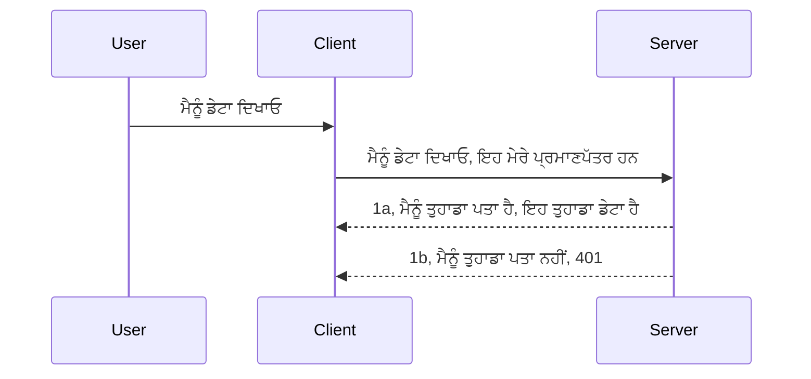

# ਸਾਦਾ ਪ੍ਰਮਾਣਿਕਤਾ

MCP SDKs OAuth 2.1 ਦੀ ਵਰਤੋਂ ਦਾ ਸਮਰਥਨ ਕਰਦੇ ਹਨ ਜੋ ਕਿ ਇਕ ਕਾਫ਼ੀ ਜਟਿਲ ਪ੍ਰਕਿਰਿਆ ਹੈ ਜਿਸ ਵਿੱਚ auth ਸਰਵਰ, resource ਸਰਵਰ, ਪ੍ਰਮਾਣਪੱਤਰ ਪੋਸਟ ਕਰਨਾ, ਕੋਡ ਪ੍ਰਾਪਤ ਕਰਨਾ, ਕੋਡ ਨੂੰ bearer ਟੋਕਨ ਨਾਲ ਬਦਲਣਾ ਸ਼ਾਮਲ ਹੈ ਜਦ ਤੱਕ ਕਿ ਤੁਸੀਂ ਅਖੀਰਕਾਰ ਆਪਣਾ resource ਡਾਟਾ ਪ੍ਰਾਪਤ ਨਾ ਕਰ ਲਵੋ। ਜੇ ਤੁਸੀਂ OAuth ਲਈ ਗੈਰ-ਅਨੁਭਵੀ ਹੋ ਜੋ ਕਿ ਲਾਗੂ ਕਰਨ ਲਈ ਇੱਕ ਵਧੀਆ ਚੀਜ਼ ਹੈ, ਤਾਂ ਇਹ ਚੰਗੀ ਗੱਲ ਹੈ ਕਿ ਕੁਝ ਬੁਨਿਆਦੀ ਪ੍ਰਮਾਣਿਕਤਾ ਨਾਲ ਸ਼ੁਰੂਆਤ ਕਰੋ ਅਤੇ progressively ਬਿਹਤਰ ਸੁਰੱਖਿਆ ਵੱਲ ਵਧੋ। ਇਸ ਲਈ ਇਹ ਅਧਿਆਇ ਮੌਜੂਦ ਹੈ, ਤਾਂ ਜੋ ਤੁਹਾਨੂੰ ਵੱਧ ਅਗੇ ਪ੍ਰਮਾਣਿਕਤਾ ਵੱਲ ਬਣਾ ਸਕੀਏ।

## ਪ੍ਰਮਾਣਿਕਤਾ, ਅਸੀਂ ਕੀ ਮਤਲਬ ਲੈਂਦੇ ਹਾਂ?

ਪ੍ਰਮਾਣਿਕਤਾ ਦਾ ਮਤਲਬ ਹੈ ਅਥੋਰਟੀਕਰਨ ਅਤੇ ਪ੍ਰਮਾਣਿਕਤਾ। ਵਿਚਾਰ ਇਹ ਹੈ ਕਿ ਸਾਨੂੰ ਦੋ ਗੱਲਾਂ ਕਰਣੀਆਂ ਚਾਹੀਦੀਆਂ ਹਨ:

- **ਪ੍ਰਮਾਣਿਕਤਾ**, ਜੋ ਇਹ ਪ੍ਰਕਿਰਿਆ ਹੈ ਕਿ ਅਸੀਂ ਦੇਖਦੇ ਹਾਂ ਕਿ ਕਿਸੇ ਵਿਅਕਤੀ ਨੂੰ ਸਾਡੇ ਘਰ ਵਿੱਚ ਦਾਖਲ ਹੋਣ ਦੀ ਆਗਿਆ ਹੈ ਕਿ ਨਹੀਂ, ਉਹ ਹਕੀਕਤ ਵਿੱਚ "ਇੱਥੇ" ਹੋਣ ਦਾ ਹੱਕ ਰੱਖਦਾ ਹੈ ਜਾਂ ਨਹੀਂ, ਜਾਂ ਸਾਡੇ resource ਸਰਵਰ ਤੱਕ ਪਹੁੰਚ ਹੈ ਜਿੱਥੇ ਸਾਡੇ MCP ਸਰਵਰ ਦੀਆਂ ਵਿਸ਼ੇਸ਼ਤਾਵਾਂ ਹਨ।
- **ਅਥੋਰਟੀਕਰਨ**, ਇਹ ਪ੍ਰਕਿਰਿਆ ਹੈ ਇਹ ਨਿਰਧਾਰਿਤ ਕਰਨ ਦੀ ਕਿ ਕੀ ਕਾਰਤੂਸ ਨੂੰ ਇਹ ਵਿਸ਼ੇਸ਼ ресурਸਾਂ ਤੱਕ ਪਹੁੰਚ ਹੋਣੀ ਚਾਹੀਦੀ ਹੈ ਜੋ ਉਹ ਮੰਗ ਰਹੇ ਹਨ, ਉਦਾਹਰਨ ਲਈ ਇਹ ਆਰਡਰ ਜਾਂ ਇਹ ਉਤਪਾਦ ਜਾਂ ਉਹ ਸਿਰਫ ਪੜ੍ਹ ਸਕਦੇ ਹਨ ਪਰ ਮਿਟਾ ਨਹੀਂ ਸਕਦੇ ਜਿਵੇਂ ਕਿ ਦੂਜਾ ਉਦਾਹਰਨ।

## ਪ੍ਰਮਾਣਪੱਤਰ: ਅਸੀਂ ਸਿਸਟਮ ਨੂੰ ਕਿਵੇਂ ਦੱਸਦੇ ਹਾਂ ਕਿ ਅਸੀਂ ਕੌਣ ਹਾਂ

ਵੈੱਬ ਵਿਕਾਸਕਾਰ ਆਮ ਤੌਰ 'ਤੇ ਸਰਵਰ ਨੂੰ ਇਕ ਪ੍ਰਮਾਣਪੱਤਰ ਦੇਣ ਦੀ ਸੋਚਦੇ ਹਨ, ਆਮ ਤੌਰ 'ਤੇ ਇਕ ਗੁਪਤ ਜਿਹੀ ਚੀਜ਼ ਜੋ ਦੱਸਦੀ ਹੈ ਕਿ ਉਹ ਇੱਥੇ ਆਉਣ ਲਈ "ਪ੍ਰਮਾਣਿਤ" ਹਨ। ਇਹ ਪ੍ਰਮਾਣਪੱਤਰ ਆਮ ਤੌਰ 'ਤੇ ਯੂਜ਼ਰ ਨੇਮ ਅਤੇ ਪਾਸਵર્ડ ਦਾ base64 ਧੁਨ ਕੀਤੇ ਹੋਏ ਰੂਪ ਜਾਂ ਇੱਕ API ਕੁੰਜੀ ਹੁੰਦੀ ਹੈ ਜੋ ਇੱਕ ਵਿਸ਼ੇਸ਼ ਉਪਭੋਗਤਾ ਦੀ ਪਛਾਣ ਕਰਦੀ ਹੈ।

ਇਸ ਨੂੰ "Authorization" ਹੇਡਰ ਰਾਹੀਂ ਇਸ ਤਰ੍ਹਾਂ ਭੇਜਿਆ ਜਾਂਦਾ ਹੈ:

```json
{ "Authorization": "secret123" }
```

ਇਹਨੂੰ ਆਮ ਤੌਰ 'ਤੇ ਮੁੱਲ ਭੂਤ ਪ੍ਰਮਾਣਿਕਤਾ ਕਿਹਾ ਜਾਂਦਾ ਹੈ। ਇਸ ਤਰ੍ਹਾਂ ਦਾ ਢਾਂਚਾ ਇਹ ਹੈ:



ਹੁਣ ਨੂੰ ਇਹ ਸਮਝਣ ਤੋਂ ਬਾਅਦ ਕਿ ਇਹ ਕਿਵੇਂ ਕੰਮ ਕਰਦਾ ਹੈ, ਅਸੀਂ ਇਸ ਨੂੰ ਕਿਵੇਂ ਲਾਗੂ ਕਰਾਂਗੇ? ਆਮ ਤੌਰ 'ਤੇ ਵੈੱਬ ਸਰਵਰਾਂ ਕੋਲ middleware ਦਾ ਸੰਕਲਪ ਹੁੰਦਾ ਹੈ, ਜੋ ਕਿ ਅਰਜ਼ੀ ਦੇ ਹਿੱਸੇ ਵਜੋਂ ਚੱਲਦਾ ਹੈ ਜੋ ਪ੍ਰਮਾਣਪੱਤਰਾਂ ਦੀ ਜਾਂਚ ਕਰ ਸਕਦਾ ਹੈ, ਅਤੇ ਜੇ ਪ੍ਰਮਾਣਪੱਤਰ ਵੈਧ ਹੋਣ, ਤਾਂ ਅਰਜ਼ੀ ਨੂੰ ਅਗੇ ਆਗਿਆ ਦਿੰਦਾ ਹੈ। ਜੇ ਅਰਜ਼ੀ ਕੋਲ ਵੈਧ ਪ੍ਰਮਾਣਪੱਤਰ ਨਹੀਂ ਹੁੰਦੇ ਤਾਂ ਤੱਨ ਤੁਹਾਨੂੰ ਪ੍ਰਮਾਣਿਕਤਾ ਲੋੜੇ ਦੀ ਗਲਤੀ ਮਿਲਦੀ ਹੈ। ਚਲੋ ਦੇਖੀਏ ਕਿਵੇਂ ਇਸਨੂੰ ਲਾਗੂ ਕੀਤਾ ਜਾ ਸਕਦਾ ਹੈ:

**Python**

```python
class AuthMiddleware(BaseHTTPMiddleware):
    async def dispatch(self, request, call_next):

        has_header = request.headers.get("Authorization")
        if not has_header:
            print("-> Missing Authorization header!")
            return Response(status_code=401, content="Unauthorized")

        if not valid_token(has_header):
            print("-> Invalid token!")
            return Response(status_code=403, content="Forbidden")

        print("Valid token, proceeding...")
       
        response = await call_next(request)
        # ਕਿਸੇ ਵੀ ਗ੍ਰਾਹਕ ਹੈਡਰਜ਼ ਨੂੰ ਸ਼ਾਮਲ ਕਰੋ ਜਾਂ ਜਵਾਬ ਵਿੱਚ ਕਿਸੇ ਤਰੀਕੇ ਨਾਲ ਬਦਲਾਅ ਕਰੋ
        return response


starlette_app.add_middleware(CustomHeaderMiddleware)
```

ਇੱਥੇ ਸਾਡੇ ਕੋਲ:

- `AuthMiddleware` ਨਾਮਕ ਇੱਕ middleware ਬਣਾਇਆ ਗਿਆ ਹੈ ਜਿੱਥੇ ਉਸਦੀ `dispatch` ਵਿਧੀ ਵੈੱਬ ਸਰਵਰ ਵੱਲੋਂ ਕਾਲ ਕੀਤੀ ਜਾਂਦੀ ਹੈ।
- middleware ਨੂੰ ਵੈੱਬ ਸਰਵਰ ਵਿੱਚ ਸ਼ਾਮਿਲ ਕੀਤਾ ਗਿਆ ਹੈ:

    ```python
    starlette_app.add_middleware(AuthMiddleware)
    ```

- ਪ੍ਰਮਾਣਿਕਤਾ ਹੈਡਰ ਦੀ ਮੌਜੂਦਗੀ ਵੇਖਣ ਅਤੇ ਭੇਜੇ ਗਏ ਗੁਪਤ ਸੱਚRide ਤਸਦੀਕ ਕਰਨ ਦੀ ਲਾਜਿਕ ਲਿਖੀ ਗਈ ਹੈ:

    ```python
    has_header = request.headers.get("Authorization")
    if not has_header:
        print("-> Missing Authorization header!")
        return Response(status_code=401, content="Unauthorized")

    if not valid_token(has_header):
        print("-> Invalid token!")
        return Response(status_code=403, content="Forbidden")
    ```

ਜੇ ਗੁਪਤ ਸੱਚRide ਮੌਜੂਦ ਅਤੇ ਵੈਧ ਹੈ ਤਾਂ ਅਸੀਂ ਅਰਜ਼ੀ ਨੂੰ `call_next` ਨੂੰ ਕਾਲ ਕਰਕੇ ਅੱਗੇ ਜਾਣ ਦਿੰਦੇ ਹਾਂ ਅਤੇ ਜਵਾਬ ਵਾਪਸ ਕਰਦੇ ਹਾਂ।

    ```python
    response = await call_next(request)
    # ਕਿਸੇ ਵੀ ਗਾਹਕ ਦੇ ਹੈਡਰ ਸ਼ਾਮਲ ਕਰੋ ਜਾਂ ਜਵਾਬ ਵਿੱਚ ਕਿਸੇ ਤਰੀਕੇ ਨਾਲ ਤਬਦੀਲੀ ਕਰੋ
    return response
    ```

ਕੰਮ ਇਹ ਹੈ ਕਿ ਜੇ ਵੈੱਬ ਅਰਜ਼ੀ ਸਰਵਰ ਵੱਲੋਂ ਆਉਂਦੀ ਹੈ ਤਾਂ middleware ਨੂੰ ਕਾਲ ਕੀਤਾ ਜਾਵੇਗਾ ਅਤੇ ਇਸਦੀ ਲਾਗੂ ਕਰਨ ਅਨੁਸਾਰ ਇਹ ਜਾਂ ਤਾਂ ਅਰਜ਼ੀ ਨੂੰ ਅੱਗੇ ਜਾਣ ਦੇਵੇਗਾ ਜਾਂ ਇੱਕ ਗਲਤੀ ਵਾਪਸ ਕੈਦੈਗਾ ਜਿਹੜੀ ਵਾਪਸ ਦੱਸਦੀ ਹੈ ਕਿ ਕਲਾਇੰਟ ਦੀ ਆਗਿਆ ਨਹੀਂ ਹੈ।

**TypeScript**

ਇੱਥੇ ਅਸੀਂ Express ਨਾਮਕ ਪ੍ਰਸਿੱਧ ਫਰੇਮਵਰਕ ਨਾਲ middleware ਬਣਾਉਂਦੇ ਹਾਂ ਅਤੇ MCP ਸਰਵਰ ਤੱਕ ਅਰਜ਼ੀ ਪਹੁੰਚਣ ਤੋਂ ਪਹਿਲਾਂ ਇਸਨੂੰ ਇੰਟਰਸੈਪਟ ਕਰਦੇ ਹਾਂ। ਕਈਰਿਹਾ ਕੋਡ ਇਹ ਹੈ:

```typescript
function isValid(secret) {
    return secret === "secret123";
}

app.use((req, res, next) => {
    // 1. ਅਥਾਰਟੀਜੇਸ਼ਨ ਹੈਡਰ ਮੌਜੂਦ ਹੈ?
    if(!req.headers["Authorization"]) {
        res.status(401).send('Unauthorized');
    }
    
    let token = req.headers["Authorization"];

    // 2. ਵੈਧਤਾ ਨੂੰ ਚੈੱਕ ਕਰੋ।
    if(!isValid(token)) {
        res.status(403).send('Forbidden');
    }

   
    console.log('Middleware executed');
    // 3. ਬੇਨਤੀ ਪਾਈਪਲਾਈਨ ਵਿੱਚ ਅਗਲੇ ਕਦਮ ਵੱਲ ਬੇਨਤੀ ਭੇਜੋ।
    next();
});
```

ਇਸ ਕੋਡ ਵਿੱਚ ਅਸੀਂ:

1. ਚੈੱਕ ਕਰਦੇ ਹਾਂ ਕਿ Authorization ਹੈਡਰ ਮੌਜੂਦ ਹੈ ਜਾਂ ਨਹੀਂ, ਜੇ ਨਹੀਂ, ਤਾਂ 401 ਗਲਤੀ ਭੇਜਦੇ ਹਾਂ।
2. ਕੀ ਪ੍ਰਮਾਣਪੱਤਰ ਜਾਂ ਟੋਕਨ ਵੈਧ ਹੈ, ਜੇ ਨਹੀਂ ਤਾਂ 403 ਗਲਤੀ ਭੇਜਦੇ ਹਾਂ।
3. ਅਖੀਰਕਾਰ ਅਰਜ਼ੀ ਨੂੰ ਅਰਜ਼ੀ ਪਾਈਪਲਾਈਨ ਵਿੱਚ ਅੱਗੇ ਭੇਜਦੇ ਹਾਂ ਅਤੇ ਮੰਗੇ ਗਏ ਰਿਸੋਰਸ ਨੂੰ ਵਾਪਸ ਕਰਦੇ ਹਾਂ।

## ਅਭਿਆਸ: ਪ੍ਰਮਾਣਿਕਤਾ ਨੂੰ ਲਾਗੂ ਕਰੋ

ਆਓ ਆਪਣੀ ਜਾਣਕਾਰੀ ਲੈ ਕੇ ਇਸਨੂੰ ਲਾਗੂ ਕਰਨ ਦੀ ਕੋਸ਼ਿਸ਼ ਕੀਤੀਏ। ਯੋਜਨਾ ਇਹ ਹੈ:

ਸਰਵਰ

- ਇੱਕ ਵੈੱਬ ਸਰਵਰ ਅਤੇ MCP ਉਦਾਹਰਨ ਬਣਾਓ।
- ਸਰਵਰ ਲਈ middleware ਲਾਗੂ ਕਰੋ।

ਕਲਾਇੰਟ

- ਹੇਡਰ ਰਾਹੀਂ ਪ੍ਰਮਾਣਪੱਤਰ ਦੇ ਨਾਲ ਵੈੱਬ ਅਰਜ਼ੀ ਭੇਜੋ।

### -1- ਇੱਕ ਵੈੱਬ ਸਰਵਰ ਅਤੇ MCP ਉਦਾਹਰਨ ਬਣਾਓ

> **ਅਗੇ ਵੇਖਣਾ:** ਹੇਠਾਂ ਦਿੱਤਾ ਹੋਇਆ TypeScript ਉਦਾਹਰਨ HTTP ਟਰਾਂਸਪੋਰਟ ਨੂੰ `mcp-session-id` ਦੁਆਰਾ ਕੀ ਕੀਤੀ ਇੱਕ `transports` ਨਕਸ਼ੇ ਵਿੱਚ ਟਰੈੱਕ ਕਰਦਾ ਹੈ, ਜੋ **MCP Specification 2025-11-25** ਦੇ ਮੁਤਾਬਕ ਹੈ। `2026-07-28` ਰਿਲੀਜ਼ ਉਮੀਦਵਾਰ ਵਿੱਚ `initialize` ਹੈਂਡਸ਼ੇਕ ਅਤੇ ਸੈਸ਼ਨ ID ਪੂਰੀ ਤਰ੍ਹਾਂ ਹਟਾ ਦਿੱਤੀ ਗਈ ਹੈ, ਇਸ ਲਈ ਇਸ ਪ੍ਰਤੀ ਸੈਸ਼ਨ ਟਰਾਂਸਪੋਰਟ ਨਕਸ਼ੇ ਦੀ ਜਗ੍ਹਾ ਸਟੈਟਲੈਸ, ਸਵੈ-ਸੰਚਿਤ ਅਰਜ਼ੀਆਂ ਲਈ ਜਾਵੇਗੀ। ਵੇਖੋ [MCP ਵਿੱਚ ਕੀ ਬਦਲ ਰਿਹਾ ਹੈ: 2026-07-28 ਰਿਲੀਜ਼ ਉਮੀਦਵਾਰ](../../01-CoreConcepts/mcp-2026-07-28-release-candidate.md)।

ਸਾਡਾ ਪਹਿਲਾ ਕਦਮ ਹੈ ਵੈੱਬ ਸਰਵਰ ਉਦਾਹਰਨ ਅਤੇ MCP ਸਰਵਰ ਬਣਾਉਣਾ।

**Python**

ਇੱਥੇ ਅਸੀਂ MCP ਸਰਵਰ ਉਦਾਹਰਨ ਬਣਾਉਂਦੇ ਹਾਂ, ਇੱਕ starlette ਵੈੱਬ ਐਪ ਬਣਾਉਂਦੇ ਹਾਂ ਅਤੇ uvicorn ਨਾਲ ਹੋਸਟ ਕਰਦੇ ਹਾਂ।

```python
# MCP ਸਰਵਰ ਬਣਾਉਣਾ

app = FastMCP(
    name="MCP Resource Server",
    instructions="Resource Server that validates tokens via Authorization Server introspection",
    host=settings["host"],
    port=settings["port"],
    debug=True
)

# ਸਟਾਰਲੈੱਟ ਵੈੱਬ ਐਪ ਬਣਾਉਣਾ
starlette_app = app.streamable_http_app()

# ਐਪ ਨੂੰ uvicorn ਰਾਹੀਂ ਸਰਵ ਕਰਨਾ
async def run(starlette_app):
    import uvicorn
    config = uvicorn.Config(
            starlette_app,
            host=app.settings.host,
            port=app.settings.port,
            log_level=app.settings.log_level.lower(),
        )
    server = uvicorn.Server(config)
    await server.serve()

run(starlette_app)
```

ਇਸ ਕੋਡ ਵਿੱਚ ਅਸੀਂ:

- MCP ਸਰਵਰ ਬਣਾਇਆ।
- MCP ਸਰਵਰ ਤੋਂ starlette ਵੈੱਬ ਐਪ `app.streamable_http_app()` ਤਿਆਰ ਕੀਤਾ।
- uvicorn ਦੇ ਨਾਲ ਵੈੱਬ ਐਪ ਦੀ ਹੋਸਟਿੰਗ ਅਤੇ ਸੇਵਾ ਕੀਤੀ `server.serve()`।

**TypeScript**

ਇੱਥੇ ਅਸੀਂ MCP ਸਰਵਰ ਉਦਾਹਰਨ ਬਣਾਉਂਦੇ ਹਾਂ।

```typescript
const server = new McpServer({
      name: "example-server",
      version: "1.0.0"
    });

    // ... ਸਰਵਰ ਸੰਸਾਧਨ, ਟੂਲਸ ਅਤੇ ਪ੍ਰਾਂਪਟ ਸੈੱਟਅੱਪ ਕਰੋ ...
```

ਇਹ MCP ਸਰਵਰ ਬਣਾਉਣਾ POST /mcp ਰੂਟ ਕੰਟਰੋਲਰ ਦੇ ਅੰਦਰ ਕਰਨ ਦੀ ਲੋੜ ਹੈ, ਸੋ ਉਪਰੋਕਤ ਕੋਡ ਨੂੰ ਇਸ ਤਰ੍ਹਾਂ ਲਿਜਾਈਏ:

```typescript
import express from "express";
import { randomUUID } from "node:crypto";
import { McpServer } from "@modelcontextprotocol/sdk/server/mcp.js";
import { StreamableHTTPServerTransport } from "@modelcontextprotocol/sdk/server/streamableHttp.js";
import { isInitializeRequest } from "@modelcontextprotocol/sdk/types.js"

const app = express();
app.use(express.json());

// ਸੈਸ਼ਨ ID ਦੁਆਰਾ ਟ੍ਰਾਂਸਪੋਰਟ ਸਟੋਰ ਕਰਨ ਲਈ ਮੈਪ
const transports: { [sessionId: string]: StreamableHTTPServerTransport } = {};

// ਕਲਾਇੰਟ-ਤੋਂ-ਸਰਵਰ ਸੰਚਾਰ ਲਈ POST ਬੇਨਤੀਆਂ ਨੂੰ ਸੰਭਾਲਣਾ
app.post('/mcp', async (req, res) => {
  // ਮੌਜੂਦਾ ਸੈਸ਼ਨ ID ਦੀ ਜਾਂਚ ਕਰੋ
  const sessionId = req.headers['mcp-session-id'] as string | undefined;
  let transport: StreamableHTTPServerTransport;

  if (sessionId && transports[sessionId]) {
    // ਮੌਜੂਦਾ ਟ੍ਰਾਂਸਪੋਰਟ ਨੂੰ ਫਿਰ ਤੋਂ ਵਰਤੋ
    transport = transports[sessionId];
  } else if (!sessionId && isInitializeRequest(req.body)) {
    // ਨਵੀਂ ਸ਼ੁਰੂਆਤੀ ਬੇਨਤੀ
    transport = new StreamableHTTPServerTransport({
      sessionIdGenerator: () => randomUUID(),
      onsessioninitialized: (sessionId) => {
        // ਸੈਸ਼ਨ ID ਦੁਆਰਾ ਟ੍ਰਾਂਸਪੋਰਟ ਸਟੋਰ ਕਰੋ
        transports[sessionId] = transport;
      },
      // DNS ਰੀਬਾਈਂਡਿੰਗ ਸੁਰੱਖਿਆ ਪਹਿਲਾਂ ਤੋਂ ਹੀ ਬੈਕਵਰਡ ਕਾਂਪੈਟਬਿਲਟੀ ਲਈ ਡਿਫਾਲਟ ਰੂਪ ਵਿੱਚ ਅਣਚਾਲੂ ਹੈ। ਜੇ ਤੁਸੀਂ ਇਹ ਸਰਵਰ
      // ਲੋਕਲਹੋਰ 'ਤੇ ਚਲਾ ਰਹੇ ਹੋ, ਤਾਂ ਇਹ ਸੈੱਟ ਕਰਨ ਦੀ ਯਕੀਨ ਕਰ ਲਓ:
      // enableDnsRebindingProtection: true,
      // allowedHosts: ['127.0.0.1'],
    });

    // ਬੰਦ ਹੋਣ 'ਤੇ ਟ੍ਰਾਂਸਪੋਰਟ ਨੂੰ ਸਾਫ਼ ਕਰੋ
    transport.onclose = () => {
      if (transport.sessionId) {
        delete transports[transport.sessionId];
      }
    };
    const server = new McpServer({
      name: "example-server",
      version: "1.0.0"
    });

    // ... ਸਰਵਰ ਸਰੋਤ, ਟੂਲ ਅਤੇ ਪ੍ਰਾਂਪਟ ਸੈਟ ਕਰਨਾ ...

    // MCP ਸਰਵਰ ਨਾਲ ਜੁੜੋ
    await server.connect(transport);
  } else {
    // ਗਲਤ ਬੇਨਤੀ
    res.status(400).json({
      jsonrpc: '2.0',
      error: {
        code: -32000,
        message: 'Bad Request: No valid session ID provided',
      },
      id: null,
    });
    return;
  }

  // ਬੇਨਤੀ ਨੂੰ ਸੰਭਾਲੋ
  await transport.handleRequest(req, res, req.body);
});

// GET ਅਤੇ DELETE ਬੇਨਤੀਆਂ ਲਈ ਦੁਹਰਾਓ ਹੋਣ ਵਾਲਾ ਹੈਂਡਲਰ
const handleSessionRequest = async (req: express.Request, res: express.Response) => {
  const sessionId = req.headers['mcp-session-id'] as string | undefined;
  if (!sessionId || !transports[sessionId]) {
    res.status(400).send('Invalid or missing session ID');
    return;
  }
  
  const transport = transports[sessionId];
  await transport.handleRequest(req, res);
};

// ਸਰਵਰ-ਤੋਂ-ਕਲਾਇੰਟ ਸੂਚਨਾਵਾਂ ਲਈ GET ਬੇਨਤੀਆਂ ਨੂੰ SSE ਦੁਆਰਾ ਸੰਭਾਲੋ
app.get('/mcp', handleSessionRequest);

// ਸੈਸ਼ਨ ਖ਼ਤਮ ਕਰਨ ਲਈ DELETE ਬੇਨਤੀਆਂ ਨੂੰ ਸੰਭਾਲੋ
app.delete('/mcp', handleSessionRequest);

app.listen(3000);
```

ਹੁਣ ਤੁਸੀਂ ਵੇਖਦੇ ਹੋ ਕਿ MCP ਸਰਵਰ ਬਣਾਉਣਾ `app.post("/mcp")` ਦੇ ਅੰਦਰ ਲਿਜਾਇਆ ਗਿਆ।

ਅੱਗੇ middleware ਬਣਾਉਣ ਲਈ ਚੱਲਦੇ ਹਾਂ ਤਾਂ ਜੋ ਅਸੀਂ ਇਲਾਕਾਕਾਰਤਾ ਵਿੱਚ ਆ ਰਹੇ ਪ੍ਰਮਾਣਪੱਤਰ ਦੀ ਜਾਂਚ ਕਰ ਸਕੀਏ।

### -2- ਸਰਵਰ ਲਈ middleware ਲਾਗੂ ਕਰੋ

ਹੁਣ middleware ਹਿੱਸੇ ਨੂੰ ਲਾਗੂ ਕਰੀਏ। ਇੱਥੇ ਅਸੀਂ ਐਸੀ middleware ਬਣਾਉਂਦੇ ਹਾਂ ਜੋ `Authorization` ਹੈਡਰ ਵਿੱਚ ਪ੍ਰਮਾਣਪੱਤਰ ਦੀ ਤਲਾਸ਼ ਕਰਦਾ ਹੈ ਅਤੇ ਇਸਦੀ ਜਾਂਚ ਕਰਦਾ ਹੈ। ਜੇ ਇਹ ਠੀਕ ਹੈ, ਤਾਂ ਅਰਜ਼ੀ ਨੂੰ ਅੱਗੇ ਵਧਣ ਦਿੱਤਾ ਜਾਵੇਗਾ (ਜਿਵੇਂ ਕਿ ਸੰਦਾਂ ਦੀ ਸੂਚੀ ਦੇਣਾ, resource ਪੜ੍ਹਨਾ ਜਾਂ ਜੋ ਮੰਗ ਕੀਤੀ ਗਿਆ MCP ਫੰਕਸ਼ਨਲਟੀ ਹੈ)।

**Python**

middleware ਬਣਾਉਣ ਲਈ, ਅਸੀਂ ਇਕ ਕਲਾਸ ਬਣਾਉਣੀ ਹੈ ਜੋ `BaseHTTPMiddleware` ਵਲੋਂ ਵਿਰਾਸਤ ਲੈਂਦੀ ਹੈ। ਦੋ ਮੁੱਖ ਪਹਲੂ ਹਨ:

- ਅਰਜ਼ੀ `request` ਜਿਸ ਤੋਂ ਅਸੀਂ ਹੈਡਰ ਜਾਣਕਾਰੀ ਪੜ੍ਹਦੇ ਹਾਂ।
- `call_next` ਕਾਲਬੈਕ ਜਿਸਨੂੰ ਅਸੀਂ ਕਾਲ ਕਰਦੇ ਹਾਂ ਜੇ ਕਲਾਇੰਟ ਨੇ ਅਜਿਹਾ ਪ੍ਰਮਾਣਪੱਤਰ ਲਿਆ ਹੈ ਜੋ ਅਸੀਂ ਸਵੀਕਾਰ ਕਰਦੇ ਹਾਂ।

ਪਹਿਲਾਂ, ਸਾਡੀ ਜ਼ਰੂਰਤ ਹੈ ਕਿ ਜੇ `Authorization` ਹੈਡਰ ਗਾਇਬ ਹੈ ਤਾਂ ਹੱਲ ਕਰਨ ਦੀ:

```python
has_header = request.headers.get("Authorization")

# ਕੋਈ ਹੈਡਰ ਮੌਜੂਦ ਨਹੀਂ, 401 ਨਾਲ ਅਸਫਲ ਹੋ ਜਾਓ, ਨਹੀਂ ਤਾਂ ਅੱਗੇ ਵਧੋ।
if not has_header:
    print("-> Missing Authorization header!")
    return Response(status_code=401, content="Unauthorized")
```

ਇੱਥੇ ਅਸੀਂ 401 unauthorized ਸਣੇ ਸੁਨੇਹਾ ਭੇਜਦੇ ਹਾਂ ਕਿਉਂਕਿ ਕਲਾਇੰਟ ਪ੍ਰਮਾਣਿਕਤਾ ਵਿੱਚ ਅਸਫਲ ਹੈ।

ਅਗਲਾ, ਜੇ ਕੋਇ ਪ੍ਰਮਾਣਪੱਤਰ ਭੇਜਿਆ ਗਿਆ ਹੋਏ ਤਾਂ ਇਸਦੀ ਵੈਧਤਾ ਇਸ ਤਰ੍ਹਾਂ ਚੈੱਕ ਕਰੀਏ:

```python
 if not valid_token(has_header):
    print("-> Invalid token!")
    return Response(status_code=403, content="Forbidden")
```

ਧਿਆਨ ਦਿਓ ਕਿ ਉਪਰ 403 forbidden ਸੁਨੇਹਾ ਭੇਜਿਆ ਜਾ ਰਿਹਾ ਹੈ। ਥੱਲੇ ਪੂਰਾ middleware ਹੈ ਜੋ ਸਾਡੀ ਚਰਚਾ ਅਨੁਸਾਰ ਸਭ ਕੁਝ ਲਾਗੂ ਕਰਦਾ ਹੈ:

```python
class AuthMiddleware(BaseHTTPMiddleware):
    async def dispatch(self, request, call_next):

        has_header = request.headers.get("Authorization")
        if not has_header:
            print("-> Missing Authorization header!")
            return Response(status_code=401, content="Unauthorized")

        if not valid_token(has_header):
            print("-> Invalid token!")
            return Response(status_code=403, content="Forbidden")

        print("Valid token, proceeding...")
        print(f"-> Received {request.method} {request.url}")
        response = await call_next(request)
        response.headers['Custom'] = 'Example'
        return response

```

ਵਧੀਆ, ਪਰ `valid_token` ਫੰਕਸ਼ਨ ਕਿੱਥੇ ਹੈ? ਇੱਥੇ ਹੈ:

```python
# ਪ੍ਰੋਡਕਸ਼ਨ ਲਈ ਇਸਦਾ ਇਸਤੇਮਾਲ ਨਾ ਕਰੋ - ਇਸਨੂੰ ਸੁਧਾਰੋ !!
def valid_token(token: str) -> bool:
    # "Bearer " ਪ੍ਰੀਫਿਕਸ ਨੂੰ ਹਟਾਓ
    if token.startswith("Bearer "):
        token = token[7:]
        return token == "secret-token"
    return False
```

ਇਹ ਸੁਧਾਰਯੋਗ ਹੈ।

IMPORTANT: ਤੁਸੀਂ ਕਦੇ ਵੀ ਇਸ ਤਰ੍ਹਾਂ ਦੇ ਗੁਪਤ ਕੀ ਹਮੇਸ਼ਾ ਕੋਡ ਵਿੱਚ ਨਹੀਂ ਰੱਖਣੇ ਚਾਹੀਦੇ। ਸਭ ਤੋਂ ਵਧੀਆ ਇਹ ਹੈ ਕਿ ਤੁਸੀਂ ਮੁਲਾਂਕਣ ਲਈ ਇਸ ਦੀ ਕੀਮਤ ਕਿਸੇ ਡਾਟਾ ਸਰੋਤ ਜਾਂ IDP (ਪਛਾਣ ਸੇਵਾ ਪ੍ਰਦਾਤਾ) ਤੋਂ ਪ੍ਰਾਪਤ ਕਰੋ ਜਾਂ ਹੋਰ ਵਧੀਆ, IDP ਨੂੰ ਹੀ ਵੈਧਤਾ ਕਰਾਉਣ ਦਿਓ।

**TypeScript**

Express ਨਾਲ ਇਸਨੂੰ ਲਾਗੂ ਕਰਨ ਲਈ, ਸਾਨੂੰ `use` ਮੈਥਡ ਕਾਲ ਕਰਨੀ ਪੈਂਦੀ ਹੈ ਜੋ middleware ਫੰਕਸ਼ਨਾਂ ਨੂੰ ਲੈਂਦੀ ਹੈ।

ਅਸੀਂ ਨੂੰ:

- ਅਰਜ਼ੀ ਵੈਰੀਏਬਲ ਨਾਲ ਇੰਟਰਐਕਟ ਕਰਨਾ ਤਾਂ ਜੋ `Authorization` ਗੁਣ ਵਿੱਚ ਭੇਜੇ ਗਏ ਪ੍ਰਮਾਣਪੱਤਰ ਨੂੰ ਚੈੱਕ ਕਰ ਸਕੀਏ।
- ਪ੍ਰਮਾਣਪੱਤਰ ਦੀ ਜਾਂਚ ਕਰਨਾ ਅਤੇ ਜੇ ਠੀਕ ਦਿੱਤਾ, ਤਦ ਅਰਜ਼ੀ ਨੂੰ ਜਾਰੀ ਰੱਖਣ ਦੇਣਾ ਅਤੇ ਕਲਾਇੰਟ ਦੀ MCP ਅਰਜ਼ੀ ਨੂੰ ਜੋ ਮੰਗੀ ਗਈ ਉਹ ਕਰਵਾਉਣਾ (ਜਿਵੇਂ ਸੰਦਾਂ ਦੀ ਸੂਚੀ, ਰਿਸੋਰਸ ਪੜ੍ਹਨਾ ਜਾਂ ਹੋਰ MCP ਸੰਬੰਧੀ)।

ਇੱਥੇ ਅਸੀਂ ਦੇਖ ਰਹੇ ਹਾਂ ਕਿ ਜੇ `Authorization` ਹੈਡਰ ਮੌਜੂਦ ਨਹੀਂ, ਤਾਂ ਅਸੀਂ ਅਰਜ਼ੀ ਨੂੰ ਰੋਕਦੇ ਹਾਂ:

```typescript
if(!req.headers["authorization"]) {
    res.status(401).send('Unauthorized');
    return;
}
```

ਜੇ ਹੈਡਰ ਪਹਿਲਾਂ ਹੀ ਭੇਜਿਆ ਨਹੀਂ ਗਿਆ, ਤਾਂ ਤੁਹਾਨੂੰ 401 ਮਿਲਦਾ ਹੈ।

ਫਿਰ, ਅਸੀਂ ਚੈੱਕ ਕਰਦੇ ਹਾਂ ਕਿ ਪ੍ਰਮਾਣਪੱਤਰ ਵੈਧ ਹੈ ਜਾਂ ਨਹੀਂ, ਜੇ ਨਹੀਂ, ਤਾਂ ਫਿਰ ਅਸੀਂ ਅਰਜ਼ੀ ਨੂੰ ਰੋਕਦੇ ਹਾਂ ਪਰ ਵੱਖਰਾ ਸੁਨੇਹਾ ਭੇਜ ਕੇ:

```typescript
if(!isValid(token)) {
    res.status(403).send('Forbidden');
    return;
} 
```

ਵੇਖੋ ਕਿ ਤੁਸੀਂ ਹੁਣ 403 ਗਲਤੀ ਮਿਲ ਰਹੀ ਹੈ।

ਪੂਰਾ ਕੋਡ ਕੁਝ ਇਸ ਤਰ੍ਹਾਂ ਹੈ:

```typescript
app.use((req, res, next) => {
    console.log('Request received:', req.method, req.url, req.headers);
    console.log('Headers:', req.headers["authorization"]);
    if(!req.headers["authorization"]) {
        res.status(401).send('Unauthorized');
        return;
    }
    
    let token = req.headers["authorization"];

    if(!isValid(token)) {
        res.status(403).send('Forbidden');
        return;
    }  

    console.log('Middleware executed');
    next();
});
```

ਅਸੀਂ ਵੈੱਬ ਸਰਵਰ ਨੂੰ middleware ਸੈੱਟ ਅਪ ਕੀਤਾ ਹੈ ਜੋ ਕਲਾਇੰਟ ਦੁਆਰਾ ਭੇਜੇ ਗਏ ਪ੍ਰਮਾਣਪੱਤਰ ਨੂੰ ਜਾਂਚਦਾ ਹੈ। ਕਲਾਇੰਟ ਬਾਰੇ ਕੀ?

### -3- ਹੇਡਰ ਰਾਹੀਂ ਪ੍ਰਮਾਣਪੱਤਰ ਨਾਲ ਵੈੱਬ ਅਰਜ਼ੀ ਭੇਜੋ

ਸਾਨੂੰ ਯਕੀਨੀ ਕਰਨਾ ਚਾਹੀਦਾ ਹੈ ਕਿ ਕਲਾਇੰਟ ਹੈਡਰ ਰਾਹੀਂ ਪ੍ਰਮਾਣਪੱਤਰ ਪਾਸ ਕਰ ਰਿਹਾ ਹੈ। ਜਿਵੇਂ ਅਸੀਂ MCP ਕਲਾਇੰਟ ਵਰਤ ਰਹੇ ਹਾਂ, ਸਾਨੂੰ ਇਹ ਜਾਣਨਾ ਚਾਹੀਦਾ ਹੈ ਕਿ ਇਹ ਕਿਵੇਂ ਕੀਤਾ ਜਾਂਦਾ ਹੈ।

**Python**

ਕਲਾਇੰਟ ਲਈ, ਸਾਨੂੰ ਆਪਣਾ ਪ੍ਰਮਾਣਪੱਤਰ ਹੇਡਰ ਦੇ ਨਾਲ ਪਾਸ ਕਰਨਾ ਪੈਂਦਾ ਹੈ ਇਸ ਤਰ੍ਹਾਂ:

```python
# ਮੁੱਲ ਨੂੰ ਹਾਰਡਕੋਡ ਨਾ ਕਰੋ, ਘੱਟੋ ਘੱਟ ਇਸ ਨੂੰ ਇੱਕ ਵਾਤਾਵਰਣ ਵੈਰੀਏਬਲ ਜਾਂ ਹੋਰ ਸੁਰੱਖਿਅਤ ਸਟੋਰੇਜ ਵਿੱਚ ਰੱਖੋ
token = "secret-token"

async with streamablehttp_client(
        url = f"http://localhost:{port}/mcp",
        headers = {"Authorization": f"Bearer {token}"}
    ) as (
        read_stream,
        write_stream,
        session_callback,
    ):
        async with ClientSession(
            read_stream,
            write_stream
        ) as session:
            await session.initialize()
      
            # TODO, ਜੋ ਤੁਸੀਂ ਕਲਾਇੰਟ ਵਿੱਚ ਕਰਵਾਉਣਾ ਚਾਹੁੰਦੇ ਹੋ, ਜਿਵੇਂ ਟੂਲਾਂ ਦੀ ਸੂਚੀ ਬਣਾਉਣਾ, ਟੂਲਾਂ ਨੂੰ ਕਾਲ ਕਰਨਾ ਆਦਿ.
```

ਵੇਖੋ ਕਿਵੇਂ ਅਸੀਂ `headers` ਗੁਣ ਘੇਰਦੇ ਹਾਂ ਜਿਵੇਂ ` headers = {"Authorization": f"Bearer {token}"}`।

**TypeScript**

ਅਸੀਂ ਦੋ ਕਦਮਾਂ ਵਿੱਚ ਇਸਨੂੰ ਹੱਲ ਕਰ ਸਕਦੇ ਹਾਂ:

1. ਇੱਕ configuration ਵਸਤੂ ਨੂੰ ਆਪਣਾ ਪ੍ਰਮਾਣਪੱਤਰ ਭਰੋ।
2. configuration ਵਸਤੂ ਨੂੰ transport ਨੂੰ ਪਾਸ ਕਰੋ।

```typescript

// ਇਥੇ ਵੇਖਾਏ ਗਏ ਤਰੀਕੇ ਨਾਲ ਮੁੱਲ ਨੂੰ ਕਠੋਰ ਕੋਡ ਨਾ ਕਰੋ। ਘੱਟੋ-ਘੱਟ ਇਸਨੂੰ ਇੱਕ ਵਾਤਾਵਰਣ ਚਲ변 (env variable) ਵਜੋਂ ਰੱਖੋ ਅਤੇ ਡੋਟਐਨਵੀ (ਡਿਵ ਮੋਡ ਵਿੱਚ) ਵਰਗੇ ਕੁਝ ਉਪਯੋਗ ਕਰੋ।
let token = "secret123"

// ਇੱਕ ਕਲਾਇੰਟ ਟਰਾਂਸਪੋਰਟ ਵਿਕਲਪ ਆਬਜੈਕਟ ਪਰਿਭਾਸ਼ਿਤ ਕਰੋ
let options: StreamableHTTPClientTransportOptions = {
  sessionId: sessionId,
  requestInit: {
    headers: {
      "Authorization": "secret123"
    }
  }
};

// ਵਿਕਲਪ ਆਬਜੈਕਟ ਨੂੰ ਟਰਾਂਸਪੋਰਟ ਨੂੰ ਪਾਸ ਕਰੋ
async function main() {
   const transport = new StreamableHTTPClientTransport(
      new URL(serverUrl),
      options
   );
```

ਇੱਥੇ ਤੁਸੀਂ ਵੇਖਦੇ ਹੋ ਕਿ ਅਸੀਂ ਇਕ `options` ਵਸਤੂ ਬਣਾਈ ਅਤੇ ਆਪਣੇ ਹੈਡਰ ਨੂੰ `requestInit` ਗੁਣ ਹੇਠ ਰੱਖਿਆ।

IMPORTANT: ਪਰ ਇਹਨੂੰ ਕਿਵੇਂ ਸੁਧਾਰ ਕਰੀਏ? ਇਹ ਆਮ ਤੌਰ 'ਤੇ ਖ਼ਤਰਨਾਕ ਹੈ ਜੇ HTTP ਦੀ ਥਾਂ HTTPS ਨਾ ਵਰਤੀ ਜਾਵੇ। ਫਿਰ ਵੀ, ਇਹ ਪ੍ਰਮਾਣਪੱਤਰ ਚੋਰੀ ਹੋ ਸਕਦਾ ਹੈ ਇਸ ਲਈ ਤੁਹਾਨੂੰ ਇੱਕ ਐਸਾ ਪ੍ਰਣਾਲੀ ਚਾਹੀਦੀ ਹੈ ਜੋ ਟੋਕਨ ਨੂੰ ਅਸਾਨੀ ਨਾਲ ਰੱਦ ਕਰ ਸਕੇ ਅਤੇ ਵਾਧੂ ਜਾਂਚਾਂ ਜਿਵੇਂ ਕਿ ਟੋਕਨ ਕਿੱਥੋਂ ਆ ਰਿਹਾ ਹੈ, ਬਹੁਤ ਜ਼ਿਆਦਾ ਅਰਜ਼ੀਆਂ ਹੋ ਰਹੀਆਂ ਹਨ ਜਾਂ ਨਹੀਂ (ਬੋਟ ਵਰਗਾ ਵਿਹਾਰ), ਆਦਿ ਕਰੇ। 

ਬੇਸ਼ਕ ਇਹ ਕਿਹਾ ਜਾ ਸਕਦਾ ਹੈ ਕਿ ਬਹੁਤ ਸਧਾਰਨ API ਲਈ ਜਿੱਥੇ ਤੁਸੀਂ ਨਹੀਂ ਚਾਹੁੰਦੇ ਕਿ ਕੋਈ ਵੀ ਤੁਹਾਡਾ API ਬਿਨਾਂ ਪ੍ਰਮਾਣਿਤ ਹੋਏ ਕਾਲ ਕਰੇ, ਇਹ ਇੱਕ ਚੰਗੀ ਸ਼ੁਰੂਆਤ ਹੈ।

ਇਸਦੇ ਨਾਲ, ਆਓ ਇੱਕ ਸੁਦୂ ਸੁਰੱਖਿਆ ਨਾਲ ਸੁਧਾਰ ਕਰੀਏ ਜਿਵੇਂ JSON ਵੈੱਬ ਟੋਕਨ ਜਾਂ ਜਾਣੇ ਜਾਂਦੇ ਹਨ JWT ਜਾਂ "JOT" ਟੋਕਨ।

## JSON ਵੈੱਬ ਟੋਕਨ, JWT

ਤਾਂ, ਅਸੀਂ ਸੁਧਾਰ ਕਰ ਰਹੇ ਹਾਂ ਸਧਾਰਨ ਪ੍ਰਮਾਣਪੱਤਰ ਭੇਜਣ ਤੋਂ। JWT ਲਾਗੂ ਕਰਨ ਨਾਲ ਕੀ ਤੁਰੰਤ ਸੁਧਾਰ ਹੁੰਦੇ ਹਨ?

- **ਸੁਰੱਖਿਆ ਸੁਧਾਰ।** ਬੁਨਿਆਦੀ ਪ੍ਰਮਾਣਿਕਤਾ ਵਿੱਚ ਤੁਸੀਂ ਯੂਜ਼ਰ ਨਾਂਹ ਅਤੇ ਪਾਸਵਰਡ ਨੂੰ base64 ਐਨਕੋਡ ਟੋਕਨ ਵਜੋਂ (ਜਾਂ API ਕੁੰਜੀ) ਵਾਰ-ਵਾਰ ਭੇਜਦੇ ਹੋ ਜਿਹੜਾ ਜੋਖਮ ਵਧਾਉਂਦਾ ਹੈ। JWT ਵਿੱਚ, ਤੁਸੀਂ ਯੂਜ਼ਰ ਨਾਂਹ ਅਤੇ ਪਾਸਵਰਡ ਭੇਜਦੇ ਹੋ ਅਤੇ ਟੋਕਨ ਪ੍ਰਾਪਤ ਕਰਦੇ ਹੋ ਜੋ ਸਮੇਂ-ਬੱਧ ਜਾਂ ਮਿਆਦ ਵਾਲਾ ਹੁੰਦਾ ਹੈ। JWT ਤੁਸੀਂ ਸੁਖਾਵਾਂ ਨਾਲ roles, scopes ਅਤੇ permissions ਦੇ ਨਾਲ ਸੁਖਾਵਾਂ ਪਹੁੰਚ ਨਿਯੰਤਰਣ ਕਰ ਸਕਦੇ ਹੋ।
- **ਸਟੈਟਲੈੱਸਨੈੱਸ ਅਤੇ ਸਕੇਲਬਲਿਟੀ।** JWT ਆਪ-ਵਸ਼ੀਸਤ ਹੁੰਦੇ ਹਨ, ਉਹ ਸਾਰੀਆਂ ਯੂਜ਼ਰ ਜਾਣਕਾਰੀਆਂ ਆਪਣੇ ਵਿੱਚ ਸਮੇਤ ਕੇ ਰੱਖਦੇ ਹਨ ਅਤੇ ਸਿਰਵਰ-ਪਾਸੇ ਸੈਸ਼ਨ ਸਟੋਰੇਜ ਬੰਦ ਕਰ ਦਿੰਦੇ ਹਨ। ਟੋਕਨ ਨੂੰ ਸਥਾਨਕ ਪੱਧਰ ਤੇ ਵੀ ਜਾਂਚਿਆ ਜਾ ਸਕਦਾ ਹੈ।
- **ਇੰਟਰਓਪਰੇਬਿਲਿਟੀ ਅਤੇ ਫੈਡਰੇਸ਼ਨ।** JWT ਖੁਦ Open ID Connect ਦਾ ਕੇਂਦਰ ਹਨ ਅਤੇ ਜਾਣੇ-ਮਾਣੇ ਪਛਾਣ ਪ੍ਰਦਾਤਿਆਂ ਨਾਲ ਵਰਤੇ ਜਾਂਦੇ ਹਨ ਜਿਵੇਂ Entra ID, Google Identity ਅਤੇ Auth0। ਇਹਨਾਂ ਨਾਲ single sign on ਸ਼ਾਮਲ ਅਤੇ ਵਧੇਰੇ ਕੀਤੇ ਜਾ ਸਕਦੇ ਹਨ ਜੋ ਕਿ ਜ਼ੋਰਾਂਤ ਪ੍ਰਮਾਣਿਕਤਾ ਦਾ ਦਰਜਾ ਦੇਂਦੇ ਹਨ।
- **ਮੌਡੁਲੈਰਿਟੀ ਅਤੇ ਲਚੀਲਾਪਨ।** JWT API Gateways ਜਿਵੇਂ Azure API Management, NGINX ਆਦਿ ਨਾਲ ਵੀ ਵਰਤੇ ਜਾ ਸਕਦੇ ਹਨ। ਇਹ ਵੀ ਉਪਭੋਗਤਾ ਪ੍ਰਮਾਣੀਕਰਨ ਅਤੇ ਸੇਵਾ ਤੋਂ ਸੇਵਾ ਸੰਚਾਰ ਸਮੇਤ impersonation ਅਤੇ delegation ਕੈਸੇ ਲਾਗੂ ਕਰਨ ਦੇ ਸਮਰਥਨ ਕਰਦਾ ਹੈ۔
- **ਕਾਰਗੁਜ਼ਾਰੀ ਅਤੇ ਕੈਸ਼ਿੰਗ।** JWT ਡੀਕੋਡ ਕਰਨ ਤੋਂ ਬਾਅਦ ਕੈਸ਼ ਕੀਤੇ ਜਾ ਸਕਦੇ ਹਨ ਜੋ ਪਾਰਸਿੰਗ ਦੀ ਲੋੜ ਘਟਾਉਂਦਾ ਹੈ। ਇਹ ਖਾਸ ਕਰਕੇ ਉੱਚ ਟ੍ਰੈਫਿਕ ਵਾਲੇ ਐਪ ਲਈ ਮਦਦਗਾਰ ਹੈ ਜਿਵੇਂ ਕਿ ਇਹ ਤੁਹਾਡੇ ਇਨਫਰਾਸਟ੍ਰਕਚਰ ਉੱਤੇ ਲੋਡ ਘਟਾਉਂਦਾ ਹੈ।
- **ਅਗੇ ਰਹੀਆਂ ਵਿਸ਼ੇਸ਼ਤਾਵਾਂ।** ਇਹ introspection (ਸਰਵਰ ਉੱਤੇ ਵੈਧਤਾ ਜਾਂਚ) ਅਤੇ ਰੱਦ ਕਰਨ (ਟੋਕਨ ਨੂੰ ਅਵੈਧ ਬਣਾਉਣਾ) ਦੇ ਸਮਰਥਨ ਕਰਦਾ ਹੈ।

ਇਨ੍ਹਾਂ ਸਾਰੀਆਂ ਫਾਇਦਿਆਂ ਨਾਲ, ਆਓ ਦੇਖੀਏ ਕਿ ਕਿਵੇਂ ਅੱਗੇ ਦੀ ਲਾਗੂ ਕਰਨ ਲਈ ਵੇਹੜਾ ਵਿਚਾਰ ਕਰੀਏ।

## ਸਧਾਰਨ ਪ੍ਰਮਾਣਿਕਤਾ ਨੂੰ JWT ਵਿੱਚ ਬਦਲਣਾ

ਤਾਂ, ਸਾਡੇ ਉਚ-ਸਤਰ ਦੇ ਬਦਲਾਅ ਇਹ ਹਨ:

- **JWT ਟੋਕਨ ਬਣਾਉਣਾ ਸਿਖਣਾ** ਅਤੇ ਇਸਨੂੰ ਕਲਾਇੰਟ ਤੋਂ ਸਰਵਰ ਭੇਜਣ ਲਈ ਤਿਆਰ ਕਰਨਾ।
- **JWT ਟੋਕਨ ਦੀ ਜਾਂਚ ਕਰਨੀ** ਅਤੇ ਜੇ ਠੀਕ ਹੋਵੇ, ਤਾਂ ਕਲਾਇੰਟ ਨੂੰ ਸਾਡੇ ਰਿਸੋਰਸ ਦਿੰਦੇ ਜਾਣੇ।
- **ਟੋਕਨ ਸੁਰੱਖਿਅਤ ਸਟੋਰੇਜ।** ਅਸੀਂ ਕਿਵੇਂ ਸ਼ੇਅਰ ਕਰਦੇ ਹਾਂ ਇਸ ਟੋਕਨ ਨੂੰ।
- **ਰੂਟਾਂ ਦੀ ਸੁਰੱਖਿਆ।** ਅਸੀਂ ਰੂਟਾਂ ਅਤੇ MCP ਵਿਸ਼ੇਸ਼ਤਾ ਨੂੰ ਸੁਰੱਖਿਅਤ ਕਰਨਾ ਹੈ।
- **ਰਿਫ੍ਰੈਸ਼ ਟੋਕਨ ਸ਼ਾਮਲ ਕਰੋ।** ਇਹ ਯਕੀਨੀ ਬਣਾਓ ਕਿ ਅਸੀਂ ਛੋਟੀ ਮਿਆਦ ਵਾਲੇ ਟੋਕਨ ਅਤੇ ਲੰਮੀ ਮਿਆਦ ਵਾਲੇ ਰਿਫ੍ਰੈਸ਼ ਟੋਕਨ ਬਣਾਉਂਦੇ ਹਾਂ ਜੋ ਮਿਆਦ ਖਤਮ ਹੋਣ ‘ਤੇ ਨਵੇਂ ਟੋਕਨ ਪ੍ਰਾਪਤ ਕਰਨ ਲਈ ਵਰਤੇ ਜਾਂਦੇ ਹਨ। ਨਾਲ ਹੀ ਇੱਕ ਰਿਫ੍ਰੈਸ਼ ਏਂਡਪੋਇੰਟ ਅਤੇ ਰੋਟੇਸ਼ਨ ਰਣਨੀਤੀ।

### -1- JWT ਟੋਕਨ ਬਣਾਉਣਾ

ਸਭ ਤੋਂ ਪਹਿਲਾਂ, JWT ਟੋਕਨ ਦੇ ਹਿੱਸੇ ਹਨ:

- **header**, ਵਰਤੇ ਗਏ ਅਲਗੋਰੀਦਮ ਅਤੇ ਟੋਕਨ ਕਿਸਮ।
- **payload**, ਦਾਅਵੇ, ਜਿਵੇਂ sub (ਜੋ ਯੂਜ਼ਰ ਜਾਂ ਇਕਾਈ ਟੋਕਨ ਦਰਸਾਉਂਦਾ ਹੈ। auth ਸਥਿਤੀ ਵਿੱਚ ਇਹ ਆਮ ਤੌਰ ‘ਤੇ ਯੂਜ਼ਰ ID ਹੁੰਦੀ ਹੈ), exp (ਮਿਆਦ), role (ਭੂਮਿਕਾ)
- **signature**, ਰਹਸ੍ਯ ਜਾਂ ਨਿੱਜੀ ਕੁੰਜੀ ਨਾਲ ਹਸਤਾਖਰ ਕੀਤਾ ਗਿਆ।

ਇਸ ਲਈ, ਸਾਨੂੰ header, payload ਅਤੇ ਐਨਕੋਡ ਟੋਕਨ ਤਿਆਰ ਕਰਨਾ ਲੋੜੀਦਾ ਹੈ।

**Python**

```python

import jwt
import jwt
from jwt.exceptions import ExpiredSignatureError, InvalidTokenError
import datetime

# JWT 'ਤੇ ਦਸਤਖਤ ਕਰਨ ਲਈ ਵਰਤਿਆ ਗਿਆ ਗੁਪਤ ਕੁੰਜੀ
secret_key = 'your-secret-key'

header = {
    "alg": "HS256",
    "typ": "JWT"
}

# ਉਪਭੋਗਤਾ ਜਾਣਕਾਰੀ ਅਤੇ ਇਸਦੇ ਦਾਅਵੇ ਅਤੇ ਮਿਆਦ ਸਮਾਂ
payload = {
    "sub": "1234567890",               # ਵਿਸ਼ਾ (ਉਪਭੋਗਤਾ ਆਈਡੀ)
    "name": "User Userson",                # ਕਸਟਮ ਦਾਅਵਾ
    "admin": True,                     # ਕਸਟਮ ਦਾਅਵਾ
    "iat": datetime.datetime.utcnow(),# ਜਾਰੀ ਕੀਤੀ ਗਈ ਸਮਾਂ
    "exp": datetime.datetime.utcnow() + datetime.timedelta(hours=1)  # ਮਿਆਦ
}

# ਇਸਨੂੰ ਐਨਕੋਡ ਕਰੋ
encoded_jwt = jwt.encode(payload, secret_key, algorithm="HS256", headers=header)
```

ਉਪਰੋਕਤ ਕੋਡ ਵਿੱਚ ਅਸੀਂ:

- HS256 ਅਲਗੋਰੀਦਮ ਵਰਤ ਕੇ header ਪਰਿਭਾਸ਼ਿਤ ਕੀਤਾ ਅਤੇ ਕਿਸਮ ਨੂੰ JWT ਦੱਸਿਆ।
- payload ਬਣਾਇਆ ਜਿਸ ਵਿੱਚ ਇੱਕ ਵਿਸ਼ਾ ਜਾਂ ਯੂਜ਼ਰ ID, ਯੂਜ਼ਰ ਨਾਂ, ਭੂਮਿਕਾ, ਜਦੋਂ ਜਾਰੀ ਕੀਤਾ ਗਿਆ ਅਤੇ ਕਦੋਂ ਮਿਆਦ ਮੀਟਣੀ ਹੈ ਸ਼ਾਮਲ ਹੈ ਜੋ ਸਾਡੇ ਸਮੇਂ-ਬੱਧ ਅਸਪੈਕਟ ਨੂੰ ਲਾਗੂ ਕਰਦਾ ਹੈ।

**TypeScript**

ਇੱਥੇ ਸਾਨੂੰ ਕੁਝ ਨਿਰਭਰਤਾਵਾਂ ਦੀ ਲੋੜ ਹੈ ਜੋ JWT ਟੋਕਨ ਬਣਾਉਣ ਵਿੱਚ ਸਹਾਇਤਾ ਕਰਨਗੀਆਂ।

ਨਿਰਭਰਤਾਵਾਂ

```sh

npm install jsonwebtoken
npm install --save-dev @types/jsonwebtoken
```

ਹੁਣ ਜੋ ਕੁਝ ਵੀ ਹੈ, ਚਲੋ header, payload ਬਣਾਈਏ ਅਤੇ ਇਸਨਾਲ ਟੋਕਨ ਬਣਾਈਏ।

```typescript
import jwt from 'jsonwebtoken';

const secretKey = 'your-secret-key'; // ਪ੍ਰੋਡਕਸ਼ਨ ਵਿੱਚ env vars ਦੀ ਵਰਤੋਂ ਕਰੋ

// ਪੇਲੋਡ ਨੂੰ ਪਰਿਭਾਸ਼ਿਤ ਕਰੋ
const payload = {
  sub: '1234567890',
  name: 'User usersson',
  admin: true,
  iat: Math.floor(Date.now() / 1000), // ਜਾਰੀ ਕੀਤਾ ਗਿਆ
  exp: Math.floor(Date.now() / 1000) + 60 * 60 // 1 ਘੰਟੇ ਵਿੱਚ ਖਤਮ ਹੋ ਜਾਂਦਾ ਹੈ
};

// ਹੈਡਰ ਨੂੰ ਪਰਿਭਾਸ਼ਿਤ ਕਰੋ (ਵਿਕਲਪਿਕ, jsonwebtoken ਡੀਫਾਲਟ ਸੈਟ ਕਰਦਾ ਹੈ)
const header = {
  alg: 'HS256',
  typ: 'JWT'
};

// ਟੋਕਨ ਬਣਾਓ
const token = jwt.sign(payload, secretKey, {
  algorithm: 'HS256',
  header: header
});

console.log('JWT:', token);
```

ਇਹ ਟੋਕਨ:

HS256 ਨਾਲ ਹਸਤਾਖਰ ਕੀਤਾ ਗਿਆ
1 ਘੰਟੇ ਲਈ ਵੈਧ
claims ਵਿੱਚ sub, name, admin, iat, ਅਤੇ exp ਸ਼ਾਮਿਲ ਹਨ।

### -2- ਟੋਕਨ ਦੀ ਸੁਰੱਖਿਆ ਜਾਂਚ ਕਰਨੀ

ਸਾਨੂੰ ਟੋਕਨ ਦੀ ਜਾਂਚ ਕਰਨੀ ਵੀ ਪਵੇਗੀ, ਜੋ ਕਿ ਸਰਵਰ ਉੱਤੇ ਕਰਨੀ ਚਾਹੀਦੀ ਹੈ ਤਾਂ ਜੋ ਨਿਸ਼ਚਿਤ ਹੋ ਸਕੇ ਕਿ ਕਲਾਇੰਟ ਜੋ ਭੇਜ ਰਿਹਾ ਹੈ ਉਹ ਵਾਸਤਵ ਵਿੱਚ ਵੈਧ ਹੈ। ਬਹੁਤ ਸਾਰੇ ਚੈੱਕ ਕਰਨੇ ਹੁੰਦੇ ਹਨ ਜਿਵੇਂ ਢਾਂਚਾ ਜਾਂਚ, ਵੈਧਤਾ ਆਦਿ। ਤੁਹਾਨੂੰ ਹੋਰ ਵੀ ਚੈੱਕ ਸ਼ਾਮਿਲ ਕਰਨ ਦੀ ਸਿਫਾਰਿਸ਼ ਕੀਤੀ ਜਾਂਦੀ ਹੈ ਕਿ ਉਹ ਯੂਜ਼ਰ ਤੁਹਾਡੇ ਸਿਸਟਮ ਵਿੱਚ ਹੈ ਜਾਂ ਨਹੀਂ ਆਦਿ।

ਟੋਕਨ ਦੀ ਜਾਂਚ ਲਈ ਸਾਨੂੰ ਇਸਨੂੰ ਡੀਕੋਡ ਕਰਨਾ ਪੈਣਾ ਹੈ ਤਾਂ ਜੋ ਸਾਡੀ ਜਾਂਚ ਹੋ ਸਕੇ:

**Python**

```python

# JWT ਨੂੰ ਡੀਕੋਡ ਅਤੇ ਸਤਿਆਪਿਤ ਕਰੋ
try:
    decoded = jwt.decode(token, secret_key, algorithms=["HS256"])
    print("✅ Token is valid.")
    print("Decoded claims:")
    for key, value in decoded.items():
        print(f"  {key}: {value}")
except ExpiredSignatureError:
    print("❌ Token has expired.")
except InvalidTokenError as e:
    print(f"❌ Invalid token: {e}")

```


ਇਸ ਕੋਡ ਵਿੱਚ, ਅਸੀਂ ਟੋਕਨ, ਸੀਕ੍ਰੇਟ ਕੁੰਜੀ ਅਤੇ ਚੁਣੇ ਗਏ ਅਲਗੋਰਿਦਮ ਨੂੰ ਇਨਪੁੱਟ ਵਜੋਂ ਵਰਤਦਿਆਂ `jwt.decode` ਨੂੰ ਕਾਲ ਕਰਦੇ ਹਾਂ। ਧਿਆਨ ਦਿਓ ਕਿ ਅਸੀਂ ਟ੍ਰਾਈ-ਕੈਚ ਸੰਰਚਨਾ ਦੀ ਵਰਤੋਂ ਕਰਦੇ ਹਾਂ ਕਿਉਂਕਿ ਇੱਕ ਨਾਕਾਮੀ ਪ੍ਰਮਾਣੀਕਰਨ ਨਾਲ ਇੱਕ ਤਰੁੱਟੀ ਆਉਂਦੀ ਹੈ।

**TypeScript**

ਇੱਥੇ ਅਸੀਂ `jwt.verify` ਨੂੰ ਕਾਲ ਕਰਨ ਦੀ ਲੋੜ ਹੈ ਤਾਂ ਜੋ ਟੋਕਨ ਦਾ ਡਿਕੋਡ ਕੀਤਾ ਗਿਆ ਸੰਸਕਰਣ ਪ੍ਰਾਪਤ ਕਰ ਸਕੀਏ ਜਿਸ ਦੀ ਅੱਗੇ ਜਾਂਚ ਕੀਤੀ ਜਾ ਸਕਦੀ ਹੈ। ਜੇ ਇਸ ਕਾਲ ਵਿੱਚ ਨਾਕਾਮੀ ਹੁੰਦੀ ਹੈ, ਤਾਂ ਇਸ ਦਾ ਮਤਲਬ ਹੈ ਕਿ ਟੋਕਨ ਦਾ ਸਰੰਚਨਾ ਗਲਤ ਹੈ ਜਾਂ ਇਹ ਹੁਣ ਮਾਨਯ ਨਹੀਂ ਰਹਿ ਗਿਆ ਹੈ।

```typescript

try {
  const decoded = jwt.verify(token, secretKey);
  console.log('Decoded Payload:', decoded);
} catch (err) {
  console.error('Token verification failed:', err);
}
```

ਧਿਆਨ ਦਿਓ: ਪਹਿਲਾਂ ਦੱਸਿਆ ਗਿਆ ਹੈ ਕਿ ਅਸੀਂ ਵਾਧੂ ਜਾਂਚਾਂ ਕਰਨੀ ਚਾਹੀਦੀਆਂ ਹਨ ਤਾਂ ਜੋ ਇਹ ਪੱਕਾ ਕੀਤਾ ਜਾ ਸਕੇ ਕਿ ਇਹ ਟੋਕਨ ਸਾਡੀ ਸਿਸਟਮ ਵਿੱਚ ਕਿਸੇ ਯੂਜ਼ਰ ਨੂੰ ਦਰਸਾਉਂਦਾ ਹੈ ਅਤੇ ਯੂਜ਼ਰ ਕੋਲ ਉਹ ਅਧਿਕਾਰ ਹਨ ਜੋ ਉਹ ਦਾਅਵਾ ਕਰਦਾ ਹੈ।

ਅਗਲੇ, ਆਓ ਰੋਲ-ਆਧਾਰਤ ਐਕਸੈਸ ਕੰਟਰੋਲ, ਜਿਸਨੂੰ RBAC ਵੀ ਕਹਿੰਦੇ ਹਨ, ਨੂੰ ਵੇਖੀਏ।

## ਰੋਲ-ਆਧਾਰਤ ਐਕਸੈਸ ਕੰਟਰੋਲ ਸ਼ਾਮਲ ਕਰਨਾ

ਵਿਚਾਰ ਇਹ ਹੈ ਕਿ ਅਸੀਂ ਪ੍ਰਗਟ ਕਰਨਾ ਚਾਹੁੰਦੇ ਹਾਂ ਕਿ ਵੱਖ-ਵੱਖ ਰੋਲਾਂ ਕੋਲ ਵੱਖਰਾ ਅਧਿਕਾਰ ਹੁੰਦਾ ਹੈ। ਉਦਾਹਰਣ ਵਜੋਂ, ਅਸੀਂ ਮੰਨਦੇ ਹਾਂ ਕਿ ਅਡਮਿਨ ਸਭ ਕੁਝ ਕਰ ਸਕਦਾ ਹੈ ਅਤੇ ਇੱਕ ਸਧਾਰਣ ਯੂਜ਼ਰ ਪੜ੍ਹ ਸਕਦਾ/ਲਿਖ ਸਕਦਾ ਹੈ ਅਤੇ ਇੱਕ ਮਹਿਮਾਨ ਸਿਰਫ ਪੜ੍ਹ ਸਕਦਾ ਹੈ। ਇਸ ਲਈ, ਇੱਥੇ ਕੁਝ ਸੰਭਾਵਤ ਅਧਿਕਾਰ ਪੱਧਰ ਹਨ:

- Admin.Write 
- User.Read
- Guest.Read

ਆਓ ਵੇਖੀਏ ਕਿ ਅਸੀਂ ਇਸ ਤਰ੍ਹਾਂ ਦੇ ਕੰਟਰੋਲ ਨੂੰ ਮਿਡਲਵੇਅਰ ਨਾਲ ਕਿਵੇਂ ਲਾਗੂ ਕਰ ਸਕਦੇ ਹਾਂ। ਮਿਡਲਵੇਅਰ ਰੂਟ-ਵਾਰ ਵੀ ਜੋੜੇ ਜਾ ਸਕਦੇ ਹਨ ਅਤੇ ਸਾਰੀਆਂ ਰੂਟਾਂ ਲਈ ਵੀ।

**Python**

```python
from starlette.middleware.base import BaseHTTPMiddleware
from starlette.responses import JSONResponse
import jwt

# ਰਾਜ਼ ਨੂੰ ਕੋਡ ਵਿੱਚ ਨਾ ਰੱਖੋ, ਇਹ ਸਿਰਫ ਪ੍ਰਦਰਸ਼ਨ ਲਈ ਹੈ। ਇਸਨੂੰ ਕਿਸੇ ਸੁਰੱਖਿਅਤ ਥਾਂ ਤੋਂ ਪੜ੍ਹੋ।
SECRET_KEY = "your-secret-key" # ਇਸਨੂੰ env ਵੈਰੀਏਬਲ ਵਿੱਚ ਰਖੋ
REQUIRED_PERMISSION = "User.Read"

class JWTPermissionMiddleware(BaseHTTPMiddleware):
    async def dispatch(self, request, call_next):
        auth_header = request.headers.get("Authorization")
        if not auth_header or not auth_header.startswith("Bearer "):
            return JSONResponse({"error": "Missing or invalid Authorization header"}, status_code=401)

        token = auth_header.split(" ")[1]
        try:
            decoded = jwt.decode(token, SECRET_KEY, algorithms=["HS256"])
        except jwt.ExpiredSignatureError:
            return JSONResponse({"error": "Token expired"}, status_code=401)
        except jwt.InvalidTokenError:
            return JSONResponse({"error": "Invalid token"}, status_code=401)

        permissions = decoded.get("permissions", [])
        if REQUIRED_PERMISSION not in permissions:
            return JSONResponse({"error": "Permission denied"}, status_code=403)

        request.state.user = decoded
        return await call_next(request)


```

ਮਿਡਲਵੇਅਰ ਜੋੜਨ ਦੇ ਕੁਝ ਵੱਖ-ਵੱਖ ਤਰੀਕੇ ਹਨ, ਜਿਵੇਂ ਹੇਠਾਂ ਦਿੱਤੇ ਗਏ ਹਨ:

```python

# ਵਿਕਲਪ 1: ਸਟਾਰਲੈੱਟ ਐਪ ਬਣਾਉਂਦੇ ਸਮੇਂ ਮਿਡਲਵੇਅਰ ਸ਼ਾਮਲ ਕਰੋ
middleware = [
    Middleware(JWTPermissionMiddleware)
]

app = Starlette(routes=routes, middleware=middleware)

# ਵਿਕਲਪ 2: ਸਟਾਰਲੈੱਟ ਐਪ ਬਣ ਚੁੱਕਾ ਹੋਣ ਤੋਂ ਬਾਅਦ ਮਿਡਲਵੇਅਰ ਸ਼ਾਮਲ ਕਰੋ
starlette_app.add_middleware(JWTPermissionMiddleware)

# ਵਿਕਲਪ 3: ਹਰ ਰੂਟ ਲਈ ਮਿਡਲਵੇਅਰ ਸ਼ਾਮਲ ਕਰੋ
routes = [
    Route(
        "/mcp",
        endpoint=..., # ਹੈਂਡਲਰ
        middleware=[Middleware(JWTPermissionMiddleware)]
    )
]
```

**TypeScript**

ਅਸੀਂ `app.use` ਅਤੇ ਇੱਕ ਮਿਡਲਵੇਅਰ ਦੀ ਵਰਤੋਂ ਕਰ ਸਕਦੇ ਹਾਂ ਜੋ ਸਾਰੀਆਂ ਬੇਨਤੀਆਂ ਲਈ ਚੱਲੇਗਾ। 

```typescript
app.use((req, res, next) => {
    console.log('Request received:', req.method, req.url, req.headers);
    console.log('Headers:', req.headers["authorization"]);

    // 1. ਜਾਂਚੋ ਕਿ ਕੀ ਅਥਾਰਾਈਜੇਸ਼ਨ ਹੈਡਰ ਭੇਜਿਆ ਗਿਆ ਹੈ

    if(!req.headers["authorization"]) {
        res.status(401).send('Unauthorized');
        return;
    }
    
    let token = req.headers["authorization"];

    // 2. ਜਾਂਚੋ ਕਿ ਕੀ ਟੋਕਨ ਵੈਧ ਹੈ
    if(!isValid(token)) {
        res.status(403).send('Forbidden');
        return;
    }  

    // 3. ਜਾਂਚੋ ਕਿ ਕੀ ਟੋਕਨ ਯੂਜ਼ਰ ਸਾਡੇ ਸਿਸਟਮ ਵਿੱਚ ਮੌਜੂਦ ਹੈ
    if(!isExistingUser(token)) {
        res.status(403).send('Forbidden');
        console.log("User does not exist");
        return;
    }
    console.log("User exists");

    // 4. ਟੋਕਨ ਕੋਲ ਸਹੀ ਅਧਿਕਾਰ ਹਨ ਜਾਂ ਨਹੀਂ ਦੀ ਪੁਸ਼ਟੀ ਕਰੋ
    if(!hasScopes(token, ["User.Read"])){
        res.status(403).send('Forbidden - insufficient scopes');
    }

    console.log("User has required scopes");

    console.log('Middleware executed');
    next();
});

```

ਕਈ ਚੀਜ਼ਾਂ ਹਨ ਜਿਨ੍ਹਾਂ ਨੂੰ ਅਸੀਂ ਆਪਣੇ ਮਿਡਲਵੇਅਰ ਨੂੰ ਕਰਨ ਦੇ ਸਕਦੇ ਹਾਂ ਅਤੇ ਜਿਹੜੀਆਂ ਮਿਡਲਵੇਅਰ ਨੂੰ ਕਰਨੀ ਚਾਹੀਦੀਆਂ ਹਨ, ਜਿਵੇਂ ਕਿ:

1. ਜਾਂਚੋ ਕਿ ਅਥਾਰਾਈਜ਼ੇਸ਼ਨ ਹੈਡਰ ਮੌਜੂਦ ਹੈ
2. ਜਾਂਚੋ ਕਿ ਟੋਕਨ ਵੈਧ ਹੈ, ਅਸੀਂ `isValid` ਕਾਲ ਕਰਦੇ ਹਾਂ ਜੋ ਇੱਕ ਮੈਥਡ ਹੈ ਜਿਸਨੂੰ ਅਸੀਂ ਬਣਾਇਆ ਹੈ ਜੋ JWT ਟੋਕਨ ਦੀ ਅਖੰਡਤਾ ਅਤੇ ਮਾਨਤਾ ਦੀ ਜਾਂਚ ਕਰਦਾ ਹੈ।
3. ਜਾਂਚੋ ਕਿ ਯੂਜ਼ਰ ਸਾਡੀ ਸਿਸਟਮ ਵਿੱਚ ਮੌਜੂਦ ਹੈ, ਇਸ ਦੀ ਜਾਂਚ ਕਰਨ ਦੀ ਲੋੜ ਹੈ।

   ```typescript
    // ਡੀਬੀ ਵਿੱਚ ਉਪਭੋਗਤਾ
   const users = [
     "user1",
     "User usersson",
   ]

   function isExistingUser(token) {
     let decodedToken = verifyToken(token);

     // ਕਰਨਾ, ਜਾਂਚੋ ਕਿ ਉਪਭੋਗਤਾ ਡੀਬੀ ਵਿੱਚ ਮੌਜੂਦ ਹੈ ਜਾਂ ਨਹੀਂ
     return users.includes(decodedToken?.name || "");
   }
   ```

ਉੱਪਰ, ਅਸੀਂ ਇੱਕ ਬਹੁਤ ਸਧਾਰਣ `users` ਸੂਚੀ ਬਣਾਈ ਹੈ, ਜੋ ਕਿ ਉਹਨੂੰ ਡਾਟਾਬੇਸ ਵਿੱਚ ਹੋਣੀ ਚਾਹੀਦੀ ਹੈ ਸਪਸ਼ਟ ਰੂਪ ਵਿੱਚ।

4. ਵਾਧੂ ਤੌਰ 'ਤੇ, ਸਾਨੂੰ ਇਹ ਵੀ ਜਾਂਚਣਾ ਚਾਹੀਦਾ ਹੈ ਕਿ ਟੋਕਨ ਕੋਲ ਸਹੀ ਅਧਿਕਾਰ ਹਨ।

   ```typescript
   if(!hasScopes(token, ["User.Read"])){
        res.status(403).send('Forbidden - insufficient scopes');
   }
   ```

ਉੱਪਰ ਦਿੱਤੇ ਕੋਡ ਵਿੱਚ ਮਿਡਲਵੇਅਰ ਤੋਂ, ਅਸੀਂ ਜਾਂਚ ਕਰਦੇ ਹਾਂ ਕਿ ਟੋਕਨ ਵਿੱਚ User.Read ਅਧਿਕਾਰ ਹੈ, ਨਹੀਂ ਤਾਂ ਅਸੀਂ 403 ਤਰੁੱਟੀ ਭੇਜਦੇ ਹਾਂ। ਹੇਠਾਂ `hasScopes` ਸਹਾਇਕ ਮੈਥਡ ਹੈ।

   ```typescript
   function hasScopes(scope: string, requiredScopes: string[]) {
     let decodedToken = verifyToken(scope);
    return requiredScopes.every(scope => decodedToken?.scopes.includes(scope));
  }
   ```

Have a think which additional checks you should be doing, but these are the absolute minimum of checks you should be doing.

Using Express as a web framework is a common choice. There are helpers library when you use JWT so you can write less code.

- `express-jwt`, helper library that provides a middleware that helps decode your token.
- `express-jwt-permissions`, this provides a middleware `guard` that helps check if a certain permission is on the token.

Here's what these libraries can look like when used:

```typescript
const express = require('express');
const jwt = require('express-jwt');
const guard = require('express-jwt-permissions')();

const app = express();
const secretKey = 'your-secret-key'; // put this in env variable

// Decode JWT and attach to req.user
app.use(jwt({ secret: secretKey, algorithms: ['HS256'] }));

// Check for User.Read permission
app.use(guard.check('User.Read'));

// multiple permissions
// app.use(guard.check(['User.Read', 'Admin.Access']));

app.get('/protected', (req, res) => {
  res.json({ message: `Welcome ${req.user.name}` });
});

// Error handler
app.use((err, req, res, next) => {
  if (err.code === 'permission_denied') {
    return res.status(403).send('Forbidden');
  }
  next(err);
});

```

ਹੁਣ ਤੁਸੀਂ ਵੇਖ ਲਿਆ ਹੈ ਕਿ ਮਿਡਲਵੇਅਰ ਨੂੰ ਦੋਹਾਂ ਪ੍ਰਮਾਣੀਕਰਨ ਅਤੇ ਅਥਾਰਾਈਜ਼ੇਸ਼ਨ ਲਈ ਕਿਵੇਂ ਵਰਤਿਆ ਜਾ ਸਕਦਾ ਹੈ, ਪਰ MCP ਲਈ ਕੀ? ਕੀ ਇਹ ਸਾਡੇ ਅਥਾਰਟ ਕਰਨ ਦੇ ਤਰੀਕੇ ਵਿੱਚ ਕੋਈ ਬਦਲਾਅ ਕਰਦਾ ਹੈ? ਚਲੋ ਅੱਗੇ ਦੇ ਭਾਗ ਵਿੱਚ ਪਤਾ ਕਰੀਏ।

### -3- MCP ਨੂੰ RBAC ਸ਼ਾਮਲ ਕਰਨਾ

ਤੁਸੀਂ ਹੁਣ ਤੱਕ ਦੇਖਿਆ ਹੈ ਕਿ ਮਿਡਲਵੇਅਰ ਰਾਹੀਂ RBAC ਕਿਵੇਂ ਸ਼ਾਮਲ ਕਰਨਾ ਹੈ, ਹਾਲਾਂਕਿ MCP ਲਈ ਕੋਈ ਅਸਾਨ ਤਰੀਕਾ ਨਹੀਂ ਹੈ ਕਿ ਪ੍ਰਤੀ MCP ਫੀਚਰ RBAC ਸ਼ਾਮਲ ਕੀਤਾ ਜਾਵੇ, ਤਾਂ ਅਸੀਂ ਕੀ ਕਰੀਏ? ਖੈਰ, ਅਸੀਂ ਸਿਰਫ ਇਸ ਤਰ੍ਹਾਂ ਕੋਡ ਜੋੜਨਾ ਹੈ ਜੋ ਇਸ ਮਾਮਲੇ ਵਿੱਚ ਜਾਂਚਦਾ ਹੈ ਕਿ ਕਲਾਇੰਟ ਕੋਲ ਕਿਸੇ ਖਾਸ ਟੂਲ ਨੂੰ ਕਾਲ ਕਰਨ ਦੇ ਅਧਿਕਾਰ ਹਨ ਕਿ ਨਹੀਂ:

ਤੁਹਾਡੇ ਕੋਲ ਪ੍ਰਤੀ ਫੀਚਰ RBAC ਨੂੰ ਅਮਲ ਕਰਨ ਲਈ ਕੁਝ ਵੱਖ-ਵੱਖ ਚੋਣਾਂ ਹਨ, ਇੱਥੇ ਕੁਝ ਹਨ:

- ਹਰ ਟੂਲ, ਸਰੋਤ, ਜਾਂ ਪ੍ਰੋੰਪਟ ਲਈ ਜਾਂਚ ਸ਼ਾਮਲ ਕਰੋ ਜਿੱਥੇ ਤੁਹਾਨੂੰ ਅਧਿਕਾਰ ਪੱਧਰ ਦੀ ਜਾਂਚ ਕਰਨ ਦੀ ਲੋੜ ਹੈ।

   **python**

   ```python
   @tool()
   def delete_product(id: int):
      try:
          check_permissions(role="Admin.Write", request)
      catch:
        pass # ਕਲਾਇੰਟ ਨੇ ਪ੍ਰਮਾਣੀਕਰਨ ਵਿੱਚ ਅਸਫਲਤਾ ਪਾਈ, ਪ੍ਰਮਾਣੀਕਰਨ ਗਲਤੀ ਉਠਾਓ
   ```

   **typescript**

   ```typescript
   server.registerTool(
    "delete-product",
    {
      title: Delete a product",
      description: "Deletes a product",
      inputSchema: { id: z.number() }
    },
    async ({ id }) => {
      
      try {
        checkPermissions("Admin.Write", request);
        // ਕਰਨਾ ਹੈ, id ਨੂੰ productService ਅਤੇ remote entry ਨੂੰ ਭੇਜਣਾ ਹੈ
      } catch(Exception e) {
        console.log("Authorization error, you're not allowed");  
      }

      return {
        content: [{ type: "text", text: `Deletected product with id ${id}` }]
      };
    }
   );
   ```


- ਅਡਵਾਂਸਡ ਸਰਵਰ ਤਰੀਕਾ ਅਤੇ ਰਿਕਵੇਸਟ ਹੈਂਡਲਰ ਦੀ ਵਰਤੋਂ ਕਰੋ ਤਾਂ ਜੋ ਤੁਹਾਨੂੰ ਜਾਂਚ ਕਿਤਨੇ ਸਥਾਨਾਂ 'ਤੇ ਕਰਨੀ ਹੈ ਉਸ ਨੂੰ ਘੱਟ-ਤੋਂ-ਘੱਟ ਕੀਤਾ ਜਾ ਸਕੇ।

   **Python**

   ```python
   
   tool_permission = {
      "create_product": ["User.Write", "Admin.Write"],
      "delete_product": ["Admin.Write"]
   }

   def has_permission(user_permissions, required_permissions) -> bool:
      # user_permissions: ਉਪਭੋਗਤਾ ਕੋਲ ਮੌਜੂਦ ਅਧਿਕਾਰਾਂ ਦੀ ਸੂਚੀ
      # required_permissions: ਟੂਲ ਲਈ ਲੋੜੀਂਦੇ ਅਧਿਕਾਰਾਂ ਦੀ ਸੂਚੀ
      return any(perm in user_permissions for perm in required_permissions)

   @server.call_tool()
   async def handle_call_tool(
     name: str, arguments: dict[str, str] | None
   ) -> list[types.TextContent]:
    # ਮੰਨ ਲਓ ਕਿ request.user.permissions ਉਪਭੋਗਤਾ ਲਈ ਅਧਿਕਾਰਾਂ ਦੀ ਸੂਚੀ ਹੈ
     user_permissions = request.user.permissions
     required_permissions = tool_permission.get(name, [])
     if not has_permission(user_permissions, required_permissions):
        # ਤਰੁੱਟੀ ਉਠਾਓ "ਤੁਹਾਡੇ ਕੋਲ ਟੂਲ {name} ਨੂੰ ਕਾਲ ਕਰਨ ਦਾ ਅਧਿਕਾਰ ਨਹੀਂ ਹੈ"
        raise Exception(f"You don't have permission to call tool {name}")
     # ਜਾਰੀ ਰੱਖੋ ਅਤੇ ਟੂਲ ਕਾਲ ਕਰੋ
     # ...
   ```   
   

   **TypeScript**

   ```typescript
   function hasPermission(userPermissions: string[], requiredPermissions: string[]): boolean {
       if (!Array.isArray(userPermissions) || !Array.isArray(requiredPermissions)) return false;
       // ਵਰਤੋਂਕਾਰ ਕੋਲ ਘੱਟੋ-ਘੱਟ ਇੱਕ ਲੋੜੀਂਦਾ ਅਧਿਕਾਰ ਹੋਵੇ ਤਾਂ ਸਚ ਮੁੜਾਓ
       
       return requiredPermissions.some(perm => userPermissions.includes(perm));
   }
  
   server.setRequestHandler(CallToolRequestSchema, async (request) => {
      const { params: { name } } = request;
  
      let permissions = request.user.permissions;
  
      if (!hasPermission(permissions, toolPermissions[name])) {
         return new Error(`You don't have permission to call ${name}`);
      }
  
      // ਜਾਰੀ ਰੱਖੋ..
   });
   ```

   ਧਿਆਨ ਦਿਓ, ਤੁਹਾਨੂੰ ਇਹ ਯਕੀਨੀ ਬਣਾਉਣਾ ਪਏਗਾ ਕਿ ਤੁਹਾਡਾ ਮਿਡਲਵੇਅਰ ਡਿਕੋਡ ਕੀਤੇ ਟੋਕਨ ਨੂੰ ਬੇਨਤੀ ਦੀ ਯੂਜ਼ਰ ਪ੍ਰਾਪਰਟੀ ਨਾਲ ਜੋੜਦਾ ਹੈ ਤਾਂ ਜੋ ਉੱਪਰ ਦਿੱਤਾ ਕੋਡ ਸੌਖਾ ਬਣਸਕੇ।

### ਸੰਖੇਪ

ਹੁਣ ਜਦੋਂ ਕਿ ਅਸੀਂ ਆਮ ਤੌਰ ਤੇ ਅਤੇ ਵਿਸ਼ੇਸ਼ ਰੂਪ ਵਿੱਚ MCP ਲਈ RBAC ਸ਼ਾਮਲ ਕਰਨ ਬਾਰੇ ਗੱਲ ਕੀਤੀ ਹੈ, ਤਾੰ ਹੁਣ ਆਪਣੀ ਸੁਰੱਖਿਆ ਨੂੰ ਅਮਲ ਵਿਚ ਲਿਆਉਣ ਦੀ ਕੋਸ਼ਿਸ਼ ਕਰੋ ਤਾਂ ਜੋ ਤੁਸੀਂ ਦਿੱਤੇ ਗਏ ਅਸੂਲਾਂ ਨੂੰ ਸਮਝ ਸਕੋ।

## ਅਸਾਈਨਮੈਂਟ 1: ਬੇਸਿਕ ਪ੍ਰਮਾਣੀਕਰਨ ਦੀ ਵਰਤੋਂ ਕਰਕੇ ਇਕ MCP ਸਰਵਰ ਅਤੇ MCP ਕਲਾਇੰਟ ਬਣਾਓ

ਇੱਥੇ ਤੁਸੀਂ ਸਿੱਖਿਆ ਕਿ ਕਿਵੇਂ ਸਿਰਲੇਖਾਂ ਰਾਹੀਂ ਕਰੈਡੈਂਸ਼ਲ ਭੇਜਣੇ ਹਨ।

## ਹੱਲ 1

[Solution 1](./code/basic/README.md)

## ਅਸਾਈਨਮੈਂਟ 2: ਅਸਾਈਨਮੈਂਟ 1 ਦੇ ਹੱਲ ਨੂੰ JWT ਵਰਤੋਂ ਲਈ ਅੱਪਗਰੇਡ ਕਰੋ

ਪਹਿਲਾ ਹੱਲ ਲਓ ਪਰ ਇਸ ਵਾਰੀ, ਆਓ ਇਸ ਵਿੱਚ ਸੁਧਾਰ ਕਰੀਏ।

ਬੇਸਿਕ ਔਥ ਦੀ ਬਜਾਏ, ਆਓ JWT ਦੀ ਵਰਤੋਂ ਕਰੀਏ।

## ਹੱਲ 2

[Solution 2](./solution/jwt-solution/README.md)

## ਚੈਲੰਜ

"MCP ਵਿਚ RBAC ਸ਼ਾਮਲ ਕਰੋ" ਸੈਕਸ਼ਨ ਵਿੱਚ ਵਰਣਿਤ ਪ੍ਰਤੀ ਟੂਲ RBAC ਸ਼ਾਮਲ ਕਰੋ।

## ਸੰਖੇਪ

ਉਮੀਦ ਹੈ ਕਿ ਤੁਸੀਂ ਇਸ ਅਧਿਆਇ ਵਿੱਚ ਬਹੁਤ ਕੁਝ ਸਿੱਖਿਆ ਹੈ, ਬਿਨਾਂ ਸੁਰੱਖਿਆ ਤੋਂ ਲੈ ਕੇ ਬੇਸਿਕ ਸੁਰੱਖਿਆ ਤੱਕ, JWT ਅਤੇ ਇਸ ਨੂੰ MCP ਵਿੱਚ ਕਿਵੇਂ ਸ਼ਾਮਲ ਕੀਤਾ ਜਾ ਸਕਦਾ ਹੈ।

ਅਸੀਂ ਕਸਟਮ JWTs ਨਾਲ ਇੱਕ ਮਜ਼ਬੂਤ ਬੁਨਿਆਦ ਬਣਾਈ ਹੈ, ਪਰ ਜਿਵੇਂ ਜਿਵੇਂ ਅਸੀਂ ਵੱਧ ਰਹੇ ਹਾਂ, ਅਸੀਂ ਇੱਕ ਮਿਆਰੀਆਧਾਰਿਤ ਪਹਚਾਨ ਮਾਡਲ ਵੱਲ ਜਾ ਰਹੇ ਹਾਂ। Entra ਜਾਂ Keycloak ਵਰਗੇ IdP ਨੂੰ ਅਪਣਾਉਣ ਨਾਲ ਅਸੀਂ ਟੋਕਨ ਜਾਰੀ ਕਰਨ, ਪ੍ਰਮਾਣੀਕਰਨ ਅਤੇ ਜੀਵਨ ਚੱਕਰ ਪ੍ਰਬੰਧਨ ਨੂੰ ਇੱਕ ਭਰੋਸੇਮੰਦ ਪਲੇਟਫਾਰਮ ਨੂੰ ਸੌਂਪ ਸਕਦੇ ਹਾਂ — ਜੋ ਸਾਨੂੰ ਐਪ ਲਾਜਿਕ ਅਤੇ ਯੂਜ਼ਰ ਅਨੁਭਵ 'ਤੇ ਧਿਆਨ ਕੇਂਦਰਿਤ ਕਰਨ ਦੀ ਆਜ਼ਾਦੀ ਦਿੰਦਾ ਹੈ।

ਇਸ ਲਈ, ਸਾਡੇ ਕੋਲ ਇੱਕ ਹੋਰ [ਉੱਚ ਦਰਜੇ ਦਾ ਅਧਿਆਇ Entra 'ਤੇ ਹੈ](../../05-AdvancedTopics/mcp-security-entra/README.md)

## ਅੱਗੇ ਕੀ ਹੈ

- ਅੱਗੇ: [MCP ਹੋਸਟ ਸੈੱਟਅਪ](../12-mcp-hosts/README.md)

---

<!-- CO-OP TRANSLATOR DISCLAIMER START -->
**ਅਸਵੀਕਾਰੋਪਣ**:
ਇਸ ਦਸਤਾਵੇਜ਼ ਦਾ ਅਨੁਵਾਦ ਏਆਈ ਅਨੁਵਾਦ ਸੇਵਾ [Co-op Translator](https://github.com/Azure/co-op-translator) ਦੀ ਵਰਤੋਂ ਕਰਕੇ ਕੀਤਾ ਗਿਆ ਹੈ। ਜਦੋਂ ਕਿ ਅਸੀਂ ਸਹੀਤਾਵਾਂ ਲਈ ਯਤਨਸ਼ੀਲ ਹਾਂ, ਕਿਰਪਾ ਕਰਕੇ ਧਿਆਨ ਰੱਖੋ ਕਿ ਸਵੈਚਾਲਿਤ ਅਨੁਵਾਦਾਂ ਵਿੱਚ ਗਲਤੀਆਂ ਜਾਂ ਅਸਮੱਤਿਆਵਾਂ ਹੋ ਸਕਦੀਆਂ ਹਨ। ਮੂਲ ਦਸਤਾਵੇਜ਼ ਆਪਣੀ ਮੂਲ ਭਾਸ਼ਾ ਵਿੱਚ ਅਧਿਕਾਰਕ ਸਰੋਤ ਮੰਨਿਆ ਜਾਣਾ ਚਾਹੀਦਾ ਹੈ। ਜਰੂਰੀ ਜਾਣਕਾਰੀ ਲਈ, ਪੇਸ਼ੇਵਰ ਮਨੁੱਖੀ ਅਨੁਵਾਦ ਦੀ ਸਿਫ਼ਾਰਸ਼ ਕੀਤੀ ਜਾਂਦੀ ਹੈ। ਅਸੀਂ ਇਸ ਅਨੁਵਾਦ ਦੇ ਉਪਯੋਗ ਤੋਂ ਪੈਦਾ ਹੋਣ ਵਾਲੀਆਂ ਕਿਸੇ ਵੀ ਗਲਤਫਹਿਮੀਆਂ ਜਾਂ ਗਲਤ ਵਿਆਖਿਆਵਾਂ ਲਈ ਜਵਾਬਦੇਹ ਨਹੀਂ ਹਾਂ।
<!-- CO-OP TRANSLATOR DISCLAIMER END -->