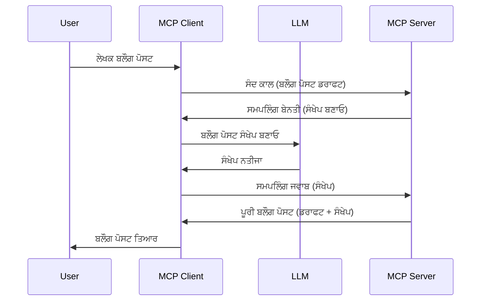

# ਸੈਂਪਲਿੰਗ - ਖਾਤੇਦਾਰ ਨੂੰ ਫੀਚਰ ਸੌਂਪਣਾ

> **ਡਿਪ੍ਰੈਕੇਸ਼ਨ ਸੂਚਨਾ:** `2026-07-28` MCP ਵਿਸ਼ੇਸ਼ਤਾ ਰਿਲੀਜ਼ ਉਮੀਦਵਾਰ ਸੈਂਪਲਿੰਗ ਨੂੰ ਡਾਇਰੈਕਟ ਐਲਐਲਐਮ ਪ੍ਰਦਾਤਾ ਏਪੀਆਈਜ਼ ਨਾਲ ਇੰਟੀਗ੍ਰੇਸ਼ਨ ਦੀ ਬਜਾਏ ਡਿਪ੍ਰੈਕੇਟ ਕਰਦਾ ਹੈ। ਸੈਂਪਲਿੰਗ `2025-11-25` ਵਿਚ ਕਾਮ ਕਰਦਾ ਰਹੇਗਾ ਅਤੇ ਕਿਸੇ ਵੀ ਸਰਕਾਰੀ ਡਿਪ੍ਰੈਕੇਸ਼ਨ ਦੇ ਬਾਅਦ ਘੱਟੋ-ਘੱਟ ਇੱਕ ਸਾਲ ਲਈ ਕੰਮ ਕਰਦਾ ਰਹੇਗਾ, ਤਾਂ ਇਹ ਸਬਕ ਵਿੱਚ ਸਭ ਕੁਝ ਵੈਧ ਰਹਿੰਦਾ ਹੈ — ਪਰ ਨਵੇਂ ਸਰਵਰ ਡਿਜ਼ਾਈਨਾਂ ਨੂੰ ਬਦਲਣ ਵਾਲੇ ਪੈਟਰਨ ਦਾ ਮੁਆਇਨਾ ਕਰਨਾ ਚਾਹੀਦਾ ਹੈ। ਵੇਖੋ [MCP ਵਿਚ ਕੀ ਬਦਲ ਰਿਹਾ ਹੈ: 2026-07-28 ਰਿਲੀਜ਼ ਉਮੀਦਵਾਰ](../../01-CoreConcepts/mcp-2026-07-28-release-candidate.md).

ਕਈ ਵਾਰ, ਤੁਹਾਨੂੰ MCP ਖਾਤੇਦਾਰ ਅਤੇ MCP ਸਰਵਰ ਨੂੰ ਮਿਲ ਕੇ ਕੰਮ ਕਰਨਾ ਪੈਂਦਾ ਹੈ ਤਾਂ ਕਿ ਇੱਕ ਸਾਂਝਾ ਲਕਸ਼ ਪ੍ਰਾਪਤ ਕੀਤਾ ਜਾ ਸਕੇ। ਤੁਹਾਡੇ ਕੋਲ ਇੱਕ ਸਥਿਤੀ ਹੋ ਸਕਦੀ ਹੈ ਜਿੱਥੇ ਸਰਵਰ ਨੂੰ ਐੱਲਐੱਲਐਮ ਦੀ ਮਦਦ ਦੀ ਲੋੜ ਹੈ ਜੋ ਖਾਤੇਦਾਰ 'ਤੇ ਸਥਿਤ ਹੈ। ਇਸ ਸਥਿਤੀ ਲਈ, ਤੁਸੀਂ ਸੈਂਪਲਿੰਗ ਦੀ ਵਰਤੋਂ ਕਰਨੀ ਚਾਹੀਦੀ ਹੈ।

ਆਓ ਕੁਝ ਵਰਤੋਂ ਦੇ ਮਾਮਲੇ ਅਤੇ ਸੈਂਪਲਿੰਗ ਨੂੰ ਸ਼ਾਮਿਲ ਕਰਕੇ ਹੱਲ ਬਣਾਉਣ ਦਾ ਤਰੀਕਾ ਵੇਖੀਏ।

## ਓਵਰਵਿਊ

ਇਸ ਪਾਠ ਵਿੱਚ, ਅਸੀਂ ਸੈਂਪਲਿੰਗ ਨੂੰ ਕਦੋਂ ਅਤੇ ਕਿੱਥੇ ਵਰਤਣਾ ਹੈ ਅਤੇ ਇਸਨੂੰ ਕਿਵੇਂ ਸੰਰਚਿਤ ਕਰਨਾ ਹੈ, ਇਸ ਲਈ ਧਿਆਨ ਦੇਵਾਂਗੇ।

## ਸਿੱਖਣ ਦੇ ਉਦੇਸ਼

ਇਸ ਅਧਿਆਇ ਵਿੱਚ, ਅਸੀਂ:

- ਇਹ ਸਮਝਾਵਾਂਗੇ ਕਿ ਸੈਂਪਲਿੰਗ ਕੀ ਹੈ ਅਤੇ ਇਹ ਕਦੋਂ ਵਰਤਣੀ ਚਾਹੀਦੀ ਹੈ।
- دکھائیں گے کہ MCP میں سэмپلنگ کو کیسے مرتب کریں۔
- ਸੈਂਪਲਿੰਗ ਦੇ ਕੁਝ ਉਦਾਹਰਣ ਦਿਖਾਵਾਂਗੇ।

## ਸੈਂਪਲਿੰਗ ਕੀ ਹੈ ਅਤੇ ਇਹ ਕਿਉਂ ਵਰਤੀ ਜਾਏ?

ਸੈਂਪਲਿੰਗ ਇੱਕ ਉੱਨਤ ਫੀਚਰ ਹੈ ਜੋ ਇੰਝ ਕੰਮ ਕਰਦਾ ਹੈ:



### ਸੈਂਪਲਿੰਗ ਬੇਨਤੀ

ਠੀਕ ਹੈ, ਹੁਣ ਸਾਡੇ ਕੋਲ ਇੱਕ ਵਰਸਾਸ਼ੀਲ ਪਰੀਪ੍ਰੇਸ਼ ਹੈ, ਆਓ ਸਮਝੀਏ ਕਿ ਸਰਵਰ ਕੁਝ ਤਰ੍ਹਾਂ ਦੇ ਸੈਂਪਲਿੰਗ ਬੇਨਤੀ ਖਾਤੇਦਾਰ ਨੂੰ ਭੇਜਦਾ ਹੈ। ਇਹ ਬੇਨਤੀ JSON-RPC ਫਾਰਮੈਟ ਵਿੱਚ ਇਸ ਤਰ੍ਹਾਂ ਹੋ ਸਕਦੀ ਹੈ:

```json
{
  "jsonrpc": "2.0",
  "id": 1,
  "method": "sampling/createMessage",
  "params": {
    "messages": [
      {
        "role": "user",
        "content": {
          "type": "text",
          "text": "Create a blog post summary of the following blog post: <BLOG POST>"
        }
      }
    ],
    "modelPreferences": {
      "hints": [
        {
          "name": "claude-3-sonnet"
        }
      ],
      "intelligencePriority": 0.8,
      "speedPriority": 0.5
    },
    "systemPrompt": "You are a helpful assistant.",
    "maxTokens": 100
  }
}
```

ਇੱਥੇ ਕੁਝ ਚੀਜ਼ਾਂ ਹਨ ਜੋ ਧਿਆਨ ਦੇਣਯੋਗ ਨੇ:

- ਪ੍ਰੌਮਪਟ, content -> text ਦੇ ਤਹਿਤ, ਸਾਡਾ ਪ੍ਰੌਮਪਟ ਹੈ ਜੋ ਐੱਲਐੱਲਐਮ ਨੂੰ ਬਲੌਗ ਪੋਸਟ ਸਮਗਰੀ ਨੂੰ ਸਾਰ ਕਰਨ ਦਾ ਹੁਕਮ ਦਿੰਦਾ ਹੈ।

- **modelPreferences**. ਇਹ ਭਾਗ ਸਿਰਫ਼ ਇੱਕ ਪਸੰਦ ਹੈ, ਇੱਕ ਕਨਫਿਗਰੇਸ਼ਨ ਦੀ ਸਿਫਾਰਸ਼ ਜੋ ਐੱਲਐੱਲਐਮ ਨਾਲ ਵਰਤਣ ਲਈ ਦਿੱਤੀ ਜਾਂਦੀ ਹੈ। ਵਰਤੋਂਕਾਰ ਇਨ੍ਹਾਂ ਸਿਫਾਰਸ਼ਾਂ ਦੇ ਨਾਲ ਜਾਂ ਬਦਲ ਕੇ ਚੁਣ ਸਕਦਾ ਹੈ। ਇਸ ਮਾਮਲੇ ਵਿੱਚ ਮਾਡਲ ਦੀ ਸਿਫਾਰਸ਼ ਅਤੇ ਗਤੀ ਅਤੇ ਬੁੱਧੀਮਾਨੀ ਪ੍ਰਾਥਮਿਕਤਾ ਦੀ ਸਿਫਾਰਸ਼ ਹੈ।
- **systemPrompt**, ਇਹ ਤੁਹਾਡਾ ਸਧਾਰਣ ਸਿਸਟਮ ਪ੍ਰੌਮਪਟ ਹੈ ਜੋ ਤੁਹਾਡੇ ਐੱਲਐੱਲਐਮ ਨੂੰ ਵਿਅਕਤੀਗਤ ਬਣਾਉਂਦਾ ਹੈ ਅਤੇ ਮਾਰਗਦਰਸ਼ਨ ਹੁਕਮ ਸਾਂਝੇ ਕਰਦਾ ਹੈ।
- **maxTokens**, ਇਹ ਇੱਕ ਹੋਰ ਗੁਣ ਹੈ ਜੋ ਦੱਸਦਾ ਹੈ ਕਿ ਇਸ ਕੰਮ ਲਈ ਕਿੰਨੇ ਟੋਕਨ ਵਰਤਣ ਦੀ ਸਿਫਾਰਸ਼ ਕੀਤੀ ਗਈ ਹੈ।

### ਸੈਂਪਲਿੰਗ ਜਵਾਬ

ਇਹ ਜਵਾਬ ਸਿਰਫ਼ MCP ਖਾਤੇਦਾਰ ਵੱਲੋਂ MCP ਸਰਵਰ ਨੂੰ ਭੇਜਿਆ ਜਾਂਦਾ ਹੈ ਅਤੇ ਇਹ ਖਾਤੇਦਾਰ ਵੱਲੋਂ ਐੱਲਐੱਲਐਮ ਨੂੰ ਕਾਲ ਕਰਨ, ਉਡੀਕ ਕਰਨ ਅਤੇ ਫਿਰ ਇਹ ਸੰਦੇਸ਼ ਬਣਾਉਣ ਦਾ ਨਤੀਜਾ ਹੁੰਦਾ ਹੈ। ਇਹ ਜਵਾਬ JSON-RPC ਵਿੱਚ ਇਸ ਪ੍ਰਕਾਰ ਹੋ ਸਕਦਾ ਹੈ:

```json
{
  "jsonrpc": "2.0",
  "id": 1,
  "result": {
    "role": "assistant",
    "content": {
      "type": "text",
      "text": "Here's your abstract <ABSTRACT>"
    },
    "model": "gpt-5",
    "stopReason": "endTurn"
  }
}
```

ਦੇਖੋ ਕਿਵੇਂ ਜਵਾਬ ਬਲੌਗ ਪੋਸਟ ਦਾ ਸਾਰ ਹੈ ਜਿਵੇਂ ਕਿ ਅਸੀਂ ਮੰਗਿਆ ਸੀ। ਇਸ ਗੱਲ ਦਾ ਵੀ ਧਿਆਨ ਦਿਓ ਕਿ ਵਰਤਿਆ ਗਿਆ `model` ਉਹ ਨਹੀਂ ਜਿਸ ਦੀ ਅਸੀਂ ਮੰਗ ਕੀਤੀ ਸੀ, ਪਰ "gpt-5" ਬਜਾਏ "claude-3-sonnet" ਹੈ। ਇਹ ਦਰਸਾਉਣ ਲਈ ਕਿ ਵਰਤੋਂਕਾਰ ਆਪਣਾ ਫੈਸਲਾ ਬਦਲ ਸਕਦਾ ਹੈ ਅਤੇ ਤੁਹਾਡੀ ਸੈਂਪਲਿੰਗ ਬੇਨਤੀ ਸਿਫਾਰਸ਼ ਹੈ।

ਠੀਕ ਹੈ, ਹੁਣ ਅਸੀਂ ਮੁੱਖ ਪ੍ਰਵਾਹ ਅਤੇ ਇਸ ਦੀ ਵਰਤੋਂ ਲਈ "ਬਲੌਗ ਪੋਸਟ ਬਣਾਉਣਾ + ਸਾਰ"ਦਾਨੇ ਕਾਮ ਨੂੰ ਸਮਝ ਗਏ ਹਾਂ, ਚਲੋ ਵੇਖੀਏ ਕਿ ਇਸਨੂੰ ਕੰਮ ਕਰਵਾਣ ਲਈ ਕੀ ਕਰਨਾ ਹੈ।

### ਸੰਦੇਸ਼ ਕਿਸਮਾਂ

ਸੈਂਪਲਿੰਗ ਸੰਦੇਸ਼ ਸਿਰਫ਼ ਲਿਖਤੀ ਹੀ ਨਹੀਂ, ਤੁਸੀਂ ਚਿੱਤਰ ਅਤੇ ਆਡੀਓ ਵੀ ਭੇਜ ਸਕਦੇ ਹੋ। JSON-RPC ਇੱਥੇ ਇੰਝ ਵੱਖਰਾ ਦਿਖਾਈ ਦੇਂਦਾ ਹੈ:

**ਲਿਖਤ**

```json
{
  "type": "text",
  "text": "The message content"
}
```

**ਚਿੱਤਰ ਸਮਗਰੀ**

```json
{
  "type": "image",
  "data": "base64-encoded-image-data",
  "mimeType": "image/jpeg"
}
```

**ਆਡੀਓ ਸਮਗਰੀ**

```json
{
  "type": "audio",
  "data": "base64-encoded-audio-data",
  "mimeType": "audio/wav"
}
```

> ਨੋਟ: ਸੈਂਪਲਿੰਗ ਬਾਰੇ ਹੋਰ ਵਿਸਥਾਰ ਵਿੱਚ ਜਾਣਕਾਰੀ ਲਈ, [ਆਧਿਕਾਰਕ ਦਸਤਾਵੇਜ਼](https://modelcontextprotocol.io/specification/2025-11-25/client/sampling) ਦੇਖੋ

## ਖਾਤੇਦਾਰ ਵਿੱਚ ਸੈਂਪਲਿੰਗ ਨੂੰ ਕਿਵੇਂ ਸੰਰਚਿਤ ਕਰੀਏ

> ਨੋਟ: ਜੇ ਤੁਸੀਂ ਸਿਰਫ਼ ਇੱਕ ਸਰਵਰ ਬਣਾ ਰਹੇ ਹੋ, ਤਾਂ ਇੱਥੇ ਜ਼ਿਆਦਾ ਕੁਝ ਕਰਨ ਦੀ ਲੋੜ ਨਹੀਂ।

ਇੱਕ ਖਾਤੇਦਾਰ ਵਿੱਚ, ਤੁਹਾਨੂੰ ਹੇਠਾਂ ਦਿੱਤੀ ਫੀਚਰ ਇਸ ਤਰ੍ਹਾਂ ਦੱਸਣੀ ਪੈਂਦੀ ਹੈ:

```json
{
  "capabilities": {
    "sampling": {}
  }
}
```

ਇਹ ਫਿਰ ਤੁਹਾਡੇ ਚੁਣੇ ਖਾਤੇਦਾਰ ਵੱਲੋਂ ਸਰਵਰ ਨਾਲ ਸ਼ੁਰੂ ਹੋਣ ਸਮੇਂ ਚੁਣਿਆ ਜਾਵੇਗਾ।

## ਸੈਂਪਲਿੰਗ ਦੀ ਕਾਰਵਾਈ - ਬਲੌਗ ਪੋਸਟ ਬਣਾਉਣਾ

ਆਓ ਇਕੱਠੇ ਇੱਕ ਸੈਂਪਲਿੰਗ ਸਰਵਰ ਨੂੰ ਕੋਡ ਕਰੀਏ, ਸਾਨੂੰ ਇਹ ਕਰਨ ਦੀ ਲੋੜ ਹੈ:

1. ਸਰਵਰ 'ਤੇ ਇੱਕ ਜੰਤਰ ਬਣਾਓ।
1. ਉਹ ਜੰਤਰ ਇੱਕ ਸੈਂਪਲਿੰਗ ਬੇਨਤੀ ਬਣਾਵੇ।
1. ਜੰਤਰ ਨੂੰ ਖਾਤੇਦਾਰ ਦੀ ਸੈਂਪਲਿੰਗ ਬੇਨਤੀ ਦੇ ਜਵਾਬ ਦਾ ਉਡੀਕ ਕਰਨਾ ਚਾਹੀਦਾ ਹੈ।
1. ਫਿਰ ਜੰਤਰ ਨਤੀਜੇ ਤਿਆਰ ਕਰਨੇ ਚਾਹੀਦੇ ਹਨ।

ਚਲੋ ਕਦਮ-ਦਰ-কਦਮ ਕੋਡ ਵੇਖੀਏ:

### -1- ਜੰਤਰ ਬਣਾਓ

**python**

```python
@mcp.tool()
async def create_blog(title: str, content: str, ctx: Context[ServerSession, None]) -> str:
    """Create a blog post and generate a summary"""

```

### -2- ਸੈਂਪਲਿੰਗ ਬੇਨਤੀ ਬਣਾਉਣਾ

ਆਪਣੇ ਜੰਤਰ 'ਚ ਹੇਠਾਂ ਦਿੱਤਾ ਕੋਡ ਸ਼ਾਮਿਲ ਕਰੋ:

**python**

```python
post = BlogPost(
        id=len(posts) + 1,
        title=title,
        content=content,
        abstract=""
    )

prompt = f"Create an abstract of the following blog post: title: {title} and draft: {content} "

result = await ctx.session.create_message(
        messages=[
            SamplingMessage(
                role="user",
                content=TextContent(type="text", text=prompt),
            )
        ],
        max_tokens=100,
)

```

### -3- ਜਵਾਬ ਦੀ ਉਡੀਕ ਕਰੋ ਅਤੇ ਜਵਾਬ ਵਾਪਸ ਕਰਵਾਓ

**python**

```python
post.abstract = result.content.text

posts.append(post)

# ਪੂਰਾ ਉਤਪਾਦ ਵਾਪਸ ਕਰੋ
return json.dumps({
    "id": post.title,
    "abstract": post.abstract
})
```

### -4- ਪੂਰਾ ਕੋਡ

**python**

```python
from starlette.applications import Starlette
from starlette.routing import Mount, Host

from mcp.server.fastmcp import Context, FastMCP

from mcp.server.session import ServerSession
from mcp.types import SamplingMessage, TextContent

import json


from uuid import uuid4
from typing import List
from pydantic import BaseModel


mcp = FastMCP("Blog post generator")

# ਐਪ = FastAPI()

posts = []

class BlogPost(BaseModel):
    id: int
    title: str
    content: str
    abstract: str

posts: List[BlogPost] = []

@mcp.tool()
async def create_blog(title: str, content: str, ctx: Context[ServerSession, None]) -> str:
    """Create a blog post and generate a summary"""

    post = BlogPost(
        id=len(posts) + 1,
        title=title,
        content=content,
        abstract=""
    )

    prompt = f"Create an abstract of the following blog post: title: {title} and draft: {content} "

    result = await ctx.session.create_message(
        messages=[
            SamplingMessage(
                role="user",
                content=TextContent(type="text", text=prompt),
            )
        ],
        max_tokens=100,
    )

    post.abstract = result.content.text

    posts.append(post)

    # ਪੂਰਾ ਬਲੌਗ ਪੋਸਟ ਵਾਪਸ ਕਰੋ
    return json.dumps({
        "id": post.title,
        "abstract": post.abstract
    })

if __name__ == "__main__":
    print("Starting server...")
    # mcp ਚਲਾਓ()
    mcp.run(transport="streamable-http")

# ਐਪ ਨੂੰ ਚਲਾਓ: python server.py ਨਾਲ
```

### -5- Visual Studio Code ਵਿੱਚ ਇਸ ਦੀ ਜਾਂਚ

Visual Studio Code ਵਿੱਚ ਇਸਦੀ ਜਾਂਚ ਕਰਨ ਲਈ, ਇਹ ਕਰੋ:

1. ਟਰਮੀਨਲ ਵਿੱਚ ਸਰਵਰ ਸ਼ੁਰੂ ਕਰੋ
1. ਇਸ ਨੂੰ *mcp.json* ਵਿੱਚ ਸ਼ਾਮਿਲ ਕਰੋ (ਅਤੇ ਯਕੀਨ ਕਰੋ ਕਿ ਇਹ ਚਾਲੂ ਹੈ) ਜਿਵੇਂ ਕਿ ਕੁਝ ਇੰਝ:

   ```json
   "servers": {
      "blog-server": {
        "type": "http",
        "url": "http://localhost:8000/mcp"
      }
   }
   ```

1. ਇੱਕ ਪ੍ਰੌਮਪਟ ਟਾਈਪ ਕਰੋ:

   ```text
   create a blog post named "Where Python comes from", the content is "Python is actually named after Monty Python Flying Circus"
   ```

1. ਸੈਂਪਲਿੰਗ ਦੀ ਆਗਿਆ ਦਿਓ। ਪਹਿਲੀ ਵਾਰ ਜਦ ਤੁਸੀਂ ਇਸਨੂੰ ਜਾਂਚੋਗੇ ਤਾਂ ਤੁਹਾਡੇ ਕੋਲ ਇੱਕ ਵਾਧੂ ਸੰਵਾਦ ਖੁਲੋ ਜੋ ਤੁਸੀਂ ਸਵੀਕਾਰ ਕਰਨਾ ਪਵੇਗਾ, ਫਿਰ ਤੁਸੀਂ ਜੰਤਰ ਚਲਾਉਣ ਲਈ ਆਮ ਸੰਵਾਦ ਦੇਖੋਗੇ।

1. ਨਤੀਜਿਆਂ ਦੀ ਜਾਂਚ ਕਰੋ। ਤੁਸੀਂ ਨਤੀਜੇ GitHub Copilot ਚੈਟ ਵਿੱਚ ਸੁੰਦਰਤਾ ਨਾਲ ਵੇਖੋਗੇ ਪਰ ਤੁਸੀਂ ਕੱਚਾ JSON ਜਵਾਬ ਵੀ ਦੇਖ ਸਕਦੇ ਹੋ।

**ਬੋਨਸ**. Visual Studio Code ਦੀ ਟੂਲੀੰਗ ਸੈਂਪਲਿੰਗ ਲਈ ਬਹੁਤ ਵਧੀਆ ਸਹਾਇਤਾ ਦਿੰਦੀ ਹੈ। ਤੁਸੀਂ ਆਪਣੇ ਇੰਸਟਾਲਡ ਸਰਵਰ 'ਤੇ ਸੈਂਪਲਿੰਗ ਪਹੁੰਚ ਨੂੰ ਇਸ ਤਰ੍ਹਾਂ ਸੰਰਚਿਤ ਕਰ ਸਕਦੇ ਹੋ:

1. ਐਕਸਟੈਂਸ਼ਨ ਸੈਕਸ਼ਨ ਤੇ ਜਾਓ।
1. "MCP SERVERS - INSTALLED" ਸੈਕਸ਼ਨ ਵਿੱਚ ਆਪਣੇ ਇੰਸਟਾਲਡ ਸਰਵਰ ਦੇ ਕੋਗ ਆਈਕਨ ਨੂੰ ਚੁਣੋ।
1. "Configure Model Access" ਕੋ ਚੁਣੋ, ਇੱਥੇ ਤੁਸੀਂ ਚੁਣ ਸਕਦੇ ਹੋ ਕਿ ਕਿਹੜੇ ਮਾਡਲ GitHub Copilot ਨੂੰ ਸੈਂਪਲਿੰਗ ਕਰਦੇ ਸਮੇਂ ਵਰਤਣ ਦੀ ਆਗਿਆ ਹੈ। ਤੁਸੀਂ ਸਾਰੇ ਹਾਲੀਆ ਸੈਂਪਲਿੰਗ ਬੇਨਤੀ ਵੀ ਇੱਥੇ "Show Sampling requests" ਚੁਣ ਕੇ ਦੇਖ ਸਕਦੇ ਹੋ।

## ਅਸਾਈਨਮੈਂਟ

ਇਸ ਅਸਾਈਨਮੈਂਟ ਵਿੱਚ, ਤੁਸੀਂ ਇੱਕ ਥੋੜ੍ਹਾ ਵੱਖਰਾ ਸੈਂਪਲਿੰਗ ਬਣਾਉਗੇ ਜੋ ਇੱਕ ਸੈਂਪਲਿੰਗ ਇੰਟੀਗ੍ਰੇਸ਼ਨ ਹੈ ਜੋ ਉਤਪਾਦ ਵਰਣਨ ਤਿਆਰ ਕਰਨ ਨੂੰ ਸਹਾਇਤਾ ਕਰਦਾ ਹੈ। ਤੁਹਾਡਾ ਸਥਿਤੀ ਇਹ ਹੈ:

**ਸਥਿਤੀ**: ਇੱਕ ਇ-ਕਾਮਰਸ ਦਾ ਬੈਕ ਆਫਿਸ ਕਰਮਚਾਰੀ ਨੂੰ ਮਦਦ ਦੀ ਲੋੜ ਹੈ, ਉਨ੍ਹਾਂ ਨੂੰ ਉਤਪਾਦ ਵਰਣਨਾਂ ਬਣਾਉਣ ਵਿੱਚ ਬਹੁਤ ਸਮਾਂ ਲੱਗਦਾ ਹੈ। ਇਸ ਲਈ, ਤੁਸੀਂ ਇੱਕ ਹੱਲ ਬਣਾਉਗੇ ਜਿੱਥੇ ਤੁਸੀਂ ਇੱਕ ਜੰਤਰ "create_product" ਨੂੰ "title" ਅਤੇ "keywords" ਦੇ ਦਲੀਲਾਂ ਦੇ ਨਾਲ ਕਾਲ ਕਰੋ ਅਤੇ ਇਹ ਇੱਕ ਪੂਰਾ ਉਤਪਾਦ ਤਿਆਰ ਕਰੇ ਜਿਸ ਵਿੱਚ ਇੱਕ "description" ਖੇਤਰ ਹੋਵੇ ਜੋ ਖਾਤੇਦਾਰ ਦੇ ਐੱਲਐੱਲਐਮ ਵੱਲੋਂ ਭਰਿਆ ਜਾਣਾ ਚਾਹੀਦਾ ਹੈ।

ਟਿਪ: ਪਹਿਲਾਂ ਸਿੱਖੀ ਗਈ ਗੱਲਾਂ ਦੀ ਵਰਤੋਂ ਕਰਕੇ ਇਹ ਸਰਵਰ ਅਤੇ ਇਸ ਦਾ ਜੰਤਰ ਸੈਂਪਲਿੰਗ ਬੇਨਤੀ ਦੀ ਵਰਤੋਂ ਕਰਕੇ ਬਣਾਓ।

## ਹੱਲ

[ਹੱਲ](./solution/README.md)

## ਮੁੱਖ ਬਿੰਦੂ

ਸੈਂਪਲਿੰਗ ਇੱਕ ਮਜ਼ਬੂਤ ਫੀਚਰ ਹੈ ਜੋ ਸਰਵਰ ਨੂੰ ਖਾਤੇਦਾਰ ਨੂੰ ਕੰਮ ਸੌਂਪਣ ਦੀ ਆਗਿਆ ਦਿੰਦਾ ਹੈ ਜਦੋਂ ਉਸਨੂੰ ਐੱਲਐੱਲਐਮ ਦੀ ਮਦਦ ਦੀ ਲੋੜ ਹੁੰਦੀ ਹੈ।

## ਅਗਲੇ ਕਦਮ

- [ਅਧਿਆਇ 4 - ਵਿਹਾਰਕ ਲਾਗੂ ਕਰਨ](../../04-PracticalImplementation/README.md)

---

<!-- CO-OP TRANSLATOR DISCLAIMER START -->
**ਅਸਵੀਕਾਰੋਪਣ**:
ਇਸ ਦਸਤਾਵੇਜ਼ ਦਾ ਅਨੁਵਾਦ ਏਆਈ ਅਨੁਵਾਦ ਸੇਵਾ [Co-op Translator](https://github.com/Azure/co-op-translator) ਦੀ ਵਰਤੋਂ ਕਰਕੇ ਕੀਤਾ ਗਿਆ ਹੈ। ਜਦੋਂ ਕਿ ਅਸੀਂ ਸਹੀਤਾਵਾਂ ਲਈ ਯਤਨਸ਼ੀਲ ਹਾਂ, ਕਿਰਪਾ ਕਰਕੇ ਧਿਆਨ ਰੱਖੋ ਕਿ ਸਵੈਚਾਲਿਤ ਅਨੁਵਾਦਾਂ ਵਿੱਚ ਗਲਤੀਆਂ ਜਾਂ ਅਸਮੱਤਿਆਵਾਂ ਹੋ ਸਕਦੀਆਂ ਹਨ। ਮੂਲ ਦਸਤਾਵੇਜ਼ ਆਪਣੀ ਮੂਲ ਭਾਸ਼ਾ ਵਿੱਚ ਅਧਿਕਾਰਕ ਸਰੋਤ ਮੰਨਿਆ ਜਾਣਾ ਚਾਹੀਦਾ ਹੈ। ਜਰੂਰੀ ਜਾਣਕਾਰੀ ਲਈ, ਪੇਸ਼ੇਵਰ ਮਨੁੱਖੀ ਅਨੁਵਾਦ ਦੀ ਸਿਫ਼ਾਰਸ਼ ਕੀਤੀ ਜਾਂਦੀ ਹੈ। ਅਸੀਂ ਇਸ ਅਨੁਵਾਦ ਦੇ ਉਪਯੋਗ ਤੋਂ ਪੈਦਾ ਹੋਣ ਵਾਲੀਆਂ ਕਿਸੇ ਵੀ ਗਲਤਫਹਿਮੀਆਂ ਜਾਂ ਗਲਤ ਵਿਆਖਿਆਵਾਂ ਲਈ ਜਵਾਬਦੇਹ ਨਹੀਂ ਹਾਂ।
<!-- CO-OP TRANSLATOR DISCLAIMER END -->