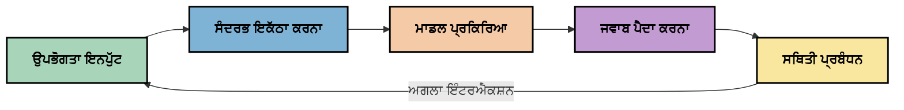
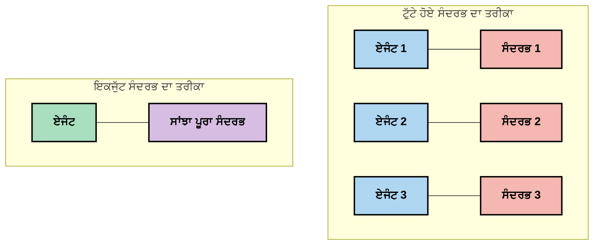
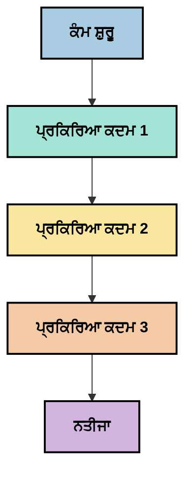
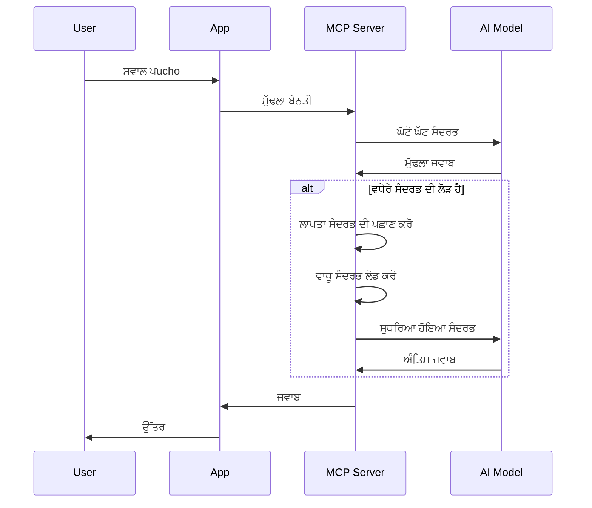
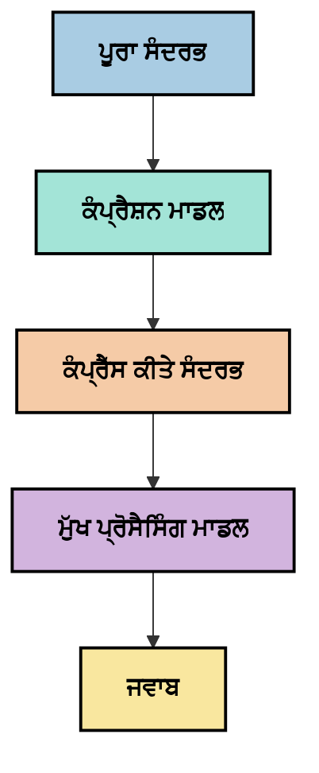
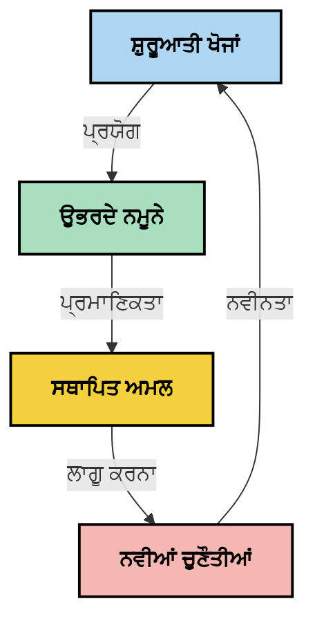

# ਸੰਦਰਭ ਇੰਜੀਨੀਅਰਿੰਗ: MCP ਇਕੋਸਿਸਟਮ ਵਿੱਚ ਇੱਕ ਉਭਰਦਾ ਸੰਕਲਪ

## ਓਵਰਵਿਊ

ਸੰਦਰਭ ਇੰਜੀਨੀਅਰਿੰਗ AI ਖੇਤਰ ਵਿੱਚ ਇੱਕ ਉਭਰਦਾ ਸੰਕਲਪ ਹੈ ਜੋ ਇਹ ਖੋਜਦਾ ਹੈ ਕਿ ਜਾਣਕਾਰੀ ਨੂੰ ਕਿਵੇਂ ਬਣਾਇਆ ਜਾਂਦਾ ਹੈ, ਪਹੁੰਚਾਇਆ ਜਾਂਦਾ ਹੈ, ਅਤੇ ਗਾਹਕਾਂ ਅਤੇ AI ਸੇਵਾਵਾਂ ਵਿਚਕਾਰ ਸੰਵਾਦ ਦਰਮਿਆਨ ਕਿਵੇਂ ਸੰਭਾਲਿਆ ਜਾਂਦਾ ਹੈ। ਜਿਵੇਂ ਕਿ ਮਾਡਲ ਸੰਦਰਭ ਪ੍ਰੋਟੋਕੋਲ (MCP) ਇਕੋਸਿਸਟਮ ਵਿਕਸਿਤ ਹੋ ਰਿਹਾ ਹੈ, ਸੰਦਰਭ ਨੂੰ ਪ੍ਰਭਾਵਸ਼ালী ਤਰੀਕੇ ਨਾਲ ਪ੍ਰਬੰਧਿਤ ਕਰਨ ਦੀ ਸਮਝਣਾ ਬਹੁਤ ਜ਼ਰੂਰੀ ਹੁੰਦਾ ਜਾ ਰਿਹਾ ਹੈ। ਇਹ ਮਾਡਿਊਲ ਸੰਦਰਭ ਇੰਜੀਨੀਅਰਿੰਗ ਦੀ ਸੰਕਲਪਨਾ ਨੂੰ ਪੇਸ਼ ਕਰਦਾ ਹੈ ਅਤੇ MCP ਲਾਗੂ ਕਰਨ ਵਿੱਚ ਇਸ ਦੀ ਸੰਭਾਵਿਤ ਵਰਤੋਂ ਨੂੰ ਖੋਜਦਾ ਹੈ।

## ਸਿੱਖਣ ਦੇ ਉਦੇਸ਼

ਇਸ ਮਾਡਿਊਲ ਦੇ ਅੰਤ ਤੱਕ, ਤੁਸੀਂ ਸਮਰੱਥ ਹੋਵੋਗੇ:

- ਸੰਦਰਭ ਇੰਜੀਨੀਅਰਿੰਗ ਦੇ ਉਭਰਦੇ ਸੰਕਲਪ ਅਤੇ MCP ਐਪਲੀਕੇਸ਼ਨਾਂ ਵਿੱਚ ਇਸ ਦੀ ਸੰਭਾਵਿਤ ਭੂਮਿਕਾ ਨੂੰ ਸਮਝਣਾ
- ਸੰਦਰਭ ਪ੍ਰਬੰਧਨ ਵਿੱਚ ਮੁੱਖ ਚੁਣੌਤੀਆਂ ਦੀ ਪਛਾਣ ਕਰਨਾ ਜਿਨ੍ਹਾਂ ਨੂੰ MCP ਪ੍ਰੋਟੋਕੋਲ ਡਿਜ਼ਾਈਨ ਸਪੱਸ਼ਟ ਕਰਦਾ ਹੈ
- ਬਿਹਤਰ ਸੰਦਰਭ ਸੰਭਾਲ ਦੁਆਰਾ ਮਾਡਲ ਪ੍ਰਦਰਸ਼ਨ ਸੁਧਾਰਣ ਲਈ ਤਕਨੀਕਾਂ ਦੀ ਖੋਜ ਕਰਨਾ
- ਸੰਦਰਭ ਦੀ ਪ੍ਰਭਾਵਸ਼ੀਲਤਾ ਨੂੰ ਮਾਪਣ ਅਤੇ ਮੂਲਾਂਕਣ ਕਰਨ ਲਈ ਪਹੁੰਚਾਂ ਤੇ ਵਿਚਾਰ ਕਰਨਾ
- MCP ਫ੍ਰੇਮਵਰਕ ਰਾਹੀਂ AI ਅਨੁਭਵਾਂ ਨੂੰ ਸੁਧਾਰਣ ਲਈ ਇਹ ਉਭਰਦੇ ਸੰਕਲਪ ਲਾਗੂ ਕਰਨਾ

## ਸੰਦਰਭ ਇੰਜੀਨੀਅਰਿੰਗ ਦਾ ਪਰਿਚય

ਸੰਦਰਭ ਇੰਜੀਨੀਅਰਿੰਗ ਇੱਕ ਉਭਰਦਾ ਸੰਕਲਪ ਹੈ ਜੋ ਉਪਭੋਗਤਾਵਾਂ, ਐਪਲੀਕੇਸ਼ਨਾਂ ਅਤੇ AI ਮਾਡਲਾਂ ਵਿਚਕਾਰ ਜਾਣਕਾਰੀ ਦੇ ਪ੍ਰਵਾਹ ਦੇ ਇਰਾਦਾਤਮਕ ਡਿਜ਼ਾਈਨ ਅਤੇ ਪ੍ਰਬੰਧ 'ਤੇ ਧਿਆਨ ਕੇਂਦਰਿਤ ਕਰਦਾ ਹੈ। ਪ੍ਰਾਂਪਟ ਇੰਜੀਨੀਅਰਿੰਗ ਵਰਗੇ ਸਥਾਪਿਤ ਖੇਤਰਾਂ ਦੇ ਵਿਰੁੱਧ, ਸੰਦਰਭ ਇੰਜੀਨੀਅਰਿੰਗ ਅਜੇ ਵੀ ਪ੍ਰਯੋਗਕਾਰਾਂ ਦੁਆਰਾ ਪਰਿਭਾਸ਼ਿਤ ਕੀਤਾ ਜਾ ਰਿਹਾ ਹੈ ਜਿਵੇਂ ਕਿ ਉਹ AI ਮਾਡਲਾਂ ਨੂੰ ਸਹੀ ਸਮੇਂ 'ਤੇ ਸਹੀ ਜਾਣਕਾਰੀ ਮੁਹੱਈਆ ਕਰਵਾਉਣ ਦੀਆਂ ਵਿਲੱਖਣ ਚੁਣੌਤੀਆਂ ਦਾ ਹੱਲ ਕਰਦੇ ਹਨ।

ਜਿਵੇਂ ਕਿ ਵੱਡੇ ਭਾਸ਼ਾ ਮਾਡਲਾਂ (LLMs) ਵਿਕਸਿਤ ਹੋਏ ਹਨ, ਸੰਦਰਭ ਦੀ ਮਹੱਤਤਾ ਵੱਧ ਤੋਂ ਵੱਧ ਸਪਸ਼ਟ ਹੋ ਗਈ ਹੈ। ਸਾਡੀ ਪ੍ਰਦਾਨ ਕੀਤੀ ਸੰਦਰਭ ਦੀ ਗੁਣਵੱਤਾ, ਸੰਬੰਧਤਾ, ਅਤੇ ਰਚਨਾ ਸਿੱਧਾ ਮਾਡਲ ਦੇ ਨਤੀਜਿਆਂ 'ਤੇ ਪ੍ਰਭਾਵ ਪਾਂਦੀ ਹੈ। ਸੰਦਰਭ ਇੰਜੀਨੀਅਰਿੰਗ ਇਸ ਸੰਬੰਧ ਦੀ ਖੋਜ ਕਰਦਾ ਹੈ ਅਤੇ ਪ੍ਰਭਾਵਸ਼ਾਲੀ ਸੰਦਰਭ ਪ੍ਰਬੰਧਨ ਲਈ ਸਿਧਾਂਤ ਵਿਕਸਿਤ ਕਰਨ ਦਾ ਉਦੇਸ਼ ਰੱਖਦਾ ਹੈ।

> "ਸਾਲ 2025 ਵਿੱਚ, ਮਾਡਲ ਬਹੁਤ ਹੋਸ਼ਿਆਰ ਹਨ। ਪਰ ਸਭ ਤੋਂ ਸਰਗਰਮ ਮਨੁੱਖ ਵੀ ਉਹਨਾਂ ਦਾ ਕੰਮ ਪ੍ਰਭਾਵਸ਼ালী ਤਰੀਕੇ ਨਾਲ ਨਹੀਂ ਕਰ ਸਕਦਾ ਜੇ ਉਹਨਾਂ ਨੂੰ ਪੁੱਛੇ ਜਾ ਰਹੇ ਕੰਮ ਦਾ ਸੰਦਰਭ ਨਾ ਮਿਲੇ... 'ਸੰਦਰਭ ਇੰਜੀਨੀਅਰਿੰਗ' ਪ੍ਰਾਂਪਟ ਇੰਜੀਨੀਅਰਿੰਗ ਦਾ ਅਗਲਾ ਦਰਜਾ ਹੈ। ਇਹ ਇੱਕ ਗਤੀਸ਼ੀਲ ਪ੍ਰਣਾਲੀ ਵਿੱਚ ਸਵੈਚਾਲਿਤ ਤਰੀਕੇ ਨਾਲ ਇਸ ਨੂੰ ਕਰਨ ਬਾਰੇ ਹੈ।" — ਵਾਲਡਨ ਯਾਨ, ਕੁਗਨੀਸ਼ਨ AI

ਸੰਦਰਭ ਇੰਜੀਨੀਅਰਿੰਗ ਸ਼ਾਇਦ ਸ਼ਾਮਲ ਹੋਵੇ:

1. **ਸੰਦਰਭ ਚੋਣ**: ਕਿਸੇ ਦਿੱਤੇ ਕੰਮ ਲਈ ਕਿਹੜੀ ਜਾਣਕਾਰੀ ਸੰਬੰਧਿਤ ਹੈ ਇਹ ਤੈਅ ਕਰਨਾ
2. **ਸੰਦਰਭ ਸੰਰਚਨਾ**: ਮਾਡਲ ਦੀ ਸਮਝ ਹੋਰ ਵੱਧ ਤੋਂ ਵੱਧ ਕਰਨ ਲਈ ਜਾਣਕਾਰੀ ਨੂੰ ਢਾਂਚਾ ਬੱਧ ਕਰਨਾ
3. **ਸੰਦਰਭ ਪਹੁੰਚਾਅ**: ਜਾਣਕਾਰੀ ਮਾਡਲਾਂ ਨੂੰ ਕਿਵੇਂ ਅਤੇ ਕਦੋਂ ਭੇਜੀ ਜਾਵੇ ਇਸ ਦੀ ਸਭ ਤੋਂ ਉੱਚੀ ਸੰਭਾਵਨਾ ਕਰਨਾ
4. **ਸੰਦਰਭ ਰਖਰਖਾਵ**: ਸਮੇਂ ਦੇ ਨਾਲ ਸੰਦਰਭ ਦੀ ਅਵਸਥਾ ਅਤੇ ਵਿਕਾਸ ਦਾ ਪ੍ਰਬੰਧਨ ਕਰਨਾ
5. **ਸੰਦਰਭ ਮੂਲਾਂਕਣ**: ਸੰਦਰਭ ਦੀ ਪ੍ਰਭਾਵਸ਼ੀਲਤਾ ਨੂੰ ਮਾਪਣਾ ਅਤੇ ਸੁਧਾਰਨਾ

ਇਹ ਫੋਕਸ ਦੇ ਖੇਤਰ ਖਾਸ ਕਰਕੇ MCP ਇਕੋਸਿਸਟਮ ਲਈ ਸੰਬੰਧਿਤ ਹਨ, ਜੋ ਐਪਲੀਕੇਸ਼ਨਾਂ ਨੂੰ LLMs ਨੂੰ ਸੰਦਰਭ ਪ੍ਰਦਾਨ ਕਰਨ ਲਈ ਕਰਮਬੱਧ ਤਰੀਕਾ ਮੁਹੱਈਆ ਕਰਵਾਉਂਦਾ ਹੈ।


## ਸੰਦਰਭ ਯਾਤਰਾ ਦਾ ਦ੍ਰਿਸ਼ਟੀਕੋਣ

ਇੱਕ ਤਰੀਕਾ ਸੰਦਰਭ ਇੰਜੀਨੀਅਰਿੰਗ ਨੂੰ ਦਿਖਾਉਣ ਦਾ ਇਹ ਹੈ ਕਿ MCP ਪ੍ਰਣਾਲੀ ਵਿੱਚ ਜਾਣਕਾਰੀ ਕਿਵੇਂ ਯਾਤਰਾ ਕਰਦੀ ਹੈ:



### ਸੰਦਰਭ ਯਾਤਰਾ ਵਿੱਚ ਮੁੱਖ ਮੰਜ਼ਿਲਾਂ:

1. **ਉਪਭੋਗਤਾ ਇੰਪੁੱਟ**: ਉਪਭੋਗਤਾ ਤੋਂ ਕੱਚੀ ਜਾਣਕਾਰੀ (ਪਾਠ, ਚਿੱਤਰ, ਦਸਤਾਵੇਜ਼)
2. **ਸੰਦਰਭ ਏਸੇmbly**: ਉਪਭੋਗਤਾ ਇੰਪੁੱਟ ਨੂੰ ਪ੍ਰਣਾਲੀ ਸੰਦਰਭ, ਗੱਲਬਾਤ ਇਤਿਹਾਸ ਅਤੇ ਹੋਰ ਲਭੀ ਗਈ ਜਾਣਕਾਰੀ ਨਾਲ ਜੋੜਨਾ
3. **ਮਾਡਲ ਪ੍ਰਕਿਰਿਆ**: AI ਮਾਡਲ ਏਸેમ્બਲ ਕੀਤੇ ਸੰਦਰਭ ਨੂੰ ਪ੍ਰਕਿਰਿਆ ਕਰਦਾ ਹੈ
4. **ਜਵਾਬ ਪੈਦਾ ਕਰਨਾ**: ਮਾਡਲ ਦਿੱਤੇ ਗਏ ਸੰਦਰਭ ਦੇ ਆਧਾਰ 'ਤੇ ਨਤੀਜੇ ਤਿਆਰ ਕਰਦਾ ਹੈ
5. **ਅਵਸਥਾ ਪ੍ਰਬੰਧਨ**: ਸੰਵਾਦ ਦੇ ਆਧਾਰ 'ਤੇ ਪ੍ਰਣਾਲੀ ਆਪਣੀ ਅੰਦਰੂਨੀ ਸਥਿਤੀ ਨੂੰ ਅੱਪਡੇਟ ਕਰਦੀ ਹੈ

ਇਹ ਦ੍ਰਿਸ਼ਟੀਕੋਣ AI ਪ੍ਰਣਾਲੀਆਂ ਵਿੱਚ ਸੰਦਰਭ ਦੀ ਗਤੀਸ਼ੀਲ ਪ੍ਰਕ੍ਰਿਤੀ ਨੂੰ ਉਜਾਗਰ ਕਰਦਾ ਹੈ ਅਤੇ ਹਰ ਮੰਜ਼ਿਲ ਤੇ ਜਾਣਕਾਰੀ ਦੀ ਸੰਭਾਲ ਕਿਵੇਂ ਸਭ ਤੋਂ ਵਧੀਆ ਤਰੀਕੇ ਨਾਲ ਕੀਤੀ ਜਾਵੇ, ਇਸ ਬਾਰੇ ਮਹੱਤਵਪੂਰਨ ਸਵਾਲ ਖੜੇ ਕਰਦਾ ਹੈ।

## ਸੰਦਰਭ ਇੰਜੀਨੀਅਰਿੰਗ ਵਿੱਚ ਉਭਰਦੇ ਸਿਧਾਂਤ

ਜਿਵੇਂ ਕਿ ਸੰਦਰਭ ਇੰਜੀਨੀਅਰਿੰਗ ਖੇਤਰ ਵਿਕਸਤ ਹੋ ਰਿਹਾ ਹੈ, ਕੁਝ ਮੁੱਢਲੇ ਸਿਧਾਂਤ ਪ੍ਰਯੋਗਕਾਰਾਂ ਤੋਂ ਉਭਰ ਰਹੇ ਹਨ। ਇਹ ਸਿਧਾਂਤ MCP ਲਾਗੂ ਕਰਨ ਦੇ ਚੋਣਾਂ ਨੂੰ ਜਾਣੂ ਕਰਨ ਵਿੱਚ ਮਦਦ ਕਰ ਸਕਦੇ ਹਨ:

### ਸਿਧਾਂਤ 1: ਸੰਦਰਭ ਨੂੰ ਪੂਰੀ ਤਰ੍ਹਾਂ ਸਾਂਝਾ ਕਰੋ

ਸੰਦਰਭ ਸਿਸਟਮ ਦੇ ਸਾਰੇ ਹਿੱਸਿਆਂ ਵਿਚਕਾਰ ਪੂਰੀ ਤਰ੍ਹਾਂ ਸਾਂਝਾ ਕੀਤਾ ਜਾਣਾ ਚਾਹੀਦਾ ਹੈ ਨਾ ਕਿ ਕਈ ਏਜੰਟਾਂ ਜਾਂ ਪ੍ਰਕਿਰਿਆਵਾਂ ਵਿਚ ਫੈਲਾਇਆ ਜਾਵੇ। ਜਦੋਂ ਸੰਦਰਭ ਵੰਡਿਆ ਜਾਂਦਾ ਹੈ, ਸਿਸਟਮ ਦੇ ਇੱਕ ਹਿੱਸੇ ਵਿੱਚ ਲਏ ਗਏ ਫੈਸਲੇ ਦੂਜੇ ਹਿੱਸੇ ਵਿੱਚ ਕੀਤੇ ਗਏ ਫੈਸਲਿਆਂ ਨਾਲ ਟਕਰਾਅ ਕਰ ਸਕਦੇ ਹਨ।



MCP ਐਪਲੀਕੇਸ਼ਨਾਂ ਵਿੱਚ, ਇਸ ਦਾ ਮਤਲਬ ਏਹ ਹੈ ਕਿ ਐਸੇ ਸਿਸਟਮ ਡਿਜ਼ਾਈਨ ਕੀਤਾ ਜਾਵੇ ਜਿੱਥੇ ਸੰਦਰਭ ਪੂਰੀ ਪਾਈਪਲਾਈਨ ਵਿੱਚ ਸੁਚਾਰੂ ਤਰੀਕੇ ਨਾਲ ਵਹਿੰਦਾ ਰਹੇ ਨਾ ਕਿ ਕਟੜੇ ਵੰਡੇ ਜਾਵੇ।

### ਸਿਧਾਂਤ 2: ਸਮਝੋ ਕਿ ਕਾਰਵਾਈਆਂ ਰੁਝਾਨਿਤ ਫੈਸਲੇ ਲੈਂਦੀਆਂ ਹਨ

ਮਾਡਲ ਦੀ ਹਰ ਇੱਕ ਕਾਰਵਾਈ ਸੰਦਰਭ ਦੀ ਵਿਆਖਿਆ ਬਾਰੇ ਗੁਪਤ ਫੈਸਲਿਆਂ ਨੂੰ ਬਿਆਨ ਕਰਦੀ ਹੈ। ਜਦੋਂ ਕਈ ਹਿੱਸੇ ਵੱਖਰੇ-ਵੱਖਰੇ ਸੰਦਰਭਾਂ 'ਤੇ ਕਾਰਵਾਈ ਕਰਦੇ ਹਨ, ਤਾਂ ਇਹ ਗੁਪਤ ਫੈਸਲੇ ਟਕਰਾਉਂਦੇ ਹਨ, ਜਿਸ ਨਾਲ ਅਸੰਗਤ ਨਤੀਜੇ ਨਿਕਲਦੇ ਹਨ।

ਇਹ ਸਿਧਾਂਤ MCP ਐਪਲੀਕੇਸ਼ਨਾਂ ਲਈ ਮਹੱਤਵਪੂਰਨ ਪ੍ਰਭਾਵ ਰੱਖਦਾ ਹੈ:
- ਵਿਰੋਧੀ ਸੰਦਰਭ ਨਾਲ ਇੱਕ ਫਿਰੈਕਸ਼ਨਲ ਕਾਰਗੀਰੀ ਨਾਲੋਂ ਰੇਖੀ ਕਾਰਗੀਰੀ ਨੂੰ ਪਸੰਦ ਕਰੋ
- ਯਕੀਨੀ ਬਣਾਓ ਕਿ ਸਾਰੇ ਫੈਸਲਾ ਲੈਣ ਵਾਲੇ ਵਿਕਲਪ ਇਕੋ ਹੀ ਸੰਦਰਭ ਜਾਣਕਾਰੀ ਤੱਕ ਪਹੁੰਚ ਰੱਖਦੇ ਹਨ
- ਐਸੇ ਸਿਸਟਮ ਡਿਜ਼ਾਈਨ ਕਰੋ ਜਿੱਥੇ ਬਾਦ ਦੇ ਕਦਮ ਪਹਿਲਾਂ ਤੋਂ ਲਏ ਗਏ ਫੈਸਲਿਆਂ ਦਾ ਪੂਰਾ ਸੰਦਰਭ ਦੇਖ ਸਕਦੇ ਹਨ

### ਸਿਧਾਂਤ 3: ਸੰਦਰਭ ਦੀ ਗਹਿਰਾਈ ਨੂੰ ਸੀਮਾਵਾਂ ਨਾਲ ਸੰਤੁਲਿਤ ਕਰੋ

ਜਿਵੇਂ ਗੱਲਬਾਤਾਂ ਅਤੇ ਪ੍ਰਕਿਰਿਆਵਾਂ ਲੰਬੀਆਂ ਹੁੰਦੀਆਂ ਹਨ, ਸੰਦਰਭ ਵਿੰਡੋ ਆਖ਼ਰਕਾਰ ਭਰ ਜਾਂਦੀ ਹੈ। ਪ੍ਰਭਾਵਸ਼ਾਲੀ ਸੰਦਰਭ ਇੰਜੀਨੀਅਰਿੰਗ ਇਸ ਸੰਤੁਲਨ ਨੂੰ ਸੰਭਾਲਣ ਲਈ ਤਰੀਕੇ ਖੋਜਦੀ ਹੈ ਜੋ ਵਿਆਪਕ ਸੰਦਰਭ ਅਤੇ ਤਕਨੀਕੀ ਸੀਮਾਵਾਂ ਦਰਮਿਆਨ ਹੈ।

ਸੰਭਾਵਿਤ ਤਰੀਕੇ ਖੋਜੇ ਜਾ ਰਹੇ ਹਨ:
- ਸੰਦਰਭ ਕੰਪ੍ਰੈਸ਼ਨ, ਜੋ ਲੋੜੀਂਦੀ ਜਾਣਕਾਰੀ ਬਰਕਰਾਰ ਰੱਖਦਾ ਹੈ ਪਰ ਟੋਕਨ ਦੀ ਵਰਤੋਂ ਘਟਾਉਂਦਾ ਹੈ
- ਵਰਤਮਾਨ ਜ਼ਰੂਰਤਾਂ ਦੇ ਅਨੁਸਾਰ ਸੰਦਰਭ ਲੋਡਿੰਗ ਪ੍ਰਗਟਾਊ
- ਪਹਿਲੀਆਂ ਗੱਲਬਾਤਾਂ ਦਾ ਸੰਕਲਪਣ ਕਰਦੇ ਹੋਏ ਕੁੰਜੀ ਫੈਸਲੇ ਅਤੇ ਤੱਥ ਸੁਰੱਖਿਅਤ ਰੱਖਣਾ

## ਸੰਦਰਭ ਚੁਣੌਤੀਆਂ ਅਤੇ MCP ਪ੍ਰੋਟੋਕੋਲ ਡਿਜ਼ਾਈਨ

ਮਾਡਲ ਸੰਦਰਭ ਪ੍ਰੋਟੋਕੋਲ (MCP) ਸੰਦਰਭ ਪ੍ਰਬੰਧਨ ਦੀਆਂ ਖਾਸ ਚੁਣੌਤੀਆਂ ਨੂੰ ਧਿਆਨ ਵਿੱਚ ਰੱਖ ਕੇ ਡਿਜ਼ਾਈਨ ਕੀਤਾ ਗਿਆ ਸੀ। ਇਹ ਚੁਣੌਤੀਆਂ ਸਮਝਣਾ MCP ਪ੍ਰੋਟੋਕੋਲ ਡਿਜ਼ਾਈਨ ਦੇ ਮੁੱਖ ਪਹلوਆਂ ਦੀ ਵਿਆਖਿਆ ਵਿੱਚ ਮਦਦ ਕਰਦਾ ਹੈ:


### ਚੁਣੌਤੀ 1: ਸੰਦਰਭ ਵਿੰਡੋ ਦੀਆਂ ਸੀਮਾਵਾਂ
ਵੱਧਤਰ AI ਮਾਡਲਾਂ ਦੀ ਇੱਕ ਨਿਸ਼ਚਿਤ ਸੰਦਰਭ ਵਿੰਡੋ ਹੱਦ ਹੁੰਦੀ ਹੈ, ਜਿਸ ਨਾਲ ਉਹ ਇੱਕ ਵਾਰ ਵਿੱਚ ਪ੍ਰਕਿਰਿਆ ਕਰਨ ਵਾਲੀ ਜਾਣਕਾਰੀ ਦੀ ਮਾਤਰਾ ਸੀਮਿਤ ਰਹਿੰਦੀ ਹੈ।

**MCP ਡਿਜ਼ਾਈਨ ਜਵਾਬ:** 
- ਪ੍ਰੋਟੋਕੋਲ ਸੜਾਂਚਿਤ, ਸਰੋਤ-ਅਧਾਰਿਤ ਸੰਦਰਭ ਨੂੰ ਸਮਰਥਨ ਕਰਦਾ ਹੈ ਜਿਸਨੂੰ ਕੁਸ਼ਲਤਾ ਨਾਲ ਹਵਾਲਾ ਦਿੱਤਾ ਜਾ ਸਕਦਾ ਹੈ
- ਸਰੋਤਾਂ ਨੂੰ ਪੰਨਾ-ਵਾਰ ਕੀਤਾ ਜਾ ਸਕਦਾ ਹੈ ਅਤੇ ਪ੍ਰਗਟੀਕ ਲੋਡਿੰਗ ਕੀਤੀ ਜਾ ਸਕਦੀ ਹੈ

### ਚੁਣੌਤੀ 2: ਸੰਬੰਧਤਾ ਨਿਰਧਾਰਿਤ ਕਰਨਾ
ਕਿੜੀ ਜਾਣਕਾਰੀ ਸਭ ਤੋਂ ਸੰਬੰਧਿਤ ਹੈ ਉਹ ਸੰਦਰਭ ਵਿੱਚ ਸ਼ਾਮਲ ਕਰਨ ਲਈ ਤੈਅ ਕਰਨਾ ਮੁਸ਼ਕਲ ਹੈ।

**MCP ਡਿਜ਼ਾਈਨ ਜਵਾਬ:**
- ਲਚੀਲੀ ਸੰਦ ਸਥਿਤੀ ਮੁਤਾਬਕ ਜਾਣਕਾਰੀ ਨੂੰ ਖੋਜਣ ਦੀ ਆਗਿਆ ਦਿੰਦੇ ਹਨ
- ਸੰਰਚਿਤ ਪ੍ਰਾਂਪਟ ਜੀਨੂੰ ਸੰਦਰਭ ਸੰਗਠਨ ਵਿੱਚ ਸਮਰਪਿਤਤਾ ਮਿਲਦੀ ਹੈ

### ਚੁਣੌਤੀ 3: ਸੰਦਰਭ ਸਥਿਰਤਾ
ਸੰਵਾਦਾਂ ਵਿਚਾਰ ਪਾਰ ਨਾਲ ਅਵਸਥਾ ਦਾ ਪ੍ਰਬੰਧਨ ਧਿਆਨਪੂਰਵਕ ਸੰਦਰਭ ਟ੍ਰੈਕਿੰਗ ਦੀ ਲੋੜ ਹੁੰਦੀ ਹੈ।

**MCP ਡਿਜ਼ਾਈਨ ਜਵਾਬ:**
- ਮਿਆਰੀਕ੍ਰਤ ਸੈਸ਼ਨ ਪ੍ਰਬੰਧਨ
- ਸੰਦਰਭ ਵਿਕਾਸ ਲਈ ਸਪੱਸ਼ਟ ਤੱਥਾਂ ਵਾਲੇ ਸੰਵਾਦ ਪੈਟਰਨ

### ਚੁਣੌਤੀ 4: ਬਹੁ-ਮੋਡਲ ਸੰਦਰਭ
ਵੱਖ-ਵੱਖ ਕਿਸਮ ਦੇ ਡਾਟਾ (ਪਾਠ, ਚਿੱਤਰ, ਸੰਰਚਿਤ ਡਾਟਾ) ਵੱਖਰਾ ਸੰਦਰਭ ਸੰਭਾਲ ਦੀ ਮੰਗ ਕਰਦੇ ਹਨ।

**MCP ਡਿਜ਼ਾਈਨ ਜਵਾਬ:**
- ਪ੍ਰੋਟੋਕੋਲ ਡਿਜ਼ਾਈਨ ਵੱਖ-ਵੱਖ ਸਮਗਰੀ ਕਿਸਮਾਂ ਨੂੰ ਸਮਰਥਨ ਕਰਦਾ ਹੈ
- ਬਹੁ-ਮੋਡਲ ਜਾਣਕਾਰੀ ਦੀ ਮਿਆਰੀਕ੍ਰਿਤ ਪ੍ਰਤੀਨਿਧਿਤਾ

### ਚੁਣੌਤੀ 5: ਸੁਰੱਖਿਆ ਅਤੇ ਗੋਪਨੀਯਤਾ
ਸੰਦਰਭ ਵਿੱਚ ਅਕਸਰ ਸੰਵੇਦਨਸ਼ੀਲ ਜਾਣਕਾਰੀ ਹੁੰਦੀ ਹੈ ਜਿਸ ਨੂੰ ਸੁਰੱਖਿਅਤ ਕੀਤਾ ਜਾਣਾ ਚਾਹੀਦਾ ਹੈ।

**MCP ਡਿਜ਼ਾਈਨ ਜਵਾਬ:**
- ਗਾਹਕ ਅਤੇ ਸਰਵਰ ਦੇ ਜ਼ਿੰਮੇਵਾਰੀਆਂ ਵਿਚਕਾਰ ਸਪੱਸ਼ਟ ਹੱਦਬੰਦੀ
- ਡਾਟਾ ਖੁਲਾਸਾ ਘਟਾਉਣ ਲਈ ਸਥਾਨਕ ਪ੍ਰਕਿਰਿਆ ਵਿਕਲਪ

ਇਹ ਚੁਣੌਤੀਆਂ ਸਮਝਣਾ ਅਤੇ MCP ਕਿਵੇਂ ਇਸ ਨੂੰ ਹੱਲ ਕਰਦਾ ਹੈ, ਵਧੇਰੇ ਉੱਨਤ ਸੰਦਰਭ ਇੰਜੀਨੀਅਰਿੰਗ ਤਕਨੀਕਾਂ ਦੀ ਖੋਜ ਲਈ ਨੀਂਹ ਪਾਉਂਦਾ ਹੈ।

## ਉਭਰਦੇ ਸੰਦਰਭ ਇੰਜੀਨੀਅਰਿੰਗ ਪਹੁੰਚਾਂ

ਜਿਵੇਂ ਕਿ ਸੰਦਰਭ ਇੰਜੀਨੀਅਰਿੰਗ ਖੇਤਰ ਵਿਕਸਤ ਹੋ ਰਿਹਾ ਹੈ, ਕੁਝ ਉਮੀਦਵਾਰ ਤਰੀਕੇ ਉਭਰ ਰਹੇ ਹਨ। ਇਹ ਮੌਜੂਦਾ ਸੋਚ ਨੂੰ ਦਰਸਾਉਂਦੇ ਹਨ ਨਾ ਕਿ ਸਥਾਪਿਤ ਸਿੱਖਿਆਵਾਂ ਨੂੰ, ਅਤੇ ਇਹ MCP ਲਾਗੂਆਂ ਨਾਲ ਅਨੁਭਵ ਆਉਂਦਾ ਰਹੇਗਾ।

### 1. ਇਕ-ਧਾਗੇ ਵਾਲੀ ਰੇਖੀ ਕਾਰਗੀਰੀ

ਕਈ ਏਜੰਟਾਂ ਵਾਲੇ ਆਰਕੀਟੈਕਚਰਾਂ ਦੇ ਬਦਲੇ, ਜੋ ਸੰਦਰਭ ਵੰਡਦੇ ਹਨ, ਕੁਝ ਪ੍ਰਯੋਗਕਾਰ ਪਾ ਰਹੇ ਹਨ ਕਿ ਇਕ-ਧਾਗੇ ਵਾਲੀ ਰੇਖੀ ਕਾਰਗੀਰੀ ਹੋਰ ਸੰਗਠਿਤ ਨਤੀਜੇ ਪੈਦਾ ਕਰਦੀ ਹੈ। ਇਹ ਇਕਤਾ ਸੰਦਰਭ ਨੂੰ ਬਣਾਈ ਰੱਖਣ ਦੇ ਸਿਧਾਂਤ ਨਾਲ ਮੇਲ ਖਾਂਦੀ ਹੈ।



ਜਦ ਕਿ ਇਹ ਤਰੀਕਾ ਸਮਰੱਥਾ ਵਿੱਚ ਘਟte ਹੋ ਸਕਦਾ ਹੈ, ਇਹ ਜ਼ਿਆਦਾ ਸੰਗਤਮਈ ਅਤੇ ਭਰੋਸੇਯੋਗ ਨਤੀਜੇ ਪੈਦਾ ਕਰਦਾ ਹੈ ਕਿਉਂਕਿ ਹਰ ਕਦਮ ਪਹਿਲਾਂ ਲਏ ਗਏ ਫੈਸਲਿਆਂ ਦੀ ਪੂਰੀ ਸਮਝ 'ਤੇ ਆਧਾਰਤ ਹੁੰਦਾ ਹੈ।

### 2. ਸੰਦਰਭ ਚੰਕਿੰਗ ਅਤੇ ਤਰਜੀਹੀਕਰਨ

ਵੱਡੇ ਸੰਦਰਭਾਂ ਨੂੰ ਸੰਭਾਲਣਯੋਗ ਹਿੱਸਿਆਂ ਵਿੱਚ ਤੋੜਣਾ ਅਤੇ ਸਭ ਤੋਂ ਮਹੱਤਵਪੂਰਨ ਚੀਜ਼ਾਂ ਨੂੰ ਪਹਿਲਾਂ ਰੱਖਣਾ।

```python
# ਸੈਧਾਂਤਕ ਉਦਾਹਰਨ: ਸੰਦਰਭ ਨੂੰ ਟੁਕੜਿਆਂ ਵਿੱਚ ਵੰਡਣਾ ਅਤੇ ਤਰਜੀਹੀਕਰਨ
def process_with_chunked_context(documents, query):
    # 1. ਦਸਤਾਵੇਜ਼ਾਂ ਨੂੰ ਛੋਟੇ ਟੁਕੜਿਆਂ ਵਿੱਚ ਵੰਡੋ
    chunks = chunk_documents(documents)
    
    # 2. ਹਰ ਟੁਕੜੇ ਲਈ ਪ੍ਰਸੰਗਿਕਤਾ ਸਕੋਰ ਗਣਨਾ ਕਰੋ
    scored_chunks = [(chunk, calculate_relevance(chunk, query)) for chunk in chunks]
    
    # 3. ਪ੍ਰਸੰਗਿਕਤਾ ਸਕੋਰ ਅਨੁਸਾਰ ਟੁਕੜਿਆਂ ਨੂੰ ਛਾਂਟੋ
    sorted_chunks = sorted(scored_chunks, key=lambda x: x[1], reverse=True)
    
    # 4. ਸਭ ਤੋਂ ਪ੍ਰਸੰਗਿਕ ਟੁਕੜਿਆਂ ਨੂੰ ਸੰਦਰਭ ਵਜੋਂ ਵਰਤੋ
    context = create_context_from_chunks([chunk for chunk, score in sorted_chunks[:5]])
    
    # 5. ਤਰਜੀਹੀਕ੍ਰਿਤ ਸੰਦਰਭ ਨਾਲ ਪ੍ਰਕਿਰਿਆ ਕਰੋ
    return generate_response(context, query)
```

ਉਪਰੋਕਤ ਸੰਕਲਪ ਦਰਸਾਉਂਦਾ ਹੈ ਕਿ ਅਸੀਂ ਵੱਡੇ ਦਸਤਾਵੇਜ਼ਾਂ ਨੂੰ ਕਿਵੇਂ ਛੋਟੇ ਟੁਕੜਿਆਂ ਵਿੱਚ ਵੰਡ ਸਕਦੇ ਹਾਂ ਅਤੇ ਸਿਰਫ ਸਭ ਤੋਂ ਸੰਬੰਧਿਤ ਭਾਗ ਚੁਣ ਸਕਦੇ ਹਾਂ। ਇਹ ਤਰੀਕਾ ਸੰਦਰਭ ਵਿੰਡੋ ਦੀਆਂ ਸੀਮਾਵਾਂ ਵਿੱਚ ਕੰਮ ਕਰਨ ਵਿੱਚ ਮਦਦ ਕਰ ਸਕਦਾ ਹੈ ਜਦਕਿ ਵੱਡੇ ਗਿਆਨ ਆਧਾਰਾਂ ਦੀ ਵਰਤੋਂ ਵੀ ਕਰਦਾ ਹੈ।

### 3. ਪ੍ਰਗਟਾਊ ਸੰਦਰਭ ਲੋਡਿੰਗ

ਲੋੜ ਮੁਤਾਬਕ ਸੰਦਰਭ ਨੂੰ ਪ੍ਰਗਟ ਤੌਰ 'ਤੇ ਲੋਡ ਕਰਨਾ ਨਾ ਕਿ ਸਾਰਾ ਇੱਕ ਵਾਰ ਵਿੱਚ।



ਪ੍ਰਗਟਾਊ ਸੰਦਰਭ ਲੋਡਿੰਗ ਘੱਟੋ-ਘੱਟ ਸੰਦਰਭ ਨਾਲ ਸ਼ੁਰੂ ਹੁੰਦੀ ਹੈ ਅਤੇ ਸਿਰਫ ਜਦ ਮੁੜਤੋਂ ਲੋੜ ਪੈਂਦੀ ਹੈ ਤਾਂ ਹੀ ਵਧਾਉਂਦੀ ਹੈ। ਇਸ ਨਾਲ ਸਧਾਰਣ ਪ੍ਰਸ਼ਨਾਂ ਲਈ ਟੋਕਨ ਖਪਤ ਘੱਟ ਹੋ ਜਾਂਦੀ ਹੈ ਜਦਕਿ ਕਠਿਨ ਪ੍ਰਸ਼ਨਾਂ ਨੂੰ ਹਲ ਕਰਨ ਦੀ ਯੋਗਤਾ ਕਾਇਮ ਰਹਿੰਦੀ ਹੈ।

### 4. ਸੰਦਰਭ ਕੰਪ੍ਰੈਸ਼ਨ ਅਤੇ ਸੰਖੇਪਨ

ਜਰੂਰੀ ਜਾਣਕਾਰੀ ਬਰਕਰਾਰ ਰੱਖਦਿਆਂ ਸੰਦਰਭ ਦਾ ਆਕਾਰ ਘਟਾਉਣਾ।



ਸੰਦਰਭ ਕੰਪ੍ਰੈਸ਼ਨ ਦਾ ਧਿਆਨ:
- ਫਾਲਤੂ ਜਾਣਕਾਰੀ ਨੂੰ ਹਟਾਉਣਾ
- ਲੰਬੇ ਸਮੱਗਰੀ ਦਾ ਸੰਖੇਪ ਬਣਾਉਣਾ
- ਮੁੱਖ ਤੱਥ ਅਤੇ ਵੇਰਵੇ ਨਿਕਾਲਣਾ
- ਅਹੰਕਾਰਪੂਰਨ ਸੰਦਰਭ ਤੱਤਾਂ ਨੂੰ ਸੰਭਾਲਣਾ
- ਟੋਕਨ ਦੀ ਕਾਰਗਰਤਾ ਲਈ ਢਾਂਚਾ ਸੁਧਾਰਨਾ

ਇਹ ਤਰੀਕਾ ਖਾਸ ਤੌਰ 'ਤੇ ਲੰਬੀਆਂ ਗੱਲਬਾਤਾਂ ਨੂੰ ਸੰਦਰਭ ਵਿੰਡੋ ਵਿੱਚ ਰੱਖਣ ਜਾ ਵੱਡੇ ਦਸਤਾਵੇਜ਼ਾਂ ਨੂੰ ਕੁਸ਼ਲਤਾ ਨਾਲ ਪ੍ਰਕਿਰਿਆ ਕਰਨ ਲਈ ਵਧੀਆ ਹੈ। ਕੁਝ ਪ੍ਰਯੋਗਕਾਰ ਗੱਲਬਾਤ ਦੇ ਇਤਿਹਾਸ ਦੇ ਕੰਪ੍ਰੈਸ਼ਨ ਅਤੇ ਸੰਖੇਪਨ ਲਈ ਖ਼ਾਸ ਮਾਡਲਾਂ ਦੀ ਵਰਤੋਂ ਕਰ ਰਹੇ ਹਨ।


## ਪੜਤਾਲੀ ਸੰਦਰਭ ਇੰਜੀਨੀਅਰਿੰਗ ਵਿਚਾਰ

ਜਿਵੇਂ ਹੀ ਅਸੀਂ ਸੰਦਰਭ ਇੰਜੀਨੀਅਰਿੰਗ ਦੇ ਉਭਰਦੇ ਖੇਤਰ ਦੀ ਖੋਜ ਕਰਦੇ ਹਾਂ, MCP ਲਾਗੂਆਂ 'ਤੇ ਕੰਮ ਕਰਦੇ ਸਮੇਂ ਕੁਝ ਚਿੰਤਾਵਾਂ ਨੂੰ ਧਿਆਨ ਵਿੱਚ ਰੱਖਣਾ ਮਹੱਤਵਪੂਰਨ ਹੈ। ਇਹ ਨਿਯਮਾਂਕਿਤ ਪ੍ਰਸ਼ਾਸਨ ਨਹੀਂ ਹਨ ਪਰ ਅਜਿਹੇ ਖੇਤਰ ਹਨ ਜੋ ਤੁਹਾਡੇ ਵਿਸ਼ੇਸ਼ ਕੇਸ ਵਿੱਚ ਸੁਧਾਰ ਲਿਆ ਸਕਦੇ ਹਨ।

### ਆਪਣੇ ਸੰਦਰਭ ਦੇ ਲਕੜੇ ਆਪਣੇ ਮਨ ਵਿੱਚ ਰੱਖੋ

ਬਹੁਤ ਜਟਿਲ ਸੰਦਰਭ ਪ੍ਰਬੰਧਨ ਹੱਲ ਲਾਗੂ ਕਰਨ ਤੋਂ ਪਹਿਲਾਂ, ਸਪੱਸ਼ਟ ਤੌਰ 'ਤੇ ਪ੍ਰਗਟ ਕਰੋ ਕਿ ਤੁਸੀਂ ਕੀ ਹਾਸਲ ਕਰਨਾ ਚਾਹੁੰਦੇ ਹੋ:
- ਮਾਡਲ ਨੂੰ ਕਿਹੜੀ ਖ਼ਾਸ ਜਾਣਕਾਰੀ ਸਫਲਤਾ ਲਈ ਲੋੜੀਂਦੀ ਹੈ?
- ਕਿਹੜੀ ਜਾਣਕਾਰੀ ਜ਼ਰੂਰੀ ਹੈ ਅਤੇ ਕਿਹੜੀ ਸਹਾਇਕ ਹੈ?
- ਤੁਹਾਡੇ ਪ੍ਰਦਰਸ਼ਨ ਸੀਮਾ ਕੀ ਹਨ (ਲੇਟੈਂਸੀ, ਟੋਕਨ ਸੀਮਾਵਾਂ, ਲਾਗਤ)?

### ਪਰਤਦਾਰ ਸੰਦਰਭ ਪਹੁੰਚਾਂ ਦੀ ਜਾਂਚ ਕਰੋ

ਕੁਝ ਪ੍ਰਯੋਗਕਾਰ ਸੰਕਲਪਾਤਮਕ ਪਰਤਾਂ ਵਿੱਚ ਵ੍ਯਵਸਥਿਤ ਸੰਦਰਭ ਨਾਲ ਸਫਲਤਾਪੂਰਵਕ ਪ੍ਰਕਿਰਿਆ ਕਰ ਰਹੇ ਹਨ:
- **ਮੁੱਖ ਪਰਤ**: ਜਰੂਰੀ ਜਾਣਕਾਰੀ ਜੋ ਮਾਡਲ ਨੂੰ ਹਮੇਸ਼ਾਂ ਲੋੜੀਂਦੀ ਹੈ
- **ਸਥਿਤੀ ਪਰਤ**: ਵਰਤਮਾਨ ਸੰਵਾਦ ਲਈ ਖ਼ਾਸ ਸੰਦਰਭ
- **ਸਹਾਇਕ ਪਰਤ**: ਵਾਧੂ ਜਾਣਕਾਰੀ ਜੋ ਲਾਭਦਾਇਕ ਹੋ ਸਕਦੀ ਹੈ
- **ਬੈਕਅਪ ਪਰਤ**: ਜਾਣਕਾਰੀ ਜਿਸ ਨੂੰ ਸਿਰਫ ਲੋੜ ਪੈਣ 'ਤੇ ਪਹੁੰਚਿਆ ਜਾਂਦਾ ਹੈ

### ਰੀਟਰੀਵਲ ਰਣਨੀਤੀਆਂ ਦੀ ਜਾਂਚ ਕਰੋ

ਤੁਹਾਡੇ ਸੰਦਰਭ ਦੀ ਪ੍ਰਭਾਵਸ਼ੀਲਤਾ ਅਕਸਰ ਇਸ ਗੱਲ 'ਤੇ ਨਿਰਭਰ ਕਰਦੀ ਹੈ ਕਿ ਤੁਸੀਂ ਜਾਣਕਾਰੀ ਕਿਵੇਂ ਪ੍ਰਾਪਤ ਕਰਦੇ ਹੋ:
- ਸਮਾਂਤਾਰ ਖੋਜ ਅਤੇ ਐਂਬੈੱਡਿੰਗ ਜੋ ਸੰਕਲਪਾਤਮਕ ਤੌਰ 'ਤੇ ਸੰਬੰਧਿਤ ਜਾਣਕਾਰੀ ਲੱਭਣ ਲਈ
- ਵਿਸ਼ੇਸ਼ ਤੱਥਾਂ ਲਈ ਕੁੰਜੀ ਸ਼ਬਦ-ਆਧਾਰਿਤ ਖੋਜ
- ਮਿਸ਼੍ਰਿਤ ਪਹੁੰਚ-ਕਾਰ ਜੋ ਕਈ ਪ੍ਰਕਾਰ ਦੀਆਂ ਖੋਜ ਤਕਨੀਕਾਂ ਨੂੰ ਜੋੜਦਾ ਹੈ
- ਸ਼੍ਰੇਣੀਆਂ, ਮਿਤੀਆਂ ਜਾਂ ਸਰੋਤਾਂ ਦੇ ਆਧਾਰ 'ਤੇ ਮੈਟਾਡੇਟਾ ਫਿਲਟਰਿੰਗ

### ਸੰਦਰਭ ਸੰਗਠਨ ਦੀ ਜਾਂਚ ਕਰੋ

ਤੁਹਾਡੇ ਸੰਦਰਭ ਦੀ ਬਣਤਰ ਅਤੇ ਪ੍ਰਵਾਹ ਮਾਡਲ ਦੀ ਸਮਝ 'ਤੇ ਅਸਰ ਪਾ ਸਕਦੇ ਹਨ:
- ਸੰਬੰਧਿਤ ਜਾਣਕਾਰੀ ਨੂੰ ਇਕੱਠਾ ਕਰਨਾ
- ਲਗਾਤਾਰ ਫਾਰਮੈਟਿੰਗ ਅਤੇ ਸੰਗਠਨ ਦਾ ਇਸਤੇਮਾਲ
- ਜਿੱਥੇ ਲੋੜ ਹੋਵੇ, ਤਰਤੀਬ ਦਾ ਲੌਜਿਕਲ ਜਾਂ ਸਮੇਂਬੱਧ ਕਾਇਮ ਰੱਖਣਾ
- ਵਿਰੋਧੀ ਜਾਣਕਾਰੀ ਤੋਂ ਬਚਣਾ

### ਬਹੁ-ਏਜੰਟ ਆਰਕੀਟੈਕਚਰਾਂ ਦੇ ਤਰਾਜੂ ਨੂੰ ਤੋਲੋ

ਕਈ AI ਫਰੇਮਵਰਕਾਂ ਵਿੱਚ ਬਹੁ-ਏਜੰਟ ਆਰਕੀਟੈਕਚਰਾਂ ਲੋਕਪ੍ਰੀਆਂ ਹਨ, ਪਰ ਉਹ ਸੰਦਰਭ ਪ੍ਰਬੰਧਨ ਲਈ ਮਹੱਤਵਪੂਰਨ ਚੁਣੌਤੀਆਂ ਨਾਲ ਆਉਂਦੀਆਂ ਹਨ:
- ਸੰਦਰਭ ਵਿਖੜ ਜਾਣਾ ਏਜੰਟਾਂ ਵਿਚਕਾਰ ਅਸੰਗਤ ਫੈਸਲੇ ਪੈਦਾ ਕਰ ਸਕਦਾ ਹੈ
- ਸੇਮਾਂਤਾਕ੍ਰਮਾ ਪ੍ਰੋਸੈਸਿੰਗ ਟਕਰਾਅ ਪੈਦਾ ਕਰ ਸਕਦੀ ਹੈ ਜੋ ਜਟਿਲ ਹੈ ਸੁਧਾਰਿਆ ਜਾਣਾ
- ਏਜੰਟਾਂ ਵਿਚਕਾਰ ਸੰਚਾਰ ਦਾ ਬੋਝ ਪ੍ਰਦਰਸ਼ਨ ਲਾਭਾਂ ਨੂੰ ਘਟਾ ਸਕਦਾ ਹੈ
- ਸੰਗਠਨ ਕਾਇਮ ਰੱਖਣ ਲਈ ਜਟਿਲ ਅਵਸਥਾ ਪ੍ਰਬੰਧਨ ਦੀ ਲੋੜ

ਬਹੁਤ मामलों ਵਿੱਚ, ਇਕੱਲਾ-ਏਜੰਟ ਪਹੁੰਚ, ਜੋ ਵਿਸ਼ਤ੍ਰਿਤ ਸੰਦਰਭ ਪ੍ਰਬੰਧਨ ਹੈ, ਕਈ ਖਾਸ ਏਜੰਟਾਂ ਨਾਲੋਂ ਭਰੋਸੇਯੋਗ ਨਤੀਜੇ ਦੇ ਸਕਦੀ ਹੈ ਜਿਨ੍ਹਾਂ ਦਾ ਸੰਦਰਭ ਆਪਣੇ-ਆਪ ਵਿੱਚ ਵੰਡਿਆ ਹੁੰਦਾ ਹੈ।

### ਮੂਲਾਂਕਣ ਤਰੀਕੇ ਵਿਕਸਤ ਕਰੋ

ਸਮੇਂ ਦੇ ਨਾਲ ਸੰਦਰਭ ਇੰਜੀਨੀਅਰਿੰਗ ਵਿੱਚ ਸੁਧਾਰ ਲਿਆਉਣ ਲਈ, ਸੋਚੋ ਕਿ ਤੁਸੀਂ ਕਿਵੇਂ ਸਫਲਤਾ ਨੂੰ ਮਾਪੋਗੇ:
- ਵੱਖ-ਵੱਖ ਸੰਦਰਭ ਢਾਂਚਿਆਂ ਦਾ ਏ/ਬੀ ਟੈਸਟਿੰਗ
- ਟੋਕਨ ਵਰਤੋਂ ਅਤੇ ਪ੍ਰਤਿਕ੍ਰਿਆ ਸਮਾਂ ਦੀ ਨਿਗਰਾਨੀ
- ਉਪਭੋਗਤਾ ਸੰਤੁਸ਼ਟੀ ਅਤੇ ਕੰਮ ਪੂਰਾ ਕਰਨ ਦੀ ਦਰ ਨੂੰ ਟ੍ਰੈਕ ਕਰਨਾ
- ਜਦ ਤੇ ਕਿਉਂ ਸੰਦਰਭ ਰਣਨੀਤੀਆਂ ਅਸਫਲ ਹੁੰਦੀਆਂ ਹਨ ਦਾ ਵਿਸ਼ਲੇਸ਼ਣ

ਇਹ ਵਿਚਾਰ ਸੰਦਰਭ ਇੰਜੀਨੀਅਰਿੰਗ ਖੇਤਰ ਵਿੱਚ ਸਰਗਰਮ ਖੋਜ ਦੇ ਖੇਤਰਾਂ ਦੀ ਨੁਮਾਇੰਦਗੀ ਕਰਦੇ ਹਨ। ਜਿਵੇਂ ਖੇਤਰ ਪ੍ਰਗਟ ਹੁੰਦਾ ਹੈ, ਹੋਰ ਪ੍ਰਮਾਣਤ ਪੈਟਰਨ ਅਤੇ ਕਾਰਗਰਤਾਵਾਂ ਉਭਰ ਸਕਦੀਆਂ ਹਨ।

## ਸੰਦਰਭ ਪ੍ਰਭਾਵਸ਼ੀਲਤਾ ਮਾਪਣ: ਇੱਕ ਵਿਕਾਸਸ਼ੀਲ ਢਾਂਚਾ

ਜਿਵੇਂ ਕਿ ਸੰਦਰਭ ਇੰਜੀਨੀਅਰਿੰਗ ਇੱਕ ਸੰਕਲਪ ਵਜੋਂ ਉਭਰ ਰਿਹਾ ਹੈ, ਪ੍ਰਯੋਗਕਾਰ ਇਹ ਖੋਜ ਰਹੇ ਹਨ ਕਿ ਅਸੀਂ ਇਸ ਦੀ ਪ੍ਰਭਾਵਸ਼ੀਲਤਾ ਕਿਵੇਂ ਮਾਪ ਸਕਦੇ ਹਾਂ। ਹਾਲਾਂਕਿ ਕੋਈ ਸਥਾਪਿਤ ਢਾਂਚਾ ਅਜੇ ਤੱਕ ਮੌਜੂਦ ਨਹੀਂ, ਪਰ ਵੱਖ-ਵੱਖ ਮਾਪਦੰਡ ਲਿਆਏ ਜਾ ਰਹੇ ਹਨ ਜੋ ਭਵਿੱਖ ਦੇ ਕੰਮ ਨੂੰ ਦਿਸ਼ਾ ਦੇ ਸਕਦੇ ਹਨ।

### ਸੰਭਾਵਿਤ ਮਾਪਣ ਵੇਖ


#### 1. ਇੰਪੁੱਟ ਸਮਰੱਥਾ ਸਬੰਧੀ ਵਿਚਾਰ

- **ਸੰਦਰਭ-ਤੋਂ-ਜਵਾਬ ਅਨੁਪਾਤ**: ਜਵਾਬ ਦੇ ਆਕਾਰ ਦੇ ਮੁਕਾਬਲੇ ਕਿੰਨਾ ਸੰਦਰਭ ਲੋੜੀਂਦਾ ਹੈ?
- **ਟੋਕਨ ਦੀ ਵਰਤੋਂ**: ਪ੍ਰਦਾਨ ਕੀਤੇ ਗਏ ਸੰਦਰਭ ਟੋਕਨਾਂ ਵਿੱਚੋਂ ਕਿੰਨੇ ਪ੍ਰਤਿਕ੍ਰਿਆ ਨੂੰ ਪ੍ਰਭਾਵਿਤ ਕਰਦੇ ਹਨ?
- **ਸੰਦਰਭ ਘਟਾਅ**: ਅਸੀਂ ਕੁਨ ਤ੍ਰੀਕੇ ਨਾਲ ਕੱਚੀ ਜਾਣਕਾਰੀ ਦਾ ਕੰਪ੍ਰੈਸ਼ਨ ਕਰ ਸਕਦੇ ਹਾਂ?

#### 2. ਪ੍ਰਦਰਸ਼ਨ ਸਬੰਧੀ ਵਿਚਾਰ

- **ਵੇਲਾ ਪ੍ਰਭਾਵ**: ਸੰਦਰਭ ਪ੍ਰਬੰਧਨ ਜਵਾਬ ਸਮੇਂ ਨੂੰ ਕਿਵੇਂ ਪ੍ਰਭਾਵਤ ਕਰਦਾ ਹੈ?
- **ਟੋਕਨ ਅਰਥਵਿਵਸਥਾ**: ਕੀ ਅਸੀਂ ਟੋਕਨ ਦੀ ਕਾਰਗਰਤਾ ਨੂੰ ਸੁਧਾਰ ਰਹੇ ਹਾਂ?
- **ਪ੍ਰਾਪਤੀ ਸ਼ੁੱਧਤਾ**: ਪ੍ਰਾਪਤ ਜਾਣਕਾਰੀ ਕਿੰਨੀ ਸੰਬੰਧਿਤ ਹੈ?
- **ਸਰੋਤ ਵਰਤੋਂ**: ਕੀ ਸਾਖੰਲ ਸੰਸਾਧਨ ਲੋੜੀਂਦੇ ਹਨ?

#### 3. ਗੁਣਵੱਤਾ ਸਬੰਧੀ ਵਿਚਾਰ

- **ਜਵਾਬ ਦੀ ਸੰਬੰਧਤਾ**: ਜਵਾਬ ਕਿੰਨੇ ਚੰਗੇ ਤਰੀਕੇ ਨਾਲ ਪ੍ਰਸ਼ਨ ਨੂੰ ਸਹਿਲਦਾ ਹੈ?
- **ਤੱਥ ਆਧਾਰਿਤ ਸਹੀਤਾ**: ਕੀ ਸੰਦਰਭ ਪ੍ਰਬੰਧਨ ਤੱਥਾਂ ਦੀ ਸਹੀਤਾ ਨੂੰ ਸੁਧਾਰਦਾ ਹੈ?
- **ਸੰਗਤੀ**: ਕੀ ਇੱਕੋ ਜਿਹੇ ਪ੍ਰਸ਼ਨਾਂ 'ਤੇ ਜਵਾਬ ਇੱਕੋ ਜਿਹੇ ਰਹਿੰਦੇ ਹਨ?
- **ਭਰਮ ਰੇਟ**: ਕੀ ਬਿਹਤਰ ਸੰਦਰਭ ਮਾਡਲ ਦੀ ਭਰਮ ਦੇਸ਼ਣ ਦੀ ਸੰਭਾਵਨਾ ਘਟਾਉਂਦਾ ਹੈ?

#### 4. ਉਪਭੋਗਤਾ ਅਨੁਭਵ ਸਬੰਧੀ ਵਿਚਾਰ

- **ਫਾਲੋ-ਅਪ ਦਰ**: ਉਪਭੋਗਤਾਵਾਂ ਨੂੰ ਕਿੰਨੀ ਵਾਰੀ ਸਪਸ਼ਟੀਕਰਨ ਦੀ ਲੋੜ ਹੁੰਦੀ ਹੈ?
- **ਕੰਮ ਦਾ ਪੂਰਾ ਹੋਣਾ**: ਕੀ ਉਪਭੋਗਤਾ ਆਪਣੇ ਲਕੜੇ ਸਫਲਤਾਪੂਰਵਕ ਪੂਰੇ ਕਰਦੇ ਹਨ?
- **ਸੰਤੁਸ਼ਟੀ ਸੂਚਕ**: ਉਪਭੋਗਤਾਵਾਂ ਆਪਣੇ ਅਨੁਭਵ ਨੂੰ ਕਿਵੇਂ ਦਰਜਾ ਕਰਦੇ ਹਨ?

### ਮਾਪਣ ਲਈ ਪੜਤਾਲੀ ਪਹੁੰਚਾਂ

ਜਦੋਂ MCP ਲਾਗੂਆਂ ਵਿੱਚ ਸੰਦਰਭ ਇੰਜੀਨੀਅਰਿੰਗ ਨਾਲ ਅਜ਼ਮਾਉਣ ਕਰਦੇ ਹੋ, ਤਾਂ ਇਹ ਪੜਤਾਲੀ ਪਹੁੰਚਾਂ ਸੋਚੋ:

1. **ਮੂਲ ਸੀਮਾ ਤੁਲਨਾਵਾਂ**: ਅੱਛੇ ਸੰਦਰਭ ਤਰੀਕਿਆਂ ਨਾਲ ਇੱਕ ਮੂਲ ਸੀਮਾ ਬਣਾਓ ਫਿਰ ਵਧੀਆ ਤਰੀਕਿਆਂ ਦਾ ਟੈਸਟ ਕਰੋ

2. **ਕ੍ਰਮਬੱਧ ਬਦਲਾਵ**: ਇੱਕ ਸਮੇਂ ਵਿੱਚ ਸੰਦਰਭ ਪ੍ਰਬੰਧਨ ਦੇ ਇੱਕ ਪੱਖ ਨੂੰ ਬਦਲੋ ਤਾਂ ਜੋ ਤੱਤ ਦੇ ਪ੍ਰਭਾਵ ਵੱਖਰੇ ਕੀਤੇ ਜਾ ਸਕਣ

3. **ਉপਭੋਗਤਾ-ਕੇਂਦਰਤ ਮੂਲਾਂਕਣ**: ਮਾਪਦੰਡਾਂ ਨੂੰ ਗੁਣਾਤਮਕ ਉਪਭੋਗਤਾ ਫੀਡਬੈਕ ਨਾਲ ਜੋੜੋ

4. **ਅਸਫਲਤਾ ਵਿਸ਼ਲੇਸ਼ਣ**: ਮਾਮਲੇ ਦੀ ਪੜਤਾਲ ਜਿੱਥੇ ਸੰਦਰਭ ਰਣਨੀਤੀਆਂ ਅਸਫਲ ਹੁੰਦੀਆਂ ਹਨ, ਸੰਭਾਵਿਤ ਸੁਧਾਰਾਂ ਨੂੰ ਸਮਝਣ ਲਈ

5. **ਬਹੁ-ਪੱਖੀ ਮੂਲਾਂਕਣ**: ਸਮਰੱਥਾ, ਗੁਣਵੱਤਾ ਅਤੇ ਉਪਭੋਗਤਾ ਅਨੁਭਵ ਦਰਮਿਆਨ ਤਰਾਜੂ ਵਿਚਾਰੋ

ਇਹ ਤਜਰਬਕਾਰੀ, ਬਹੁ-ਪਾਸੇਦਾਰ ਮਾਪਣ ਦੀ ਪਹੁੰਚ ਸੰਦਰਭ ਇੰਜੀਨੀਅਰਿੰਗ ਦੇ ਉਭਰਦੇ ਸਵਭਾਵ ਨਾਲ ਮੇਲ ਖਾਂਦੀ ਹੈ।

## ਅਖੀਰਲੇ ਵਿਚਾਰ

ਸੰਦਰਭ ਇੰਜੀਨੀਅਰਿੰਗ ਇੱਕ ਉਭਰਦਾ ਖੇਤਰ ਹੈ ਜੋ ਪ੍ਰਭਾਵਸ਼ਾਲੀ MCP ਐਪਲੀਕੇਸ਼ਨਾਂ ਲਈ ਕੇਂਦਰੀ ਸਾਬਤ ਹੋ ਸਕਦਾ ਹੈ। ਆਪਣੀ ਪ੍ਰਣਾਲੀ 'ਚ ਜਾਣਕਾਰੀ ਦੇ ਪ੍ਰਵਾਹ ਨੂੰ ਸੋਚ-ਵਿੱਚਾਰ ਕੇ ਤੁਸੀਂ ਸੰਭਾਵਿਤ ਤੌਰ 'ਤੇ AI ਅਨੁਭਵ ਬਣਾ ਸਕਦੇ ਹੋ ਜੋ ਹੋਰ ਸਮਰੱਥ, ਸਹੀ ਅਤੇ ਉਪਭੋਗਤਾਵਾਂ ਲਈ ਕੀਮਤੀ ਹੋਣ।

ਇਸ ਮਾਡਿਊਲ ਵਿੱਚ ਦਿੱਤੀਆਂ ਤਕਨੀਕਾਂ ਅਤੇ ਪਹੁੰਚਾਂ ਇਸ ਖੇਤਰ ਦੀ ਸ਼ੁਰੂਆਤੀ ਸੋਚ ਦੀ ਪ੍ਰਤੀਕ ਹੈ, ਨਾ ਕਿ ਸਥਾਪਿਤ ਅਭਿਆਸਾਂ ਦੀ। ਜਿਵੇਂ AI ਦੀਆਂ ਸਮਰੱਥਾਵਾਂ ਵਧਦੀਆਂ ਹਨ ਅਤੇ ਸਾਡੇ ਗਿਆਨ ਵਿੱਚ ਗਹਿਰਾਈ ਆਉਂਦੀ ਹੈ, ਸੰਦਰਭ ਇੰਜੀਨੀਅਰਿੰਗ ਹੋ ਸਕਦਾ ਹੈ ਕਿ ਇੱਕ ਹੋਰ ਪਰਿਭਾਸ਼ਤ ਵਿਸ਼ਯ ਬਣ ਜਾਵੇ। ਹੁਣ ਦੇ ਲਈ, ਤਜਰਬਾ ਅਤੇ ਧਿਆਨ-ਪੂਰਵਕ ਮਾਪਣ ਸਭ ਤੋਂ ਉਤਪਾਦਕ ਤਰੀਕਾ ਲੱਗਦਾ ਹੈ।

## ਸੰਭਾਵਿਤ ਭਵਿੱਖ ਦਿਸ਼ਾਵਾਂ

ਸੰਦਰਭ ਇੰਜੀਨੀਅਰਿੰਗ ਦਾ ਖੇਤਰ ਅਜੇ ਵੀ ਆਪਣੇ ਸ਼ੁਰੂਆਤੀ ਮੰਚ 'ਤੇ ਹੈ, ਪਰ ਕੁਝ ਉਮੀਦਵਾਰ ਦਿਸ਼ਾਵਾਂ ਉਭਰ ਰਹੀਆਂ ਹਨ:

- ਸੰਦਰਭ ਇੰਜੀਨੀਅਰਿੰਗ ਸਿਧਾਂਤ ਮਾਡਲ ਦੇ ਪ੍ਰਦਰਸ਼ਨ, ਸਮਰੱਥਾ, ਉਪਭੋਗਤਾ ਅਨੁਭਵ, ਅਤੇ ਭਰੋਸੇਯੋਗਤਾ ਨੂੰ ਮਹੱਤਵਪੂਰਨ ਪ੍ਰਭਾਵਿਤ ਕਰ ਸਕਦੇ ਹਨ
- ਇਕਲ ਧਾਗੇ ਵਾਲੀਆਂ ਪਹੁੰਚਾਂ, ਜਿਨ੍ਹਾਂ ਵਿੱਚ ਵਿਸ਼ਤ੍ਰਿਤ ਸੰਦਰਭ ਪ੍ਰਬੰਧਨ ਸ਼ਾਮਲ ਹੈ, ਕਈ ਵਰਤੋਂ ਕੇਸਾਂ ਲਈ ਬਹੁ-ਏਜੰਟ ਆਰਕੀਟੈਕਚਰਾਂ ਨਾਲੋਂ ਜ਼ਿਆਦਾ ਸਾਰਥਕ ਹੋ ਸਕਦੀਆਂ ਹਨ
- ਖ਼ਾਸ ਮਾਡੇਲ ਸੰਦਰਭ ਕੰਪ੍ਰੈਸ਼ਨ ਮਾਡਲਾਂ ਹੋ ਸਕਦੀਆਂ ਹਨ ਜਿਹਨਾਂ ਨੂੰ AI ਪਾਈਪਲਾਈਨਾਂ ਵਿੱਚ ਮਿਆਰੀ ਹਿੱਸੇ ਵਜੋਂ ਵਰਤਿਆ ਜਾਵੇ
- ਸੰਦਰਭ ਪੂਰਨਤਾ ਅਤੇ ਟੋਕਨ ਸੀਮਾਵਾਂ ਵਿਚਕਾਰ ਟਕਰਾਅ ਸੰਭਵਤ: ਸੰਦਰਭ ਸੰਭਾਲ ਵਿੱਚ ਨਵੋਨਮੁੱਖਤਾ ਨੂੰ ਪ੍ਰੇਰਿਤ ਕਰੇਗਾ
- ਜਿਵੇਂ ਮਾਡਲ ਮਨੁੱਖ ਵਰਗੇ ਪ੍ਰਭਾਵਸ਼ਾਲੀ ਸੰਚਾਰ ਵਿੱਚ ਹੋਰ ਸਮਰੱਥ ਬਣਦੇ ਜਾਣਗੇ, ਸੱਚੀ ਬਹੁ-ਏਜੰਟ ਸਹਿਯੋਗੀ ਹੋਣਾ ਵੱਧ ਸੰਭਵ ਬਣ ਸਕਦੀ ਹੈ
- MCP ਲਾਗੂਆਂ ਦਰਮਿਆਨ ਚੱਲ ਰਹੇ ਤਜਰਬਿਆਂ ਤੋਂ ਨਿਕਲ੍ਹਦੇ ਸੰਦਰਭ ਪ੍ਰਬੰਧਨ ਪੈਟਰਨਾਂ ਨੂੰ ਮਿਆਰੀਕ੍ਰਿਤ ਕਰਨ ਵਾਲੀਆਂ ਪਹੁੰਚਾਂ ਵਿਕਸਤ ਹੋ ਸਕਦੀਆਂ ਹਨ



## ਸਰੋਤ

### ਅਧਿਕਾਰਕ MCP ਸਰੋਤ
- [Model Context Protocol Website](https://modelcontextprotocol.io/)
- [Model Context Protocol Specification](https://github.com/modelcontextprotocol/modelcontextprotocol)

- [MCP ਦਸਤਾਵੇਜ਼ੀਕਰਨ](https://modelcontextprotocol.io/docs)
- [MCP C# SDK](https://github.com/modelcontextprotocol/csharp-sdk)
- [MCP Python SDK](https://github.com/modelcontextprotocol/python-sdk)
- [MCP TypeScript SDK](https://github.com/modelcontextprotocol/typescript-sdk)
- [MCP ਇੰਸਪੈਕਟਰ](https://github.com/modelcontextprotocol/inspector) - MCP ਸਰਵਰਾਂ ਲਈ ਵਿਜ਼ੂਅਲ ਟੈਸਟਿੰਗ ਸੰਦ

### ਸੰਦਰਭ ਇੰਜੀਨੀਅਰਿੰਗ ਲੇਖ
- [ਬਹੁ-ਏਜੰਟ ਨਾ ਬਣਾਓ: ਸੰਦਰਭ ਇੰਜੀਨੀਅਰਿੰਗ ਦੇ ਸਿਧਾਂਤ](https://cognition.ai/blog/dont-build-multi-agents) - ਵਾਲਡਨ ਯਾਨ ਦੇ ਸੰਦਰਭ ਇੰਜੀਨੀਅਰਿੰਗ ਸਿਧਾਂਤਾਂ ’ਤੇ ਵਿਚਾਰ
- [ਏਜੰਟ ਬਣਾਉਣ ਲਈ ਪ੍ਰੈਕਟਿਕਲ ਗਾਈਡ](https://cdn.openai.com/business-guides-and-resources/a-practical-guide-to-building-agents.pdf) - ਓਪਨਏਆਈ ਦੀ ਪ੍ਰਭਾਵਸ਼ਾਲੀ ਏਜੰਟ ਡਿਜ਼ਾਈਨ ਗਾਈਡ
- [ਪ੍ਰਭਾਵਸ਼ਾਲੀ ਏਜੰਟ ਬਣਾਉਣਾ](https://www.anthropic.com/engineering/building-effective-agents) - ਐਂਥਰੋਪਿਕ ਦੀ ਏਜੰਟ ਵਿਕਾਸ ਪদ্ধਤੀ

### ਸਬੰਧਤ ਖੋਜ
- [ਵੱਡੇ ਭਾਸ਼ਾਈ ਮਾਡਲਾਂ ਲਈ ਡਾਇਨਾਮਿਕ ਰੀਟਰੀਵਲ ਆਗਮੈਂਟੇਸ਼ਨ](https://arxiv.org/abs/2310.01487) - ਡਾਇਨਾਮਿਕ ਰੀਟਰੀਵਲ ਪੱਧਤੀਆਂ ’ਤੇ ਖੋਜ
- [ਵੀਚਕਾਰ ਖੋ ਗਿਆ: ਭਾਸ਼ਾਈ ਮਾਡਲ ਲੰਮੇ ਸੰਦਰਭਾਂ ਨੂੰ ਕਿਵੇਂ ਵਰਤਦੇ ਹਨ](https://arxiv.org/abs/2307.03172) - ਸੰਦਰਭ ਪ੍ਰਕਿਰਿਆ ਪੈਟਰਨਾਂ ’ਤੇ ਮਹੱਤਵਪੂਰਨ ਖੋਜ
- [CLIP ਲੇਟੈਂਟਸ ਨਾਲ ਹਾਇਰਾਰਕੀਕਲ ਟੈਕਸਟ-ਕੰਡਿਸ਼ਨਡ ਇਮੇਜ ਜਨਰੇਸ਼ਨ](https://arxiv.org/abs/2204.06125) - ਡੈੱਲ-ਈ 2 ਕਾਗਜ਼ ਜਿਸ ਵਿੱਚ ਸੰਦਰਭ ਢਾਂਚਾ ਬਾਰੇ ਜਾਣਕਾਰੀਆਂ
- [ਵੱਡੇ ਭਾਸ਼ਾਈ ਮਾਡਲ ਆਰਕੀਟੈਕਚਰਾਂ ਵਿੱਚ ਸੰਦਰਭ ਦੀ ਭੂਮਿਕਾ ਦੀ ਖੋਜ](https://aclanthology.org/2023.findings-emnlp.124/) - ਸੰਦਰਭ ਸੰਭਾਲਣ ’ਤੇ ਹਾਲੀਆ ਖੋਜ
- [ਮਲਟੀ-ਏਜੰਟ ਸਹਿਯੋਗ: ਇੱਕ ਸਰਵੇ](https://arxiv.org/abs/2304.03442) - ਮਲਟੀ-ਏਜੰਟ ਪ੍ਰਣਾਲੀਆਂ ਅਤੇ ਉਹਨਾਂ ਦੀਆਂ ਚੁਣੌਤੀਆਂ ’ਤੇ ਖੋਜ

### ਵਾਧੂ ਸਰੋਤ
- [ਸੰਦਰਭ ਵਿੰਡੋ ਅਪਟਿਮਾਈਜ਼ੇਸ਼ਨ ਤਕਨੀਕਾਂ](https://learn.microsoft.com/en-us/azure/ai-services/openai/concepts/context-window)
- [ਅਡਵਾਂਸਡ RAG ਤਕਨੀਕਾਂ](https://www.microsoft.com/en-us/research/blog/retrieval-augmented-generation-rag-and-frontier-models/)
- [ਸੈਮੈਂਟਿਕ ਕਰਨਲ ਦਸਤਾਵੇਜ਼ੀਕਰਨ](https://github.com/microsoft/semantic-kernel)
- [ਸੰਦਰਭ ਪ੍ਰਬੰਧਨ ਲਈ ਏਆਈ ਟੂਲਕਿਟ](https://github.com/microsoft/aitoolkit)

## ਅਗਲਾ ਕੀ ਹੈ

- [5.15 MCP ਕਸਟਮ ਟ੍ਰਾਂਸਪੋਰਟ](../mcp-transport/README.md)

---

<!-- CO-OP TRANSLATOR DISCLAIMER START -->
**ਅਸਵੀਕਾਰੋਪਣ**:
ਇਸ ਦਸਤਾਵੇਜ਼ ਦਾ ਅਨੁਵਾਦ ਏਆਈ ਅਨੁਵਾਦ ਸੇਵਾ [Co-op Translator](https://github.com/Azure/co-op-translator) ਦੀ ਵਰਤੋਂ ਕਰਕੇ ਕੀਤਾ ਗਿਆ ਹੈ। ਜਦੋਂ ਕਿ ਅਸੀਂ ਸਹੀਤਾਵਾਂ ਲਈ ਯਤਨਸ਼ੀਲ ਹਾਂ, ਕਿਰਪਾ ਕਰਕੇ ਧਿਆਨ ਰੱਖੋ ਕਿ ਸਵੈਚਾਲਿਤ ਅਨੁਵਾਦਾਂ ਵਿੱਚ ਗਲਤੀਆਂ ਜਾਂ ਅਸਮੱਤਿਆਵਾਂ ਹੋ ਸਕਦੀਆਂ ਹਨ। ਮੂਲ ਦਸਤਾਵੇਜ਼ ਆਪਣੀ ਮੂਲ ਭਾਸ਼ਾ ਵਿੱਚ ਅਧਿਕਾਰਕ ਸਰੋਤ ਮੰਨਿਆ ਜਾਣਾ ਚਾਹੀਦਾ ਹੈ। ਜਰੂਰੀ ਜਾਣਕਾਰੀ ਲਈ, ਪੇਸ਼ੇਵਰ ਮਨੁੱਖੀ ਅਨੁਵਾਦ ਦੀ ਸਿਫ਼ਾਰਸ਼ ਕੀਤੀ ਜਾਂਦੀ ਹੈ। ਅਸੀਂ ਇਸ ਅਨੁਵਾਦ ਦੇ ਉਪਯੋਗ ਤੋਂ ਪੈਦਾ ਹੋਣ ਵਾਲੀਆਂ ਕਿਸੇ ਵੀ ਗਲਤਫਹਿਮੀਆਂ ਜਾਂ ਗਲਤ ਵਿਆਖਿਆਵਾਂ ਲਈ ਜਵਾਬਦੇਹ ਨਹੀਂ ਹਾਂ।
<!-- CO-OP TRANSLATOR DISCLAIMER END -->