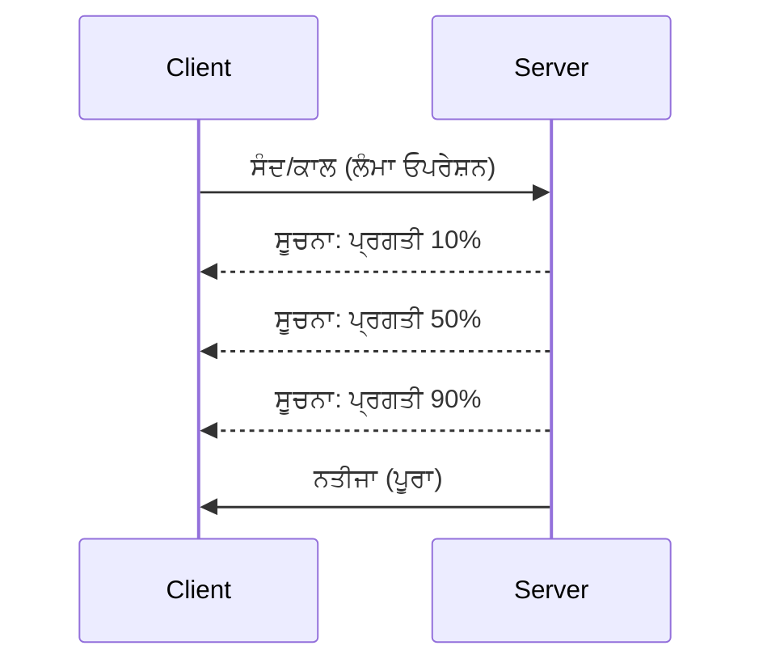

# MCP ਪ੍ਰੋਟੋਕੋਲ ਫੀਚਰਾਂ ਦੀ ਡੂੰਘੀ ਛਾਣਬੀਨ

ਇਹ ਗਾਈਡ ਬੁਨਿਆਦੀ ਟੂਲ ਅਤੇ ਸਾਂਧਨ ਸੰਭਾਲ ਤੋਂ ਉਪਰਲੇ ਉੱਨਤ MCP ਪ੍ਰੋਟੋਕੋਲ ਫੀਚਰਾਂ ਦੀ ਸਮੀਖਿਆ ਕਰਦੀ ਹੈ। ਇਹਨਾਂ ਫੀਚਰਾਂ ਨੂੰ ਸਮਝਣ ਨਾਲ ਤੁਸੀਂ ਵਧੇਰੇ ਮਜ਼ਬੂਤ, ਉਪਯੋਗਕਰਤਾ-ਮਿੱਤਰ ਅਤੇ ਉਤਪਾਦਨ-ਤਿਆਰ MCP ਸਰਵਰ ਬਣਾਉਣ ਵਿੱਚ ਸਹਾਇਤਾ ਪ੍ਰਾਪਤ ਕਰੋਂਗੇ।

> **ਅੱਗੇ ਦੇਖਦੇ ਹੋਏ:** `2026-07-28` ਰਿਲੀਜ਼ ਕੈਂਡੀਡੇਟ Logging ਪ੍ਰਮਿਤਿਵ ਨੂੰ ਹਟਾਂਦਾ ਹੈ (stdio ਲਈ `stderr` ਅਤੇ ਸੰਰਚਿਤ ਨਜ਼ਰਦੀ ਲਈ OpenTelemetry ਨੂੰ ਤਰਜੀਹ ਦਿੰਦੇ ਹੋਏ), ਹੇਠਾਂ ਦਿੱਤੇ Server Lifecycle Events ਵਿੱਚ ਜ਼ਿਕਰ ਕੀਤੇ `initialize`/ਸੈਸ਼ਨ ਮਾਡਲ ਨੂੰ ਹਟਾਂਦਾ ਹੈ, ਅਤੇ ਪ੍ਰਯੋਗਾਤਮਕ Tasks ਫੀਚਰ ਨੂੰ ਇੱਕ ਨਵੇਂ `tasks/get`/`tasks/update`/`tasks/cancel` ਜੀਵਨਚੱਕਰ ਵਾਲੇ Tasks ਐਕਸਟੈਂਸ਼ਨ ਵਿੱਚ ਸ਼ਾਮਲ ਕਰਦਾ ਹੈ। ਵੇਖੋ [MCP ਵਿੱਚ ਕੀ ਬਦਲ ਰਿਹਾ ਹੈ: 2026-07-28 ਰਿਲੀਜ਼ ਕੈਂਡੀਡੇਟ](../../01-CoreConcepts/mcp-2026-07-28-release-candidate.md)।

## ਕਵਰ ਕੀਤੇ ਫੀਚਰ

1. **ਪ੍ਰਗਤੀ ਸੂਚਨਾਵਾਂ** - ਲੰਬੇ ਸਮੇਂ ਚੱਲ ਰਹੀਆਂ ਕਾਰਵਾਈਆਂ ਦੀ ਪ੍ਰਗਤੀ ਦੀ ਰਿਪੋਰਟਿੰਗ
2. **ਰੀਕਵੇਸਟ ਰੱਦਗੀ** - ਕਲੀਐਂਟਾਂ ਨੂੰ ਚਾਲੂ ਰੀਕਵੇਸਟਾਂ ਨੂੰ ਰੱਦ ਕਰਨ ਦੀ ਆਗਿਆ
3. **ਸਰੋਤ ਟੈਮਪਲੇਟ** - ਪੈਰਾਮੀਟਰਾਂ ਨਾਲ ਗਤੀਸ਼ੀਲ ਸਰੋਤ URI
4. **ਸਰਵਰ ਜੀਵਨ ਚੱਕਰ ਘਟਨਾਵਾਂ** - ਸਹੀ ਸ਼ੁਰੂਆਤ ਅਤੇ ਬੰਦ
5. **ਲੌਗਿੰਗ ਨਿਯੰਤਰਣ** - ਸਰਵਰ-ਪਾਸੇ ਲੌਗਿੰਗ ਸੰਰਚਨਾ
6. **ਤ੍ਰੁੱਟੀ ਸੰਭਾਲ ਪੈਟਰਨ** - ਲਗਾਤਾਰ ਤ੍ਰੁੱਟੀ ਜਵਾਬ

---

## 1. ਪ੍ਰਗਤੀ ਸੂਚਨਾਵਾਂ

ਜਿਨ੍ਹਾਂ ਕਾਰਵਾਈਆਂ ਵਿੱਚ ਸਮਾਂ ਲੱਗਦਾ ਹੈ (ਡਾਟਾ ਪ੍ਰੋਸੈਸਿੰਗ, ਫਾਇਲ ਡਾਊਨਲੋਡ, API ਕਾਲ), ਪ੍ਰਗਤੀ ਸੂਚਨਾਵਾਂ ਉਪਭੋਗਤਾਵਾਂ ਨੂੰ ਜਾਣੂ ਰੱਖਦੀਆਂ ਹਨ।

### ਇਹ ਕਿਵੇਂ ਕੰਮ ਕਰਦਾ ਹੈ



### ਪਾਈਥਨ ਲਾਗੂ ਕਰਨ

```python
from mcp.server import Server, NotificationOptions
from mcp.types import ProgressNotification
import asyncio

app = Server("progress-server")

@app.tool()
async def process_large_file(file_path: str, ctx) -> str:
    """Process a large file with progress updates."""
    
    # ਪ੍ਰਗਤੀ ਦੀ ਗਿਣਤੀ ਲਈ ਫਾਇਲ ਦਾ ਆਕਾਰ ਪ੍ਰਾਪਤ ਕਰੋ
    file_size = os.path.getsize(file_path)
    processed = 0
    
    with open(file_path, 'rb') as f:
        while chunk := f.read(8192):
            # ਚੰਕ ਨੂੰ ਪ੍ਰਕਿਰਿਆ ਕਰੋ
            await process_chunk(chunk)
            processed += len(chunk)
            
            # ਪ੍ਰਗਤੀ ਦੀ ਸੂਚਨਾ ਭੇਜੋ
            progress = (processed / file_size) * 100
            await ctx.send_notification(
                ProgressNotification(
                    progressToken=ctx.request_id,
                    progress=progress,
                    total=100,
                    message=f"Processing: {progress:.1f}%"
                )
            )
    
    return f"Processed {file_size} bytes"

@app.tool()
async def batch_operation(items: list[str], ctx) -> str:
    """Process multiple items with progress."""
    
    results = []
    total = len(items)
    
    for i, item in enumerate(items):
        result = await process_item(item)
        results.append(result)
        
        # ਹਰ ਆਈਟਮ ਦੇ ਬਾਅਦ ਪ੍ਰਗਤੀ ਦੀ ਰਿਪੋਰਟ ਕਰੋ
        await ctx.send_notification(
            ProgressNotification(
                progressToken=ctx.request_id,
                progress=i + 1,
                total=total,
                message=f"Processed {i + 1}/{total}: {item}"
            )
        )
    
    return f"Completed {total} items"
```

### ਟਾਈਪਸਕ੍ਰਿਪਟ ਲਾਗੂ ਕਰਨ

```typescript
import { Server } from "@modelcontextprotocol/sdk/server/index.js";

server.setRequestHandler(CallToolSchema, async (request, extra) => {
  const { name, arguments: args } = request.params;
  
  if (name === "process_data") {
    const items = args.items as string[];
    const results = [];
    
    for (let i = 0; i < items.length; i++) {
      const result = await processItem(items[i]);
      results.push(result);
      
      // ਪ੍ਰਗਤੀ ਸੂਚਨਾ ਭੇਜੋ
      await extra.sendNotification({
        method: "notifications/progress",
        params: {
          progressToken: request.id,
          progress: i + 1,
          total: items.length,
          message: `Processing item ${i + 1}/${items.length}`
        }
      });
    }
    
    return { content: [{ type: "text", text: JSON.stringify(results) }] };
  }
});
```

### ਕਲੀਐਂਟ ਸੰਭਾਲ (ਪਾਈਥਨ)

```python
async def handle_progress(notification):
    """Handle progress notifications from server."""
    params = notification.params
    print(f"Progress: {params.progress}/{params.total} - {params.message}")

# ਹੈਂਡਲਰ ਰਜਿਸਟਰ ਕਰੋ
session.on_notification("notifications/progress", handle_progress)

# ਟੂਲ ਨੂੰ ਕਾਲ ਕਰੋ (ਪ੍ਰਗਤੀ ਅੱਪਡੇਟ ਹੈਂਡਲਰ ਰਾਹੀਂ ਮਿਲਣਗੇ)
result = await session.call_tool("process_large_file", {"file_path": "/data/large.csv"})
```

---

## 2. ਰੀਕਵੇਸਟ ਰੱਦਗੀ

ਕਲੀਐਂਟਾਂ ਨੂੰ ਉਹ ਰੀਕਵੇਸਟ ਰੱਦ ਕਰਨ ਦੀ ਆਗਿਆ ਦਿਓ ਜੋ ਹੁਣ ਲੋੜੀਂਦੇ ਨਹੀਂ ਰਹੇ ਜਾਂ ਬਹੁਤ ਜ਼ਿਆਦਾ ਸਮਾਂ ਲੈ ਰਹੇ ਹਨ।

### ਪਾਈਥਨ ਲਾਗੂ ਕਰਨ

```python
from mcp.server import Server
from mcp.types import CancelledError
import asyncio

app = Server("cancellable-server")

@app.tool()
async def long_running_search(query: str, ctx) -> str:
    """Search that can be cancelled."""
    
    results = []
    
    try:
        for page in range(100):  # ਕਈ ਪੰਨਿਆਂ ਵਿੱਚ ਖੋਜੋ
            # ਜਾਂਚ ਕਰੋ ਕਿ ਰੱਦ ਕਰਨ ਦੀ ਬੇਨਤੀ ਕੀਤੀ ਗਈ ਸੀ ਜਾਂ ਨਹੀਂ
            if ctx.is_cancelled:
                raise CancelledError("Search cancelled by user")
            
            # ਪੰਨਾ ਖੋਜ ਦੀ ਨਕਲ ਕਰੋ
            page_results = await search_page(query, page)
            results.extend(page_results)
            
            # ਛੋਟਾ ਦੇਰੀ ਰੱਦ ਕਰਨ ਦੀ ਜਾਂਚ ਦੀ ਆਗਿਆ ਦਿੰਦਾ ਹੈ
            await asyncio.sleep(0.1)
            
    except CancelledError:
        # ਹਿੱਸਾ ਨਤੀਜੇ ਵਾਪਸ ਕਰੋ
        return f"Cancelled. Found {len(results)} results before cancellation."
    
    return f"Found {len(results)} total results"

@app.tool()
async def download_file(url: str, ctx) -> str:
    """Download with cancellation support."""
    
    async with aiohttp.ClientSession() as session:
        async with session.get(url) as response:
            total_size = int(response.headers.get('content-length', 0))
            downloaded = 0
            chunks = []
            
            async for chunk in response.content.iter_chunked(8192):
                if ctx.is_cancelled:
                    return f"Download cancelled at {downloaded}/{total_size} bytes"
                
                chunks.append(chunk)
                downloaded += len(chunk)
            
            return f"Downloaded {downloaded} bytes"
```

### ਰੱਦਗੀ ਸੰਦੇਭ ਨੂੰ ਲਾਗੂ ਕਰਨਾ

```python
class CancellableContext:
    """Context object that tracks cancellation state."""
    
    def __init__(self, request_id: str):
        self.request_id = request_id
        self._cancelled = asyncio.Event()
        self._cancel_reason = None
    
    @property
    def is_cancelled(self) -> bool:
        return self._cancelled.is_set()
    
    def cancel(self, reason: str = "Cancelled"):
        self._cancel_reason = reason
        self._cancelled.set()
    
    async def check_cancelled(self):
        """Raise if cancelled, otherwise continue."""
        if self.is_cancelled:
            raise CancelledError(self._cancel_reason)
    
    async def sleep_or_cancel(self, seconds: float):
        """Sleep that can be interrupted by cancellation."""
        try:
            await asyncio.wait_for(
                self._cancelled.wait(),
                timeout=seconds
            )
            raise CancelledError(self._cancel_reason)
        except asyncio.TimeoutError:
            pass  # ਆਮ ਸਮੇਂ ਦੀ ਸੀਮਾ ਖਤਮ, ਜਾਰੀ ਰੱਖੋ
```

### ਕਲੀਐਂਟ-ਪਾਸੇ ਰੱਦਗੀ

```python
import asyncio

async def search_with_timeout(session, query, timeout=30):
    """Search with automatic cancellation on timeout."""
    
    task = asyncio.create_task(
        session.call_tool("long_running_search", {"query": query})
    )
    
    try:
        result = await asyncio.wait_for(task, timeout=timeout)
        return result
    except asyncio.TimeoutError:
        # ਬੇਨਤੀ ਰੱਦ ਕਰਨ ਦੀ
        await session.send_notification({
            "method": "notifications/cancelled",
            "params": {"requestId": task.request_id, "reason": "Timeout"}
        })
        return "Search timed out"
```

---

## 3. ਸਰੋਤ ਟੈਮਪਲੇਟ

ਸਰੋਤ ਟੈਮਪਲੇਟ ਪੈਰਾਮੀਟਰਾਂ ਨਾਲ ਗਤੀਸ਼ੀਲ URI ਬਣਾਉਣ ਦੀ ਆਗਿਆ ਦਿੰਦੇ ਹਨ, ਜੋ APIs ਅਤੇ ਡੇਟਾਬੇਸ ਲਈ ਲਾਭਦਾਇਕ ਹੈ।

### ਟੈਮਪਲੇਟ ਪਰਿਭਾਸ਼ਿਤ ਕਰਨਾ

```python
from mcp.server import Server
from mcp.types import ResourceTemplate

app = Server("template-server")

@app.list_resource_templates()
async def list_templates() -> list[ResourceTemplate]:
    """Return available resource templates."""
    return [
        ResourceTemplate(
            uriTemplate="db://users/{user_id}",
            name="User Profile",
            description="Fetch user profile by ID",
            mimeType="application/json"
        ),
        ResourceTemplate(
            uriTemplate="api://weather/{city}/{date}",
            name="Weather Data",
            description="Historical weather for city and date",
            mimeType="application/json"
        ),
        ResourceTemplate(
            uriTemplate="file://{path}",
            name="File Content",
            description="Read file at given path",
            mimeType="text/plain"
        )
    ]

@app.read_resource()
async def read_resource(uri: str) -> str:
    """Read resource, expanding template parameters."""
    
    # URI ਨੂੰ ਪਾਰਸ ਕਰਕੇ ਪੈਰਾਮੀਟਰ ਨਿਕਾਲੋ
    if uri.startswith("db://users/"):
        user_id = uri.split("/")[-1]
        return await fetch_user(user_id)
    
    elif uri.startswith("api://weather/"):
        parts = uri.replace("api://weather/", "").split("/")
        city, date = parts[0], parts[1]
        return await fetch_weather(city, date)
    
    elif uri.startswith("file://"):
        path = uri.replace("file://", "")
        return await read_file(path)
    
    raise ValueError(f"Unknown resource URI: {uri}")
```

### ਟਾਈਪਸਕ੍ਰਿਪਟ ਲਾਗੂ ਕਰਨਾ

```typescript
server.setRequestHandler(ListResourceTemplatesSchema, async () => {
  return {
    resourceTemplates: [
      {
        uriTemplate: "github://repos/{owner}/{repo}/issues/{issue_number}",
        name: "GitHub Issue",
        description: "Fetch a specific GitHub issue",
        mimeType: "application/json"
      },
      {
        uriTemplate: "db://tables/{table}/rows/{id}",
        name: "Database Row",
        description: "Fetch a row from a database table",
        mimeType: "application/json"
      }
    ]
  };
});

server.setRequestHandler(ReadResourceSchema, async (request) => {
  const uri = request.params.uri;
  
  // ਗਿਟਹਬ ਮਾਮਲਾ URI ਨੂੰ ਪਾਰਸ ਕਰੋ
  const githubMatch = uri.match(/^github:\/\/repos\/([^/]+)\/([^/]+)\/issues\/(\d+)$/);
  if (githubMatch) {
    const [_, owner, repo, issueNumber] = githubMatch;
    const issue = await fetchGitHubIssue(owner, repo, parseInt(issueNumber));
    return {
      contents: [{
        uri,
        mimeType: "application/json",
        text: JSON.stringify(issue, null, 2)
      }]
    };
  }
  
  throw new Error(`Unknown resource URI: ${uri}`);
});
```

---

## 4. ਸਰਵਰ ਜੀਵਨ ਚੱਕਰ ਘਟਨਾਵਾਂ

ਸਹੀ ਸ਼ੁਰੂਆਤ ਅਤੇ ਬੰਦ ਕਰਨ ਨਾਲ ਸਾਫ਼-ਸੁਥਰਾ ਸਰੋਤ ਪ੍ਰਬੰਧਨ ਯਕੀਨੀ ਬਣਦਾ ਹੈ।

### ਪਾਈਥਨ ਜੀਵਨ ਚੱਕਰ ਪ੍ਰਬੰਧਨ

```python
from mcp.server import Server
from contextlib import asynccontextmanager

app = Server("lifecycle-server")

# ਸਾਂਝੀ ਸਥਿਤੀ
db_connection = None
cache = None

@asynccontextmanager
async def lifespan(server: Server):
    """Manage server lifecycle."""
    global db_connection, cache
    
    # ਸਟਾਰਟਅਪ
    print("🚀 Server starting...")
    db_connection = await create_database_connection()
    cache = await create_cache_client()
    print("✅ Resources initialized")
    
    yield  # ਸਰਵਰ ਇੱਥੇ ਚੱਲਦਾ ਹੈ
    
    # ਬੰਦ ਕਰਨਾ
    print("🛑 Server shutting down...")
    await db_connection.close()
    await cache.close()
    print("✅ Resources cleaned up")

app = Server("lifecycle-server", lifespan=lifespan)

@app.tool()
async def query_database(sql: str) -> str:
    """Use the shared database connection."""
    result = await db_connection.execute(sql)
    return str(result)
```

### ਟਾਈਪਸਕ੍ਰਿਪਟ ਜੀਵਨ ਚੱਕਰ

```typescript
import { Server } from "@modelcontextprotocol/sdk/server/index.js";

class ManagedServer {
  private server: Server;
  private dbConnection: DatabaseConnection | null = null;
  
  constructor() {
    this.server = new Server({
      name: "lifecycle-server",
      version: "1.0.0"
    });
    
    this.setupHandlers();
  }
  
  async start() {
    // ਸਰੋਤ ਸ਼ੁਰੂ ਕਰੋ
    console.log("🚀 Server starting...");
    this.dbConnection = await createDatabaseConnection();
    console.log("✅ Database connected");
    
    // ਸਰਵਰ ਸ਼ੁਰੂ ਕਰੋ
    await this.server.connect(transport);
  }
  
  async stop() {
    // ਸਰੋਤ ਸਾਫ ਕਰੋ
    console.log("🛑 Server shutting down...");
    if (this.dbConnection) {
      await this.dbConnection.close();
    }
    await this.server.close();
    console.log("✅ Cleanup complete");
  }
  
  private setupHandlers() {
    this.server.setRequestHandler(CallToolSchema, async (request) => {
      // ਇਸ.dbConnection ਨੂੰ ਸੁਰੱਖਿਅਤ ਤਰੀਕੇ ਨਾਲ ਵਰਤੋ
      // ...
    });
  }
}

// ਸੌਖਾ ਬੰਦ ਕਰਦੇ ਸਮੇਂ ਵਰਤੋਂ
const server = new ManagedServer();

process.on('SIGINT', async () => {
  await server.stop();
  process.exit(0);
});

await server.start();
```

---

## 5. ਲੌਗਿੰਗ ਨਿਯੰਤਰਣ

MCP ਸਰਵਰ-ਪਾਸੇ ਲੌਗਿੰਗ ਪੱਧਰਾਂ ਦਾ ਸਮਰਥਨ ਕਰਦਾ ਹੈ ਜਿਸਨੂੰ ਕਲੀਐਂਟ ਨਿਯੰਤਰਿਤ ਕਰ ਸਕਦੇ ਹਨ।

### ਲੌਗਿੰਗ ਪੱਧਰ ਲਾਗੂ ਕਰਨਾ

```python
from mcp.server import Server
from mcp.types import LoggingLevel
import logging

app = Server("logging-server")

# MCP ਪੱਧਰਾਂ ਨੂੰ Python ਲੋਗਿੰਗ ਪੱਧਰਾਂ ਨਾਲ ਮੇਲ ਕਰੋ
LEVEL_MAP = {
    LoggingLevel.DEBUG: logging.DEBUG,
    LoggingLevel.INFO: logging.INFO,
    LoggingLevel.WARNING: logging.WARNING,
    LoggingLevel.ERROR: logging.ERROR,
}

logger = logging.getLogger("mcp-server")

@app.set_logging_level()
async def set_logging_level(level: LoggingLevel) -> None:
    """Handle client request to change logging level."""
    python_level = LEVEL_MAP.get(level, logging.INFO)
    logger.setLevel(python_level)
    logger.info(f"Logging level set to {level}")

@app.tool()
async def debug_operation(data: str) -> str:
    """Tool with various logging levels."""
    logger.debug(f"Processing data: {data}")
    
    try:
        result = process(data)
        logger.info(f"Successfully processed: {result}")
        return result
    except Exception as e:
        logger.error(f"Processing failed: {e}")
        raise
```

### ਕਲੀਐਂਟ ਨੂੰ ਲੌਗ ਸੁਨੇਹੇ ਭੇਜਣਾ

```python
@app.tool()
async def complex_operation(input: str, ctx) -> str:
    """Operation that logs to client."""
    
    # ਲਾਗ ਸੂਚਨਾ ਗਾਹਕ ਨੂੰ ਭੇਜੋ
    await ctx.send_log(
        level="info",
        message=f"Starting complex operation with input: {input}"
    )
    
    # ਕੰਮ ਕਰੋ...
    result = await do_work(input)
    
    await ctx.send_log(
        level="debug",
        message=f"Operation complete, result size: {len(result)}"
    )
    
    return result
```

---

## 6. ਤ੍ਰੁੱਟੀ ਸੰਭਾਲ ਪੈਟਰਨ

ਲਗਾਤਾਰ ਤ੍ਰੁੱਟੀ ਸੰਭਾਲ ਡਿਬੱਗਿੰਗ ਅਤੇ ਉਪਭੋਗਤਾ ਅਨੁਭਵ ਨੂੰ ਬਹਿਤਰ ਬਣਾਉਂਦੀ ਹੈ।

### MCP ਤ੍ਰੁੱਟੀ ਕੋਡ

```python
from mcp.types import McpError, ErrorCode

class ToolError(McpError):
    """Base class for tool errors."""
    pass

class ValidationError(ToolError):
    """Invalid input parameters."""
    def __init__(self, message: str):
        super().__init__(ErrorCode.INVALID_PARAMS, message)

class NotFoundError(ToolError):
    """Requested resource not found."""
    def __init__(self, resource: str):
        super().__init__(ErrorCode.INVALID_REQUEST, f"Not found: {resource}")

class PermissionError(ToolError):
    """Access denied."""
    def __init__(self, action: str):
        super().__init__(ErrorCode.INVALID_REQUEST, f"Permission denied: {action}")

class InternalError(ToolError):
    """Internal server error."""
    def __init__(self, message: str):
        super().__init__(ErrorCode.INTERNAL_ERROR, message)
```

### ਸੰਰਚਿਤ ਤ੍ਰੁੱਟੀ ਜਵਾਬ

```python
@app.tool()
async def safe_operation(input: str) -> str:
    """Tool with comprehensive error handling."""
    
    # ਇਨਪੁਟ ਦੀ ਪੁਸ਼ਟੀ ਕਰੋ
    if not input:
        raise ValidationError("Input cannot be empty")
    
    if len(input) > 10000:
        raise ValidationError(f"Input too large: {len(input)} chars (max 10000)")
    
    try:
        # ਅਧਿਕਾਰਾਂ ਦੀ ਜਾਂਚ ਕਰੋ
        if not await check_permission(input):
            raise PermissionError(f"read {input}")
        
        # ਕਾਰਵਾਈ ਕਰੋ
        result = await perform_operation(input)
        
        if result is None:
            raise NotFoundError(input)
        
        return result
        
    except ConnectionError as e:
        raise InternalError(f"Database connection failed: {e}")
    except TimeoutError as e:
        raise InternalError(f"Operation timed out: {e}")
    except Exception as e:
        # ਅਣਉਮੀਦਤ ਗਲਤੀਆਂ ਲੌਗ ਕਰੋ
        logger.exception(f"Unexpected error in safe_operation")
        raise InternalError(f"Unexpected error: {type(e).__name__}")
```

### ਟਾਈਪਸਕ੍ਰਿਪਟ ਵਿੱਚ ਤ੍ਰੁੱਟੀ ਸੰਭਾਲ

```typescript
import { McpError, ErrorCode } from "@modelcontextprotocol/sdk/types.js";

function validateInput(data: unknown): asserts data is ValidInput {
  if (typeof data !== "object" || data === null) {
    throw new McpError(
      ErrorCode.InvalidParams,
      "Input must be an object"
    );
  }
  // ਹੋਰ ਸਚਾਈ ਕਣਕੀ...
}

server.setRequestHandler(CallToolSchema, async (request) => {
  try {
    validateInput(request.params.arguments);
    
    const result = await performOperation(request.params.arguments);
    
    return {
      content: [{ type: "text", text: JSON.stringify(result) }]
    };
    
  } catch (error) {
    if (error instanceof McpError) {
      throw error;  // ਪਹਿਲਾਂ ਹੀ ਇਕ MCP ਗ਼ਲਤੀ
    }
    
    // ਹੋਰ ਗ਼ਲਤੀਆਂ ਬਦਲੋ
    if (error instanceof NotFoundError) {
      throw new McpError(ErrorCode.InvalidRequest, error.message);
    }
    
    // ਅਣਜਾਣ ਗ਼ਲਤੀ
    console.error("Unexpected error:", error);
    throw new McpError(
      ErrorCode.InternalError,
      "An unexpected error occurred"
    );
  }
});
```

---

## ਪ੍ਰਯੋਗਾਤਮਕ ਫੀਚਰ (MCP 2025-11-25)

ਇਹ ਫੀਚਰ ਵਿਸ਼ੇਸ਼ਣ ਵਿੱਚ ਪ੍ਰਯੋਗਾਤਮਕ ਵਜੋਂ ਨਿਸ਼ਾਨਦਾਰ ਹਨ:

### ਟਾਸਕ (ਲੰਬੇ ਸਮੇਂ ਚੱਲਣ ਵਾਲੀਆਂ ਕਾਰਵਾਈਆਂ)

```python
# ਕੰਮ ਲੰਬੇ ਸਮੇਂ ਚੱਲ ਰਹੇ ਓਪਰੇਸ਼ਨਾਂ ਨੂੰ ਸਥਿਤੀ ਨਾਲ ਟਰੈਕ ਕਰਨ ਦੀ ਆਗਿਆ ਦਿੰਦੇ ਹਨ
@app.task()
async def training_task(model_id: str, data_path: str, ctx) -> str:
    """Long-running ML training task."""
    
    # ਕੰਮ ਸ਼ੁਰੂ ਹੋਣ ਦੀ ਰਿਪੋਰਟ
    await ctx.report_status("running", "Initializing training...")
    
    # ਟ੍ਰੇਨਿੰਗ ਲੂਪ
    for epoch in range(100):
        await train_epoch(model_id, data_path, epoch)
        await ctx.report_status(
            "running",
            f"Training epoch {epoch + 1}/100",
            progress=epoch + 1,
            total=100
        )
    
    await ctx.report_status("completed", "Training finished")
    return f"Model {model_id} trained successfully"
```

### ਟੂਲ ਟਿੱਪਣੀਆਂ

```python
# ਐਨੋਟੇਸ਼ਨ ਟੂਲ ਦੇ ਵਿਹਾਰ ਬਾਰੇ ਮੈਟਾਡੇਟਾ ਪ੍ਰਦਾਨ ਕਰਦੇ ਹਨ
@app.tool(
    annotations={
        "destructive": False,      # ਡਾਟਾ ਨੂੰ ਬਦਲਦਾ ਨਹੀਂ ਹੈ
        "idempotent": True,        # ਮੁੜ ਕੋਸ਼ਿਸ਼ ਕਰਨ ਲਈ ਸੁਰੱਖਿਅਤ
        "timeout_seconds": 30,     # ਉਮੀਦਵਾਰ ਵੱਧੋਤਮ ਅਵਧੀ
        "requires_approval": False # ਕੋਈ ਯੂਜ਼ਰ ਮਨਜ਼ੂਰੀ ਦੀ ਲੋੜ ਨਹੀਂ
    }
)
async def safe_query(query: str) -> str:
    """A read-only database query tool."""
    return await execute_read_query(query)
```

---

## ਅੱਗੇ ਕੀ ਹੈ

- [ਮੋਡੀਊਲ 8 - ਬੈਸਟ ਪ੍ਰੈਕਟਿਸ](../../08-BestPractices/README.md)
- [5.14 - ਸੰਦਰਭ ਇੰਜੀਨੀਅਰਿੰਗ](../mcp-contextengineering/README.md)
- [MCP ਵਿਸ਼ੇਸ਼ਣ ਚੇਂਜਲੋਗ](https://spec.modelcontextprotocol.io/)

---

## ਵਾਧੂ ਸਰੋਤ

- [MCP ਵਿਸ਼ੇਸ਼ਣ 2025-11-25](https://spec.modelcontextprotocol.io/specification/2025-11-25/)
- [JSON-RPC 2.0 ਤ੍ਰੁੱਟੀ ਕੋਡ](https://www.jsonrpc.org/specification#error_object)
- [Python SDK ਉਦਾਹਰਣ](https://github.com/modelcontextprotocol/python-sdk/tree/main/examples)
- [TypeScript SDK ਉਦਾਹਰਣ](https://github.com/modelcontextprotocol/typescript-sdk/tree/main/examples)

---

<!-- CO-OP TRANSLATOR DISCLAIMER START -->
**ਅਸਵੀਕਾਰੋਪਣ**:
ਇਸ ਦਸਤਾਵੇਜ਼ ਦਾ ਅਨੁਵਾਦ ਏਆਈ ਅਨੁਵਾਦ ਸੇਵਾ [Co-op Translator](https://github.com/Azure/co-op-translator) ਦੀ ਵਰਤੋਂ ਕਰਕੇ ਕੀਤਾ ਗਿਆ ਹੈ। ਜਦੋਂ ਕਿ ਅਸੀਂ ਸਹੀਤਾਵਾਂ ਲਈ ਯਤਨਸ਼ੀਲ ਹਾਂ, ਕਿਰਪਾ ਕਰਕੇ ਧਿਆਨ ਰੱਖੋ ਕਿ ਸਵੈਚਾਲਿਤ ਅਨੁਵਾਦਾਂ ਵਿੱਚ ਗਲਤੀਆਂ ਜਾਂ ਅਸਮੱਤਿਆਵਾਂ ਹੋ ਸਕਦੀਆਂ ਹਨ। ਮੂਲ ਦਸਤਾਵੇਜ਼ ਆਪਣੀ ਮੂਲ ਭਾਸ਼ਾ ਵਿੱਚ ਅਧਿਕਾਰਕ ਸਰੋਤ ਮੰਨਿਆ ਜਾਣਾ ਚਾਹੀਦਾ ਹੈ। ਜਰੂਰੀ ਜਾਣਕਾਰੀ ਲਈ, ਪੇਸ਼ੇਵਰ ਮਨੁੱਖੀ ਅਨੁਵਾਦ ਦੀ ਸਿਫ਼ਾਰਸ਼ ਕੀਤੀ ਜਾਂਦੀ ਹੈ। ਅਸੀਂ ਇਸ ਅਨੁਵਾਦ ਦੇ ਉਪਯੋਗ ਤੋਂ ਪੈਦਾ ਹੋਣ ਵਾਲੀਆਂ ਕਿਸੇ ਵੀ ਗਲਤਫਹਿਮੀਆਂ ਜਾਂ ਗਲਤ ਵਿਆਖਿਆਵਾਂ ਲਈ ਜਵਾਬਦੇਹ ਨਹੀਂ ਹਾਂ।
<!-- CO-OP TRANSLATOR DISCLAIMER END -->