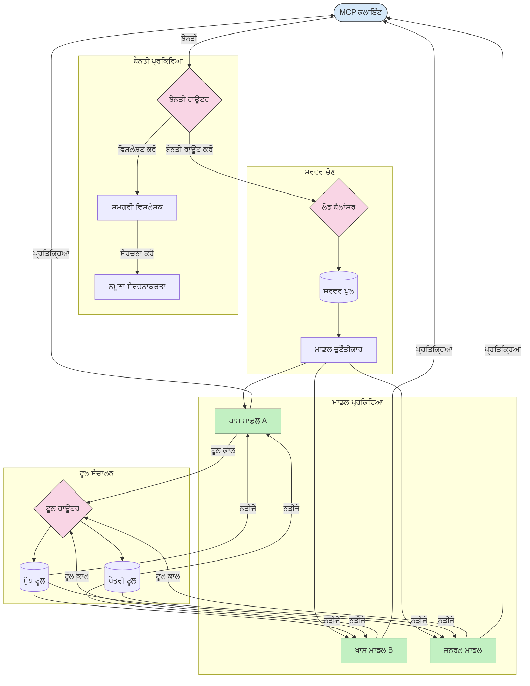

# ਮਾਡਲ ਸੰਦਰਭ ਪ੍ਰੋਟੋਕੋਲ ਵਿੱਚ ਰੂਟਿੰਗ  

ਰੂਟਿੰਗ MCP ਇਕੋਸਿਸਟਮ ਵਿੱਚ ਠੀਕ ਮਾਡਲਾਂ, ਸੰਦਾਂ ਜਾਂ ਸੇਵਾਵਾਂ ਵੱਲ ਬੇਨਤੀਆਂ ਦਿਸ਼ਾ-ਨਿਰਦੇਸ਼ ਕਰਨ ਲਈ ਜਰੂਰੀ ਹੈ।  

## ਪਰਿਚਿਆ  

ਮਾਡਲ ਸੰਦਰਭ ਪ੍ਰੋਟੋਕੋਲ (MCP) ਵਿੱਚ ਰੂਟਿੰਗ ਵਿੱਚ ਸਮੱਗਰੀ ਦੇ ਕਿਸਮ, ਉਪਭੋਗਤਾ ਸੰਦਰਭ ਅਤੇ ਪ੍ਰਣਾਲੀ ਲੋਡ ਵਰਗੇ ਕਈ ਮਾਪਦੰਡਾਂ ਅਧਾਰਿਤ ਬੇਨਤੀਆਂ ਨੂੰ ਸਭ ਤੋਂ ਉਚਿਤ ਮਾਡਲਾਂ ਜਾਂ ਸੇਵਾਵਾਂ ਵੱਲ ਦਿਸ਼ਾ-ਨਿਰਦੇਸ਼ ਕਰਨਾ ਸ਼ਾਮਲ ਹੈ। ਇਹ ਪ੍ਰਭਾਵਸ਼ਾਲੀ ਪ੍ਰੋਸੈਸਿੰਗ ਅਤੇ ਵਧੀਆ ਸਰੋਤ ਵਰਤੋਂ ਨੂੰ ਯਕੀਨੀ ਬਣਾਉਂਦਾ ਹੈ।  

## ਸਿੱਖਣ ਦੇ ਲਕੜ  

ਇਸ ਪਾਠ ਦੇ ਅੰਤ ਤਕ, ਤੁਸੀਂ ਸਮਰੱਥ ਹੋਵੋਗੇ:  

- MCP ਵਿੱਚ ਰੂਟਿੰਗ ਦੇ ਸਿਧਾਂਤਾਂ ਨੂੰ ਸਮਝਣਾ।  
- ਵਿਸ਼ੇਸ਼ ਸੇਵਾਵਾਂ ਵੱਲ ਬੇਨਤੀਆਂ ਦੇਣ ਲਈ ਸਮੱਗਰੀ-ਅਧਾਰਿਤ ਰੂਟਿੰਗ ਨੂੰ ਲਾਗੂ ਕਰਨਾ।  
- ਸਰੋਤ ਵਰਤੋਂ ਦਾ ਸਰਬੋਤਮ ਬਣਾਉਣ ਲਈ ਅਕਲਮੰਦ ਲੋਡ ਬੈਲੈਂਸਿੰਗ ਤਕਨੀਕਾਂ ਨੂੰ ਲਾਗੂ ਕਰਨਾ।  
- ਬੇਨਤੀ ਦੇ ਸੰਦਰਭ ਅਨੁਸਾਰ ਗਤੀਸ਼ੀਲ ਸੰਦ ਰੂਟਿੰਗ ਨੂੰ ਲਾਗੂ ਕਰਨਾ।  

## ਸਮੱਗਰੀ-ਅਧਾਰਿਤ ਰੂਟਿੰਗ  

ਸਮੱਗਰੀ-ਅਧਾਰਿਤ ਰੂਟਿੰਗ ਬੇਨਤੀਆਂ ਨੂੰ ਬੇਨਤੀ ਦੀ ਸਮੱਗਰੀ ਅਧਾਰਿਤ ਵਿਸ਼ੇਸ਼ ਸੇਵਾਵਾਂ ਵੱਲ ਦਿਸ਼ਾ ਦਿੰਦੀ ਹੈ। ਉਦਾਹਰਨ ਵਜੋਂ, ਕੋਡ ਬਣਾਉਣ ਸੰਬੰਧੀ ਬੇਨਤੀਆਂ ਨੂੰ ਵਿਸ਼ੇਸ਼ ਕੋਡ ਮਾਡਲ ਵੱਲ ਰੂਟ ਕੀਤਾ ਜਾ ਸਕਦਾ ਹੈ, ਜਦਕਿ ਸਿਰਜਣਾਤਮਕ ਲੇਖਨ ਬੇਨਤੀਆਂ ਨੂੰ ਸਿਰਜਣਾਤਮਕ ਲੇਖਨ ਮਾਡਲ ਵੱਲ ਭੇਜਿਆ ਜਾ ਸਕਦਾ ਹੈ।  

ਆਓ ਵੱਖ-ਵੱਖ ਪ੍ਰੋਗ੍ਰਾਮਿੰਗ ਭਾਸ਼ਾਵਾਂ ਵਿੱਚ ਉਦਾਹਰਨ ਲਾਗੂ ਕਰਨ ਵੇਖੀਏ।  

<details>
<summary>.NET</summary>

```csharp
// .NET Example: Content-based routing in MCP
public class ContentBasedRouter
{
    private readonly Dictionary<string, McpClient> _specializedClients;
    private readonly RoutingClassifier _classifier;
    
    public ContentBasedRouter()
    {
        // Initialize specialized clients for different domains
        _specializedClients = new Dictionary<string, McpClient>
        {
            ["code"] = new McpClient("https://code-specialized-mcp.com"),
            ["creative"] = new McpClient("https://creative-specialized-mcp.com"),
            ["scientific"] = new McpClient("https://scientific-specialized-mcp.com"),
            ["general"] = new McpClient("https://general-mcp.com")
        };
        
        // Initialize content classifier
        _classifier = new RoutingClassifier();
    }
    
    public async Task<McpResponse> RouteAndProcessAsync(string prompt, IDictionary<string, object> parameters = null)
    {
        // Classify the prompt to determine the best specialized service
        string category = await _classifier.ClassifyPromptAsync(prompt);
        
        // Get the appropriate client or fall back to general
        var client = _specializedClients.ContainsKey(category) 
            ? _specializedClients[category] 
            : _specializedClients["general"];
            
        Console.WriteLine($"Routing request to {category} specialized service");
        
        // Send request to the selected service
        return await client.SendPromptAsync(prompt, parameters);
    }
    
    // Simple classifier for routing decisions
    private class RoutingClassifier
    {
        public Task<string> ClassifyPromptAsync(string prompt)
        {
            prompt = prompt.ToLowerInvariant();
            
            if (prompt.Contains("code") || prompt.Contains("function") || 
                prompt.Contains("program") || prompt.Contains("algorithm"))
            {
                return Task.FromResult("code");
            }
            
            if (prompt.Contains("story") || prompt.Contains("creative") || 
                prompt.Contains("imagine") || prompt.Contains("design"))
            {
                return Task.FromResult("creative");
            }
            
            if (prompt.Contains("science") || prompt.Contains("research") || 
                prompt.Contains("analyze") || prompt.Contains("study"))
            {
                return Task.FromResult("scientific");
            }
            
            return Task.FromResult("general");
        }
    }
}
```

ਪਿਛਲੇ ਕੋਡ ਵਿੱਚ, ਅਸੀਂ:  

- ਇੱਕ `ContentBasedRouter` ਕਲਾਸ ਬਣਾਈ ਜੋ ਪ੍ਰომპਟ ਦੀ ਸਮੱਗਰੀ ਅਨੁਸਾਰ ਬੇਨਤੀਆਂ ਦਾ ਰੂਟਿੰਗ ਕਰਦੀ ਹੈ।  
- ਵੱਖ-ਵੱਖ ਖੇਤਰਾਂ (ਕੋਡ, ਸਿਰਜਣਾਤਮਕ, ਵਿਗਿਆਨਕ, ਆਮ) ਲਈ ਵਿਸ਼ੇਸ਼ ਗਾਹਕਾਂ ਨੂੰ ਸ਼ੁਰੂ ਕੀਤਾ।  
- ਇੱਕ ਸਧਾਰਣ ਕਲਾਸੀਫਾਇਰ ਲਾਗੂ ਕੀਤਾ ਜੋ ਪ੍ਰომპਟ ਦੀ ਸ਼੍ਰੇਣੀ ਦਾ ਪਤਾ ਲਗਾਉਂਦਾ ਅਤੇ ਇਸਨੂੰ ਉਚਿਤ ਵਿਸ਼ੇਸ਼ ਸੇਵਾ ਵੱਲ ਰੂਟ ਕਰਦਾ ਹੈ।  
- ਜੇ ਕਿਸੇ ਵਿਸ਼ੇਸ਼ ਸੇਵਾ ਦੀ ਉਪਲਬਧਤਾ ਨਾ ਹੋਵੇ ਤਾਂ ਬੇਨਤੀਆਂ ਨੂੰ ਆਮ ਸੇਵਾ ਵੱਲ ਭੇਜਣ ਲਈ ਫਾਲਬੈਕ ਯੰਤਰਣਾ ਦੀ ਵਰਤੋਂ ਕੀਤੀ।  
- ਬੇਨਤੀਆਂ ਨੂੰ ਪ੍ਰਭਾਵਸ਼ਾਲੀ ਢੰਗ ਨਾਲ ਸੰਭਾਲਣ ਲਈ ਅਸਿੰਕ੍ਰੋਨਸ ਪ੍ਰੋਸੈਸਿੰਗ ਲਾਗੂ ਕੀਤੀ।  
- ਸਮੱਗਰੀ ਸ਼੍ਰੇਣੀਆਂ ਨੂੰ ਵਿਸ਼ੇਸ਼ MCP ਗਾਹਕਾਂ ਨਾਲ ਮੇਪ ਕਰਨ ਲਈ ਇੱਕ ਡਿਕਸ਼ਨਰੀ ਦੀ ਵਰਤੋਂ ਕੀਤੀ।  
- ਇੱਕ ਸਧਾਰਣ ਕਲਾਸੀਫਾਇਰ ਲਾਗੂ ਕੀਤਾ ਜੋ ਪ੍ਰომპਟ ਦਾ ਵਿਸ਼ਲੇਸ਼ਣ ਕਰਦਾ ਹੈ ਅਤੇ ਉਚਿਤ ਸ਼੍ਰੇਣੀ ਵਾਪਸ ਕਰਦਾ ਹੈ।  
- ਜੁੜੇ ਵਿਸ਼ੇਸ਼ ਗਾਹਕ ਨੂੰ ਬੇਨਤੀ ਭੇਜਣ ਅਤੇ ਜਵਾਬ ਪ੍ਰਾਪਤ ਕਰਨ ਲਈ ਵਰਤਿਆ।  
- ਜਿੱਥੇ ਪ੍ਰੰਪਟ ਕਿਸੇ ਵੀ ਵਿਸ਼ੇਸ਼ ਸ਼੍ਰੇਣੀ ਨਾਲ ਮੇਲ ਨਹੀਂ ਖਾਂਦਾ, ਉਸੇ ਨੂੰ ਆਮ ਸੇਵਾ ਵੱਲ ਰੂਟਿੰਗ ਕੀਤੀ।  

</details>

## ਅਕਲਮੰਦ ਲੋਡ ਬੈਲੈਂਸਿੰਗ  

ਲੋਡ ਬੈਲੈਂਸਿੰਗ ਸਰੋਤ ਵਰਤੋਂ ਨੂੰ ਅਪਟਿਮਾਈਜ਼ ਕਰਦਾ ਹੈ ਅਤੇ MCP ਸੇਵਾਵਾਂ ਲਈ ਉੱਚ ਉਪਲੱਬਧਤਾ ਨੂੰ ਯਕੀਨੀ ਬਣਾਉਂਦਾ ਹੈ। ਰਾਊਂਡ-ਰੋਬਿਨ, ਭਾਰ-ਅਨੁਪਾਤੀ ਜਵਾਬ ਸਮਾਂ, ਜਾਂ ਸਮੱਗਰੀ-ਅਵਗਾਹੀ ਸਟ੍ਰੈਟੀਜੀਆਂ ਵਰਗੇ ਵੱਖਰੇ ਤਰੀਕੇ ਲਾਗੂ ਕੀਤੇ ਜਾ ਸਕਦੇ ਹਨ।  

ਆਓ ਹੇਠਾਂ ਦਿੱਤੀ ਉਦਾਹਰਨ ਲਾਗੂ ਕਰਨ ਵੇਖੀਏ ਜੋ ਹੇਠਾਂ ਦੱਸੀ ਗਈਆਂ ਰਣਨੀਤੀਆਂ ਦੀ ਵਰਤੋਂ ਕਰਦੀ ਹੈ:  

- **ਰਾਊਂਡ ਰੋਬਿਨ**: ਉਪਲਬਧ ਸਰਵਰਾਂ ਵਿੱਚ ਬੇਨਤੀਆਂ ਨੂੰ ਸਮਾਨ ਰੂਪ ਵਿੱਚ ਵੰਡਦਾ ਹੈ।  
- **ਭਾਰ-ਅਨੁਪਾਤੀ ਜਵਾਬ ਸਮਾਂ**: ਸਰਵਰਾਂ ਦੇ ਔਸਤ ਜਵਾਬ ਸਮਾਂ ਦੇ ਆਧਾਰ ਤੇ ਬੇਨਤੀਆਂ ਨੂੰ ਰੂਟ ਕਰਦਾ ਹੈ।  
- **ਸਮੱਗਰੀ-ਅਵਗਾਹੀ**: ਬੇਨਤੀਆਂ ਨੂੰ ਸਮੱਗਰੀ ਅਨੁਸਾਰ ਵਿਸ਼ੇਸ਼ ਸਰਵਰਾਂ ਵੱਲ ਭੇਜਦਾ ਹੈ।  

<details>
<summary>Java</summary>

```java
// ਜਾਵਾ ਉਦਾਹਰਨ: MCP ਸਰਵਰਾਂ ਲਈ ਬੁੱਧੀਮਾਨ ਲੋਡ ਬੈਲੈਂਸਿੰਗ
public class McpLoadBalancer {
    private final List<McpServerNode> serverNodes;
    private final LoadBalancingStrategy strategy;
    
    public McpLoadBalancer(List<McpServerNode> nodes, LoadBalancingStrategy strategy) {
        this.serverNodes = new ArrayList<>(nodes);
        this.strategy = strategy;
    }
    
    public McpResponse processRequest(McpRequest request) {
        // ਰਣਨੀਤੀ ਦੇ ਆਧਾਰ 'ਤੇ ਸਭ ਤੋਂ ਵਧੀਆ ਸਰਵਰ ਚੁਣੋ
        McpServerNode selectedNode = strategy.selectNode(serverNodes, request);
        
        try {
            // ਚੁਣੇ ਗਏ ਨੋਡ ਨੂੰ ਬੇਨਤੀ ਭੇਜੋ
            return selectedNode.processRequest(request);
        } catch (Exception e) {
            // ਅਸਫਲਤਾ ਨੂੰ ਸਾਂਭੋ - ਮੁੜ ਕੋਸ਼ਿਸ਼ ਜਾਂ ਫਾਲਬੈਕ ਲੋਜਿਕ ਲਾਗੂ ਕਰੋ
            System.err.println("Error processing request on node " + selectedNode.getId() + ": " + e.getMessage());
            
            // ਨੋਡ ਨੂੰ ਸੰਭਾਵੀ ਤੌਰ 'ਤੇ ਅਸਵੱਥ ਮਾਰਕ ਕਰੋ
            selectedNode.recordFailure();
            
            // ਫਾਲਬੈਕ ਵਜੋਂ ਅਗਲੇ ਸਭ ਤੋਂ ਵਧੀਆ ਨੋਡ ਦੀ ਕੋਸ਼ਿਸ਼ ਕਰੋ
            List<McpServerNode> remainingNodes = new ArrayList<>(serverNodes);
            remainingNodes.remove(selectedNode);
            
            if (!remainingNodes.isEmpty()) {
                McpServerNode fallbackNode = strategy.selectNode(remainingNodes, request);
                return fallbackNode.processRequest(request);
            } else {
                throw new RuntimeException("All MCP server nodes failed to process the request");
            }
        }
    }
    
    // ਨੋਡ ਸਿਹਤ ਚੈੱਕ ਕਾਰਜ
    public void startHealthChecks(Duration interval) {
        ScheduledExecutorService scheduler = Executors.newScheduledThreadPool(1);
        scheduler.scheduleAtFixedRate(() -> {
            for (McpServerNode node : serverNodes) {
                try {
                    boolean isHealthy = node.checkHealth();
                    System.out.println("Node " + node.getId() + " health status: " + 
                                      (isHealthy ? "HEALTHY" : "UNHEALTHY"));
                } catch (Exception e) {
                    System.err.println("Health check failed for node " + node.getId());
                    node.setHealthy(false);
                }
            }
        }, 0, interval.toMillis(), TimeUnit.MILLISECONDS);
    }
    
    // ਲੋਡ ਬੈਲੈਂਸਿੰਗ ਰਣਨੀਤੀਆਂ ਲਈ ਇੰਟਰਫੇਸ
    public interface LoadBalancingStrategy {
        McpServerNode selectNode(List<McpServerNode> nodes, McpRequest request);
    }
    
    // ਰਾਊਂਡ-ਰਾਬਿਨ ਰਣਨੀਤੀ
    public static class RoundRobinStrategy implements LoadBalancingStrategy {
        private AtomicInteger counter = new AtomicInteger(0);
        
        @Override
        public McpServerNode selectNode(List<McpServerNode> nodes, McpRequest request) {
            List<McpServerNode> healthyNodes = nodes.stream()
                .filter(McpServerNode::isHealthy)
                .collect(Collectors.toList());
            
            if (healthyNodes.isEmpty()) {
                throw new RuntimeException("No healthy nodes available");
            }
            
            int index = counter.getAndIncrement() % healthyNodes.size();
            return healthyNodes.get(index);
        }
    }
    
    // ਭਾਰਿਤ ਪ੍ਰਤੀਕਿਰਿਆ ਸਮਾਂ ਰਣਨੀਤੀ
    public static class ResponseTimeStrategy implements LoadBalancingStrategy {
        @Override
        public McpServerNode selectNode(List<McpServerNode> nodes, McpRequest request) {
            return nodes.stream()
                .filter(McpServerNode::isHealthy)
                .min(Comparator.comparing(McpServerNode::getAverageResponseTime))
                .orElseThrow(() -> new RuntimeException("No healthy nodes available"));
        }
    }
    
    // ਸਮੱਗਰੀ-ਜਾਣੂ ਰਣਨੀਤੀ
    public static class ContentAwareStrategy implements LoadBalancingStrategy {
        @Override
        public McpServerNode selectNode(List<McpServerNode> nodes, McpRequest request) {
            // ਬੇਨਤੀ ਦੇ ਲੱਛਣ ਨਿਰਧਾਰਤ ਕਰੋ
            boolean isCodeRequest = request.getPrompt().contains("code") || 
                                   request.getAllowedTools().contains("codeInterpreter");
            
            boolean isCreativeRequest = request.getPrompt().contains("creative") || 
                                       request.getPrompt().contains("story");
            
            // ਵਿਸ਼ੇਸ਼ ਨੋਡ ਲੱਭੋ
            Optional<McpServerNode> specializedNode = nodes.stream()
                .filter(McpServerNode::isHealthy)
                .filter(node -> {
                    if (isCodeRequest && node.getSpecialization().equals("code")) {
                        return true;
                    }
                    if (isCreativeRequest && node.getSpecialization().equals("creative")) {
                        return true;
                    }
                    return false;
                })
                .findFirst();
            
            // ਵਿਸ਼ੇਸ਼ ਨੋਡ ਜਾਂ ਸਭ ਤੋਂ ਘੱਟ ਲੋਡ ਵਾਲਾ ਨੋਡ ਵਾਪਸ ਕਰੋ
            return specializedNode.orElse(
                nodes.stream()
                    .filter(McpServerNode::isHealthy)
                    .min(Comparator.comparing(McpServerNode::getCurrentLoad))
                    .orElseThrow(() -> new RuntimeException("No healthy nodes available"))
            );
        }
    }
}
```

ਪਿਛਲੇ ਕੋਡ ਵਿੱਚ, ਅਸੀਂ:  

- ਇੱਕ `McpLoadBalancer` ਕਲਾਸ ਬਣਾਈ ਜੋ MCP ਸਰਵਰ ਨੋਡਾਂ ਦੀ ਸੂਚੀ ਦਾ ਪ੍ਰਬੰਧਨ ਕਰਦੀ ਹੈ ਅਤੇ ਚੁਣੀ ਗਈ ਲੋਡ ਬੈਲੈਂਸਿੰਗ ਰਣਨੀਤੀ ਅਧਾਰਿਤ ਬੇਨਤੀਆਂ ਨੂੰ ਰੂਟ ਕਰਦੀ ਹੈ।  
- ਵੱਖ-ਵੱਖ ਲੋਡ ਬੈਲੈਂਸਿੰਗ ਰਣਨੀਤੀਆਂ ਲਾਗੂ ਕੀਤੀਆਂ: `RoundRobinStrategy`, `ResponseTimeStrategy`, ਅਤੇ `ContentAwareStrategy`।  
- ਸਰਵਰ ਨੋਡਾਂ ਦੀ ਸਿਹਤ ਦੀ ਸਮੇਂ-ਸਮੇਂ 'ਤੇ ਜਾਂਚ ਕਰਨ ਲਈ `ScheduledExecutorService` ਦੀ ਵਰਤੋਂ ਕੀਤੀ।  
- ਸਿਹਤ ਜਾਂਚ ਲਈ ਇੱਕ ਮਕੈਨਿਜ਼ਮ ਲਾਗੂ ਕੀਤਾ ਜੋ ਸਿਹਤਮੰਦ ਜਾਂ ਬਿਮਾਰ ਨੋਡਾਂ ਨੂੰ ਤਸਦੀਕ ਕਰਦਾ ਹੈ।  
- ਉੱਚ ਉਪਲੱਬਧਤਾ ਨੂੰ ਯਕੀਨੀ ਬਣਾਉਣ ਲਈ ਬੇਨਤੀ ਪਰੋਸੈਸਿੰਗ ਵਿੱਚ ਗਲਤੀ ਸਾਂਭਣ ਅਤੇ ਫਾਲਬੈਕ ਤਰਕ ਨੂੰ ਸੰਭਾਲਿਆ।  
- ਵੱਖ-ਵੱਖ MCP ਸਰਵਰ ਨੋਡਾਂ ਦਾ ਪ੍ਰਤੀਨਿਧਿਤ ਕਰਦੇ ਹੋਏ ਇੱਕ `McpServerNode` ਕਲਾਸ ਦੀ ਵਰਤੋਂ ਕੀਤੀ, ਜਿਸ ਵਿੱਚ ਸਿਹਤ ਸਥਿਤੀ, ਔਸਤ ਜਵਾਬ ਸਮਾਂ ਅਤੇ ਮੌਜੂਦਾ ਲੋਡ ਸ਼ਾਮਲ ਹਨ।  
- ਬੇਨਤੀ ਦੇ ਵੇਰਵਿਆਂ (ਜਿਵੇਂ ਕਿ ਪ੍ਰੰਪਟ ਅਤੇ ਮੰਜ਼ੂਰ ਕੀਤੇ ਸੰਦ) ਨੂੰ ਸਮੇਤਣ ਲਈ `McpRequest` ਕਲਾਸ ਬਣਾਈ।  
- ਸਿਹਤ ਦੀ ਸਥਿਤੀ ਅਤੇ ਵਿਸ਼ੇਸ਼ਤਾ ਦੇ ਆਧਾਰ ਤੇ ਨੋਡਾਂ ਨੂੰ ਫਿਲਟਰ ਅਤੇ ਚੁਣਨ ਲਈ ਜਾਵਾ ਸਟਰੀਮਜ਼ ਦੀ ਵਰਤੋਂ ਕੀਤੀ।  

</details>

## ਗਤੀਸ਼ੀਲ ਸੰਦ ਰੂਟਿੰਗ  

ਸੰਦ ਰੂਟਿੰਗ ਯਕੀਨੀ ਬਣਾਉਂਦਾ ਹੈ ਕਿ ਸੰਦ ਕਾਲਾਂ ਉਪਯੋਗਕਰਤਾ ਦੇ ਸੰਦਰਭ ਅਨੁਸਾਰ ਸਭ ਤੋਂ ਉਚਿਤ ਸੇਵਾ ਵੱਲ ਭੇਜੀਆਂ ਜਾਣ। ਉਦਾਹਰਨ ਵਜੋਂ, ਮੌਸਮ ਸਫ਼ਲਣ ਕਾਲ ਉਪਭੋਗਤਾ ਦੇ ਜਗ੍ਹਾ ਅਨੁਸਾਰ ਖੇਤਰੀ ਏਂਡਪੌਇੰਟ ਵੱਲ ਰੂਟ ਕੀਤੀ ਜਾ ਸਕਦੀ ਹੈ, ਜਾਂ ਕੈਲਕੁਲੇਟਰ ਸੰਦ ਨੂੰ API ਦੇ ਖਾਸ ਸੰਸਕਰਨ ਦੀ ਲੋੜ ਹੋ ਸਕਦੀ ਹੈ।  

ਆਓ ਇੱਕ ਉਦਾਹਰਨ ਲਾਗੂ ਕਰਨ ਵੇਖੀਏ ਜੋ ਬੇਨਤੀ ਵਿਸ਼ਲੇਸ਼ਣ, ਖੇਤਰੀ ਏਂਡਪੌਇੰਟਾਂ ਅਤੇ ਸੰਸਕਰਨ ਸਹਿਯੋਗ ਦੇ ਆਧਾਰ 'ਤੇ ਗਤੀਸ਼ੀਲ ਸੰਦ ਰੂਟਿੰਗ ਨੂੰ ਦਿਖਾਉਂਦਾ ਹੈ।  

<details>
<summary>Python</summary>

```python
# ਪਾਈਥਨ ਉਦਾਹਰਨ: ਬੇਨਤੀ ਵਿਸ਼ਲੇਸ਼ਣ ਅਧਾਰਿਤ ਗਤੀਸ਼ੀਲ ਟੂਲ ਰੂਟਿੰਗ
class McpToolRouter:
    def __init__(self):
        # ਉਪਲਬਧ ਟੂਲ ਏਂਡਪੋਇੰਟਾਂ ਨੂੰ ਰਜਿਸਟਰ ਕਰੋ
        self.tool_endpoints = {
            "weatherTool": "https://weather-service.example.com/api",
            "calculatorTool": "https://calculator-service.example.com/compute",
            "databaseTool": "https://database-service.example.com/query",
            "searchTool": "https://search-service.example.com/search"
        }
        
        # ਵਿਸ਼ਵ ਵੰਡ ਲਈ ਖੇਤਰੀ ਏਂਡਪੋਇੰਟ
        self.regional_endpoints = {
            "us": {
                "weatherTool": "https://us-west.weather-service.example.com/api",
                "searchTool": "https://us.search-service.example.com/search"
            },
            "europe": {
                "weatherTool": "https://eu.weather-service.example.com/api",
                "searchTool": "https://eu.search-service.example.com/search"
            },
            "asia": {
                "weatherTool": "https://asia.weather-service.example.com/api",
                "searchTool": "https://asia.search-service.example.com/search"
            }
        }
        
        # ਟੂਲ ਸੰਸਕਰਨ ਸਹਾਇਤਾ
        self.tool_versions = {
            "weatherTool": {
                "default": "v2",
                "v1": "https://weather-service.example.com/api/v1",
                "v2": "https://weather-service.example.com/api/v2",
                "beta": "https://weather-service.example.com/api/beta"
            }
        }
    
    async def route_tool_request(self, tool_name, parameters, user_context=None):
        """Route a tool request to the appropriate endpoint based on context"""
        endpoint = self._select_endpoint(tool_name, parameters, user_context)
        
        if not endpoint:
            raise ValueError(f"No endpoint available for tool: {tool_name}")
        
        # ਚੁਣੇ ਗਏ ਏਂਡਪੋਇੰਟ ਤੇ ਅਸਲ ਬੇਨਤੀ ਕਰੋ
        return await self._execute_tool_request(endpoint, tool_name, parameters)
    
    def _select_endpoint(self, tool_name, parameters, user_context=None):
        """Select the most appropriate endpoint based on context"""
        # ਰਜਿਸਟਰੀ ਤੋਂ ਬੇਸ ਏਂਡਪੋਇੰਟ
        if tool_name not in self.tool_endpoints:
            return None
            
        base_endpoint = self.tool_endpoints[tool_name]
        
        # ਚੈੱਕ ਕਰੋ ਕੀ ਸਾਨੂੰ ਕਿਸੇ ਵਿਸ਼ੇਸ਼ ਟੂਲ ਸੰਸਕਰਨ ਦੀ ਲੋੜ ਹੈ
        if tool_name in self.tool_versions:
            version_info = self.tool_versions[tool_name]
            
            # ਨਿਰਧਾਰਤ ਜਾਂ ਗਿੱਜੀ ਸੰਸਕਰਨ ਦੀ ਵਰਤੋਂ ਕਰੋ
            requested_version = parameters.get("_version", version_info["default"])
            if requested_version in version_info:
                base_endpoint = version_info[requested_version]
        
        # ਜੇ ਉਪਭੋਗਤਾ ਖੇਤਰ ਜਾਣਿਆ ਗਿਆ ਹੈ ਤਾਂ ਖੇਤਰੀ ਰੂਟਿੰਗ ਦੀ ਜਾਂਚ ਕਰੋ
        if user_context and "region" in user_context:
            user_region = user_context["region"]
            
            if user_region in self.regional_endpoints:
                regional_tools = self.regional_endpoints[user_region]
                
                if tool_name in regional_tools:
                    # ਖੇਤਰੀ-ਵਿਸ਼ੇਸ਼ ਏਂਡਪੋਇੰਟ ਦੀ ਵਰਤੋਂ ਕਰੋ
                    return regional_tools[tool_name]
        
        # ਡਾਟਾ ਰਿਹਾਇਸ਼ ਮੰਗਾਂ ਦੀ ਜਾਂਚ ਕਰੋ
        if user_context and "data_residency" in user_context:
            # ਇਹ ਤਰਕ ਲਾਗੂ ਕਰੇਗਾ ਤਾਂ ਕਿ ਡਾਟਾ ਨਿਰਧਾਰਿਤ ਇਲਾਕੇ ਵਿੱਚ ਰਹੇ
            pass
        
        # ਲੈਟੈਂਸੀ ਅਧਾਰਿਤ ਰੂਟਿੰਗ ਦੀ ਜਾਂਚ ਕਰੋ
        if user_context and "latency_sensitive" in user_context and user_context["latency_sensitive"]:
            # ਇਹ ਤਰਕ ਲਾਗੂ ਕਰੇਗਾ ਜੋ ਘੱਟ-ਲੈਟੈਂਸੀ ਵਾਲਾ ਏਂਡਪੋਇੰਟ ਚੁਣੇ
            pass
            
        return base_endpoint
        
    async def _execute_tool_request(self, endpoint, tool_name, parameters):
        """Execute the actual tool request to the selected endpoint"""
        try:
            async with aiohttp.ClientSession() as session:
                async with session.post(
                    endpoint,
                    json={"toolName": tool_name, "parameters": parameters},
                    headers={"Content-Type": "application/json"}
                ) as response:
                    if response.status == 200:
                        result = await response.json()
                        return result
                    else:
                        error_text = await response.text()
                        raise Exception(f"Tool execution failed: {error_text}")
        except Exception as e:
            # ਰੀਟ੍ਰਾਈ ਤਰਕ ਜਾਂ ਬੈਕਅੱਪ ਰਣਨੀਤੀ ਲਾਗੂ ਕਰੋ
            print(f"Error executing tool {tool_name} at {endpoint}: {str(e)}")
            raise
```

ਪਿਛਲੇ ਕੋਡ ਵਿੱਚ, ਅਸੀਂ:  

- ਇੱਕ `McpToolRouter` ਕਲਾਸ ਬਣਾਈ ਜੋ ਬੇਨਤੀ ਵਿਸ਼ਲੇਸ਼ਣ, ਖੇਤਰੀ ਏਂਡਪੌਇੰਟਾਂ, ਅਤੇ ਸੰਸਕਰਨ ਸਹਿਯੋਗ ਦੀ ਅਧਾਰ 'ਤੇ ਸੰਦ ਰੂਟਿੰਗ ਦਾ ਪ੍ਰਬੰਧਨ ਕਰਦੀ ਹੈ।  
- ਉਪਲਬਧ ਸੰਦ ਏਂਡਪੌਇੰਟ ਅਤੇ ਖੇਤਰੀ ਏਂਡਪੌਇੰਟਾਂ ਨੂੰ ਵਿਸ਼ਵ ਵਿਤਰਨ ਲਈ ਰਜਿਸਟਰ ਕੀਤਾ।  
- ਗਤੀਸ਼ੀਲ ਰੂਟਿੰਗ ਤਰਕ ਲਾਗੂ ਕੀਤਾ ਜਿਸ ਨਾਲ ਉਪਭੋਗਤਾ ਦੇ ਸੰਦਰਭ (ਜਿਵੇਂ ਖੇਤਰ ਅਤੇ ਡਾਟਾ ਰਿਹਾਇਸ਼ ਦੀਆਂ ਲੋੜਾਂ) ਅਨੁਸਾਰ ਉਚਿਤ ਏਂਡਪੌਇੰਟ ਚੁਣਿਆ ਗਿਆ।  
- ਸੰਦਾਂ ਲਈ ਸੰਸਕਰਨ ਸਹਿਯੋਗ ਲਾਗੂ ਕੀਤਾ, ਜਿਸ ਨਾਲ ਉਪਭੋਗਤਾਵਾਂ ਨੂੰ ਕਿਸੇ ਸੰਦ ਦਾ ਕਿਹੜਾ ਸੰਸਕਰਨ ਵਰਤਣਾ ਹੈ ਨੂੰ ਨਿਰਧਾਰਿਤ ਕਰਨ ਦੀ ਆਜ਼ਾਦੀ ਮਿਲੀ।  
- ਸੰਦ ਕਾਲਾਂ ਨੂੰ ਚਲਾਉਣ ਅਤੇ ਜਵਾਬ ਸੰਭਾਲਣ ਲਈ ਅਸਿੰਕ੍ਰੋਨਸ HTTP ਬੇਨਤੀਆਂ ਦੀ ਵਰਤੋਂ ਕੀਤੀ।  

</details>

## MCP ਵਿੱਚ ਸੈਂਪਲਿੰਗ ਅਤੇ ਰੂਟਿੰਗ ਦਾ ਢਾਂਚਾ  

ਸੈਂਪਲਿੰਗ ਮਾਡਲ ਸੰਦਰਭ ਪ੍ਰੋਟੋਕੋਲ (MCP) ਦਾ ਇਕ ਆਹਮ ਭਾਗ ਹੈ ਜੋ ਪ੍ਰਭਾਵਸ਼ਾਲੀ ਬੇਨਤੀ ਪ੍ਰੋਸੈਸਿੰਗ ਅਤੇ ਰੂਟਿੰਗ ਦੀ ਆਗਿਆ ਦਿੰਦਾ ਹੈ। ਇਹ ਆਉਣ ਵਾਲੀਆਂ ਬੇਨਤੀਆਂ ਦਾ ਵਿਸ਼ਲੇਸ਼ਣ ਕਰਦਾ ਹੈ ਤਾਂ ਜੋ ਵੱਖ-ਵੱਖ ਮਾਪਦੰਡਾਂ (ਜਿਵੇਂ ਸਮੱਗਰੀ ਦੇ ਕਿਸਮ, ਉਪਭੋਗਤਾ ਸੰਦਰਭ, ਅਤੇ ਪ੍ਰਣਾਲੀ ਲੋਡ) ਦੇ ਆਧਾਰ 'ਤੇ ਸਭ ਤੋਂ ਉਚਿਤ ਮਾਡਲ ਜਾਂ ਸੇਵਾ ਲਈ ਤੈਅ ਕੀਤਾ ਜਾ ਸਕੇ।  

ਸੈਂਪਲਿੰਗ ਅਤੇ ਰੂਟਿੰਗ ਨੂੰ ਮਿਲਾ ਕੇ ਇੱਕ ਮਜ਼ਬੂਤ ਢਾਂਚਾ ਤਿਆਰ ਕੀਤਾ ਜਾ ਸਕਦਾ ਹੈ ਜੋ ਸਰੋਤ ਵਰਤੋਂ ਨੂੰ ਅਪਟਿਮਾਈਜ਼ ਕਰਦਾ ਹੈ ਅਤੇ ਉੱਚ ਉਪਲੱਬਧਤਾ ਨੂੰ ਯਕੀਨੀ ਬਣਾਉਂਦਾ ਹੈ। ਸੈਂਪਲਿੰਗ ਪ੍ਰਕਿਰਿਆ ਬੇਨਤੀਆਂ ਨੂੰ ਵਰਗੀਕ੍ਰਿਤ ਕਰਨ ਲਈ ਵਰਤੀ ਜਾ ਸਕਦੀ ਹੈ, ਜਦਕਿ ਰੂਟਿੰਗ ਉਨ੍ਹਾਂ ਨੂੰ ਉਚਿਤ ਮਾਡਲਾਂ ਜਾਂ ਸੇਵਾਵਾਂ ਵੱਲ ਭੇਜਦੀ ਹੈ।  

ਹੇਠਾਂ ਦਿੱਤੇ ਚਿੱਤਰ ਵਿੱਚ ਵੇਖਾਇਆ ਗਿਆ ਹੈ ਕਿ MCP ਦੇ ਵਿਕਸਤ ਢਾਂਚੇ ਵਿੱਚ ਸੈਂਪਲਿੰਗ ਅਤੇ ਰੂਟਿੰਗ ਕਿਵੇਂ ਮਿਲ ਕੇ ਕੰਮ ਕਰਦੇ ਹਨ:  



## ਅਗਲਾ ਕੀ ਹੈ  

- [5.6 ਸੈਂਪਲਿੰਗ](../mcp-sampling/README.md)  

---

<!-- CO-OP TRANSLATOR DISCLAIMER START -->
**ਅਸਵੀਕਾਰੋਪਣ**:
ਇਸ ਦਸਤਾਵੇਜ਼ ਦਾ ਅਨੁਵਾਦ ਏਆਈ ਅਨੁਵਾਦ ਸੇਵਾ [Co-op Translator](https://github.com/Azure/co-op-translator) ਦੀ ਵਰਤੋਂ ਕਰਕੇ ਕੀਤਾ ਗਿਆ ਹੈ। ਜਦੋਂ ਕਿ ਅਸੀਂ ਸਹੀਤਾਵਾਂ ਲਈ ਯਤਨਸ਼ੀਲ ਹਾਂ, ਕਿਰਪਾ ਕਰਕੇ ਧਿਆਨ ਰੱਖੋ ਕਿ ਸਵੈਚਾਲਿਤ ਅਨੁਵਾਦਾਂ ਵਿੱਚ ਗਲਤੀਆਂ ਜਾਂ ਅਸਮੱਤਿਆਵਾਂ ਹੋ ਸਕਦੀਆਂ ਹਨ। ਮੂਲ ਦਸਤਾਵੇਜ਼ ਆਪਣੀ ਮੂਲ ਭਾਸ਼ਾ ਵਿੱਚ ਅਧਿਕਾਰਕ ਸਰੋਤ ਮੰਨਿਆ ਜਾਣਾ ਚਾਹੀਦਾ ਹੈ। ਜਰੂਰੀ ਜਾਣਕਾਰੀ ਲਈ, ਪੇਸ਼ੇਵਰ ਮਨੁੱਖੀ ਅਨੁਵਾਦ ਦੀ ਸਿਫ਼ਾਰਸ਼ ਕੀਤੀ ਜਾਂਦੀ ਹੈ। ਅਸੀਂ ਇਸ ਅਨੁਵਾਦ ਦੇ ਉਪਯੋਗ ਤੋਂ ਪੈਦਾ ਹੋਣ ਵਾਲੀਆਂ ਕਿਸੇ ਵੀ ਗਲਤਫਹਿਮੀਆਂ ਜਾਂ ਗਲਤ ਵਿਆਖਿਆਵਾਂ ਲਈ ਜਵਾਬਦੇਹ ਨਹੀਂ ਹਾਂ।
<!-- CO-OP TRANSLATOR DISCLAIMER END -->