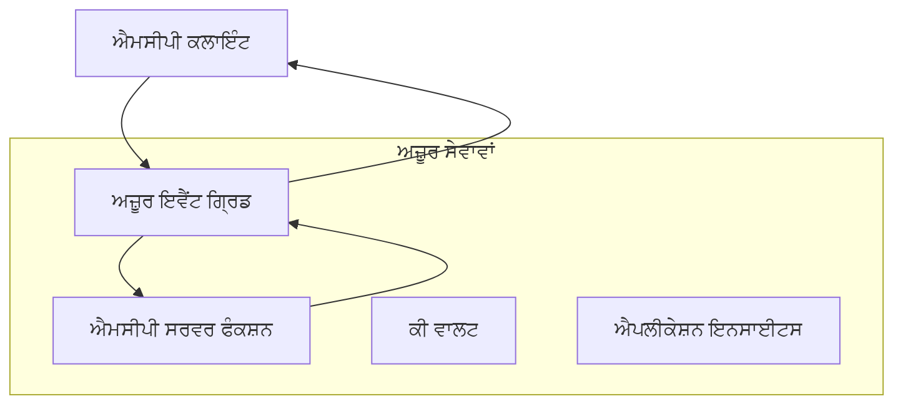
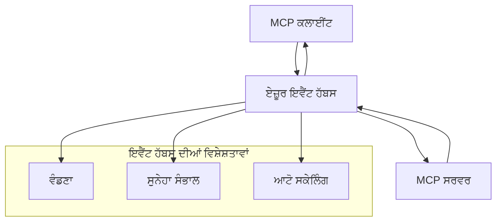

# MCP ਕਸਟਮ ਟਰਾਂਸਪੋਰਟਸ - ਉन्नਤ ਅਮਲਦਾਰੀ ਗਾਈਡ

ਮਾਡਲ ਕਾਂਟੈਕਸਟ ਪ੍ਰੋਟੋਕਾਲ (MCP) ਟਰਾਂਸਪੋਰਟ ਮਕੈਨਿਜ਼ਮਾਂ ਵਿੱਚ ਲਚਕੀਲਾਪਣ ਪ੍ਰਦਾਨ ਕਰਦਾ ਹੈ, ਜੋ ਵਿਸ਼ੇਸ਼ਤ ਐਂਟਰਪ੍ਰਾਈਜ਼ ਵਾਤਾਵਰਨਾਂ ਲਈ ਕਸਟਮ ਅਮਲਦਾਰੀਆਂ ਦੀ ਇਜਾਜ਼ਤ ਦਿੰਦਾ ਹੈ। ਇਹ ਉन्नਤ ਗਾਈਡ ਸਕੇਲੇਬਲ, ਕਲਾਉਡ-ਨੇਟਿਵ MCP ਹੱਲ ਬਣਾਉਣ ਲਈ ਕਾਇਮ ਮੁਦਿਆਂ ਦੇ ਤੌਰ 'ਤੇ ਐਜ਼ਿਊਰ ਈਵੈਂਟ ਗ੍ਰਿਡ ਅਤੇ ਐਜ਼ਿਊਰ ਈਵੈਂਟ ਹਬ ਨੂੰ ਵਰਤਕੇ ਕਸਟਮ ਟਰਾਂਸਪੋਰਟ ਅਮਲਦਾਰੀ ਦੀ ਖੋਜ ਕਰਦੀ ਹੈ।

> **ਅੱਗੇ ਦੇਖਦੇ ਹੋਏ:** ਇਹ ਗਾਈਡ **MCP ਵੇਰਵਾ 2025-11-25** ਅਨੁਸਾਰ ਲਿਖੀ ਗਈ ਹੈ, ਜਿੱਥੇ ਹਰੇਕ ਸੈਸ਼ਨ ਲਈ ਸੈਸ਼ਨ ਦਾ ਹਵਾਲਾ ਕਾਇਮ ਕਰਨਾ ਜ਼ਰੂਰੀ ਹੈ (ਹੇਠਾਂ ਸੁਨੇਹਾ ਪ੍ਰੋਟੋਕਾਲ ਵੇਖੋ)। `2026-07-28` ਰਿਲੀਜ਼ ਕੈਂਡਿਡੇਟ ਪ੍ਰੋਟੋਕਾਲ-ਪੱਧਰੀ ਸੈਸ਼ਨ ਕਾਇਮ ਕਰਨ ਨੂੰ ਪੂਰੀ ਤਰ੍ਹਾਂ ਹਟਾਉਂਦਾ ਹੈ ਅਤੇ `Mcp-Method`/`Mcp-Name` ਹੈਡਰਾਂ ਦੀ ਲੋੜ ਕਰਦਾ ਹੈ ਤਾਂ ਜੋ ਗੇਟਵੇਜ਼ ਅਤੇ ਕਸਟਮ ਟਰਾਂਸਪੋਰਟ ਪ੍ਰਤੀ-ਬਿਨੈ ਦੇ ਅਧਾਰ 'ਤੇ ਰੂਟ ਕਰ ਸਕਣ ਨਾ ਕਿ ਸੈਸ਼ਨ ਦੇ ਅਧਾਰ 'ਤੇ। ਵੇਖੋ [MCP ਵਿੱਚ ਕੀ ਬਦਲ ਰਿਹਾ ਹੈ: 2026-07-28 ਰਿਲੀਜ਼ ਕੈਂਡਿਡੇਟ](../../01-CoreConcepts/mcp-2026-07-28-release-candidate.md).

## ਪਰਿਚਯ

ਜਦ ਕਿ MCP ਦੇ ਸਟੈਂਡਰਡ ਟਰਾਂਸਪੋਰਟ (stdio ਅਤੇ HTTP ਸਟ੍ਰੀਮਿੰਗ) ਜ਼ਿਆਦਾਤਰ ਵਰਤੋਂ ਦੇ ਮਾਮਲੇ ਪੂਰੇ ਕਰਦੇ ਹਨ, ਐਂਟਰਪ੍ਰਾਈਜ਼ ਵਾਤਾਵਰਨਾਂ ਨੂੰ ਅਕਸਰ ਵਧੀਕ ਸਕੇਲ, ਭਰੋਸੇਯੋਗਤਾ, ਅਤੇ ਮੌਜੂਦਾ ਕਲਾਉਡ ਇੰਨਫ੍ਰਾਸਟ੍ਰੱਕਚਰ ਨਾਲ ਇੰਟੀਗ੍ਰੇਸ਼ਨ ਲਈ ਵਿਸ਼ੇਸ਼ ਟਰਾਂਸਪੋਰਟ ਮਕੈਨਿਜ਼ਮ ਦੀ ਲੋੜ ਹੁੰਦੀ ਹੈ। ਕਸਟਮ ਟਰਾਂਸਪੋਰਟ MCP ਨੂੰ ਅਸਿਨਕ੍ਰੋਨਸ ਕਮਿਊਨਿਕੇਸ਼ਨ, ਘਟਨਾ-ਚਲਿਤ ਵਾਸ਼ਤੂ-ਨਿਰਮਾਣ ਅਤੇ ਵੰਡੇ ਪ੍ਰਕਿਰਿਆ ਲਈ ਕਲਾਉਡ-ਨੇਟਿਵ ਸੁਨੇਹਾ ਸੇਵਾਵਾਂ ਦੀ ਵਰਤੋਂ ਕਰਨ ਯੋਗ ਬਣਾਉਂਦੇ ਹਨ।

ਇਹ ਲੈਸਨ ਤਾਜ਼ਾ MCP ਵੇਰਵਾ (2025-11-25), ਐਜ਼ਿਊਰ ਸੁਨੇਹਾ ਸੇਵਾਵਾਂ ਅਤੇ ਸਥਾਪਿਤ ਐਂਟਰਪ੍ਰਾਈਜ਼ ਇੰਟੀਗ੍ਰੇਸ਼ਨ ਪੈਟਰਨਾਂ 'ਤੇ ਆਧਾਰਿਤ ਉन्नਤ ਟਰਾਂਸਪੋਰਟ ਅਮਲਦਾਰੀਆਂ ਦੀ ਖੋਜ ਕਰਦਾ ਹੈ।

### **MCP ਟਰਾਂਸਪੋਰਟ ਆਰਕੀਟੈਕਚਰ**

**MCP ਵੇਰਵਾ (2025-11-25) ਤੋਂ:**

- **ਸਟੈਂਡਰਡ ਟਰਾਂਸਪੋਰਟਸ**: stdio (ਸਿਫਾਰਸ਼ੀ), HTTP ਸਟ੍ਰੀਮਿੰਗ (ਦੂਰੀ ਮਾਮਲਿਆਂ ਲਈ)
- **ਕਸਟਮ ਟਰਾਂਸਪੋਰਟਸ**: ਕੋਈ ਵੀ ਟਰਾਂਸਪੋਰਟ ਜੋ MCP ਸੁਨੇਹਾ ਅਦਲੇ-ਬਦਲੇ ਦੇ ਪ੍ਰੋਟੋਕਾਲ ਨੂੰ ਅਮਲ ਕਰਦਾ ਹੈ
- **ਸੁਨੇਹਾ ਫਾਰਮੈਟ**: JSON-RPC 2.0 ਦੇ ਨਾਲ MCP-ਵਿਸ਼ੇਸ਼ ਵਧਾਵੇ
- **ਦੋ-ਦਿਸ਼ਾ ਸਾਂਝਾ-ਸੰਚਾਰ**: ਸੂਚਨਾ ਅਤੇ ਜਵਾਬਾਂ ਲਈ ਫੁੱਲ ਡੁਪਲੇਕਸ ਸੰਚਾਰ ਲਾਜ਼ਮੀ

## ਸਿੱਖਣ ਦੇ ਉਦੇਸ਼

ਇਸ ਉੱਨਤ ਲੈਸਨ ਦੇ ਅੰਤ ਤੱਕ, ਤੁਸੀਂ ਇਹ ਕਰਨ ਦੇ ਯੋਗ ਹੋਵੋਗੇ:

- **ਕਸਟਮ ਟਰਾਂਸਪੋਰਟ ਦੀਆਂ ਲੋੜਾਂ ਸਮਝੋ**: ਕਿਸੇ ਵੀ ਟਰਾਂਸਪੋਰਟ ਲੇਅਰ 'ਤੇ MCP ਪ੍ਰੋਟੋਕਾਲ ਨੂੰ ਅਮਲ ਕਰਦੇ ਹੋਏ ਦੀ ਪਾਲਣਾ ਕਾਇਮ ਰੱਖੋ
- **ਐਜ਼ਿਊਰ ਈਵੈਂਟ ਗ੍ਰਿਡ ਟਰਾਂਸਪੋਰਟ ਬਣਾਓ**: ਸਰਵਰਲੈੱਸ ਸਕੇਲੇਬਿਲਟੀ ਲਈ ਐਜ਼ਿਊਰ ਈਵੈਂਟ ਗ੍ਰਿਡ ਨਾਲ ਘਟਨਾ-ਚਲਿਤ MCP ਸਰਵਰ ਬਣਾਓ
- **ਐਜ਼ਿਊਰ ਈਵੈਂਟ ਹਬ ਟਰਾਂਸਪੋਰਟ ਅਮਲ ਕਰੋ**: ਅਸਲ ਸਮੇਂ ਸਟ੍ਰੀਮਿੰਗ ਲਈ ਐਜ਼ਿਊਰ ਈਵੈਂਟ ਹਬਸ ਦੀ ਵਰਤੋਂ ਕਰਕੇ ਉੱਚ ਪ੍ਰਵਾਹ ਵਾਲੇ MCP ਹੱਲ ਡਿਜ਼ਾਈਨ ਕਰੋ
- **ਐਂਟਰਪ੍ਰਾਈਜ਼ ਪੈਟਰਨ ਲਾਗੂ ਕਰੋ**: ਮੌਜੂਦਾ ਐਜ਼ਿਊਰ ਇੰਫ੍ਰਾਸਟ੍ਰੱਕਚਰ ਅਤੇ ਸੁਰੱਖਿਆ ਮਾਡਲਾਂ ਨਾਲ ਕਸਟਮ ਟਰਾਂਸਪੋਰਟ ਨੂੰ ਜੋੜੋ
- **ਟਰਾਂਸਪੋਰਟ ਭਰੋਸੇਯੋਗਤਾ ਸੰਭਾਲੋ**: ਐਂਟਰਪ੍ਰਾਈਜ਼ ਮਾਮਲਿਆਂ ਲਈ ਸੁਨੇਹਾ ਟਿਕਾਊਪਣ, ਕ੍ਰਮਬੱਧਤਾ ਅਤੇ ਗਲਤੀ ਸੰਭਾਲ ਅਮਲ ਕਰੋ
- **ਕਾਰਗੁਜ਼ਾਰੀ ਅਪਟਾਈਮਾਈਜ਼ ਕਰੋ**: ਸਕੇਲ, ਦੇਰੀ, ਅਤੇ ਪ੍ਰਵਾਹ ਦੀਆਂ ਲੋੜਾਂ ਮੁਤਾਬਕ ਟਰਾਂਸਪੋਰਟ ਹੱਲਾਂ ਡਿਜ਼ਾਇਨ ਕਰੋ

## **ਟਰਾਂਸਪੋਰਟ ਲੋੜਾਂ**

### **MCP ਵੇਰਵਾ (2025-11-25) ਤੋਂ ਮੁੱਖ ਲੋੜਾਂ:**

```yaml
Message Protocol:
  format: "JSON-RPC 2.0 with MCP extensions"
  bidirectional: "Full duplex communication required"
  ordering: "Message ordering must be preserved per session"
  
Transport Layer:
  reliability: "Transport MUST handle connection failures gracefully"
  security: "Transport MUST support secure communication"
  identification: "Each session MUST have unique identifier"
  
Custom Transport:
  compliance: "MUST implement complete MCP message exchange"
  extensibility: "MAY add transport-specific features"
  interoperability: "MUST maintain protocol compatibility"
```

## **ਐਜ਼ਿਊਰ ਈਵੈਂਟ ਗ੍ਰਿਡ ਟਰਾਂਸਪੋਰਟ ਅਮਲਦਾਰੀ**

ਐਜ਼ਿਊਰ ਈਵੈਂਟ ਗ੍ਰਿਡ ਘਟਨਾ-ਚਲਿਤ MCP ਆਰਕੀਟੈਕਚਰ ਲਈ ਇੱਕ ਸਰਵਰਲੈੱਸ ਘਟਨਾ ਰੂਟਿੰਗ ਸੇਵਾ ਪ੍ਰਦਾਨ ਕਰਦਾ ਹੈ। ਇਹ ਅਮਲਦਾਰੀ ਦਿਖਾਉਂਦੀ ਹੈ ਕਿ ਕਿਵੇਂ ਸਕੇਲੇਬਲ, ਢੀਲੇ-ਜੁੜੇ MCP ਸਿਸਟਮ ਬਣਾਏ ਜਾ ਸਕਦੇ ਹਨ।

### **ਆਰਕੀਟੈਕਚਰ ਝਲਕ**



### **C# ਅਮਲਦਾਰੀ - ਈਵੈਂਟ ਗ੍ਰਿਡ ਟਰਾਂਸਪੋਰਟ**

```csharp
using Azure.Messaging.EventGrid;
using Microsoft.Extensions.Azure;
using System.Text.Json;

public class EventGridMcpTransport : IMcpTransport
{
    private readonly EventGridPublisherClient _publisher;
    private readonly string _topicEndpoint;
    private readonly string _clientId;
    
    public EventGridMcpTransport(string topicEndpoint, string accessKey, string clientId)
    {
        _publisher = new EventGridPublisherClient(
            new Uri(topicEndpoint), 
            new AzureKeyCredential(accessKey));
        _topicEndpoint = topicEndpoint;
        _clientId = clientId;
    }
    
    public async Task SendMessageAsync(McpMessage message)
    {
        var eventGridEvent = new EventGridEvent(
            subject: $"mcp/{_clientId}",
            eventType: "MCP.MessageReceived",
            dataVersion: "1.0",
            data: JsonSerializer.Serialize(message))
        {
            Id = Guid.NewGuid().ToString(),
            EventTime = DateTimeOffset.UtcNow
        };
        
        await _publisher.SendEventAsync(eventGridEvent);
    }
    
    public async Task<McpMessage> ReceiveMessageAsync(CancellationToken cancellationToken)
    {
        // Event Grid is push-based, so implement webhook receiver
        // This would typically be handled by Azure Functions trigger
        throw new NotImplementedException("Use EventGridTrigger in Azure Functions");
    }
}

// Azure Function for receiving Event Grid events
[FunctionName("McpEventGridReceiver")]
public async Task<IActionResult> HandleEventGridMessage(
    [EventGridTrigger] EventGridEvent eventGridEvent,
    ILogger log)
{
    try
    {
        var mcpMessage = JsonSerializer.Deserialize<McpMessage>(
            eventGridEvent.Data.ToString());
        
        // Process MCP message
        var response = await _mcpServer.ProcessMessageAsync(mcpMessage);
        
        // Send response back via Event Grid
        await _transport.SendMessageAsync(response);
        
        return new OkResult();
    }
    catch (Exception ex)
    {
        log.LogError(ex, "Error processing Event Grid MCP message");
        return new BadRequestResult();
    }
}
```

### **TypeScript ਅਮਲਦਾਰੀ - ਈਵੈਂਟ ਗ੍ਰਿਡ ਟਰਾਂਸਪੋਰਟ**

```typescript
import { EventGridPublisherClient, AzureKeyCredential } from "@azure/eventgrid";
import { McpTransport, McpMessage } from "./mcp-types";

export class EventGridMcpTransport implements McpTransport {
    private publisher: EventGridPublisherClient;
    private clientId: string;
    
    constructor(
        private topicEndpoint: string,
        private accessKey: string,
        clientId: string
    ) {
        this.publisher = new EventGridPublisherClient(
            topicEndpoint,
            new AzureKeyCredential(accessKey)
        );
        this.clientId = clientId;
    }
    
    async sendMessage(message: McpMessage): Promise<void> {
        const event = {
            id: crypto.randomUUID(),
            source: `mcp-client-${this.clientId}`,
            type: "MCP.MessageReceived",
            time: new Date(),
            data: message
        };
        
        await this.publisher.sendEvents([event]);
    }
    
    // ਇਹਵੈਂਟ-ਚਾਲਿਤ ਪ੍ਰਾਪਤੀ ਏਜ਼ੂਰ ਫੰਕਸ਼ਨਾਂ ਦੇ ਜ਼ਰੀਏ
    onMessage(handler: (message: McpMessage) => Promise<void>): void {
        // ਲਾਗੂ ਕਰਨਾ ਏਜ਼ੂਰ ਫੰਕਸ਼ਨਾਂ ਇਵੈਂਟ ਗ੍ਰਿਡ ਟ੍ਰਿਗਰ ਦੀ ਵਰਤੋਂ ਕਰੇਗਾ
        // ਇਹ ਵੈੱਬਹੁੱਕ ਪ੍ਰਾਪਤ ਕਰਨ ਵਾਲੇ ਲਈ ਇੱਕ ਧਾਰਣਾਤਮਕ ਇੰਟਰਫੇਸ ਹੈ
    }
}

// ਏਜ਼ੂਰ ਫੰਕਸ਼ਨਾਂ ਲਾਗੂ ਕਰਨ
import { app, InvocationContext, EventGridEvent } from "@azure/functions";

app.eventGrid("mcpEventGridHandler", {
    handler: async (event: EventGridEvent, context: InvocationContext) => {
        try {
            const mcpMessage = event.data as McpMessage;
            
            // MCP ਸੁਨੇਹਾ ਪ੍ਰਕਿਰਿਆ ਕਰੋ
            const response = await mcpServer.processMessage(mcpMessage);
            
            // ਇਵੈਂਟ ਗ੍ਰਿਡ ਰਾਹੀਂ ਜਵਾਬ ਭੇਜੋ
            await transport.sendMessage(response);
            
        } catch (error) {
            context.error("Error processing MCP message:", error);
            throw error;
        }
    }
});
```

### **Python ਅਮਲਦਾਰੀ - ਈਵੈਂਟ ਗ੍ਰਿਡ ਟਰਾਂਸਪੋਰਟ**

```python
from azure.eventgrid import EventGridPublisherClient, EventGridEvent
from azure.core.credentials import AzureKeyCredential
import asyncio
import json
from typing import Callable, Optional
import uuid
from datetime import datetime

class EventGridMcpTransport:
    def __init__(self, topic_endpoint: str, access_key: str, client_id: str):
        self.client = EventGridPublisherClient(
            topic_endpoint, 
            AzureKeyCredential(access_key)
        )
        self.client_id = client_id
        self.message_handler: Optional[Callable] = None
    
    async def send_message(self, message: dict) -> None:
        """Send MCP message via Event Grid"""
        event = EventGridEvent(
            data=message,
            subject=f"mcp/{self.client_id}",
            event_type="MCP.MessageReceived",
            data_version="1.0"
        )
        
        await self.client.send(event)
    
    def on_message(self, handler: Callable[[dict], None]) -> None:
        """Register message handler for incoming events"""
        self.message_handler = handler

# ਐਜ਼ੂਰ ਫੰਕਸ਼ਨਜ਼ ਦੀ ਰਾਹੀਂ ਲਾਗੂ ਕਰਨਾ
import azure.functions as func
import logging

def main(event: func.EventGridEvent) -> None:
    """Azure Functions Event Grid trigger for MCP messages"""
    try:
        # ਇਵੈਂਟ ਗ੍ਰਿਡ ਇਵੈਂਟ ਤੋਂ MCP ਸੁਨੇਹਾ ਪਾਰਸ ਕਰੋ
        mcp_message = json.loads(event.get_body().decode('utf-8'))
        
        # MCP ਸੁਨੇਹਾ ਪ੍ਰਕਿਰਿਆ ਕਰੋ
        response = process_mcp_message(mcp_message)
        
        # ਇਵੈਂਟ ਗ੍ਰਿਡ ਰਾਹੀਂ ਜਵਾਬ ਵਾਪਸ ਭੇਜੋ
        # (ਲਾਗੂ ਕਰਨ ਤੋਂ ਇੱਕ ਨਵਾਂ ਇਵੈਂਟ ਗ੍ਰਿਡ ਕਲਾਇੰਟ ਬਣਾਇਆ ਜਾਵੇਗਾ)
        
    except Exception as e:
        logging.error(f"Error processing MCP Event Grid message: {e}")
        raise
```

## **ਐਜ਼ਿਊਰ ਈਵੈਂਟ ਹਬ ਟਰਾਂਸਪੋਰਟ ਅਮਲਦਾਰੀ**

ਐਜ਼ਿਊਰ ਈਵੈਂਟ ਹਬ MCP ਮਾਮਲਿਆਂ ਲਈ ਜੋ ਘੱਟ ਦੇਰੀ ਅਤੇ ਵੱਡੇ ਸੁਨੇਹਾ ਸਮੱਗਰੀ ਦੀ ਲੋੜ ਹੋਂਦੀ ਹੈ, ਉੱਚ ਪ੍ਰਵਾਹ ਅਤੇ ਅਸਲ ਸਮੇਂ ਸਟ੍ਰੀਮਿੰਗ ਸਮਰੱਥਾ ਪ੍ਰਦਾਨ ਕਰਦਾ ਹੈ।

### **ਆਰਕੀਟੈਕਚਰ ਝਲਕ**



### **C# ਅਮਲਦਾਰੀ - ਈਵੈਂਟ ਹਬ ਟਰਾਂਸਪੋਰਟ**

```csharp
using Azure.Messaging.EventHubs;
using Azure.Messaging.EventHubs.Producer;
using Azure.Messaging.EventHubs.Consumer;
using System.Text;

public class EventHubsMcpTransport : IMcpTransport, IDisposable
{
    private readonly EventHubProducerClient _producer;
    private readonly EventHubConsumerClient _consumer;
    private readonly string _consumerGroup;
    private readonly CancellationTokenSource _cancellationTokenSource;
    
    public EventHubsMcpTransport(
        string connectionString, 
        string eventHubName,
        string consumerGroup = "$Default")
    {
        _producer = new EventHubProducerClient(connectionString, eventHubName);
        _consumer = new EventHubConsumerClient(
            consumerGroup, 
            connectionString, 
            eventHubName);
        _consumerGroup = consumerGroup;
        _cancellationTokenSource = new CancellationTokenSource();
    }
    
    public async Task SendMessageAsync(McpMessage message)
    {
        var messageBody = JsonSerializer.Serialize(message);
        var eventData = new EventData(Encoding.UTF8.GetBytes(messageBody));
        
        // Add MCP-specific properties
        eventData.Properties.Add("MessageType", message.Method ?? "response");
        eventData.Properties.Add("MessageId", message.Id);
        eventData.Properties.Add("Timestamp", DateTimeOffset.UtcNow);
        
        await _producer.SendAsync(new[] { eventData });
    }
    
    public async Task StartReceivingAsync(
        Func<McpMessage, Task> messageHandler)
    {
        await foreach (PartitionEvent partitionEvent in _consumer.ReadEventsAsync(
            _cancellationTokenSource.Token))
        {
            try
            {
                var messageBody = Encoding.UTF8.GetString(
                    partitionEvent.Data.EventBody.ToArray());
                var mcpMessage = JsonSerializer.Deserialize<McpMessage>(messageBody);
                
                await messageHandler(mcpMessage);
            }
            catch (Exception ex)
            {
                // Handle deserialization or processing errors
                Console.WriteLine($"Error processing message: {ex.Message}");
            }
        }
    }
    
    public void Dispose()
    {
        _cancellationTokenSource?.Cancel();
        _producer?.DisposeAsync().AsTask().Wait();
        _consumer?.DisposeAsync().AsTask().Wait();
        _cancellationTokenSource?.Dispose();
    }
}
```

### **TypeScript ਅਮਲਦਾਰੀ - ਈਵੈਂਟ ਹਬ ਟਰਾਂਸਪੋਰਟ**

```typescript
import { 
    EventHubProducerClient, 
    EventHubConsumerClient, 
    EventData 
} from "@azure/event-hubs";

export class EventHubsMcpTransport implements McpTransport {
    private producer: EventHubProducerClient;
    private consumer: EventHubConsumerClient;
    private isReceiving = false;
    
    constructor(
        private connectionString: string,
        private eventHubName: string,
        private consumerGroup: string = "$Default"
    ) {
        this.producer = new EventHubProducerClient(
            connectionString, 
            eventHubName
        );
        this.consumer = new EventHubConsumerClient(
            consumerGroup,
            connectionString,
            eventHubName
        );
    }
    
    async sendMessage(message: McpMessage): Promise<void> {
        const eventData: EventData = {
            body: JSON.stringify(message),
            properties: {
                messageType: message.method || "response",
                messageId: message.id,
                timestamp: new Date().toISOString()
            }
        };
        
        await this.producer.sendBatch([eventData]);
    }
    
    async startReceiving(
        messageHandler: (message: McpMessage) => Promise<void>
    ): Promise<void> {
        if (this.isReceiving) return;
        
        this.isReceiving = true;
        
        const subscription = this.consumer.subscribe({
            processEvents: async (events, context) => {
                for (const event of events) {
                    try {
                        const messageBody = event.body as string;
                        const mcpMessage: McpMessage = JSON.parse(messageBody);
                        
                        await messageHandler(mcpMessage);
                        
                        // ਘੱਟੋ-ਘੱਟ ਇੱਕ ਵਾਰੀ ਡਿਲੀਵਰੀ ਲਈ ਚੈਕਪੌਇੰਟ ਅੱਪਡੇਟ ਕਰੋ
                        await context.updateCheckpoint(event);
                    } catch (error) {
                        console.error("Error processing Event Hubs message:", error);
                    }
                }
            },
            processError: async (err, context) => {
                console.error("Event Hubs error:", err);
            }
        });
    }
    
    async close(): Promise<void> {
        this.isReceiving = false;
        await this.producer.close();
        await this.consumer.close();
    }
}
```

### **Python ਅਮਲਦਾਰੀ - ਈਵੈਂਟ ਹਬ ਟਰਾਂਸਪੋਰਟ**

```python
from azure.eventhub import EventHubProducerClient, EventHubConsumerClient
from azure.eventhub import EventData
import json
import asyncio
from typing import Callable, Dict, Any
import logging

class EventHubsMcpTransport:
    def __init__(
        self, 
        connection_string: str, 
        eventhub_name: str,
        consumer_group: str = "$Default"
    ):
        self.producer = EventHubProducerClient.from_connection_string(
            connection_string, 
            eventhub_name=eventhub_name
        )
        self.consumer = EventHubConsumerClient.from_connection_string(
            connection_string,
            consumer_group=consumer_group,
            eventhub_name=eventhub_name
        )
        self.is_receiving = False
    
    async def send_message(self, message: Dict[str, Any]) -> None:
        """Send MCP message via Event Hubs"""
        event_data = EventData(json.dumps(message))
        
        # MCP-ਖਾਸ ਗੁਣ ਸ਼ਾਮਲ ਕਰੋ
        event_data.properties = {
            "messageType": message.get("method", "response"),
            "messageId": message.get("id"),
            "timestamp": "2025-01-14T10:30:00Z"  # ਅਸਲ ਟਾਈਮਸਟੈਂਪ ਦੀ ਵਰਤੋਂ ਕਰੋ
        }
        
        async with self.producer:
            event_data_batch = await self.producer.create_batch()
            event_data_batch.add(event_data)
            await self.producer.send_batch(event_data_batch)
    
    async def start_receiving(
        self, 
        message_handler: Callable[[Dict[str, Any]], None]
    ) -> None:
        """Start receiving MCP messages from Event Hubs"""
        if self.is_receiving:
            return
        
        self.is_receiving = True
        
        async with self.consumer:
            await self.consumer.receive(
                on_event=self._on_event_received(message_handler),
                starting_position="-1"  # ਸ਼ੁਰੂਆਤ ਤੋਂ ਸ਼ੁਰੂ ਕਰੋ
            )
    
    def _on_event_received(self, handler: Callable):
        """Internal event handler wrapper"""
        async def handle_event(partition_context, event):
            try:
                # Event Hubs ਇਵੈਂਟ ਤੋਂ MCP ਸੁਨੇਹਾ ਪਾਰਸ ਕਰੋ
                message_body = event.body_as_str(encoding='UTF-8')
                mcp_message = json.loads(message_body)
                
                # MCP ਸੁਨੇਹਾ ਪ੍ਰਕਿਰਿਆ ਕਰੋ
                await handler(mcp_message)
                
                # ਘੱਟੋ-ਘੱਟ ਇੱਕ ਵਾਰੀ ਡਿਲਿਵਰੀ ਲਈ ਚੈਕਪੌਇੰਟ ਅਪਡੇਟ ਕਰੋ
                await partition_context.update_checkpoint(event)
                
            except Exception as e:
                logging.error(f"Error processing Event Hubs message: {e}")
        
        return handle_event
    
    async def close(self) -> None:
        """Clean up transport resources"""
        self.is_receiving = False
        await self.producer.close()
        await self.consumer.close()
```

## **ਉੱਚ ਪੱਧਰੀ ਟਰਾਂਸਪੋਰਟ ਪੈਟਰਨ**

### **ਸੁਨੇਹਾ ਟਿਕਾਊਪਣ ਅਤੇ ਭਰੋਸੇਯੋਗਤਾ**

```csharp
// Implementing message durability with retry logic
public class ReliableTransportWrapper : IMcpTransport
{
    private readonly IMcpTransport _innerTransport;
    private readonly RetryPolicy _retryPolicy;
    
    public async Task SendMessageAsync(McpMessage message)
    {
        await _retryPolicy.ExecuteAsync(async () =>
        {
            try
            {
                await _innerTransport.SendMessageAsync(message);
            }
            catch (TransportException ex) when (ex.IsRetryable)
            {
                // Log and retry
                throw;
            }
        });
    }
}
```

### **ਟਰਾਂਸਪੋਰਟ ਸੁਰੱਖਿਆ ਇੰਟੀਗ੍ਰੇਸ਼ਨ**

```csharp
// Integrating Azure Key Vault for transport security
public class SecureTransportFactory
{
    private readonly SecretClient _keyVaultClient;
    
    public async Task<IMcpTransport> CreateEventGridTransportAsync()
    {
        var accessKey = await _keyVaultClient.GetSecretAsync("EventGridAccessKey");
        var topicEndpoint = await _keyVaultClient.GetSecretAsync("EventGridTopic");
        
        return new EventGridMcpTransport(
            topicEndpoint.Value.Value,
            accessKey.Value.Value,
            Environment.MachineName
        );
    }
}
```

### **ਟਰਾਂਸਪੋਰਟ ਨਿਗਰਾਨੀ ਅਤੇ ਦੇਖ-ਭਾਲ**

```csharp
// Adding telemetry to custom transports
public class ObservableTransport : IMcpTransport
{
    private readonly IMcpTransport _transport;
    private readonly ILogger _logger;
    private readonly TelemetryClient _telemetryClient;
    
    public async Task SendMessageAsync(McpMessage message)
    {
        using var activity = Activity.StartActivity("MCP.Transport.Send");
        activity?.SetTag("transport.type", "EventGrid");
        activity?.SetTag("message.method", message.Method);
        
        var stopwatch = Stopwatch.StartNew();
        
        try
        {
            await _transport.SendMessageAsync(message);
            
            _telemetryClient.TrackDependency(
                "EventGrid",
                "SendMessage",
                DateTime.UtcNow.Subtract(stopwatch.Elapsed),
                stopwatch.Elapsed,
                true
            );
        }
        catch (Exception ex)
        {
            _telemetryClient.TrackException(ex);
            throw;
        }
    }
}
```

## **ਐਂਟਰਪ੍ਰਾਈਜ਼ ਇੰਟੀਗ੍ਰੇਸ਼ਨ ਮਾਮਲੇ**

### **ਮਾਮਲਾ 1: ਵੰਡਿਆ MCP ਪ੍ਰੋਸੈਸਿੰਗ**

ਐਜ਼ਿਊਰ ਈਵੈਂਟ ਗ੍ਰਿਡ ਦੀ ਵਰਤੋਂ ਕਰਕੇ MCP ਬਿਨੈਅਾਂ ਨੂੰ ਕਈ ਪ੍ਰੋਸੈਸਿੰਗ ਨੋਡਾਂ ਵਿੱਚ ਵੰਡਣਾ:

```yaml
Architecture:
  - MCP Client sends requests to Event Grid topic
  - Multiple Azure Functions subscribe to process different tool types
  - Results aggregated and returned via separate response topic
  
Benefits:
  - Horizontal scaling based on message volume
  - Fault tolerance through redundant processors
  - Cost optimization with serverless compute
```

### **ਮਾਮਲਾ 2: ਅਸਲ-ਸਮੇਂ MCP ਸਟ੍ਰੀਮਿੰਗ**

ਉੱਚ-ਆਵ੍ਰਿਤੀ ਵਾਲੇ MCP ਸੰਚਾਰ ਲਈ ਐਜ਼ਿਊਰ ਈਵੈਂਟ ਹਬਸ ਦੀ ਵਰਤੋਂ:

```yaml
Architecture:
  - MCP Client streams continuous requests via Event Hubs
  - Stream Analytics processes and routes messages
  - Multiple consumers handle different aspect of processing
  
Benefits:
  - Low latency for real-time scenarios
  - High throughput for batch processing
  - Built-in partitioning for parallel processing
```

### **ਮਾਮਲਾ 3: ਹਾਈਬ੍ਰਿਡ ਟਰਾਂਸਪੋਰਟ ਆਰਕੀਟੈਕਚਰ**

ਵੱਖ-ਵੱਖ ਮਾਮਲਿਆਂ ਲਈ ਕਈ ਟਰਾਂਸਪੋਰਟਸ ਨੂੰ ਮਿਲਾਉਣਾ:

```csharp
public class HybridMcpTransport : IMcpTransport
{
    private readonly IMcpTransport _realtimeTransport; // Event Hubs
    private readonly IMcpTransport _batchTransport;    // Event Grid
    private readonly IMcpTransport _fallbackTransport; // HTTP Streaming
    
    public async Task SendMessageAsync(McpMessage message)
    {
        // Route based on message characteristics
        var transport = message.Method switch
        {
            "tools/call" when IsRealtime(message) => _realtimeTransport,
            "resources/read" when IsBatch(message) => _batchTransport,
            _ => _fallbackTransport
        };
        
        await transport.SendMessageAsync(message);
    }
}
```

## **ਕਾਰਗੁਜ਼ਾਰੀ ਅਪਟਾਈਮਾਈਜ਼ੇਸ਼ਨ**

### **ਈਵੈਂਟ ਗ੍ਰਿਡ ਲਈ ਸੁਨੇਹਾ ਬੈਚਿੰਗ**

```csharp
public class BatchingEventGridTransport : IMcpTransport
{
    private readonly List<McpMessage> _messageBuffer = new();
    private readonly Timer _flushTimer;
    private const int MaxBatchSize = 100;
    
    public async Task SendMessageAsync(McpMessage message)
    {
        lock (_messageBuffer)
        {
            _messageBuffer.Add(message);
            
            if (_messageBuffer.Count >= MaxBatchSize)
            {
                _ = Task.Run(FlushMessages);
            }
        }
    }
    
    private async Task FlushMessages()
    {
        List<McpMessage> toSend;
        lock (_messageBuffer)
        {
            toSend = new List<McpMessage>(_messageBuffer);
            _messageBuffer.Clear();
        }
        
        if (toSend.Any())
        {
            var events = toSend.Select(CreateEventGridEvent);
            await _publisher.SendEventsAsync(events);
        }
    }
}
```

### **ਈਵੈਂਟ ਹਬਸ ਲਈ ਭਾਗੀਦਾਰੀ ਹਿਊਣ ਪਰੀਖਿਆ**

```csharp
public class PartitionedEventHubsTransport : IMcpTransport
{
    public async Task SendMessageAsync(McpMessage message)
    {
        // Partition by client ID for session affinity
        var partitionKey = ExtractClientId(message);
        
        var eventData = new EventData(JsonSerializer.SerializeToUtf8Bytes(message))
        {
            PartitionKey = partitionKey
        };
        
        await _producer.SendAsync(new[] { eventData });
    }
}
```

## **ਕਸਟਮ ਟਰਾਂਸਪੋਰਟ ਦੀ ਜਾਂਚ**

### **ਟੈਸਟ ਡਬਲਸ ਨਾਲ ਯੂਨਿਟ ਟੈਸਟਿੰਗ**

```csharp
[Test]
public async Task EventGridTransport_SendMessage_PublishesCorrectEvent()
{
    // Arrange
    var mockPublisher = new Mock<EventGridPublisherClient>();
    var transport = new EventGridMcpTransport(mockPublisher.Object);
    var message = new McpMessage { Method = "tools/list", Id = "test-123" };
    
    // Act
    await transport.SendMessageAsync(message);
    
    // Assert
    mockPublisher.Verify(
        x => x.SendEventAsync(
            It.Is<EventGridEvent>(e => 
                e.EventType == "MCP.MessageReceived" &&
                e.Subject == "mcp/test-client"
            )
        ),
        Times.Once
    );
}
```

### **ਐਜ਼ਿਊਰ ਟੈਸਟ ਕੰਟੇਨਰਾਂ ਨਾਲ ਇੰਟੀਗ੍ਰੇਸ਼ਨ ਟੈਸਟਿੰਗ**

```csharp
[Test]
public async Task EventHubsTransport_IntegrationTest()
{
    // Using Testcontainers for integration testing
    var eventHubsContainer = new EventHubsContainer()
        .WithEventHub("test-hub");
    
    await eventHubsContainer.StartAsync();
    
    var transport = new EventHubsMcpTransport(
        eventHubsContainer.GetConnectionString(),
        "test-hub"
    );
    
    // Test message round-trip
    var sentMessage = new McpMessage { Method = "test", Id = "123" };
    McpMessage receivedMessage = null;
    
    await transport.StartReceivingAsync(msg => {
        receivedMessage = msg;
        return Task.CompletedTask;
    });
    
    await transport.SendMessageAsync(sentMessage);
    await Task.Delay(1000); // Allow for message processing
    
    Assert.That(receivedMessage?.Id, Is.EqualTo("123"));
}
```

## **ਸਰਬੋਤਮ ਅਭਿਆਸ ਅਤੇ ਦਿਸ਼ਾ-ਨਿਰਦੇਸ਼**

### **ਟਰਾਂਸਪੋਰਟ ਡਿਜ਼ਾਇਨ ਸਿਧਾਂਤ**

1. **ਆਇਡੈਂਟੋਮਪੈਂਸੀ**: ਨਕਲ ਦੁਹਰਾਈਆਂ ਨੂੰ ਹਥਿਆਉਣ ਲਈ ਸੁਨੇਹਾ ਪ੍ਰਕਿਰਿਆ ਨੂੰ ਆਇਡੈਂਟੋਮਟਿਕ ਬਣਾਉਣਾ
2. **ਗਲਤੀ ਸੰਭਾਲ**: ਵਿਸਤ੍ਰਿਤ ਗਲਤੀ ਸੰਭਾਲ ਅਤੇ ਡੈੱਡ ਲੈਟਰ ਕਿਊਜ਼ ਅਮਲ ਕਰੋ
3. **ਨੀਗਰਾਨੀ**: ਵਿਸਤ੍ਰਿਤ ਟੈਲੀਮੇਟਰੀ ਅਤੇ ਸਿਹਤ ਜਾਂਚਾਂ ਸ਼ਾਮਲ ਕਰੋ
4. **ਸੁਰੱਖਿਆ**: ਪ੍ਰਬੰਧਿਤ ਪਹਿਚਾਨ ਅਤੇ ਘੱਟ ਤੋਂ ਘੱਟ ਅਧਿਕਾਰ ਐਕਸੈੱਸ ਵਰਤੋਂ
5. **ਕਾਰਗੁਜ਼ਾਰੀ**: ਆਪਣੀਆਂ ਵਿਸ਼ੇਸ਼ ਦੇਰੀ ਅਤੇ ਪ੍ਰਵਾਹ ਲੋੜਾਂ ਲਈ ਡਿਜ਼ਾਇਨ ਕਰੋ

### **ਐਜ਼ਿਊਰ-ਵਿਸ਼ੇਸ਼ ਸਿਫਾਰਸ਼ਾਂ**

1. **ਪਰਬੰਧਿਤ ਪਹਿਚਾਨ ਵਰਤੋਂ**: ਪ੍ਰੋਡਕਸ਼ਨ ਵਿੱਚ ਕਨੈਕਸ਼ਨ ਸਟਰਿੰਗਸ ਤੋਂ ਬਚੋ
2. **ਸਰਕਿਟ ਬ੍ਰੇਕਰਾਂ ਲਾਗੂ ਕਰੋ**: ਐਜ਼ਿਊਰ ਸੇਵਾ ਬੰਦਸ਼ਾਂ ਤੋਂ ਬਚਾਅ ਕਰੋ
3. **ਖਰਚਾ ਨਿਗਰਾਨੀ ਕਰੋ**: ਸੁਨੇਹਾ ਮਾਤਰਾ ਅਤੇ ਪ੍ਰਕਿਰਿਆ ਖਰਚੇ ਟਰੈਕ ਕਰੋ
4. **ਸਕੇਲ ਲਈ ਯੋਜਨਾ ਬਣਾਓ**: ਭਾਗੀਦਾਰੀ ਅਤੇ ਸਕੇਲਿੰਗ ਦੀਆਂ ਯੋਜਨਾਵਾਂ ਜਲਦੀ ਤਿਆਰ ਕਰੋ
5. **ਪੂਰੀ ਤਰ੍ਹਾਂ ਟੈਸਟ ਕਰੋ**: ਐਜ਼ਿਊਰ ਡੈਵਟੈਸਟ ਲੈਬਜ਼ ਨਾਲ ਵਿਸਤ੍ਰਿਤ ਟੈਸਟਿੰਗ ਕਰੋ

## **ਨਤੀਜਾ**

ਕਸਟਮ MCP ਟਰਾਂਸਪੋਰਟਸ ਐਜ਼ਿਊਰ ਦੀਆਂ ਸੁਨੇਹਾ ਸੇਵਾਵਾਂ ਦੀ ਵਰਤੋਂ ਕਰਕੇ ਸ਼ਕਤੀਸ਼ਾਲੀ ਐਂਟਰਪ੍ਰਾਈਜ਼ ਮਾਮਲਿਆਂ ਨੂੰ ਸੰਭਾਵਿਤ ਕਰਦੇ ਹਨ। ਈਵੈਂਟ ਗ੍ਰਿਡ ਜਾਂ ਈਵੈਂਟ ਹਬ ਟਰਾਂਸਪੋਰਟਸ ਨੂੰ ਅਮਲ ਕਰਕੇ, ਤੁਸੀਂ ਸਕੇਲੇਬਲ, ਭਰੋਸੇਯੋਗ MCP ਹੱਲਾਂ ਤਿਆਰ ਕਰ ਸਕਦੇ ਹੋ ਜੋ ਮੌਜੂਦਾ ਐਜ਼ਿਊਰ ਇੰਫਰਾਸਟ੍ਰੱਕਚਰ ਨਾਲ ਨਿਰੰਤਰ ਜੋੜੇ ਹੋਏ ਹੋਵਣ।

ਦਿੱਤੇ ਉਦਾਹਰਣ ਅਤੇ ਖ਼ਾਕੇ ਕੰਮ ਕਰਨ ਵਾਲੇ ਪੈਟਰਨਾਂ ਨੂੰ ਦਰਸਾਉਂਦੇ ਹਨ ਜੋ ਕਸਟਮ ਟਰਾਂਸਪੋਰਟਸ ਨੂੰ MCP ਪ੍ਰੋਟੋਕਾਲ ਦੀ ਪਾਲਣਾ ਅਤੇ ਐਜ਼ਿਊਰ ਦੇ ਸਰਬੋਤਮ ਅਭਿਆਸ ਦਿਆਂ ਨਾਲ ਪੂਰਾ ਕਰਨ ਲਈ ਬਣਾਏ ਗਏ ਹਨ।

## **ਵਧੀਕ ਸਰੋਤ**

- [MCP ਵੇਰਵਾ 2025-11-25](https://modelcontextprotocol.io/specification/2025-11-25/)
- [ਐਜ਼ਿਊਰ ਈਵੈਂਟ ਗ੍ਰਿਡ ਦਸਤਾਵੇਜ਼](https://docs.microsoft.com/azure/event-grid/)
- [ਐਜ਼ਿਊਰ ਈਵੈਂਟ ਹਬ ਦਸਤਾਵੇਜ਼](https://docs.microsoft.com/azure/event-hubs/)
- [ਐਜ਼ਿਊਰ ਫੰਕਸ਼ਨਜ਼ ਈਵੈਂਟ ਗ੍ਰਿਡ ਟ੍ਰਿਗਰ](https://docs.microsoft.com/azure/azure-functions/functions-bindings-event-grid)
- [ਐਜ਼ਿਊਰ SDK ਫੋਰ .NET](https://github.com/Azure/azure-sdk-for-net)
- [ਐਜ਼ਿਊਰ SDK ਫੋਰ TypeScript](https://github.com/Azure/azure-sdk-for-js)
- [ਐਜ਼ਿਊਰ SDK ਫੋਰ Python](https://github.com/Azure/azure-sdk-for-python)

---

> *ਇਹ ਗਾਈਡ ਉਤਪਾਦਨਮਕ MCP ਸਿਸਟਮਾਂ ਲਈ ਵਿਹਾਰਕ ਅਮਲਦਾਰੀ ਪੈਟਰਨਾਂ 'ਤੇ ਧਿਆਨ ਕੇਂਦ੍ਰਤ ਕਰਦੀ ਹੈ। ਹਮੇਸ਼ਾ ਆਪਣੇ ਵਿਸ਼ੇਸ਼ ਲੋੜਾਂ ਅਤੇ ਐਜ਼ਿਊਰ ਸੇਵਾ ਸੀਮਾਵਾਂ ਦੇ ਅਨੁਸਾਰ ਟਰਾਂਸਪੋਰਟ ਅਮਲਦਾਰੀਆਂ ਦੀ ਪੁਸ਼ਟੀ ਕਰੋ।*
> **ਮੌਜੂਦਾ ਸਟੈਂਡਰਡ**: ਇਹ ਗਾਈਡ [MCP ਵੇਰਵਾ 2025-11-25](https://modelcontextprotocol.io/specification/2025-11-25/) ਟਰਾਂਸਪੋਰਟ ਲੋੜਾਂ ਅਤੇ ਉੰਨਤ ਟਰਾਂਸਪੋਰਟ ਪੈਟਰਨਾਂ ਨੂੰ ਪ੍ਰਗਟ ਕਰਦੀ ਹੈ ਜੋ ਐਂਟਰਪ੍ਰਾਈਜ਼ ਵਾਤਾਵਰਨਾਂ ਲਈ ਹੈ।


## ਅਗਲਾ ਕੀ ਹੈ
- [6. ਕਮਿਊਨਿਟੀ ਯੋਗਦਾਨ](../../06-CommunityContributions/README.md)

---

<!-- CO-OP TRANSLATOR DISCLAIMER START -->
**ਅਸਵੀਕਾਰੋਪਣ**:
ਇਸ ਦਸਤਾਵੇਜ਼ ਦਾ ਅਨੁਵਾਦ ਏਆਈ ਅਨੁਵਾਦ ਸੇਵਾ [Co-op Translator](https://github.com/Azure/co-op-translator) ਦੀ ਵਰਤੋਂ ਕਰਕੇ ਕੀਤਾ ਗਿਆ ਹੈ। ਜਦੋਂ ਕਿ ਅਸੀਂ ਸਹੀਤਾਵਾਂ ਲਈ ਯਤਨਸ਼ੀਲ ਹਾਂ, ਕਿਰਪਾ ਕਰਕੇ ਧਿਆਨ ਰੱਖੋ ਕਿ ਸਵੈਚਾਲਿਤ ਅਨੁਵਾਦਾਂ ਵਿੱਚ ਗਲਤੀਆਂ ਜਾਂ ਅਸਮੱਤਿਆਵਾਂ ਹੋ ਸਕਦੀਆਂ ਹਨ। ਮੂਲ ਦਸਤਾਵੇਜ਼ ਆਪਣੀ ਮੂਲ ਭਾਸ਼ਾ ਵਿੱਚ ਅਧਿਕਾਰਕ ਸਰੋਤ ਮੰਨਿਆ ਜਾਣਾ ਚਾਹੀਦਾ ਹੈ। ਜਰੂਰੀ ਜਾਣਕਾਰੀ ਲਈ, ਪੇਸ਼ੇਵਰ ਮਨੁੱਖੀ ਅਨੁਵਾਦ ਦੀ ਸਿਫ਼ਾਰਸ਼ ਕੀਤੀ ਜਾਂਦੀ ਹੈ। ਅਸੀਂ ਇਸ ਅਨੁਵਾਦ ਦੇ ਉਪਯੋਗ ਤੋਂ ਪੈਦਾ ਹੋਣ ਵਾਲੀਆਂ ਕਿਸੇ ਵੀ ਗਲਤਫਹਿਮੀਆਂ ਜਾਂ ਗਲਤ ਵਿਆਖਿਆਵਾਂ ਲਈ ਜਵਾਬਦੇਹ ਨਹੀਂ ਹਾਂ।
<!-- CO-OP TRANSLATOR DISCLAIMER END -->