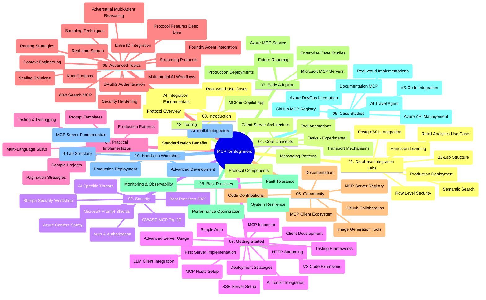

# ਬਿਗਿਨਰਜ਼ ਲਈ ਮਾਡਲ ਰਾਹਤ ਪ੍ਰੋਟੋਕੋਲ (MCP) - ਅਧਿਐਨ ਮਾਰਗਦਰਸ਼ਨ

ਇਹ ਅਧਿਐਨ ਮਾਰਗਦਰਸ਼ਨ "ਬਿਗਿਨਰਜ਼ ਲਈ ਮਾਡਲ ਰਾਹਤ ਪ੍ਰੋਟੋਕੋਲ (MCP)" ਕੋਰਸ ਲਈ ਰਿਪੋਜ਼ਟਰੀ ਦੀ ਢਾਂਚਾ ਅਤੇ ਸਮੱਗਰੀ ਦਾ ਇੱਕ ਝਲਕ ਪ੍ਰਦਾਨ ਕਰਦਾ ਹੈ। ਇਸ ਮਾਰਗਦਰਸ਼ਨ ਦੀ ਵਰਤੋਂ ਰਿਪੋਜ਼ਟਰੀ ਨੂੰ ਦੱਖਣ ਕਾਬੂ ਤੋਂ ਨਾਲ ਪ੍ਰਭਾਵਸ਼ਾਲੀ ਤਰੀਕੇ ਨਾਲ ਸਮਝਣ ਅਤੇ ਉਪਲਬਧ ਸਰੋਤਾਂ ਦਾ ਚੰਗਾ ਲਾਭ ਲੈਣ ਲਈ ਕਰੋ।

## ਰਿਪੋਜ਼ਟਰੀ ਦਾ ਸਾਰ

ਮਾਡਲ ਰਾਹਤ ਪ੍ਰੋਟੋਕੋਲ (MCP) ਏਆਈ ਮਾਡਲਾਂ ਅਤੇ ਕਲਾਇੰਟ ਐਪਲੀਕੇਸ਼ਨਾਂ ਦੇ ਵਿਚਕਾਰ ਇੰਟਰਐਕਸ਼ਨਾਂ ਲਈ ਇੱਕ ਮਿਆਰੀ ਢਾਂਚਾ ਹੈ। ਸ਼ੁਰੂਆਤੀ ਤੌਰ 'ਤੇ Anthropic ਵੱਲੋਂ ਬਣਾਇਆ ਗਿਆ, MCP ਹੁਣ MCP ਦੀ ਵਰਤੋਂਕਰਤਾ ਸਮੁਦਾਇ ਵੱਲੋਂ ਔਫੀਸ਼ਲ GitHub ਸੰਗਠਨ ਦੇ ਜ਼ਰੀਏ ਸੰਭਾਲਿਆ ਜਾਂਦਾ ਹੈ। ਇਹ ਰਿਪੋਜ਼ਟਰੀ C#, Java, JavaScript, Python, ਅਤੇ TypeScript ਵਿੱਚ ਹੱਥ-ਅੰਦਰੂਨੀ ਕੋਡ ਉਦਾਹਰਣਾਂ ਦੇ ਨਾਲ ਇੱਕ ਵਿਸਤ੍ਰਿਤ ਪਾਠਕ੍ਰਮ ਪ੍ਰਦਾਨ ਕਰਦਾ ਹੈ, ਜੋ ਏਆਈ ਡਿਵੈਲਪਰਾਂ, ਸਿਸਟਮ ਆਰਕੀਟੈਕਟਾਂ, ਅਤੇ ਸਾਫਟਵੇਅਰ ਇੰਜੀਨੀਅਰਾਂ ਲਈ ਤਿਆਰ ਕੀਤਾ ਗਿਆ ਹੈ।

## ਵਿਜ਼ੂਅਲ ਪਾਠਕ੍ਰਮ ਨਕਸ਼ਾ

## ਰਿਪੋਜ਼ਟਰੀ ਦੀ ਰਚਨਾ

ਰਿਪੋਜ਼ਟਰੀ ਬਾਰਾਂ ਮੁੱਖ ਹਿੱਸਿਆਂ ਵਿੱਚ ਵੰਡਿਆ ਗਿਆ ਹੈ, ਜਿਨ੍ਹਾਂ ਵਿੱਚ ਹਰ ਇੱਕ MCP ਦੇ ਵੱਖ-ਵੱਖ ਪਹਲੂਆਂ 'ਤੇ ਧਿਆਨ ਕੇਂਦਰਿਤ ਕਰਦਾ ਹੈ:

1. **ਪਰਿਚਯ (00-Introduction/)**
   - ਮਾਡਲ ਰਾਹਤ ਪ੍ਰੋਟੋਕੋਲ ਦਾ ਝਲਕ
   - ਏਆਈ ਪਾਈਪਲਾਈਨਾਂ ਵਿੱਚ ਮਿਆਰੀਕরণ ਜਰੂਰੀ ਕਿਉਂ ਹੈ
   - ਵਿਹਾਰਕ ਵਪਰੇ ਅਤੇ ਲਾਭ

2. **ਮੁੱਖ ਧਾਰਣਾਵਾਂ (01-CoreConcepts/)**
   - ਕਲਾਇੰਟ-ਸਰਵਰ ਵਾਸ਼ਤੁਕਲਾ
   - ਪ੍ਰੋਟੋਕੋਲ ਦੇ ਮੁੱਖ ਹਿੱਸੇ
   - MCP ਵਿੱਚ ਸੰਦੇਸ਼ ਪੈਟਰਨ
   - ਭਵਿੱਖ ਦੀ ਦਿਸ਼ਾ: [MCP ਵਿੱਚ ਕੀ ਬਦਲ ਰਿਹਾ ਹੈ: 2026-07-28 ਰੀਲੀਜ਼ ਕੈਂਡੀਡੇਟ](./01-CoreConcepts/mcp-2026-07-28-release-candidate.md) — ਸਟੇਟਲੈੱਸ ਪ੍ਰੋਟੋਕੋਲ ਕੋਰ, ਐਕਸਟੈਂਸ਼ਨ ਫਰੇਮਵਰਕ, ਅਤੇ ਅਗਲੀ ਵਿਸ਼ੇਸ਼ਤਾ ਵਰਜਨ ਵਿੱਚ Roots/Sampling/Logging ਦੀਆਂ ਡੀਪ੍ਰਿਕੇਸ਼ਨਾਂ

3. **ਸੁਰੱਖਿਆ (02-Security/)**
   - MCP-ਅਧਾਰਿਤ ਪ੍ਰਣਾਲੀਆਂ ਵਿੱਚ ਸੁਰੱਖਿਆ ਖ਼ਤਰੇ
   - ਲਾਗੂ ਕਰਨ ਲਈ ਸਭ ਤੋਂ ਵਧੀਆ ਅਭਿਆਸ
   - ਪ੍ਰਮਾਣਿਕਤਾ ਅਤੇ ਅਧਿਕਾਰਣ ਤਕਨੀਕਾਂ
   - **ਵਿਸਤ੍ਰਿਤ ਸੁਰੱਖਿਆ ਦਸਤਾਵੇਜ਼ਾਂ**:
     - MCP ਸੁਰੱਖਿਆ ਲਾਭਕਾਰੀ ਅਭਿਆਸ 2025
     - Azure ਸਮੱਗਰੀ ਸੁਰੱਖਿਆ ਲਾਗੂ ਕਰਨ ਦੀ ਗਾਈਡ
     - MCP ਸੁਰੱਖਿਆ ਕੰਟਰੋਲ ਅਤੇ ਤਕਨੀਕਾਂ
     - MCP ਲਾਭਕਾਰੀ ਅਭਿਆਸ ਤੇਜ਼ ਸੰਦੇਸ਼
   - **ਮੁੱਖ ਸੁਰੱਖਿਆ ਵਿਸ਼ੇ**:
     - ਪ੍ਰਾਂਪਟ ਇੰਜੈਕਸ਼ਨ ਅਤੇ ਟੂਲ ਵਿਸ਼ਾਕਤ ਹਮਲਿਆਂ
     - ਸੈਸ਼ਨ ਪਰਾਰੰਭ ਅਤੇ ਕੁਝ ਹੋਰ ਸਮੱਸਿਆਵਾਂ
     - ਟੋਕਨ ਪਾਸਥਰੂ ਖ਼ਤਰੇ
     - ਅਤਿਰਿਕਤ ਅਧਿਕਾਰ ਅਤੇ ਐਕਸੈੱਸ ਕੰਟਰੋਲ
     - ਏਆਈ ਹਿੱਸਿਆਂ ਲਈ ਸਪਲਾਈ ਚੇਨ ਸੁਰੱਖਿਆ
     - ਮਾਈਕ੍ਰੋਸੋਫਟ ਪ੍ਰਾਂਪਟ ਸ਼ੀਲਡਸ ਇੰਟਿਗ੍ਰੇਸ਼ਨ

4. **ਸ਼ੁਰੂਆਤ (03-GettingStarted/)**
   - ਵਾਤਾਵਰਣ ਸੈਟਅੱਪ ਅਤੇ ਸੰਰਚਨਾ
   - ਬੁਨਿਆਦੀ MCP ਸਰਵਰ ਅਤੇ ਕਲਾਇੰਟ ਬਣਾਉਣਾ
   - ਮੌਜੂਦਾ ਐਪਲੀਕੇਸ਼ਨਾਂ ਨਾਲ ਇੰਟਿਗ੍ਰੇਸ਼ਨ
   - ਇਸ ਵਿੱਚ ਸੈਕਸ਼ਨ ਸ਼ਾਮਲ ਹਨ:
     - ਪਹਿਲੀ ਸਰਵਰ ਲਾਗੂ ਕਰਨਾ
     - ਕਲਾਇੰਟ ਵਿਕਾਸ
     - LLM ਕਲਾਇੰਟ ਇੰਟਿਗ੍ਰੇਸ਼ਨ
     - VS ਕੋਡ ਇੰਟਿਗ੍ਰੇਸ਼ਨ
     - ਸਰਵਰ-ਸੈਂਟ ਇਵੈਂਟਸ (SSE) ਸਰਵਰ
     - ਅਡਵਾਂਸਡ ਸਰਵਰ ਵਰਤੋਂ
     - HTTP ਸਟ੍ਰੀਮਿੰਗ
     - AI ਟੂਲਕਿਟ ਏਕੀਕਰਨ
     - ਟੈਸਟਿੰਗ ਰਣਨੀਤੀਆਂ
     - ਡਿਪਲੋਇਮੈਂਟ ਗਾਈਡਲਾਈਨਜ਼

5. **ਵਿਹਾਰਕ ਲਾਗੂ ਕਰਨਾ (04-PracticalImplementation/)**
   - ਵੱਖ-ਵੱਖ ਪ੍ਰੋਗ੍ਰਾਮਿੰਗ ਭਾਸ਼ਾਵਾਂ ਵਿੱਚ SDKs ਦੀ ਵਰਤੋਂ
   - ਡੀਬੱਗਿੰਗ, ਟੈਸਟਿੰਗ, ਅਤੇ ਪ੍ਰਮਾਣਿਕਤਾ ਤਕਨੀਕਾਂ
   - ਮੁੜ ਵਰਤੋਂਯੋਗ ਪ੍ਰਾਂਪਟ ਟੈਂਪਲੇਟ ਅਤੇ ਵਰਕਫਲੋ ਬਣਾਉਣਾ
   - ਲਾਗੂ ਕਰਨ ਵਾਲੇ ਉਦਾਹਰਣਾਂ ਨਾਲ ਨਮੂਨੇ ਪ੍ਰੋਜੈਕਟ

6. **ਐਡਵਾਂਸਡ ਵਿਸ਼ੇ (05-AdvancedTopics/)**
   - ਸੰਦਰਭ ਇੰਜੀਨੀਅਰਿੰਗ ਤਕਨੀਕਾਂ
   - ਫਾਊਂਡਰੀ ਏਜੇਂਟ ਇੰਟਿਗ੍ਰੇਸ਼ਨ
   - ਮਲਟੀ-ਮੋਡਲ ਏਆਈ ਵਰਕਫਲੋ
   - OAuth2 ਪ੍ਰਮਾਣਿਕਤਾ ਡੈਮੋਜ਼
   - ਰੀਅਲ-ਟਾਈਮ ਖੋਜ ਛਮਤਾ
   - ਰੀਅਲ-ਟਾਈਮ ਸਟ੍ਰੀਮਿੰਗ
   - ਰੂਟ ਸੰਦਰਭ ਲਾਗੂ ਕਰਨਾ
   - ਰਾਉਟਿੰਗ ਰਣਨੀਤੀਆਂ
   - ਸੈਂਪਲਿੰਗ ਤਕਨੀਕਾਂ
   - ਸਕੇਲਿੰਗ ਪਹੁੰਚ
   - ਸੁਰੱਖਿਆ ਦੇ ਖਿਆਲ
   - Entra ID ਸੁਰੱਖਿਆ ਏਕੀਕਰਨ
   - ਵੈੱਬ ਖੋਜ ਏਕੀਕਰਨ
   - ਵੈਰੋਧੀ ਮਲਟੀ-ਏਜੈਂਟ ਤਰਕਸ਼ਾਸ਼ਤਰ (ਬਹਿਸ ਪੈਟਰਨ)

7. **ਸਮੁਦਾਇ ਯੋਗਦਾਨ (06-CommunityContributions/)**
   - ਕੋਡ ਅਤੇ ਦਸਤਾਵੇਜ਼ਾਂ ਵਿੱਚ ਯੋਗਦਾਨ ਕਿਵੇਂ ਦੇਣਾ ਹੈ
   - GitHub ਰਾਹੀਂ ਸਹਿਯੋਗ ਕਰਨਾ
   - ਸਮੁਦਾਇ-ਚਲਿਤ ਸੁਧਾਰ ਅਤੇ ਪ੍ਰਤੀਕਿਰਿਆ
   - ਵੱਖ-ਵੱਖ MCP ਕਲਾਇੰਟ ਵਰਤਣਾ (Claude Desktop, Cline, VSCode)
   - ਪ੍ਰਸਿੱਧ MCP ਸਰਵਰਾਂ ਨਾਲ ਕੰਮ ਕਰਨਾ ਜਿਨ੍ਹਾਂ ਵਿੱਚ ਚਿੱਤਰ ਉਦਪੱਤੀ ਵੀ ਸ਼ਾਮਲ ਹੈ

8. **ਸ਼ੁਰੂਆਤੀ ਅਪਣੈਣ ਤੋਂ ਸਿੱਖਿਆ (07-LessonsfromEarlyAdoption/)**
   - ਅਸਲੀ ਦੁਨੀਆ ਦੀਆਂ ਲਾਗੂ ਕਰਨਾਰੇ ਕਾਮਯਾਬ ਕਹਾਣੀਆਂ
   - MCP-ਅਧਾਰਿਤ ਸਮਾਧਾਨਾਂ ਬਣਾਉਣ ਅਤੇ ਤਾਇਨਾਤ ਕਰਨ
   - ਰੁਝਾਨ ਅਤੇ ਭਵਿੱਖ ਦੀ ਰੋਡਮੈਪ
   - **ਮਾਈਕ੍ਰੋਸੋਫਟ MCP ਸਰਵਰ ਗਾਈਡ**: 10 ਉਤਪਾਦਨ ਲਈ ਤਿਆਰ ਮਾਈਕ੍ਰੋਸੋਫਟ MCP ਸਰਵਰਾਂ ਦੀ ਵਿਸਤ੍ਰਿਤ ਗਾਈਡ ਜਿਸ ਵਿੱਚ:
     - ਮਾਈਕ੍ਰੋਸੋਫਟ ਲਰਨ ਦਸਤਾਵੇਜ਼ MCP ਸਰਵਰ
     - Azure MCP ਸਰਵਰ (15+ ਵਿਸ਼ੇਸ਼ ਕੰਨੈਕਟਰ)
     - GitHub MCP ਸਰਵਰ
     - Azure DevOps MCP ਸਰਵਰ
     - MarkItDown MCP ਸਰਵਰ
     - SQL ਸਰਵਰ MCP ਸਰਵਰ
     - Playwright MCP ਸਰਵਰ
     - Dev Box MCP ਸਰਵਰ
     - ਮਾਈਕ੍ਰੋਸੋਫਟ ਫਾਊਂਡਰੀ MCP ਸਰਵਰ
     - ਮਾਈਕ੍ਰੋਸੋਫਟ 365 ਏਜੈਂਟਸ ਟੂਲਕਿਟ MCP ਸਰਵਰ

9. **ਸਰਵੋਤਮ ਅਭਿਆਸ (08-BestPractices/)**
   - ਕਾਰਗੁਜ਼ਾਰੀ ਟਿਊਨਿੰਗ ਅਤੇ ਅਪਟੀਮਾਈਜੇਸ਼ਨ
   - ਖ਼ਰਾਬੀ-ਰੋਕ MCP ਪ੍ਰਣਾਲੀਆਂ ਦਾ ਡਿਜ਼ਾਈਨ
   - ਟੈਸਟਿੰਗ ਅਤੇ ਲਚਕੀਲਾ ਰਣਨੀਤੀਆਂ

10. **ਮਾਮਲੇ ਦੇ ਅਧਿਐਨ (09-CaseStudy/)**
    - **ਸੱਤ ਵਿਸਤ੍ਰਿਤ ਮਾਮਲੇ ਦੇ ਅਧਿਐਨ** ਜੋ ਮੁੱਖ ਢੰਗ ਨਾਲ MCP ਦੀ ਬਹੁਪੱਖੀਤਾ ਦਿਖਾਉਂਦੇ ਹਨ:
    - **Azure AI ਯਾਤਰਾ ਏਜਂਟਸ**: azure openAI ਅਤੇ AI ਖੋਜ ਨਾਲ ਮਲਟੀ-ਏਜੈਂਟ ਅੰਸ਼ੁਠਲੇਪ
    - **Azure DevOps ਇੰਟਿਗ੍ਰੇਸ਼ਨ**: YouTube ਡੇਟਾ ਅੱਪਡੇਟਾਂ ਨਾਲ ਵਹਿਕਲ ਰੀਤੀਆਂ ਦਾ ਆਟੋਮੇਸ਼ਨ
    - **ਰੀਅਲ-ਟਾਈਮ ਦਸਤਾਵੇਜ਼ ਪਰਾਪਤੀ**: Python ਕਨਸੋਲ ਕਲਾਇੰਟ HTTP ਸਟ੍ਰੀਮਿੰਗ ਨਾਲ
    - **ਇੰਟਰਐਕਟਿਵ ਅਧਿਐਨ ਯੋਜਨਾ ਜਨਰੇਟਰ**: Chainlit ਵੈੱਬ ਐਪ ਸਹਿਤ ਗੱਲਬਾਤੀ ਏਆਈ
    - **ਇੰ-ਏਡੀਟਰ ਦਸਤਾਵੇਜ਼**: VS ਕੋਡ ਇੰਟਿਗ੍ਰੇਸ਼ਨ GitHub Copilot ਵਰਕਫਲੋਜ਼ ਨਾਲ
    - **Azure API ਪ੍ਰਬੰਧਨ**: ਏਂਟਰਪ੍ਰਾਈਜ਼ API ਇੰਟਿਗ੍ਰੇਸ਼ਨ MCP ਸਰਵਰ ਬਣਾਉਣ ਨਾਲ
    - **GitHub MCP ਰਜਿਸਟਰੀ**: ਈਕੋਸਿਸਟਮ ਵਿਕਾਸ ਅਤੇ ਏਜੈਂਟਿਕ ਏਕੀਕਰਨ ਪਲੇਟਫਾਰਮ
    - ਉਦਾਹਰਣ ਲਾਗੂ ਕਰਨ ਵਾਲੇ ਐਂਟਰਪ੍ਰਾਈਜ਼ ਇੰਟਿਗ੍ਰੇਸ਼ਨ, ਡਿਵੈਲਪਰ ਉਤਪਾਦਕਤਾ, ਅਤੇ ਈਕੋਸਿਸਟਮ ਵਿਕਾਸ ਪ੍ਰਸਾਰਿਤ ਕਰਦੇ ਹਨ

11. **ਹੱਥ-ਅੰਦਰੂਨੀ ਵਰਕਸ਼ਾਪ (10-StreamliningAIWorkflowsBuildingAnMCPServerWithAIToolkit/)**
    - MCP ਨੂੰ AI ਟੂਲਕਿਟ ਨਾਲ ਜੋੜਦਾ ਇੱਕ ਵਿਆਪਕ ਹੱਥ-ਅੰਦਰੂਨੀ ਵਰਕਸ਼ਾਪ
    - ਹੋਸ਼يار ਐਪਲੀਕੇਸ਼ਨਾਂ ਦੀ ਬਣਤਰ ਜੋ ਏਆਈ ਮਾਡਲਾਂ ਨੂੰ ਅਸਲੀ ਦੁਨੀਆ ਦੇ ਟੂਲਾਂ ਨਾਲ ਜੋੜਦੀ ਹੈ
    - ਪ੍ਰੈਕਟਿਸ ਮਾਡਿਊਲ ਬੁਨਿਆਦੀ ਧਾਰਣਾਵਾਂ, ਕਸਟਮ ਸਰਵਰ ਵਿਕਾਸ, ਅਤੇ ਉਤਪਾਦਨ ਡਿਪਲੋਇਮੈਂਟ ਰਣਨੀਤੀਆਂ ਨੂੰ ਕਵਰ ਕਰਦੇ ਹਨ
    - **ਲੈਬ ਸੰਗਠਨ**:
      - ਲੈਬ 1: MCP ਸਰਵਰ ਬੁਨਿਆਦੀ ਧਾਰਨਾਵਾਂ
      - ਲੈਬ 2: ਅਡਵਾਂਸ MCP ਸਰਵਰ ਵਿਕਾਸ
      - ਲੈਬ 3: AI ਟੂਲਕਿਟ ਇੰਟਿਗ੍ਰੇਸ਼ਨ
      - ਲੈਬ 4: ਉਤਪਾਦਨ ਡਿਪਲੋਇਮੈਂਟ ਅਤੇ ਸਕੇਲਿੰਗ
    - ਲੈਬ-ਅਧਾਰਤ ਸਿੱਖਣ ਵਾਲੀ ਪਹੁੰਚ ਸਟੈਪ-ਬਾਈ-ਸਟੈਪ ਹਦਾਇਤਾਂ ਨਾਲ

12. **MCP ਸਰਵਰ ਡੇਟਾਬੇਸ ਇੰਟਿਗ੍ਰੇਸ਼ਨ ਲੈਬਜ਼ (11-MCPServerHandsOnLabs/)**
    - **ਉਤਪਾਦਨ ਲਈ ਤਿਆਰ MCP ਸਰਵਰਾਂ ਨੂੰ PostgreSQL ਇੰਟਿਗ੍ਰੇਸ਼ਨ ਨਾਲ ਬਣਾਉਣ ਲਈ 13-ਲੈਬ ਦੀ ਵਿਸਤ੍ਰਿਤ ਸਿਖਲਾਈ ਪੱਥ**
    - **ਅਸਲੀ ਦੁਨੀਆ ਰੀਟੇਲ ਵਿਸ਼ਲੇਸ਼ਣ ਲਾਗੂ ਕਰਨ ਲਈ** Zava Retail ਵਰਤੋਂ ਦਾ ਮਿਸਾਲ
    - **ਐਂਟਰਪ੍ਰਾਈਜ਼-ਪੱਧਰ ਦੇ ਨਮੂਨੇ** ਜਿਨ੍ਹਾਂ ਵਿੱਚ ਰੋ ਲੈਵਲ ਸੁਰੱਖਿਆ (RLS), ਸੇਮਾਂਟਿਕ ਖੋਜ, ਅਤੇ ਮਲਟੀ-ਟੈਨੈਂਟ ਡੇਟਾ ਪਹੁੰਚ ਸ਼ਾਮਲ ਹੈ
    - **ਸੰਪੂਰਣ ਲੈਬ ਸੰਗਠਨ**:
      - **ਲੈਬਜ਼ 00-03: ਮੂਲ ਭੂਤ** - ਪਰਿਚਯ, ਵਾਸ਼ਤੁਕਲਾ, ਸੁਰੱਖਿਆ, ਵਾਤਾਵਰਣ ਸੈਟਅੱਪ
      - **ਲੈਬਜ਼ 04-06: MCP ਸਰਵਰ ਬਣਾਉਣਾ** - ਡੇਟਾਬੇਸ ਡਿਜ਼ਾਈਨ, MCP ਸਰਵਰ ਲਾਗੂ ਕਰਨਾ, ਟੂਲ ਵਿਕਾਸ
      - **ਲੈਬਜ਼ 07-09: ਅਡਵਾਂਸਡ ਫੀਚਰ** - ਸੇਮਾਂਟਿਕ ਖੋਜ, ਟੈਸਟਿੰਗ ਅਤੇ ਡੀਬੱਗਿੰਗ, VS ਕੋਡ ਇੰਟਿਗ੍ਰੇਸ਼ਨ
      - **ਲੈਬਜ਼ 10-12: ਉਤਪਾਦਨ ਅਤੇ ਸਰਵੋਤਮ ਅਭਿਆਸ** - ਡਿਪਲੋਇਮੈਂਟ, ਨਿਗਰਾਨੀ, ਅਪਟੀਮਾਈਜੇਸ਼ਨ
    - **ਸੰਬੰਧਿਤ ਤਕਨੀਕਾਂ**: FastMCP framework, PostgreSQL, Azure OpenAI, Azure Container Apps, Application Insights
    - **ਸਿੱਖਣ ਦੇ ਨਤੀਜੇ**: ਉਤਪਾਦਨ ਲਈ ਤਿਆਰ MCP ਸਰਵਰ, ਡੇਟਾਬੇਸ ਇੰਟਿਗ੍ਰੇਸ਼ਨ ਨਮੂਨੇ, AI-ਚਲਿਤ ਵਿਸ਼ਲੇਸ਼ਣ, ਐਂਟਰਪ੍ਰਾਈਜ਼ ਸੁਰੱਖਿਆ

13. **ਟੂਲਿੰਗ (12-tooling/)**
    - MCP ਨਾਂ Copilot ਐਪ ਅਤੇ ਹੋਰ ਟੂਲਾਂ ਵਿੱਚ ਕਿਵੇਂ ਵਰਤਣਾ ਹੈ ਸਿੱਖੋ

## ਵਧੇਰੇ ਸਰੋਤ

ਰਿਪੋਜ਼ਟਰੀ ਵਿੱਚ ਸਮਰਥਨ ਸਰੋਤ ਸ਼ਾਮਲ ਹਨ:

- **ਚਿੱਤਰ ਫੋਲਡਰ**: ਪਾਠਕ੍ਰਮ ਦੌਰਾਨ ਵਰਤੇ ਜਾਣ ਵਾਲੇ ਡਾਇਅਗ੍ਰਾਮ ਅਤੇ ਚਿੱਤਰ
- **ਅਨੁਵਾਦ**: ਦਸਤਾਵੇਜ਼ਾਂ ਦੇ ਆਟੋਮੈਟਿਕ ਅਨੁਵਾਦਾਂ ਨਾਲ ਬਹੁ-ਭਾਸ਼ਾਈ ਸਹਿਯੋਗ
- **ਔਫੀਸ਼ਲ MCP ਸਰੋਤਾਂ**:
  - [MCP ਦਸਤਾਵੇਜ਼](https://modelcontextprotocol.io/)
  - [MCP ਵਿਸ਼ੇਸ਼ਤਾ](https://spec.modelcontextprotocol.io/)
  - [MCP GitHub ਰਿਪੋਜ਼ਟਰੀ](https://github.com/modelcontextprotocol)

## ਇਸ ਰਿਪੋਜ਼ਟਰੀ ਨੂੰ ਕਿਵੇਂ ਵਰਤਣਾ ਹੈ

1. **ਲੜੀਵਾਰ ਸਿੱਖਣਾ**: ਇੱਕ ਸੰਰਚਿਤ ਸਿੱਖਣ ਅਨੁਭਵ ਲਈ ਅਧਿਆਇ (00 ਤੋਂ 11 ਤੱਕ) ਅਨੁਕ੍ਰਮ ਵਿੱਚ ਪ徂ਰੋ।
2. **ਭਾਸ਼ਾ-ਖਾਸ ਧਿਆਨ**: ਜੇ ਤੁਸੀਂ ਕਿਸੇ ਵਿਸ਼ੇਸ਼ ਪ੍ਰੋਗ੍ਰਾਮਿੰਗ ਭਾਸ਼ਾ ਵਿੱਚ ਦਿਲਚਸਪੀ ਰੱਖਦੇ ਹੋ, ਤਾਂ ਆਪਣੇ ਪਸੰਦੀਦਾ ਭਾਸ਼ਾ ਵਿੱਚ ਲਾਗੂ ਕਰਨ ਲਈ ਨਮੂਨੇ ਡਾਇਰੈਕਟਰੀਆਂ ਦੀ ਮੁਲਾਂਕਣ ਕਰੋ।
3. **ਵਿਹਾਰਕ ਲਾਗੂ ਕਰਨਾ**: ਆਪਣੇ ਵਾਤਾਵਰਣ ਨੂੰ ਸੈੱਟ ਕਰੋ ਅਤੇ ਆਪਣਾ ਪਹਿਲਾ MCP ਸਰਵਰ ਅਤੇ ਕਲਾਇੰਟ ਬਣਾਓ "Getting Started" ਸੈਕਸ਼ਨ ਤੋਂ ਸ਼ੁਰੂ ਕਰੋ।
4. **ਐਡਵਾਂਸਡ ਪੜਚੋਲ**: ਜਦ ਤੱਕ ਮੂਲ ਧਾਰਣਾਵਾਂ ਨਾਲ ਆਰਾਮਦਾਇਕ ਨਹੀਂ ਹੋ ਜਾਂਦੇ, ਤਦ ਤੱਕ ਵਧੇਰੇ ਵਿਸ਼ਿਆਂ ਵਿੱਚ ਡੁੱਬਕਾਂ ਮਾਰੋ।
5. **ਸਮੁਦਾਇਕ ਭਾਗੀਦਾਰੀ**: MCP ਸਮੁਦਾਇ ਵਿੱਚ GitHub ਚਰਚਾ ਅਤੇ Discord ਚੈਨਲਾਂ ਰਾਹੀਂ ਸ਼ਾਮਿਲ ਹੋਵੋ ਤਾਂ ਜੋ ਵਿਸ਼ੇਸ਼ਜ্ঞਾਂ ਅਤੇ ਸਹਿਯੋਗੀ ਵਿਕਾਸਕਾਰਾਂ ਨਾਲ ਜੁੜ ਸਕੋ।

## MCP ਕਲਾਇੰਟ ਅਤੇ ਟੂਲ

ਪਾਠਕ੍ਰਮ ਵੱਖ-ਵੱਖ MCP ਕਲਾਇੰਟ ਅਤੇ ਟੂਲਾਂ ਨੂੰ ਕਵਰ ਕਰਦਾ ਹੈ:

1. **ਔਫੀਸ਼ਲ ਕਲਾਇੰਟਾਂ**:
   - Visual Studio Code
   - Visual Studio Code ਵਿੱਚ MCP
   - Claude Desktop
   - VSCode ਵਿੱਚ Claude
   - Claude API

2. **ਸਮੁਦਾਇ ਕਲਾਇੰਟਾਂ**:
   - Cline (ਟਰਮੀਨਲ ਅਧਾਰਿਤ)
   - Cursor (ਕੋਡ ਸੰਪਾਦਕ)
   - ChatMCP
   - Windsurf

3. **MCP ਪ੍ਰਬੰਧਨ ਟੂਲ**:
   - MCP CLI
   - MCP Manager
   - MCP Linker
   - MCP Router

## ਪ੍ਰਸਿੱਧ MCP ਸਰਵਰ

ਰਿਪੋਜ਼ਟਰੀ ਵੱਖ-ਵੱਖ MCP ਸਰਵਰਾਂ ਨੂੰ ਪੇਸ਼ ਕਰਦੀ ਹੈ, ਜਿਨ੍ਹਾਂ ਵਿੱਚ ਸ਼ਾਮਲ ਹਨ:

1. **ਔਫੀਸ਼ਲ ਮਾਈਕ੍ਰੋਸੋਫਟ MCP ਸਰਵਰ**:
   - Microsoft Learn Docs MCP Server
   - Azure MCP ਸਰਵਰ (15+ ਵਿਸ਼ੇਸ਼ ਕੰਨੈਕਟਰ)
   - GitHub MCP ਸਰਵਰ
   - Azure DevOps MCP ਸਰਵਰ
   - MarkItDown MCP ਸਰਵਰ
   - SQL MCP ਸਰਵਰ
   - Playwright MCP ਸਰਵਰ
   - Dev Box MCP ਸਰਵਰ
   - Microsoft Foundry MCP ਸਰਵਰ
   - Microsoft 365 Agents Toolkit MCP ਸਰਵਰ

2. **ਔਫੀਸ਼ਲ ਰੈਫਰੈਂਸ ਸਰਵਰ**:
   - ਫਾਈਲ ਸਿਸਟਮ
   - Fetch
   - ਮਹੱਤਵਪੂਰਨ
   - ਲੜੀਵਾਰ ਸੋਚ

3. **ਚਿੱਤਰ ਬਣਾਉਣਾ**:
   - Azure OpenAI DALL-E 3
   - Stable Diffusion WebUI
   - Replicate

4. **ਵਿਕਾਸ ਟੂਲ**:
   - Git MCP
   - ਟਰਮੀਨਲ ਕੰਟਰੋਲ
   - ਕੋਡ ਸਹਾਇਕ

5. **ਵਿਸ਼ੇਸ਼ ਸਰਵਰ**:
   - Salesforce
   - Microsoft Teams
   - Jira ਅਤੇ Confluence

## ਯੋਗਦਾਨ ਦੇਣਾ

ਇਹ ਰਿਪੋਜ਼ਟਰੀ ਸਮੁਦਾਇ ਤੋਂ ਯੋਗਦਾਨ ਦਾ ਸਵਾਗਤ ਕਰਦੀ ਹੈ। MCP ਈਕੋਸਿਸਟਮ ਵਿੱਚ ਪ੍ਰਭਾਵਸ਼ਾਲੀ ਯੋਗਦਾਨ ਦੇਣ ਲਈ ਮਦਦ ਲਈ ਕ੍ਰਿਪਾ ਕਰਕੇ ਸਮੁਦਾਇ ਯੋਗਦਾਨ ਹਿੱਸੇ ਨੂੰ ਵੇਖੋ।

----

*ਇਹ ਅਧਿਐਨ ਮਾਰਗਦਰਸ਼ਨ ਆਖਰੀ ਵਾਰ 5 ਫਰਵਰੀ, 2026 ਨੂੰ ਅਪਡੇਟ ਕੀਤਾ ਗਿਆ ਸੀ, ਜੋ ਸਭ ਤੋਂ ਨਵਾਂ MCP ਵਿਸ਼ੇਸ਼ਤਾ 2025-11-25 ਦਰਸਾਉਂਦਾ ਹੈ ਅਤੇ ਉਸ ਸਮੇਂ ਰਿਪੋਜ਼ਟਰੀ ਦਾ ਸਾਰ ਦਿੰਦਾ ਹੈ। ਇਸ ਮਿਤੀ ਤੋਂ ਬਾਅਦ ਰਿਪੋਜ਼ਟਰੀ ਸਮੱਗਰੀ ਨੂੰ ਅਪਡੇਟ ਕੀਤਾ ਜਾ ਸਕਦਾ ਹੈ।*

*ਸੰਸ਼ੋਧਨ (2 ਜੁਲਾਈ, 2026): 2026-07-28 MCP ਵਿਸ਼ੇਸ਼ਤਾ ਰੀਲੀਜ਼ ਕੈਂਡੀਡੇਟ 'ਤੇ ਇੱਕ ਪਾਠ [01-CoreConcepts](./01-CoreConcepts/mcp-2026-07-28-release-candidate.md) ਹੇਠ ਸ਼ਾਮਲ ਕੀਤਾ ਗਿਆ; ਪਾਠਕ੍ਰਮ ਦੇ ਸਥਿਰ ਬੇਸਲਾਈਨ 2025-11-25 ਤੱਕ ਹੀ ਰਹਿੰਦੇ ਹਨ ਜਦ ਤੱਕ ਨਵੀਂ ਵਿਸ਼ੇਸ਼ਤਾ ਆ ਦਿੱਤੀ ਨਾ ਜਾਵੇ।*

---

<!-- CO-OP TRANSLATOR DISCLAIMER START -->
**ਅਸਵੀਕਾਰੋਪਣ**:
ਇਸ ਦਸਤਾਵੇਜ਼ ਦਾ ਅਨੁਵਾਦ ਏਆਈ ਅਨੁਵਾਦ ਸੇਵਾ [Co-op Translator](https://github.com/Azure/co-op-translator) ਦੀ ਵਰਤੋਂ ਕਰਕੇ ਕੀਤਾ ਗਿਆ ਹੈ। ਜਦੋਂ ਕਿ ਅਸੀਂ ਸਹੀਤਾਵਾਂ ਲਈ ਯਤਨਸ਼ੀਲ ਹਾਂ, ਕਿਰਪਾ ਕਰਕੇ ਧਿਆਨ ਰੱਖੋ ਕਿ ਸਵੈਚਾਲਿਤ ਅਨੁਵਾਦਾਂ ਵਿੱਚ ਗਲਤੀਆਂ ਜਾਂ ਅਸਮੱਤਿਆਵਾਂ ਹੋ ਸਕਦੀਆਂ ਹਨ। ਮੂਲ ਦਸਤਾਵੇਜ਼ ਆਪਣੀ ਮੂਲ ਭਾਸ਼ਾ ਵਿੱਚ ਅਧਿਕਾਰਕ ਸਰੋਤ ਮੰਨਿਆ ਜਾਣਾ ਚਾਹੀਦਾ ਹੈ। ਜਰੂਰੀ ਜਾਣਕਾਰੀ ਲਈ, ਪੇਸ਼ੇਵਰ ਮਨੁੱਖੀ ਅਨੁਵਾਦ ਦੀ ਸਿਫ਼ਾਰਸ਼ ਕੀਤੀ ਜਾਂਦੀ ਹੈ। ਅਸੀਂ ਇਸ ਅਨੁਵਾਦ ਦੇ ਉਪਯੋਗ ਤੋਂ ਪੈਦਾ ਹੋਣ ਵਾਲੀਆਂ ਕਿਸੇ ਵੀ ਗਲਤਫਹਿਮੀਆਂ ਜਾਂ ਗਲਤ ਵਿਆਖਿਆਵਾਂ ਲਈ ਜਵਾਬਦੇਹ ਨਹੀਂ ਹਾਂ।
<!-- CO-OP TRANSLATOR DISCLAIMER END -->