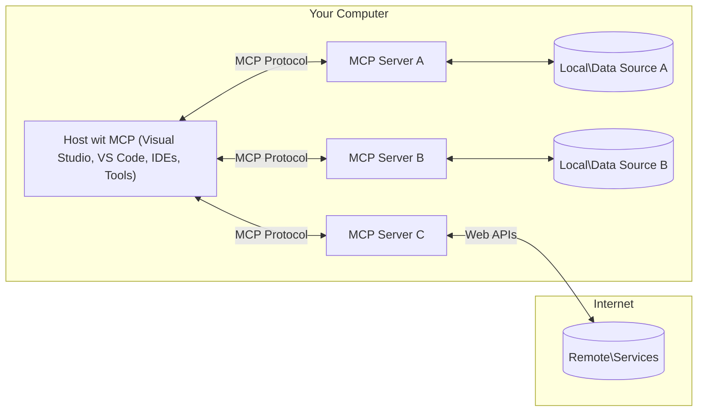

# MCP Core Concepts: Master di Model Context Protocol for AI Integration

[](https://youtu.be/earDzWGtE84)

_(Click di image wey dey up to watch video of dis lesson)_

Di [Model Context Protocol (MCP)](https://github.com/modelcontextprotocol) na powerful, standard framework wey dey make communication sharp between Large Language Models (LLMs) and external tools, applications, and data sources.  
Dis guide go waka you through di core concepts of MCP. You go learn about how e be client-server architecture, di important parts, how communication dey work, and beta way to implement am.

- **Explicit User Consent**: All data wey dem wan use and operation must get user clear approval before e run. Users gats understand clear wetin dem wan access and wetin dem go do, with better control for permissions and authorization dem.

- **Data Privacy Protection**: User data no go show unless user give clear consent plus must protected with strong access control throughout everything wey go happen. Implementation gats stop anybody wey no authorized from sending data and keep privacy strong.

- **Tool Execution Safety**: Every tool wey dem wan use must get user clear approval plus user must sabi how tool dey work, parameters, plus how e fit affect things. Strong security dem gats dey to stop tool wey no safe or fit cause harm from running.

- **Transport Layer Security**: All communication channels gats use correct encryption plus authentication. Remote connection gats take secure transport protocols and proper credential management.

#### Implementation Guidelines:

- **Permission Management**: Set fine-grained permission system wey allow users to control which servers, tools, and resources dem fit use  
- **Authentication & Authorization**: Use secure authentication method (OAuth, API keys) with correct token management and expiration  
- **Input Validation**: Check all parameters and data inputs based on defined schemas to stop injection attacks  
- **Audit Logging**: Keep full logs of all operations for security and compliance

## Overview

Dis lesson go show you di main architecture and parts wey build di Model Context Protocol (MCP) system. You go learn about client-server architecture, key parts, and how communication dey happen inside MCP interactions.

## Key Learning Objectives

By di time dis lesson finish, you go:

- Understand di MCP client-server architecture.  
- Know di roles and responsibilities of Hosts, Clients, and Servers.  
- Analyze di main features wey make MCP flexible as integration layer.  
- Learn how information dey flow inside di MCP system.  
- Get beta understanding through code examples for .NET, Java, Python, and JavaScript.

## MCP Architecture: A Deeper Look

Di MCP system na client-server model dem build on top. Dis modular setup make AI applications fit interact with tools, databases, APIs, and other context resources sharply. Make we break dis architecture into main parts.

For di core, MCP dey follow client-server model where host application fit connect to many servers:



- **MCP Hosts**: Programs like VSCode, Claude Desktop, IDEs, or AI tools wey wan access data through MCP  
- **MCP Clients**: Protocol clients wey dey keep 1:1 connection with servers  
- **MCP Servers**: Lightweight programs wey each expose specific abilities through di standard Model Context Protocol  
- **Local Data Sources**: Your computer files, database, and services wey MCP servers fit access safely  
- **Remote Services**: External systems wey dey internet wey MCP servers fit connect to through APIs.

Di MCP Protocol na standard wey dey update with date versioning (YYYY-MM-DD format). Di current protocol version na **2025-11-25**. You fit see di latest updates for di [protocol specification](https://modelcontextprotocol.io/specification/2025-11-25/)

> **Wetin dey come:** A release candidate for di next specification version, **2026-07-28**, dem announce am May 2026 and e go release July 28, 2026. E make di protocol stateless for di transport layer (dem remove di `initialize` handshake and session IDs), e formalize Extensions framework, and e deprecate Roots, Sampling, and Logging make dem use new better ways. See [Wetin Dey Change for MCP: Di 2026-07-28 Release Candidate](./mcp-2026-07-28-release-candidate.md) for full details.

### 1. Hosts

For di Model Context Protocol (MCP), **Hosts** na AI applications wey be main interface wey users dey interact with di protocol. Hosts dey organize and manage connection to many MCP servers by creating MCP clients wey na for each server connection. Some examples of Hosts na:

- **AI Applications**: Claude Desktop, Visual Studio Code, Claude Code  
- **Development Environments**: IDEs and code editors wey integrate MCP  
- **Custom Applications**: AI agents and tools wey dem design for special purpose

**Hosts** na applications wey dey organize AI model interactions. Dem:

- **Orchestrate AI Models**: Run or interact with LLMs to produce responses and manage AI workflows  
- **Manage Client Connections**: Create and maintain one MCP client per MCP server connection  
- **Control User Interface**: Manage how conversation flow go, user interactions, and show responses  
- **Enforce Security**: Control permissions, security limits, and authentication  
- **Handle User Consent**: Manage user approval for data sharing and tool running

### 2. Clients

**Clients** na important parts wey dey maintain one-to-one connections between Hosts and MCP servers. Each MCP client dem make by di Host to connect to specific MCP server, so connection go well arrange and secure. Many clients mean Hosts fit connect to many servers at once.

**Clients** na connector parts inside host application. Dem:

- **Protocol Communication**: Send JSON-RPC 2.0 requests to servers with prompts and instructions  
- **Capability Negotiation**: Negotiate which features and protocol versions server get during setup  
- **Tool Execution**: Manage requests to run tools from models and handle the response  
- **Real-time Updates**: Handle notifications and immediate updates from servers  
- **Response Processing**: Process and format server responses make e ready for user to see

### 3. Servers

**Servers** na programs wey dey provide context, tools, and abilities to MCP clients. Dem fit run locally (for same machine as di Host) or remotely (for external platforms), and dem responsible for handling client requests plus providing organized responses. Servers dey expose specific functions through di standard Model Context Protocol.

**Servers** na services wey provide context and capabilities. Dem:

- **Feature Registration**: Register and expose available primitives (resources, prompts, tools) to clients  
- **Request Processing**: Receive and carry out tool calls, resource requests, and prompt orders from clients  
- **Context Provision**: Provide context and data wey go improve model responses  
- **State Management**: Keep session state and handle stateful interaction when necessary  
- **Real-time Notifications**: Send messages about feature changes and updates to clients wey connect

Anybody fit build Servers to extend model abilities with special functions, and dem support both local and remote ways to deploy.

### 4. Server Primitives

Servers for Model Context Protocol (MCP) provide three main **primitives** wey define base building blocks for strong interactions between clients, hosts, and language models. These primitives show di types of context info and actions wey protocol let make happen.

MCP servers fit expose any combination of these three core primitives:

#### Resources 

**Resources** na data sources wey provide context info to AI applications. Dem fit be static or dynamic content wey go boost model understanding and decision-making:

- **Contextual Data**: Structured info and context for AI model use  
- **Knowledge Bases**: Document collections, articles, manuals, research papers  
- **Local Data Sources**: Files, databases, and system info for local machine  
- **External Data**: API responses, web services, and remote system data  
- **Dynamic Content**: Real-time data wey dey update based on external condition

Resources get URI wey dem use identify dem and dem support discovery through `resources/list` and fit read with `resources/read` methods:

```text
file://documents/project-spec.md
database://production/users/schema
api://weather/current
```

#### Prompts

**Prompts** na reusable templates wey help structure how interaction with language models suppose be. Dem provide standard ways to interact and template workflows:

- **Template-based Interactions**: Pre-made messages and conversation starters  
- **Workflow Templates**: Standard steps for common tasks and interactions  
- **Few-shot Examples**: Example-based templates for model instruction  
- **System Prompts**: Base prompts wey define how model go behave and context  
- **Dynamic Templates**: Parameterized prompts wey fit adjust to specific contexts

Prompts support substitution of variables and fit be discovered through `prompts/list` and retrieved with `prompts/get`:

```markdown
Generate a {{task_type}} for {{product}} targeting {{audience}} with the following requirements: {{requirements}}
```

#### Tools

**Tools** na functions wey AI models fit run to perform specific tasks. Dem be di "verbs" for MCP ecosystem, enabling models to interact with external systems:

- **Executable Functions**: Separate operations wey models fit call with specific parameters  
- **External System Integration**: API calls, database queries, file operations, calculations  
- **Unique Identity**: Each tool get unique name, description, and parameter schema  
- **Structured I/O**: Tools dey accept validated parameters and return structured, typed responses  
- **Action Capabilities**: Allow models to run real-world actions and get live data

Tools dem define with JSON Schema for parameter validation and dem fit discover dem through `tools/list` and run them via `tools/call`. Tools fit also get **icons** as extra metadata for better UI display.

**Tool Annotations**: Tools fit get behavior annotations (e.g., `readOnlyHint`, `destructiveHint`) wey talk whether tool na read-only or e fit destroy, helping clients decide well for tool run.

Example tool definition:

```typescript
server.tool(
  "search_products", 
  {
    query: z.string().describe("Search query for products"),
    category: z.string().optional().describe("Product category filter"),
    max_results: z.number().default(10).describe("Maximum results to return")
  }, 
  async (params) => {
    // Run di search and return structured results
    return await productService.search(params);
  }
);
```

## Client Primitives

For Model Context Protocol (MCP), **clients** fit expose primitives wey go allow servers to request extra capabilities from di host application. These client-side primitives dey make server implementation richer and more interactive, plus dem fit access AI model abilities and user interaction.

### Sampling

> **Deprecation notice:** di `2026-07-28` release candidate don mark Sampling as deprecated because dem wan replace am with direct integration with LLM provider APIs. E still go work for `2025-11-25` plus for at least one year after dem stop am, but new design dem suppose use di new way. See [Wetin Dey Change for MCP: Di 2026-07-28 Release Candidate](./mcp-2026-07-28-release-candidate.md).

**Sampling** allow servers to request language model completions from di client's AI app. Dis primitive make servers fit use LLM functionalities without to keep their own model dependencies:

- **Model-Independent Access**: Servers fit request completions without carrying LLM SDKs or managing model access  
- **Server-Initiated AI**: Make servers fit generate content on top their own using client’s AI model  
- **Recursive LLM Interactions**: Support complex cases wey servers need AI help  
- **Dynamic Content Generation**: Allow servers to make context responses using host model  
- **Tool Calling Support**: Servers fit add `tools` and `toolChoice` parameters so client’s model fit call tools during sampling

Sampling na thing wey dem start with `sampling/complete` method, where servers go send completion requests to clients.

### Roots

> **Deprecation notice:** di `2026-07-28` release candidate don mark Roots as deprecated because dem wan make people use tool parameters, resource URIs, or server config. E still dey work for `2025-11-25` plus for at least one year after dem deprecate am. See [Wetin Dey Change for MCP: Di 2026-07-28 Release Candidate](./mcp-2026-07-28-release-candidate.md).

**Roots** dey provide standardized way for clients to expose filesystem boundaries to servers, helping servers sabi which directories and files dem fit access:

- **Filesystem Boundaries**: Define di limits wey servers fit operate for filesystem  
- **Access Control**: Help servers sabi which directories and files dem get permission to open  
- **Dynamic Updates**: Clients fit tell servers when roots list don change  
- **URI-Based Identification**: Roots dey use `file://` URIs to show accessible directories and files

Roots fit dey discover through `roots/list` method, clients dey send `notifications/roots/list_changed` when roots change.

### Elicitation  

**Elicitation** make servers fit request extra information or confirmation from users through client interface:

- **User Input Requests**: Servers fit ask for extra info when e need am for tool run  
- **Confirmation Dialogs**: Request user approval for sensitive or serious operation  
- **Interactive Workflows**: Make servers fit create steps wey users go follow  
- **Dynamic Parameter Collection**: Gather missing or optional parameters during tool execution

Elicitation requests dem dey use `elicitation/request` method to collect user input on client interface.

**URL Mode Elicitation**: Servers fit also request URL based user interaction, so servers fit direct users go external web pages for authentication, approval, or data entry.

### Logging
> **Deprecation notice:** di `2026-07-28` release candidate mark Logging as deprecated in favor of `stderr` for stdio transports an OpenTelemetry for structured observability. E still dey work for `2025-11-25` an for at least one year after any deprecation. See [What's Changing in MCP: The 2026-07-28 Release Candidate](./mcp-2026-07-28-release-candidate.md).

**Logging** dey allow servers to send structured log messages to clients for debugging, monitoring, an operational visibility:

- **Debugging Support**: Make servers fit provide detailed execution logs for troubleshooting
- **Operational Monitoring**: Send status updates an performance metrics to clients
- **Error Reporting**: Provide detailed error context an diagnostic information
- **Audit Trails**: Create comprehensive logs of server operations an decisions

Logging messages dem dey send to clients to give transparency inside server operations an to help debugging.

## Information Flow in MCP

Di Model Context Protocol (MCP) dey define structured flow of information between hosts, clients, servers, an models. To sabi dis flow go help clear how user requests dem dey process an how external tools an data dey plug inside model responses.

- **Host Initiates Connection**  
  Di host application (like IDE or chat interface) go establish connection to MCP server, normally via STDIO, WebSocket, or another supported transport.

- **Capability Negotiation**  
  Di client (wey de inside di host) an di server dem go exchange information about di features, tools, resources, an protocol versions dem support. Dis go make sure say both sides understand di capabilities wey dey available for di session.

- **User Request**  
  Di user go interact with di host (like enter prompt or command). Di host go gather dis input an pass am come client for processing.

- **Resource or Tool Use**  
  - Di client fit request extra context or resources from di server (files, database entries, knowledge base articles) to add more understanding to di model.
  - If di model see say tool dey needed (like to fetch data, do calculation, or call API), di client go send tool invocation request to di server, specify di tool name an parameters.

- **Server Execution**  
  Di server go receive di resource or tool request, run di operations (like run function, query database, or get file), an send back di results to di client in structured format.

- **Response Generation**  
  Di client go join di server responses (resource data, tool outputs, etc.) inside ongoing model interaction. Di model go use di info to generate detailed an relevant response.

- **Result Presentation**  
  Di host go receive di final output from di client an show am to di user, often including di model generated text an tool execution or resource lookup results.

Dis flow dey allow MCP to support advanced, interactive, an context-aware AI applications by smoothly connecting models with external tools an data sources.

## Protocol Architecture & Layers

MCP get two separate architectural layers wey dey work together to give full communication framework:

### Data Layer

Di **Data Layer** dey implement di core MCP protocol using **JSON-RPC 2.0** as foundation. Dis layer dey define message structure, semantics, an interaction patterns:

#### Core Components:

- **JSON-RPC 2.0 Protocol**: All communication dey use standardized JSON-RPC 2.0 message format for method calls, responses, an notifications
- **Lifecycle Management**: E dey handle connection initialization, capability negotiation, an session termination between clients an servers
- **Server Primitives**: E allow servers to give core functionality through tools, resources, an prompts
- **Client Primitives**: E allow servers to request sampling from LLMs, collect user input, an send log messages
- **Real-time Notifications**: E support asynchronous notifications for dynamic updates without need for polling

#### Key Features:

- **Protocol Version Negotiation**: E dey use date-based versioning (YYYY-MM-DD) to ensure compatibility
- **Capability Discovery**: Clients an servers dey exchange supported features info during initialization
- **Stateful Sessions**: E dey keep connection state across multiple interactions for context continuity

### Transport Layer

Di **Transport Layer** dey manage communication channels, message framing, an authentication between MCP participants:

#### Supported Transport Mechanisms:

1. **STDIO Transport**:
   - E dey use standard input/output streams for direct process communication
   - Best for local processes on same machine with no network overhead
   - Common for local MCP server implementations

2. **Streamable HTTP Transport**:
   - E dey use HTTP POST for client-to-server messages  
   - Optional Server-Sent Events (SSE) for server-to-client streaming
   - E enable remote server communication across networks
   - E support standard HTTP authentication (bearer tokens, API keys, custom headers)
   - MCP recommend OAuth for secure token-based authentication

#### Transport Abstraction:

Di transport layer dey abstract communication details from data layer, so e fit use same JSON-RPC 2.0 message format across all transport types. Dis abstraction make am easy for applications to switch between local an remote servers smoothly.

### Security Considerations

MCP implementations must follow plenty critical security rules to make sure say all interaction safe, trustworthy, an secure across protocol operations:

- **User Consent and Control**: Users must give clear consent before any data access or operations dey perform. Dem suppose get clear control of which data dem share an which actions dem authorize, supported by user-friendly interfaces for reviewing an approving activities.

- **Data Privacy**: User data go only show if explicit consent don happen an e must dey protected by proper access controls. MCP implementations must defend against unauthorized data transmission an make sure privacy dey maintained for all interactions.

- **Tool Safety**: Before any tool invocation, explicit user consent must dey. Users must understand each tool’s function plus strong security boundaries must dey to stop any unintended or unsafe tool use.

If person follow these security principles, MCP go make sure user trust, privacy, an safety dey for all protocol interactions, plus e go support powerful AI integrations.

## Code Examples: Key Components

Below na code examples for some popular programming languages wey show how to implement key MCP server components and tools.

### .NET Example: Creating a Simple MCP Server with Tools

Here be practical .NET code example wey show how to implement simple MCP server with custom tools. Dis example show how to define an register tools, handle requests, an connect server using Model Context Protocol.

```csharp
using System;
using System.Threading.Tasks;
using ModelContextProtocol.Server;
using ModelContextProtocol.Server.Transport;
using ModelContextProtocol.Server.Tools;

public class WeatherServer
{
    public static async Task Main(string[] args)
    {
        // Create an MCP server
        var server = new McpServer(
            name: "Weather MCP Server",
            version: "1.0.0"
        );
        
        // Register our custom weather tool
        server.AddTool<string, WeatherData>("weatherTool", 
            description: "Gets current weather for a location",
            execute: async (location) => {
                // Call weather API (simplified)
                var weatherData = await GetWeatherDataAsync(location);
                return weatherData;
            });
        
        // Connect the server using stdio transport
        var transport = new StdioServerTransport();
        await server.ConnectAsync(transport);
        
        Console.WriteLine("Weather MCP Server started");
        
        // Keep the server running until process is terminated
        await Task.Delay(-1);
    }
    
    private static async Task<WeatherData> GetWeatherDataAsync(string location)
    {
        // This would normally call a weather API
        // Simplified for demonstration
        await Task.Delay(100); // Simulate API call
        return new WeatherData { 
            Temperature = 72.5,
            Conditions = "Sunny",
            Location = location
        };
    }
}

public class WeatherData
{
    public double Temperature { get; set; }
    public string Conditions { get; set; }
    public string Location { get; set; }
}
```

### Java Example: MCP Server Components

Dis example dey show di same MCP server and tool registration as di .NET example above, but e implement for Java.

```java
import io.modelcontextprotocol.server.McpServer;
import io.modelcontextprotocol.server.McpToolDefinition;
import io.modelcontextprotocol.server.transport.StdioServerTransport;
import io.modelcontextprotocol.server.tool.ToolExecutionContext;
import io.modelcontextprotocol.server.tool.ToolResponse;

public class WeatherMcpServer {
    public static void main(String[] args) throws Exception {
        // Make one MCP server
        McpServer server = McpServer.builder()
            .name("Weather MCP Server")
            .version("1.0.0")
            .build();
            
        // Register one weather tool
        server.registerTool(McpToolDefinition.builder("weatherTool")
            .description("Gets current weather for a location")
            .parameter("location", String.class)
            .execute((ToolExecutionContext ctx) -> {
                String location = ctx.getParameter("location", String.class);
                
                // Collect weather data (simplified)
                WeatherData data = getWeatherData(location);
                
                // Return formatted response
                return ToolResponse.content(
                    String.format("Temperature: %.1f°F, Conditions: %s, Location: %s", 
                    data.getTemperature(), 
                    data.getConditions(), 
                    data.getLocation())
                );
            })
            .build());
        
        // Connect the server using stdio transport
        try (StdioServerTransport transport = new StdioServerTransport()) {
            server.connect(transport);
            System.out.println("Weather MCP Server started");
            // Make the server dey run till process finish
            Thread.currentThread().join();
        }
    }
    
    private static WeatherData getWeatherData(String location) {
        // The implementation go call weather API
        // Simplify am for example purposes
        return new WeatherData(72.5, "Sunny", location);
    }
}

class WeatherData {
    private double temperature;
    private String conditions;
    private String location;
    
    public WeatherData(double temperature, String conditions, String location) {
        this.temperature = temperature;
        this.conditions = conditions;
        this.location = location;
    }
    
    public double getTemperature() {
        return temperature;
    }
    
    public String getConditions() {
        return conditions;
    }
    
    public String getLocation() {
        return location;
    }
}
```

### Python Example: Building an MCP Server

Dis example dey use fastmcp, so abeg make sure say you install am first:

```python
pip install fastmcp
```
Code Sample:

```python
#!/usr/bin/env python3
import asyncio
from fastmcp import FastMCP
from fastmcp.transports.stdio import serve_stdio

# Mak FastMCP server
mcp = FastMCP(
    name="Weather MCP Server",
    version="1.0.0"
)

@mcp.tool()
def get_weather(location: str) -> dict:
    """Gets current weather for a location."""
    return {
        "temperature": 72.5,
        "conditions": "Sunny",
        "location": location
    }

# Different way wey use class
class WeatherTools:
    @mcp.tool()
    def forecast(self, location: str, days: int = 1) -> dict:
        """Gets weather forecast for a location for the specified number of days."""
        return {
            "location": location,
            "forecast": [
                {"day": i+1, "temperature": 70 + i, "conditions": "Partly Cloudy"}
                for i in range(days)
            ]
        }

# Register class tools dem
weather_tools = WeatherTools()

# Start di server
if __name__ == "__main__":
    asyncio.run(serve_stdio(mcp))
```

### JavaScript Example: Creating an MCP Server

Dis example dey show how to create MCP server for JavaScript an register two weather-related tools.

```javascript
// Dey use di official Model Context Protocol SDK
import { McpServer } from "@modelcontextprotocol/sdk/server/mcp.js";
import { StdioServerTransport } from "@modelcontextprotocol/sdk/server/stdio.js";
import { z } from "zod"; // For parameter validation

// Make one MCP server
const server = new McpServer({
  name: "Weather MCP Server",
  version: "1.0.0"
});

// Define one weather tool
server.tool(
  "weatherTool",
  {
    location: z.string().describe("The location to get weather for")
  },
  async ({ location }) => {
    // Dis one normally go call one weather API
    // E simplify for demonstration
    const weatherData = await getWeatherData(location);
    
    return {
      content: [
        { 
          type: "text", 
          text: `Temperature: ${weatherData.temperature}°F, Conditions: ${weatherData.conditions}, Location: ${weatherData.location}` 
        }
      ]
    };
  }
);

// Define one forecast tool
server.tool(
  "forecastTool",
  {
    location: z.string(),
    days: z.number().default(3).describe("Number of days for forecast")
  },
  async ({ location, days }) => {
    // Dis one normally go call one weather API
    // E simplify for demonstration
    const forecast = await getForecastData(location, days);
    
    return {
      content: [
        { 
          type: "text", 
          text: `${days}-day forecast for ${location}: ${JSON.stringify(forecast)}` 
        }
      ]
    };
  }
);

// Helper functions
async function getWeatherData(location) {
  // Dey simulate API call
  return {
    temperature: 72.5,
    conditions: "Sunny",
    location: location
  };
}

async function getForecastData(location, days) {
  // Dey simulate API call
  return Array.from({ length: days }, (_, i) => ({
    day: i + 1,
    temperature: 70 + Math.floor(Math.random() * 10),
    conditions: i % 2 === 0 ? "Sunny" : "Partly Cloudy"
  }));
}

// Connect di server use stdio transport
const transport = new StdioServerTransport();
server.connect(transport).catch(console.error);

console.log("Weather MCP Server started");
```

Dis JavaScript example dey show how to create MCP server using Model Context Protocol SDK. E show how to register two tools wey dem call `weatherTool` and `forecastTool` an make dem dey available to MCP clients through `StdioServerTransport`.

## Security and Authorization

MCP get built-in concepts an mechanisms for managing security an authorization across di whole protocol:

1. **Tool Permission Control**:  
  Clients fit specify which tools model fit use for session. Dis one ensure say only authorized tools dey accessible, so e dey reduce risk of unintended or unsafe operations. Permissions fit change dynamically based on user preference, organizational policies, or interaction context.

2. **Authentication**:  
  Servers fit require authentication before access to tools, resources, or sensitive operations. E fit be API keys, OAuth tokens, or other authentication schemes. Proper authentication go make sure say only trusted clients an users fit call server-side capabilities.

3. **Validation**:  
  Parameter validation dey enforced for all tool calls. Each tool dey define expected types, formats, an constraints for parameters, an di server go validate incoming requests well. Dis one dey stop malformed or bad input from entering tool implementations and e help maintain operation integrity.

4. **Rate Limiting**:  
  To prevent abuse an ensure fair use of server resources, MCP servers fit implement rate limiting for tool calls an resource access. Rate limits fit apply per user, per session, or global, to help stop denial-of-service attacks or excessive resource consumption.

By mixing these mechanisms, MCP go provide secure base for integrating language models with external tools an data sources, plus e go allow users an developers to get fine control over access an usage.

## Protocol Messages & Communication Flow

MCP communication dey use structured **JSON-RPC 2.0** messages to help clear an reliable interactions between hosts, clients, an servers. Di protocol dey define specific message patterns for different operations:

### Core Message Types:

#### **Initialization Messages**
- **`initialize` Request**: E dey establish connection an negotiate protocol version an capabilities
- **`initialize` Response**: E confirm supported features an server info  
- **`notifications/initialized`**: Signal say initialization complete an session ready

#### **Discovery Messages**
- **`tools/list` Request**: Discover tools wey dey available from di server
- **`resources/list` Request**: List resources (data sources) wey available
- **`prompts/list` Request**: Retrieve prompt templates wey dey available

#### **Execution Messages**  
- **`tools/call` Request**: Execute specific tool with parameters wey provide
- **`resources/read` Request**: Get content from specific resource
- **`prompts/get` Request**: Fetch prompt template with optional parameters

#### **Client-side Messages**
- **`sampling/complete` Request**: Server dey request LLM completion from client
- **`elicitation/request`**: Server dey request user input through client interface
- **Logging Messages**: Server dey send structured log messages to client

#### **Notification Messages**
- **`notifications/tools/list_changed`**: Server notify client if tools change
- **`notifications/resources/list_changed`**: Server notify client if resource change  
- **`notifications/prompts/list_changed`**: Server notify client if prompt changes

### Message Structure:

All MCP messages dey follow JSON-RPC 2.0 format with:
- **Request Messages**: Get `id`, `method`, plus optional `params`
- **Response Messages**: Get `id` plus either `result` or `error`  
- **Notification Messages**: Get `method` plus optional `params` (no `id` or response required)

Dis structured communication dey make sure interactions dey reliable, traceable, an extensible for advanced scenarios like real-time updates, tool chaining, an strong error handling.

### Tasks (Experimental)

> **Looking ahead:** di `2026-07-28` release candidate go move Tasks from experimental core specification into dedicated Tasks extension wey get redesigned lifecycle (`tasks/get`, `tasks/update`, `tasks/cancel`; `tasks/list` don comot). If you dey build against di experimental API wey dem describe below, plan say you go migrate. See [What's Changing in MCP: The 2026-07-28 Release Candidate](./mcp-2026-07-28-release-candidate.md).

**Tasks** na experimental feature wey provide durable execution wrappers wey allow deferred result retrieval an status tracking for MCP requests:

- **Long-Running Operations**: Track expensive computations, workflow automation, an batch processing
- **Deferred Results**: Poll for task status an get results when operations finish
- **Status Tracking**: Monitor task progress through defined lifecycle states
- **Multi-Step Operations**: Support complex workflows wey dey span multiple interactions

Tasks dey wrap normal MCP requests to support asynchronous execution patterns for operations wey no fit finish immediately.

## Key Takeaways

- **Architecture**: MCP dey use client-server architecture wey hosts manage multiple client connections to servers
- **Participants**: Ecosystem get hosts (AI applications), clients (protocol connectors), an servers (capability providers)
- **Transport Mechanisms**: Communication support STDIO (local) an Streamable HTTP with optional SSE (remote)
- **Core Primitives**: Servers dey expose tools (executable functions), resources (data sources), an prompts (templates)
- **Client Primitives**: Servers fit request sampling (LLM completions plus tool calls), elicitation (user input including URL mode), roots (filesystem boundaries), an logging from clients
- **Experimental Features**: Tasks dey provide durable execution wrappers for long-running operations
- **Protocol Foundation**: E build on JSON-RPC 2.0 with date-based versioning (latest na 2025-11-25)
- **Real-time Capabilities**: E support notifications for dynamic updates and real-time synchronization
- **Security First**: Explicit user consent, data privacy protection, an secure transport na core requirements

## Exercise

Design simple MCP tool wey fit help for your domain. Define:
1. Wetin you go name di tool
2. Wetin parameters e go accept
3. Wetin output e go return
4. How model fit use dis tool to solve user problems


---

## What's next

Next: [Chapter 2: Security](../02-Security/README.md)
Curious wetin go happen afta `2025-11-25`? Read [Wetin Dey Change for MCP: The 2026-07-28 Release Candidate](./mcp-2026-07-28-release-candidate.md).

---

<!-- CO-OP TRANSLATOR DISCLAIMER START -->
**Disclaimer**:
Dis document don translate wit AI translation service [Co-op Translator](https://github.com/Azure/co-op-translator). Even tho we dey try make am correct, abeg make you know say automated translation fit get errors or mistakes. Di original document for dia own language na im be di correct source. For important info, make person wey sabi human translation do am. We no go responsible for any misunderstanding or wrong understanding wey fit happen because of dis translation.
<!-- CO-OP TRANSLATOR DISCLAIMER END -->