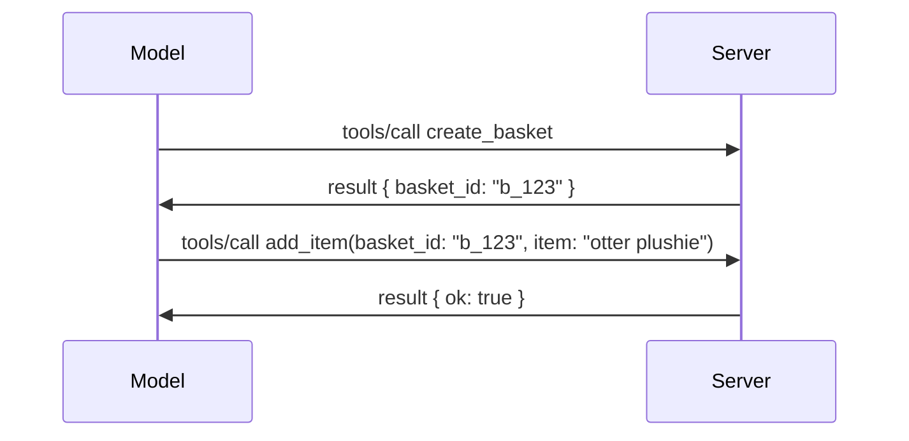

# Wetin Dey Change for MCP: Di 2026-07-28 Release Candidate

> **Status:** Release Candidate. Di `2026-07-28` specification never final as we dey write dis one. Dem announce am for May 21, 2026, and e dey plan to release for July 28, 2026. Everything wey dis lesson talk na about di release candidate; check di [draft specification](https://modelcontextprotocol.io/specification/draft) and di [changelog](https://modelcontextprotocol.io/specification/draft/changelog) for di latest status before you start build on top am. Di rest of dis curriculum na fo di current stable release, **MCP Specification 2025-11-25**, and e go update as soon as `2026-07-28` release.

## Overview

`2026-07-28` na di biggest MCP revision since e launch. Six Specification Enhancement Proposals (SEPs) remove protocol-level sessions and make MCP stateless for di transport layer, extensions turn first-class, versioned mechanism, and some features wey you don learn before for dis curriculum (Roots, Sampling, Logging) don become deprecated under new lifecycle policy. Dis lesson go summarize wetin dey change, why e matter, and wetin e mean for di code wey you don already write against `2025-11-25`.

Source: [Di 2026-07-28 MCP Specification Release Candidate](https://blog.modelcontextprotocol.io/posts/2026-07-28-release-candidate/) (Model Context Protocol Blog, David Soria Parra and Den Delimarsky).

## Learning Objectives

By di time you finish dis lesson, you go fit:

- Explain why MCP dey move go stateless protocol core and wetin di problem wey e dey solve for horizontally scaled deployments be.
- Talk how di `initialize`/`initialized` handshake and di `Mcp-Session-Id` header dem don replace.
- Identify di new `Mcp-Method` and `Mcp-Name` headers plus di `ttlMs`/`cacheScope` caching metadata.
- Recognize di Extensions framework and di two extensions wey dey for dis release: MCP Apps and Tasks.
- List di six authorization SEPs wey harden OAuth 2.0 / OIDC alignment.
- Identify which core features (Roots, Sampling, Logging) done deprecated, and wetin dat mean for practice.
- Explain di Full JSON Schema 2020-12 change for tool `inputSchema`/`outputSchema`.

## A Stateless Protocol

Di main change: MCP don become stateless for protocol layer.

### Before (2025-11-25): sessions dey bind you to one server instance

If you wan call tool over Streamable HTTP, you go start with `initialize` handshake. Di server go respond with `Mcp-Session-Id` header wey every next request must carry:

```http
POST /mcp HTTP/1.1
Mcp-Session-Id: 1868a90c-3a3f-4f5b
Content-Type: application/json

{"jsonrpc":"2.0","id":2,"method":"tools/call",
 "params":{"name":"search","arguments":{"q":"otters"}}}
```

Because session dey tied to whichever server instance wey issue am, horizontally scaled deployments need **sticky routing** for di load balancer and **shared session store** for all dem instances.

### After (2026-07-28): every request carry im own tin

```http
POST /mcp HTTP/1.1
MCP-Protocol-Version: 2026-07-28
Mcp-Method: tools/call
Mcp-Name: search
Content-Type: application/json

{"jsonrpc":"2.0","id":1,"method":"tools/call",
 "params":{"name":"search","arguments":{"q":"otters"},
           "_meta":{"io.modelcontextprotocol/clientInfo":{"name":"my-app","version":"1.0"}}}}
```

Any server instance fit handle dis request. Key changes be:

- **Di `initialize`/`initialized` handshake don comot** ([SEP-2575](https://github.com/modelcontextprotocol/modelcontextprotocol/pull/2575)). Protocol version, client info, and client capabilities don move enter `_meta` for every request. New `server/discover` method dey allow client fetch server capabilities upfront if e need am.
- **Di `Mcp-Session-Id` header and protocol-level session don comot** ([SEP-2567](https://github.com/modelcontextprotocol/modelcontextprotocol/pull/2567)). Sticky routing and shared session stores no dey necessary again for protocol layer.

### Stateless protocol, stateful applications

To comot protocol-level session no mean say your server no fit be stateful. Di recommended way na wetin HTTP APIs don dey do always: create explicit handle (like `basket_id`, or `browser_id`) from one tool call, then make di model pass dat handle back as normal argument for later calls.



Dis one make state dey visible and make sense to di model instead of to hide am inside transport metadata, and e let any server instance handle any call.

### Server-to-client requests, di arrangement don change

Stateless protocol still need way for server to ask client for something during call (for example, elicitation prompt):

- **Server-initiated requests fit only happen while server dey actively process client request** ([SEP-2260](https://github.com/modelcontextprotocol/modelcontextprotocol/pull/2260)) — before dis one na recommendation, now e hard demand. User no go ever get prompt from nowhere.
- **Multi Round-Trip Requests** ([SEP-2322](https://github.com/modelcontextprotocol/modelcontextprotocol/pull/2322)) don replace to hold SSE stream open. Instead, di server go return `InputRequiredResult`:

  ```json
  {
    "resultType": "inputRequired",
    "inputRequests": {
      "confirm": {
        "type": "elicitation",
        "message": "Delete 3 files?",
        "schema": { "type": "boolean" }
      }
    },
    "requestState": "eyJzdGVwIjoxLCJmaWxlcyI6WyJhIiwiYiIsImMiXX0="
  }
  ```

  Di client go collect answers and re-send di original call with `inputResponses` plus di repeated `requestState`. Any server instance fit catch di retry because everything wey dem need dey inside di payload.

### Routable, cacheable, traceable

Three small changes make am easier to operate stateless traffic:

- **`Mcp-Method` and `Mcp-Name` headers na must for Streamable HTTP** ([SEP-2243](https://github.com/modelcontextprotocol/modelcontextprotocol/pull/2243)), so load balancers, gateways, and rate limiters fit route based on operation without to inspect di JSON body. Servers go reject request wey headers and body no gree.
- **`tools/list` and resource read results carry `ttlMs` and `cacheScope`** ([SEP-2549](https://github.com/modelcontextprotocol/modelcontextprotocol/pull/2549)), e be like HTTP `Cache-Control`. Clients go sabi how long list result fresh and if e safe to share across users, without need to keep SSE stream long to dey learn changes.
- **W3C Trace Context propagation inside `_meta` dey documented** ([SEP-414](https://github.com/modelcontextprotocol/modelcontextprotocol/pull/414)), dem fix di `traceparent`, `tracestate`, and `baggage` key names to make distributed trace fit follow call across client SDK, MCP server, and downstream systems for [OpenTelemetry](https://opentelemetry.io/)-compatible backend.

## Extensions Don Turn First-Class

Before `2025-11-25`, extensions dey for `informally`. [SEP-2133](https://github.com/modelcontextprotocol/modelcontextprotocol/pull/2133) make dem official:

- Extensions dey identified by reverse-DNS IDs.
- Dem dey negotiate through `extensions` map on client and server capabilities.
- Dem dey live for their own `ext-*` repositories with maintainers wey dem assign, and dem version independently from core specification.
- New Extensions Track for SEP process dey give dem road from experimental reach official.

Dis release get two official extensions.

### MCP Apps: server-rendered user interfaces

[MCP Apps](https://blog.modelcontextprotocol.io/posts/2026-01-26-mcp-apps/) ([SEP-1865](https://github.com/modelcontextprotocol/modelcontextprotocol/pull/1865)) let servers fit ship interactive HTML interfaces wey host fit render inside sandboxed iframe. Tools declare their UI templates before time make hosts fit prefetch, cache, and security-review dem before anything run. You don already learn di basics of dis one inside [Lesson 15: MCP Apps](../03-GettingStarted/15-mcp-apps/README.md) — under di Extensions framework, MCP Apps don officially become extension no be experimental core feature again.

### Tasks come graduate to extension

Tasks start as experimental core feature for `2025-11-25`. Use for production show say dem need redesign wella so di right place for am na extension: di [Tasks extension](https://github.com/modelcontextprotocol/modelcontextprotocol/pull/2663) rearrange lifecycle for stateless model — server fit answer `tools/call` with task handle, and client fit drive am forward with `tasks/get`, `tasks/update`, and `tasks/cancel`. Task creation na server talk: client dey advertise di extension, and server go decide when call suppose run as task. `tasks/list` comot finish because e no fit scope safely without sessions.

> **Migration note:** if you don implement experimental `2025-11-25` Tasks API before, you go need migrate go the new extension lifecycle — e no go work backward.

## Authorization Hardening

Six SEPs harden di [authorization specification](https://modelcontextprotocol.io/specification/draft/basic/authorization) to better match with real-world OAuth 2.0 / OpenID Connect deployments:

| SEP | Change |
|---|---|
| [SEP-2468](https://github.com/modelcontextprotocol/modelcontextprotocol/pull/2468) | Clients must validate `iss` parameter for authorization responses according to [RFC 9207](https://www.rfc-editor.org/rfc/rfc9207), to reduce mix-up attacks wey common for MCP single-client, many-server pattern. Future version go require make you reject responses wey miss `iss`. |
| [SEP-837](https://github.com/modelcontextprotocol/modelcontextprotocol/pull/837) | Clients go declare their OpenID Connect `application_type` during Dynamic Client Registration, to stop authorization servers from defaulting desktop/CLI client to `"web"` and rejecting its localhost redirect URI. |
| [SEP-2352](https://github.com/modelcontextprotocol/modelcontextprotocol/pull/2352) | Clients go bind registered credentials to authorization server `issuer` and re-register anytime resource move between authorization servers. |
| [SEP-2207](https://github.com/modelcontextprotocol/modelcontextprotocol/pull/2207) | Document how to request refresh tokens from OpenID Connect-style authorization servers. |
| [SEP-2350](https://github.com/modelcontextprotocol/modelcontextprotocol/pull/2350) | Clarify scope accumulation during step-up authorization. |
| [SEP-2351](https://github.com/modelcontextprotocol/modelcontextprotocol/pull/2351) | Clarify `.well-known` discovery suffix. |

If you dey build authorization server for MCP now, start to add `iss` for authorization responses now — check [02-Security](../02-Security/README.md) for current authorization guidance wey dis one go build on top.

## Roots, Sampling, and Logging Don Deprecated

Under new [feature lifecycle policy](https://github.com/modelcontextprotocol/modelcontextprotocol/pull/2577) ([SEP-2577](https://github.com/modelcontextprotocol/modelcontextprotocol/pull/2577)), three core client primitives wey you learn for [Core Concepts](./README.md#roots) don move to **Deprecated** status:

| Feature | Recommended replacement |
|---|---|
| Roots | Tool parameters, resource URIs, or server configuration |
| Sampling | Direct integration with LLM provider APIs |
| Logging | `stderr` for stdio transports; OpenTelemetry for structured observability |

These na **annotation-only deprecations**: methods, types, and capability flags still dey work for dis release and for any specification version wey dem release for one year after dis one. To remove any of dem completely, another SEP must come under lifecycle policy — so nothing go break for your existing [Sampling](../03-GettingStarted/14-sampling/README.md) samples now, but new servers should dey prefer the replacement patterns wey dem list for above.

## Full JSON Schema 2020-12 for Tools

Tool `inputSchema` and `outputSchema` don upgrade to full [JSON Schema 2020-12](https://json-schema.org/draft/2020-12) ([SEP-2106](https://github.com/modelcontextprotocol/modelcontextprotocol/pull/2106)):

- Input schemas still must get `type: "object"` root constraint but now dem allow composition (`oneOf`, `anyOf`, `allOf`), conditionals, and references (`$ref`, `$defs`).
- Output schemas no get restriction again, and `structuredContent` fit now be any JSON value, no be only object.
- Implementations no suppose auto-dereference external `$ref` URIs and dem suppose limit schema depth and validation time (to avoid denial-of-service if you dey validate schemas server-side).

Another change na error code for missing resource don change from MCP-custom `-32002` to JSON-RPC normal `-32602` (Invalid Params) ([SEP-2164](https://github.com/modelcontextprotocol/modelcontextprotocol/pull/2164)). If your client dey match on `-32002` exactly, you go need update am.

## How Di Protocol Go Take Change From Now

Dis release get breaking changes, but MCP maintainers no plan make dis become common for future. Three governance SEPs dey try to prevent repetition:

- **Feature lifecycle policy** dey give every feature path from Active → Deprecated → Removed with at least twelve months between deprecation and when dem fit remove am.
- **Extensions framework** allow new capabilities to come as opt-in extensions and stabilize there before (if e happen) move enter core specification.
- A Standards Track SEP no fit reach Final status again until wey matching scenario land for the [conformance suite](https://github.com/modelcontextprotocol/conformance) ([SEP-2484](https://github.com/modelcontextprotocol/modelcontextprotocol/pull/2484)) — na di same suite wey the [SDK tier system](https://github.com/modelcontextprotocol/modelcontextprotocol/pull/1777) dey score official SDKs against.

## Release Timeline and Validation

- The release candidate dem lock am for May 21, 2026.
- The final specification dem schedule am for July 28, 2026.
- Di ten-week window wey dey between the two go allow SDK maintainers and client implementers validate the changes against real workloads; Tier 1 SDKs dem expect make dem ship support within this window under the [SDK tier system](https://modelcontextprotocol.io/docs/sdk).
- Track di full set of changes for di [draft specification](https://modelcontextprotocol.io/specification/draft) and e [changelog](https://modelcontextprotocol.io/specification/draft/changelog).

## Wetin Dis Mean for Dis Curriculum

Everything wey you don learn so far for dis course target **2025-11-25**, wey still remain the current stable specification until `2026-07-28` ship. For the concrete:

- **Sessions and the `initialize` handshake** (wey dem cover for [Core Concepts](./README.md) and [Lesson 6: HTTP Streaming](../03-GettingStarted/06-http-streaming/README.md)) still dey work as dem document am today, but make you expect say dem go replace am with di stateless request model wey dey above once you upgrade to `2026-07-28`-compatible SDKs.
- **Sampling and Roots** (wey dem also cover for [Core Concepts](./README.md)) still dey fully functional but dem don dey deprecated — new designs suppose prefer di replacement patterns wey dem list above.
- **The experimental Tasks feature**, if you don use am, you go need migrate am go Tasks extension new lifecycle.
- **MCP Apps** ([Lesson 15](../03-GettingStarted/15-mcp-apps/README.md)) no get any effect for practice; e just dey move under the formal Extensions framework.

## Additional Resources

- [The 2026-07-28 MCP Specification Release Candidate (blog post)](https://blog.modelcontextprotocol.io/posts/2026-07-28-release-candidate/)
- [The Future of MCP Transports](https://blog.modelcontextprotocol.io/posts/2025-12-19-mcp-transport-future/)
- [MCP Draft Specification](https://modelcontextprotocol.io/specification/draft)
- [MCP Draft Changelog](https://modelcontextprotocol.io/specification/draft/changelog)
- [SEP Guidelines](https://modelcontextprotocol.io/community/sep-guidelines)
- [MCP SDK Tier System](https://modelcontextprotocol.io/docs/sdk)

## Next Steps

Make you return go [Core Concepts](./README.md) or continue go [Security](../02-Security/README.md) to see how today's `2025-11-25` guidance go match with wetin dey come.

---

<!-- CO-OP TRANSLATOR DISCLAIMER START -->
**Disclaimer**:
Dis document don translate wit AI translation service [Co-op Translator](https://github.com/Azure/co-op-translator). Even tho we dey try make am correct, abeg make you know say automated translation fit get errors or mistakes. Di original document for dia own language na im be di correct source. For important info, make person wey sabi human translation do am. We no go responsible for any misunderstanding or wrong understanding wey fit happen because of dis translation.
<!-- CO-OP TRANSLATOR DISCLAIMER END -->