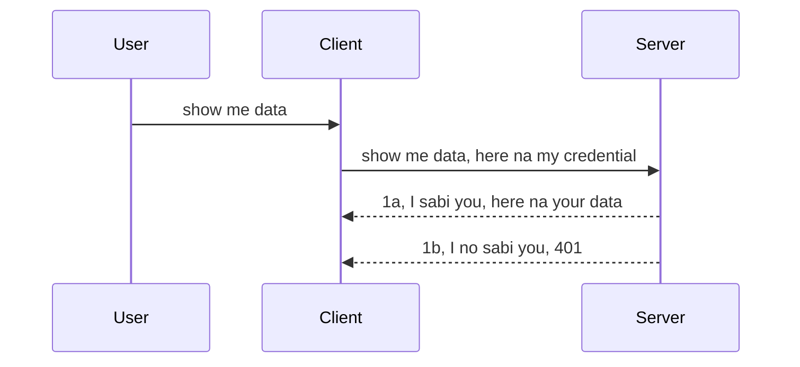

# Simple auth

MCP SDKs support di use of OAuth 2.1 wey to be fair na one kain process wey get plenty tins like auth server, resource server, posting credentials, getting code, swapping di code for bearer token till you fit finally get your resource data. If you no sabi OAuth wey good as to use am, e betta make you start wit basic level of auth den build up go better and better security. Na why dis chapter dey, to build you go advanced auth.

## Auth, wetin we mean?

Auth na short form for authentication an authorization. Di idea be say we gats do two tins:

- **Authentication**, na di process to sabi if person fit enter our house, say dem get di right to dey "here" wey mean get access to our resource server wey MCP Server features dey.
- **Authorization**, na to find out if user suppose get access to specific resources wey dem dey ask for, example dis orders or dis products or if dem fit just read di content but no fit delete am as example.

## Credentials: how we tell system who we be

Well, most web developers for road go start to tink how dem go give credential to server, usually secret wey talk if dem fit dey here "Authentication". Dis credential usually na base64 encoded version of username and password or API key wey identify particular user.

Dis one mean say e go send am through header wey dem dey call "Authorization" like dis:

```json
{ "Authorization": "secret123" }
```

Dis one usually dem dey call basic authentication. How di flow e go work na like dis:



Now say we don understand how e dey flow, how we go fit implement am? Well, most web servers get something wey dem dey call middleware, na piece of code wey dey run as part of di request wey fit check credentials, and if credentials dey okay, e fit allow request pass through. If request no get valid credentials, you go get auth error. Make we see how e fit work:

**Python**

```python
class AuthMiddleware(BaseHTTPMiddleware):
    async def dispatch(self, request, call_next):

        has_header = request.headers.get("Authorization")
        if not has_header:
            print("-> Missing Authorization header!")
            return Response(status_code=401, content="Unauthorized")

        if not valid_token(has_header):
            print("-> Invalid token!")
            return Response(status_code=403, content="Forbidden")

        print("Valid token, proceeding...")
       
        response = await call_next(request)
        # add any customa headers or change di response for any kain way
        return response


starlette_app.add_middleware(CustomHeaderMiddleware)
```

Here we get:

- Create middleware wey dem call `AuthMiddleware` and e get `dispatch` method wey web server dey call.
- Add middleware join web server:

    ```python
    starlette_app.add_middleware(AuthMiddleware)
    ```

- Write validation logic wey check if Authorization header dey and if secret wey dem send valid:

    ```python
    has_header = request.headers.get("Authorization")
    if not has_header:
        print("-> Missing Authorization header!")
        return Response(status_code=401, content="Unauthorized")

    if not valid_token(has_header):
        print("-> Invalid token!")
        return Response(status_code=403, content="Forbidden")
    ```

    if secret dey and e valid, we go allow request go through by calling `call_next` and return di response.

    ```python
    response = await call_next(request)
    # put any customer header dem or change anything for di response one how
    return response
    ```

How e dey work be say if web request come server, middleware go run and based on im implementation, e go either allow di request go through or e go return error say client no fit continue.

**TypeScript**

Here we create middleware with popular framework Express and intercept di request before e reach MCP Server. Dis na di code:

```typescript
function isValid(secret) {
    return secret === "secret123";
}

app.use((req, res, next) => {
    // 1. Authorization header dey present?
    if(!req.headers["Authorization"]) {
        res.status(401).send('Unauthorized');
    }
    
    let token = req.headers["Authorization"];

    // 2. Check if e valid.
    if(!isValid(token)) {
        res.status(403).send('Forbidden');
    }

   
    console.log('Middleware executed');
    // 3. Pass di request go next step for di request pipeline.
    next();
});
```

For dis code:

1. We check if Authorization header dey first, if e no dey, we send 401 error.
2. We check if credential/token valid, if e no valid, we send 403 error.
3. Finally, e pass request continue and return di resource wey client ask for.

## Exercise: Implement authentication

Make we use our knowledge try run am. Dis na di plan:

Server

- Create web server plus MCP instance.
- Implement middleware for server.

Client

- Send web request wit credential via header.

### -1- Create web server and MCP instance

> **Looking ahead:** di TypeScript example below dey track HTTP transports for `transports` map keyed by `mcp-session-id`, based on **MCP Specification 2025-11-25**. Di `2026-07-28` release candidate go remove `initialize` handshake and session ID completely, so dis per-session transport map go change to stateless, self-contained requests. Check [What's Changing in MCP: The 2026-07-28 Release Candidate](../../01-CoreConcepts/mcp-2026-07-28-release-candidate.md).

For our first step, we need create web server instance and MCP Server.

**Python**

Here we create MCP server instance, create starlette web app den host am wit uvicorn.

```python
# di dey create MCP Server

app = FastMCP(
    name="MCP Resource Server",
    instructions="Resource Server that validates tokens via Authorization Server introspection",
    host=settings["host"],
    port=settings["port"],
    debug=True
)

# di dey create starlette web app
starlette_app = app.streamable_http_app()

# di dey serve app through uvicorn
async def run(starlette_app):
    import uvicorn
    config = uvicorn.Config(
            starlette_app,
            host=app.settings.host,
            port=app.settings.port,
            log_level=app.settings.log_level.lower(),
        )
    server = uvicorn.Server(config)
    await server.serve()

run(starlette_app)
```

For dis code:

- Create MCP Server.
- Build starlette web app from MCP Server, `app.streamable_http_app()`.
- Host and serve web app with uvicorn `server.serve()`.

**TypeScript**

Here we create MCP Server instance.

```typescript
const server = new McpServer({
      name: "example-server",
      version: "1.0.0"
    });

    // ... arrange server tins dem, tools, an prompts ...
```

Dis MCP Server creation gats happen inside our POST /mcp route definition, so make we move code like dis:

```typescript
import express from "express";
import { randomUUID } from "node:crypto";
import { McpServer } from "@modelcontextprotocol/sdk/server/mcp.js";
import { StreamableHTTPServerTransport } from "@modelcontextprotocol/sdk/server/streamableHttp.js";
import { isInitializeRequest } from "@modelcontextprotocol/sdk/types.js"

const app = express();
app.use(express.json());

// Map wey dey store transports by session ID
const transports: { [sessionId: string]: StreamableHTTPServerTransport } = {};

// Handle POST requests for client-to-server communication
app.post('/mcp', async (req, res) => {
  // Check if session ID don dey already
  const sessionId = req.headers['mcp-session-id'] as string | undefined;
  let transport: StreamableHTTPServerTransport;

  if (sessionId && transports[sessionId]) {
    // Use the transport wey dey already
    transport = transports[sessionId];
  } else if (!sessionId && isInitializeRequest(req.body)) {
    // New initialization request
    transport = new StreamableHTTPServerTransport({
      sessionIdGenerator: () => randomUUID(),
      onsessioninitialized: (sessionId) => {
        // Store transport by session ID
        transports[sessionId] = transport;
      },
      // DNS rebinding protection no dey enabled by default to maintain compatibility. If you dey run this server
      // locally, make sure say you set:
      // enableDnsRebindingProtection: true,
      // allowedHosts: ['127.0.0.1'],
    });

    // Clean transport when e close
    transport.onclose = () => {
      if (transport.sessionId) {
        delete transports[transport.sessionId];
      }
    };
    const server = new McpServer({
      name: "example-server",
      version: "1.0.0"
    });

    // ... set up server resources, tools, and prompts ...

    // Connect to the MCP server
    await server.connect(transport);
  } else {
    // Invalid request
    res.status(400).json({
      jsonrpc: '2.0',
      error: {
        code: -32000,
        message: 'Bad Request: No valid session ID provided',
      },
      id: null,
    });
    return;
  }

  // Handle the request
  await transport.handleRequest(req, res, req.body);
});

// Reusable handler for GET and DELETE requests
const handleSessionRequest = async (req: express.Request, res: express.Response) => {
  const sessionId = req.headers['mcp-session-id'] as string | undefined;
  if (!sessionId || !transports[sessionId]) {
    res.status(400).send('Invalid or missing session ID');
    return;
  }
  
  const transport = transports[sessionId];
  await transport.handleRequest(req, res);
};

// Handle GET requests for server-to-client notifications via SSE
app.get('/mcp', handleSessionRequest);

// Handle DELETE requests for session termination
app.delete('/mcp', handleSessionRequest);

app.listen(3000);
```

Now you see how MCP Server creation move inside `app.post("/mcp")`.

Make we go next step to create middleware to validate incoming credential.

### -2- Implement middleware for server

Make we do middleware part now. Here we go create middleware wey go look for credential for `Authorization` header and check am. If e be okay, request go continue do wetin e gats do (example list tools, read resource or any MCP function di client ask).

**Python**

To create middleware, we need create class wey inherit from `BaseHTTPMiddleware`. Two tins dey important:

- Di request `request`, we go read header info from.
- `call_next` na di callback we gats call if client bring credential wey we accept.

First, we gats handle case if `Authorization` header no dey:

```python
has_header = request.headers.get("Authorization")

# if no header dey, make e fail wit 401, if no, continue.
if not has_header:
    print("-> Missing Authorization header!")
    return Response(status_code=401, content="Unauthorized")
```

Here we send 401 unauthorized message as client fail authentication.

Next, if person submit credential, we go check if e valid:

```python
 if not valid_token(has_header):
    print("-> Invalid token!")
    return Response(status_code=403, content="Forbidden")
```

See how we send 403 forbidden message for up. Make we see full middleware wey do everything we talk:

```python
class AuthMiddleware(BaseHTTPMiddleware):
    async def dispatch(self, request, call_next):

        has_header = request.headers.get("Authorization")
        if not has_header:
            print("-> Missing Authorization header!")
            return Response(status_code=401, content="Unauthorized")

        if not valid_token(has_header):
            print("-> Invalid token!")
            return Response(status_code=403, content="Forbidden")

        print("Valid token, proceeding...")
        print(f"-> Received {request.method} {request.url}")
        response = await call_next(request)
        response.headers['Custom'] = 'Example'
        return response

```

Great, but wetin be `valid_token` function? Here e be:

```python
# NO use am for production - make am beta !!
def valid_token(token: str) -> bool:
    # comot the "Bearer " prefix
    if token.startswith("Bearer "):
        token = token[7:]
        return token == "secret-token"
    return False
```

Dis one fit improve well well.

IMPORTANT: You suppose NEVER keep secrets like dis for code. Ideally, you go fetch di value from data source or from IDP (identity service provider) or better make IDP do di validation.

**TypeScript**

To implement wit Express, we gats call `use` method wey dey take middleware functions.

We need:

- Interact wit request to check di credential wey dem pass inside `Authorization` property.
- Validate di credential and if e okay, make request continue do wetin e gats do (example list tools, read resource or any MCP thing).

Here, we dey check if `Authorization` header dey and if no, we stop request:

```typescript
if(!req.headers["authorization"]) {
    res.status(401).send('Unauthorized');
    return;
}
```

If header no dey, you go get 401.

Next, we check if credential valid, if no, we stop request again wit different message:

```typescript
if(!isValid(token)) {
    res.status(403).send('Forbidden');
    return;
} 
```

See how you dey get 403 error now.

Full code here:

```typescript
app.use((req, res, next) => {
    console.log('Request received:', req.method, req.url, req.headers);
    console.log('Headers:', req.headers["authorization"]);
    if(!req.headers["authorization"]) {
        res.status(401).send('Unauthorized');
        return;
    }
    
    let token = req.headers["authorization"];

    if(!isValid(token)) {
        res.status(403).send('Forbidden');
        return;
    }  

    console.log('Middleware executed');
    next();
});
```

We don set web server to accept middleware to check credential wey client send. How about client?

### -3- Send web request wit credential via header

We need make sure client dey send credential through header. Since we go use MCP client do am, we need see how e go be.

**Python**

For client, we need pass header wit credential like dis:

```python
# NO hardcode di value, make e dey at least for environment variable or somtin wey secure pass
token = "secret-token"

async with streamablehttp_client(
        url = f"http://localhost:{port}/mcp",
        headers = {"Authorization": f"Bearer {token}"}
    ) as (
        read_stream,
        write_stream,
        session_callback,
    ):
        async with ClientSession(
            read_stream,
            write_stream
        ) as session:
            await session.initialize()
      
            # TODO, wetin you want make di client do, like list tools, call tools and so on
```

See how we set `headers` property like dis ` headers = {"Authorization": f"Bearer {token}"}`.

**TypeScript**

We fit do dis in two steps:

1. Fill configuration object wit credential.
2. Pass configuration object to transport.

```typescript

// NO hardcode di value like dis here. At least make am one env variable and use sometin like dotenv (for dev mode).
let token = "secret123"

// define one client transport option object
let options: StreamableHTTPClientTransportOptions = {
  sessionId: sessionId,
  requestInit: {
    headers: {
      "Authorization": "secret123"
    }
  }
};

// carry di options object go di transport
async function main() {
   const transport = new StreamableHTTPClientTransport(
      new URL(serverUrl),
      options
   );
```

Here you see how we create `options` object and put headers under `requestInit`.

IMPORTANT: How you go improve am from dis point? Well, di current way get wahala. First, to send credential like this na risk unless you dey use HTTPS. Even so, credential fit thief, so you gats get system wey fit revoke token quick quick and add checks like where e dey come from, if request dey too frequent (bot behavior), many things dey worry. 

But for very simple APIs where you no want person just dey use your API without auth, wetin we get here good start.

With dis talk, make we try make security better small by using standard format like JSON Web Token, wey dem also dey call JWT or "JOT" tokens.

## JSON Web Tokens, JWT

So, we dey try improve from sending simple credentials. Wetin we go gain if we use JWT?

- **Security improvements**. For basic auth, you dey send username and password as base64 token (or API key) every time which increase risk. Wit JWT, you send username and password and get token back, plus e get time expiry. JWT let you use fine-grained access control with roles, scopes and permissions.
- **Statelessness and scalability**. JWTs get everything inside dem, dem carry all user info and no need to store for server-side session. You fit validate token locally.
- **Interoperability and federation**. JWTs na di core of Open ID Connect and dem dey use am with identity providers like Entra ID, Google Identity and Auth0. Dem also allow single sign on and more, wey make am enterprise-level.
- **Modularity and flexibility**. JWTs fit use with API Gateways like Azure API Management, NGINX and others. E support use authentication scenarios and server-to-service communication including impersonation and delegation.
- **Performance and caching**. JWTs fit cache after decode, wey reduce parsing needed. This dey help high-traffic apps cause e increase throughput and reduce load on infrastructure.
- **Advanced features**. E go support introspection (checking validity on server) and revocation (making token invalid).

With all dis benefits, make we see how to take our implementation go next level.

## Turning basic auth into JWT

So, di changes we gats do at high level na:

- **Learn how to construct JWT token** and ready am for sending from client to server.
- **Validate JWT token**, and if e valid, make client fit get our resources.
- **Secure token storage**. How to store di token.
- **Protect routes**. We gats protect di routes, in our case, protect routes and specific MCP features.
- **Add refresh tokens**. Make sure tokens we create short-lived, but get refresh tokens wey long-lived wey fit get new tokens if expiry done. Also get refresh endpoint and rotation strategy.

### -1- Construct JWT token

First, JWT token get these parts:

- **header**, algorithm wey dem use and token type.
- **payload**, claims like sub (user or entity token represent, normally userid for auth), exp (expiry time), role (role)
- **signature**, signed wit secret or private key.

We go create header, payload and encoded token.

**Python**

```python

import jwt
import jwt
from jwt.exceptions import ExpiredSignatureError, InvalidTokenError
import datetime

# Secret key wey dem dey use to sign the JWT
secret_key = 'your-secret-key'

header = {
    "alg": "HS256",
    "typ": "JWT"
}

# di user info, im claims, and im expiry time
payload = {
    "sub": "1234567890",               # Subject (user ID)
    "name": "User Userson",                # Custom claim
    "admin": True,                     # Custom claim
    "iat": datetime.datetime.utcnow(),# Issued at
    "exp": datetime.datetime.utcnow() + datetime.timedelta(hours=1)  # Expiry
}

# encode am
encoded_jwt = jwt.encode(payload, secret_key, algorithm="HS256", headers=header)
```

For dis code:

- Define header with HS256 algorithm and type JWT.
- Construct payload wey get subject or user id, username, role, issued time and expiry time to do di time-bound part we mention early.

**TypeScript**

Here we need dependencies to help create JWT token.

Dependencies

```sh

npm install jsonwebtoken
npm install --save-dev @types/jsonwebtoken
```

Now we get dis set, make we create header, payload then encoded token.

```typescript
import jwt from 'jsonwebtoken';

const secretKey = 'your-secret-key'; // Use env vars for production

// Define di payload
const payload = {
  sub: '1234567890',
  name: 'User usersson',
  admin: true,
  iat: Math.floor(Date.now() / 1000), // Issued for
  exp: Math.floor(Date.now() / 1000) + 60 * 60 // E go expire afta 1 hour
};

// Define di header (optional, jsonwebtoken dey set defaults)
const header = {
  alg: 'HS256',
  typ: 'JWT'
};

// Create di token
const token = jwt.sign(payload, secretKey, {
  algorithm: 'HS256',
  header: header
});

console.log('JWT:', token);
```

Dis token:

Signed wit HS256
Valid for 1 hour
Include claims like sub, name, admin, iat, and exp.

### -2- Validate token

We gats also validate token. Na server gats do dis to ensure wetin client send legit. Many checks dey from validating structure to token validity. You fit add other checks like if user dey your system and others.

To validate token, decode am so you fit read am and start to check am:

**Python**

```python

# Decode an check the JWT
try:
    decoded = jwt.decode(token, secret_key, algorithms=["HS256"])
    print("✅ Token is valid.")
    print("Decoded claims:")
    for key, value in decoded.items():
        print(f"  {key}: {value}")
except ExpiredSignatureError:
    print("❌ Token has expired.")
except InvalidTokenError as e:
    print(f"❌ Invalid token: {e}")

```

For dis code, we dey call `jwt.decode` using di token, di secret key and di chosen algorithm as input. Note how we use try-catch construct as e fit fail validation wey go raise error.

**TypeScript**

For here, we need to call `jwt.verify` to get decoded version of di token we fit analyze further. If dis call fail, e mean di token structure no correct or e don no valid again. 

```typescript

try {
  const decoded = jwt.verify(token, secretKey);
  console.log('Decoded Payload:', decoded);
} catch (err) {
  console.error('Token verification failed:', err);
}
```

NOTE: as we talk before, we suppose do extra checks to make sure say dis token dey represent user for our system and make sure say di user get rights wey e talk say e get.

Next, mek we check role based access control, wey dem sabi as RBAC.

## Adding role based access control

Di idea be say we want talk say different roles get different permissions. For example, we assume say admin fit do everything and say normal user fit do read/write and say guest fit only read. So, here some possible permission levels:

- Admin.Write 
- User.Read
- Guest.Read

Mek we see how we fit implement dis kind control with middleware. Middlewares fit add per route and also for all routes.

**Python**

```python
from starlette.middleware.base import BaseHTTPMiddleware
from starlette.responses import JSONResponse
import jwt

# NO keep di secret for inside di code like dis, dis one na only for show. Make you read am from beta place.
SECRET_KEY = "your-secret-key" # put dis one for env variable
REQUIRED_PERMISSION = "User.Read"

class JWTPermissionMiddleware(BaseHTTPMiddleware):
    async def dispatch(self, request, call_next):
        auth_header = request.headers.get("Authorization")
        if not auth_header or not auth_header.startswith("Bearer "):
            return JSONResponse({"error": "Missing or invalid Authorization header"}, status_code=401)

        token = auth_header.split(" ")[1]
        try:
            decoded = jwt.decode(token, SECRET_KEY, algorithms=["HS256"])
        except jwt.ExpiredSignatureError:
            return JSONResponse({"error": "Token expired"}, status_code=401)
        except jwt.InvalidTokenError:
            return JSONResponse({"error": "Invalid token"}, status_code=401)

        permissions = decoded.get("permissions", [])
        if REQUIRED_PERMISSION not in permissions:
            return JSONResponse({"error": "Permission denied"}, status_code=403)

        request.state.user = decoded
        return await call_next(request)


```

Different ways dey to add middleware like dis below:

```python

# Alt 1: add middleware wen u dey build starlette app
middleware = [
    Middleware(JWTPermissionMiddleware)
]

app = Starlette(routes=routes, middleware=middleware)

# Alt 2: add middleware after starlette app don already build
starlette_app.add_middleware(JWTPermissionMiddleware)

# Alt 3: add middleware for each route
routes = [
    Route(
        "/mcp",
        endpoint=..., # handler
        middleware=[Middleware(JWTPermissionMiddleware)]
    )
]
```

**TypeScript**

We fit use `app.use` and middleware wey go run for all requests. 

```typescript
app.use((req, res, next) => {
    console.log('Request received:', req.method, req.url, req.headers);
    console.log('Headers:', req.headers["authorization"]);

    // 1. Check if dem don send authorization header

    if(!req.headers["authorization"]) {
        res.status(401).send('Unauthorized');
        return;
    }
    
    let token = req.headers["authorization"];

    // 2. Check if token correct
    if(!isValid(token)) {
        res.status(403).send('Forbidden');
        return;
    }  

    // 3. Check if token user dey for our system
    if(!isExistingUser(token)) {
        res.status(403).send('Forbidden');
        console.log("User does not exist");
        return;
    }
    console.log("User exists");

    // 4. Confirm say token get the correct permissions
    if(!hasScopes(token, ["User.Read"])){
        res.status(403).send('Forbidden - insufficient scopes');
    }

    console.log("User has required scopes");

    console.log('Middleware executed');
    next();
});

```

Plenty things dey we fit let our middleware do and things wey our middleware suppose do, like:

1. Check if authorization header dey
2. Check if token valid, we dey call `isValid` wey be method we write wey dey check integrity and validity of JWT token.
3. Verify say user dey for our system, we suppose check dis.

   ```typescript
    // users wey dey for DB
   const users = [
     "user1",
     "User usersson",
   ]

   function isExistingUser(token) {
     let decodedToken = verifyToken(token);

     // TODO, make sure say user dey for DB or no
     return users.includes(decodedToken?.name || "");
   }
   ```

   For di code wey dem write above, we create simple `users` list wey suppose dey for database obviously.

4. Also, we suppose check say token get correct permissions.

   ```typescript
   if(!hasScopes(token, ["User.Read"])){
        res.status(403).send('Forbidden - insufficient scopes');
   }
   ```

   For di code from middleware above, we check say token get User.Read permission, if e no get, we go send 403 error. Below na `hasScopes` helper method.

   ```typescript
   function hasScopes(scope: string, requiredScopes: string[]) {
     let decodedToken = verifyToken(scope);
    return requiredScopes.every(scope => decodedToken?.scopes.includes(scope));
  }
   ```

Have a think which additional checks you should be doing, but these are the absolute minimum of checks you should be doing.

Using Express as a web framework is a common choice. There are helpers library when you use JWT so you can write less code.

- `express-jwt`, helper library that provides a middleware that helps decode your token.
- `express-jwt-permissions`, this provides a middleware `guard` that helps check if a certain permission is on the token.

Here's what these libraries can look like when used:

```typescript
const express = require('express');
const jwt = require('express-jwt');
const guard = require('express-jwt-permissions')();

const app = express();
const secretKey = 'your-secret-key'; // put this in env variable

// Decode JWT and attach to req.user
app.use(jwt({ secret: secretKey, algorithms: ['HS256'] }));

// Check for User.Read permission
app.use(guard.check('User.Read'));

// multiple permissions
// app.use(guard.check(['User.Read', 'Admin.Access']));

app.get('/protected', (req, res) => {
  res.json({ message: `Welcome ${req.user.name}` });
});

// Error handler
app.use((err, req, res, next) => {
  if (err.code === 'permission_denied') {
    return res.status(403).send('Forbidden');
  }
  next(err);
});

```

Now you don see how middleware fit use for authentication and authorization, but how e be for MCP, e change how we dey do auth? Make we find out for next section.

### -3- Add RBAC to MCP

You don see how you fit add RBAC through middleware, but for MCP, no easy way to add per MCP feature RBAC, so wetin we go do? We just add code like dis wey check if client get rights to call specific tool:

You get different options how to do per feature RBAC, here some:

- Add check for every tool, resource, prompt wey you need to check permission level.

   **python**

   ```python
   @tool()
   def delete_product(id: int):
      try:
          check_permissions(role="Admin.Write", request)
      catch:
        pass # client no fit get authorization, raise authorization error
   ```

   **typescript**

   ```typescript
   server.registerTool(
    "delete-product",
    {
      title: Delete a product",
      description: "Deletes a product",
      inputSchema: { id: z.number() }
    },
    async ({ id }) => {
      
      try {
        checkPermissions("Admin.Write", request);
        // todo, send id go productService and remote entry
      } catch(Exception e) {
        console.log("Authorization error, you're not allowed");  
      }

      return {
        content: [{ type: "text", text: `Deletected product with id ${id}` }]
      };
    }
   );
   ```


- Use advanced server approach and request handlers make you reduce how many places wey you need to do di check.

   **Python**

   ```python
   
   tool_permission = {
      "create_product": ["User.Write", "Admin.Write"],
      "delete_product": ["Admin.Write"]
   }

   def has_permission(user_permissions, required_permissions) -> bool:
      # user_permissions: list of permissions wey di user get
      # required_permissions: list of permissions wey di tool need
      return any(perm in user_permissions for perm in required_permissions)

   @server.call_tool()
   async def handle_call_tool(
     name: str, arguments: dict[str, str] | None
   ) -> list[types.TextContent]:
    # Make we assume say request.user.permissions na list of permissions wey di user get
     user_permissions = request.user.permissions
     required_permissions = tool_permission.get(name, [])
     if not has_permission(user_permissions, required_permissions):
        # Comot error "You no get permission to call tool {name}"
        raise Exception(f"You don't have permission to call tool {name}")
     # continue make e call tool
     # ...
   ```   
   

   **TypeScript**

   ```typescript
   function hasPermission(userPermissions: string[], requiredPermissions: string[]): boolean {
       if (!Array.isArray(userPermissions) || !Array.isArray(requiredPermissions)) return false;
       // Return true if user get at least one permission wey dem need
       
       return requiredPermissions.some(perm => userPermissions.includes(perm));
   }
  
   server.setRequestHandler(CallToolRequestSchema, async (request) => {
      const { params: { name } } = request;
  
      let permissions = request.user.permissions;
  
      if (!hasPermission(permissions, toolPermissions[name])) {
         return new Error(`You don't have permission to call ${name}`);
      }
  
      // carry on..
   });
   ```

   Note, you need to make sure say your middleware assign decoded token to request's user property so code above easy.

### Summing up

Now we don talk how to add support for RBAC in general and MCP in particular, time don reach to try implement security by yourself to make sure you understand di concepts wey dem present you.

## Assignment 1: Build mcp server and mcp client using basic authentication

Here you go take wetin you learn on how to send credentials through headers.

## Solution 1

[Solution 1](./code/basic/README.md)

## Assignment 2: Upgrade solution from Assignment 1 to use JWT

Take di first solution but dis time, mek we improve am. 

Instead of using Basic Auth, make we use JWT. 

## Solution 2

[Solution 2](./solution/jwt-solution/README.md)

## Challenge

Add RBAC per tool wey we describe for section "Add RBAC to MCP".

## Summary

You don hopefully learn plenty for dis chapter, from no security at all, to basic security, to JWT and how e fit add to MCP.

We don build solid foundation with custom JWTs, but as we dey scale, we dey move toward standards-based identity model. To adopt IdP like Entra or Keycloak go let us offload token issuance, validation, and lifecycle management to trusted platform — so that we fit focus on app logic and user experience.

For dat one, we get more [advanced chapter on Entra](../../05-AdvancedTopics/mcp-security-entra/README.md)

## What's Next

- Next: [Setting Up MCP Hosts](../12-mcp-hosts/README.md)

---

<!-- CO-OP TRANSLATOR DISCLAIMER START -->
**Disclaimer**:
Dis document don translate wit AI translation service [Co-op Translator](https://github.com/Azure/co-op-translator). Even tho we dey try make am correct, abeg make you know say automated translation fit get errors or mistakes. Di original document for dia own language na im be di correct source. For important info, make person wey sabi human translation do am. We no go responsible for any misunderstanding or wrong understanding wey fit happen because of dis translation.
<!-- CO-OP TRANSLATOR DISCLAIMER END -->