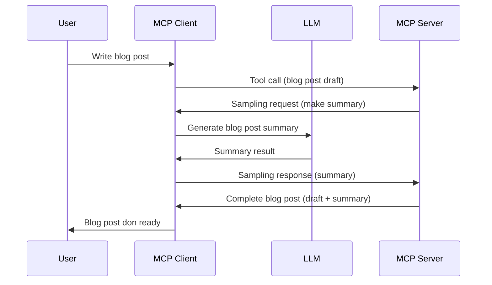

# Sampling - delegate features to the Client

> **Deprecation notice:** the `2026-07-28` MCP specification release candidate marks Sampling as deprecated in favor of direct integration with LLM provider APIs. Sampling continues to work in `2025-11-25` and for at least a year after any formal deprecation, so everything in this lesson remains valid — but new server designs should evaluate the replacement pattern. See [What's Changing in MCP: The 2026-07-28 Release Candidate](../../01-CoreConcepts/mcp-2026-07-28-release-candidate.md).

Sometimes, you need di MCP Client and di MCP Server to work together to achieve one common goal. You fit get case where di Server need di help of one LLM wey dey on top di client. For dis kain situation, sampling na wetin you suppose use.

Make we check some use cases and how to build solution wey involve sampling.

## Overview

For dis lesson, we go focus on how to sabi when and where to use Sampling and how to setup am.

## Learning Objectives

For dis chapter, we go:

- Explain wetin Sampling be and when make person use am.
- Show how to configure Sampling for MCP.
- Show ejemplos of how Sampling dey work.

## Wetin Sampling be and why you suppose use am?

Sampling na one advance feature wey dey work like dis:



### Sampling request

Ok, now we get one high level view of one credible scenario, make we talk about di sampling request wey di server dey send back to di client. Na so dis kain request fit look for JSON-RPC format:

```json
{
  "jsonrpc": "2.0",
  "id": 1,
  "method": "sampling/createMessage",
  "params": {
    "messages": [
      {
        "role": "user",
        "content": {
          "type": "text",
          "text": "Create a blog post summary of the following blog post: <BLOG POST>"
        }
      }
    ],
    "modelPreferences": {
      "hints": [
        {
          "name": "claude-3-sonnet"
        }
      ],
      "intelligencePriority": 0.8,
      "speedPriority": 0.5
    },
    "systemPrompt": "You are a helpful assistant.",
    "maxTokens": 100
  }
}
```

Some tins dey here we we fit talk about:

- Prompt, for content -> text, na our prompt wey be instruction for di LLM to summarize blog post content.

- **modelPreferences**. Dis section na preference, na recommendation on which configuration make person use with di LLM. User fit choose if e wan follow dis recommendation or change am. For dis case, dem get recommendation on which model to use plus speed and intelligence priority.
- **systemPrompt**, dis na your normal system prompt wey dey give your LLM personality and get instruction on how e suppose behave.
- **maxTokens**, dis one na property wey talk how many tokens dem recommend make dem use for dis task.

### Sampling response

Dis response na wetin di MCP Client go send back to di MCP Server after di client don call di LLM, wait for di response, then build dis message. Na so e fit look for JSON-RPC:

```json
{
  "jsonrpc": "2.0",
  "id": 1,
  "result": {
    "role": "assistant",
    "content": {
      "type": "text",
      "text": "Here's your abstract <ABSTRACT>"
    },
    "model": "gpt-5",
    "stopReason": "endTurn"
  }
}
```

See as di response be summary of di blog post just like we ask for. See also say di `model` wey dem use no be di one wey we ask for but "gpt-5" instead of "claude-3-sonnet". Dis one dey show say user fit change im mind on which model to use and your sampling request na just recommendation.

Ok, now we don understand di main flow and useful task for "blog post creation + abstract", make we see wetin we go do make e work.

### Message types

Sampling messages no limit to just text but you fit send images and audio too. Na so di JSON-RPC dey different:

**Text**

```json
{
  "type": "text",
  "text": "The message content"
}
```

**Image content**

```json
{
  "type": "image",
  "data": "base64-encoded-image-data",
  "mimeType": "image/jpeg"
}
```

**Audio content**

```json
{
  "type": "audio",
  "data": "base64-encoded-audio-data",
  "mimeType": "audio/wav"
}
```

> NOTE: for more detailed info on Sampling, check out the [official docs](https://modelcontextprotocol.io/specification/2025-11-25/client/sampling)

## How to Configure Sampling in the Client

> Note: if you dey build only server, you no need do much for here.

For client, you need to specify di following feature like dis:

```json
{
  "capabilities": {
    "sampling": {}
  }
}
```

Dis one go dey picked anytime your chosen client start to work with di server.

## Example of Sampling in Action - Create a Blog Post

Make we code sampling server together, we go need do these ones:

1. Create one tool for di Server.
1. Di tool supposed create sampling request.
1. Tool go wait for di client sampling request answer.
1. Then di tool result go come out.

Make we see di code step by step:

### -1- Create the tool

**python**

```python
@mcp.tool()
async def create_blog(title: str, content: str, ctx: Context[ServerSession, None]) -> str:
    """Create a blog post and generate a summary"""

```

### -2- Create a sampling request

Add dis code to your tool:

**python**

```python
post = BlogPost(
        id=len(posts) + 1,
        title=title,
        content=content,
        abstract=""
    )

prompt = f"Create an abstract of the following blog post: title: {title} and draft: {content} "

result = await ctx.session.create_message(
        messages=[
            SamplingMessage(
                role="user",
                content=TextContent(type="text", text=prompt),
            )
        ],
        max_tokens=100,
)

```

### -3- Wait for the response and return response

**python**

```python
post.abstract = result.content.text

posts.append(post)

# return di complete product
return json.dumps({
    "id": post.title,
    "abstract": post.abstract
})
```

### -4- Full code

**python**

```python
from starlette.applications import Starlette
from starlette.routing import Mount, Host

from mcp.server.fastmcp import Context, FastMCP

from mcp.server.session import ServerSession
from mcp.types import SamplingMessage, TextContent

import json


from uuid import uuid4
from typing import List
from pydantic import BaseModel


mcp = FastMCP("Blog post generator")

# app = FastAPI()

posts = []

class BlogPost(BaseModel):
    id: int
    title: str
    content: str
    abstract: str

posts: List[BlogPost] = []

@mcp.tool()
async def create_blog(title: str, content: str, ctx: Context[ServerSession, None]) -> str:
    """Create a blog post and generate a summary"""

    post = BlogPost(
        id=len(posts) + 1,
        title=title,
        content=content,
        abstract=""
    )

    prompt = f"Create an abstract of the following blog post: title: {title} and draft: {content} "

    result = await ctx.session.create_message(
        messages=[
            SamplingMessage(
                role="user",
                content=TextContent(type="text", text=prompt),
            )
        ],
        max_tokens=100,
    )

    post.abstract = result.content.text

    posts.append(post)

    # return di complete blog post
    return json.dumps({
        "id": post.title,
        "abstract": post.abstract
    })

if __name__ == "__main__":
    print("Starting server...")
    # mcp.run()
    mcp.run(transport="streamable-http")

# run app wit: python server.py
```

### -5- Testing it in Visual Studio Code

To test dis one for Visual Studio Code, do dis:

1. Start server for terminal
1. Add am to *mcp.json* (and make sure say e don start) e.g something like dis:

   ```json
   "servers": {
      "blog-server": {
        "type": "http",
        "url": "http://localhost:8000/mcp"
      }
   }
   ```

1. Type your prompt:

   ```text
   create a blog post named "Where Python comes from", the content is "Python is actually named after Monty Python Flying Circus"
   ```

1. Allow sampling to happen. Di first time wey you test dis, you go see extra dialog wey you go need accept, then you go see normal dialog wey go ask you run one tool

1. Check di results. You go see di results nicely show for GitHub Copilot Chat but you fit also check di raw JSON response.

**Bonus**. Visual Studio Code tooling get beta support for sampling. You fit configure Sampling access on your installed server by doing this:

1. Go to extensions section.
1. Select di cog icon for your installed server for "MCP SERVERS - INSTALLED" section.
1 Select "Configure Model Access", here you fit select which Models GitHub Copilot fit use for sampling. You fit also see all sampling requests wey don happen recently by selecting "Show Sampling requests".

## Assignment

For dis assignment, you go build different kind Sampling wey be sampling integration wey fit generate product description. Here be your scenario:

**Scenario**: Di back office worker for one e-commerce need help, e dey take plenty time to generate product descriptions. So, you go build solution where you fit call one tool "create_product" with "title" and "keywords" as arguments and e go produce complete product wey get "description" field wey client LLM go fill.

TIP: use wetin you learn before to build dis server and di tool using sampling request.

## Solution

[Solution](./solution/README.md)

## Key Takeaways

Sampling na strong feature wey allow di server to give tasks to di client when e need help from di LLM.

## What's Next

- [Chapter 4 - Practical implementation](../../04-PracticalImplementation/README.md)

---

<!-- CO-OP TRANSLATOR DISCLAIMER START -->
**Disclaimer**:
Dis document don translate wit AI translation service [Co-op Translator](https://github.com/Azure/co-op-translator). Even tho we dey try make am correct, abeg make you know say automated translation fit get errors or mistakes. Di original document for dia own language na im be di correct source. For important info, make person wey sabi human translation do am. We no go responsible for any misunderstanding or wrong understanding wey fit happen because of dis translation.
<!-- CO-OP TRANSLATOR DISCLAIMER END -->