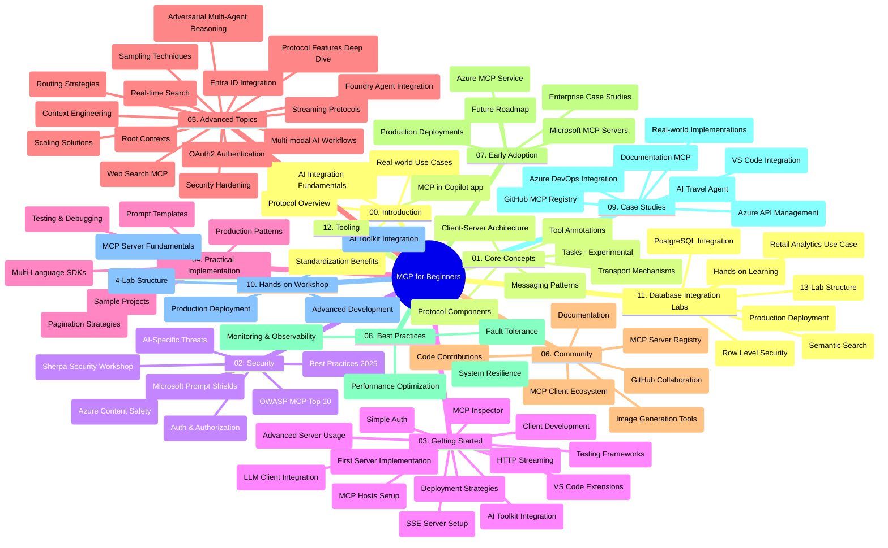

# Model Context Protocol (MCP) for Beginners - Study Guide

Dis study guide dey give overview of di repository structure and content for di "Model Context Protocol (MCP) for Beginners" curriculum. Use dis guide to waka well for di repository and make di beta use of di resources wey dey.

## Repository Overview

Di Model Context Protocol (MCP) na standardized framework for interaction between AI models and client applications. E first start from Anthropic, but now di whole MCP community dey manage am through di official GitHub organization. Dis repository get full curriculum wit hands-on code examples for C#, Java, JavaScript, Python, and TypeScript, wey dem design for AI developers, system architects, and software engineers.

## Visual Curriculum Map

## Repository Structure

Di repository organize into twelve main sections, each one dey focus on different parts of MCP:

1. **Introduction (00-Introduction/)**
   - Overview of di Model Context Protocol
   - Why standardization important for AI pipelines
   - Practical use cases and benefits

2. **Core Concepts (01-CoreConcepts/)**
   - Client-server architecture
   - Key protocol components
   - Messaging patterns for MCP
   - Forward-look: [Wetn dey change for MCP: The 2026-07-28 Release Candidate](./01-CoreConcepts/mcp-2026-07-28-release-candidate.md) — di stateless protocol core, Extensions framework, and Roots/Sampling/Logging wey dem go stop for di next specification version

3. **Security (02-Security/)**
   - Security wahala for MCP-based systems
   - Best ways to secure how dem build am
   - Authentication and authorization strategies
   - **Complete Security Documentation**:
     - MCP Security Best Practices 2025
     - Azure Content Safety Implementation Guide
     - MCP Security Controls and Techniques
     - MCP Best Practices Quick Reference
   - **Key Security Topics**:
     - Prompt injection and tool poisoning attacks
     - Session hijacking and confused deputy problems
     - Token passthrough weaknesses
     - Too much permission and access control
     - Supply chain security for AI parts
     - Microsoft Prompt Shields integration

4. **Getting Started (03-GettingStarted/)**
   - How to set environment and configure am
   - How to make basic MCP servers and clients
   - How to join am with existing apps
   - E get sections for:
     - First server implementation
     - Client development
     - LLM client integration
     - VS Code integration
     - Server-Sent Events (SSE) server
     - Advanced server use
     - HTTP streaming
     - AI Toolkit integration
     - Testing ways
     - Deployment instructions

5. **Practical Implementation (04-PracticalImplementation/)**
   - How to use SDKs for different programming languages
   - Debugging, testing, and checking methods
   - How to make reusable prompt templates and workflows
   - Sample projects with implementation examples

6. **Advanced Topics (05-AdvancedTopics/)**
   - Context engineering ways
   - Foundry agent integration
   - Multi-modal AI workflows 
   - OAuth2 authentication demo
   - Real-time search sabi
   - Real-time streaming
   - Root contexts implementation
   - Routing plans
   - Sampling ways
   - Scaling methods
   - Security matters
   - Entra ID security join
   - Web search integration
   - Adversarial multi-agent reasoning (debate patterns)

7. **Community Contributions (06-CommunityContributions/)**
   - How to put code and documentation
   - Collaborate for GitHub
   - Community-driven improvements and feedback
   - How to use different MCP clients (Claude Desktop, Cline, VSCode)
   - Work wit popular MCP servers including image generation

8. **Lessons from Early Adoption (07-LessonsfromEarlyAdoption/)**
   - Real implementations and success stories
   - How to build and put MCP-based solutions for work
   - Trends and future plans
   - **Microsoft MCP Servers Guide**: Complete guide to 10 Microsoft MCP servers wey ready for production:
     - Microsoft Learn Docs MCP Server
     - Azure MCP Server (15+ special connectors)
     - GitHub MCP Server
     - Azure DevOps MCP Server
     - MarkItDown MCP Server
     - SQL Server MCP Server
     - Playwright MCP Server
     - Dev Box MCP Server
     - Microsoft Foundry MCP Server
     - Microsoft 365 Agents Toolkit MCP Server

9. **Best Practices (08-BestPractices/)**
   - How to tune performance and optimize am
   - How to design fault-tolerant MCP systems
   - Testing and resilience methods

10. **Case Studies (09-CaseStudy/)**
    - **Seven complete case studies** wey show how MCP fit work for many different things:
    - **Azure AI Travel Agents**: Multi-agent arrangement with Azure OpenAI and AI Search
    - **Azure DevOps Integration**: Automate workflow process with YouTube data update
    - **Real-Time Documentation Retrieval**: Python console client wit streaming HTTP
    - **Interactive Study Plan Generator**: Chainlit web app wit conversational AI
    - **In-Editor Documentation**: VS Code join GitHub Copilot workflows
    - **Azure API Management**: Enterprise API join MCP server make am
    - **GitHub MCP Registry**: Ecosystem build and agentic join platform
    - Implementation examples wey cover enterprise integration, developer productivity, and ecosystem growth

11. **Hands-on Workshop (10-StreamliningAIWorkflowsBuildingAnMCPServerWithAIToolkit/)**
    - Full hands-on workshop join MCP with AI Toolkit
    - Build clever apps wey join AI models with real tools
    - Practical lessons covering basics, custom server build, and production deployment ways
    - **Lab Structure**:
      - Lab 1: MCP Server Basics
      - Lab 2: Advanced MCP Server Development
      - Lab 3: AI Toolkit Integration
      - Lab 4: Production Deployment and Scaling
    - Lab-based learning wit step-by-step instructions

12. **MCP Server Database Integration Labs (11-MCPServerHandsOnLabs/)**
    - **Complete 13-lab learning path** for build production-ready MCP servers join PostgreSQL
    - **Real-world retail analytics use** wit Zava Retail example
    - **Enterprise-grade patterns** like Row Level Security (RLS), semantic search, and multi-tenant data access
    - **Complete Lab Structure**:
      - **Labs 00-03: Foundations** - Introduction, Architecture, Security, Environment Setup
      - **Labs 04-06: Build MCP Server** - Database Design, MCP Server Implementation, Tool Development
      - **Labs 07-09: Advanced Features** - Semantic Search, Testing & Debugging, VS Code Integration
      - **Labs 10-12: Production & Best Practices** - Deployment, Monitoring, Optimization
    - **Technologies Covered**: FastMCP framework, PostgreSQL, Azure OpenAI, Azure Container Apps, Application Insights
    - **Learning Results**: Production-ready MCP servers, database integration methods, AI-powered analytics, enterprise security

13. **Tooling (12-tooling/)**
    - Learn how to use MCP inside Copilot app and other tools

## Additional Resources

Di repository get supporting resources:

- **Images folder**: Get diagrams and pictures wey dem use throughout di curriculum
- **Translations**: Multi-language support wit automated documentation translations
- **Official MCP Resources**:
  - [MCP Documentation](https://modelcontextprotocol.io/)
  - [MCP Specification](https://spec.modelcontextprotocol.io/)
  - [MCP GitHub Repository](https://github.com/modelcontextprotocol)

## How to Use This Repository

1. **Sequential Learning**: Follow di chapters for order (00 to 11) make learning good.
2. **Language-Specific Focus**: If you like one particular programming language, look samples directory for how dem implement for your language.
3. **Practical Implementation**: Start with "Getting Started" section to set your environment and make your first MCP server and client.
4. **Advanced Exploration**: When you sabi basics well, enter advanced topics to increase your knowledge.
5. **Community Engagement**: Join di MCP community through GitHub discussions and Discord channels to connect with experts and other developers.

## MCP Clients and Tools

Di curriculum show di different MCP clients and tools:

1. **Official Clients**:
   - Visual Studio Code 
   - MCP for Visual Studio Code
   - Claude Desktop
   - Claude for VSCode 
   - Claude API

2. **Community Clients**:
   - Cline (terminal-based)
   - Cursor (code editor)
   - ChatMCP
   - Windsurf

3. **MCP Management Tools**:
   - MCP CLI
   - MCP Manager
   - MCP Linker
   - MCP Router

## Popular MCP Servers

Di repository show different MCP servers, including:

1. **Official Microsoft MCP Servers**:
   - Microsoft Learn Docs MCP Server
   - Azure MCP Server (15+ special connectors)
   - GitHub MCP Server
   - Azure DevOps MCP Server
   - MarkItDown MCP Server
   - SQL Server MCP Server
   - Playwright MCP Server
   - Dev Box MCP Server
   - Microsoft Foundry MCP Server
   - Microsoft 365 Agents Toolkit MCP Server

2. **Official Reference Servers**:
   - Filesystem
   - Fetch
   - Memory
   - Sequential Thinking

3. **Image Generation**:
   - Azure OpenAI DALL-E 3
   - Stable Diffusion WebUI
   - Replicate

4. **Development Tools**:
   - Git MCP
   - Terminal Control
   - Code Assistant

5. **Specialized Servers**:
   - Salesforce
   - Microsoft Teams
   - Jira & Confluence

## Contributing

Dis repository dey welcome contributions from di community. Refer to di Community Contributions section to sabi how to contribute well to di MCP ecosystem.

----

*Dis study guide last update na February 5, 2026, e reflect di latest MCP Specification 2025-11-25 and e give overview of di repository till dat day. Di repository content fit update after dat day.*

*Addendum (July 2, 2026): one lesson on di `2026-07-28` MCP Specification Release Candidate don add for [01-CoreConcepts](./01-CoreConcepts/mcp-2026-07-28-release-candidate.md); di curriculum base remain 2025-11-25 till new specification show.*

---

<!-- CO-OP TRANSLATOR DISCLAIMER START -->
**Disclaimer**:
Dis document don translate wit AI translation service [Co-op Translator](https://github.com/Azure/co-op-translator). Even tho we dey try make am correct, abeg make you know say automated translation fit get errors or mistakes. Di original document for dia own language na im be di correct source. For important info, make person wey sabi human translation do am. We no go responsible for any misunderstanding or wrong understanding wey fit happen because of dis translation.
<!-- CO-OP TRANSLATOR DISCLAIMER END -->