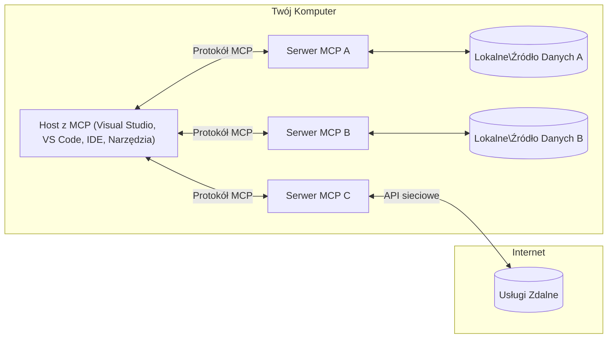

# Podstawowe koncepcje MCP: Opanowanie Model Context Protocol dla integracji AI

[](https://youtu.be/earDzWGtE84)

_(Kliknij powyższy obraz, aby obejrzeć film z tej lekcji)_

[Model Context Protocol (MCP)](https://github.com/modelcontextprotocol) to potężne, ustandaryzowane środowisko, które optymalizuje komunikację między dużymi modelami językowymi (LLM) a zewnętrznymi narzędziami, aplikacjami i źródłami danych.  
Ten przewodnik przeprowadzi Cię przez podstawowe koncepcje MCP. Poznasz jego architekturę klient-serwer, kluczowe komponenty, mechanikę komunikacji i najlepsze praktyki implementacyjne.

- **Wyraźna zgoda użytkownika**: Wszystkie dostępy do danych i operacje wymagają wyraźnej zgody użytkownika przed wykonaniem. Użytkownicy muszą dokładnie rozumieć, do jakich danych będzie uzyskiwany dostęp i jakie działania zostaną wykonane, z możliwością szczegółowego sterowania uprawnieniami i autoryzacjami.

- **Ochrona prywatności danych**: Dane użytkownika są ujawniane tylko za wyraźną zgodą i muszą być chronione przez solidne mechanizmy kontroli dostępu przez cały cykl życia interakcji. Implementacje muszą zapobiegać nieautoryzowanemu przesyłowi danych i utrzymywać ścisłe granice prywatności.

- **Bezpieczeństwo wykonywania narzędzi**: Każde wywołanie narzędzia wymaga wyraźnej zgody użytkownika z jasnym zrozumieniem funkcjonalności narzędzia, parametrów i potencjalnego wpływu. Solidne granice bezpieczeństwa muszą zapobiegać niezamierzonemu, niebezpiecznemu lub złośliwemu wykonaniu narzędzi.

- **Bezpieczeństwo warstwy transportowej**: Wszystkie kanały komunikacji powinny stosować odpowiednie mechanizmy szyfrowania i uwierzytelniania. Połączenia zdalne powinny wykorzystywać bezpieczne protokoły transportowe oraz właściwe zarządzanie poświadczeniami.

#### Wytyczne implementacyjne:

- **Zarządzanie uprawnieniami**: Stosuj systemy precyzyjnej kontroli uprawnień pozwalające użytkownikom kontrolować, które serwery, narzędzia i zasoby są dostępne  
- **Uwierzytelnianie i autoryzacja**: Używaj bezpiecznych metod uwierzytelniania (OAuth, klucze API) z właściwym zarządzaniem tokenami i wygasaniem  
- **Walidacja danych wejściowych**: Waliduj wszystkie parametry i dane wejściowe według zdefiniowanych schematów, aby zapobiec atakom typu injection  
- **Rejestrowanie audytu**: Utrzymuj kompleksowe logi wszystkich operacji do monitoringu bezpieczeństwa i zgodności

## Przegląd

Ta lekcja bada fundamentalną architekturę i komponenty tworzące ekosystem Model Context Protocol (MCP). Dowiesz się o architekturze klient-serwer, kluczowych komponentach oraz mechanizmach komunikacji, które napędzają interakcje MCP.

## Kluczowe cele nauki

Po zakończeniu tej lekcji będziesz potrafił:

- Rozumieć architekturę klient-serwer MCP.  
- Określić role i obowiązki Hostów, Klientów oraz Serwerów.  
- Analizować kluczowe cechy, które czynią MCP elastyczną warstwą integracyjną.  
- Poznać przepływ informacji w ekosystemie MCP.  
- Zdobyć praktyczną wiedzę poprzez przykłady kodu w .NET, Java, Python i JavaScript.

## Architektura MCP: głębsze spojrzenie

Ekosystem MCP opiera się na modelu klient-serwer. Ta modularna struktura pozwala aplikacjom AI efektywnie współdziałać z narzędziami, bazami danych, API i zasobami kontekstowymi. Rozłóżmy tę architekturę na jej podstawowe komponenty.

U podstaw MCP leży architektura klient-serwer, gdzie aplikacja hostująca może łączyć się z wieloma serwerami:



- **Hosty MCP**: Programy takie jak VSCode, Claude Desktop, IDE lub narzędzia AI, które chcą uzyskać dostęp do danych przez MCP  
- **Klienci MCP**: Klienci protokołu utrzymujący połączenia 1:1 z serwerami  
- **Serwery MCP**: Lekkie programy, które udostępniają konkretne funkcje przez ustandaryzowany Model Context Protocol  
- **Lokalne źródła danych**: Pliki, bazy danych i usługi na komputerze, do których serwery MCP mają bezpieczny dostęp  
- **Zdalne usługi**: Zewnętrzne systemy dostępne przez internet, do których serwery MCP mogą łączyć się przez API.

Protokół MCP to rozwijany standard wykorzystujący wersjonowanie oparte na dacie (format RRRR-MM-DD). Obecna wersja protokołu to **2025-11-25**. Najnowsze aktualizacje specyfikacji znajdziesz pod [specyfikacją protokołu](https://modelcontextprotocol.io/specification/2025-11-25/).

> **Spoglądając w przyszłość:** kandydująca wersja następnej specyfikacji, **2026-07-28**, została ogłoszona w maju 2026 i jest planowana na 28 lipca 2026. Zmienia protokół na bezstanowy w warstwie transportowej (usuwając handshake `initialize` i ID sesji), formalizuje ramy rozszerzeń i deprecjonuje Roots, Sampling oraz Logging na rzecz nowych wzorców. Pełne omówienie znajdziesz w [Co się zmienia w MCP: kandydat na wydanie 2026-07-28](./mcp-2026-07-28-release-candidate.md).

### 1. Hosty

W Model Context Protocol (MCP), **Hosty** to aplikacje AI, które pełnią rolę głównego interfejsu, przez który użytkownicy wchodzą w interakcje z protokołem. Hosty koordynują i zarządzają połączeniami z wieloma serwerami MCP, tworząc dedykowanych klientów MCP dla każdego połączenia z serwerem. Przykłady Hostów to:

- **Aplikacje AI**: Claude Desktop, Visual Studio Code, Claude Code  
- **Środowiska programistyczne**: IDE i edytory kodu z integracją MCP  
- **Aplikacje niestandardowe**: Specjalnie zaprojektowane agenty i narzędzia AI

**Hosty** to aplikacje koordynujące interakcje modeli AI. One:

- **Orkiestrują modele AI**: Wykonują lub współdziałają z LLM, aby generować odpowiedzi i koordynować workflow AI  
- **Zarządzają klientami**: Tworzą i utrzymują jednego klienta MCP na każde połączenie z serwerem MCP  
- **Kontrolują interfejs użytkownika**: Obsługują przebieg rozmowy, interakcje oraz prezentację odpowiedzi  
- **Egzekwują bezpieczeństwo**: Kontrolują uprawnienia, ograniczenia bezpieczeństwa i uwierzytelnianie  
- **Obsługują zgodę użytkownika**: Zarządzają akceptacją użytkownika do udostępniania danych i wykonywania narzędzi

### 2. Klienci

**Klienci** to podstawowe komponenty utrzymujące dedykowane połączenia jeden do jednego między Hostami a serwerami MCP. Każdy klient MCP jest tworzony przez Host, aby połączyć się z konkretnym serwerem MCP, zapewniając uporządkowane i bezpieczne kanały komunikacji. Wielu klientów pozwala Hostom łączyć się z wieloma serwerami jednocześnie.

**Klienci** to łącznikowe komponenty w aplikacji hosta. One:

- **Komunikacja protokołu**: Wysyłają żądania JSON-RPC 2.0 do serwerów z promptami i instrukcjami  
- **Negocjacja możliwości**: Negocjują obsługiwane funkcje i wersje protokołu z serwerami podczas inicjalizacji  
- **Wykonywanie narzędzi**: Zarządzają żądaniami wykonania narzędzi od modeli i przetwarzają odpowiedzi  
- **Aktualizacje w czasie rzeczywistym**: Obsługują powiadomienia i aktualizacje w czasie rzeczywistym od serwerów  
- **Przetwarzanie odpowiedzi**: Przetwarzają i formatują odpowiedzi serwera do wyświetlania użytkownikom

### 3. Serwery

**Serwery** to programy dostarczające kontekst, narzędzia i możliwości klientom MCP. Mogą działać lokalnie (na tej samej maszynie co Host) lub zdalnie (na zewnętrznych platformach) i odpowiadają za obsługę żądań klientów oraz dostarczanie ustrukturyzowanych odpowiedzi. Serwery udostępniają określoną funkcjonalność przez ustandaryzowany Model Context Protocol.

**Serwery** to usługi zapewniające kontekst i możliwości. One:

- **Rejestracja możliwości**: Rejestrują i udostępniają dostępne prymitywy (zasoby, prompty, narzędzia) klientom  
- **Przetwarzanie żądań**: Odbierają i wykonują wywołania narzędzi, żądania zasobów i promptów od klientów  
- **Dostarczanie kontekstu**: Zapewniają informacje kontekstowe i dane poprawiające odpowiedzi modelu  
- **Zarządzanie stanem**: Utrzymują stan sesji i obsługują interakcje stanowe, jeśli to konieczne  
- **Powiadomienia w czasie rzeczywistym**: Wysyłają powiadomienia o zmianach możliwości i aktualizacjach do podłączonych klientów

Serwery mogą być tworzone przez kogokolwiek w celu rozbudowy możliwości modeli o specjalistyczną funkcjonalność i obsługują scenariusze wdrożeń lokalnych oraz zdalnych.

### 4. Prymitywy serwera

Serwery w Model Context Protocol (MCP) udostępniają trzy podstawowe **prymitywy**, które definiują fundamentalne elementy bogatych interakcji między klientami, hostami i modelami językowymi. Prymitywy te określają typy informacji kontekstowej i działań dostępnych przez protokół.

Serwery MCP mogą udostępniać dowolne połączenie następujących trzech prymitywów:

#### Zasoby

**Zasoby** to źródła danych dostarczające kontekstowe informacje do aplikacji AI. Reprezentują statyczną lub dynamiczną zawartość mogącą wzbogacić rozumienie i podejmowanie decyzji przez modele:

- **Dane kontekstowe**: Ustrukturyzowane informacje i kontekst do zużycia przez model AI  
- **Bazy wiedzy**: Repozytoria dokumentów, artykuły, podręczniki i prace badawcze  
- **Lokalne źródła danych**: Pliki, bazy danych i lokalne informacje systemowe  
- **Dane zewnętrzne**: Odpowiedzi API, usługi webowe i dane systemów zdalnych  
- **Zawartość dynamiczna**: Dane w czasie rzeczywistym aktualizowane na podstawie warunków zewnętrznych

Zasoby są identyfikowane przez URI i wspierają wykrywanie przez metody `resources/list` oraz pobieranie przez `resources/read`:

```text
file://documents/project-spec.md
database://production/users/schema
api://weather/current
```

#### Prompty

**Prompty** to wielokrotnego użytku szablony, które pomagają strukturyzować interakcje z modelami językowymi. Dostarczają ustandaryzowane wzorce interakcji i szablonowane workflow:

- **Interakcje oparte na szablonach**: Wstępnie ustrukturyzowane wiadomości i rozpoczęcia rozmów  
- **Szablony workflow**: Ustandaryzowane sekwencje dla popularnych zadań i interakcji  
- **Przykłady few-shot**: Szablony oparte na przykładach do instrukcji modelu  
- **Prompty systemowe**: Podstawowe promptu definiujące zachowanie i kontekst modelu  
- **Szablony dynamiczne**: Parametryzowane prompty dopasowujące się do konkretnych kontekstów

Prompty wspierają podstawianie zmiennych i mogą być odkrywane przez `prompts/list` oraz pobierane za pomocą `prompts/get`:

```markdown
Generate a {{task_type}} for {{product}} targeting {{audience}} with the following requirements: {{requirements}}
```

#### Narzędzia

**Narzędzia** to wykonywalne funkcje, które modele AI mogą wywoływać w celu wykonania określonych działań. Reprezentują „czasowniki” ekosystemu MCP, umożliwiając modelom interakcję z systemami zewnętrznymi:

- **Funkcje wykonywalne**: Oddzielne operacje, które modele mogą wywołać z konkretnymi parametrami  
- **Integracja systemów zewnętrznych**: Wywołania API, zapytania do baz danych, operacje na plikach, obliczenia  
- **Unikalna tożsamość**: Każde narzędzie posiada unikatową nazwę, opis oraz schemat parametrów  
- **Ustrukturyzowany I/O**: Narzędzia przyjmują zwalidowane parametry i zwracają ustrukturyzowane, typowane odpowiedzi  
- **Możliwości działania**: Pozwalają modelom wykonywać działania w świecie rzeczywistym i pobierać dane na żywo

Narzędzia są definiowane ze schematem JSON dla walidacji parametrów oraz odkrywane przez `tools/list` i wywoływane za pomocą `tools/call`. Narzędzia mogą także zawierać **ikony** jako dodatkowe metadane dla lepszej prezentacji UI.

**Adnotacje narzędzi**: Narzędzia wspierają adnotacje behawioralne (np. `readOnlyHint`, `destructiveHint`), które opisują czy narzędzie jest tylko do odczytu lub destrukcyjne, pomagając klientom podejmować świadome decyzje o wykonaniu narzędzia.

Przykład definicji narzędzia:

```typescript
server.tool(
  "search_products", 
  {
    query: z.string().describe("Search query for products"),
    category: z.string().optional().describe("Product category filter"),
    max_results: z.number().default(10).describe("Maximum results to return")
  }, 
  async (params) => {
    // Wykonaj wyszukiwanie i zwróć uporządkowane wyniki
    return await productService.search(params);
  }
);
```

## Prymitywy klienta

W Model Context Protocol (MCP), **klienci** mogą udostępniać prymitywy, które umożliwiają serwerom żądanie dodatkowych funkcji od aplikacji hostującej. Te prymitywy po stronie klienta pozwalają na bardziej rozbudowane, interaktywne implementacje serwerowe, które mogą uzyskiwać dostęp do możliwości modelu AI oraz interakcji użytkownika.

### Sampling

> **Informacja o deprecjacji:** kandydująca wersja `2026-07-28` oznacza Sampling jako przestarzały na rzecz bezpośredniej integracji z API dostawców LLM. Działa dalej w `2025-11-25` i co najmniej przez rok po deprecjacji, ale nowe projekty powinny preferować nowy wzorzec. Zobacz [Co się zmienia w MCP: kandydat na wydanie 2026-07-28](./mcp-2026-07-28-release-candidate.md).

**Sampling** pozwala serwerom żądać wygenerowania uzupełnień modeli językowych od klienta. Ten prymityw umożliwia serwerom dostęp do możliwości LLM bez osadzania własnych zależności modeli:

- **Dostęp niezależny od modelu**: Serwery mogą żądać uzupełnień bez dołączania SDK LLM lub zarządzania dostępem do modelu  
- **Serwer inicjuje AI**: Umożliwia serwerom samodzielne generowanie treści przy użyciu modelu AI klienta  
- **Rekurencyjne interakcje LLM**: Wspiera skomplikowane scenariusze wymagające pomocy AI dla przetwarzania  
- **Dynamiczne generowanie treści**: Pozwala serwerom tworzyć kontekstowe odpowiedzi korzystając z modelu hosta  
- **Wsparcie wywołania narzędzi**: Serwery mogą dołączać parametry `tools` i `toolChoice`, by pozwolić modelowi klienta wywoływać narzędzia podczas generowania

Sampling jest uruchamiany poprzez metodę `sampling/complete`, gdzie serwery wysyłają żądania generowania do klientów.

### Roots

> **Informacja o deprecjacji:** kandydująca wersja `2026-07-28` oznacza Roots jako przestarzałe na rzecz parametrów narzędzi, URI zasobów lub konfiguracji serwera. Działa dalej w `2025-11-25` i co najmniej przez rok po deprecjacji. Zobacz [Co się zmienia w MCP: kandydat na wydanie 2026-07-28](./mcp-2026-07-28-release-candidate.md).

**Roots** dostarczają ustandaryzowany sposób dla klientów na eksponowanie granic systemu plików względem serwerów, pomagając serwerom zrozumieć, do których katalogów i plików mają dostęp:

- **Granice systemu plików**: Definiują granice, gdzie serwery mogą operować w systemie plików  
- **Kontrola dostępu**: Pomagają serwerom rozpoznać, do których katalogów i plików mają uprawnienia  
- **Dynamiczne aktualizacje**: Klienci mogą powiadamiać serwery, gdy lista roots ulega zmianie  
- **Identyfikacja oparta na URI**: Roots używają URI `file://` do identyfikowania dostępnych katalogów i plików

Roots są odkrywane metodą `roots/list`, a klienci wysyłają `notifications/roots/list_changed` gdy roots ulegają zmianie.

### Elicitation  

**Elicitation** pozwala serwerom na żądanie dodatkowych informacji lub potwierdzenia od użytkowników za pośrednictwem interfejsu klienta:

- **Prośby o dane od użytkownika**: Serwery mogą prosić o dodatkowe informacje potrzebne do wykonania narzędzia  
- **Okna potwierdzeń**: Żądają zgody użytkownika na operacje wrażliwe lub ważne  
- **Interaktywne workflow**: Umożliwiają tworzenie krok po kroku interakcji z użytkownikiem  
- **Dynamiczne zbieranie parametrów**: Zbiera brakujące lub opcjonalne parametry podczas wykonywania narzędzi

Żądania elicitacji wykonywane są za pomocą metody `elicitation/request` w celu zebrania danych przez interfejs klienta.

**Elicitation w trybie URL**: Serwery mogą również prosić o interakcje użytkownika oparte na URL, co pozwala przekierować użytkowników na zewnętrzne strony www do uwierzytelniania, potwierdzenia lub wprowadzania danych.

### Logging
> **Powiadomienie o deprecjacji:** kandydat do wydania `2026-07-28` oznacza Logging jako przestarzały na rzecz `stderr` dla transportów stdio oraz OpenTelemetry dla strukturalnej obserwowalności. Logowanie nadal działa w wersji `2025-11-25` oraz przez co najmniej rok po każdej deprecjacji. Zobacz [Co się zmienia w MCP: Kandydat do wydania 2026-07-28](./mcp-2026-07-28-release-candidate.md).

**Logowanie** pozwala serwerom wysyłać do klientów ustrukturyzowane komunikaty logów do debugowania, monitorowania i widoczności operacyjnej:

- **Wsparcie debugowania**: umożliwia serwerom dostarczanie szczegółowych logów wykonania do rozwiązywania problemów
- **Monitorowanie operacyjne**: wysyłanie aktualizacji statusu i metryk wydajności do klientów
- **Raportowanie błędów**: dostarczanie szczegółowego kontekstu błędów oraz informacji diagnostycznych
- **Ścieżki audytu**: tworzenie kompleksowych logów operacji i decyzji serwera

Komunikaty logowania są wysyłane do klientów, aby zapewnić przejrzystość operacji serwera i ułatwić debugowanie.

## Przepływ informacji w MCP

Model Context Protocol (MCP) definiuje ustrukturyzowany przepływ informacji pomiędzy hostami, klientami, serwerami i modelami. Zrozumienie tego przepływu pomaga wyjaśnić, jak są przetwarzane żądania użytkownika oraz jak zewnętrzne narzędzia i dane są integrowane w odpowiedziach modelu.

- **Host inicjuje połączenie**  
  Aplikacja hostująca (np. IDE lub interfejs czatu) nawiązuje połączenie z serwerem MCP, zwykle za pomocą STDIO, WebSocket lub innego obsługiwanego transportu.

- **Negocjacja możliwości**  
  Klient (osadzony w hoście) i serwer wymieniają informacje o swoich wspieranych funkcjach, narzędziach, zasobach oraz wersjach protokołu. Zapewnia to, że obie strony rozumieją dostępne możliwości sesji.

- **Żądanie użytkownika**  
  Użytkownik komunikuje się z hostem (np. wpisuje polecenie lub prompt). Host zbiera te dane i przekazuje je do klienta do przetwarzania.

- **Użycie zasobów lub narzędzi**  
  - Klient może zażądać dodatkowego kontekstu lub zasobów od serwera (np. plików, wpisów w bazie danych, artykułów z bazy wiedzy), aby wzbogacić rozumienie modelu.  
  - Jeśli model ustali, że potrzebne jest użycie narzędzia (np. pobranie danych, wykonanie obliczenia, wywołanie API), klient wysyła do serwera żądanie wywołania narzędzia z nazwą narzędzia i parametrami.

- **Wykonanie przez serwer**  
  Serwer odbiera żądanie zasobu lub narzędzia, wykonuje niezbędne operacje (np. uruchomienie funkcji, zapytanie bazy danych, pobranie pliku) i zwraca wyniki klientowi w ustrukturyzowanym formacie.

- **Generowanie odpowiedzi**  
  Klient integruje odpowiedzi serwera (dane zasobów, wyniki narzędzi itd.) z prowadzoną interakcją modelową. Model wykorzystuje te informacje do wygenerowania wyczerpującej i kontekstowo relewantnej odpowiedzi.

- **Prezentacja wyniku**  
  Host otrzymuje końcowy rezultat od klienta i przedstawia go użytkownikowi, często obejmując zarówno wygenerowany tekst modelu, jak i wszelkie wyniki wywołań narzędzi lub odczytów zasobów.

Ten proces pozwala MCP wspierać zaawansowane, interaktywne i świadome kontekstu aplikacje AI przez bezproblemowe łączenie modeli z zewnętrznymi narzędziami i źródłami danych.

## Architektura i warstwy protokołu

MCP składa się z dwóch odrębnych warstw architektonicznych, które współpracują, aby dostarczyć kompletny framework komunikacyjny:

### Warstwa danych

**Warstwa danych** implementuje podstawowy protokół MCP bazując na **JSON-RPC 2.0**. Ta warstwa definiuje strukturę wiadomości, semantykę i wzorce interakcji:

#### Główne komponenty:

- **Protokół JSON-RPC 2.0**: Cała komunikacja używa standardowego formatu wiadomości JSON-RPC 2.0 do wywołań metod, odpowiedzi i powiadomień
- **Zarządzanie cyklem życia**: Obsługuje inicjację połączenia, negocjację możliwości i zakończenie sesji między klientami a serwerami
- **Prymitywy serwera**: Umożliwia serwerom dostarczanie podstawowej funkcjonalności przez narzędzia, zasoby i prompt’y
- **Prymitwy klienta**: Umożliwia serwerom żądanie próbkowania z LLM, wywoływanie interfejsu użytkownika oraz wysyłanie komunikatów dziennika
- **Powiadomienia w czasie rzeczywistym**: Obsługuje asynchroniczne powiadomienia dla dynamicznych aktualizacji bez konieczności odpytywania

#### Kluczowe cechy:

- **Negocjacja wersji protokołu**: Używa wersji datowanych (RRRR-MM-DD) dla zapewnienia kompatybilności
- **Odkrywanie możliwości**: Klienci i serwery wymieniają się obsługiwanymi funkcjami podczas inicjalizacji
- **Sesje ze stanem**: Utrzymuje stan połączenia przez wiele interakcji, zapewniając ciągłość kontekstu

### Warstwa transportu

**Warstwa transportu** zarządza kanałami komunikacyjnymi, formowaniem wiadomości i uwierzytelnianiem między uczestnikami MCP:

#### Obsługiwane mechanizmy transportu:

1. **Transport STDIO**:
   - Wykorzystuje standardowe strumienie wejścia/wyjścia do bezpośredniej komunikacji procesów
   - Optymalny dla procesów lokalnych na tej samej maszynie, bez narzutu sieciowego
   - Powszechnie używany w lokalnych implementacjach serwerów MCP

2. **Transport HTTP strumieniowalny**:
   - Wykorzystuje HTTP POST do wysyłania wiadomości klient->serwer  
   - Opcjonalne Server-Sent Events (SSE) do strumieniowania serwer->klient
   - Umożliwia komunikację zdalną między serwerami przez sieć
   - Wspiera standardowe uwierzytelnianie HTTP (tokeny dostępu, klucze API, niestandardowe nagłówki)
   - MCP rekomenduje OAuth dla bezpiecznego uwierzytelniania tokenowego

#### Abstrakcja transportu:

Warstwa transportu abstrahuje szczegóły komunikacji od warstwy danych, umożliwiając ten sam format wiadomości JSON-RPC 2.0 dla wszystkich mechanizmów transportu. Ta abstrakcja pozwala aplikacjom na płynną zmianę między lokalnymi a zdalnymi serwerami.

### Rozważania bezpieczeństwa

Implementacje MCP muszą przestrzegać kluczowych zasad bezpieczeństwa, aby zapewnić bezpieczne, zaufane i chronione interakcje w całym protokole:

- **Zgoda i kontrola użytkownika**: Użytkownicy muszą wyrazić wyraźną zgodę przed dostępem do danych lub wykonaniem operacji. Powinni mieć jasną kontrolę, jakie dane są udostępniane i które działania są zatwierdzane, wspierane przez intuicyjne interfejsy użytkownika do przeglądu i akceptacji aktywności.

- **Prywatność danych**: Dane użytkownika powinny być udostępniane tylko za wyraźną zgodą i chronione odpowiednimi mechanizmami kontroli dostępu. Implementacje MCP muszą zabezpieczyć się przed nieautoryzowanym przesyłaniem danych i zapewnić zachowanie prywatności przez cały czas interakcji.

- **Bezpieczeństwo narzędzi**: Przed wywołaniem jakiegokolwiek narzędzia wymagana jest wyraźna zgoda użytkownika. Użytkownicy powinni mieć jasne zrozumienie funkcjonalności każdego narzędzia, a granice bezpieczeństwa muszą być rygorystycznie egzekwowane, aby zapobiec niezamierzonemu lub niebezpiecznemu wykonaniu narzędzi.

Przestrzegając tych zasad bezpieczeństwa, MCP zapewnia zaufanie, prywatność i bezpieczeństwo użytkowników we wszystkich interakcjach protokołu, jednocześnie umożliwiając potężne integracje AI.

## Przykłady kodu: Kluczowe komponenty

Poniżej znajdują się przykłady kodu w kilku popularnych językach programowania ilustrujące implementację kluczowych komponentów serwera MCP oraz narzędzi.

### Przykład .NET: Tworzenie prostego serwera MCP z narzędziami

Praktyczny przykład kodu .NET demonstrujący implementację prostego serwera MCP z niestandardowymi narzędziami. Pokazuje, jak definiować i rejestrować narzędzia, obsługiwać żądania oraz łączyć serwer z Model Context Protocol.

```csharp
using System;
using System.Threading.Tasks;
using ModelContextProtocol.Server;
using ModelContextProtocol.Server.Transport;
using ModelContextProtocol.Server.Tools;

public class WeatherServer
{
    public static async Task Main(string[] args)
    {
        // Create an MCP server
        var server = new McpServer(
            name: "Weather MCP Server",
            version: "1.0.0"
        );
        
        // Register our custom weather tool
        server.AddTool<string, WeatherData>("weatherTool", 
            description: "Gets current weather for a location",
            execute: async (location) => {
                // Call weather API (simplified)
                var weatherData = await GetWeatherDataAsync(location);
                return weatherData;
            });
        
        // Connect the server using stdio transport
        var transport = new StdioServerTransport();
        await server.ConnectAsync(transport);
        
        Console.WriteLine("Weather MCP Server started");
        
        // Keep the server running until process is terminated
        await Task.Delay(-1);
    }
    
    private static async Task<WeatherData> GetWeatherDataAsync(string location)
    {
        // This would normally call a weather API
        // Simplified for demonstration
        await Task.Delay(100); // Simulate API call
        return new WeatherData { 
            Temperature = 72.5,
            Conditions = "Sunny",
            Location = location
        };
    }
}

public class WeatherData
{
    public double Temperature { get; set; }
    public string Conditions { get; set; }
    public string Location { get; set; }
}
```

### Przykład Java: Komponenty serwera MCP

Ten przykład demonstruje ten sam serwer MCP i rejestrację narzędzi co wyżej w .NET, ale zaimplementowany w Javie.

```java
import io.modelcontextprotocol.server.McpServer;
import io.modelcontextprotocol.server.McpToolDefinition;
import io.modelcontextprotocol.server.transport.StdioServerTransport;
import io.modelcontextprotocol.server.tool.ToolExecutionContext;
import io.modelcontextprotocol.server.tool.ToolResponse;

public class WeatherMcpServer {
    public static void main(String[] args) throws Exception {
        // Utwórz serwer MCP
        McpServer server = McpServer.builder()
            .name("Weather MCP Server")
            .version("1.0.0")
            .build();
            
        // Zarejestruj narzędzie pogodowe
        server.registerTool(McpToolDefinition.builder("weatherTool")
            .description("Gets current weather for a location")
            .parameter("location", String.class)
            .execute((ToolExecutionContext ctx) -> {
                String location = ctx.getParameter("location", String.class);
                
                // Pobierz dane pogodowe (uproszczone)
                WeatherData data = getWeatherData(location);
                
                // Zwróć sformatowaną odpowiedź
                return ToolResponse.content(
                    String.format("Temperature: %.1f°F, Conditions: %s, Location: %s", 
                    data.getTemperature(), 
                    data.getConditions(), 
                    data.getLocation())
                );
            })
            .build());
        
        // Połącz serwer używając transportu stdio
        try (StdioServerTransport transport = new StdioServerTransport()) {
            server.connect(transport);
            System.out.println("Weather MCP Server started");
            // Utrzymuj serwer aktywny aż do zakończenia procesu
            Thread.currentThread().join();
        }
    }
    
    private static WeatherData getWeatherData(String location) {
        // Implementacja wywoła API pogodowe
        // Uproszczone dla celów przykładu
        return new WeatherData(72.5, "Sunny", location);
    }
}

class WeatherData {
    private double temperature;
    private String conditions;
    private String location;
    
    public WeatherData(double temperature, String conditions, String location) {
        this.temperature = temperature;
        this.conditions = conditions;
        this.location = location;
    }
    
    public double getTemperature() {
        return temperature;
    }
    
    public String getConditions() {
        return conditions;
    }
    
    public String getLocation() {
        return location;
    }
}
```

### Przykład Python: Budowanie serwera MCP

Ten przykład korzysta z fastmcp, proszę najpierw zapewnić jego instalację:

```python
pip install fastmcp
```
Przykład kodu:

```python
#!/usr/bin/env python3
import asyncio
from fastmcp import FastMCP
from fastmcp.transports.stdio import serve_stdio

# Utwórz serwer FastMCP
mcp = FastMCP(
    name="Weather MCP Server",
    version="1.0.0"
)

@mcp.tool()
def get_weather(location: str) -> dict:
    """Gets current weather for a location."""
    return {
        "temperature": 72.5,
        "conditions": "Sunny",
        "location": location
    }

# Alternatywne podejście z użyciem klasy
class WeatherTools:
    @mcp.tool()
    def forecast(self, location: str, days: int = 1) -> dict:
        """Gets weather forecast for a location for the specified number of days."""
        return {
            "location": location,
            "forecast": [
                {"day": i+1, "temperature": 70 + i, "conditions": "Partly Cloudy"}
                for i in range(days)
            ]
        }

# Zarejestruj narzędzia klasy
weather_tools = WeatherTools()

# Uruchom serwer
if __name__ == "__main__":
    asyncio.run(serve_stdio(mcp))
```

### Przykład JavaScript: Tworzenie serwera MCP

Ten przykład pokazuje tworzenie serwera MCP w JavaScript oraz rejestrację dwóch narzędzi związanych z pogodą.

```javascript
// Używanie oficjalnego SDK Model Context Protocol
import { McpServer } from "@modelcontextprotocol/sdk/server/mcp.js";
import { StdioServerTransport } from "@modelcontextprotocol/sdk/server/stdio.js";
import { z } from "zod"; // Do weryfikacji parametrów

// Utwórz serwer MCP
const server = new McpServer({
  name: "Weather MCP Server",
  version: "1.0.0"
});

// Zdefiniuj narzędzie pogodowe
server.tool(
  "weatherTool",
  {
    location: z.string().describe("The location to get weather for")
  },
  async ({ location }) => {
    // To zwykle wywołuje API pogodowe
    // Uproszczone na potrzeby demonstracji
    const weatherData = await getWeatherData(location);
    
    return {
      content: [
        { 
          type: "text", 
          text: `Temperature: ${weatherData.temperature}°F, Conditions: ${weatherData.conditions}, Location: ${weatherData.location}` 
        }
      ]
    };
  }
);

// Zdefiniuj narzędzie prognozy
server.tool(
  "forecastTool",
  {
    location: z.string(),
    days: z.number().default(3).describe("Number of days for forecast")
  },
  async ({ location, days }) => {
    // To zwykle wywołuje API pogodowe
    // Uproszczone na potrzeby demonstracji
    const forecast = await getForecastData(location, days);
    
    return {
      content: [
        { 
          type: "text", 
          text: `${days}-day forecast for ${location}: ${JSON.stringify(forecast)}` 
        }
      ]
    };
  }
);

// Funkcje pomocnicze
async function getWeatherData(location) {
  // Symuluj wywołanie API
  return {
    temperature: 72.5,
    conditions: "Sunny",
    location: location
  };
}

async function getForecastData(location, days) {
  // Symuluj wywołanie API
  return Array.from({ length: days }, (_, i) => ({
    day: i + 1,
    temperature: 70 + Math.floor(Math.random() * 10),
    conditions: i % 2 === 0 ? "Sunny" : "Partly Cloudy"
  }));
}

// Połącz serwer korzystając z transportu stdio
const transport = new StdioServerTransport();
server.connect(transport).catch(console.error);

console.log("Weather MCP Server started");
```

Ten przykład JavaScript demonstruje jak stworzyć serwer MCP używając Model Context Protocol SDK. Pokazuje jak zarejestrować dwa narzędzia o nazwach `weatherTool` oraz `forecastTool` i udostępnić je klientom MCP za pośrednictwem `StdioServerTransport`.

## Bezpieczeństwo i autoryzacja

MCP obejmuje kilka wbudowanych koncepcji i mechanizmów zarządzania bezpieczeństwem i autoryzacją w całym protokole:

1. **Kontrola uprawnień narzędzi**:  
   Klienci mogą określić, które narzędzia model może używać podczas sesji. Zapewnia to dostęp tylko do narzędzi wyraźnie autoryzowanych, zmniejszając ryzyko niezamierzonych lub niebezpiecznych operacji. Uprawnienia można konfigurować dynamicznie w oparciu o preferencje użytkownika, polityki organizacyjne lub kontekst interakcji.

2. **Uwierzytelnianie**:  
   Serwery mogą wymagać uwierzytelnienia przed udzieleniem dostępu do narzędzi, zasobów lub wrażliwych operacji. Może to obejmować klucze API, tokeny OAuth lub inne schematy uwierzytelniania. Prawidłowe uwierzytelnianie zapewnia, że tylko zaufani klienci i użytkownicy mogą wywoływać funkcje po stronie serwera.

3. **Walidacja**:  
   Wymuszana jest walidacja parametrów dla wszystkich wywołań narzędzi. Każde narzędzie definiuje oczekiwane typy, formaty i ograniczenia dla swoich parametrów, a serwer odpowiednio weryfikuje przychodzące żądania. Zapobiega to przekazywaniu błędnych lub złośliwych danych do implementacji narzędzi i pomaga utrzymać integralność operacji.

4. **Ograniczanie przepustowości (rate limiting)**:  
   Aby zapobiec nadużyciom i zapewnić uczciwe wykorzystanie zasobów serwera, serwery MCP mogą implementować ograniczenia liczby wywołań narzędzi i dostępu do zasobów. Limity mogą być stosowane na użytkownika, sesję lub globalnie, chroniąc przed atakami odmowy usługi lub nadmiernym zużyciem zasobów.

Kombinacja tych mechanizmów zapewnia MCP bezpieczną podstawę do integracji modeli językowych z zewnętrznymi narzędziami i źródłami danych, jednocześnie dając użytkownikom i deweloperom precyzyjną kontrolę nad dostępem i użytkowaniem.

## Wiadomości protokołu i przepływ komunikacji

Komunikacja MCP używa ustrukturyzowanych wiadomości **JSON-RPC 2.0**, aby umożliwić jasne i niezawodne interakcje między hostami, klientami i serwerami. Protokół definiuje konkretne wzorce wiadomości dla różnych typów operacji:

### Podstawowe typy wiadomości:

#### **Wiadomości inicjalizacyjne**
- Żądanie **`initialize`**: Nawiązuje połączenie i negocjuje wersję protokołu oraz możliwości
- Odpowiedź **`initialize`**: Potwierdza wspierane funkcje i informacje o serwerze  
- **`notifications/initialized`**: Sygnalizuje, że inicjalizacja została zakończona i sesja jest gotowa

#### **Wiadomości odkrywania**
- Żądanie **`tools/list`**: Odkrywa dostępne narzędzia na serwerze
- Żądanie **`resources/list`**: Wypisuje dostępne zasoby (źródła danych)
- Żądanie **`prompts/list`**: Pobiera dostępne szablony promptów

#### **Wiadomości wykonawcze**  
- Żądanie **`tools/call`**: Wykonuje konkretne narzędzie z podanymi parametrami
- Żądanie **`resources/read`**: Pobiera zawartość określonego zasobu
- Żądanie **`prompts/get`**: Pobiera szablon prompta z opcjonalnymi parametrami

#### **Wiadomości po stronie klienta**
- Żądanie **`sampling/complete`**: Serwer żąda próbkowania LLM od klienta
- **`elicitation/request`**: Serwer prosi o dane wejściowe od użytkownika przez interfejs klienta
- Wiadomości logowania: Serwer wysyła do klienta ustrukturyzowane komunikaty logów

#### **Wiadomości powiadomień**
- **`notifications/tools/list_changed`**: Serwer powiadamia klienta o zmianach w narzędziach
- **`notifications/resources/list_changed`**: Serwer powiadamia klienta o zmianach w zasobach  
- **`notifications/prompts/list_changed`**: Serwer powiadamia klienta o zmianach w promptach

### Struktura wiadomości:

Wszystkie wiadomości MCP stosują format JSON-RPC 2.0 z:
- **Wiadomości żądania**: Zawierają `id`, `method` oraz opcjonalne `params`
- **Wiadomości odpowiedzi**: Zawierają `id` oraz `result` lub `error`  
- **Wiadomości powiadomień**: Zawierają `method` i opcjonalne `params` (bez `id` i oczekiwanej odpowiedzi)

Taka struktura komunikacji zapewnia niezawodne, śledzalne i rozszerzalne interakcje, wspierając zaawansowane scenariusze, takie jak aktualizacje w czasie rzeczywistym, łańcuchy narzędzi i solidne obsługiwanie błędów.

### Zadania (Eksperymentalne)

> **Spojrzenie w przyszłość:** kandydat do wydania `2026-07-28` przenosi Zadania ze specyfikacji eksperymentalnej do dedykowanego rozszerzenia z przeprojektowanym cyklem życia (`tasks/get`, `tasks/update`, `tasks/cancel`; `tasks/list` zostaje usunięte). Jeśli budujesz na bazie eksperymentalnego API opisanego poniżej, zaplanuj migrację. Zobacz [Co się zmienia w MCP: Kandydat do wydania 2026-07-28](./mcp-2026-07-28-release-candidate.md).

**Zadania** to eksperymentalna funkcja zapewniająca trwałe opakowania wykonania umożliwiające odroczone pobieranie wyników i śledzenie statusu żądań MCP:

- **Operacje długotrwałe**: Śledzenie kosztownych obliczeń, automatyzacji przepływów pracy i przetwarzania wsadowego
- **Odroczone wyniki**: Odpytywanie o status zadania i pobieranie wyników po zakończeniu operacji
- **Śledzenie statusu**: Monitorowanie postępu zdefiniowanych stanów cyklu życia
- **Operacje wieloetapowe**: Wsparcie dla skomplikowanych przepływów pracy rozciągających się na wiele interakcji

Zadania opakowują standardowe żądania MCP, umożliwiając asynchroniczne wzorce wykonania dla operacji, które nie mogą zostać zrealizowane natychmiast.

## Kluczowe wnioski

- **Architektura**: MCP używa architektury klient-serwer, gdzie hosty zarządzają wieloma połączeniami klientów do serwerów
- **Uczestnicy**: Ekosystem obejmuje hosty (aplikacje AI), klientów (łączniki protokołu) i serwery (dostawców funkcjonalności)
- **Mechanizmy transportu**: Komunikacja obsługuje STDIO (lokalne) i strumieniowy HTTP z opcjonalnym SSE (zdalne)
- **Prymitywy podstawowe**: Serwery udostępniają narzędzia (funkcje wykonywalne), zasoby (źródła danych) i prompty (szablony)
- **Prymitwy klienta**: Serwery mogą żądać próbkowania (uzupełnianie LLM z obsługą wywołań narzędzi), wywołań interfejsu użytkownika (włączając tryb URL), granic systemu plików i logowania od klientów
- **Funkcje eksperymentalne**: Zadania dostarczają trwałe opakowania wykonania dla operacji długotrwałych
- **Podstawa protokołu**: Zbudowany na JSON-RPC 2.0 z wersjonowaniem według daty (aktualna: 2025-11-25)
- **Możliwości w czasie rzeczywistym**: Obsługuje powiadomienia dla dynamicznych aktualizacji i synchronizacji w czasie rzeczywistym
- **Bezpieczeństwo na pierwszym miejscu**: Wyraźna zgoda użytkownika, ochrona prywatności danych i bezpieczny transport to podstawowe wymagania

## Ćwiczenie

Zaprojektuj proste narzędzie MCP, które byłoby użyteczne w twojej dziedzinie. Zdefiniuj:  
1. Jak miałoby się nazywać  
2. Jakie parametry by przyjmowało  
3. Jakie dane wyjściowe zwracało  
4. Jak model mógłby wykorzystać to narzędzie do rozwiązywania problemów użytkowników

---

## Co dalej

Następny rozdział: [Rozdział 2: Bezpieczeństwo](../02-Security/README.md)
Ciekawi Cię, co nastąpi po `2025-11-25`? Przeczytaj [Co się zmienia w MCP: Kandydat na wydanie z 2026-07-28](./mcp-2026-07-28-release-candidate.md).

---

<!-- CO-OP TRANSLATOR DISCLAIMER START -->
**Zastrzeżenie**:
Niniejszy dokument został przetłumaczony za pomocą usługi tłumaczenia AI [Co-op Translator](https://github.com/Azure/co-op-translator). Choć dążymy do dokładności, prosimy pamiętać, że automatyczne tłumaczenia mogą zawierać błędy lub niedokładności. Oryginalny dokument w jego języku źródłowym należy uznawać za autorytatywne źródło. W przypadku informacji krytycznych zalecane jest skorzystanie z profesjonalnego tłumaczenia wykonanego przez człowieka. Nie ponosimy odpowiedzialności za jakiekolwiek nieporozumienia lub błędne interpretacje wynikające z użycia tego tłumaczenia.
<!-- CO-OP TRANSLATOR DISCLAIMER END -->