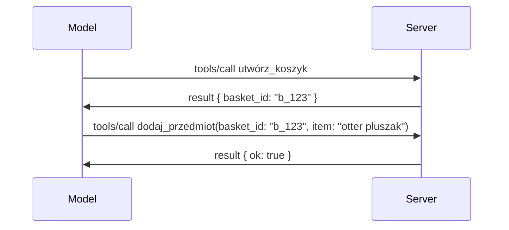

# Co się zmienia w MCP: Release Candidate 2026-07-28

> **Status:** Release Candidate. Specyfikacja `2026-07-28` nie jest ostateczna w chwili pisania. Została ogłoszona 21 maja 2026 i planowana jest na 28 lipca 2026. Wszystko w tej lekcji opisuje release candidate; przed budowaniem na jej podstawie sprawdź [roboczą specyfikację](https://modelcontextprotocol.io/specification/draft) i jej [changelog](https://modelcontextprotocol.io/specification/draft/changelog) dla najnowszego statusu. Reszta tego kursu jest napisana względem obecnej stabilnej wersji, **MCP Specification 2025-11-25**, i zostanie zaktualizowana po udostępnieniu `2026-07-28`.

## Przegląd

`2026-07-28` to największa rewizja MCP od czasu jego powstania. Sześć Propozycji Ulepszeń Specyfikacji (SEP) usuwa sesje na poziomie protokołu i czyni MCP bezstanowym na poziomie transportu, rozszerzenia stają się pełnoprawnym, wersjonowanym mechanizmem, a kilka funkcji poznanych wcześniej w tym kursie (Roots, Sampling, Logging) jest oznaczonych jako przestarzałe pod nową polityką cyklu życia. Ta lekcja podsumowuje, co się zmienia, dlaczego to ma znaczenie i co to oznacza dla kodu, który już napisałeś na bazie `2025-11-25`.

Źródło: [The 2026-07-28 MCP Specification Release Candidate](https://blog.modelcontextprotocol.io/posts/2026-07-28-release-candidate/) (Model Context Protocol Blog, David Soria Parra i Den Delimarsky).

## Cele nauki

Na koniec tej lekcji będziesz potrafił:

- Wyjaśnić, dlaczego MCP przechodzi do bezstanowego rdzenia protokołu i jaki problem to rozwiązuje w środowiskach skalowanych poziomo.
- Opisać, jak zostaje zastąpiony handshake `initialize`/`initialized` i nagłówek `Mcp-Session-Id`.
- Zidentyfikować nowe nagłówki `Mcp-Method` i `Mcp-Name` oraz metadane pamięci podręcznej `ttlMs`/`cacheScope`.
- Rozpoznać framework Extensions oraz dwa rozszerzenia dołączone do tej wersji: MCP Apps i Tasks.
- Wypisać sześć SEP dotyczących autoryzacji, które wzmacniają zgodność z OAuth 2.0 / OIDC.
- Zidentyfikować, które funkcje rdzeniowe (Roots, Sampling, Logging) są teraz przestarzałe i co to oznacza w praktyce.
- Wyjaśnić zmianę pełnego JSON Schema 2020-12 dotyczącą `inputSchema`/`outputSchema` narzędzi.

## Protokół bezstanowy

Najważniejsza zmiana: MCP staje się bezstanowy na poziomie protokołu.

### Przed (2025-11-25): sesje przypisują cię do jednej instancji serwera

Wywołanie narzędzia przez Streamable HTTP zaczyna się handshake `initialize`. Serwer odpowiada nagłówkiem `Mcp-Session-Id`, który każde kolejne żądanie musi zawierać:

```http
POST /mcp HTTP/1.1
Mcp-Session-Id: 1868a90c-3a3f-4f5b
Content-Type: application/json

{"jsonrpc":"2.0","id":2,"method":"tools/call",
 "params":{"name":"search","arguments":{"q":"otters"}}}
```

Ponieważ sesja jest powiązana z tą konkretną instancją serwera, wdrożenia skalowane poziomo wymagają **przywiązania trasowania (sticky routing)** na load balancerze i **wspólnego magazynu sesji** między instancjami.

### Po (2026-07-28): każde żądanie jest kompletne samo w sobie

```http
POST /mcp HTTP/1.1
MCP-Protocol-Version: 2026-07-28
Mcp-Method: tools/call
Mcp-Name: search
Content-Type: application/json

{"jsonrpc":"2.0","id":1,"method":"tools/call",
 "params":{"name":"search","arguments":{"q":"otters"},
           "_meta":{"io.modelcontextprotocol/clientInfo":{"name":"my-app","version":"1.0"}}}}
```

Dowolna instancja serwera może obsłużyć to żądanie. Kluczowe zmiany:

- **Usunięto handshake `initialize`/`initialized`** ([SEP-2575](https://github.com/modelcontextprotocol/modelcontextprotocol/pull/2575)). Wersja protokołu, informacje o kliencie i jego możliwości przeniesiono do `_meta` w każdym żądaniu. Nowa metoda `server/discover` pozwala klientowi pobrać możliwości serwera z wyprzedzeniem, gdy tego potrzebuje.
- **Usunięto nagłówek `Mcp-Session-Id` i sesję na poziomie protokołu** ([SEP-2567](https://github.com/modelcontextprotocol/modelcontextprotocol/pull/2567)). Przywiązanie trasowania i wspólne magazyny sesji nie są już wymagane na poziomie protokołu.

### Protokół bezstanowy, aplikacje ze stanem

Usunięcie sesji protokołu nie oznacza, że twój serwer nie może być stanowy. Zalecanym wzorcem jest ten, który HTTP API stosują od zawsze: uzyskaj jawny uchwyt (np. `basket_id`, `browser_id`) podczas jednego wywołania narzędzia, a model niech zwraca ten uchwyt jako zwykły argument w późniejszych wywołaniach.



To sprawia, że stan jest widoczny i rozsądny dla modelu zamiast być ukryty w metadanych transportu, i pozwala dowolnej instancji serwera obsłużyć każde wywołanie.

### Żądania serwer→klient, zrestrukturyzowane

Bezstanowy protokół nadal potrzebuje sposobu, by serwer mógł poprosić klienta o coś w trakcie wywołania (np. o prompt elicytacyjny):

- **Żądania inicjowane przez serwer mogą być wydawane tylko w trakcie aktywnego przetwarzania żądania klienta** ([SEP-2260](https://github.com/modelcontextprotocol/modelcontextprotocol/pull/2260)) — wcześniej była to rekomendacja, teraz wymóg. Użytkownik nigdy nie jest pytany „znikąd”.
- **Multi Round-Trip Requests** ([SEP-2322](https://github.com/modelcontextprotocol/modelcontextprotocol/pull/2322)) zastępują utrzymywanie otwartego strumienia SSE. Zamiast tego serwer zwraca `InputRequiredResult`:

  ```json
  {
    "resultType": "inputRequired",
    "inputRequests": {
      "confirm": {
        "type": "elicitation",
        "message": "Delete 3 files?",
        "schema": { "type": "boolean" }
      }
    },
    "requestState": "eyJzdGVwIjoxLCJmaWxlcyI6WyJhIiwiYiIsImMiXX0="
  }
  ```

  Klient zbiera odpowiedzi i ponownie wysyła oryginalne wywołanie z `inputResponses` oraz powtórzonym `requestState`. Każda instancja serwera może przejąć ponowne wykonanie, ponieważ wszystko potrzebne jest w treści.

### Routowalne, cache'owalne, śledzone

Trzy drobne zmiany ułatwiają operowanie ruchem bezstanowym:

- **Nagłówki `Mcp-Method` i `Mcp-Name` są wymagane w Streamable HTTP** ([SEP-2243](https://github.com/modelcontextprotocol/modelcontextprotocol/pull/2243)), dzięki czemu load balancery, bramy i limitery mogą kierować ruchem na podstawie operacji bez inspekcji ciała JSON. Serwery odrzucają żądania, w których nagłówki i ciało się nie zgadzają.
- **`tools/list` i wyniki odczytu zasobów zawierają `ttlMs` i `cacheScope`** ([SEP-2549](https://github.com/modelcontextprotocol/modelcontextprotocol/pull/2549)), wzorowane na HTTP `Cache-Control`. Klienci wiedzą, jak długo wynik listy jest aktualny i czy można go bezpiecznie współdzielić między użytkownikami, bez potrzeby długotrwałego strumienia SSE do poznawania zmian.
- **Propagacja W3C Trace Context w `_meta` jest udokumentowana** ([SEP-414](https://github.com/modelcontextprotocol/modelcontextprotocol/pull/414)), ustalając nazwę kluczy `traceparent`, `tracestate` i `baggage`, dzięki czemu rozproszony trace może śledzić wywołanie w SDK klienta, serwerze MCP i systemach downstream w backendzie kompatybilnym z [OpenTelemetry](https://opentelemetry.io/).

## Rozszerzenia stają się pełnoprawne

Rozszerzenia istniały nieformalnie w `2025-11-25`. [SEP-2133](https://github.com/modelcontextprotocol/modelcontextprotocol/pull/2133) je formalizuje:

- Rozszerzenia są identyfikowane przez identyfikatory reverse-DNS.
- Negocjują się poprzez mapę `extensions` w możliwościach klienta i serwera.
- Żyją we własnych repozytoriach `ext-*` z wyznaczonymi opiekunami i wersjonują się niezależnie od głównej specyfikacji.
- Nowa ścieżka Extensions Track w procesie SEP daje im drogę od eksperymentalnych do oficjalnych.

Ta wersja zawiera dwa oficjalne rozszerzenia.

### MCP Apps: interfejsy użytkownika renderowane po stronie serwera

[MCP Apps](https://blog.modelcontextprotocol.io/posts/2026-01-26-mcp-apps/) ([SEP-1865](https://github.com/modelcontextprotocol/modelcontextprotocol/pull/1865)) pozwalają serwerom wysyłać interaktywne interfejsy HTML, które hosty renderują w sandboxowanym iframe. Narzędzia deklarują z góry swoje szablony UI, by hosty mogły je prefetchować, cache’ować i weryfikować pod kątem bezpieczeństwa zanim coś się uruchomi. Podstawy tego omówiłeś już w [Lekcji 15: MCP Apps](../03-GettingStarted/15-mcp-apps/README.md) — w ramach frameworku Extensions MCP Apps stały się formalnym rozszerzeniem zamiast eksperymentalną funkcją rdzenia.

### Tasks awansuje na rozszerzenie

Tasks zostały wydane jako eksperymentalna funkcja rdzeniowa w `2025-11-25`. Doświadczenia z produkcji wykazały potrzebę przebudowy, dlatego właściwym miejscem jest rozszerzenie: [Tasks extension](https://github.com/modelcontextprotocol/modelcontextprotocol/pull/2663) przekształca cykl życia wokół modelu bezstanowego — serwer może odpowiedzieć na `tools/call` uchwytem zadania, a klient prowadzi je dalej za pomocą `tasks/get`, `tasks/update` i `tasks/cancel`. Tworzenie zadań jest kierowane przez serwer: klient reklamuje rozszerzenie, a serwer decyduje, kiedy wywołanie ma działać jako zadanie. `tasks/list` zostaje całkowicie usunięte, ponieważ nie może być bezpiecznie ograniczone bez sesji.

> **Notatka migracyjna:** jeśli zaimplementowałeś eksperymentalne API Tasks z `2025-11-25`, musisz przejść na nowy cykl życia rozszerzenia — nie jest ono kompatybilne wstecz.

## Zaostrzenie autoryzacji

Sześć SEP wzmacnia [specyfikację autoryzacji](https://modelcontextprotocol.io/specification/draft/basic/authorization), by lepiej dopasować do rzeczywistych wdrożeń OAuth 2.0 / OpenID Connect:

| SEP | Zmiana |
|---|---|
| [SEP-2468](https://github.com/modelcontextprotocol/modelcontextprotocol/pull/2468) | Klienci muszą weryfikować parametr `iss` w odpowiedziach autoryzacyjnych zgodnie z [RFC 9207](https://www.rfc-editor.org/rfc/rfc9207), co niweluje ataki mieszania znane w modelu MCP z jednym klientem i wieloma serwerami. Przyszła wersja będzie wymagać odrzucania odpowiedzi bez `iss`. |
| [SEP-837](https://github.com/modelcontextprotocol/modelcontextprotocol/pull/837) | Klienci deklarują swój `application_type` OpenID Connect podczas Dynamicznej Rejestracji Klienta, zapobiegając sytuacji, w której serwer autoryzacji domyślnie ustawia klienta desktop/CLI na `"web"` i odrzuca jego URI przekierowania localhost. |
| [SEP-2352](https://github.com/modelcontextprotocol/modelcontextprotocol/pull/2352) | Klienci wiążą zarejestrowane poświadczenia z `issuer` serwera autoryzacji i ponownie rejestrują się, gdy zasób migruje między serwerami. |
| [SEP-2207](https://github.com/modelcontextprotocol/modelcontextprotocol/pull/2207) | Dokumentuje, jak żądać tokenów odświeżania od serwerów autoryzacji w stylu OpenID Connect. |
| [SEP-2350](https://github.com/modelcontextprotocol/modelcontextprotocol/pull/2350) | Wyjaśnia kumulację zakresów podczas autoryzacji poziomu wyższego (step-up). |
| [SEP-2351](https://github.com/modelcontextprotocol/modelcontextprotocol/pull/2351) | Doprecyzowuje sufiks odkrycia `.well-known`. |

Jeśli dzisiaj budujesz serwer autoryzacyjny dla MCP, zacznij już wysyłać `iss` w odpowiedziach autoryzacyjnych — zobacz [02-Security](../02-Security/README.md) po obecne wskazówki autoryzacyjne, na których to będzie się opierać.

## Roots, Sampling i Logging są przestarzałe

Zgodnie z nową [polityką cyklu życia funkcji](https://github.com/modelcontextprotocol/modelcontextprotocol/pull/2577) ([SEP-2577](https://github.com/modelcontextprotocol/modelcontextprotocol/pull/2577)), trzy podstawowe prymitywy klienta, które poznałeś w [Core Concepts](./README.md#roots), przechodzą do statusu **Przestarzałe**:

| Funkcja | Zalecane zastępstwo |
|---|---|
| Roots | Parametry narzędzi, URI zasobów lub konfiguracja serwera |
| Sampling | Bezpośrednia integracja z API dostawców LLM |
| Logging | `stderr` dla transportów stdio; OpenTelemetry dla strukturalnej obserwowalności |

To są **tylko adnotacje przestarzałości**: metody, typy i flagi zdolności nadal działają w tym wydaniu i każdej specyfikacji publikowanej w ciągu roku od niego. Usunięcie któregokolwiek wymaga osobnego SEP według polityki cyklu życia — więc nic nie psuje się w twoich istniejących przykładach [Sampling](../03-GettingStarted/14-sampling/README.md), ale nowe serwery powinny preferować powyższe wzorce zastępcze.

## Pełny JSON Schema 2020-12 dla narzędzi

`inputSchema` i `outputSchema` narzędzi są zgodne z pełnym [JSON Schema 2020-12](https://json-schema.org/draft/2020-12) ([SEP-2106](https://github.com/modelcontextprotocol/modelcontextprotocol/pull/2106)):

- Schematy wejściowe zachowują ograniczenie root `type: "object"` ale teraz pozwalają na kompozycję (`oneOf`, `anyOf`, `allOf`), warunkowe i odwołania (`$ref`, `$defs`).
- Schematy wyjściowe są nieograniczone, a `structuredContent` może być dowolną wartością JSON, a nie tylko obiektem.
- Implementacje nie powinny automatycznie dereferować zewnętrznych URI `$ref` i powinny ograniczać głębokość schematu oraz czas walidacji (z uwagi na możliwość ataku DoS, gdy walidacja działa po stronie serwera).

Osobno zmienia się kod błędu dla brakującego zasobu z niestandardowego MCP `-32002` na standard JSON-RPC `-32602` (Nieprawidłowe parametry) ([SEP-2164](https://github.com/modelcontextprotocol/modelcontextprotocol/pull/2164)). Jeśli twój klient dopasowuje literalnie `-32002`, trzeba to zaktualizować.

## Jak protokół będzie ewoluował dalej

Ta wersja zawiera zmiany łamiące kompatybilność, których twórcy MCP nie zamierzają powtarzać na co dzień. Trzy SEP zarządzające mają temu zapobiec:

- **Polityka cyklu życia funkcji** daje każdej funkcji ścieżkę Aktywna → Przestarzała → Usunięta z co najmniej dwunastomiesięcznym odstępem między oznaczeniem jej przestarzałości a pierwszą możliwą datą usunięcia.
- **Framework Extensions** pozwala nowym możliwościom pojawiać się jako rozszerzenia opt-in i stabilizować się tam, zanim (jeśli w ogóle) staną się częścią rdzenia specyfikacji.
- Standardowy SEP z linii rozwoju nie może już osiągnąć statusu Final, dopóki odpowiadający mu scenariusz nie pojawi się w [conformance suite](https://github.com/modelcontextprotocol/conformance) ([SEP-2484](https://github.com/modelcontextprotocol/modelcontextprotocol/pull/2484)) — ta sama platforma, na której [system poziomów SDK](https://github.com/modelcontextprotocol/modelcontextprotocol/pull/1777) ocenia oficjalne SDK.

## Harmonogram wydania i walidacja

- Release candidate został zamrożony 21 maja 2026.
- Ostateczna specyfikacja zaplanowana jest na 28 lipca 2026.
- Dziesięciotygodniowy okres między tymi datami pozwala opiekunom SDK i twórcom klientów na walidację zmian względem rzeczywistych obciążeń; SDK Poziomu 1 powinny wydawać wsparcie w tym czasie zgodnie z [systemem poziomów SDK](https://modelcontextprotocol.io/docs/sdk).
- Śledź pełen zestaw zmian w [roboczej specyfikacji](https://modelcontextprotocol.io/specification/draft) oraz jej [historii zmian](https://modelcontextprotocol.io/specification/draft/changelog).

## Co to oznacza dla tego programu nauczania

Wszystko, czego nauczyłeś się do tej pory w tym kursie, jest skierowane na **2025-11-25**, który pozostaje aktualną stabilną specyfikacją aż do wydania `2026-07-28`. Konkretnie:

- **Sesje i handshake `initialize`** (omawiane w [Core Concepts](./README.md) i [Lekcja 6: HTTP Streaming](../03-GettingStarted/06-http-streaming/README.md)) działają nadal jak opisano, ale spodziewaj się ich zastąpienia przez bezstanowy model żądań powyżej po aktualizacji do SDK kompatybilnych z `2026-07-28`.
- **Pobieranie próbek i Roots** (również omówione w [Core Concepts](./README.md)) pozostają w pełni funkcjonalne, lecz są przestarzałe — nowe projekty powinny preferować wymienione powyżej wzorce zastępujące.
- **Eksperymentalna funkcja Tasks**, jeśli jej używałeś, będzie wymagała migracji do nowego cyklu życia rozszerzenia Tasks.
- **Aplikacje MCP** ([Lekcja 15](../03-GettingStarted/15-mcp-apps/README.md)) nie ulegają praktycznym zmianom; są po prostu przeniesione pod formalny system Extensions.

## Dodatkowe zasoby

- [Kandydat do wydania specyfikacji MCP 2026-07-28 (wpis na blogu)](https://blog.modelcontextprotocol.io/posts/2026-07-28-release-candidate/)
- [Przyszłość transportów MCP](https://blog.modelcontextprotocol.io/posts/2025-12-19-mcp-transport-future/)
- [Robocza specyfikacja MCP](https://modelcontextprotocol.io/specification/draft)
- [Historia zmian roboczej specyfikacji MCP](https://modelcontextprotocol.io/specification/draft/changelog)
- [Wytyczne SEP](https://modelcontextprotocol.io/community/sep-guidelines)
- [System poziomów MCP SDK](https://modelcontextprotocol.io/docs/sdk)

## Kolejne kroki

Wracaj do [Core Concepts](./README.md) lub kontynuuj do [Security](../02-Security/README.md), aby zobaczyć, jak dzisiejsze wskazówki z `2025-11-25` przekładają się na nadchodzące zmiany.

---

<!-- CO-OP TRANSLATOR DISCLAIMER START -->
**Zastrzeżenie**:
Niniejszy dokument został przetłumaczony za pomocą usługi tłumaczenia AI [Co-op Translator](https://github.com/Azure/co-op-translator). Choć dążymy do dokładności, prosimy pamiętać, że automatyczne tłumaczenia mogą zawierać błędy lub niedokładności. Oryginalny dokument w jego języku źródłowym należy uznawać za autorytatywne źródło. W przypadku informacji krytycznych zalecane jest skorzystanie z profesjonalnego tłumaczenia wykonanego przez człowieka. Nie ponosimy odpowiedzialności za jakiekolwiek nieporozumienia lub błędne interpretacje wynikające z użycia tego tłumaczenia.
<!-- CO-OP TRANSLATOR DISCLAIMER END -->