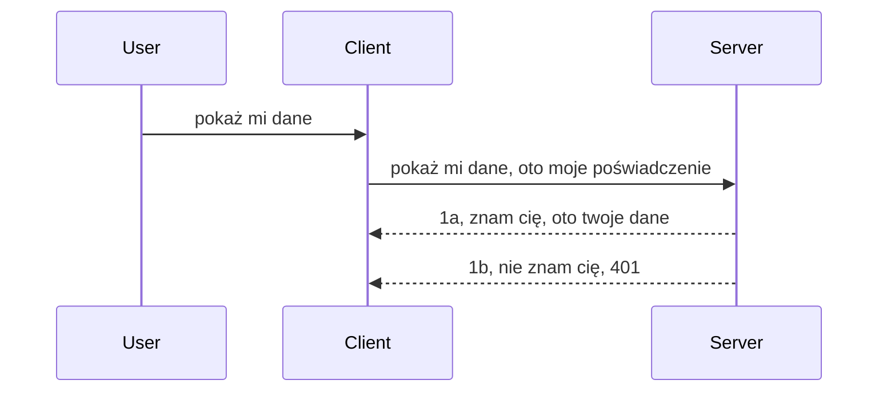

# Prosta autoryzacja

SDK MCP wspierają użycie OAuth 2.1, co szczerze mówiąc jest procesem dość złożonym, obejmującym pojęcia takie jak serwer autoryzacyjny, serwer zasobów, wysyłanie poświadczeń, otrzymywanie kodu, wymiana kodu na token dostępu, aż w końcu możemy uzyskać dostęp do danych zasobu. Jeśli nie masz doświadczenia z OAuth, które jest świetnym rozwiązaniem do wdrożenia, warto zacząć od prostszego poziomu autoryzacji i stopniowo przechodzić do coraz lepszego zabezpieczenia. Dlatego istnieje ten rozdział, aby wprowadzić cię w bardziej zaawansowaną autoryzację.

## Autoryzacja, co mamy na myśli?

Autoryzacja to skrót od uwierzytelniania i autoryzacji. Chodzi o to, że musimy zrobić dwie rzeczy:

- **Uwierzytelnianie**, czyli proces ustalenia, czy pozwalamy osobie wejść do naszego domu, czyli czy ma prawo być „tutaj”, czyli mieć dostęp do naszego serwera zasobów, gdzie znajdują się funkcje MCP Server.
- **Autoryzacja**, to proces ustalenia, czy użytkownik powinien mieć dostęp do konkretnych zasobów, o które prosi, na przykład tych zamówień lub tych produktów, albo czy może czytać zawartość, ale nie może usuwać, jako kolejny przykład.

## Poświadczenia: jak mówimy systemowi, kim jesteśmy

Większość web developerów od razu myśli o podaniu poświadczenia serwerowi, zwykle sekretu, który mówi, czy mają prawo być tu obecni („Uwierzytelnienie”). To poświadczenie to zwykle base64 zakodowana wersja nazwy użytkownika i hasła albo klucz API, który unikalnie identyfikuje konkretnego użytkownika.

Polega to na przesłaniu tego w nagłówku o nazwie "Authorization" w ten sposób:

```json
{ "Authorization": "secret123" }
```

To zwykle nazywa się podstawową autoryzacją (basic authentication). Cały proces działa wtedy w następujący sposób:



Skoro już rozumiemy jak to działa pod względem przepływu, to jak to zaimplementować? Większość serwerów webowych ma pojęcie middleware, czyli kawałka kodu, który działa jako część żądania i może zweryfikować poświadczenia, a jeśli są one prawidłowe, pozwolić żądaniu przejść dalej. Jeśli żądanie nie ma prawidłowych poświadczeń, otrzymasz błąd autoryzacji. Zobaczmy, jak to można zaimplementować:

**Python**

```python
class AuthMiddleware(BaseHTTPMiddleware):
    async def dispatch(self, request, call_next):

        has_header = request.headers.get("Authorization")
        if not has_header:
            print("-> Missing Authorization header!")
            return Response(status_code=401, content="Unauthorized")

        if not valid_token(has_header):
            print("-> Invalid token!")
            return Response(status_code=403, content="Forbidden")

        print("Valid token, proceeding...")
       
        response = await call_next(request)
        # dodaj dowolne nagłówki klienta lub w jakiś sposób zmień odpowiedź
        return response


starlette_app.add_middleware(CustomHeaderMiddleware)
```

Tutaj:

- Utworzono middleware o nazwie `AuthMiddleware`, gdzie metoda `dispatch` jest wywoływana przez serwer webowy.
- Dodano middleware do serwera webowego:

    ```python
    starlette_app.add_middleware(AuthMiddleware)
    ```

- Napisano logikę walidacji, która sprawdza, czy nagłówek Authorization jest obecny i czy przesyłany sekret jest ważny:

    ```python
    has_header = request.headers.get("Authorization")
    if not has_header:
        print("-> Missing Authorization header!")
        return Response(status_code=401, content="Unauthorized")

    if not valid_token(has_header):
        print("-> Invalid token!")
        return Response(status_code=403, content="Forbidden")
    ```

    jeśli sekret jest obecny i ważny, pozwalamy żądaniu przejść wywołując `call_next` i zwracamy odpowiedź.

    ```python
    response = await call_next(request)
    # dodaj dowolne niestandardowe nagłówki lub w jakiś sposób zmień odpowiedź
    return response
    ```

Działa to tak, że jeśli zostanie wykonane żądanie webowe do serwera, middleware zostanie wywołany i zgodnie z implementacją albo pozwoli żądaniu przejść dalej, albo zwróci błąd wskazujący, że klient nie ma prawa kontynuować.

**TypeScript**

Tutaj tworzymy middleware w popularnym frameworku Express i przechwytujemy żądanie zanim dotrze do MCP Server. Oto kod:

```typescript
function isValid(secret) {
    return secret === "secret123";
}

app.use((req, res, next) => {
    // 1. Czy nagłówek Authorization jest obecny?
    if(!req.headers["Authorization"]) {
        res.status(401).send('Unauthorized');
    }
    
    let token = req.headers["Authorization"];

    // 2. Sprawdź ważność.
    if(!isValid(token)) {
        res.status(403).send('Forbidden');
    }

   
    console.log('Middleware executed');
    // 3. Przekazuje żądanie do następnego kroku w pipeline żądania.
    next();
});
```

W tym kodzie:

1. Sprawdzamy, czy nagłówek Authorization jest w ogóle obecny, jeśli nie, wysyłamy błąd 401.
2. Sprawdzamy, czy poświadczenie/token jest ważny, jeśli nie, wysyłamy błąd 403.
3. W końcu przekazujemy na dalszą drogę żądanie w potoku i zwracamy żądany zasób.

## Ćwiczenie: zaimplementuj autoryzację

Weźmy naszą wiedzę i spróbujmy jej użyć. Plan jest taki:

Serwer

- Stwórz serwer webowy i instancję MCP.
- Zaimplementuj middleware dla serwera.

Klient

- Wyślij żądanie webowe z poświadczeniem w nagłówku.

### -1- Stwórz serwer webowy i instancję MCP

> **Patrząc w przód:** przykład TypeScript poniżej śledzi transprot HTTP w mapie `transports` indeksowanej według `mcp-session-id`, zgodnie ze **Specyfikacją MCP 2025-11-25**. W wersji kandydującej 2026-07-28 usunięto całkowicie handshake `initialize` i identyfikator sesji, więc ta mapa transportów na sesję znika na rzecz bezstanowych, samodzielnych żądań. Zobacz [Co się zmienia w MCP: Kandydująca Wersja 2026-07-28](../../01-CoreConcepts/mcp-2026-07-28-release-candidate.md).

W pierwszym kroku musimy stworzyć instancję serwera webowego i MCP Server.

**Python**

Tutaj tworzymy instancję MCP Server, tworzymy aplikację webową starlette i hostujemy ją za pomocą uvicorn.

```python
# tworzenie serwera MCP

app = FastMCP(
    name="MCP Resource Server",
    instructions="Resource Server that validates tokens via Authorization Server introspection",
    host=settings["host"],
    port=settings["port"],
    debug=True
)

# tworzenie aplikacji webowej starlette
starlette_app = app.streamable_http_app()

# udostępnianie aplikacji za pomocą uvicorn
async def run(starlette_app):
    import uvicorn
    config = uvicorn.Config(
            starlette_app,
            host=app.settings.host,
            port=app.settings.port,
            log_level=app.settings.log_level.lower(),
        )
    server = uvicorn.Server(config)
    await server.serve()

run(starlette_app)
```

W tym kodzie:

- Tworzymy MCP Server.
- Budujemy aplikację webową starlette z MCP Server, `app.streamable_http_app()`.
- Hostujemy i serwujemy aplikację webową używając uvicorn `server.serve()`.

**TypeScript**

Tutaj tworzymy instancję MCP Server.

```typescript
const server = new McpServer({
      name: "example-server",
      version: "1.0.0"
    });

    // ... skonfiguruj zasoby serwera, narzędzia i podpowiedzi ...
```

Stworzenie MCP Server będzie musiało się odbywać w definicji naszej trasy POST /mcp, więc przenieśmy powyższy kod tak:

```typescript
import express from "express";
import { randomUUID } from "node:crypto";
import { McpServer } from "@modelcontextprotocol/sdk/server/mcp.js";
import { StreamableHTTPServerTransport } from "@modelcontextprotocol/sdk/server/streamableHttp.js";
import { isInitializeRequest } from "@modelcontextprotocol/sdk/types.js"

const app = express();
app.use(express.json());

// Mapa do przechowywania transportów według ID sesji
const transports: { [sessionId: string]: StreamableHTTPServerTransport } = {};

// Obsługa żądań POST do komunikacji klient-serwer
app.post('/mcp', async (req, res) => {
  // Sprawdź istniejące ID sesji
  const sessionId = req.headers['mcp-session-id'] as string | undefined;
  let transport: StreamableHTTPServerTransport;

  if (sessionId && transports[sessionId]) {
    // Ponowne wykorzystanie istniejącego transportu
    transport = transports[sessionId];
  } else if (!sessionId && isInitializeRequest(req.body)) {
    // Nowe żądanie inicjalizacji
    transport = new StreamableHTTPServerTransport({
      sessionIdGenerator: () => randomUUID(),
      onsessioninitialized: (sessionId) => {
        // Przechowaj transport według ID sesji
        transports[sessionId] = transport;
      },
      // Ochrona przed DNS rebinding jest domyślnie wyłączona dla kompatybilności wstecznej. Jeśli uruchamiasz ten serwer
      // lokalnie, upewnij się, że ustawisz:
      // enableDnsRebindingProtection: true,
      // allowedHosts: ['127.0.0.1'],
    });

    // Wyczyść transport po zamknięciu
    transport.onclose = () => {
      if (transport.sessionId) {
        delete transports[transport.sessionId];
      }
    };
    const server = new McpServer({
      name: "example-server",
      version: "1.0.0"
    });

    // ... skonfiguruj zasoby serwera, narzędzia i podpowiedzi ...

    // Połącz się z serwerem MCP
    await server.connect(transport);
  } else {
    // Nieprawidłowe żądanie
    res.status(400).json({
      jsonrpc: '2.0',
      error: {
        code: -32000,
        message: 'Bad Request: No valid session ID provided',
      },
      id: null,
    });
    return;
  }

  // Obsłuż żądanie
  await transport.handleRequest(req, res, req.body);
});

// Wielokrotnego użytku obsługa dla żądań GET i DELETE
const handleSessionRequest = async (req: express.Request, res: express.Response) => {
  const sessionId = req.headers['mcp-session-id'] as string | undefined;
  if (!sessionId || !transports[sessionId]) {
    res.status(400).send('Invalid or missing session ID');
    return;
  }
  
  const transport = transports[sessionId];
  await transport.handleRequest(req, res);
};

// Obsłuż żądania GET dla powiadomień z serwera do klienta przez SSE
app.get('/mcp', handleSessionRequest);

// Obsłuż żądania DELETE do zakończenia sesji
app.delete('/mcp', handleSessionRequest);

app.listen(3000);
```

Teraz widzisz, jak tworzenie MCP Server zostało przeniesione do `app.post("/mcp")`.

Przejdźmy do następnego kroku tworzenia middleware, aby mogliśmy zweryfikować pochodzące poświadczenia.

### -2- Zaimplementuj middleware dla serwera

Teraz przejdźmy do części middleware. Tutaj stworzymy middleware, który będzie szukał poświadczenia w nagłówku `Authorization` i je walidował. Jeśli jest akceptowalne, żądanie przejdzie dalej i wykona to, co powinno (np. wypisze narzędzia, odczyta zasób lub cokolwiek innego, o co prosił klient MCP).

**Python**

Aby utworzyć middleware, musimy stworzyć klasę dziedziczącą po `BaseHTTPMiddleware`. Są dwa ciekawe elementy:

- Żądanie `request`, z którego czytamy nagłówki.
- `call_next` — callback, który musimy wywołać, jeśli klient przyniósł akceptowalne poświadczenie.

Najpierw musimy obsłużyć przypadek, gdy nie ma nagłówka `Authorization`:

```python
has_header = request.headers.get("Authorization")

# brak nagłówka, zakończ niepowodzeniem 401, w przeciwnym razie kontynuuj.
if not has_header:
    print("-> Missing Authorization header!")
    return Response(status_code=401, content="Unauthorized")
```

Tu wysyłamy wiadomość 401 Unauthorized, ponieważ klient nie przeszedł uwierzytelnienia.

Następnie, jeśli poświadczenie zostało przesłane, musimy sprawdzić jego ważność w ten sposób:

```python
 if not valid_token(has_header):
    print("-> Invalid token!")
    return Response(status_code=403, content="Forbidden")
```

Zauważ, że tutaj wysyłamy wiadomość 403 Forbidden. Zobaczmy pełne middleware implementujące wszystko, co powyżej:

```python
class AuthMiddleware(BaseHTTPMiddleware):
    async def dispatch(self, request, call_next):

        has_header = request.headers.get("Authorization")
        if not has_header:
            print("-> Missing Authorization header!")
            return Response(status_code=401, content="Unauthorized")

        if not valid_token(has_header):
            print("-> Invalid token!")
            return Response(status_code=403, content="Forbidden")

        print("Valid token, proceeding...")
        print(f"-> Received {request.method} {request.url}")
        response = await call_next(request)
        response.headers['Custom'] = 'Example'
        return response

```

Świetnie, a co z funkcją `valid_token`? Oto ona:

```python
# NIE używaj do produkcji - ulepsz to !!
def valid_token(token: str) -> bool:
    # usuń prefiks "Bearer "
    if token.startswith("Bearer "):
        token = token[7:]
        return token == "secret-token"
    return False
```

Oczywiście to wymaga poprawy.

WAŻNE: Nigdy nie powinieneś mieć takich sekretów w kodzie. Najlepiej pobierać wartość do porównania z bazy danych albo dostawcy tożsamości (IDP), lub jeszcze lepiej, pozwolić IDP na walidację.

**TypeScript**

Aby zaimplementować to w Express, musimy wywołać metodę `use`, która przyjmuje funkcje middleware.

Musimy:

- Operować na zmiennej żądania, by sprawdzić przesłane poświadczenie w właściwości `Authorization`.
- Zweryfikować poświadczenie i w razie sukcesu pozwolić żądaniu kontynuować, by zapytanie MCP klienta wykonało swoje zadanie (np. wypisało narzędzia, odczytało zasób lub inne funkcjonalności MCP).

Tutaj sprawdzamy, czy nagłówek `Authorization` jest obecny i jeśli nie, zatrzymujemy żądanie:

```typescript
if(!req.headers["authorization"]) {
    res.status(401).send('Unauthorized');
    return;
}
```

Jeśli nagłówek nie zostanie wysłany, otrzymujesz błąd 401.

Następnie sprawdzamy, czy poświadczenie jest ważne, jeśli nie, zatrzymujemy żądanie, ale z innym komunikatem:

```typescript
if(!isValid(token)) {
    res.status(403).send('Forbidden');
    return;
} 
```

Zauważ, że teraz dostajesz błąd 403.

Oto pełny kod:

```typescript
app.use((req, res, next) => {
    console.log('Request received:', req.method, req.url, req.headers);
    console.log('Headers:', req.headers["authorization"]);
    if(!req.headers["authorization"]) {
        res.status(401).send('Unauthorized');
        return;
    }
    
    let token = req.headers["authorization"];

    if(!isValid(token)) {
        res.status(403).send('Forbidden');
        return;
    }  

    console.log('Middleware executed');
    next();
});
```

Skonfigurowaliśmy serwer, by akceptował middleware sprawdzające poświadczenie, które klient nam wysyła. A co z samym klientem?

### -3- Wyślij żądanie webowe z poświadczeniem w nagłówku

Musimy upewnić się, że klient przekazuje poświadczenie w nagłówku. Ponieważ użyjemy klienta MCP, musimy dowiedzieć się, jak to zrobić.

**Python**

Dla klienta musimy przekazać nagłówek z poświadczeniem w ten sposób:

```python
# NIE wpisuj wartości na sztywno, przechowuj ją przynajmniej w zmiennej środowiskowej lub w bezpieczniejszym miejscu
token = "secret-token"

async with streamablehttp_client(
        url = f"http://localhost:{port}/mcp",
        headers = {"Authorization": f"Bearer {token}"}
    ) as (
        read_stream,
        write_stream,
        session_callback,
    ):
        async with ClientSession(
            read_stream,
            write_stream
        ) as session:
            await session.initialize()
      
            # DO ZROBIENIA, co chcesz wykonać po stronie klienta, np. listowanie narzędzi, wywoływanie narzędzi itp.
```

Zauważ, jak wypełniamy właściwość `headers` tak `headers = {"Authorization": f"Bearer {token}"}`.

**TypeScript**

Możemy to rozwiązać dwustopniowo:

1. Wypełnić obiekt konfiguracyjny naszym poświadczeniem.
2. Przekazać obiekt konfiguracyjny do transportu.

```typescript

// NIE wpisuj wartości na sztywno, jak pokazano tutaj. Przynajmniej trzymaj ją jako zmienną środowiskową i użyj czegoś takiego jak dotenv (w trybie deweloperskim).
let token = "secret123"

// zdefiniuj obiekt opcji transportu klienta
let options: StreamableHTTPClientTransportOptions = {
  sessionId: sessionId,
  requestInit: {
    headers: {
      "Authorization": "secret123"
    }
  }
};

// przekaż obiekt opcji do transportu
async function main() {
   const transport = new StreamableHTTPClientTransport(
      new URL(serverUrl),
      options
   );
```

Tu powyżej widzisz, jak musieliśmy utworzyć obiekt `options` i umieścić nagłówki pod właściwością `requestInit`.

WAŻNE: Jak to ulepszyć? Obecna implementacja ma problemy. Po pierwsze, przesyłanie poświadczenia w ten sposób jest ryzykowne, chyba że masz co najmniej HTTPS. Nawet wtedy poświadczenie może zostać skradzione, więc potrzebujesz systemu, gdzie łatwo można odwołać token i dodać dodatkowe kontrole, np. skąd na świecie jest żądanie, czy żądanie nie występuje zbyt często (zachowanie bota) - krócej mówiąc, jest wiele kwestii bezpieczeństwa.

Trzeba jednak powiedzieć, że dla bardzo prostych API, gdzie nie chcesz, by nikt wywoływał API bez uwierzytelnienia, to dobry początek.

Mając to na uwadze, spróbujmy nieco wzmocnić bezpieczeństwo, używając standardowego formatu JSON Web Tokens, znanych jako JWT lub tokeny „JOT”.

## JSON Web Tokens, JWT

Chcemy więc poprawić sytuację wobec bardzo prostych poświadczeń. Co zyskujemy natychmiast, przyjmując JWT?

- **Poprawę bezpieczeństwa**. W podstawowej autoryzacji wysyłasz nazwę użytkownika i hasło zakodowane base64 (albo klucz API) za każdym razem, co zwiększa ryzyko. Z JWT wysyłasz nazwę użytkownika i hasło i otrzymujesz token, który jest też ograniczony czasowo, czyli wygasa. JWT umożliwia precyzyjną kontrolę dostępu używając ról, zakresów i uprawnień.
- **Bezstanowość i skalowalność**. JWT są samodzielne, przenoszą wszystkie informacje o użytkowniku i eliminują potrzebę przechowywania sesji po stronie serwera. Token może być zweryfikowany lokalnie.
- **Współpraca i federacja**. JWT są kluczowe w Open ID Connect i używane u znanych dostawców tożsamości jak Entra ID, Google Identity i Auth0. Umożliwiają SSO i inne funkcje na poziomie przedsiębiorstwa.
- **Modułowość i elastyczność**. JWT można stosować z API Gatewayami jak Azure API Management, NGINX i innymi. Obsługują scenariusze uwierzytelniania i komunikację serwer-serwis, w tym podszywanie się i delegacje.
- **Wydajność i cache'owanie**. JWT można cache'ować po dekodowaniu, co zmniejsza potrzebę parsowania. Pomaga to szczególnie w aplikacjach o dużym natężeniu ruchu, poprawiając przepustowość i zmniejszając obciążenie infrastruktury.
- **Zaawansowane funkcje**. Obsługuje też introspekcję (sprawdzanie ważności na serwerze) oraz odwoływanie (unieważnianie tokenów).

Mając te wszystkie korzyści, zobaczmy, jak możemy ulepszyć naszą implementację.

## Przemiana autoryzacji podstawowej w JWT

Zmiany, które musimy wprowadzić, to na wysokim poziomie:

- **Nauczyć się tworzyć token JWT** i przygotować go do przesłania z klienta do serwera.
- **Weryfikować token JWT**, a jeśli jest ważny, pozwolić klientowi na dostęp do zasobów.
- **Bezpieczne przechowywanie tokenu**. Jak przechowujemy ten token.
- **Zabezpieczyć trasy**. Musimy chronić trasy i specyficzne funkcje MCP.
- **Dodać tokeny odświeżające**. Tworzyć tokeny krótkotrwałe oraz tokeny odświeżające długotrwałe, które mogą być użyte do pozyskania nowych tokenów po ich wygaśnięciu. Zapewnić też endpoint do odświeżania i strategię rotacji.

### -1- Utwórz token JWT

Token JWT składa się z części:

- **header**, algorytm i typ tokenu.
- **payload**, claimy, jak sub (użytkownik lub podmiot reprezentowany przez token, w kontekście uwierzytelniania to zazwyczaj user id), exp (czas wygaśnięcia), role (rola).
- **signature**, podpisana przy użyciu sekretu lub klucza prywatnego.

Musimy stworzyć header, payload i zakodowany token.

**Python**

```python

import jwt
import jwt
from jwt.exceptions import ExpiredSignatureError, InvalidTokenError
import datetime

# Sekretny klucz używany do podpisywania JWT
secret_key = 'your-secret-key'

header = {
    "alg": "HS256",
    "typ": "JWT"
}

# informacje o użytkowniku oraz jego roszczenia i czas wygaśnięcia
payload = {
    "sub": "1234567890",               # Temat (ID użytkownika)
    "name": "User Userson",                # Niestandardowe roszczenie
    "admin": True,                     # Niestandardowe roszczenie
    "iat": datetime.datetime.utcnow(),# Data wydania
    "exp": datetime.datetime.utcnow() + datetime.timedelta(hours=1)  # Data wygaśnięcia
}

# zakoduj to
encoded_jwt = jwt.encode(payload, secret_key, algorithm="HS256", headers=header)
```

W powyższym kodzie:

- Zdefiniowano header z algorytmem HS256 i typem JWT.
- Zbudowano payload zawierający subject lub id użytkownika, nazwę użytkownika, rolę, czas wydania i datę wygaśnięcia, implementując tym samym aspekt czasowego ograniczenia.

**TypeScript**

Tutaj będziemy potrzebować zależności, które pomogą nam tworzyć token JWT.

Zależności

```sh

npm install jsonwebtoken
npm install --save-dev @types/jsonwebtoken
```

Mając to przygotowane, utwórzmy header, payload i poprzez to zakodowany token.

```typescript
import jwt from 'jsonwebtoken';

const secretKey = 'your-secret-key'; // Używaj zmiennych środowiskowych w produkcji

// Zdefiniuj ładunek
const payload = {
  sub: '1234567890',
  name: 'User usersson',
  admin: true,
  iat: Math.floor(Date.now() / 1000), // Data wystawienia
  exp: Math.floor(Date.now() / 1000) + 60 * 60 // Wygasa po 1 godzinie
};

// Zdefiniuj nagłówek (opcjonalnie, jsonwebtoken ustawia domyślne)
const header = {
  alg: 'HS256',
  typ: 'JWT'
};

// Utwórz token
const token = jwt.sign(payload, secretKey, {
  algorithm: 'HS256',
  header: header
});

console.log('JWT:', token);
```

Token ten:

Podpisany przy użyciu HS256  
Ważny przez 1 godzinę  
Zawiera claimy takie jak sub, name, admin, iat oraz exp.

### -2- Zweryfikuj token

Musimy też weryfikować token, co powinno odbywać się na serwerze, by upewnić się, że to, co klient nam przesyła, jest faktycznie ważne. Należy tu wykonać wiele kontroli, od struktury po ważność. Zachęcamy też do dodania innych kontroli, np. czy użytkownik istnieje w systemie itd.

Aby zweryfikować token, musimy go zdekodować, aby go odczytać i zacząć sprawdzać ważność:

**Python**

```python

# Dekoduj i zweryfikuj JWT
try:
    decoded = jwt.decode(token, secret_key, algorithms=["HS256"])
    print("✅ Token is valid.")
    print("Decoded claims:")
    for key, value in decoded.items():
        print(f"  {key}: {value}")
except ExpiredSignatureError:
    print("❌ Token has expired.")
except InvalidTokenError as e:
    print(f"❌ Invalid token: {e}")

```

W tym kodzie wywołujemy `jwt.decode` z użyciem tokena, klucza sekretnego i wybranego algorytmu jako danych wejściowych. Zwróć uwagę, jak używamy konstrukcji try-catch, ponieważ nieudana walidacja powoduje zgłoszenie błędu.

**TypeScript**

Tutaj musimy wywołać `jwt.verify`, aby uzyskać zdekodowaną wersję tokena, którą możemy dalej analizować. Jeśli to wywołanie się nie powiedzie, oznacza to, że struktura tokena jest niepoprawna lub token jest już nieważny.

```typescript

try {
  const decoded = jwt.verify(token, secretKey);
  console.log('Decoded Payload:', decoded);
} catch (err) {
  console.error('Token verification failed:', err);
}
```

NOTE: jak wspomniano wcześniej, powinniśmy przeprowadzić dodatkowe kontrole, aby upewnić się, że token ten wskazuje na użytkownika w naszym systemie oraz aby upewnić się, że użytkownik ma prawa, które deklaruje.

Następnie przyjrzyjmy się kontroli dostępu opartej na rolach, znanej również jako RBAC.

## Dodawanie kontroli dostępu opartej na rolach

Idea polega na tym, że chcemy wyrazić, że różne role mają różne uprawnienia. Na przykład, zakładamy, że administrator może robić wszystko, zwykły użytkownik może czytać i pisać, a gość może tylko czytać. W związku z tym oto kilka możliwych poziomów uprawnień:

- Admin.Write  
- User.Read  
- Guest.Read  

Zobaczmy, jak możemy zaimplementować taką kontrolę za pomocą middleware. Middleware mogą być dodawane dla poszczególnych tras, jak również dla wszystkich tras.

**Python**

```python
from starlette.middleware.base import BaseHTTPMiddleware
from starlette.responses import JSONResponse
import jwt

# NIE trzymaj sekretu w kodzie, to jest tylko do celów demonstracyjnych. Odczytaj go z bezpiecznego miejsca.
SECRET_KEY = "your-secret-key" # umieść to w zmiennej środowiskowej
REQUIRED_PERMISSION = "User.Read"

class JWTPermissionMiddleware(BaseHTTPMiddleware):
    async def dispatch(self, request, call_next):
        auth_header = request.headers.get("Authorization")
        if not auth_header or not auth_header.startswith("Bearer "):
            return JSONResponse({"error": "Missing or invalid Authorization header"}, status_code=401)

        token = auth_header.split(" ")[1]
        try:
            decoded = jwt.decode(token, SECRET_KEY, algorithms=["HS256"])
        except jwt.ExpiredSignatureError:
            return JSONResponse({"error": "Token expired"}, status_code=401)
        except jwt.InvalidTokenError:
            return JSONResponse({"error": "Invalid token"}, status_code=401)

        permissions = decoded.get("permissions", [])
        if REQUIRED_PERMISSION not in permissions:
            return JSONResponse({"error": "Permission denied"}, status_code=403)

        request.state.user = decoded
        return await call_next(request)


```

Istnieje kilka różnych sposobów, aby dodać middleware jak poniżej:

```python

# Alt 1: dodaj middleware podczas tworzenia aplikacji starlette
middleware = [
    Middleware(JWTPermissionMiddleware)
]

app = Starlette(routes=routes, middleware=middleware)

# Alt 2: dodaj middleware po skonstruowaniu aplikacji starlette
starlette_app.add_middleware(JWTPermissionMiddleware)

# Alt 3: dodaj middleware dla każdej trasy
routes = [
    Route(
        "/mcp",
        endpoint=..., # obsługiwacz
        middleware=[Middleware(JWTPermissionMiddleware)]
    )
]
```

**TypeScript**

Możemy użyć `app.use` i middleware, które będzie działało dla wszystkich żądań.

```typescript
app.use((req, res, next) => {
    console.log('Request received:', req.method, req.url, req.headers);
    console.log('Headers:', req.headers["authorization"]);

    // 1. Sprawdź, czy nagłówek autoryzacji został wysłany

    if(!req.headers["authorization"]) {
        res.status(401).send('Unauthorized');
        return;
    }
    
    let token = req.headers["authorization"];

    // 2. Sprawdź, czy token jest ważny
    if(!isValid(token)) {
        res.status(403).send('Forbidden');
        return;
    }  

    // 3. Sprawdź, czy użytkownik tokena istnieje w naszym systemie
    if(!isExistingUser(token)) {
        res.status(403).send('Forbidden');
        console.log("User does not exist");
        return;
    }
    console.log("User exists");

    // 4. Zweryfikuj, czy token ma odpowiednie uprawnienia
    if(!hasScopes(token, ["User.Read"])){
        res.status(403).send('Forbidden - insufficient scopes');
    }

    console.log("User has required scopes");

    console.log('Middleware executed');
    next();
});

```

Jest kilka rzeczy, które możemy pozwolić naszemu middleware oraz które NASZE middleware POWINNO robić, mianowicie:

1. Sprawdzić, czy jest obecny nagłówek autoryzacji  
2. Sprawdzić, czy token jest ważny, wywołujemy `isValid`, co jest metodą, którą napisaliśmy, aby sprawdzać integralność i ważność tokena JWT.  
3. Zweryfikować, czy użytkownik istnieje w naszym systemie, powinniśmy to sprawdzić.

   ```typescript
    // użytkownicy w bazie danych
   const users = [
     "user1",
     "User usersson",
   ]

   function isExistingUser(token) {
     let decodedToken = verifyToken(token);

     // DO ZROBIENIA, sprawdź czy użytkownik istnieje w bazie danych
     return users.includes(decodedToken?.name || "");
   }
   ```

   Powyżej stworzyliśmy bardzo prostą listę `users`, która oczywiście powinna znajdować się w bazie danych.

4. Dodatkowo, powinniśmy również sprawdzić, czy token ma właściwe uprawnienia.

   ```typescript
   if(!hasScopes(token, ["User.Read"])){
        res.status(403).send('Forbidden - insufficient scopes');
   }
   ```

   W powyższym kodzie middleware sprawdzamy, czy token zawiera uprawnienie User.Read, jeśli nie, zwracamy błąd 403. Poniżej znajduje się pomocnicza metoda `hasScopes`.

   ```typescript
   function hasScopes(scope: string, requiredScopes: string[]) {
     let decodedToken = verifyToken(scope);
    return requiredScopes.every(scope => decodedToken?.scopes.includes(scope));
  }
   ```

Have a think which additional checks you should be doing, but these are the absolute minimum of checks you should be doing.

Using Express as a web framework is a common choice. There are helpers library when you use JWT so you can write less code.

- `express-jwt`, helper library that provides a middleware that helps decode your token.
- `express-jwt-permissions`, this provides a middleware `guard` that helps check if a certain permission is on the token.

Here's what these libraries can look like when used:

```typescript
const express = require('express');
const jwt = require('express-jwt');
const guard = require('express-jwt-permissions')();

const app = express();
const secretKey = 'your-secret-key'; // put this in env variable

// Decode JWT and attach to req.user
app.use(jwt({ secret: secretKey, algorithms: ['HS256'] }));

// Check for User.Read permission
app.use(guard.check('User.Read'));

// multiple permissions
// app.use(guard.check(['User.Read', 'Admin.Access']));

app.get('/protected', (req, res) => {
  res.json({ message: `Welcome ${req.user.name}` });
});

// Error handler
app.use((err, req, res, next) => {
  if (err.code === 'permission_denied') {
    return res.status(403).send('Forbidden');
  }
  next(err);
});

```

Teraz widziałeś, jak middleware może być używane zarówno do uwierzytelniania, jak i autoryzacji, a co z MCP? Czy zmienia to sposób, w jaki wykonujemy uwierzytelnianie? Sprawdźmy to w następnej sekcji.

### -3- Dodaj RBAC do MCP

Jak dotąd widziałeś, jak dodać RBAC przez middleware, jednak dla MCP nie ma łatwego sposobu, aby dodać RBAC na poziomie funkcji MCP, więc co robimy? Cóż, po prostu musimy dodać kod, który w tym przypadku sprawdza, czy klient ma prawa do wywołania konkretnego narzędzia:

Masz kilka różnych opcji, jak osiągnąć RBAC na poziomie funkcji, oto kilka z nich:

- Dodaj sprawdzenie dla każdego narzędzia, zasobu, promptu, gdzie musisz zweryfikować poziom uprawnień.

   **python**

   ```python
   @tool()
   def delete_product(id: int):
      try:
          check_permissions(role="Admin.Write", request)
      catch:
        pass # klient nie przeszedł autoryzacji, zgłoś błąd autoryzacji
   ```

   **typescript**

   ```typescript
   server.registerTool(
    "delete-product",
    {
      title: Delete a product",
      description: "Deletes a product",
      inputSchema: { id: z.number() }
    },
    async ({ id }) => {
      
      try {
        checkPermissions("Admin.Write", request);
        // do zrobienia, wyślij id do productService i remote entry
      } catch(Exception e) {
        console.log("Authorization error, you're not allowed");  
      }

      return {
        content: [{ type: "text", text: `Deletected product with id ${id}` }]
      };
    }
   );
   ```


- Użyj zaawansowanego podejścia serwera i obsługi żądań, aby zminimalizować miejsca, w których musisz wykonać tę kontrolę.

   **Python**

   ```python
   
   tool_permission = {
      "create_product": ["User.Write", "Admin.Write"],
      "delete_product": ["Admin.Write"]
   }

   def has_permission(user_permissions, required_permissions) -> bool:
      # user_permissions: lista uprawnień, które posiada użytkownik
      # required_permissions: lista uprawnień wymaganych przez narzędzie
      return any(perm in user_permissions for perm in required_permissions)

   @server.call_tool()
   async def handle_call_tool(
     name: str, arguments: dict[str, str] | None
   ) -> list[types.TextContent]:
    # Załóż, że request.user.permissions to lista uprawnień użytkownika
     user_permissions = request.user.permissions
     required_permissions = tool_permission.get(name, [])
     if not has_permission(user_permissions, required_permissions):
        # Wywołaj błąd "Nie masz uprawnień do wywołania narzędzia {name}"
        raise Exception(f"You don't have permission to call tool {name}")
     # kontynuuj i wywołaj narzędzie
     # ...
   ```   
   

   **TypeScript**

   ```typescript
   function hasPermission(userPermissions: string[], requiredPermissions: string[]): boolean {
       if (!Array.isArray(userPermissions) || !Array.isArray(requiredPermissions)) return false;
       // Zwraca prawdę, jeśli użytkownik ma przynajmniej jedno wymagane uprawnienie
       
       return requiredPermissions.some(perm => userPermissions.includes(perm));
   }
  
   server.setRequestHandler(CallToolRequestSchema, async (request) => {
      const { params: { name } } = request;
  
      let permissions = request.user.permissions;
  
      if (!hasPermission(permissions, toolPermissions[name])) {
         return new Error(`You don't have permission to call ${name}`);
      }
  
      // kontynuuj..
   });
   ```

   Uwaga, będziesz musiał upewnić się, że Twoje middleware przypisuje zdekodowany token do właściwości użytkownika w żądaniu, aby powyższy kod był prosty.

### Podsumowanie

Teraz, gdy omówiliśmy, jak dodać wsparcie dla RBAC ogólnie i dla MCP szczególnie, czas spróbować samodzielnie zaimplementować zabezpieczenia, aby upewnić się, że zrozumiałeś przedstawione koncepcje.

## Zadanie 1: Zbuduj serwer mcp i klienta mcp używając podstawowego uwierzytelniania

Tutaj wykorzystasz to, czego się nauczyłeś w zakresie przesyłania poświadczeń przez nagłówki.

## Rozwiązanie 1

[Solution 1](./code/basic/README.md)

## Zadanie 2: Ulepsz rozwiązanie z Zadania 1, aby korzystało z JWT

Weź pierwsze rozwiązanie, ale tym razem ulepszmy je.

Zamiast używać Basic Auth, użyjmy JWT.

## Rozwiązanie 2

[Solution 2](./solution/jwt-solution/README.md)

## Wyzwanie

Dodaj RBAC na poziomie narzędzi, jak opisano w sekcji "Dodaj RBAC do MCP".

## Podsumowanie

Mamy nadzieję, że wiele się nauczyłeś w tym rozdziale — od braku zabezpieczeń, przez podstawowe zabezpieczenia, po JWT i jak można go dodać do MCP.

Zbudowaliśmy solidną podstawę z niestandardowymi JWT, ale w miarę wzrostu skali przechodzimy do modelu tożsamości opartego na standardach. Przyjęcie IdP, takiego jak Entra lub Keycloak, pozwala nam oddelegować wydawanie tokenów, ich walidację i zarządzanie cyklem życia do zaufanej platformy — co pozwala skupić się na logice aplikacji i doświadczeniu użytkownika.

W tym celu mamy bardziej [zaawansowany rozdział o Entra](../../05-AdvancedTopics/mcp-security-entra/README.md)

## Co dalej

- Następny: [Konfigurowanie hostów MCP](../12-mcp-hosts/README.md)

---

<!-- CO-OP TRANSLATOR DISCLAIMER START -->
**Zastrzeżenie**:
Niniejszy dokument został przetłumaczony za pomocą usługi tłumaczenia AI [Co-op Translator](https://github.com/Azure/co-op-translator). Choć dążymy do dokładności, prosimy pamiętać, że automatyczne tłumaczenia mogą zawierać błędy lub niedokładności. Oryginalny dokument w jego języku źródłowym należy uznawać za autorytatywne źródło. W przypadku informacji krytycznych zalecane jest skorzystanie z profesjonalnego tłumaczenia wykonanego przez człowieka. Nie ponosimy odpowiedzialności za jakiekolwiek nieporozumienia lub błędne interpretacje wynikające z użycia tego tłumaczenia.
<!-- CO-OP TRANSLATOR DISCLAIMER END -->