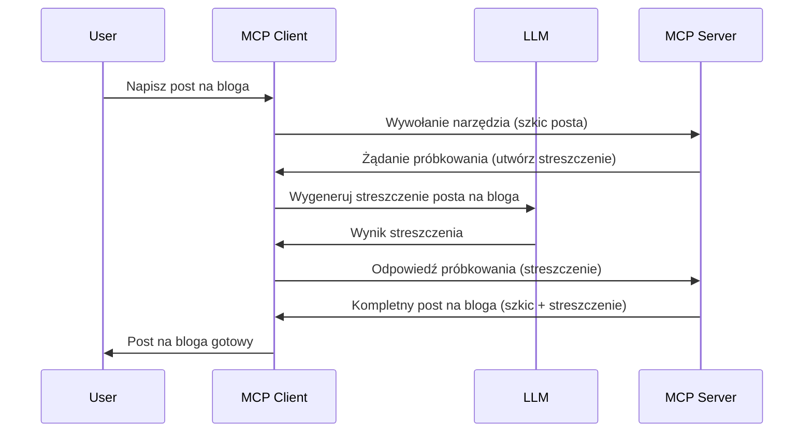

# Sampling - delegowanie funkcji do Klienta

> **Informacja o wycofaniu:** kandydat na specyfikację MCP z dnia `2026-07-28` oznacza Sampling jako przestarzały na rzecz bezpośredniej integracji z interfejsami API dostawców LLM. Sampling nadal działa w `2025-11-25` i przez co najmniej rok po formalnym wycofaniu, więc wszystko w tej lekcji pozostaje aktualne — ale nowe projekty serwerów powinny rozważyć wzorzec zastępczy. Zobacz [Co się zmienia w MCP: kandydat na wydanie 2026-07-28](../../01-CoreConcepts/mcp-2026-07-28-release-candidate.md).

Czasem potrzebujesz, aby klient MCP i serwer MCP współpracowały, aby osiągnąć wspólny cel. Możesz mieć przypadek, w którym serwer wymaga pomocy LLM, który działa po stronie klienta. W takiej sytuacji powinieneś użyć sampling.

Przyjrzyjmy się kilku przypadkom użycia i jak zbudować rozwiązanie z wykorzystaniem sampling.

## Przegląd

W tej lekcji skupimy się na wyjaśnieniu, kiedy i gdzie używać Sampling oraz jak go skonfigurować.

## Cele nauki

W tym rozdziale:

- Wyjaśnimy, czym jest Sampling i kiedy go używać.
- Pokażemy, jak skonfigurować Sampling w MCP.
- Przedstawimy przykłady działania Sampling.

## Czym jest Sampling i dlaczego go używać?

Sampling to zaawansowana funkcja działająca w następujący sposób:



### Żądanie sampling

Dobrze, mamy teraz ogólny obraz wiarygodnego scenariusza, porozmawiajmy o żądaniu sampling, które serwer wysyła z powrotem do klienta. Tak może wyglądać takie żądanie w formacie JSON-RPC:

```json
{
  "jsonrpc": "2.0",
  "id": 1,
  "method": "sampling/createMessage",
  "params": {
    "messages": [
      {
        "role": "user",
        "content": {
          "type": "text",
          "text": "Create a blog post summary of the following blog post: <BLOG POST>"
        }
      }
    ],
    "modelPreferences": {
      "hints": [
        {
          "name": "claude-3-sonnet"
        }
      ],
      "intelligencePriority": 0.8,
      "speedPriority": 0.5
    },
    "systemPrompt": "You are a helpful assistant.",
    "maxTokens": 100
  }
}
```

Warto tu zwrócić uwagę na kilka rzeczy:

- Prompt, pod content -> text, to nasza instrukcja dla LLM, aby podsumował treść wpisu na blogu.

- **modelPreferences**. Ta sekcja to właśnie preferencje, rekomendacja konfiguracji do użycia z LLM. Użytkownik może zdecydować, czy skorzystać z tych rekomendacji, czy je zmienić. W tym przypadku są rekomendacje dotyczące modelu, szybkości i priorytetu inteligencji.
- **systemPrompt**, to normalny prompt systemowy, który nadaje osobowość twojemu LLM i zawiera instrukcje.
- **maxTokens**, to właściwość mówiąca, ile tokenów zaleca się użyć do tego zadania.

### Odpowiedź sampling

Ta odpowiedź jest tym, co Klient MCP ostatecznie wysyła z powrotem do Serwera MCP i jest wynikiem wywołania LLM po stronie klienta, oczekiwaniem na odpowiedź i skonstruowaniem tej wiadomości. Tak może wyglądać w JSON-RPC:

```json
{
  "jsonrpc": "2.0",
  "id": 1,
  "result": {
    "role": "assistant",
    "content": {
      "type": "text",
      "text": "Here's your abstract <ABSTRACT>"
    },
    "model": "gpt-5",
    "stopReason": "endTurn"
  }
}
```

Zwróć uwagę, że odpowiedź to abstrakt wpisu na blogu, tak jak prosiliśmy. Zauważ też, że użyty `model` nie jest tym, o który prosiliśmy, tylko "gpt-5" zamiast "claude-3-sonnet". To ma pokazać, że użytkownik może zmienić zdanie, co do wyboru i że twoje żądanie sampling to tylko rekomendacja.

Dobrze, skoro rozumiemy główny przepływ oraz przydatne zadanie "tworzenie wpisu na bloga + abstrakt", zobaczmy co trzeba zrobić, aby to działało.

### Typy wiadomości

Wiadomości sampling nie ograniczają się tylko do tekstu, możesz również wysyłać obrazy i audio. Tak inaczej wygląda JSON-RPC:

**Tekst**

```json
{
  "type": "text",
  "text": "The message content"
}
```

**Zawartość obrazu**

```json
{
  "type": "image",
  "data": "base64-encoded-image-data",
  "mimeType": "image/jpeg"
}
```

**Zawartość audio**

```json
{
  "type": "audio",
  "data": "base64-encoded-audio-data",
  "mimeType": "audio/wav"
}
```

> NOTE: po więcej szczegółowych informacji o Sampling zajrzyj do [oficjalnej dokumentacji](https://modelcontextprotocol.io/specification/2025-11-25/client/sampling)

## Jak skonfigurować Sampling w Kliencie

> Uwaga: jeśli budujesz tylko serwer, nie musisz tu wiele robić.

W kliencie musisz określić następującą funkcję w ten sposób:

```json
{
  "capabilities": {
    "sampling": {}
  }
}
```

To zostanie rozpoznane podczas inicjalizacji twojego klienta z serwerem.

## Przykład działania Sampling - tworzenie wpisu na bloga

Stwórzmy razem serwer do sampling, musimy zrobić następujące kroki:

1. Stwórz narzędzie po stronie Serwera.
1. To narzędzie powinno wygenerować żądanie sampling
1. Narzędzie powinno czekać na odpowiedź klienta na żądanie sampling.
1. Następnie powinno wygenerować wynik narzędzia.

Zobaczmy kod krok po kroku:

### -1- Stwórz narzędzie

**python**

```python
@mcp.tool()
async def create_blog(title: str, content: str, ctx: Context[ServerSession, None]) -> str:
    """Create a blog post and generate a summary"""

```

### -2- Stwórz żądanie sampling

Rozszerz narzędzie o następujący kod:

**python**

```python
post = BlogPost(
        id=len(posts) + 1,
        title=title,
        content=content,
        abstract=""
    )

prompt = f"Create an abstract of the following blog post: title: {title} and draft: {content} "

result = await ctx.session.create_message(
        messages=[
            SamplingMessage(
                role="user",
                content=TextContent(type="text", text=prompt),
            )
        ],
        max_tokens=100,
)

```

### -3- Czekaj na odpowiedź i zwróć ją

**python**

```python
post.abstract = result.content.text

posts.append(post)

# zwróć pełny produkt
return json.dumps({
    "id": post.title,
    "abstract": post.abstract
})
```

### -4- Pełny kod

**python**

```python
from starlette.applications import Starlette
from starlette.routing import Mount, Host

from mcp.server.fastmcp import Context, FastMCP

from mcp.server.session import ServerSession
from mcp.types import SamplingMessage, TextContent

import json


from uuid import uuid4
from typing import List
from pydantic import BaseModel


mcp = FastMCP("Blog post generator")

# app = FastAPI()

posts = []

class BlogPost(BaseModel):
    id: int
    title: str
    content: str
    abstract: str

posts: List[BlogPost] = []

@mcp.tool()
async def create_blog(title: str, content: str, ctx: Context[ServerSession, None]) -> str:
    """Create a blog post and generate a summary"""

    post = BlogPost(
        id=len(posts) + 1,
        title=title,
        content=content,
        abstract=""
    )

    prompt = f"Create an abstract of the following blog post: title: {title} and draft: {content} "

    result = await ctx.session.create_message(
        messages=[
            SamplingMessage(
                role="user",
                content=TextContent(type="text", text=prompt),
            )
        ],
        max_tokens=100,
    )

    post.abstract = result.content.text

    posts.append(post)

    # zwróć pełny wpis na blogu
    return json.dumps({
        "id": post.title,
        "abstract": post.abstract
    })

if __name__ == "__main__":
    print("Starting server...")
    # mcp.run()
    mcp.run(transport="streamable-http")

# uruchom aplikację za pomocą: python server.py
```

### -5- Testowanie w Visual Studio Code

Aby to przetestować w Visual Studio Code, wykonaj:

1. Uruchom serwer w terminalu
1. Dodaj go do *mcp.json* (i upewnij się, że jest uruchomiony), na przykład tak:

   ```json
   "servers": {
      "blog-server": {
        "type": "http",
        "url": "http://localhost:8000/mcp"
      }
   }
   ```

1. Wpisz prompt:

   ```text
   create a blog post named "Where Python comes from", the content is "Python is actually named after Monty Python Flying Circus"
   ```

1. Pozwól na sampling. Przy pierwszym teście pojawi się dodatkowe okno dialogowe, które trzeba zaakceptować, potem pojawi się normalne okno z prośbą o uruchomienie narzędzia.

1. Sprawdź wyniki. Zobaczysz wyniki ładnie wyrenderowane w GitHub Copilot Chat, ale możesz też przejrzeć surową odpowiedź JSON.

**Bonus**. Visual Studio Code oferuje świetne wsparcie dla sampling. Możesz skonfigurować dostęp do Sampling na zainstalowanym serwerze, postępując tak:

1. Przejdź do sekcji rozszerzeń.
1. Wybierz ikonę koła zębatego przy twoim zainstalowanym serwerze w sekcji "MCP SERVERS - INSTALLED".
1 Wybierz "Configure Model Access", tutaj możesz wybrać, które modele GitHub Copilot może używać do sampling. Możesz też zobaczyć wszystkie ostatnie żądania sampling wybierając "Show Sampling requests".

## Zadanie

W tym zadaniu zbudujesz nieco inny Sampling, a mianowicie integrację sampling wspierającą generowanie opisu produktu. Oto twój scenariusz:

**Scenariusz**: Pracownik zaplecza e-commerce potrzebuje pomocy, generowanie opisów produktów zajmuje za dużo czasu. Dlatego masz zbudować rozwiązanie, gdzie wywołujesz narzędzie "create_product" z argumentami "title" i "keywords" i powinno wygenerować kompletny produkt z polem "description" wypełnionym przez LLM klienta.

TIP: wykorzystaj to, czego nauczyłeś się wcześniej, aby skonstruować serwer i jego narzędzie za pomocą żądania sampling.

## Rozwiązanie

[Solution](./solution/README.md)

## Najważniejsze informacje

Sampling to potężna funkcja, która pozwala serwerowi delegować zadania klientowi, gdy potrzebuje pomocy LLM.

## Co dalej

- [Rozdział 4 - Praktyczna implementacja](../../04-PracticalImplementation/README.md)

---

<!-- CO-OP TRANSLATOR DISCLAIMER START -->
**Zastrzeżenie**:
Niniejszy dokument został przetłumaczony za pomocą usługi tłumaczenia AI [Co-op Translator](https://github.com/Azure/co-op-translator). Choć dążymy do dokładności, prosimy pamiętać, że automatyczne tłumaczenia mogą zawierać błędy lub niedokładności. Oryginalny dokument w jego języku źródłowym należy uznawać za autorytatywne źródło. W przypadku informacji krytycznych zalecane jest skorzystanie z profesjonalnego tłumaczenia wykonanego przez człowieka. Nie ponosimy odpowiedzialności za jakiekolwiek nieporozumienia lub błędne interpretacje wynikające z użycia tego tłumaczenia.
<!-- CO-OP TRANSLATOR DISCLAIMER END -->