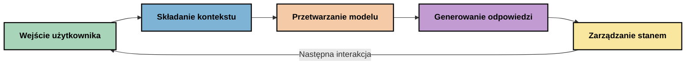
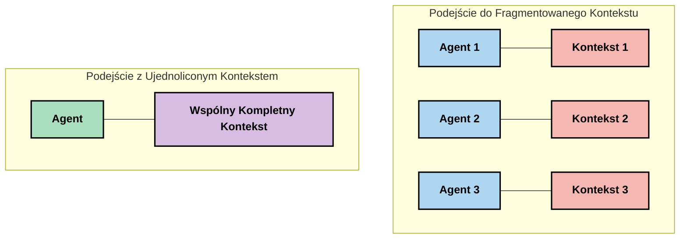
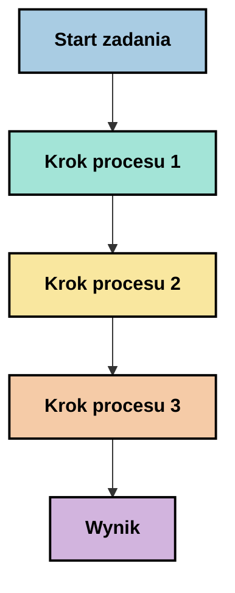
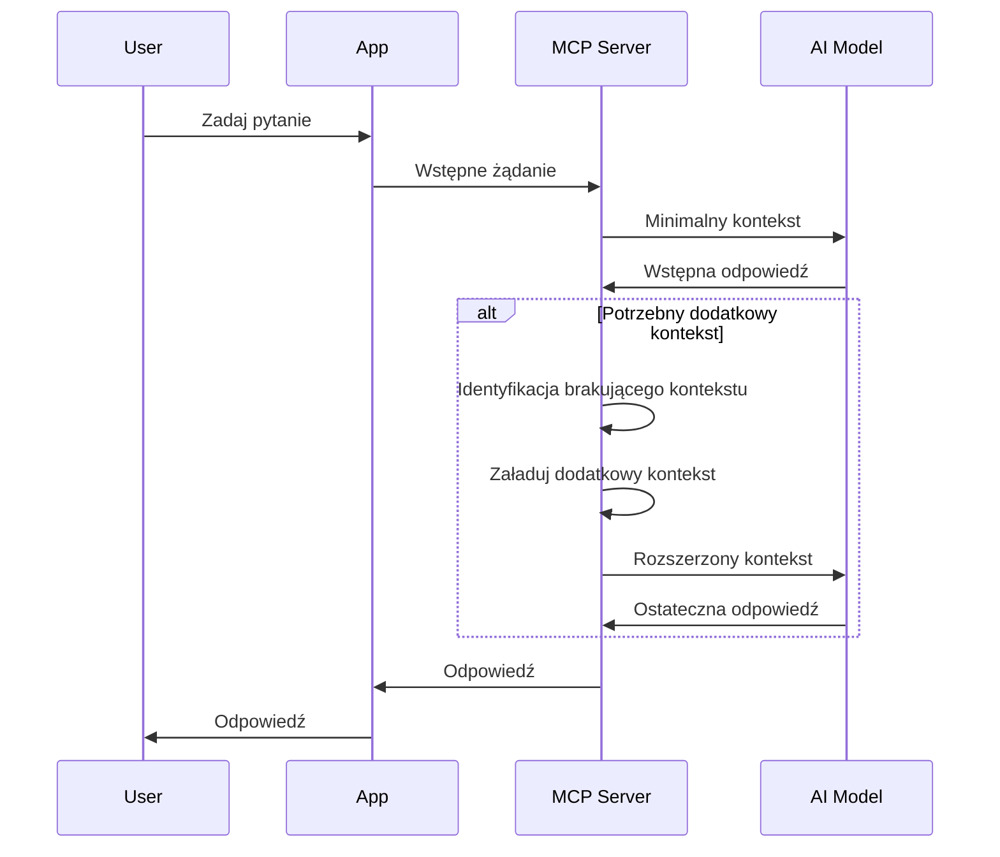
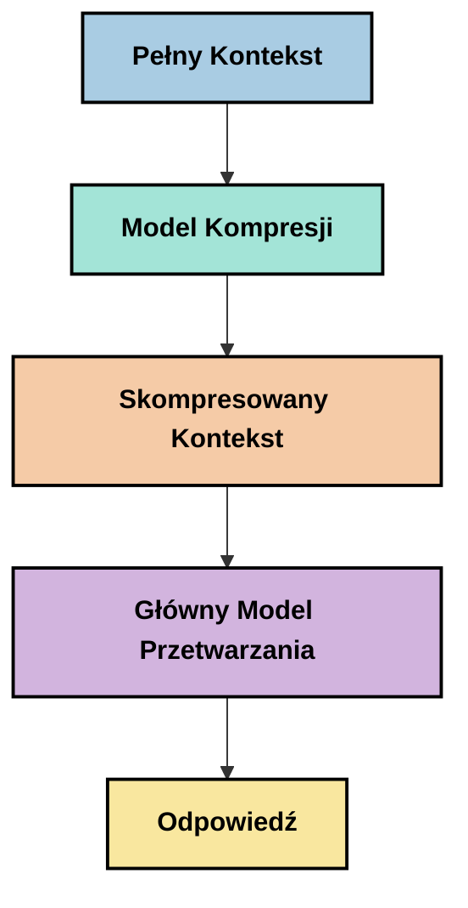
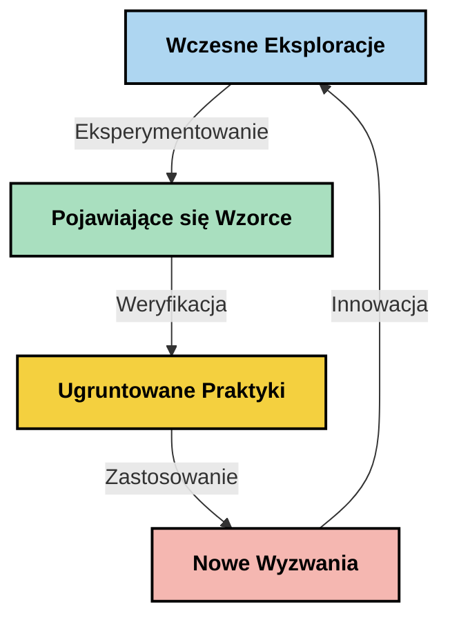

# Inżynieria kontekstu: nowo powstająca koncepcja w ekosystemie MCP

## Przegląd

Inżynieria kontekstu to nowo powstająca koncepcja w przestrzeni AI, która bada, jak informacje są strukturyzowane, dostarczane i utrzymywane podczas interakcji między klientami a usługami AI. W miarę rozwoju ekosystemu Model Context Protocol (MCP) zrozumienie, jak skutecznie zarządzać kontekstem, staje się coraz ważniejsze. Ten moduł wprowadza koncepcję inżynierii kontekstu i eksploruje jej potencjalne zastosowania w implementacjach MCP.

## Cele nauki

Po zakończeniu tego modułu będziesz w stanie:

- Zrozumieć nowo powstającą koncepcję inżynierii kontekstu i jej potencjalną rolę w aplikacjach MCP
- Zidentyfikować kluczowe wyzwania związane z zarządzaniem kontekstem, które protokół MCP adresuje
- Poznać techniki poprawy wydajności modelu poprzez lepsze zarządzanie kontekstem
- Rozważyć podejścia do mierzenia i oceny skuteczności kontekstu
- Zastosować te nowo powstające koncepcje, by poprawić doświadczenia AI dzięki ramom MCP

## Wprowadzenie do inżynierii kontekstu

Inżynieria kontekstu to nowo powstająca koncepcja, koncentrująca się na celowym projektowaniu i zarządzaniu przepływem informacji między użytkownikami, aplikacjami a modelami AI. W przeciwieństwie do ugruntowanych dziedzin, takich jak inżynieria promptów, inżynieria kontekstu jest wciąż definiowana przez praktyków, którzy pracują nad rozwiązaniem unikalnych wyzwań związanych z dostarczaniem modelom AI właściwych informacji we właściwym czasie.

W miarę rozwoju dużych modeli językowych (LLM) znaczenie kontekstu stało się coraz bardziej oczywiste. Jakość, trafność i struktura kontekstu, który zapewniamy, bezpośrednio wpływają na wyniki modelu. Inżynieria kontekstu bada tę relację i dąży do opracowania zasad skutecznego zarządzania kontekstem.

> „W 2025 roku modele są niezwykle inteligentne. Ale nawet najbystrzejszy człowiek nie będzie mógł skutecznie wykonywać swojej pracy bez kontekstu tego, o co jest proszony... ‘Inżynieria kontekstu’ to kolejny poziom inżynierii promptów. Chodzi o automatyczne działanie w dynamicznym systemie.” — Walden Yan, Cognition AI

Inżynieria kontekstu może obejmować:

1. **Wybór kontekstu**: Określanie, które informacje są istotne dla danego zadania  
2. **Strukturyzację kontekstu**: Organizowanie informacji, by zmaksymalizować zrozumienie przez model  
3. **Dostarczanie kontekstu**: Optymalizację sposobu i czasu przesyłania informacji do modeli  
4. **Utrzymanie kontekstu**: Zarządzanie stanem i ewolucją kontekstu w czasie  
5. **Ewaluację kontekstu**: Mierzenie i poprawę efektywności kontekstu  

Te obszary są szczególnie istotne dla ekosystemu MCP, który oferuje ustandaryzowany sposób, aby aplikacje mogły dostarczać kontekst do LLM.

## Perspektywa podróży kontekstu

Jednym ze sposobów wizualizacji inżynierii kontekstu jest śledzenie podróży informacji przez system MCP:



### Kluczowe etapy w podróży kontekstu:

1. **Wejście użytkownika**: Surowe informacje od użytkownika (tekst, obrazy, dokumenty)  
2. **Składanie kontekstu**: Łączenie danych użytkownika z kontekstem systemowym, historią rozmowy i innymi pozyskanymi informacjami  
3. **Przetwarzanie modelu**: Model AI przetwarza złożony kontekst  
4. **Generowanie odpowiedzi**: Model generuje wyniki na podstawie dostarczonego kontekstu  
5. **Zarządzanie stanem**: System aktualizuje swój stan wewnętrzny w oparciu o interakcję  

Ta perspektywa uwypukla dynamiczny charakter kontekstu w systemach AI i rodzi ważne pytania o to, jak najlepiej zarządzać informacjami na każdym etapie.

## Nowo powstające zasady inżynierii kontekstu

W miarę rozwijania się dziedziny inżynierii kontekstu, pojawiają się wstępne zasady od praktyków. Mogą one pomóc w podejmowaniu decyzji przy implementacji MCP:

### Zasada 1: Udostępniaj kontekst w całości

Kontekst powinien być udostępniany kompletnie pomiędzy wszystkimi komponentami systemu, zamiast być fragmentaryzowany między różnymi agentami lub procesami. Gdy kontekst jest rozproszony, decyzje podejmowane w jednej części systemu mogą być sprzeczne z decyzjami gdzie indziej.



W aplikacjach MCP oznacza to projektowanie systemów, w których kontekst przepływa bez zakłóceń przez cały łańcuch, a nie jest podzielony na segmenty.

### Zasada 2: Rozpoznaj, że działania niosą ukryte decyzje

Każde działanie modelu zawiera ukryte decyzje dotyczące interpretacji kontekstu. Gdy wiele komponentów działa na różnych kontekstach, te ukryte decyzje mogą się ze sobą konfliktować, prowadząc do niespójnych wyników.

Ta zasada ma ważne implikacje dla aplikacji MCP:  
- Preferuj liniowe przetwarzanie złożonych zadań zamiast równoległego działania z fragmentarycznym kontekstem  
- Upewnij się, że wszystkie punkty decyzyjne mają dostęp do tej samej informacji kontekstowej  
- Projektuj systemy tak, aby kroki późniejsze mogły widzieć pełny kontekst wcześniejszych decyzji  

### Zasada 3: Zachowaj równowagę między głębokością kontekstu a ograniczeniami okna

W miarę wydłużania się rozmów i procesów okno kontekstu ostatecznie się przepełnia. Skuteczna inżynieria kontekstu bada podejścia radzenia sobie z napięciem między pełnym kontekstem a ograniczeniami technicznymi.

Potencjalne podejścia obejmują:  
- Kompresję kontekstu, która zachowuje kluczowe informacje i jednocześnie redukuje użycie tokenów  
- Stopniowe ładowanie kontekstu w oparciu o aktualną potrzebę  
- Podsumowywanie wcześniejszych interakcji przy zachowaniu kluczowych decyzji i faktów  

## Wyzwania kontekstu i projekt protokołu MCP

Model Context Protocol (MCP) został zaprojektowany z uwzględnieniem unikatowych wyzwań związanych z zarządzaniem kontekstem. Zrozumienie tych wyzwań pomaga wyjaśnić kluczowe aspekty projektu protokołu MCP:

### Wyzwanie 1: Ograniczenia okna kontekstu  
Większość modeli AI ma stałe rozmiary okien kontekstowych, co ogranicza, ile informacji mogą przetworzyć naraz.

**Reakcja projektu MCP:**  
- Protokół wspiera strukturalny kontekst oparty na zasobach, który może być efektywnie referencjonowany  
- Zasoby mogą być stronicowane i ładowane progresywnie  

### Wyzwanie 2: Określenie trafności  
Określenie, które informacje są najbardziej istotne do uwzględnienia w kontekście, jest trudne.

**Reakcja projektu MCP:**  
- Elastyczne narzędzia pozwalają na dynamiczne pobieranie informacji w zależności od potrzeb  
- Strukturalne promptowanie umożliwia spójną organizację kontekstu  

### Wyzwanie 3: Utrzymywanie kontekstu  
Zarządzanie stanem w trakcie interakcji wymaga dokładnego śledzenia kontekstu.

**Reakcja projektu MCP:**  
- Ustandaryzowane zarządzanie sesją  
- Wyraźnie zdefiniowane wzorce interakcji dla ewolucji kontekstu  

### Wyzwanie 4: Kontekst multimodalny  
Różne rodzaje danych (tekst, obrazy, dane strukturalne) wymagają odmiennego traktowania.

**Reakcja projektu MCP:**  
- Projekt protokołu uwzględnia różne typy zawartości  
- Ustandaryzowana reprezentacja informacji multimodalnych  

### Wyzwanie 5: Bezpieczeństwo i prywatność  
Kontekst często zawiera wrażliwe informacje, które muszą być chronione.

**Reakcja projektu MCP:**  
- Jasne granice odpowiedzialności klienta i serwera  
- Opcje lokalnego przetwarzania w celu minimalizacji ekspozycji danych  

Zrozumienie tych wyzwań i sposobu, w jaki MCP im sprostał, stanowi podstawę do eksplorowania zaawansowanych technik inżynierii kontekstu.

## Nowo powstające podejścia do inżynierii kontekstu

W miarę rozwoju dziedziny inżynierii kontekstu pojawiają się obiecujące podejścia. Reprezentują one aktualne myślenie, a nie ustalone dobre praktyki i prawdopodobnie będą ewoluować wraz ze zdobywaniem doświadczeń w implementacjach MCP.

### 1. Jednowątkowe liniowe przetwarzanie

W przeciwieństwie do architektur wieloagentowych, które rozpraszają kontekst, niektórzy praktycy odkrywają, że jednowątkowe liniowe przetwarzanie daje bardziej spójne wyniki. Zgodne jest to z zasadą utrzymania zjednoczonego kontekstu.



Choć podejście to może wydawać się mniej efektywne niż przetwarzanie równoległe, często daje bardziej spójne i niezawodne wyniki, ponieważ każdy krok opiera się na pełnym zrozumieniu wcześniejszych decyzji.

### 2. Dzielenie i priorytetyzacja kontekstu

Dzielimy duże konteksty na zarządzalne kawałki i priorytetyzujemy to, co najważniejsze.

```python
# Przykład koncepcyjny: Dzielenie kontekstu i ustalanie priorytetów
def process_with_chunked_context(documents, query):
    # 1. Podziel dokumenty na mniejsze fragmenty
    chunks = chunk_documents(documents)
    
    # 2. Obliczaj wskaźniki relewantności dla każdego fragmentu
    scored_chunks = [(chunk, calculate_relevance(chunk, query)) for chunk in chunks]
    
    # 3. Sortuj fragmenty według wskaźnika relewantności
    sorted_chunks = sorted(scored_chunks, key=lambda x: x[1], reverse=True)
    
    # 4. Używaj najbardziej relewantnych fragmentów jako kontekstu
    context = create_context_from_chunks([chunk for chunk, score in sorted_chunks[:5]])
    
    # 5. Przetwarzaj z priorytetowym kontekstem
    return generate_response(context, query)
```

Powyższa koncepcja ilustruje, jak możemy dzielić duże dokumenty na fragmenty i wybierać tylko najbardziej istotne części do kontekstu. Podejście to pomaga działać w ramach ograniczeń okna kontekstu, jednocześnie wykorzystując duże bazy wiedzy.

### 3. Stopniowe ładowanie kontekstu

Ładowanie kontekstu stopniowo, w miarę potrzeby, zamiast wszystkiego naraz.



Stopniowe ładowanie kontekstu zaczyna się od minimalnego zakresu informacji i rozszerza tylko wtedy, gdy jest to konieczne. Może to znacząco zredukować użycie tokenów przy prostych zapytaniach, jednocześnie umożliwiając obsługę bardziej złożonych pytań.

### 4. Kompresja i podsumowywanie kontekstu

Zmniejszanie rozmiaru kontekstu przy zachowaniu istotnych informacji.



Kompresja kontekstu koncentruje się na:  
- Usuwaniu powtórzeń  
- Podsumowywaniu obszernej zawartości  
- Wydobywaniu kluczowych faktów i szczegółów  
- Zachowywaniu krytycznych elementów kontekstu  
- Optymalizacji pod kątem efektywności tokenów  

To podejście może być szczególnie wartościowe do utrzymywania długich rozmów w ramach okien kontekstowych lub do efektywnego przetwarzania dużych dokumentów. Niektórzy praktycy używają wyspecjalizowanych modeli szczególnie do kompresji i podsumowywania historii konwersacji.

## Eksploracyjne rozważania inżynierii kontekstu

W miarę eksploracji nowo powstającej dziedziny inżynierii kontekstu warto rozważyć kilka aspektów przy pracy z implementacjami MCP. Nie są to nakazujące dobre praktyki, lecz obszary eksploracji mogące przynieść ulepszenia w Twoim konkretnym zastosowaniu.

### Rozważ cele swojego kontekstu

Zanim wdrożysz złożone rozwiązania zarządzania kontekstem, jasno określ, co chcesz osiągnąć:  
- Jakie konkretne informacje model potrzebuje, by odnieść sukces?  
- Które informacje są niezbędne, a które dodatkowe?  
- Jakie masz ograniczenia wydajności (latencja, limity tokenów, koszty)?

### Eksploruj podejścia warstwowe do kontekstu

Niektórzy praktycy odnoszą sukces z kontekstem ułożonym w warstwy koncepcyjne:  
- **Warstwa podstawowa**: Niezbędne informacje, których model zawsze potrzebuje  
- **Warstwa sytuacyjna**: Kontekst specyficzny dla bieżącej interakcji  
- **Warstwa wspierająca**: Dodatkowe informacje, które mogą być pomocne  
- **Warstwa zapasowa**: Informacje dostępne tylko w razie potrzeby  

### Zbadaj strategie pobierania danych

Efektywność Twojego kontekstu często zależy od sposobu pozyskiwania informacji:  
- Wyszukiwanie semantyczne i embeddingi do znajdowania konceptualnie istotnych informacji  
- Wyszukiwanie oparte na słowach kluczowych dla konkretnych faktów  
- Podejścia hybrydowe łączące różne metody pozyskiwania  
- Filtrowanie metadanych zawężające zakres według kategorii, dat lub źródeł  

### Eksperymentuj z koherencją kontekstu

Struktura i przepływ kontekstu mogą wpływać na zrozumienie modelu:  
- Grupowanie powiązanych informacji razem  
- Używanie spójnego formatowania i organizacji  
- Utrzymywanie logicznego lub chronologicznego porządku tam, gdzie to stosowne  
- Unikanie sprzecznych informacji  

### Rozważ kompromisy architektur wieloagentowych

Choć architektury wieloagentowe są popularne w wielu frameworkach AI, niosą poważne wyzwania w zarządzaniu kontekstem:  
- Fragmentacja kontekstu może prowadzić do niespójnych decyzji między agentami  
- Przetwarzanie równoległe może wprowadzać konflikty trudne do pogodzenia  
- Koszty komunikacji między agentami mogą skompensować zyski wydajności  
- Zarządzanie stanem jest złożone i wymaga utrzymania spójności  

W wielu przypadkach podejście jednoagentowe z kompleksowym zarządzaniem kontekstem może dać bardziej niezawodne rezultaty niż wiele wyspecjalizowanych agentów z fragmentarycznym kontekstem.

### Opracuj metody ewaluacji

Aby z czasem ulepszać inżynierię kontekstu, rozważ, jak będziesz mierzyć sukces:  
- Testy A/B różnych struktur kontekstu  
- Monitorowanie użycia tokenów i czasów reakcji  
- Śledzenie satysfakcji użytkownika i wskaźników ukończenia zadań  
- Analiza przypadków, gdy strategie kontekstowe zawodzą  

Te rozważania stanowią aktywne obszary eksploracji w dziedzinie inżynierii kontekstu. W miarę rozwoju dziedziny prawdopodobnie pojawią się bardziej definitywne wzorce i praktyki.

## Mierzenie skuteczności kontekstu: rozwijające się ramy

W miarę pojawiania się inżynierii kontekstu praktycy zaczynają badać, jak mierzyć jej skuteczność. Nie istnieją jeszcze ustalone ramy, ale rozważane są różne metryki, które mogą pomóc ukierunkować przyszłe prace.

### Potencjalne wymiary pomiaru

#### 1. Rozważania dotyczące efektywności wejścia  

- **Stosunek kontekstu do odpowiedzi**: Ile kontekstu jest potrzebne względem rozmiaru odpowiedzi?  
- **Wykorzystanie tokenów**: Jaki procent tokenów kontekstowych wpływa na odpowiedź?  
- **Redukcja kontekstu**: Jak skutecznie można skompresować surowe informacje?  

#### 2. Rozważania dotyczące wydajności  

- **Wpływ na opóźnienia**: Jak zarządzanie kontekstem wpływa na czas odpowiedzi?  
- **Ekonomia tokenów**: Czy optymalizujemy użycie tokenów efektywnie?  
- **Precyzja pobierania**: Jak trafne są pobierane informacje?  
- **Wykorzystanie zasobów**: Jakie zasoby obliczeniowe są wymagane?  

#### 3. Rozważania dotyczące jakości  

- **Trafność odpowiedzi**: Jak dobrze odpowiedź odpowiada na zapytanie?  
- **Dokładność faktograficzna**: Czy zarządzanie kontekstem poprawia poprawność faktów?  
- **Spójność**: Czy odpowiedzi są spójne dla podobnych zapytań?  
- **Wskaźnik halucynacji**: Czy lepszy kontekst zmniejsza halucynacje modelu?  

#### 4. Rozważania dotyczące doświadczenia użytkownika  

- **Wskaźnik konieczności wyjaśnień**: Jak często użytkownicy potrzebują doprecyzowań?  
- **Ukończenie zadania**: Czy użytkownicy skutecznie osiągają cele?  
- **Wskaźniki satysfakcji**: Jak użytkownicy oceniają swoje doświadczenie?  

### Eksploracyjne podejścia do pomiaru

Eksperymentując z inżynierią kontekstu w implementacjach MCP, rozważ te eksploracyjne podejścia:  

1. **Porównania bazowe**: Ustal bazę odniesienia z prostymi podejściami do kontekstu przed testowaniem bardziej zaawansowanych metod  
2. **Zmiany inkrementalne**: Zmieniaj jeden aspekt zarządzania kontekstem na raz, by wyizolować jego efekty  
3. **Ocena ukierunkowana na użytkownika**: Łącz metryki ilościowe z jakościową opinią użytkowników  
4. **Analiza niepowodzeń**: Przeanalizuj przypadki niepowodzenia strategii kontekstowych, by zrozumieć możliwe poprawki  
5. **Ocena wielowymiarowa**: Rozważ kompromisy między efektywnością, jakością i doświadczeniem użytkownika  

Takie eksperymentalne, wieloaspektowe podejście do pomiaru jest zgodne z nowo powstającym charakterem inżynierii kontekstu.

## Końcowe myśli

Inżynieria kontekstu to nowa dziedzina eksploracji, która może stać się centralna dla skutecznych aplikacji MCP. Dzięki przemyślanemu podejściu do przepływu informacji przez Twój system, możesz potencjalnie stworzyć doświadczenia AI, które będą bardziej efektywne, dokładne i wartościowe dla użytkowników.

Techniki i podejścia opisane w tym module reprezentują wczesne myślenie, a nie ustalone praktyki. Inżynieria kontekstu może rozwinąć się w bardziej zdefiniowaną dyscyplinę wraz z ewolucją zdolności AI i pogłębieniem naszego rozumienia. Na razie eksperymenty połączone z uważnym pomiarem wydają się być najbardziej produktywną ścieżką.

## Potencjalne przyszłe kierunki

Dziedzina inżynierii kontekstu jest jeszcze na wczesnym etapie, ale wyłania się kilka obiecujących kierunków:

- Zasady inżynierii kontekstu mogą znacząco wpłynąć na wydajność modelu, efektywność, doświadczenie użytkownika i niezawodność  
- Podejścia jednowątkowe z kompleksowym zarządzaniem kontekstem mogą przewyższać architektury wieloagentowe w wielu zastosowaniach  
- Specjalizowane modele kompresji kontekstu mogą stać się standardowymi komponentami w pipeline AI  
- Napięcie między kompletnością kontekstu a ograniczeniami tokenów prawdopodobnie napędzi innowacje w obsłudze kontekstu  
- W miarę jak modele staną się bardziej zdolne do efektywnej, ludzkopodobnej komunikacji, prawdziwa współpraca wieloagentowa może stać się bardziej wykonalna  
- Implementacje MCP mogą ewoluować, by standaryzować wzorce zarządzania kontekstem, które wyłonią się z obecnych eksperymentów  



## Zasoby

### Oficjalne zasoby MCP
- [Model Context Protocol Website](https://modelcontextprotocol.io/)  
- [Model Context Protocol Specification](https://github.com/modelcontextprotocol/modelcontextprotocol)
- [Dokumentacja MCP](https://modelcontextprotocol.io/docs)
- [MCP C# SDK](https://github.com/modelcontextprotocol/csharp-sdk)
- [MCP Python SDK](https://github.com/modelcontextprotocol/python-sdk)
- [MCP TypeScript SDK](https://github.com/modelcontextprotocol/typescript-sdk)
- [MCP Inspector](https://github.com/modelcontextprotocol/inspector) - Narzędzie do wizualnego testowania serwerów MCP

### Artykuły o Inżynierii Kontekstu
- [Nie buduj wieloagentów: Zasady inżynierii kontekstu](https://cognition.ai/blog/dont-build-multi-agents) - Wnioski Waldena Yana dotyczące zasad inżynierii kontekstu
- [Praktyczny przewodnik po budowaniu agentów](https://cdn.openai.com/business-guides-and-resources/a-practical-guide-to-building-agents.pdf) - Przewodnik OpenAI dotyczący skutecznego projektowania agentów
- [Budowanie skutecznych agentów](https://www.anthropic.com/engineering/building-effective-agents) - Podejście Anthropic do rozwoju agentów

### Powiązane badania
- [Dynamiczne rozszerzanie wyszukiwania dla dużych modeli językowych](https://arxiv.org/abs/2310.01487) - Badania nad dynamicznymi metodami wyszukiwania
- [Zagubieni w środku: Jak modele językowe wykorzystują długi kontekst](https://arxiv.org/abs/2307.03172) - Ważne badania nad wzorcami przetwarzania kontekstu
- [Hierarchiczne generowanie obrazów warunkowanych tekstem z latentami CLIP](https://arxiv.org/abs/2204.06125) - Artykuł DALL-E 2 z wnioskami na temat strukturyzacji kontekstu
- [Badanie roli kontekstu w architekturach dużych modeli językowych](https://aclanthology.org/2023.findings-emnlp.124/) - Najnowsze badania nad obsługą kontekstu
- [Współpraca wieloagentowa: Przegląd](https://arxiv.org/abs/2304.03442) - Badania nad systemami wieloagentowymi i ich wyzwaniami

### Dodatkowe zasoby
- [Techniki optymalizacji okna kontekstowego](https://learn.microsoft.com/en-us/azure/ai-services/openai/concepts/context-window)
- [Zaawansowane techniki RAG](https://www.microsoft.com/en-us/research/blog/retrieval-augmented-generation-rag-and-frontier-models/)
- [Dokumentacja Semantic Kernel](https://github.com/microsoft/semantic-kernel)
- [Zestaw narzędzi AI do zarządzania kontekstem](https://github.com/microsoft/aitoolkit)

## Co dalej

- [5.15 Niestandardowy transport MCP](../mcp-transport/README.md)

---

<!-- CO-OP TRANSLATOR DISCLAIMER START -->
**Zastrzeżenie**:
Niniejszy dokument został przetłumaczony za pomocą usługi tłumaczenia AI [Co-op Translator](https://github.com/Azure/co-op-translator). Choć dążymy do dokładności, prosimy pamiętać, że automatyczne tłumaczenia mogą zawierać błędy lub niedokładności. Oryginalny dokument w jego języku źródłowym należy uznawać za autorytatywne źródło. W przypadku informacji krytycznych zalecane jest skorzystanie z profesjonalnego tłumaczenia wykonanego przez człowieka. Nie ponosimy odpowiedzialności za jakiekolwiek nieporozumienia lub błędne interpretacje wynikające z użycia tego tłumaczenia.
<!-- CO-OP TRANSLATOR DISCLAIMER END -->