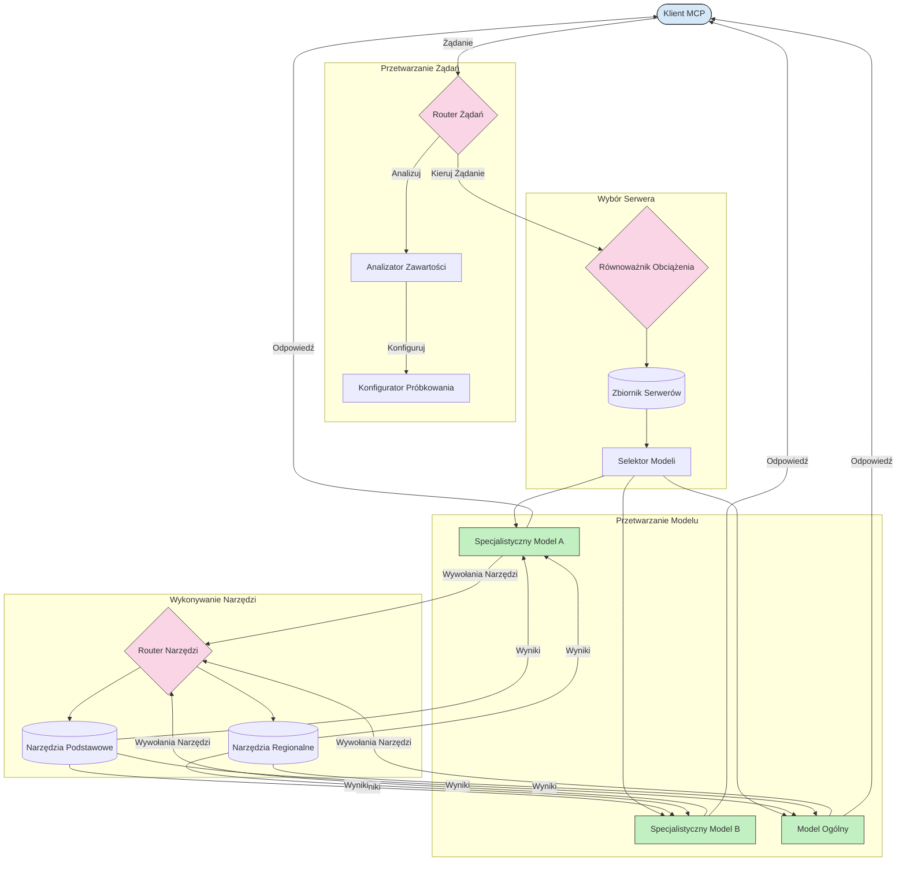

# Routing w Model Context Protocol

Routing jest niezbędny do kierowania żądań do odpowiednich modeli, narzędzi lub usług w ramach ekosystemu MCP.

## Wprowadzenie

Routing w Model Context Protocol (MCP) polega na kierowaniu żądań do najbardziej odpowiednich modeli lub usług na podstawie różnych kryteriów, takich jak typ treści, kontekst użytkownika oraz obciążenie systemu. Zapewnia to efektywne przetwarzanie i optymalne wykorzystanie zasobów.

## Cele nauki

Po zakończeniu tej lekcji będziesz potrafił:

- Zrozumieć zasady routingu w MCP.
- Wdrażać routing oparty na treści, aby kierować żądania do wyspecjalizowanych usług.
- Stosować inteligentne strategie równoważenia obciążenia w celu optymalizacji wykorzystania zasobów.
- Implementować dynamiczny routing narzędzi na podstawie kontekstu żądania.

## Routing oparty na treści

Routing oparty na treści kieruje żądania do wyspecjalizowanych usług na podstawie zawartości żądania. Na przykład żądania związane z generowaniem kodu mogą być kierowane do wyspecjalizowanego modelu kodu, podczas gdy żądania kreatywnego pisania mogą być wysyłane do modelu kreatywnego pisania.

Przyjrzyjmy się przykładowej implementacji w różnych językach programowania.

<details>
<summary>.NET</summary>

```csharp
// .NET Example: Content-based routing in MCP
public class ContentBasedRouter
{
    private readonly Dictionary<string, McpClient> _specializedClients;
    private readonly RoutingClassifier _classifier;
    
    public ContentBasedRouter()
    {
        // Initialize specialized clients for different domains
        _specializedClients = new Dictionary<string, McpClient>
        {
            ["code"] = new McpClient("https://code-specialized-mcp.com"),
            ["creative"] = new McpClient("https://creative-specialized-mcp.com"),
            ["scientific"] = new McpClient("https://scientific-specialized-mcp.com"),
            ["general"] = new McpClient("https://general-mcp.com")
        };
        
        // Initialize content classifier
        _classifier = new RoutingClassifier();
    }
    
    public async Task<McpResponse> RouteAndProcessAsync(string prompt, IDictionary<string, object> parameters = null)
    {
        // Classify the prompt to determine the best specialized service
        string category = await _classifier.ClassifyPromptAsync(prompt);
        
        // Get the appropriate client or fall back to general
        var client = _specializedClients.ContainsKey(category) 
            ? _specializedClients[category] 
            : _specializedClients["general"];
            
        Console.WriteLine($"Routing request to {category} specialized service");
        
        // Send request to the selected service
        return await client.SendPromptAsync(prompt, parameters);
    }
    
    // Simple classifier for routing decisions
    private class RoutingClassifier
    {
        public Task<string> ClassifyPromptAsync(string prompt)
        {
            prompt = prompt.ToLowerInvariant();
            
            if (prompt.Contains("code") || prompt.Contains("function") || 
                prompt.Contains("program") || prompt.Contains("algorithm"))
            {
                return Task.FromResult("code");
            }
            
            if (prompt.Contains("story") || prompt.Contains("creative") || 
                prompt.Contains("imagine") || prompt.Contains("design"))
            {
                return Task.FromResult("creative");
            }
            
            if (prompt.Contains("science") || prompt.Contains("research") || 
                prompt.Contains("analyze") || prompt.Contains("study"))
            {
                return Task.FromResult("scientific");
            }
            
            return Task.FromResult("general");
        }
    }
}
```

W powyższym kodzie:

- Utworzyliśmy klasę `ContentBasedRouter`, która kieruje żądania na podstawie zawartości promptu.
- Zainicjowaliśmy wyspecjalizowanych klientów dla różnych dziedzin (kod, kreatywność, nauka, ogólne).
- Zaimplementowaliśmy prosty klasyfikator, który określa kategorię promptu i kieruje go do odpowiedniej wyspecjalizowanej usługi.
- Użyliśmy mechanizmu zapasowego, który kieruje żądania do ogólnej usługi, jeśli nie ma dostępnej wyspecjalizowanej.
- Zaimplementowaliśmy asynchroniczne przetwarzanie, aby efektywnie obsługiwać żądania.
- Użyliśmy słownika do mapowania kategorii treści na wyspecjalizowanych klientów MCP.
- Zaimplementowaliśmy prosty klasyfikator analizujący prompt i zwracający odpowiednią kategorię.
- Użyliśmy wyspecjalizowanego klienta do wysłania żądania i otrzymania odpowiedzi.
- Obsłużyliśmy przypadki, gdy prompt nie pasuje do żadnej wyspecjalizowanej kategorii, kierując je do usługi ogólnej.

</details>

## Inteligentne równoważenie obciążenia

Równoważenie obciążenia optymalizuje wykorzystanie zasobów i zapewnia wysoką dostępność usług MCP. Istnieją różne metody implementacji równoważenia obciążenia, takie jak round-robin, ważony czas odpowiedzi lub strategie świadome zawartości.

Poniżej znajduje się przykładowa implementacja, która wykorzystuje następujące strategie:

- **Round Robin**: Równomiernie rozdziela żądania pomiędzy dostępne serwery.
- **Ważony czas odpowiedzi**: Kieruje żądania do serwerów na podstawie ich średniego czasu odpowiedzi.
- **Świadome zawartości**: Kieruje żądania do wyspecjalizowanych serwerów na podstawie treści żądania.

<details>
<summary>Java</summary>

```java
// Przykład w Javie: Inteligentne równoważenie obciążenia dla serwerów MCP
public class McpLoadBalancer {
    private final List<McpServerNode> serverNodes;
    private final LoadBalancingStrategy strategy;
    
    public McpLoadBalancer(List<McpServerNode> nodes, LoadBalancingStrategy strategy) {
        this.serverNodes = new ArrayList<>(nodes);
        this.strategy = strategy;
    }
    
    public McpResponse processRequest(McpRequest request) {
        // Wybierz najlepszy serwer na podstawie strategii
        McpServerNode selectedNode = strategy.selectNode(serverNodes, request);
        
        try {
            // Przekieruj żądanie do wybranego węzła
            return selectedNode.processRequest(request);
        } catch (Exception e) {
            // Obsłuż awarię - zaimplementuj logikę ponownej próby lub zapasową
            System.err.println("Error processing request on node " + selectedNode.getId() + ": " + e.getMessage());
            
            // Oznacz węzeł jako potencjalnie niezdrowy
            selectedNode.recordFailure();
            
            // Spróbuj następny najlepszy węzeł jako zapasowy
            List<McpServerNode> remainingNodes = new ArrayList<>(serverNodes);
            remainingNodes.remove(selectedNode);
            
            if (!remainingNodes.isEmpty()) {
                McpServerNode fallbackNode = strategy.selectNode(remainingNodes, request);
                return fallbackNode.processRequest(request);
            } else {
                throw new RuntimeException("All MCP server nodes failed to process the request");
            }
        }
    }
    
    // Zadanie sprawdzania stanu zdrowia węzła
    public void startHealthChecks(Duration interval) {
        ScheduledExecutorService scheduler = Executors.newScheduledThreadPool(1);
        scheduler.scheduleAtFixedRate(() -> {
            for (McpServerNode node : serverNodes) {
                try {
                    boolean isHealthy = node.checkHealth();
                    System.out.println("Node " + node.getId() + " health status: " + 
                                      (isHealthy ? "HEALTHY" : "UNHEALTHY"));
                } catch (Exception e) {
                    System.err.println("Health check failed for node " + node.getId());
                    node.setHealthy(false);
                }
            }
        }, 0, interval.toMillis(), TimeUnit.MILLISECONDS);
    }
    
    // Interfejs dla strategii równoważenia obciążenia
    public interface LoadBalancingStrategy {
        McpServerNode selectNode(List<McpServerNode> nodes, McpRequest request);
    }
    
    // Strategia round-robin
    public static class RoundRobinStrategy implements LoadBalancingStrategy {
        private AtomicInteger counter = new AtomicInteger(0);
        
        @Override
        public McpServerNode selectNode(List<McpServerNode> nodes, McpRequest request) {
            List<McpServerNode> healthyNodes = nodes.stream()
                .filter(McpServerNode::isHealthy)
                .collect(Collectors.toList());
            
            if (healthyNodes.isEmpty()) {
                throw new RuntimeException("No healthy nodes available");
            }
            
            int index = counter.getAndIncrement() % healthyNodes.size();
            return healthyNodes.get(index);
        }
    }
    
    // Strategia ważonego czasu odpowiedzi
    public static class ResponseTimeStrategy implements LoadBalancingStrategy {
        @Override
        public McpServerNode selectNode(List<McpServerNode> nodes, McpRequest request) {
            return nodes.stream()
                .filter(McpServerNode::isHealthy)
                .min(Comparator.comparing(McpServerNode::getAverageResponseTime))
                .orElseThrow(() -> new RuntimeException("No healthy nodes available"));
        }
    }
    
    // Strategia uwzględniająca zawartość
    public static class ContentAwareStrategy implements LoadBalancingStrategy {
        @Override
        public McpServerNode selectNode(List<McpServerNode> nodes, McpRequest request) {
            // Określ charakterystyki żądania
            boolean isCodeRequest = request.getPrompt().contains("code") || 
                                   request.getAllowedTools().contains("codeInterpreter");
            
            boolean isCreativeRequest = request.getPrompt().contains("creative") || 
                                       request.getPrompt().contains("story");
            
            // Znajdź wyspecjalizowane węzły
            Optional<McpServerNode> specializedNode = nodes.stream()
                .filter(McpServerNode::isHealthy)
                .filter(node -> {
                    if (isCodeRequest && node.getSpecialization().equals("code")) {
                        return true;
                    }
                    if (isCreativeRequest && node.getSpecialization().equals("creative")) {
                        return true;
                    }
                    return false;
                })
                .findFirst();
            
            // Zwróć wyspecjalizowany węzeł lub najmniej obciążony węzeł
            return specializedNode.orElse(
                nodes.stream()
                    .filter(McpServerNode::isHealthy)
                    .min(Comparator.comparing(McpServerNode::getCurrentLoad))
                    .orElseThrow(() -> new RuntimeException("No healthy nodes available"))
            );
        }
    }
}
```

W powyższym kodzie:

- Utworzyliśmy klasę `McpLoadBalancer`, która zarządza listą węzłów serwerów MCP i kieruje żądania na podstawie wybranej strategii równoważenia obciążenia.
- Zaimplementowaliśmy różne strategie równoważenia obciążenia: `RoundRobinStrategy`, `ResponseTimeStrategy` i `ContentAwareStrategy`.
- Użyliśmy `ScheduledExecutorService` do okresowego sprawdzania stanu zdrowia węzłów serwerów.
- Zaimplementowaliśmy mechanizm kontroli stanu zdrowia, który oznacza węzły jako zdrowe lub niezdrowe na podstawie reakcji na kontrole.
- Obsłużyliśmy przetwarzanie żądań z obsługą błędów i logiką awaryjną, aby zapewnić wysoką dostępność.
- Użyliśmy klasy `McpServerNode` do reprezentacji pojedynczych węzłów serwerów MCP, w tym ich stanu zdrowia, średniego czasu odpowiedzi i aktualnego obciążenia.
- Zaimplementowaliśmy klasę `McpRequest` do enkapsulacji szczegółów żądania, takich jak prompt i dozwolone narzędzia.
- Użyliśmy Java Streams do filtrowania i wyboru węzłów na podstawie stanu zdrowia i specjalizacji.

</details>

## Dynamiczny routing narzędzi

Routing narzędzi zapewnia, że wywołania narzędzi są kierowane do najbardziej odpowiedniej usługi na podstawie kontekstu. Na przykład wywołanie narzędzia pogodowego może wymagać skierowania do regionalnego punktu końcowego na podstawie lokalizacji użytkownika, lub narzędzie kalkulatora może wymagać użycia konkretnej wersji API.

Spójrzmy na przykładową implementację, która demonstruje dynamiczny routing narzędzi na podstawie analizy żądania, regionalnych punktów końcowych i wsparcia wersjonowania.

<details>
<summary>Python</summary>

```python
# Przykład Pythona: Dynamiczne kierowanie narzędziami na podstawie analizy żądania
class McpToolRouter:
    def __init__(self):
        # Rejestruj dostępne punkty końcowe narzędzi
        self.tool_endpoints = {
            "weatherTool": "https://weather-service.example.com/api",
            "calculatorTool": "https://calculator-service.example.com/compute",
            "databaseTool": "https://database-service.example.com/query",
            "searchTool": "https://search-service.example.com/search"
        }
        
        # Regionalne punkty końcowe dla globalnej dystrybucji
        self.regional_endpoints = {
            "us": {
                "weatherTool": "https://us-west.weather-service.example.com/api",
                "searchTool": "https://us.search-service.example.com/search"
            },
            "europe": {
                "weatherTool": "https://eu.weather-service.example.com/api",
                "searchTool": "https://eu.search-service.example.com/search"
            },
            "asia": {
                "weatherTool": "https://asia.weather-service.example.com/api",
                "searchTool": "https://asia.search-service.example.com/search"
            }
        }
        
        # Obsługa wersjonowania narzędzi
        self.tool_versions = {
            "weatherTool": {
                "default": "v2",
                "v1": "https://weather-service.example.com/api/v1",
                "v2": "https://weather-service.example.com/api/v2",
                "beta": "https://weather-service.example.com/api/beta"
            }
        }
    
    async def route_tool_request(self, tool_name, parameters, user_context=None):
        """Route a tool request to the appropriate endpoint based on context"""
        endpoint = self._select_endpoint(tool_name, parameters, user_context)
        
        if not endpoint:
            raise ValueError(f"No endpoint available for tool: {tool_name}")
        
        # Wykonaj faktyczne żądanie do wybranego punktu końcowego
        return await self._execute_tool_request(endpoint, tool_name, parameters)
    
    def _select_endpoint(self, tool_name, parameters, user_context=None):
        """Select the most appropriate endpoint based on context"""
        # Podstawowy punkt końcowy z rejestru
        if tool_name not in self.tool_endpoints:
            return None
            
        base_endpoint = self.tool_endpoints[tool_name]
        
        # Sprawdź, czy trzeba użyć konkretnej wersji narzędzia
        if tool_name in self.tool_versions:
            version_info = self.tool_versions[tool_name]
            
            # Użyj określonej wersji lub domyślnej
            requested_version = parameters.get("_version", version_info["default"])
            if requested_version in version_info:
                base_endpoint = version_info[requested_version]
        
        # Sprawdź, czy jest dostępne kierowanie regionalne, jeśli znany jest region użytkownika
        if user_context and "region" in user_context:
            user_region = user_context["region"]
            
            if user_region in self.regional_endpoints:
                regional_tools = self.regional_endpoints[user_region]
                
                if tool_name in regional_tools:
                    # Użyj punktu końcowego specyficznego dla regionu
                    return regional_tools[tool_name]
        
        # Sprawdź wymagania dotyczące lokalizacji danych
        if user_context and "data_residency" in user_context:
            # To zaimplementuje logikę zapewniającą, że dane pozostają w określonej jurysdykcji
            pass
        
        # Sprawdź kierowanie oparte na opóźnieniach
        if user_context and "latency_sensitive" in user_context and user_context["latency_sensitive"]:
            # To zaimplementuje logikę wyboru punktu końcowego o najniższym opóźnieniu
            pass
            
        return base_endpoint
        
    async def _execute_tool_request(self, endpoint, tool_name, parameters):
        """Execute the actual tool request to the selected endpoint"""
        try:
            async with aiohttp.ClientSession() as session:
                async with session.post(
                    endpoint,
                    json={"toolName": tool_name, "parameters": parameters},
                    headers={"Content-Type": "application/json"}
                ) as response:
                    if response.status == 200:
                        result = await response.json()
                        return result
                    else:
                        error_text = await response.text()
                        raise Exception(f"Tool execution failed: {error_text}")
        except Exception as e:
            # Zaimplementuj logikę ponawiania lub strategię awaryjną
            print(f"Error executing tool {tool_name} at {endpoint}: {str(e)}")
            raise
```

W powyższym kodzie:

- Utworzyliśmy klasę `McpToolRouter`, która zarządza routingiem narzędzi na podstawie analizy żądania, regionalnych punktów końcowych i wsparcia wersjonowania.
- Zarejestrowaliśmy dostępne punkty końcowe narzędzi oraz regionalne punkty końcowe do globalnej dystrybucji.
- Zaimplementowaliśmy dynamiczną logikę routingu, która wybiera odpowiedni punkt końcowy na podstawie kontekstu użytkownika, takiego jak region i wymagania dotyczące lokalizacji danych.
- Zaimplementowaliśmy wsparcie wersjonowania dla narzędzi, pozwalając użytkownikom określić, której wersji narzędzia chcą użyć.
- Użyliśmy asynchronicznych żądań HTTP do wykonania wywołań narzędzi i obsługi odpowiedzi.

</details>

## Próbkowanie i architektura routingu w MCP

Próbkowanie jest kluczowym elementem Model Context Protocol (MCP), który umożliwia efektywne przetwarzanie i routing żądań. Polega na analizie nadchodzących żądań, aby określić najbardziej odpowiedni model lub usługę do ich obsługi, na podstawie różnych kryteriów, takich jak typ treści, kontekst użytkownika oraz obciążenie systemu.

Próbkowanie i routing mogą być połączone, aby stworzyć solidną architekturę, która optymalizuje wykorzystanie zasobów i zapewnia wysoką dostępność. Proces próbkowania może służyć do klasyfikowania żądań, podczas gdy routing kieruje je do odpowiednich modeli lub usług.

Poniższy diagram ilustruje, jak próbkowanie i routing współdziałają w kompleksowej architekturze MCP:



## Co dalej

- [5.6 Sampling](../mcp-sampling/README.md)

---

<!-- CO-OP TRANSLATOR DISCLAIMER START -->
**Zastrzeżenie**:
Niniejszy dokument został przetłumaczony za pomocą usługi tłumaczenia AI [Co-op Translator](https://github.com/Azure/co-op-translator). Choć dążymy do dokładności, prosimy pamiętać, że automatyczne tłumaczenia mogą zawierać błędy lub niedokładności. Oryginalny dokument w jego języku źródłowym należy uznawać za autorytatywne źródło. W przypadku informacji krytycznych zalecane jest skorzystanie z profesjonalnego tłumaczenia wykonanego przez człowieka. Nie ponosimy odpowiedzialności za jakiekolwiek nieporozumienia lub błędne interpretacje wynikające z użycia tego tłumaczenia.
<!-- CO-OP TRANSLATOR DISCLAIMER END -->