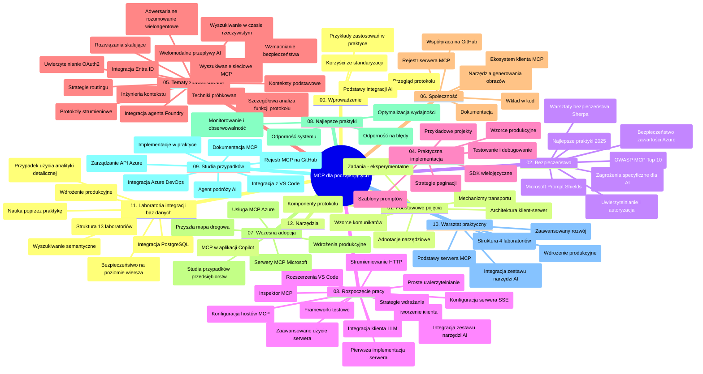

# Model Context Protocol (MCP) dla początkujących - przewodnik do nauki

Ten przewodnik do nauki zawiera przegląd struktury i zawartości repozytorium dla programu nauczania "Model Context Protocol (MCP) dla początkujących". Użyj tego przewodnika, aby efektywnie nawigować po repozytorium i maksymalnie wykorzystać dostępne zasoby.

## Przegląd repozytorium

Model Context Protocol (MCP) to ustandaryzowane ramy do interakcji między modelami AI a aplikacjami klienckimi. Początkowo stworzony przez Anthropic, MCP jest obecnie utrzymywany przez szerszą społeczność MCP za pośrednictwem oficjalnej organizacji na GitHubie. To repozytorium oferuje kompleksowy program nauczania z praktycznymi przykładami kodu w C#, Java, JavaScript, Python i TypeScript, zaprojektowany dla programistów AI, architektów systemów i inżynierów oprogramowania.

## Wizualna mapa programu nauczania

## Struktura repozytorium

Repozytorium jest podzielone na dwanaście głównych sekcji, z których każda koncentruje się na różnych aspektach MCP:

1. **Wprowadzenie (00-Introduction/)**
   - Przegląd Model Context Protocol
   - Dlaczego standaryzacja ma znaczenie w pipeline’ach AI
   - Praktyczne zastosowania i korzyści

2. **Podstawowe koncepcje (01-CoreConcepts/)**
   - Architektura klient-serwer
   - Kluczowe komponenty protokołu
   - Wzorce komunikacji w MCP
   - Perspektywy rozwoju: [Co się zmienia w MCP: Release Candidate z 2026-07-28](./01-CoreConcepts/mcp-2026-07-28-release-candidate.md) — bezstanowe jądro protokołu, framework rozszerzeń oraz oczekiwane wycofania Roots/Sampling/Logging w następnej wersji specyfikacji

3. **Bezpieczeństwo (02-Security/)**
   - Zagrożenia bezpieczeństwa w systemach opartych na MCP
   - Najlepsze praktyki zabezpieczania implementacji
   - Strategie uwierzytelniania i autoryzacji
   - **Kompleksowa dokumentacja bezpieczeństwa**:
     - MCP Security Best Practices 2025
     - Przewodnik wdrożeniowy Azure Content Safety
     - Kontrole bezpieczeństwa i techniki MCP
     - Szybkie odniesienie najlepszych praktyk MCP
   - **Kluczowe tematy bezpieczeństwa**:
     - Ataki typu prompt injection i zatrucia narzędzi
     - Przechwytywanie sesji i problemy z tzw. confused deputy
     - Luki w przepuszczaniu tokenów
     - Nadmierne uprawnienia i kontrola dostępu
     - Bezpieczeństwo łańcucha dostaw dla komponentów AI
     - Integracja Microsoft Prompt Shields

4. **Pierwsze kroki (03-GettingStarted/)**
   - Konfiguracja środowiska i ustawienia
   - Tworzenie podstawowych serwerów i klientów MCP
   - Integracja z istniejącymi aplikacjami
   - Zawiera sekcje dotyczące:
     - Pierwszej implementacji serwera
     - Tworzenia klienta
     - Integracji klienta LLM
     - Integracji z VS Code
     - Serwera Server-Sent Events (SSE)
     - Zaawansowanego użycia serwera
     - HTTP streaming
     - Integracji AI Toolkit
     - Strategii testowania
     - Wytycznych dotyczących wdrożeń

5. **Praktyczna implementacja (04-PracticalImplementation/)**
   - Korzystanie z SDK w różnych językach programowania
   - Techniki debugowania, testowania i walidacji
   - Tworzenie wielokrotnego użytku szablonów promptów i workflowów
   - Przykładowe projekty z przykładami implementacji

6. **Zaawansowane tematy (05-AdvancedTopics/)**
   - Techniki inżynierii kontekstu
   - Integracja agenta Foundry
   - Wielomodalne workflow AI
   - Demonstracje uwierzytelniania OAuth2
   - Możliwości wyszukiwania w czasie rzeczywistym
   - Streamowanie w czasie rzeczywistym
   - Implementacja korzeni kontekstów (Root contexts)
   - Strategie routingu
   - Techniki próbkowania (Sampling)
   - Podejścia do skalowania
   - Rozważania bezpieczeństwa
   - Integracja bezpieczeństwa Entra ID
   - Integracja wyszukiwania w sieci
   - Adwersarialne wnioskowanie multi-agentowe (wzorce debaty)

7. **Wkład społeczności (06-CommunityContributions/)**
   - Jak wnosić wkład w kod i dokumentację
   - Współpraca przez GitHub
   - Ulepszenia i opinie zarządzane przez społeczność
   - Użycie różnych klientów MCP (Claude Desktop, Cline, VSCode)
   - Praca z popularnymi serwerami MCP, w tym generacją obrazów

8. **Lekcje z wczesnej adopcji (07-LessonsfromEarlyAdoption/)**
   - Rzeczywiste implementacje i historie sukcesu
   - Budowanie i wdrażanie rozwiązań opartych na MCP
   - Trendy i przyszła roadmapa
   - **Przewodnik po serwerach MCP Microsoft**: kompleksowy przewodnik po 10 produkcyjnych serwerach Microsoft MCP, w tym:
     - Microsoft Learn Docs MCP Server
     - Azure MCP Server (ponad 15 wyspecjalizowanych konektorów)
     - GitHub MCP Server
     - Azure DevOps MCP Server
     - MarkItDown MCP Server
     - SQL Server MCP Server
     - Playwright MCP Server
     - Dev Box MCP Server
     - Microsoft Foundry MCP Server
     - Microsoft 365 Agents Toolkit MCP Server

9. **Najlepsze praktyki (08-BestPractices/)**
   - Optymalizacja i strojenie wydajności
   - Projektowanie odpornościowych systemów MCP
   - Strategie testowania i odporności

10. **Studia przypadków (09-CaseStudy/)**
    - **Siedem kompleksowych studiów przypadków** ukazujących wszechstronność MCP w różnych scenariuszach:
    - **Azure AI Travel Agents**: orkiestracja wielu agentów z Azure OpenAI i AI Search
    - **Integracja Azure DevOps**: automatyzacja procesów workflow z aktualizacjami danych YouTube
    - **Pozyskiwanie dokumentacji w czasie rzeczywistym**: klient konsolowy Python ze streamowaniem HTTP
    - **Interaktywny generator planu nauki**: aplikacja internetowa Chainlit z konwersacyjną AI
    - **Dokumentacja w edytorze**: integracja VS Code z workflowami GitHub Copilot
    - **Azure API Management**: integracja korporacyjnych API z tworzeniem serwera MCP
    - **GitHub MCP Registry**: rozwój ekosystemu i platforma integracji agentowej
    - Przykłady implementacji obejmujące integrację dla przedsiębiorstw, produktywność deweloperską i rozwój ekosystemu

11. **Warsztat praktyczny (10-StreamliningAIWorkflowsBuildingAnMCPServerWithAIToolkit/)**
    - Kompleksowy warsztat praktyczny łączący MCP z AI Toolkit
    - Budowa inteligentnych aplikacji łączących modele AI z narzędziami świata rzeczywistego
    - Praktyczne moduły obejmujące podstawy, rozwój niestandardowego serwera i strategie wdrożenia produkcyjnego
    - **Struktura laboratorium**:
      - Laboratorium 1: Podstawy serwera MCP
      - Laboratorium 2: Zaawansowany rozwój serwera MCP
      - Laboratorium 3: Integracja AI Toolkit
      - Laboratorium 4: Wdrożenie produkcyjne i skalowanie
    - Podejście oparte na laboratoriach z instrukcjami krok po kroku

12. **Laboratoria integracji bazy danych serwera MCP (11-MCPServerHandsOnLabs/)**
    - **Kompleksowa ścieżka nauki 13 laboratoriów** do tworzenia produkcyjnych serwerów MCP z integracją PostgreSQL
    - **Rzeczywista implementacja analityki detalicznej** z użyciem przypadku biznesowego Zava Retail
    - **Wzorce klasy korporacyjnej** w tym Row Level Security (RLS), wyszukiwanie semantyczne i dostęp do danych multi-tenant
    - **Pełna struktura laboratoriów**:
      - **Laboratoria 00-03: Podstawy** - wprowadzenie, architektura, bezpieczeństwo, konfiguracja środowiska
      - **Laboratoria 04-06: Budowa serwera MCP** - projektowanie bazy danych, implementacja serwera MCP, rozwój narzędzi
      - **Laboratoria 07-09: Zaawansowane funkcje** - wyszukiwanie semantyczne, testowanie i debugowanie, integracja z VS Code
      - **Laboratoria 10-12: Produkcja i najlepsze praktyki** - wdrożenie, monitorowanie, optymalizacja
    - **Technologie objęte**: framework FastMCP, PostgreSQL, Azure OpenAI, Azure Container Apps, Application Insights
    - **Efekty nauki**: produkcyjne serwery MCP, wzorce integracji baz danych, analityka zasilana AI, bezpieczeństwo klasy korporacyjnej

13. **Narzędzia (12-tooling/)**
    - Nauka używania MCP w aplikacji Copilot i innych narzędziach

## Dodatkowe zasoby

Repozytorium zawiera dodatkowe zasoby wspierające:

- **Folder z obrazami**: zawiera diagramy i ilustracje używane w całym programie nauczania
- **Tłumaczenia**: wsparcie wielojęzyczne z automatycznymi tłumaczeniami dokumentacji
- **Oficjalne zasoby MCP**:
  - [Dokumentacja MCP](https://modelcontextprotocol.io/)
  - [Specyfikacja MCP](https://spec.modelcontextprotocol.io/)
  - [Repozytorium MCP na GitHub](https://github.com/modelcontextprotocol)

## Jak korzystać z tego repozytorium

1. **Nauka sekwencyjna**: postępuj zgodnie z rozdziałami w kolejności (od 00 do 11), aby uzyskać uporządkowany przebieg nauki.
2. **Skupienie na konkretnym języku**: jeśli interesuje Cię konkretny język programowania, eksploruj katalogi ze wzorcami implementacji w wybranym języku.
3. **Praktyczna implementacja**: zacznij od sekcji "Pierwsze kroki", aby skonfigurować środowisko i stworzyć swój pierwszy serwer i klient MCP.
4. **Zaawansowane eksploracje**: po opanowaniu podstaw przejdź do tematów zaawansowanych, by poszerzyć wiedzę.
5. **Zaangażowanie społeczności**: dołącz do społeczności MCP przez dyskusje na GitHub i kanały Discord, by nawiązać kontakt z ekspertami i innymi deweloperami.

## Klienci i narzędzia MCP

Program nauczania obejmuje różne klientów i narzędzia MCP:

1. **Oficjalni klienci**:
   - Visual Studio Code 
   - MCP w Visual Studio Code
   - Claude Desktop
   - Claude w VSCode 
   - Claude API

2. **Klienci społecznościowi**:
   - Cline (oparty na terminalu)
   - Cursor (edytor kodu)
   - ChatMCP
   - Windsurf

3. **Narzędzia do zarządzania MCP**:
   - MCP CLI
   - MCP Manager
   - MCP Linker
   - MCP Router

## Popularne serwery MCP

Repozytorium prezentuje różne serwery MCP, w tym:

1. **Oficjalne serwery Microsoft MCP**:
   - Microsoft Learn Docs MCP Server
   - Azure MCP Server (ponad 15 wyspecjalizowanych konektorów)
   - GitHub MCP Server
   - Azure DevOps MCP Server
   - MarkItDown MCP Server
   - SQL Server MCP Server
   - Playwright MCP Server
   - Dev Box MCP Server
   - Microsoft Foundry MCP Server
   - Microsoft 365 Agents Toolkit MCP Server

2. **Oficjalne serwery referencyjne**:
   - Filesystem
   - Fetch
   - Memory
   - Sequential Thinking

3. **Generowanie obrazów**:
   - Azure OpenAI DALL-E 3
   - Stable Diffusion WebUI
   - Replicate

4. **Narzędzia developerskie**:
   - Git MCP
   - Terminal Control
   - Code Assistant

5. **Specjalistyczne serwery**:
   - Salesforce
   - Microsoft Teams
   - Jira & Confluence

## Wkład

To repozytorium zachęca społeczność do wnoszenia wkładu. Zobacz sekcję Wkład społeczności, aby uzyskać wskazówki, jak efektywnie współtworzyć ekosystem MCP.

----

*Ten przewodnik do nauki został ostatnio zaktualizowany 5 lutego 2026 roku, uwzględniając najnowszą specyfikację MCP 2025-11-25 i zawiera przegląd repozytorium na ten dzień. Zawartość repozytorium może być aktualizowana po tej dacie.*

*Dodatkowo (2 lipca 2026): do sekcji [01-CoreConcepts](./01-CoreConcepts/mcp-2026-07-28-release-candidate.md) dodano lekcję dotyczącą Release Candidate specyfikacji MCP z 2026-07-28; baza programu pozostaje oparta na specyfikacji 2025-11-25 do momentu wydania nowej wersji.*

---

<!-- CO-OP TRANSLATOR DISCLAIMER START -->
**Zastrzeżenie**:
Niniejszy dokument został przetłumaczony za pomocą usługi tłumaczenia AI [Co-op Translator](https://github.com/Azure/co-op-translator). Choć dążymy do dokładności, prosimy pamiętać, że automatyczne tłumaczenia mogą zawierać błędy lub niedokładności. Oryginalny dokument w jego języku źródłowym należy uznawać za autorytatywne źródło. W przypadku informacji krytycznych zalecane jest skorzystanie z profesjonalnego tłumaczenia wykonanego przez człowieka. Nie ponosimy odpowiedzialności za jakiekolwiek nieporozumienia lub błędne interpretacje wynikające z użycia tego tłumaczenia.
<!-- CO-OP TRANSLATOR DISCLAIMER END -->