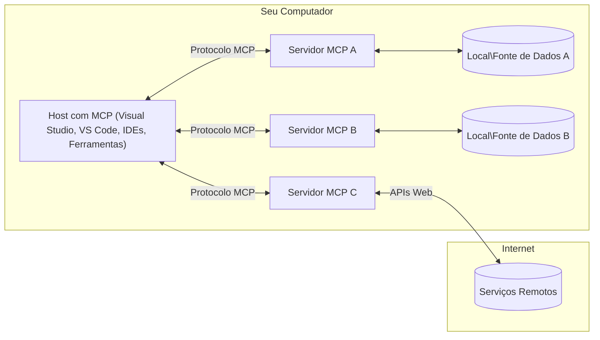

# Conceitos Principais do MCP: Dominando o Protocolo de Contexto de Modelo para Integração de IA

[](https://youtu.be/earDzWGtE84)

_(Clique na imagem acima para assistir ao vídeo desta lição)_

O [Protocolo de Contexto de Modelo (MCP)](https://github.com/modelcontextprotocol) é uma estrutura poderosa e padronizada que otimiza a comunicação entre Grandes Modelos de Linguagem (LLMs) e ferramentas, aplicações e fontes de dados externas.
Este guia irá conduzi-lo pelos conceitos principais do MCP. Você aprenderá sobre sua arquitetura cliente-servidor, componentes essenciais, mecânica de comunicação e melhores práticas de implementação.

- **Consentimento Explícito do Usuário**: Todo acesso a dados e operações requer aprovação explícita do usuário antes da execução. Os usuários devem compreender claramente quais dados serão acessados e quais ações serão realizadas, com controle granular sobre permissões e autorizações.

- **Proteção da Privacidade dos Dados**: Os dados dos usuários são expostos somente com consentimento explícito e devem ser protegidos por controles robustos de acesso durante todo o ciclo de vida da interação. Implementações devem prevenir a transmissão não autorizada de dados e manter rígidas fronteiras de privacidade.

- **Segurança na Execução de Ferramentas**: Cada invocação de ferramenta requer consentimento explícito do usuário com entendimento claro da funcionalidade, parâmetros e possível impacto da ferramenta. Limites robustos de segurança devem prevenir execuções involuntárias, inseguras ou maliciosas.

- **Segurança da Camada de Transporte**: Todos os canais de comunicação devem usar mecanismos adequados de criptografia e autenticação. Conexões remotas devem implementar protocolos de transporte seguros e gerenciamento apropriado de credenciais.

#### Diretrizes de Implementação:

- **Gerenciamento de Permissões**: Implemente sistemas de permissão granular que permitam aos usuários controlar quais servidores, ferramentas e recursos são acessíveis
- **Autenticação e Autorização**: Use métodos seguros de autenticação (OAuth, chaves API) com gerenciamento adequado de tokens e expiração  
- **Validação de Entrada**: Valide todos os parâmetros e entradas de dados conforme esquemas definidos para impedir ataques de injeção
- **Registro de Auditoria**: Mantenha logs abrangentes de todas as operações para monitoramento de segurança e conformidade

## Visão Geral

Esta lição explora a arquitetura fundamental e os componentes que compõem o ecossistema do Protocolo de Contexto de Modelo (MCP). Você aprenderá sobre a arquitetura cliente-servidor, componentes-chave e mecanismos de comunicação que impulsionam as interações do MCP.

## Objetivos Principais de Aprendizagem

Ao final desta lição, você irá:

- Entender a arquitetura cliente-servidor do MCP.
- Identificar os papéis e responsabilidades de Hosts, Clientes e Servidores.
- Analisar as características principais que tornam o MCP uma camada de integração flexível.
- Aprender como a informação flui dentro do ecossistema MCP.
- Obter insights práticos através de exemplos de código em .NET, Java, Python e JavaScript.

## Arquitetura MCP: Uma Análise Detalhada

O ecossistema MCP é construído sobre um modelo cliente-servidor. Essa estrutura modular permite que aplicações de IA interajam com ferramentas, bancos de dados, APIs e recursos contextuais de forma eficiente. Vamos detalhar essa arquitetura em seus componentes principais.

Em sua essência, o MCP segue uma arquitetura cliente-servidor onde uma aplicação host pode conectar-se a múltiplos servidores:



- **Hosts MCP**: Programas como VSCode, Claude Desktop, IDEs ou ferramentas de IA que desejam acessar dados via MCP
- **Clientes MCP**: Clientes do protocolo que mantêm conexões 1:1 com servidores
- **Servidores MCP**: Programas leves que expõem capacidades específicas através do Protocolo de Contexto de Modelo padronizado
- **Fontes Locais de Dados**: Arquivos, bancos de dados e serviços do seu computador que servidores MCP podem acessar de forma segura
- **Serviços Remotos**: Sistemas externos disponíveis pela internet que servidores MCP podem conectar por APIs.

O Protocolo MCP é um padrão em evolução que utiliza numeração de versão baseada em datas (formato AAAA-MM-DD). A versão atual do protocolo é **2025-11-25**. Você pode ver as últimas atualizações na [especificação do protocolo](https://modelcontextprotocol.io/specification/2025-11-25/)

> **Perspectiva futura:** um candidato a lançamento da próxima versão da especificação, **2026-07-28**, foi anunciado em maio de 2026 e está previsto para ser lançado em 28 de julho de 2026. Ele torna o protocolo sem estado na camada de transporte (removendo o handshake `initialize` e IDs de sessão), formaliza uma estrutura de Extensões, e descontinua Roots, Sampling e Logging em favor de padrões mais recentes. Veja [O que está mudando no MCP: O Candidato a Lançamento 2026-07-28](./mcp-2026-07-28-release-candidate.md) para uma análise completa.

### 1. Hosts

No Protocolo de Contexto de Modelo (MCP), **Hosts** são aplicações de IA que servem como a interface principal pela qual os usuários interagem com o protocolo. Hosts coordenam e gerenciam conexões para múltiplos servidores MCP criando clientes MCP dedicados para cada conexão de servidor. Exemplos de Hosts incluem:

- **Aplicações de IA**: Claude Desktop, Visual Studio Code, Claude Code
- **Ambientes de Desenvolvimento**: IDEs e editores de código com integração MCP  
- **Aplicações Personalizadas**: Agentes e ferramentas de IA construídos para propósitos específicos

**Hosts** são aplicações que coordenam interações com modelos de IA. Eles:

- **Orquestram Modelos de IA**: Executam ou interagem com LLMs para gerar respostas e coordenar fluxos de trabalho de IA
- **Gerenciam Conexões de Clientes**: Criam e mantêm um cliente MCP por conexão de servidor MCP
- **Controlam a Interface do Usuário**: Gerenciam o fluxo de conversação, interações do usuário e apresentação de respostas  
- **Aplicam Segurança**: Controlam permissões, restrições de segurança e autenticação
- **Gerenciam Consentimento do Usuário**: Administram a aprovação do usuário para compartilhamento de dados e execução de ferramentas


### 2. Clientes

**Clientes** são componentes essenciais que mantêm conexões dedicadas um-para-um entre Hosts e servidores MCP. Cada cliente MCP é instanciado pelo Host para conectar a um servidor MCP específico, garantindo canais de comunicação organizados e seguros. Múltiplos clientes permitem que Hosts conectem-se a vários servidores simultaneamente.

**Clientes** são componentes conectores dentro da aplicação host. Eles:

- **Comunicação de Protocolo**: Enviam requisições JSON-RPC 2.0 para servidores com prompts e instruções
- **Negociação de Capacidades**: Negociam recursos suportados e versões do protocolo com servidores durante a inicialização
- **Execução de Ferramentas**: Gerenciam pedidos de execução de ferramentas vindos dos modelos e processam respostas
- **Atualizações em Tempo Real**: Lidam com notificações e atualizações em tempo real dos servidores
- **Processamento de Respostas**: Processam e formatam respostas dos servidores para exibição aos usuários

### 3. Servidores

**Servidores** são programas que fornecem contexto, ferramentas e capacidades para clientes MCP. Eles podem executar localmente (na mesma máquina do Host) ou remotamente (em plataformas externas), e são responsáveis por lidar com solicitações dos clientes e fornecer respostas estruturadas. Servidores expõem funcionalidades específicas através do Protocolo de Contexto de Modelo padronizado.

**Servidores** são serviços que fornecem contexto e capacidades. Eles:

- **Registro de Recursos**: Registram e expõem primitivas disponíveis (recursos, prompts, ferramentas) para clientes
- **Processamento de Solicitações**: Recebem e executam chamadas de ferramentas, pedidos de recursos e prompts dos clientes
- **Provisão de Contexto**: Fornecem informações e dados contextuais para aprimorar respostas do modelo
- **Gerenciamento de Estado**: Mantêm estado da sessão e lidam com interações que exigem estado quando necessário

- **Notificações em Tempo Real**: Envie notificações sobre mudanças e atualizações de capacidade para clientes conectados

Servidores podem ser desenvolvidos por qualquer pessoa para estender as capacidades do modelo com funcionalidades especializadas, e eles suportam tanto cenários de implantação local quanto remota.

### 4. Primitivas do Servidor

Servidores no Protocolo de Contexto de Modelo (MCP) fornecem três **primitivas** principais que definem os blocos de construção fundamentais para interações ricas entre clientes, hosts e modelos de linguagem. Essas primitivas especificam os tipos de informações contextuais e ações disponíveis através do protocolo.

Servidores MCP podem expor qualquer combinação das seguintes três primitivas principais:

#### Recursos 

**Recursos** são fontes de dados que fornecem informações contextuais para aplicações de IA. Eles representam conteúdo estático ou dinâmico que pode aprimorar o entendimento e a tomada de decisão do modelo:

- **Dados Contextuais**: Informações estruturadas e contexto para consumo do modelo de IA
- **Bases de Conhecimento**: Repositórios de documentos, artigos, manuais e artigos de pesquisa
- **Fontes de Dados Locais**: Arquivos, bancos de dados e informações do sistema local  
- **Dados Externos**: Respostas de API, serviços web e dados de sistemas remotos
- **Conteúdo Dinâmico**: Dados em tempo real que atualizam com base em condições externas

Recursos são identificados por URIs e suportam descoberta através dos métodos `resources/list` e recuperação via `resources/read`:

```text
file://documents/project-spec.md
database://production/users/schema
api://weather/current
```

#### Prompts

**Prompts** são templates reutilizáveis que ajudam a estruturar interações com modelos de linguagem. Eles fornecem padrões de interação padronizados e fluxos de trabalho templated:

- **Interações Baseadas em Template**: Mensagens pré-estruturadas e iniciadores de conversa
- **Templates de Fluxo de Trabalho**: Sequências padronizadas para tarefas e interações comuns
- **Exemplos Few-shot**: Templates baseados em exemplos para instrução do modelo
- **Prompts do Sistema**: Prompts fundamentais que definem o comportamento e o contexto do modelo
- **Templates Dinâmicos**: Prompts parametrizados que se adaptam a contextos específicos

Prompts suportam substituição de variáveis e podem ser descobertos via `prompts/list` e recuperados com `prompts/get`:

```markdown
Generate a {{task_type}} for {{product}} targeting {{audience}} with the following requirements: {{requirements}}
```

#### Ferramentas

**Ferramentas** são funções executáveis que os modelos de IA podem invocar para realizar ações específicas. Elas representam os "verbos" do ecossistema MCP, permitindo que modelos interajam com sistemas externos:

- **Funções Executáveis**: Operações discretas que modelos podem invocar com parâmetros específicos
- **Integração com Sistemas Externos**: Chamadas de API, consultas a banco de dados, operações de arquivos, cálculos
- **Identidade Única**: Cada ferramenta possui nome, descrição e esquema de parâmetros distintos
- **Entrada e Saída Estruturadas**: Ferramentas aceitam parâmetros validados e retornam respostas estruturadas e tipadas
- **Capacidades de Ação**: Permitem que modelos realizem ações no mundo real e obtenham dados ao vivo

Ferramentas são definidas com JSON Schema para validação de parâmetros, descobertas via `tools/list` e executadas por `tools/call`. Ferramentas também podem incluir **ícones** como metadados adicionais para melhor apresentação na UI.

**Anotações de Ferramentas**: Ferramentas suportam anotações comportamentais (ex.: `readOnlyHint`, `destructiveHint`) que descrevem se a ferramenta é somente leitura ou destrutiva, ajudando clientes a tomar decisões informadas sobre a execução da ferramenta.

Exemplo de definição de ferramenta:

```typescript
server.tool(
  "search_products", 
  {
    query: z.string().describe("Search query for products"),
    category: z.string().optional().describe("Product category filter"),
    max_results: z.number().default(10).describe("Maximum results to return")
  }, 
  async (params) => {
    // Execute a busca e retorne resultados estruturados
    return await productService.search(params);
  }
);
```

## Primitivas do Cliente

No Protocolo de Contexto de Modelo (MCP), **clientes** podem expor primitivas que permitem aos servidores solicitar capacidades adicionais da aplicação host. Essas primitivas do lado do cliente permitem implementações de servidor mais ricas e interativas que podem acessar capacidades do modelo de IA e interações do usuário.

### Amostragem

> **Aviso de descontinuação:** o candidato a lançamento `2026-07-28` marca Amostragem como descontinuada em favor da integração direta com as APIs do provedor LLM. Ela continua funcionando em `2025-11-25` e por pelo menos um ano após qualquer descontinuação, mas novos designs devem preferir o padrão substituto. Veja [O que está mudando no MCP: O candidato a lançamento 2026-07-28](./mcp-2026-07-28-release-candidate.md).

**Amostragem** permite que servidores solicitem conclusões de modelo de linguagem da aplicação de IA do cliente. Essa primitiva permite que servidores acessem capacidades LLM sem embutir suas próprias dependências de modelo:

- **Acesso Independente do Modelo**: Servidores podem solicitar conclusões sem incluir SDKs LLM ou gerenciar acesso ao modelo
- **IA Iniciada pelo Servidor**: Permite que servidores gerem conteúdo autonomamente usando o modelo de IA do cliente
- **Interações Recursivas LLM**: Suporta cenários complexos onde servidores precisam de assistência de IA para processamento
- **Geração Dinâmica de Conteúdo**: Permite que servidores criem respostas contextuais usando o modelo do host
- **Suporte a Chamada de Ferramentas**: Servidores podem incluir parâmetros `tools` e `toolChoice` para permitir que o modelo do cliente invoque ferramentas durante a amostragem

A amostragem é iniciada pelo método `sampling/complete`, onde servidores enviam requisições de conclusão para clientes.

### Raízes

> **Aviso de descontinuação:** o candidato a lançamento `2026-07-28` marca Raízes como descontinuadas em favor de parâmetros de ferramenta, URIs de recursos, ou configuração do servidor. Elas continuam funcionando em `2025-11-25` e por pelo menos um ano após qualquer descontinuação. Veja [O que está mudando no MCP: O candidato a lançamento 2026-07-28](./mcp-2026-07-28-release-candidate.md).

**Raízes** fornecem uma maneira padronizada para clientes exporem limites do sistema de arquivos para servidores, ajudando os servidores a entender quais diretórios e arquivos eles têm acesso:

- **Limites do Sistema de Arquivos**: Definem os limites de onde servidores podem operar dentro do sistema de arquivos
- **Controle de Acesso**: Ajudam servidores a entender quais diretórios e arquivos eles têm permissão para acessar
- **Atualizações Dinâmicas**: Clientes podem notificar servidores quando a lista de raízes mudar
- **Identificação Baseada em URI**: Raízes usam URIs `file://` para identificar diretórios e arquivos acessíveis

Raízes são descobertas pelo método `roots/list`, com clientes enviando `notifications/roots/list_changed` quando as raízes mudam.

### Elicitação  

**Elicitação** permite que servidores solicitem informações adicionais ou confirmação dos usuários através da interface do cliente:

- **Solicitações de Entrada do Usuário**: Servidores podem pedir informações adicionais quando necessárias para execução de ferramenta
- **Diálogos de Confirmação**: Solicitar aprovação do usuário para operações sensíveis ou impactantes
- **Fluxos de Trabalho Interativos**: Permite que servidores criem interações passo a passo com o usuário
- **Coleta Dinâmica de Parâmetros**: Reunir parâmetros faltantes ou opcionais durante a execução da ferramenta

Solicitações de elicitação são feitas usando o método `elicitation/request` para coletar entrada do usuário através da interface do cliente.

**Modo de URL para Elicitação**: Servidores também podem solicitar interações de usuário baseadas em URL, permitindo que direcionem usuários a páginas web externas para autenticação, confirmação ou entrada de dados.

### Registro


> **Aviso de descontinuação:** o candidato a lançamento `2026-07-28` marca o Logging como obsoleto em favor de `stderr` para transportes stdio e OpenTelemetry para observabilidade estruturada. Ele continua funcionando em `2025-11-25` e por pelo menos um ano após qualquer descontinuação. Veja [O que está mudando no MCP: O candidato a lançamento 2026-07-28](./mcp-2026-07-28-release-candidate.md).

**Logging** permite que servidores enviem mensagens de log estruturadas para clientes para depuração, monitoramento e visibilidade operacional:

- **Suporte à Depuração**: Permitir que servidores forneçam logs detalhados de execução para solução de problemas
- **Monitoramento Operacional**: Enviar atualizações de status e métricas de desempenho para os clientes
- **Relato de Erros**: Fornecer contexto detalhado de erros e informações de diagnóstico
- **Trilhas de Auditoria**: Criar logs abrangentes das operações e decisões do servidor

Mensagens de logging são enviadas aos clientes para fornecer transparência nas operações do servidor e facilitar a depuração.

## Fluxo de Informação no MCP

O Modelo Context Protocol (MCP) define um fluxo estruturado de informações entre hosts, clientes, servidores e modelos. Entender esse fluxo ajuda a esclarecer como as solicitações dos usuários são processadas e como ferramentas externas e dados são integrados nas respostas do modelo.

- **Host Inicia a Conexão**  
  A aplicação host (como uma IDE ou interface de chat) estabelece uma conexão com um servidor MCP, tipicamente via STDIO, WebSocket ou outro transporte suportado.

- **Negociação de Capacidades**  
  O cliente (embutido no host) e o servidor trocam informações sobre seus recursos, ferramentas, versões do protocolo suportadas. Isso garante que ambos os lados entendam as capacidades disponíveis para a sessão.

- **Solicitação do Usuário**  
  O usuário interage com o host (ex: insere um prompt ou comando). O host coleta essa entrada e a passa para o cliente para processamento.

- **Uso de Recurso ou Ferramenta**  
  - O cliente pode solicitar contexto ou recursos adicionais do servidor (como arquivos, entradas de banco de dados ou artigos de base de conhecimento) para enriquecer o entendimento do modelo.
  - Se o modelo determinar que uma ferramenta é necessária (ex: buscar dados, realizar cálculo ou chamar uma API), o cliente envia uma solicitação de invocação da ferramenta ao servidor, especificando o nome e parâmetros.

- **Execução pelo Servidor**  
  O servidor recebe a solicitação de recurso ou ferramenta, executa as operações necessárias (como rodar uma função, consultar banco de dados ou recuperar arquivo) e retorna os resultados ao cliente em formato estruturado.

- **Geração da Resposta**  
  O cliente integra as respostas do servidor (dados de recursos, saídas de ferramentas, etc.) na interação contínua com o modelo. O modelo usa essas informações para gerar uma resposta abrangente e contextualmente relevante.

- **Apresentação do Resultado**  
  O host recebe a saída final do cliente e a apresenta ao usuário, frequentemente incluindo o texto gerado pelo modelo e quaisquer resultados de execuções de ferramentas ou consultas de recursos.

Esse fluxo permite que o MCP suporte aplicações avançadas, interativas e com consciência contextual conectando perfeitamente modelos a ferramentas externas e fontes de dados.

## Arquitetura & Camadas do Protocolo

O MCP consiste em duas camadas arquitetônicas distintas que trabalham juntas para fornecer um framework de comunicação completo:

### Camada de Dados

A **Camada de Dados** implementa o protocolo central MCP usando **JSON-RPC 2.0** como base. Essa camada define a estrutura das mensagens, semântica e padrões de interação:

#### Componentes Principais:

- **Protocolo JSON-RPC 2.0**: Toda comunicação usa formato padronizado JSON-RPC 2.0 para chamadas de método, respostas e notificações
- **Gerenciamento do Ciclo de Vida**: Trata inicialização da conexão, negociação de capacidades e encerramento de sessão entre clientes e servidores
- **Primitivas do Servidor**: Permite que servidores forneçam funcionalidades centrais via ferramentas, recursos e prompts
- **Primitivas do Cliente**: Permite que servidores solicitem amostragem de LLMs, obtenham entrada do usuário e enviem mensagens de log
- **Notificações em Tempo Real**: Suporta notificações assíncronas para atualizações dinâmicas sem polling

#### Principais Recursos:

- **Negociação da Versão do Protocolo**: Usa versionamento baseado em data (AAAA-MM-DD) para garantir compatibilidade
- **Descoberta de Capacidades**: Clientes e servidores trocam informações sobre recursos suportados na inicialização
- **Sessões com Estado**: Mantém estado da conexão ao longo de múltiplas interações para continuidade de contexto

### Camada de Transporte

A **Camada de Transporte** gerencia canais de comunicação, enquadramento de mensagens e autenticação entre participantes MCP:

#### Mecanismos de Transporte Suportados:

1. **Transporte STDIO**:
   - Usa fluxos padrão de entrada/saída para comunicação direta de processos
   - Ótimo para processos locais na mesma máquina sem overhead de rede
   - Usado comumente para implementações locais de servidores MCP

2. **Transporte HTTP Streamable**:
   - Usa HTTP POST para mensagens cliente-servidor  
   - Opcional Server-Sent Events (SSE) para streaming do servidor para cliente
   - Possibilita comunicação remota do servidor através de redes
   - Suporta autenticação HTTP padrão (tokens bearer, chaves de API, cabeçalhos customizados)
   - MCP recomenda OAuth para autenticação segura baseada em token

#### Abstração do Transporte:

A camada de transporte abstrai os detalhes da comunicação da camada de dados, permitindo o mesmo formato de mensagem JSON-RPC 2.0 em todos os mecanismos de transporte. Essa abstração permite que aplicações alternem entre servidores locais e remotos sem dificuldades.

### Considerações de Segurança

Implementações MCP devem aderir a vários princípios críticos de segurança para garantir interações seguras, confiáveis e protegidas em todas as operações do protocolo:

- **Consentimento e Controle do Usuário**: Usuários devem fornecer consentimento explícito antes que quaisquer dados sejam acessados ou operações executadas. Devem ter controle claro sobre quais dados são compartilhados e quais ações são autorizadas, apoiados por interfaces intuitivas para revisão e aprovação.

- **Privacidade de Dados**: Dados do usuário devem ser expostos somente com consentimento explícito e protegidos por controles de acesso apropriados. Implementações MCP devem proteger contra transmissões não autorizadas e garantir que a privacidade seja mantida em todas as interações.

- **Segurança das Ferramentas**: Antes de invocar qualquer ferramenta, é necessário consentimento explícito do usuário. Usuários devem entender claramente cada funcionalidade da ferramenta, e limites robustos de segurança devem ser aplicados para impedir execuções indesejadas ou inseguras.

Ao seguir esses princípios de segurança, MCP assegura que a confiança, privacidade e segurança do usuário sejam mantidas durante todas as interações do protocolo, ao mesmo tempo em que possibilita integrações avançadas de IA.

## Exemplos de Código: Componentes Chave

Abaixo estão exemplos de código em várias linguagens populares que ilustram como implementar componentes principais do servidor MCP e ferramentas.

### Exemplo .NET: Criando um Servidor MCP Simples com Ferramentas

Aqui está um exemplo prático em .NET demonstrando como implementar um servidor MCP simples com ferramentas customizadas. Este exemplo mostra como definir e registrar ferramentas, tratar solicitações e conectar o servidor utilizando o Modelo Context Protocol.

```csharp
using System;
using System.Threading.Tasks;
using ModelContextProtocol.Server;
using ModelContextProtocol.Server.Transport;
using ModelContextProtocol.Server.Tools;

public class WeatherServer
{
    public static async Task Main(string[] args)
    {
        // Create an MCP server
        var server = new McpServer(
            name: "Weather MCP Server",
            version: "1.0.0"
        );
        
        // Register our custom weather tool
        server.AddTool<string, WeatherData>("weatherTool", 
            description: "Gets current weather for a location",
            execute: async (location) => {
                // Call weather API (simplified)
                var weatherData = await GetWeatherDataAsync(location);
                return weatherData;
            });
        
        // Connect the server using stdio transport
        var transport = new StdioServerTransport();
        await server.ConnectAsync(transport);
        
        Console.WriteLine("Weather MCP Server started");
        
        // Keep the server running until process is terminated
        await Task.Delay(-1);
    }
    
    private static async Task<WeatherData> GetWeatherDataAsync(string location)
    {
        // This would normally call a weather API
        // Simplified for demonstration
        await Task.Delay(100); // Simulate API call
        return new WeatherData { 
            Temperature = 72.5,
            Conditions = "Sunny",
            Location = location
        };
    }
}

public class WeatherData
{
    public double Temperature { get; set; }
    public string Conditions { get; set; }
    public string Location { get; set; }
}
```

### Exemplo Java: Componentes do Servidor MCP

Este exemplo demonstra o mesmo servidor MCP e registro de ferramentas do exemplo .NET acima, porém implementado em Java.

```java
import io.modelcontextprotocol.server.McpServer;
import io.modelcontextprotocol.server.McpToolDefinition;
import io.modelcontextprotocol.server.transport.StdioServerTransport;
import io.modelcontextprotocol.server.tool.ToolExecutionContext;
import io.modelcontextprotocol.server.tool.ToolResponse;

public class WeatherMcpServer {
    public static void main(String[] args) throws Exception {
        // Criar um servidor MCP
        McpServer server = McpServer.builder()
            .name("Weather MCP Server")
            .version("1.0.0")
            .build();
            
        // Registrar uma ferramenta de clima
        server.registerTool(McpToolDefinition.builder("weatherTool")
            .description("Gets current weather for a location")
            .parameter("location", String.class)
            .execute((ToolExecutionContext ctx) -> {
                String location = ctx.getParameter("location", String.class);
                
                // Obter dados meteorológicos (simplificado)
                WeatherData data = getWeatherData(location);
                
                // Retornar resposta formatada
                return ToolResponse.content(
                    String.format("Temperature: %.1f°F, Conditions: %s, Location: %s", 
                    data.getTemperature(), 
                    data.getConditions(), 
                    data.getLocation())
                );
            })
            .build());
        
        // Conectar o servidor usando transporte stdio
        try (StdioServerTransport transport = new StdioServerTransport()) {
            server.connect(transport);
            System.out.println("Weather MCP Server started");
            // Manter o servidor rodando até que o processo seja encerrado
            Thread.currentThread().join();
        }
    }
    
    private static WeatherData getWeatherData(String location) {
        // A implementação chamaria uma API de clima
        // Simplificado para fins de exemplo
        return new WeatherData(72.5, "Sunny", location);
    }
}

class WeatherData {
    private double temperature;
    private String conditions;
    private String location;
    
    public WeatherData(double temperature, String conditions, String location) {
        this.temperature = temperature;
        this.conditions = conditions;
        this.location = location;
    }
    
    public double getTemperature() {
        return temperature;
    }
    
    public String getConditions() {
        return conditions;
    }
    
    public String getLocation() {
        return location;
    }
}
```

### Exemplo Python: Construindo um Servidor MCP

Este exemplo usa fastmcp, por favor assegure-se de instalá-lo primeiro:

```python
pip install fastmcp
```
Exemplo de Código:

```python
#!/usr/bin/env python3
import asyncio
from fastmcp import FastMCP
from fastmcp.transports.stdio import serve_stdio

# Crie um servidor FastMCP
mcp = FastMCP(
    name="Weather MCP Server",
    version="1.0.0"
)

@mcp.tool()
def get_weather(location: str) -> dict:
    """Gets current weather for a location."""
    return {
        "temperature": 72.5,
        "conditions": "Sunny",
        "location": location
    }

# Abordagem alternativa usando uma classe
class WeatherTools:
    @mcp.tool()
    def forecast(self, location: str, days: int = 1) -> dict:
        """Gets weather forecast for a location for the specified number of days."""
        return {
            "location": location,
            "forecast": [
                {"day": i+1, "temperature": 70 + i, "conditions": "Partly Cloudy"}
                for i in range(days)
            ]
        }

# Registrar ferramentas da classe
weather_tools = WeatherTools()

# Inicie o servidor
if __name__ == "__main__":
    asyncio.run(serve_stdio(mcp))
```

### Exemplo JavaScript: Criando um Servidor MCP

Este exemplo mostra a criação do servidor MCP em JavaScript e como registrar duas ferramentas relacionadas ao clima.

```javascript
// Usando o SDK oficial do Protocolo de Contexto do Modelo
import { McpServer } from "@modelcontextprotocol/sdk/server/mcp.js";
import { StdioServerTransport } from "@modelcontextprotocol/sdk/server/stdio.js";
import { z } from "zod"; // Para validação de parâmetros

// Criar um servidor MCP
const server = new McpServer({
  name: "Weather MCP Server",
  version: "1.0.0"
});

// Definir uma ferramenta de clima
server.tool(
  "weatherTool",
  {
    location: z.string().describe("The location to get weather for")
  },
  async ({ location }) => {
    // Normalmente isso chamaria uma API de clima
    // Simplificado para demonstração
    const weatherData = await getWeatherData(location);
    
    return {
      content: [
        { 
          type: "text", 
          text: `Temperature: ${weatherData.temperature}°F, Conditions: ${weatherData.conditions}, Location: ${weatherData.location}` 
        }
      ]
    };
  }
);

// Definir uma ferramenta de previsão
server.tool(
  "forecastTool",
  {
    location: z.string(),
    days: z.number().default(3).describe("Number of days for forecast")
  },
  async ({ location, days }) => {
    // Normalmente isso chamaria uma API de clima
    // Simplificado para demonstração
    const forecast = await getForecastData(location, days);
    
    return {
      content: [
        { 
          type: "text", 
          text: `${days}-day forecast for ${location}: ${JSON.stringify(forecast)}` 
        }
      ]
    };
  }
);

// Funções auxiliares
async function getWeatherData(location) {
  // Simular chamada de API
  return {
    temperature: 72.5,
    conditions: "Sunny",
    location: location
  };
}

async function getForecastData(location, days) {
  // Simular chamada de API
  return Array.from({ length: days }, (_, i) => ({
    day: i + 1,
    temperature: 70 + Math.floor(Math.random() * 10),
    conditions: i % 2 === 0 ? "Sunny" : "Partly Cloudy"
  }));
}

// Conectar o servidor usando transporte stdio
const transport = new StdioServerTransport();
server.connect(transport).catch(console.error);

console.log("Weather MCP Server started");
```

Este exemplo em JavaScript demonstra como criar um servidor MCP usando o SDK do Modelo Context Protocol. Ele mostra como registrar duas ferramentas chamadas `weatherTool` e `forecastTool` e torná-las disponíveis aos clientes MCP através do `StdioServerTransport`.

## Segurança e Autorização

O MCP inclui vários conceitos e mecanismos incorporados para gerenciamento de segurança e autorização ao longo do protocolo:

1. **Controle de Permissão de Ferramentas**:  
  Clientes podem especificar quais ferramentas um modelo pode usar durante uma sessão. Isso garante que somente ferramentas explicitamente autorizadas sejam acessíveis, reduzindo risco de operações indesejadas ou inseguras. Permissões podem ser configuradas dinamicamente com base em preferências do usuário, políticas organizacionais ou contexto da interação.

2. **Autenticação**:  
  Servidores podem exigir autenticação antes de conceder acesso a ferramentas, recursos ou operações sensíveis. Isso pode envolver chaves API, tokens OAuth ou outros esquemas de autenticação. Autenticação adequada assegura que apenas clientes e usuários confiáveis possam invocar capacidades do lado servidor.

3. **Validação**:  
  Validação de parâmetros é aplicada em todas as invocações de ferramenta. Cada ferramenta define tipos esperados, formatos e restrições para seus parâmetros, e o servidor valida requisições recebidas de acordo. Isso previne entrada malformada ou maliciosa de alcançar implementações de ferramentas e ajuda a manter a integridade das operações.

4. **Limitação de Taxa**:  
  Para prevenir abusos e garantir uso justo dos recursos do servidor, servidores MCP podem implementar limitação de taxa para chamadas de ferramentas e acesso a recursos. Limites podem ser aplicados por usuário, por sessão ou globalmente, ajudando a proteger contra ataques de negação de serviço ou consumo excessivo de recursos.

Combinando esses mecanismos, MCP oferece uma base segura para integrar modelos de linguagem com ferramentas externas e fontes de dados, dando a usuários e desenvolvedores controle granular sobre acesso e uso.

## Mensagens do Protocolo & Fluxo de Comunicação

A comunicação MCP usa mensagens estruturadas **JSON-RPC 2.0** para facilitar interações claras e confiáveis entre hosts, clientes e servidores. O protocolo define padrões específicos de mensagens para diferentes tipos de operações:

### Tipos Principais de Mensagens:

#### **Mensagens de Inicialização**
- **Request `initialize`**: Estabelece conexão e negocia versão do protocolo e capacidades
- **Response `initialize`**: Confirma recursos suportados e informações do servidor  
- **`notifications/initialized`**: Sinaliza que a inicialização foi concluída e a sessão está pronta

#### **Mensagens de Descoberta**
- **Request `tools/list`**: Descobre ferramentas disponíveis no servidor
- **Request `resources/list`**: Lista recursos disponíveis (fontes de dados)
- **Request `prompts/list`**: Recupera templates de prompt disponíveis

#### **Mensagens de Execução**  
- **Request `tools/call`**: Executa uma ferramenta específica com parâmetros fornecidos
- **Request `resources/read`**: Recupera conteúdo de um recurso específico
- **Request `prompts/get`**: Busca um template de prompt com parâmetros opcionais

#### **Mensagens do Lado Cliente**
- **Request `sampling/complete`**: Servidor solicita conclusão LLM ao cliente
- **`elicitation/request`**: Servidor solicita entrada do usuário via cliente
- **Mensagens de Logging**: Servidor envia mensagens de log estruturadas ao cliente

#### **Mensagens de Notificação**
- **`notifications/tools/list_changed`**: Servidor notifica cliente sobre alterações em ferramentas
- **`notifications/resources/list_changed`**: Servidor notifica cliente sobre alterações em recursos  
- **`notifications/prompts/list_changed`**: Servidor notifica cliente sobre alterações em prompts

### Estrutura da Mensagem:

Todas as mensagens MCP seguem formato JSON-RPC 2.0 com:
- **Mensagens de Requisição**: Incluem `id`, `method` e `params` opcionais
- **Mensagens de Resposta**: Incluem `id` e `result` ou `error`  
- **Mensagens de Notificação**: Incluem `method` e `params` opcionais (sem `id` ou resposta esperada)

Essa comunicação estruturada assegura interações confiáveis, rastreáveis e extensíveis, suportando cenários avançados como atualizações em tempo real, encadeamento de ferramentas e tratamento robusto de erros.

### Tarefas (Experimental)

> **Olhando para frente:** o candidato a lançamento `2026-07-28` remove as Tarefas da especificação experimental central para uma extensão dedicada de Tarefas com ciclo de vida redesenhado (`tasks/get`, `tasks/update`, `tasks/cancel`; `tasks/list` é removido). Se você desenvolver contra a API experimental descrita abaixo, planeje migrar. Veja [O que está mudando no MCP: O candidato a lançamento 2026-07-28](./mcp-2026-07-28-release-candidate.md).

**Tarefas** são uma funcionalidade experimental que fornece wrappers de execução duráveis permitindo recuperação diferida de resultados e rastreamento de status para requisições MCP:

- **Operações de Longa Duração**: Acompanhar computações caras, automação de fluxos e processamento em lote
- **Resultados Diferidos**: Consultar status de tarefas e recuperar resultados quando operações completam
- **Rastreamento de Status**: Monitorar progresso da tarefa através de estados definidos no ciclo de vida
- **Operações Multi-Etapas**: Dar suporte a fluxos complexos que abrangem múltiplas interações

Tarefas encapsulam requisições padrão MCP para habilitar padrões de execução assíncrona para operações que não podem completar imediatamente.

## Principais Conclusões

- **Arquitetura**: MCP usa arquitetura cliente-servidor onde hosts gerenciam múltiplas conexões de clientes a servidores
- **Participantes**: Ecossistema inclui hosts (aplicativos IA), clientes (conectores de protocolo) e servidores (provedores de capacidades)
- **Mecanismos de Transporte**: Comunicação suporta STDIO (local) e HTTP Streamable com SSE opcional (remoto)
- **Primitivas Centrais**: Servidores expõem ferramentas (funções executáveis), recursos (fontes de dados) e prompts (templates)
- **Primitivas do Cliente**: Servidores podem solicitar amostragem (compleções LLM com suporte a chamada de ferramentas), elicitação (entrada do usuário incluindo modo URL), roots (limites de sistema de arquivos) e logging dos clientes
- **Funcionalidades Experimentais**: Tarefas fornecem wrappers de execução duráveis para operações de longa duração
- **Fundação do Protocolo**: Construído sobre JSON-RPC 2.0 com versionamento baseado em data (atual: 2025-11-25)
- **Capacidades em Tempo Real**: Suporta notificações para atualizações dinâmicas e sincronização em tempo real
- **Segurança Primeiro**: Consentimento explícito do usuário, proteção de privacidade de dados e transporte seguro são requisitos fundamentais

## Exercício

Projete uma ferramenta MCP simples que seria útil no seu domínio. Defina:
1. Qual seria o nome da ferramenta
2. Quais parâmetros ela aceitaria
3. Qual saída ela retornaria
4. Como um modelo poderia usar essa ferramenta para resolver problemas do usuário


---

## O que vem a seguir

Próximo: [Capítulo 2: Segurança](../02-Security/README.md)


Curioso para saber o que vem após `2025-11-25`? Leia [O que está mudando no MCP: O Candidato a Versão de 2026-07-28](./mcp-2026-07-28-release-candidate.md).

---

<!-- CO-OP TRANSLATOR DISCLAIMER START -->
**Aviso Legal**:
Este documento foi traduzido usando o serviço de tradução por IA [Co-op Translator](https://github.com/Azure/co-op-translator). Embora nos esforcemos pela precisão, por favor, esteja ciente de que traduções automatizadas podem conter erros ou imprecisões. O documento original em seu idioma nativo deve ser considerado a fonte autorizada. Para informações críticas, recomenda-se tradução profissional humana. Não nos responsabilizamos por quaisquer mal-entendidos ou interpretações incorretas decorrentes do uso desta tradução.
<!-- CO-OP TRANSLATOR DISCLAIMER END -->