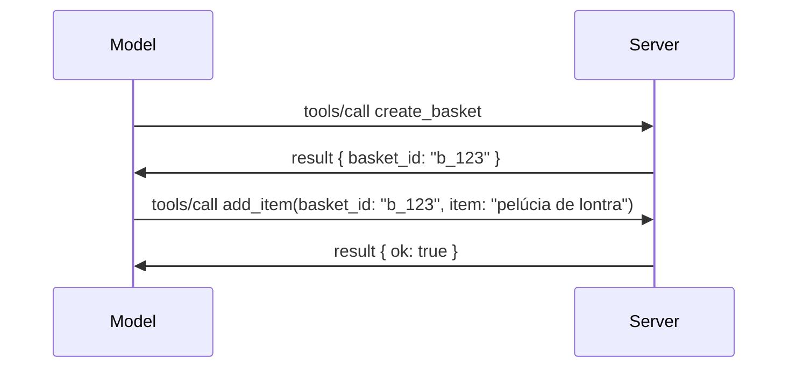

# O Que Está Mudando no MCP: Candidato a Lançamento 2026-07-28

> **Status:** Candidato a Lançamento. A especificação `2026-07-28` não é final no momento da escrita. Foi anunciada em 21 de maio de 2026 e está programada para ser lançada em 28 de julho de 2026. Tudo nesta lição descreve o candidato a lançamento; verifique a [especificação provisória](https://modelcontextprotocol.io/specification/draft) e seu [registro de alterações](https://modelcontextprotocol.io/specification/draft/changelog) para o status mais recente antes de construir com base nela. O restante deste currículo é escrito com base na versão estável atual, **Especificação MCP 2025-11-25**, e será atualizado uma vez que `2026-07-28` seja lançado.

## Visão Geral

`2026-07-28` é a maior revisão do MCP desde seu lançamento. Seis Propostas de Melhoria de Especificação (SEPs) removem sessões ao nível do protocolo e tornam o MCP sem estado na camada de transporte, extensões tornam-se um mecanismo versionado e de primeira classe, e vários recursos que você aprendeu anteriormente neste currículo (Raízes, Amostragem, Registro) são marcados como obsoletos sob uma nova política de ciclo de vida. Esta lição resume o que está mudando, por que isso importa e o que significa para o código que você já escreveu contra `2025-11-25`.

Fonte: [O Candidato a Lançamento da Especificação MCP 2026-07-28](https://blog.modelcontextprotocol.io/posts/2026-07-28-release-candidate/) (Blog do Model Context Protocol, David Soria Parra e Den Delimarsky).

## Objetivos de Aprendizagem

Ao final desta lição, você poderá:

- Explicar por que o MCP está se movendo para um núcleo de protocolo sem estado e qual problema isso resolve para implantações horizontalmente escaladas.
- Descrever como o handshake `initialize`/`initialized` e o cabeçalho `Mcp-Session-Id` são substituídos.
- Identificar os novos cabeçalhos `Mcp-Method` e `Mcp-Name` e os metadados de cache `ttlMs`/`cacheScope`.
- Reconhecer a estrutura de Extensões e as duas extensões que acompanham este lançamento: MCP Apps e Tasks.
- Listar as seis SEPs de autorização que fortalecem o alinhamento OAuth 2.0 / OIDC.
- Identificar quais recursos centrais (Raízes, Amostragem, Registro) agora estão obsoletos, e o que isso significa na prática.
- Explicar a mudança para JSON Schema 2020-12 completa para `inputSchema`/`outputSchema` de ferramentas.

## Um Protocolo Sem Estado

A principal mudança: o MCP torna-se sem estado na camada de protocolo.

### Antes (2025-11-25): sessões vinculam você a uma instância de servidor

Chamar uma ferramenta via Streamable HTTP começa com um handshake `initialize`. O servidor responde com um cabeçalho `Mcp-Session-Id` que cada requisição subsequente deve carregar:

```http
POST /mcp HTTP/1.1
Mcp-Session-Id: 1868a90c-3a3f-4f5b
Content-Type: application/json

{"jsonrpc":"2.0","id":2,"method":"tools/call",
 "params":{"name":"search","arguments":{"q":"otters"}}}
```

Porque a sessão está vinculada à instância de servidor que a emitiu, implantações horizontalmente escaladas precisam de **roteamento fixo** no balanceador de carga e um **armazenamento de sessão compartilhado** entre instâncias.

### Depois (2026-07-28): cada requisição é autossuficiente

```http
POST /mcp HTTP/1.1
MCP-Protocol-Version: 2026-07-28
Mcp-Method: tools/call
Mcp-Name: search
Content-Type: application/json

{"jsonrpc":"2.0","id":1,"method":"tools/call",
 "params":{"name":"search","arguments":{"q":"otters"},
           "_meta":{"io.modelcontextprotocol/clientInfo":{"name":"my-app","version":"1.0"}}}}
```

Qualquer instância de servidor pode atender a esta requisição. Mudanças principais:

- **O handshake `initialize`/`initialized` é removido** ([SEP-2575](https://github.com/modelcontextprotocol/modelcontextprotocol/pull/2575)). A versão do protocolo, informações do cliente e capacidades do cliente movem-se para `_meta` em cada requisição. Um novo método `server/discover` permite que um cliente obtenha as capacidades do servidor antecipadamente quando precisar.
- **O cabeçalho `Mcp-Session-Id` e a sessão ao nível do protocolo são removidos** ([SEP-2567](https://github.com/modelcontextprotocol/modelcontextprotocol/pull/2567)). Roteamento fixo e armazenamento de sessão compartilhado não são mais necessários na camada do protocolo.

### Protocolo sem estado, aplicativos com estado

Remover a sessão ao nível do protocolo não significa que seu servidor não possa ter estado. O padrão recomendado é o mesmo que APIs HTTP sempre usaram: criar um identificador explícito (um `basket_id`, um `browser_id`) de uma chamada de ferramenta, e fazer o modelo passar esse identificador de volta como um argumento comum em chamadas posteriores.



Isso torna o estado visível e razoável para o modelo ao invés de escondê-lo nas metadados de transporte, e permite que qualquer instância de servidor atenda qualquer chamada.

### Requisições do servidor para o cliente, reestruturadas

Um protocolo sem estado ainda precisa de uma forma do servidor pedir algo ao cliente no meio da chamada (por exemplo, um prompt de elicitação):

- **Requisições iniciadas pelo servidor só podem ser emitidas enquanto o servidor está processando ativamente uma requisição do cliente** ([SEP-2260](https://github.com/modelcontextprotocol/modelcontextprotocol/pull/2260)) — anteriormente uma recomendação, agora é obrigatório. Um usuário nunca é solicitado do nada.
- **Requisições de múltiplas viagens** ([SEP-2322](https://github.com/modelcontextprotocol/modelcontextprotocol/pull/2322)) substituem manter um stream SSE aberto. Em vez disso, o servidor retorna um `InputRequiredResult`:

  ```json
  {
    "resultType": "inputRequired",
    "inputRequests": {
      "confirm": {
        "type": "elicitation",
        "message": "Delete 3 files?",
        "schema": { "type": "boolean" }
      }
    },
    "requestState": "eyJzdGVwIjoxLCJmaWxlcyI6WyJhIiwiYiIsImMiXX0="
  }
  ```

  O cliente coleta as respostas e reemite a chamada original com `inputResponses` mais o `requestState` ecoado. Qualquer instância de servidor pode continuar a tentativa porque tudo que é necessário está no payload.

### Roteável, cacheável, rastreável

Três mudanças menores tornam o tráfego sem estado mais fácil de operar:

- **Cabeçalhos `Mcp-Method` e `Mcp-Name` são obrigatórios no Streamable HTTP** ([SEP-2243](https://github.com/modelcontextprotocol/modelcontextprotocol/pull/2243)), de modo que balanceadores de carga, gateways e limitadores de taxa possam rotear com base na operação sem inspecionar o corpo JSON. Servidores rejeitam requisições em que cabeçalhos e corpo discordam.
- **Resultados de `tools/list` e leituras de recurso carregam `ttlMs` e `cacheScope`** ([SEP-2549](https://github.com/modelcontextprotocol/modelcontextprotocol/pull/2549)), modelados a partir de HTTP `Cache-Control`. Os clientes sabem por quanto tempo um resultado de lista é atual e se é seguro compartilhar entre usuários, sem precisar de um stream SSE duradouro para aprender sobre mudanças.
- **A propagação do W3C Trace Context em `_meta` é documentada** ([SEP-414](https://github.com/modelcontextprotocol/modelcontextprotocol/pull/414)), corrigindo os nomes das chaves `traceparent`, `tracestate` e `baggage` para que um rastreamento distribuído possa seguir uma chamada através do SDK cliente, servidor MCP e sistemas a jusante em um backend compatível com [OpenTelemetry](https://opentelemetry.io/).

## Extensões Tornam-se Primeira Classe

Extensões existiam informalmente em `2025-11-25`. [SEP-2133](https://github.com/modelcontextprotocol/modelcontextprotocol/pull/2133) as formaliza:

- Extensões são identificadas por IDs em formato DNS reverso.
- São negociadas via um mapa `extensions` nas capacidades do cliente e do servidor.
- Vivem em seus próprios repositórios `ext-*` com mantenedores delegados e versionamento independente da especificação principal.
- Uma nova Trilha de Extensões no processo SEP lhes dá um caminho do experimental ao oficial.

Este lançamento traz duas extensões oficiais.

### MCP Apps: interfaces de usuário renderizadas no servidor

[MCP Apps](https://blog.modelcontextprotocol.io/posts/2026-01-26-mcp-apps/) ([SEP-1865](https://github.com/modelcontextprotocol/modelcontextprotocol/pull/1865)) permite que servidores enviem interfaces HTML interativas que os hosts renderizam em um iframe sandbox. Ferramentas declaram seus templates de UI antecipadamente para que hosts possam pré-buscar, armazenar em cache e revisar a segurança antes de qualquer execução. Você já cobriu os fundamentos disso em [Lição 15: MCP Apps](../03-GettingStarted/15-mcp-apps/README.md) — sob a estrutura de Extensões, MCP Apps é agora formalmente uma extensão em vez de um recurso experimental do núcleo.

### Tasks avança para uma extensão

Tasks foi lançada como um recurso experimental do núcleo em `2025-11-25`. O uso em produção revelou necessidades de redesign suficientes para que sua casa correta seja uma extensão: a [extensão Tasks](https://github.com/modelcontextprotocol/modelcontextprotocol/pull/2663) reorganiza o ciclo de vida em torno do modelo sem estado — um servidor pode responder a `tools/call` com um identificador de tarefa, e o cliente a dirige com `tasks/get`, `tasks/update` e `tasks/cancel`. A criação de tarefas é dirigida pelo servidor: o cliente anuncia a extensão, e o servidor decide quando uma chamada deve rodar como uma tarefa. `tasks/list` é removida completamente porque não pode ser delimitada com segurança sem sessões.

> **Nota de migração:** se você implementou a API experimental de Tasks em `2025-11-25`, precisará migrar para o novo ciclo de vida da extensão — não é compatível retroativamente.

## Reforço da Autorização

Seis SEPs fortalecem a [especificação de autorização](https://modelcontextprotocol.io/specification/draft/basic/authorization) para alinhar mais estreitamente com implantações reais de OAuth 2.0 / OpenID Connect:

| SEP | Mudança |
|---|---|
| [SEP-2468](https://github.com/modelcontextprotocol/modelcontextprotocol/pull/2468) | Clientes devem validar o parâmetro `iss` nas respostas de autorização conforme [RFC 9207](https://www.rfc-editor.org/rfc/rfc9207), mitigando ataques de troca comuns no padrão MCP com um cliente e muitos servidores. Uma versão futura exigirá rejeitar respostas sem `iss`. |
| [SEP-837](https://github.com/modelcontextprotocol/modelcontextprotocol/pull/837) | Clientes declaram seu `application_type` OpenID Connect durante o Registro Dinâmico de Cliente, evitando que servidores de autorização definam por padrão um cliente desktop/CLI como `"web"` e rejeitem sua URI de redirecionamento localhost. |
| [SEP-2352](https://github.com/modelcontextprotocol/modelcontextprotocol/pull/2352) | Clientes vinculam credenciais registradas ao `issuer` do servidor de autorização emissor e re-registram quando um recurso migra entre servidores de autorização. |
| [SEP-2207](https://github.com/modelcontextprotocol/modelcontextprotocol/pull/2207) | Documenta como solicitar tokens de atualização em servidores de autorização estilo OpenID Connect. |
| [SEP-2350](https://github.com/modelcontextprotocol/modelcontextprotocol/pull/2350) | Esclarece acumulação de escopo durante autorização de escalonamento (step-up). |
| [SEP-2351](https://github.com/modelcontextprotocol/modelcontextprotocol/pull/2351) | Esclarece o sufixo de descoberta `.well-known`. |

Se você está construindo um servidor de autorização para MCP hoje, comece a fornecer `iss` nas respostas de autorização agora — veja [02-Security](../02-Security/README.md) para as orientações atuais de autorização sobre as quais isto se baseará.

## Raízes, Amostragem e Registro Estão Obsoletos

Sob a nova [política de ciclo de vida de recursos](https://github.com/modelcontextprotocol/modelcontextprotocol/pull/2577) ([SEP-2577](https://github.com/modelcontextprotocol/modelcontextprotocol/pull/2577)), três primitivas centrais do cliente que você aprendeu em [Conceitos Básicos](./README.md#roots) mudam para o status de **Obsoletas**:

| Recurso | Substituição recomendada |
|---|---|
| Raízes | Parâmetros da ferramenta, URIs de recurso ou configuração do servidor |
| Amostragem | Integração direta com APIs de provedores LLM |
| Registro | `stderr` para transportes stdio; OpenTelemetry para observabilidade estruturada |

Estas são **depreciações apenas com anotação**: métodos, tipos e flags de capacidade continuam funcionando nesta versão e em toda versão publicada até um ano depois. Remover qualquer deles totalmente exigirá uma SEP separada sob a política de ciclo de vida — portanto nada quebra em seus exemplos existentes de [Amostragem](../03-GettingStarted/14-sampling/README.md) hoje, mas novos servidores devem preferir os padrões de substituição acima.

## JSON Schema 2020-12 Completo para Ferramentas

Os schemas `inputSchema` e `outputSchema` das ferramentas passam a ser o completo [JSON Schema 2020-12](https://json-schema.org/draft/2020-12) ([SEP-2106](https://github.com/modelcontextprotocol/modelcontextprotocol/pull/2106)):

- Os schemas de entrada mantêm a restrição raiz `type: "object"` mas agora permitem composição (`oneOf`, `anyOf`, `allOf`), condicionais e referências (`$ref`, `$defs`).
- Os schemas de saída são irrestritos, e `structuredContent` agora pode ser qualquer valor JSON e não somente um objeto.
- Implementações não devem auto-dereferenciar URIs externas em `$ref` e devem limitar profundidade do schema e tempo de validação (uma consideração contra negação de serviço se você validar schemas no servidor).

Separadamente, o código de erro para um recurso ausente muda do código MCP personalizado `-32002` para o padrão JSON-RPC `-32602` (Parâmetros Inválidos) ([SEP-2164](https://github.com/modelcontextprotocol/modelcontextprotocol/pull/2164)). Se seu cliente fizer correspondência literal ao valor `-32002`, precisará ser atualizado.

## Como o Protocolo Evolui a Partir Daqui

Este lançamento contém mudanças incompatíveis, que os mantenedores do MCP não pretendem que sejam a norma daqui para frente. Três SEPs de governança visam evitar a repetição:

- A **política de ciclo de vida de recursos** dá a cada recurso um caminho Ativo → Obsoleto → Removido com pelo menos doze meses entre obsolescência e a remoção mais cedo possível.
- A **estrutura de Extensões** permite que novas capacidades sejam lançadas como extensões opt-in e se estabilizem lá antes (se é que alguma vez) de migrar para a especificação principal.

- Um SEP de Track de Padrões não pode mais atingir o status Final até que um cenário correspondente seja incluído na [conformance suite](https://github.com/modelcontextprotocol/conformance) ([SEP-2484](https://github.com/modelcontextprotocol/modelcontextprotocol/pull/2484)) — a mesma suíte contra a qual o [sistema de níveis do SDK](https://github.com/modelcontextprotocol/modelcontextprotocol/pull/1777) pontua SDKs oficiais.

## Cronograma de Lançamento e Validação

- O candidato ao lançamento foi finalizado em 21 de maio de 2026.
- A especificação final está agendada para 28 de julho de 2026.
- A janela de dez semanas entre os dois permite que mantenedores do SDK e implementadores clientes validem as mudanças com cargas de trabalho reais; espera-se que SDKs de Nível 1 ofereçam suporte dentro da janela sob o [sistema de níveis do SDK](https://modelcontextprotocol.io/docs/sdk).
- Acompanhe o conjunto completo de mudanças na [especificação draft](https://modelcontextprotocol.io/specification/draft) e seu [changelog](https://modelcontextprotocol.io/specification/draft/changelog).

## O Que Isso Significa para Este Currículo

Tudo que você aprendeu até agora neste curso é baseado na versão **2025-11-25**, que permanece a especificação estável atual até `2026-07-28` ser lançada. Concretamente:

- **Sessões e o handshake `initialize`** (abordados em [Conceitos Básicos](./README.md) e [Lição 6: Streaming HTTP](../03-GettingStarted/06-http-streaming/README.md)) ainda funcionam como documentado hoje, mas espere que sejam substituídos pelo modelo de requisição stateless acima assim que você atualizar para SDKs compatíveis com `2026-07-28`.
- **Amostragem e Raízes** (também abordadas em [Conceitos Básicos](./README.md)) continuam totalmente funcionais, mas estão obsoletas — novos designs devem preferir os padrões de substituição listados acima.
- **O recurso experimental de Tasks**, se você o utilizou, precisará ser migrado para o novo ciclo de vida da extensão Tasks.
- **Apps MCP** ([Lição 15](../03-GettingStarted/15-mcp-apps/README.md)) não sofre alterações na prática; eles simplesmente passam a integrar formalmente o framework de Extensões.

## Recursos Adicionais

- [Candidato a Lançamento da Especificação MCP 2026-07-28 (post no blog)](https://blog.modelcontextprotocol.io/posts/2026-07-28-release-candidate/)
- [O Futuro dos Transportes MCP](https://blog.modelcontextprotocol.io/posts/2025-12-19-mcp-transport-future/)
- [Draft da Especificação MCP](https://modelcontextprotocol.io/specification/draft)
- [Changelog do Draft MCP](https://modelcontextprotocol.io/specification/draft/changelog)
- [Diretrizes SEP](https://modelcontextprotocol.io/community/sep-guidelines)
- [Sistema de Níveis do SDK MCP](https://modelcontextprotocol.io/docs/sdk)

## Próximos Passos

Volte para [Conceitos Básicos](./README.md) ou continue para [Segurança](../02-Security/README.md) para ver como as orientações de hoje `2025-11-25` se encaixam no que está por vir.

---

<!-- CO-OP TRANSLATOR DISCLAIMER START -->
**Aviso Legal**:
Este documento foi traduzido usando o serviço de tradução por IA [Co-op Translator](https://github.com/Azure/co-op-translator). Embora nos esforcemos pela precisão, por favor, esteja ciente de que traduções automatizadas podem conter erros ou imprecisões. O documento original em seu idioma nativo deve ser considerado a fonte autorizada. Para informações críticas, recomenda-se tradução profissional humana. Não nos responsabilizamos por quaisquer mal-entendidos ou interpretações incorretas decorrentes do uso desta tradução.
<!-- CO-OP TRANSLATOR DISCLAIMER END -->