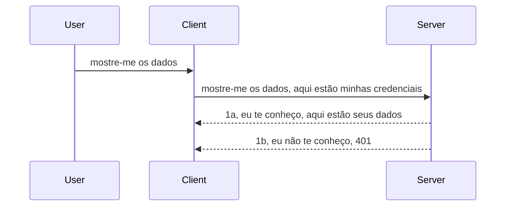

# Autenticação simples

Os SDKs MCP suportam o uso do OAuth 2.1, que para ser justo é um processo bastante complexo envolvendo conceitos como servidor de autenticação, servidor de recursos, envio de credenciais, obtenção de um código, troca do código por um token bearer até finalmente conseguir os dados do recurso. Se você não está acostumado com OAuth, que é algo ótimo para implementar, é uma boa ideia começar com um nível básico de autenticação e construir níveis cada vez melhores de segurança. É por isso que este capítulo existe, para prepará-lo para autenticação mais avançada.

## Autenticação, o que queremos dizer?

Autenticação é a abreviação de autenticação e autorização. A ideia é que precisamos fazer duas coisas:

- **Autenticação**, que é o processo de descobrir se permitimos que uma pessoa entre na nossa casa, se ela tem o direito de estar "aqui", ou seja, ter acesso ao nosso servidor de recursos onde as funcionalidades do MCP Server estão.
- **Autorização**, que é o processo de descobrir se um usuário deve ter acesso a esses recursos específicos que está pedindo, por exemplo, esses pedidos ou esses produtos, ou se ele pode apenas ler o conteúdo, mas não apagar, como outro exemplo.

## Credenciais: como dizer ao sistema quem somos

Bem, a maioria dos desenvolvedores web começa pensando em fornecer uma credencial ao servidor, geralmente um segredo que diz se eles podem estar aqui — "Autenticação". Essa credencial é geralmente uma versão codificada em base64 do nome de usuário e senha ou uma chave API que identifica um usuário específico.

Isso envolve enviá-la via cabeçalho chamado "Authorization" assim:

```json
{ "Authorization": "secret123" }
```

Isso geralmente é chamado de autenticação básica. O fluxo geral funciona da seguinte forma:



Agora que entendemos como funciona do ponto de vista do fluxo, como implementamos isso? Bem, a maioria dos servidores web tem um conceito chamado middleware, um pedaço de código que executa como parte da requisição e pode verificar as credenciais, e se forem válidas pode deixar a requisição passar. Se a requisição não tiver credenciais válidas, você recebe um erro de autenticação. Vamos ver como isso pode ser implementado:

**Python**

```python
class AuthMiddleware(BaseHTTPMiddleware):
    async def dispatch(self, request, call_next):

        has_header = request.headers.get("Authorization")
        if not has_header:
            print("-> Missing Authorization header!")
            return Response(status_code=401, content="Unauthorized")

        if not valid_token(has_header):
            print("-> Invalid token!")
            return Response(status_code=403, content="Forbidden")

        print("Valid token, proceeding...")
       
        response = await call_next(request)
        # adicione quaisquer cabeçalhos do cliente ou modifique a resposta de alguma forma
        return response


starlette_app.add_middleware(CustomHeaderMiddleware)
```

Aqui temos:

- Criado um middleware chamado `AuthMiddleware` onde seu método `dispatch` é chamado pelo servidor web.
- Adicionado o middleware ao servidor web:

    ```python
    starlette_app.add_middleware(AuthMiddleware)
    ```

- Escrito lógica de validação que verifica se o cabeçalho Authorization está presente e se o segredo enviado é válido:

    ```python
    has_header = request.headers.get("Authorization")
    if not has_header:
        print("-> Missing Authorization header!")
        return Response(status_code=401, content="Unauthorized")

    if not valid_token(has_header):
        print("-> Invalid token!")
        return Response(status_code=403, content="Forbidden")
    ```

    se o segredo estiver presente e válido, deixamos a requisição passar chamando `call_next` e retornamos a resposta.

    ```python
    response = await call_next(request)
    # adicione quaisquer cabeçalhos do cliente ou altere a resposta de alguma forma
    return response
    ```

O funcionamento é que, se uma requisição web for feita ao servidor, o middleware será chamado e, dado a implementação, deixará a requisição passar ou retornará um erro indicando que o cliente não tem permissão para continuar.

**TypeScript**

Aqui, criamos um middleware com o popular framework Express e interceptamos a requisição antes que ela alcance o MCP Server. Aqui está o código:

```typescript
function isValid(secret) {
    return secret === "secret123";
}

app.use((req, res, next) => {
    // 1. Cabeçalho de autorização presente?
    if(!req.headers["Authorization"]) {
        res.status(401).send('Unauthorized');
    }
    
    let token = req.headers["Authorization"];

    // 2. Verificar validade.
    if(!isValid(token)) {
        res.status(403).send('Forbidden');
    }

   
    console.log('Middleware executed');
    // 3. Passa a requisição para a próxima etapa no pipeline de requisição.
    next();
});
```

Neste código:

1. Verificamos se o cabeçalho Authorization está presente; se não, enviamos um erro 401.
2. Garantimos que a credencial/token é válido; se não, enviamos um erro 403.
3. Finalmente, passamos a requisição na pipeline e retornamos o recurso solicitado.

## Exercício: Implemente autenticação

Vamos aproveitar nosso conhecimento e tentar implementar. Aqui está o plano:

Servidor

- Crie um servidor web e instância MCP.
- Implemente um middleware para o servidor.

Cliente

- Envie requisição web, com credencial, via cabeçalho.

### -1- Crie um servidor web e instância MCP

> **Olhando adiante:** o exemplo TypeScript abaixo acompanha transportes HTTP em um mapa `transports` chaveado por `mcp-session-id`, conforme **Especificação MCP 2025-11-25**. O candidato a lançamento `2026-07-28` remove o handshake `initialize` e o ID de sessão, portanto esse mapa por sessão desaparece em favor de requisições sem estado, autocontidas. Veja [O que está mudando no MCP: O candidato a lançamento 2026-07-28](../../01-CoreConcepts/mcp-2026-07-28-release-candidate.md).

Em nosso primeiro passo, precisamos criar a instância do servidor web e do MCP Server.

**Python**

Aqui criamos uma instância do MCP server, criamos um aplicativo starlette web e hospedamos com uvicorn.

```python
# criando servidor MCP

app = FastMCP(
    name="MCP Resource Server",
    instructions="Resource Server that validates tokens via Authorization Server introspection",
    host=settings["host"],
    port=settings["port"],
    debug=True
)

# criando app web starlette
starlette_app = app.streamable_http_app()

# servindo app via uvicorn
async def run(starlette_app):
    import uvicorn
    config = uvicorn.Config(
            starlette_app,
            host=app.settings.host,
            port=app.settings.port,
            log_level=app.settings.log_level.lower(),
        )
    server = uvicorn.Server(config)
    await server.serve()

run(starlette_app)
```

Neste código:

- Criamos o MCP Server.
- Construímos o aplicativo starlette web a partir do MCP Server, `app.streamable_http_app()`.
- Hospedamos e servimos o app web usando uvicorn `server.serve()`.

**TypeScript**

Aqui criamos uma instância do MCP Server.

```typescript
const server = new McpServer({
      name: "example-server",
      version: "1.0.0"
    });

    // ... configurar recursos do servidor, ferramentas e prompts ...
```

Essa criação do MCP Server precisará acontecer dentro da definição da rota POST /mcp, então vamos pegar o código acima e mover assim:

```typescript
import express from "express";
import { randomUUID } from "node:crypto";
import { McpServer } from "@modelcontextprotocol/sdk/server/mcp.js";
import { StreamableHTTPServerTransport } from "@modelcontextprotocol/sdk/server/streamableHttp.js";
import { isInitializeRequest } from "@modelcontextprotocol/sdk/types.js"

const app = express();
app.use(express.json());

// Mapa para armazenar transportes por ID de sessão
const transports: { [sessionId: string]: StreamableHTTPServerTransport } = {};

// Lidar com requisições POST para comunicação cliente-servidor
app.post('/mcp', async (req, res) => {
  // Verificar se o ID de sessão existe
  const sessionId = req.headers['mcp-session-id'] as string | undefined;
  let transport: StreamableHTTPServerTransport;

  if (sessionId && transports[sessionId]) {
    // Reutilizar transporte existente
    transport = transports[sessionId];
  } else if (!sessionId && isInitializeRequest(req.body)) {
    // Nova requisição de inicialização
    transport = new StreamableHTTPServerTransport({
      sessionIdGenerator: () => randomUUID(),
      onsessioninitialized: (sessionId) => {
        // Armazenar o transporte pelo ID da sessão
        transports[sessionId] = transport;
      },
      // A proteção contra DNS rebinding está desativada por padrão para compatibilidade retroativa. Se você estiver executando este servidor
      // localmente, certifique-se de definir:
      // enableDnsRebindingProtection: true,
      // allowedHosts: ['127.0.0.1'],
    });

    // Limpar transporte ao ser fechado
    transport.onclose = () => {
      if (transport.sessionId) {
        delete transports[transport.sessionId];
      }
    };
    const server = new McpServer({
      name: "example-server",
      version: "1.0.0"
    });

    // ... configurar recursos do servidor, ferramentas e prompts ...

    // Conectar ao servidor MCP
    await server.connect(transport);
  } else {
    // Requisição inválida
    res.status(400).json({
      jsonrpc: '2.0',
      error: {
        code: -32000,
        message: 'Bad Request: No valid session ID provided',
      },
      id: null,
    });
    return;
  }

  // Lidar com a requisição
  await transport.handleRequest(req, res, req.body);
});

// Manipulador reutilizável para requisições GET e DELETE
const handleSessionRequest = async (req: express.Request, res: express.Response) => {
  const sessionId = req.headers['mcp-session-id'] as string | undefined;
  if (!sessionId || !transports[sessionId]) {
    res.status(400).send('Invalid or missing session ID');
    return;
  }
  
  const transport = transports[sessionId];
  await transport.handleRequest(req, res);
};

// Lidar com requisições GET para notificações do servidor para o cliente via SSE
app.get('/mcp', handleSessionRequest);

// Lidar com requisições DELETE para término da sessão
app.delete('/mcp', handleSessionRequest);

app.listen(3000);
```

Agora você vê como a criação do MCP Server foi movida para dentro de `app.post("/mcp")`.

Vamos para o próximo passo de criar o middleware para validar a credencial recebida.

### -2- Implemente um middleware para o servidor

Vamos para a parte middleware agora. Aqui vamos criar um middleware que verifica se há uma credencial no cabeçalho `Authorization` e valida essa credencial. Se for aceitável, a requisição continuará para fazer o que precisa (por exemplo listar ferramentas, ler um recurso ou qualquer funcionalidade MCP solicitada pelo cliente).

**Python**

Para criar o middleware, precisamos criar uma classe que herda de `BaseHTTPMiddleware`. Existem duas peças interessantes:

- A requisição `request`, da qual lemos as informações do cabeçalho.
- `call_next`, o callback que precisamos invocar se o cliente trouxe uma credencial aceitável.

Primeiro, precisamos tratar o caso de faltar o cabeçalho `Authorization`:

```python
has_header = request.headers.get("Authorization")

# sem cabeçalho presente, falha com 401, caso contrário continue.
if not has_header:
    print("-> Missing Authorization header!")
    return Response(status_code=401, content="Unauthorized")
```

Aqui enviamos uma mensagem 401 unauthorized pois o cliente falhou na autenticação.

Em seguida, se uma credencial foi submetida, precisamos verificar sua validade assim:

```python
 if not valid_token(has_header):
    print("-> Invalid token!")
    return Response(status_code=403, content="Forbidden")
```

Note como enviamos uma mensagem 403 forbidden acima. Vamos ver o middleware completo abaixo, implementando tudo que mencionamos:

```python
class AuthMiddleware(BaseHTTPMiddleware):
    async def dispatch(self, request, call_next):

        has_header = request.headers.get("Authorization")
        if not has_header:
            print("-> Missing Authorization header!")
            return Response(status_code=401, content="Unauthorized")

        if not valid_token(has_header):
            print("-> Invalid token!")
            return Response(status_code=403, content="Forbidden")

        print("Valid token, proceeding...")
        print(f"-> Received {request.method} {request.url}")
        response = await call_next(request)
        response.headers['Custom'] = 'Example'
        return response

```

Ótimo, mas e a função `valid_token`? Aqui está abaixo:

```python
# NÃO use para produção - melhore isso !!
def valid_token(token: str) -> bool:
    # remova o prefixo "Bearer "
    if token.startswith("Bearer "):
        token = token[7:]
        return token == "secret-token"
    return False
```

Isso obviamente deve ser melhorado.

IMPORTANTE: Você NUNCA deve ter segredos assim no código. Idealmente, você deve recuperar o valor para comparar de uma fonte de dados ou de um IDP (provedor de serviço de identidade) ou, melhor ainda, deixar o IDP fazer a validação.

**TypeScript**

Para implementar isso com Express, precisamos usar o método `use` que aceita funções middleware.

Precisamos:

- Interagir com a variável de requisição para checar a credencial passada na propriedade `Authorization`.
- Validar a credencial, e se verdadeira, deixar a requisição continuar para que o pedido MCP do cliente faça o que deve (por exemplo, listar ferramentas, ler recurso ou qualquer função MCP).

Aqui, verificamos se o cabeçalho `Authorization` está presente e, se não, impedimos a requisição de passar:

```typescript
if(!req.headers["authorization"]) {
    res.status(401).send('Unauthorized');
    return;
}
```

Se o cabeçalho não for enviado, você recebe um 401.

Em seguida, verificamos se a credencial é válida, e se não, paramos a requisição com uma mensagem um pouco diferente:

```typescript
if(!isValid(token)) {
    res.status(403).send('Forbidden');
    return;
} 
```

Note que agora você recebe um erro 403.

Aqui está o código completo:

```typescript
app.use((req, res, next) => {
    console.log('Request received:', req.method, req.url, req.headers);
    console.log('Headers:', req.headers["authorization"]);
    if(!req.headers["authorization"]) {
        res.status(401).send('Unauthorized');
        return;
    }
    
    let token = req.headers["authorization"];

    if(!isValid(token)) {
        res.status(403).send('Forbidden');
        return;
    }  

    console.log('Middleware executed');
    next();
});
```

Configuramos o servidor web para aceitar um middleware que verifica a credencial que o cliente espera estar nos enviando. E o cliente em si?

### -3- Envie requisição web com credencial via cabeçalho

Precisamos garantir que o cliente está passando a credencial no cabeçalho. Como vamos usar um cliente MCP para isso, precisamos descobrir como fazer.

**Python**

Para o cliente, precisamos passar um cabeçalho com nossa credencial assim:

```python
# NÃO codifique o valor diretamente, tenha-o no mínimo em uma variável de ambiente ou em um armazenamento mais seguro
token = "secret-token"

async with streamablehttp_client(
        url = f"http://localhost:{port}/mcp",
        headers = {"Authorization": f"Bearer {token}"}
    ) as (
        read_stream,
        write_stream,
        session_callback,
    ):
        async with ClientSession(
            read_stream,
            write_stream
        ) as session:
            await session.initialize()
      
            # TODO, o que você quer que seja feito no cliente, por exemplo listar ferramentas, chamar ferramentas etc.
```

Note como preenchemos a propriedade `headers` assim: ` headers = {"Authorization": f"Bearer {token}"}`.

**TypeScript**

Podemos resolver isso em dois passos:

1. Preencher um objeto de configuração com nossa credencial.
2. Passar o objeto de configuração para o transporte.

```typescript

// NÃO defina o valor fixo como mostrado aqui. No mínimo, tenha-o como uma variável de ambiente e use algo como dotenv (no modo de desenvolvimento).
let token = "secret123"

// defina um objeto de opção de transporte para o cliente
let options: StreamableHTTPClientTransportOptions = {
  sessionId: sessionId,
  requestInit: {
    headers: {
      "Authorization": "secret123"
    }
  }
};

// passe o objeto de opções para o transporte
async function main() {
   const transport = new StreamableHTTPClientTransport(
      new URL(serverUrl),
      options
   );
```

Veja acima como tivemos que criar um objeto `options` e colocar os cabeçalhos na propriedade `requestInit`.

IMPORTANTE: Como melhoramos isso daqui? Bem, a implementação atual tem alguns problemas. Primeiramente, passar uma credencial assim é bastante arriscado, a menos que você ao menos tenha HTTPS. Mesmo assim, a credencial pode ser roubada, então você precisa de um sistema onde possa revogar facilmente o token e adicionar verificações adicionais, como de onde no mundo ele está vindo, se a requisição acontece com muita frequência (comportamento de bot), em resumo, há toda uma série de preocupações.

Deve-se dizer, no entanto, que para APIs muito simples, onde você não quer que ninguém chame sua API sem autenticação, o que temos aqui é um bom começo.

Dito isso, vamos tentar fortalecer um pouco a segurança usando um formato padronizado como JSON Web Token, também conhecido como JWT ou tokens "JOT".

## JSON Web Tokens, JWT

Então, estamos tentando melhorar as coisas além de enviar credenciais muito simples. Quais são as melhorias imediatas ao adotar JWT?

- **Melhorias de segurança**. Na autenticação básica, você envia nome de usuário e senha codificados em base64 (ou uma chave API) repetidamente, o que aumenta o risco. Com JWT, você envia seu nome de usuário e senha e recebe um token em troca que tem validade temporal, ou seja, expira. JWT permite usar controle de acesso detalhado com roles, escopos e permissões.
- **Ausência de estado e escalabilidade**. JWTs são autocontidos, carregam todas as informações do usuário e eliminam a necessidade de armazenamento de sessões no servidor. O token também pode ser validado localmente.
- **Interoperabilidade e federação**. JWTs são centrais no Open ID Connect e usados com provedores de identidade conhecidos como Entra ID, Google Identity e Auth0. Também possibilitam login único e muito mais, tornando-os de nível empresarial.
- **Modularidade e flexibilidade**. JWTs também podem ser usados com API Gateways como Azure API Management, NGINX e outros. Suportam cenários de autenticação e comunicação servidor-a-serviço, incluindo impersonação e delegação.
- **Desempenho e cache**. JWTs podem ser armazenados em cache após decodificação, reduzindo a necessidade de parsing. Isso ajuda especialmente em aplicativos com tráfego intenso, melhorando desempenho e reduzindo carga na infraestrutura.
- **Recursos avançados**. Também suportam introspecção (validar no servidor) e revogação (invalidar um token).

Com todos esses benefícios, vamos ver como podemos levar nossa implementação ao próximo nível.

## Transformando autenticação básica em JWT

Assim, as mudanças que precisamos fazer em alto nível são:

- **Aprender a construir um token JWT** e deixá-lo pronto para ser enviado do cliente para o servidor.
- **Validar um token JWT** e, se válido, permitir que o cliente tenha acesso aos nossos recursos.
- **Armazenamento seguro do token**. Como armazenamos esse token.
- **Proteger as rotas**. Precisamos proteger rotas, no nosso caso, rotas e funcionalidades específicas do MCP.
- **Adicionar tokens de atualização**. Garantir que criamos tokens de curta duração e tokens de atualização de longa duração que podem ser usados para obter novos tokens se expirarem. Também garantir que haja um endpoint de atualização e uma estratégia de rotação.

### -1- Construir um token JWT

Primeiro, um token JWT tem as seguintes partes:

- **cabeçalho**, algoritmo usado e tipo do token.
- **payload**, declarações, como sub (o usuário ou entidade que o token representa; em cenário de autenticação, geralmente o id do usuário), exp (quando expira), role (a função).
- **assinatura**, assinada com um segredo ou chave privada.

Para isso, precisaremos construir o cabeçalho, o payload e o token codificado.

**Python**

```python

import jwt
import jwt
from jwt.exceptions import ExpiredSignatureError, InvalidTokenError
import datetime

# Chave secreta usada para assinar o JWT
secret_key = 'your-secret-key'

header = {
    "alg": "HS256",
    "typ": "JWT"
}

# as informações do usuário, suas reivindicações e tempo de expiração
payload = {
    "sub": "1234567890",               # Assunto (ID do usuário)
    "name": "User Userson",                # Reivindicação personalizada
    "admin": True,                     # Reivindicação personalizada
    "iat": datetime.datetime.utcnow(),# Emitido em
    "exp": datetime.datetime.utcnow() + datetime.timedelta(hours=1)  # Expiração
}

# codificá-lo
encoded_jwt = jwt.encode(payload, secret_key, algorithm="HS256", headers=header)
```

No código acima:

- Definimos um cabeçalho usando HS256 como algoritmo e tipo JWT.
- Construímos um payload contendo um subject ou id do usuário, um nome de usuário, uma função, quando foi emitido e quando expira, implementando assim o aspecto de validade temporal que mencionamos.

**TypeScript**

Aqui precisaremos de algumas dependências que ajudarão a construir o token JWT.

Dependências

```sh

npm install jsonwebtoken
npm install --save-dev @types/jsonwebtoken
```

Agora que temos isso no lugar, vamos criar o cabeçalho, payload e por meio disso criar o token codificado.

```typescript
import jwt from 'jsonwebtoken';

const secretKey = 'your-secret-key'; // Use variáveis de ambiente na produção

// Defina o payload
const payload = {
  sub: '1234567890',
  name: 'User usersson',
  admin: true,
  iat: Math.floor(Date.now() / 1000), // Emitido em
  exp: Math.floor(Date.now() / 1000) + 60 * 60 // Expira em 1 hora
};

// Defina o cabeçalho (opcional, jsonwebtoken define padrões)
const header = {
  alg: 'HS256',
  typ: 'JWT'
};

// Crie o token
const token = jwt.sign(payload, secretKey, {
  algorithm: 'HS256',
  header: header
});

console.log('JWT:', token);
```

Esse token é:

Assinado usando HS256
Válido por 1 hora
Inclui declarações como sub, name, admin, iat e exp.

### -2- Validar um token

Também precisaremos validar um token, isso é algo que devemos fazer no servidor para garantir que o cliente está nos enviando algo válido. Há muitas verificações que devemos fazer, desde a validação da estrutura até da validade. Incentivamos que você adicione outras verificações como se o usuário está no seu sistema e outras.

Para validar um token, precisamos decodificá-lo para poder ler e começar a checar sua validade:

**Python**

```python

# Decodificar e verificar o JWT
try:
    decoded = jwt.decode(token, secret_key, algorithms=["HS256"])
    print("✅ Token is valid.")
    print("Decoded claims:")
    for key, value in decoded.items():
        print(f"  {key}: {value}")
except ExpiredSignatureError:
    print("❌ Token has expired.")
except InvalidTokenError as e:
    print(f"❌ Invalid token: {e}")

```


Neste código, chamamos `jwt.decode` usando o token, a chave secreta e o algoritmo escolhido como entrada. Note como usamos uma construção try-catch, pois uma validação falha leva a um erro ser gerado.

**TypeScript**

Aqui precisamos chamar `jwt.verify` para obter uma versão decodificada do token que podemos analisar mais a fundo. Se esta chamada falhar, isso significa que a estrutura do token está incorreta ou não é mais válida.

```typescript

try {
  const decoded = jwt.verify(token, secretKey);
  console.log('Decoded Payload:', decoded);
} catch (err) {
  console.error('Token verification failed:', err);
}
```

NOTA: conforme mencionado anteriormente, deveríamos realizar verificações adicionais para garantir que este token representa um usuário em nosso sistema e assegurar que o usuário possui os direitos que afirma ter.

A seguir, vamos explorar o controle de acesso baseado em papéis, também conhecido como RBAC.

## Adicionando controle de acesso baseado em papéis

A ideia é que queremos expressar que diferentes papéis têm permissões diferentes. Por exemplo, assumimos que um administrador pode fazer tudo, que um usuário normal pode ler/escrever e que um convidado só pode ler. Portanto, aqui estão alguns níveis de permissão possíveis:

- Admin.Write 
- User.Read
- Guest.Read

Vamos ver como podemos implementar esse controle com middleware. Middlewares podem ser adicionados por rota, bem como para todas as rotas.

**Python**

```python
from starlette.middleware.base import BaseHTTPMiddleware
from starlette.responses import JSONResponse
import jwt

# NÃO tenha o segredo no código assim, isto é apenas para fins de demonstração. Leia-o de um local seguro.
SECRET_KEY = "your-secret-key" # coloque isso em uma variável de ambiente
REQUIRED_PERMISSION = "User.Read"

class JWTPermissionMiddleware(BaseHTTPMiddleware):
    async def dispatch(self, request, call_next):
        auth_header = request.headers.get("Authorization")
        if not auth_header or not auth_header.startswith("Bearer "):
            return JSONResponse({"error": "Missing or invalid Authorization header"}, status_code=401)

        token = auth_header.split(" ")[1]
        try:
            decoded = jwt.decode(token, SECRET_KEY, algorithms=["HS256"])
        except jwt.ExpiredSignatureError:
            return JSONResponse({"error": "Token expired"}, status_code=401)
        except jwt.InvalidTokenError:
            return JSONResponse({"error": "Invalid token"}, status_code=401)

        permissions = decoded.get("permissions", [])
        if REQUIRED_PERMISSION not in permissions:
            return JSONResponse({"error": "Permission denied"}, status_code=403)

        request.state.user = decoded
        return await call_next(request)


```

Existem algumas maneiras diferentes de adicionar o middleware como mostrado abaixo:

```python

# Alt 1: adicionar middleware durante a construção da aplicação starlette
middleware = [
    Middleware(JWTPermissionMiddleware)
]

app = Starlette(routes=routes, middleware=middleware)

# Alt 2: adicionar middleware após a aplicação starlette já estar construída
starlette_app.add_middleware(JWTPermissionMiddleware)

# Alt 3: adicionar middleware por rota
routes = [
    Route(
        "/mcp",
        endpoint=..., # manipulador
        middleware=[Middleware(JWTPermissionMiddleware)]
    )
]
```

**TypeScript**

Podemos usar `app.use` e um middleware que será executado para todas as requisições.

```typescript
app.use((req, res, next) => {
    console.log('Request received:', req.method, req.url, req.headers);
    console.log('Headers:', req.headers["authorization"]);

    // 1. Verifique se o cabeçalho de autorização foi enviado

    if(!req.headers["authorization"]) {
        res.status(401).send('Unauthorized');
        return;
    }
    
    let token = req.headers["authorization"];

    // 2. Verifique se o token é válido
    if(!isValid(token)) {
        res.status(403).send('Forbidden');
        return;
    }  

    // 3. Verifique se o usuário do token existe em nosso sistema
    if(!isExistingUser(token)) {
        res.status(403).send('Forbidden');
        console.log("User does not exist");
        return;
    }
    console.log("User exists");

    // 4. Verifique se o token tem as permissões corretas
    if(!hasScopes(token, ["User.Read"])){
        res.status(403).send('Forbidden - insufficient scopes');
    }

    console.log("User has required scopes");

    console.log('Middleware executed');
    next();
});

```

Há várias coisas que podemos deixar para nosso middleware fazer e que nosso middleware DEVE fazer, a saber:

1. Verificar se o cabeçalho de autorização está presente
2. Verificar se o token é válido; chamamos `isValid`, que é um método que escrevemos para verificar a integridade e validade do token JWT.
3. Verificar se o usuário existe em nosso sistema; devemos checar isso.

   ```typescript
    // usuários no banco de dados
   const users = [
     "user1",
     "User usersson",
   ]

   function isExistingUser(token) {
     let decodedToken = verifyToken(token);

     // TODO, verificar se o usuário existe no banco de dados
     return users.includes(decodedToken?.name || "");
   }
   ```

Acima, criamos uma lista muito simples de `users`, que obviamente deveria estar em um banco de dados.

4. Além disso, também devemos verificar se o token possui as permissões corretas.

   ```typescript
   if(!hasScopes(token, ["User.Read"])){
        res.status(403).send('Forbidden - insufficient scopes');
   }
   ```

No código acima no middleware, verificamos que o token contém a permissão User.Read; caso contrário, enviamos um erro 403. Abaixo está o método auxiliar `hasScopes`.

   ```typescript
   function hasScopes(scope: string, requiredScopes: string[]) {
     let decodedToken = verifyToken(scope);
    return requiredScopes.every(scope => decodedToken?.scopes.includes(scope));
  }
   ```

Have a think which additional checks you should be doing, but these are the absolute minimum of checks you should be doing.

Using Express as a web framework is a common choice. There are helpers library when you use JWT so you can write less code.

- `express-jwt`, helper library that provides a middleware that helps decode your token.
- `express-jwt-permissions`, this provides a middleware `guard` that helps check if a certain permission is on the token.

Here's what these libraries can look like when used:

```typescript
const express = require('express');
const jwt = require('express-jwt');
const guard = require('express-jwt-permissions')();

const app = express();
const secretKey = 'your-secret-key'; // put this in env variable

// Decode JWT and attach to req.user
app.use(jwt({ secret: secretKey, algorithms: ['HS256'] }));

// Check for User.Read permission
app.use(guard.check('User.Read'));

// multiple permissions
// app.use(guard.check(['User.Read', 'Admin.Access']));

app.get('/protected', (req, res) => {
  res.json({ message: `Welcome ${req.user.name}` });
});

// Error handler
app.use((err, req, res, next) => {
  if (err.code === 'permission_denied') {
    return res.status(403).send('Forbidden');
  }
  next(err);
});

```

Agora que você viu como middleware pode ser usado tanto para autenticação quanto autorização, e quanto ao MCP, isso muda a forma como fazemos a autenticação? Vamos descobrir na próxima seção.

### -3- Adicionar RBAC ao MCP

Você viu até agora como pode adicionar RBAC via middleware; no entanto, para MCP não há uma maneira fácil de adicionar RBAC por recurso do MCP, então o que fazemos? Bem, só precisamos adicionar um código como este que verifica, neste caso, se o cliente tem os direitos para chamar uma ferramenta específica:

Você tem algumas opções diferentes para realizar RBAC por recurso, aqui estão algumas:

- Adicionar uma verificação para cada ferramenta, recurso, prompt onde você precise checar o nível de permissão.

   **python**

   ```python
   @tool()
   def delete_product(id: int):
      try:
          check_permissions(role="Admin.Write", request)
      catch:
        pass # cliente falhou na autorização, gerar erro de autorização
   ```

   **typescript**

   ```typescript
   server.registerTool(
    "delete-product",
    {
      title: Delete a product",
      description: "Deletes a product",
      inputSchema: { id: z.number() }
    },
    async ({ id }) => {
      
      try {
        checkPermissions("Admin.Write", request);
        // todo, enviar id para productService e entrada remota
      } catch(Exception e) {
        console.log("Authorization error, you're not allowed");  
      }

      return {
        content: [{ type: "text", text: `Deletected product with id ${id}` }]
      };
    }
   );
   ```


- Usar uma abordagem avançada no servidor e os manipuladores de requisição para minimizar quantos lugares você precisa fazer a checagem.

   **Python**

   ```python
   
   tool_permission = {
      "create_product": ["User.Write", "Admin.Write"],
      "delete_product": ["Admin.Write"]
   }

   def has_permission(user_permissions, required_permissions) -> bool:
      # user_permissions: lista de permissões que o usuário possui
      # required_permissions: lista de permissões necessárias para a ferramenta
      return any(perm in user_permissions for perm in required_permissions)

   @server.call_tool()
   async def handle_call_tool(
     name: str, arguments: dict[str, str] | None
   ) -> list[types.TextContent]:
    # Assuma que request.user.permissions é uma lista de permissões para o usuário
     user_permissions = request.user.permissions
     required_permissions = tool_permission.get(name, [])
     if not has_permission(user_permissions, required_permissions):
        # Levante erro "Você não tem permissão para chamar a ferramenta {name}"
        raise Exception(f"You don't have permission to call tool {name}")
     # continue e chame a ferramenta
     # ...
   ```   
   

   **TypeScript**

   ```typescript
   function hasPermission(userPermissions: string[], requiredPermissions: string[]): boolean {
       if (!Array.isArray(userPermissions) || !Array.isArray(requiredPermissions)) return false;
       // Retorna verdadeiro se o usuário tiver pelo menos uma permissão necessária
       
       return requiredPermissions.some(perm => userPermissions.includes(perm));
   }
  
   server.setRequestHandler(CallToolRequestSchema, async (request) => {
      const { params: { name } } = request;
  
      let permissions = request.user.permissions;
  
      if (!hasPermission(permissions, toolPermissions[name])) {
         return new Error(`You don't have permission to call ${name}`);
      }
  
      // continue..
   });
   ```

   Note que você precisará garantir que seu middleware atribua um token decodificado à propriedade user da requisição para que o código acima seja simplificado.

### Resumindo

Agora que discutimos como adicionar suporte para RBAC em geral e para MCP em particular, é hora de tentar implementar a segurança por conta própria para garantir que compreendeu os conceitos apresentados.

## Tarefa 1: Construir um servidor MCP e um cliente MCP usando autenticação básica

Aqui você aplicará o que aprendeu em termos de envio de credenciais através de cabeçalhos.

## Solução 1

[Solução 1](./code/basic/README.md)

## Tarefa 2: Atualizar a solução da Tarefa 1 para usar JWT

Pegue a primeira solução, mas desta vez, vamos melhorá-la.

Em vez de usar Basic Auth, vamos usar JWT.

## Solução 2

[Solução 2](./solution/jwt-solution/README.md)

## Desafio

Adicione o RBAC por ferramenta que descrevemos na seção "Adicionar RBAC ao MCP".

## Resumo

Esperamos que você tenha aprendido muito neste capítulo, de nenhuma segurança até segurança básica, até JWT e como ele pode ser adicionado ao MCP.

Construímos uma base sólida com JWTs personalizados, mas conforme crescemos, estamos avançando para um modelo de identidade baseado em padrões. Adotar um IdP como Entra ou Keycloak nos permite externalizar emissão, validação e gerenciamento do ciclo de vida de tokens para uma plataforma confiável — nos liberando para focar na lógica do aplicativo e na experiência do usuário.

Para isso, temos um capítulo mais [avançado sobre Entra](../../05-AdvancedTopics/mcp-security-entra/README.md)

## O Que Vem a Seguir

- Próximo: [Configurando Hosts MCP](../12-mcp-hosts/README.md)

---

<!-- CO-OP TRANSLATOR DISCLAIMER START -->
**Aviso Legal**:
Este documento foi traduzido usando o serviço de tradução por IA [Co-op Translator](https://github.com/Azure/co-op-translator). Embora nos esforcemos pela precisão, por favor, esteja ciente de que traduções automatizadas podem conter erros ou imprecisões. O documento original em seu idioma nativo deve ser considerado a fonte autorizada. Para informações críticas, recomenda-se tradução profissional humana. Não nos responsabilizamos por quaisquer mal-entendidos ou interpretações incorretas decorrentes do uso desta tradução.
<!-- CO-OP TRANSLATOR DISCLAIMER END -->