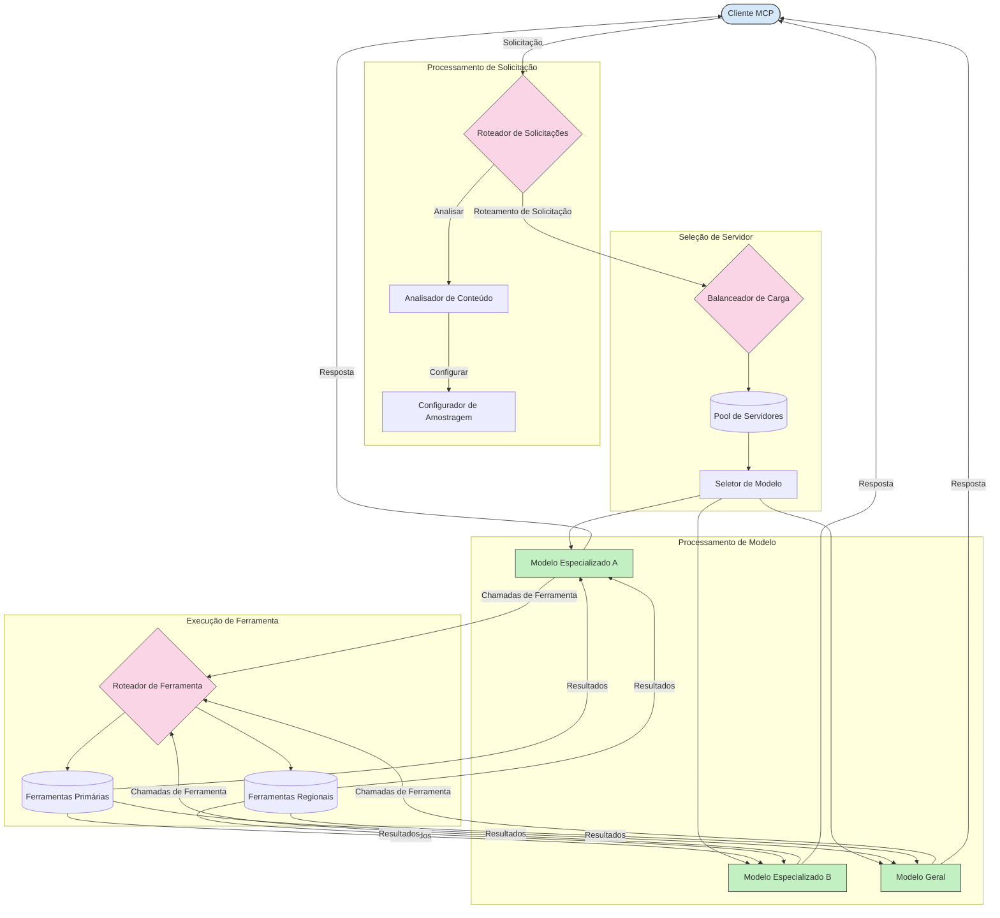

# Roteamento no Protocolo de Contexto de Modelo

O roteamento é essencial para direcionar solicitações aos modelos, ferramentas ou serviços apropriados dentro de um ecossistema MCP.

## Introdução

O roteamento no Protocolo de Contexto de Modelo (MCP) envolve direcionar solicitações para os modelos ou serviços mais adequados com base em vários critérios, como tipo de conteúdo, contexto do usuário e carga do sistema. Isso garante um processamento eficiente e utilização ideal dos recursos.

## Objetivos de Aprendizagem

Ao final desta lição, você será capaz de:

- Compreender os princípios do roteamento no MCP.
- Implementar roteamento baseado em conteúdo para direcionar solicitações a serviços especializados.
- Aplicar estratégias inteligentes de balanceamento de carga para otimizar a utilização de recursos.
- Implementar roteamento dinâmico de ferramentas com base no contexto da solicitação.

## Roteamento Baseado em Conteúdo

O roteamento baseado em conteúdo direciona solicitações para serviços especializados com base no conteúdo da solicitação. Por exemplo, solicitações relacionadas à geração de código podem ser roteadas para um modelo de código especializado, enquanto solicitações de escrita criativa podem ser enviadas para um modelo de escrita criativa.

Vamos ver um exemplo de implementação em diferentes linguagens de programação.

<details>
<summary>.NET</summary>

```csharp
// .NET Example: Content-based routing in MCP
public class ContentBasedRouter
{
    private readonly Dictionary<string, McpClient> _specializedClients;
    private readonly RoutingClassifier _classifier;
    
    public ContentBasedRouter()
    {
        // Initialize specialized clients for different domains
        _specializedClients = new Dictionary<string, McpClient>
        {
            ["code"] = new McpClient("https://code-specialized-mcp.com"),
            ["creative"] = new McpClient("https://creative-specialized-mcp.com"),
            ["scientific"] = new McpClient("https://scientific-specialized-mcp.com"),
            ["general"] = new McpClient("https://general-mcp.com")
        };
        
        // Initialize content classifier
        _classifier = new RoutingClassifier();
    }
    
    public async Task<McpResponse> RouteAndProcessAsync(string prompt, IDictionary<string, object> parameters = null)
    {
        // Classify the prompt to determine the best specialized service
        string category = await _classifier.ClassifyPromptAsync(prompt);
        
        // Get the appropriate client or fall back to general
        var client = _specializedClients.ContainsKey(category) 
            ? _specializedClients[category] 
            : _specializedClients["general"];
            
        Console.WriteLine($"Routing request to {category} specialized service");
        
        // Send request to the selected service
        return await client.SendPromptAsync(prompt, parameters);
    }
    
    // Simple classifier for routing decisions
    private class RoutingClassifier
    {
        public Task<string> ClassifyPromptAsync(string prompt)
        {
            prompt = prompt.ToLowerInvariant();
            
            if (prompt.Contains("code") || prompt.Contains("function") || 
                prompt.Contains("program") || prompt.Contains("algorithm"))
            {
                return Task.FromResult("code");
            }
            
            if (prompt.Contains("story") || prompt.Contains("creative") || 
                prompt.Contains("imagine") || prompt.Contains("design"))
            {
                return Task.FromResult("creative");
            }
            
            if (prompt.Contains("science") || prompt.Contains("research") || 
                prompt.Contains("analyze") || prompt.Contains("study"))
            {
                return Task.FromResult("scientific");
            }
            
            return Task.FromResult("general");
        }
    }
}
```

No código acima, nós:

- Criamos uma classe `ContentBasedRouter` que roteia solicitações com base no conteúdo do prompt.
- Inicializamos clientes especializados para diferentes domínios (código, criativo, científico, geral).
- Implementamos um classificador simples que determina a categoria do prompt e o direciona para o serviço especializado apropriado.
- Usamos um mecanismo de fallback para rotear solicitações para um serviço geral se nenhum serviço especializado estiver disponível.
- Implementamos processamento assíncrono para lidar com solicitações de forma eficiente.
- Usamos um dicionário para mapear categorias de conteúdo para clientes MCP especializados.
- Implementamos um classificador simples que analisa o prompt e retorna a categoria adequada.
- Usamos o cliente especializado para enviar a solicitação e receber a resposta.
- Tratamos casos em que o prompt não corresponde a nenhuma categoria especializada, roteando para um serviço geral.

</details>

## Balanceamento de Carga Inteligente

O balanceamento de carga otimiza a utilização de recursos e garante alta disponibilidade para serviços MCP. Existem diferentes maneiras de implementar balanceamento de carga, como round-robin, tempo de resposta ponderado ou estratégias conscientes do conteúdo.

Vamos analisar o exemplo abaixo que utiliza as seguintes estratégias:

- **Round Robin**: Distribui as solicitações de forma equilibrada entre os servidores disponíveis.
- **Tempo de Resposta Ponderado**: Roteia solicitações para servidores com base no tempo médio de resposta.
- **Consciente do Conteúdo**: Roteia solicitações para servidores especializados com base no conteúdo da solicitação.

<details>
<summary>Java</summary>

```java
// Exemplo em Java: Balanceamento de carga inteligente para servidores MCP
public class McpLoadBalancer {
    private final List<McpServerNode> serverNodes;
    private final LoadBalancingStrategy strategy;
    
    public McpLoadBalancer(List<McpServerNode> nodes, LoadBalancingStrategy strategy) {
        this.serverNodes = new ArrayList<>(nodes);
        this.strategy = strategy;
    }
    
    public McpResponse processRequest(McpRequest request) {
        // Selecione o melhor servidor com base na estratégia
        McpServerNode selectedNode = strategy.selectNode(serverNodes, request);
        
        try {
            // Direcione a solicitação para o nó selecionado
            return selectedNode.processRequest(request);
        } catch (Exception e) {
            // Trate falhas - implemente lógica de tentativa ou alternativa
            System.err.println("Error processing request on node " + selectedNode.getId() + ": " + e.getMessage());
            
            // Marque o nó como potencialmente não saudável
            selectedNode.recordFailure();
            
            // Tente o próximo melhor nó como alternativa
            List<McpServerNode> remainingNodes = new ArrayList<>(serverNodes);
            remainingNodes.remove(selectedNode);
            
            if (!remainingNodes.isEmpty()) {
                McpServerNode fallbackNode = strategy.selectNode(remainingNodes, request);
                return fallbackNode.processRequest(request);
            } else {
                throw new RuntimeException("All MCP server nodes failed to process the request");
            }
        }
    }
    
    // Tarefa de verificação de saúde do nó
    public void startHealthChecks(Duration interval) {
        ScheduledExecutorService scheduler = Executors.newScheduledThreadPool(1);
        scheduler.scheduleAtFixedRate(() -> {
            for (McpServerNode node : serverNodes) {
                try {
                    boolean isHealthy = node.checkHealth();
                    System.out.println("Node " + node.getId() + " health status: " + 
                                      (isHealthy ? "HEALTHY" : "UNHEALTHY"));
                } catch (Exception e) {
                    System.err.println("Health check failed for node " + node.getId());
                    node.setHealthy(false);
                }
            }
        }, 0, interval.toMillis(), TimeUnit.MILLISECONDS);
    }
    
    // Interface para estratégias de balanceamento de carga
    public interface LoadBalancingStrategy {
        McpServerNode selectNode(List<McpServerNode> nodes, McpRequest request);
    }
    
    // Estratégia round-robin
    public static class RoundRobinStrategy implements LoadBalancingStrategy {
        private AtomicInteger counter = new AtomicInteger(0);
        
        @Override
        public McpServerNode selectNode(List<McpServerNode> nodes, McpRequest request) {
            List<McpServerNode> healthyNodes = nodes.stream()
                .filter(McpServerNode::isHealthy)
                .collect(Collectors.toList());
            
            if (healthyNodes.isEmpty()) {
                throw new RuntimeException("No healthy nodes available");
            }
            
            int index = counter.getAndIncrement() % healthyNodes.size();
            return healthyNodes.get(index);
        }
    }
    
    // Estratégia de tempo de resposta ponderado
    public static class ResponseTimeStrategy implements LoadBalancingStrategy {
        @Override
        public McpServerNode selectNode(List<McpServerNode> nodes, McpRequest request) {
            return nodes.stream()
                .filter(McpServerNode::isHealthy)
                .min(Comparator.comparing(McpServerNode::getAverageResponseTime))
                .orElseThrow(() -> new RuntimeException("No healthy nodes available"));
        }
    }
    
    // Estratégia consciente de conteúdo
    public static class ContentAwareStrategy implements LoadBalancingStrategy {
        @Override
        public McpServerNode selectNode(List<McpServerNode> nodes, McpRequest request) {
            // Determine as características da solicitação
            boolean isCodeRequest = request.getPrompt().contains("code") || 
                                   request.getAllowedTools().contains("codeInterpreter");
            
            boolean isCreativeRequest = request.getPrompt().contains("creative") || 
                                       request.getPrompt().contains("story");
            
            // Encontre nós especializados
            Optional<McpServerNode> specializedNode = nodes.stream()
                .filter(McpServerNode::isHealthy)
                .filter(node -> {
                    if (isCodeRequest && node.getSpecialization().equals("code")) {
                        return true;
                    }
                    if (isCreativeRequest && node.getSpecialization().equals("creative")) {
                        return true;
                    }
                    return false;
                })
                .findFirst();
            
            // Retorne o nó especializado ou o menos carregado
            return specializedNode.orElse(
                nodes.stream()
                    .filter(McpServerNode::isHealthy)
                    .min(Comparator.comparing(McpServerNode::getCurrentLoad))
                    .orElseThrow(() -> new RuntimeException("No healthy nodes available"))
            );
        }
    }
}
```

No código acima, nós:

- Criamos uma classe `McpLoadBalancer` que gerencia uma lista de nós de servidor MCP e roteia solicitações com base na estratégia de balanceamento de carga selecionada.
- Implementamos diferentes estratégias de balanceamento de carga: `RoundRobinStrategy`, `ResponseTimeStrategy` e `ContentAwareStrategy`.
- Usamos um `ScheduledExecutorService` para verificar periodicamente a saúde dos nós dos servidores.
- Implementamos um mecanismo de verificação de saúde que marca os nós como saudáveis ou não saudáveis com base na resposta às verificações.
- Tratamos o processamento das solicitações com manipulação de erros e lógica de fallback para garantir alta disponibilidade.
- Usamos uma classe `McpServerNode` para representar nós individuais de servidor MCP, incluindo seu status de saúde, tempo médio de resposta e carga atual.
- Implementamos uma classe `McpRequest` para encapsular detalhes da solicitação, como o prompt e as ferramentas permitidas.
- Usamos Java Streams para filtrar e selecionar nós com base no status de saúde e especialização.

</details>

## Roteamento Dinâmico de Ferramentas

O roteamento de ferramentas garante que as chamadas de ferramentas sejam direcionadas ao serviço mais adequado com base no contexto. Por exemplo, uma chamada para uma ferramenta de previsão do tempo pode precisar ser roteada para um endpoint regional conforme a localização do usuário, ou uma ferramenta de calculadora pode precisar usar uma versão específica da API.

Vamos analisar um exemplo de implementação que demonstra roteamento dinâmico de ferramentas baseado em análise de solicitação, endpoints regionais e suporte à versionamento.

<details>
<summary>Python</summary>

```python
# Exemplo Python: Roteamento dinâmico de ferramenta baseado na análise da solicitação
class McpToolRouter:
    def __init__(self):
        # Registrar endpoints de ferramentas disponíveis
        self.tool_endpoints = {
            "weatherTool": "https://weather-service.example.com/api",
            "calculatorTool": "https://calculator-service.example.com/compute",
            "databaseTool": "https://database-service.example.com/query",
            "searchTool": "https://search-service.example.com/search"
        }
        
        # Endpoints regionais para distribuição global
        self.regional_endpoints = {
            "us": {
                "weatherTool": "https://us-west.weather-service.example.com/api",
                "searchTool": "https://us.search-service.example.com/search"
            },
            "europe": {
                "weatherTool": "https://eu.weather-service.example.com/api",
                "searchTool": "https://eu.search-service.example.com/search"
            },
            "asia": {
                "weatherTool": "https://asia.weather-service.example.com/api",
                "searchTool": "https://asia.search-service.example.com/search"
            }
        }
        
        # Suporte para versionamento de ferramentas
        self.tool_versions = {
            "weatherTool": {
                "default": "v2",
                "v1": "https://weather-service.example.com/api/v1",
                "v2": "https://weather-service.example.com/api/v2",
                "beta": "https://weather-service.example.com/api/beta"
            }
        }
    
    async def route_tool_request(self, tool_name, parameters, user_context=None):
        """Route a tool request to the appropriate endpoint based on context"""
        endpoint = self._select_endpoint(tool_name, parameters, user_context)
        
        if not endpoint:
            raise ValueError(f"No endpoint available for tool: {tool_name}")
        
        # Executar a solicitação real para o endpoint selecionado
        return await self._execute_tool_request(endpoint, tool_name, parameters)
    
    def _select_endpoint(self, tool_name, parameters, user_context=None):
        """Select the most appropriate endpoint based on context"""
        # Endpoint base do registro
        if tool_name not in self.tool_endpoints:
            return None
            
        base_endpoint = self.tool_endpoints[tool_name]
        
        # Verificar se precisamos usar uma versão específica da ferramenta
        if tool_name in self.tool_versions:
            version_info = self.tool_versions[tool_name]
            
            # Usar versão especificada ou padrão
            requested_version = parameters.get("_version", version_info["default"])
            if requested_version in version_info:
                base_endpoint = version_info[requested_version]
        
        # Verificar roteamento regional se a região do usuário for conhecida
        if user_context and "region" in user_context:
            user_region = user_context["region"]
            
            if user_region in self.regional_endpoints:
                regional_tools = self.regional_endpoints[user_region]
                
                if tool_name in regional_tools:
                    # Usar endpoint específico da região
                    return regional_tools[tool_name]
        
        # Verificar requisitos de residência de dados
        if user_context and "data_residency" in user_context:
            # Isso implementaria lógica para garantir que os dados permaneçam na jurisdição especificada
            pass
        
        # Verificar roteamento baseado em latência
        if user_context and "latency_sensitive" in user_context and user_context["latency_sensitive"]:
            # Isso implementaria lógica para selecionar o endpoint de menor latência
            pass
            
        return base_endpoint
        
    async def _execute_tool_request(self, endpoint, tool_name, parameters):
        """Execute the actual tool request to the selected endpoint"""
        try:
            async with aiohttp.ClientSession() as session:
                async with session.post(
                    endpoint,
                    json={"toolName": tool_name, "parameters": parameters},
                    headers={"Content-Type": "application/json"}
                ) as response:
                    if response.status == 200:
                        result = await response.json()
                        return result
                    else:
                        error_text = await response.text()
                        raise Exception(f"Tool execution failed: {error_text}")
        except Exception as e:
            # Implementar lógica de tentativa ou estratégia de fallback
            print(f"Error executing tool {tool_name} at {endpoint}: {str(e)}")
            raise
```

No código acima, nós:

- Criamos uma classe `McpToolRouter` que gerencia o roteamento de ferramentas baseado em análise de solicitação, endpoints regionais e suporte à versionamento.
- Registramos endpoints de ferramentas disponíveis e endpoints regionais para distribuição global.
- Implementamos lógica de roteamento dinâmico que seleciona o endpoint apropriado com base no contexto do usuário, como região e requisitos de residência de dados.
- Implementamos suporte a versionamento para ferramentas, permitindo que os usuários especifiquem qual versão da ferramenta desejam usar.
- Usamos requisições HTTP assíncronas para executar chamadas de ferramentas e lidar com respostas.

</details>

## Amostragem e Arquitetura de Roteamento no MCP

A amostragem é um componente crítico do Protocolo de Contexto de Modelo (MCP) que permite o processamento eficiente de solicitações e roteamento. Envolve analisar as solicitações recebidas para determinar o modelo ou serviço mais apropriado para atendê-las, com base em vários critérios, como tipo de conteúdo, contexto do usuário e carga do sistema.

A amostragem e o roteamento podem ser combinados para criar uma arquitetura robusta que otimiza a utilização de recursos e garante alta disponibilidade. O processo de amostragem pode ser usado para classificar as solicitações, enquanto o roteamento as direciona para os modelos ou serviços apropriados.

O diagrama abaixo ilustra como amostragem e roteamento funcionam juntos em uma arquitetura abrangente do MCP:



## O que vem a seguir

- [5.6 Amostragem](../mcp-sampling/README.md)

---

<!-- CO-OP TRANSLATOR DISCLAIMER START -->
**Aviso Legal**:
Este documento foi traduzido usando o serviço de tradução por IA [Co-op Translator](https://github.com/Azure/co-op-translator). Embora nos esforcemos pela precisão, por favor, esteja ciente de que traduções automatizadas podem conter erros ou imprecisões. O documento original em seu idioma nativo deve ser considerado a fonte autorizada. Para informações críticas, recomenda-se tradução profissional humana. Não nos responsabilizamos por quaisquer mal-entendidos ou interpretações incorretas decorrentes do uso desta tradução.
<!-- CO-OP TRANSLATOR DISCLAIMER END -->