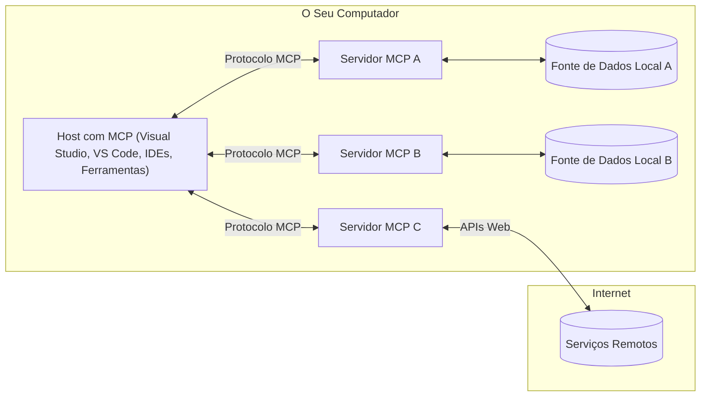

# Conceitos Fundamentais do MCP: Dominando o Protocolo de Contexto do Modelo para Integração de IA

[](https://youtu.be/earDzWGtE84)

_(Clique na imagem acima para ver o vídeo desta lição)_

O [Protocolo de Contexto do Modelo (MCP)](https://github.com/modelcontextprotocol) é uma estrutura poderosa e padronizada que otimiza a comunicação entre Grandes Modelos de Linguagem (LLMs) e ferramentas, aplicações e fontes de dados externas. 
Este guia irá orientá-lo pelos conceitos fundamentais do MCP. Vai aprender sobre a sua arquitetura cliente-servidor, componentes essenciais, mecânicas de comunicação e melhores práticas de implementação.

- **Consentimento Explícito do Utilizador**: Todo o acesso e operações com dados exigem aprovação explícita do utilizador antes da execução. Os utilizadores devem perceber claramente quais os dados a aceder e as ações a executar, com controlo granular sobre permissões e autorizações.

- **Proteção da Privacidade dos Dados**: Os dados do utilizador só são expostos com consentimento explícito e devem ser protegidos por controlos robustos de acesso durante todo o ciclo de vida da interação. As implementações devem impedir a transmissão não autorizada de dados e manter limites estritos de privacidade.

- **Segurança na Execução de Ferramentas**: Cada invocação de ferramenta requer consentimento explícito do utilizador com clara compreensão da funcionalidade, parâmetros e impacto potencial da ferramenta. Barreiras robustas de segurança devem prevenir execuções não intencionais, inseguras ou maliciosas.

- **Segurança na Camada de Transporte**: Todos os canais de comunicação devem utilizar mecanismos adequados de encriptação e autenticação. Conexões remotas devem implementar protocolos seguros de transporte e gestão adequada de credenciais.

#### Diretrizes de Implementação:

- **Gestão de Permissões**: Implementar sistemas de permissões detalhadas que permitam aos utilizadores controlar quais servidores, ferramentas e recursos são acessíveis
- **Autenticação & Autorização**: Usar métodos de autenticação seguros (OAuth, chaves API) com gestão adequada de tokens e expiração  
- **Validação de Entrada**: Validar todos os parâmetros e dados de entrada conforme esquemas definidos para prevenir ataques de injeção
- **Registo de Auditoria**: Manter logs abrangentes de todas as operações para monitorização de segurança e conformidade

## Visão Geral

Esta lição explora a arquitetura fundamental e os componentes que compõem o ecossistema do Protocolo de Contexto do Modelo (MCP). Vai aprender sobre a arquitetura cliente-servidor, os componentes chave e os mecanismos de comunicação que alimentam as interações MCP.

## Objetivos Principais de Aprendizagem

No final desta lição, irá:

- Compreender a arquitetura cliente-servidor do MCP.
- Identificar papéis e responsabilidades dos Hosts, Clientes e Servidores.
- Analisar as características centrais que tornam o MCP uma camada de integração flexível.
- Aprender como a informação flui dentro do ecossistema MCP.
- Obter insights práticos através de exemplos de código em .NET, Java, Python e JavaScript.

## Arquitetura MCP: Um Olhar Mais Profundo

O ecossistema MCP baseia-se num modelo cliente-servidor. Esta estrutura modular permite que aplicações de IA interajam eficazmente com ferramentas, bases de dados, APIs e recursos contextuais. Vamos detalhar esta arquitetura nos seus componentes principais.

Na sua essência, o MCP segue uma arquitetura cliente-servidor onde uma aplicação host pode conectar-se a múltiplos servidores:



- **Hosts MCP**: Programas como VSCode, Claude Desktop, IDEs ou ferramentas de IA que desejam aceder a dados através do MCP
- **Clientes MCP**: Clientes de protocolo que mantêm conexões 1:1 com servidores
- **Servidores MCP**: Programas leves que expõem capacidades específicas através do Protocolo de Contexto do Modelo padronizado
- **Fontes de Dados Locais**: Os ficheiros, bases de dados e serviços do seu computador que os servidores MCP podem aceder de forma segura
- **Serviços Remotos**: Sistemas externos disponíveis pela internet que os servidores MCP podem conectar via APIs.

O Protocolo MCP é um padrão em evolução usando versionamento baseado em datas (formato AAAA-MM-DD). A versão atual do protocolo é **2025-11-25**. Pode ver as atualizações mais recentes na [especificação do protocolo](https://modelcontextprotocol.io/specification/2025-11-25/)

> **Perspetivas futuras:** um candidato a lançamento para a próxima versão da especificação, **2026-07-28**, foi anunciado em maio de 2026 e está previsto para ser lançado a 28 de julho de 2026. Torna o protocolo sem estado na camada de transporte (removendo o aperto de mão `initialize` e IDs de sessão), formaliza um framework de Extensões, e desaprova Roots, Sampling e Logging em favor de novos padrões. Veja [O que está a mudar no MCP: O candidato a lançamento de 2026-07-28](./mcp-2026-07-28-release-candidate.md) para um resumo completo.

### 1. Hosts

No Protocolo de Contexto do Modelo (MCP), **Hosts** são aplicações de IA que funcionam como a interface principal através da qual os utilizadores interagem com o protocolo. Hosts coordenam e gerem conexões a múltiplos servidores MCP criando clientes MCP dedicados para cada conexão ao servidor. Exemplos de Hosts incluem:

- **Aplicações de IA**: Claude Desktop, Visual Studio Code, Claude Code
- **Ambientes de Desenvolvimento**: IDEs e editores de código com integração MCP  
- **Aplicações Personalizadas**: Agentes e ferramentas de IA construídos especificamente

**Hosts** são aplicações que coordenam interações com modelos de IA. Eles:

- **Orquestram Modelos de IA**: Executam ou interagem com LLMs para gerar respostas e coordenar fluxos de trabalho de IA
- **Gerem Conexões de Clientes**: Criam e mantêm um cliente MCP por cada conexão a servidor MCP
- **Controlam a Interface de Utilizador**: Lidam com fluxo de conversação, interações de utilizador e apresentação das respostas  
- **Aplicam Segurança**: Controlam permissões, restrições de segurança e autenticação
- **Gerem Consentimento do Utilizador**: Administram aprovação do utilizador para partilha de dados e execução de ferramentas


### 2. Clientes

**Clientes** são componentes essenciais que mantêm conexões dedicadas um-a-um entre Hosts e servidores MCP. Cada cliente MCP é instanciado pelo Host para conectar a um servidor MCP específico, assegurando canais de comunicação organizados e seguros. Vários clientes permitem que Hosts se conectem a múltiplos servidores simultaneamente.

**Clientes** são componentes de ligação dentro da aplicação host. Eles:

- **Comunicação do Protocolo**: Enviam pedidos JSON-RPC 2.0 a servidores com prompts e instruções
- **Negociação de Capacidades**: Negociam funcionalidades suportadas e versões do protocolo com servidores durante a inicialização
- **Execução de Ferramentas**: Gerem pedidos de execução de ferramentas dos modelos e processam respostas
- **Atualizações em Tempo Real**: Lidam com notificações e atualizações em tempo real dos servidores
- **Processamento de Respostas**: Processam e formatam respostas do servidor para apresentação a utilizadores

### 3. Servidores

**Servidores** são programas que fornecem contexto, ferramentas e capacidades aos clientes MCP. Podem executar localmente (na mesma máquina do Host) ou remotamente (em plataformas externas), e são responsáveis por tratar pedidos de clientes e fornecer respostas estruturadas. Servidores expõem funcionalidades específicas através do Protocolo de Contexto do Modelo padronizado.

**Servidores** são serviços que fornecem contexto e capacidades. Eles:

- **Registo de Funcionalidades**: Registam e expõem primitivas disponíveis (recursos, prompts, ferramentas) aos clientes
- **Processamento de Pedidos**: Recebem e executam chamadas de ferramentas, pedidos de recursos e de prompts dos clientes
- **Fornecimento de Contexto**: Proporcionam informação contextual e dados para melhorar respostas do modelo
- **Gestão de Estado**: Mantêm estado da sessão e tratam interações com estado quando necessário
- **Notificações em Tempo Real**: Enviam notificações sobre alterações de capacidades e atualizações para clientes ligados

Servidores podem ser desenvolvidos por qualquer pessoa para estender capacidades do modelo com funcionalidades especializadas, suportando cenários de implantação local e remota.

### 4. Primitivas do Servidor

Servidores no Protocolo de Contexto do Modelo (MCP) fornecem três **primitivas** principais que definem os blocos fundamentais para interações ricas entre clientes, hosts e modelos de linguagem. Estas primitivas especificam os tipos de informação contextual e ações disponíveis através do protocolo.

Os servidores MCP podem expor qualquer combinação das seguintes três primitivas principais:

#### Recursos 

**Recursos** são fontes de dados que fornecem informação contextual para aplicações de IA. Representam conteúdos estáticos ou dinâmicos que podem melhorar a compreensão e decisão do modelo:

- **Dados Contextuais**: Informação estruturada e contexto para consumo do modelo de IA
- **Bases de Conhecimento**: Repositórios de documentos, artigos, manuais e artigos de pesquisa
- **Fontes de Dados Locais**: Ficheiros, bases de dados e informação do sistema local  
- **Dados Externos**: Respostas de API, serviços web e dados de sistemas remotos
- **Conteúdo Dinâmico**: Dados em tempo real que atualizam consoante condições externas

Recursos são identificados por URIs e suportam descoberta através dos métodos `resources/list` e recuperação via `resources/read`:

```text
file://documents/project-spec.md
database://production/users/schema
api://weather/current
```

#### Prompts

**Prompts** são templates reutilizáveis que ajudam a estruturar interações com modelos de linguagem. Fornecem padrões de interação padronizados e fluxos de trabalho templateados:

- **Interações Baseadas em Templates**: Mensagens pré-estruturadas e iniciadores de conversação
- **Templates de Fluxo de Trabalho**: Sequências padronizadas para tarefas e interações comuns
- **Exemplos Few-shot**: Templates baseados em exemplos para instrução do modelo
- **Prompts de Sistema**: Prompts fundamentais que definem comportamento e contexto do modelo
- **Templates Dinâmicos**: Prompts parametrizados que se adaptam a contextos específicos

Prompts suportam substituição de variáveis e podem ser descobertos via `prompts/list` e recuperados com `prompts/get`:

```markdown
Generate a {{task_type}} for {{product}} targeting {{audience}} with the following requirements: {{requirements}}
```

#### Ferramentas

**Ferramentas** são funções executáveis que os modelos de IA podem invocar para realizar ações específicas. Representam os "verbos" do ecossistema MCP, possibilitando que os modelos interajam com sistemas externos:

- **Funções Executáveis**: Operações discretas que os modelos podem invocar com parâmetros específicos
- **Integração com Sistemas Externos**: Chamadas de API, consultas a bases de dados, operações em ficheiros, cálculos
- **Identidade Única**: Cada ferramenta tem um nome distinto, descrição e esquema de parâmetros
- **I/O Estruturado**: Ferramentas aceitam parâmetros validados e retornam respostas estruturadas e tipadas
- **Capacidades de Ação**: Permitem modelos realizarem ações no mundo real e recuperarem dados vivos

Ferramentas são definidas com JSON Schema para validação de parâmetros, descobertas via `tools/list` e executadas via `tools/call`. Ferramentas podem incluir **ícones** como metadados adicionais para melhor apresentação na interface.

**Anotações de Ferramentas**: Ferramentas suportam anotações comportamentais (ex.: `readOnlyHint`, `destructiveHint`) que descrevem se a ferramenta é somente leitura ou destrutiva, ajudando clientes a tomar decisões informadas sobre a execução.

Exemplo de definição de ferramenta:

```typescript
server.tool(
  "search_products", 
  {
    query: z.string().describe("Search query for products"),
    category: z.string().optional().describe("Product category filter"),
    max_results: z.number().default(10).describe("Maximum results to return")
  }, 
  async (params) => {
    // Executar pesquisa e retornar resultados estruturados
    return await productService.search(params);
  }
);
```

## Primitivas do Cliente

No Protocolo de Contexto do Modelo (MCP), **clientes** podem expor primitivas que permitem aos servidores requisitar capacidades adicionais da aplicação host. Estas primitivas do lado cliente permitem implementações de servidor mais ricas e interativas que podem aceder a capacidades do modelo de IA e interações de utilizador.

### Sampling

> **Aviso de depreciação:** o candidato a lançamento `2026-07-28` marca o Sampling como obsoleto em favor da integração direta com APIs de provedores de LLM. Continua a funcionar na versão `2025-11-25` e pelo menos um ano após qualquer depreciação, mas novos projetos devem preferir o padrão substituto. Veja [O que está a mudar no MCP: O candidato a lançamento de 2026-07-28](./mcp-2026-07-28-release-candidate.md).

O **Sampling** permite que servidores solicitem conclusões de modelo de linguagem da aplicação IA do cliente. Esta primitiva permite aos servidores aceder a capacidades LLM sem embutir as suas próprias dependências de modelo:

- **Acesso Independente do Modelo**: Servidores podem requisitar conclusões sem incluir SDKs LLM ou gerir o acesso ao modelo
- **IA Iniciada pelo Servidor**: Permite que servidores gerem conteúdo autonomamente usando o modelo IA do cliente
- **Interações Recursivas LLM**: Suporta cenários complexos onde servidores precisam de assistência IA para processamento
- **Geração Dinâmica de Conteúdo**: Permite que servidores criem respostas contextuais usando o modelo do host
- **Suporte a Chamadas de Ferramenta**: Servidores podem incluir parâmetros `tools` e `toolChoice` para permitir que o modelo do cliente invoque ferramentas durante o sampling

O Sampling é iniciado através do método `sampling/complete`, onde servidores enviam pedidos de conclusão para clientes.

### Roots

> **Aviso de depreciação:** o candidato a lançamento `2026-07-28` marca Roots como obsoletos em favor de parâmetros de ferramenta, URIs de recurso ou configuração de servidor. Continua a funcionar na versão `2025-11-25` e pelo menos um ano após qualquer depreciação. Veja [O que está a mudar no MCP: O candidato a lançamento de 2026-07-28](./mcp-2026-07-28-release-candidate.md).

**Roots** fornecem uma forma padronizada para que clientes exponham fronteiras do sistema de ficheiros a servidores, ajudando servidores a entender quais diretórios e ficheiros têm acesso:

- **Fronteiras do Sistema de Ficheiros**: Definem os limites onde servidores podem operar dentro do sistema de ficheiros
- **Controlo de Acesso**: Ajudam os servidores a compreenderem quais diretórios e ficheiros têm permissão para acessar
- **Atualizações Dinâmicas**: Clientes podem notificar servidores quando a lista de roots muda
- **Identificação Baseada em URI**: Roots usam URIs `file://` para identificar diretórios e ficheiros acessíveis

Roots são descobertos através do método `roots/list`, com clientes enviando `notifications/roots/list_changed` quando os roots mudam.

### Elicitação  

**Elicitação** permite que servidores solicitem informação adicional ou confirmação de utilizadores através da interface do cliente:

- **Pedidos de Entrada do Utilizador**: Servidores podem pedir informação adicional quando necessário para execução de ferramentas
- **Diálogos de Confirmação**: Pedem aprovação do utilizador para operações sensíveis ou impactantes
- **Fluxos de Trabalho Interativos**: Permitem servidores criarem interações passo a passo com o utilizador
- **Coleta Dinâmica de Parâmetros**: Recolhem parâmetros em falta ou opcionais durante a execução da ferramenta

Pedidos de elicitação são feitos usando o método `elicitation/request` para recolher entradas do utilizador através da interface do cliente.

**Modo URL de Elicitação**: Servidores podem também solicitar interações com base em URL, permitindo direcionar utilizadores para páginas web externas para autenticação, confirmação ou inserção de dados.

### Registo


> **Aviso de descontinuação:** o candidato a lançamento `2026-07-28` marca o Logging como obsoleto em favor do `stderr` para transportes stdio e OpenTelemetry para observabilidade estruturada. Continua a funcionar em `2025-11-25` e durante pelo menos um ano após qualquer descontinuação. Veja [O que está a mudar no MCP: O Candidato a Lançamento 2026-07-28](./mcp-2026-07-28-release-candidate.md).

**Logging** permite que servidores enviem mensagens de registo estruturadas para clientes para depuração, monitorização e visibilidade operacional:

- **Suporte à Depuração**: Permitir que os servidores forneçam registos detalhados de execução para resolução de problemas
- **Monitorização Operacional**: Enviar atualizações de estado e métricas de desempenho para os clientes
- **Relato de Erros**: Fornecer contexto detalhado de erro e informações de diagnóstico
- **Traços de Auditoria**: Criar registos abrangentes das operações e decisões do servidor

As mensagens de logging são enviadas aos clientes para fornecer transparência nas operações do servidor e facilitar a depuração.

## Fluxo de Informação no MCP

O Protocolo de Contexto de Modelo (MCP) define um fluxo estruturado de informação entre hosts, clientes, servidores e modelos. Compreender este fluxo ajuda a clarificar como os pedidos dos utilizadores são processados e como ferramentas externas e dados são integrados nas respostas do modelo.

- **O Host Inicia a Conexão**  
  A aplicação anfitriã (como um IDE ou interface de chat) estabelece uma conexão a um servidor MCP, normalmente via STDIO, WebSocket ou outro transporte suportado.

- **Negociação de Capacidades**  
  O cliente (incorporado no host) e o servidor trocam informações sobre as suas funcionalidades, ferramentas, recursos e versões do protocolo suportadas. Isto assegura que ambos os lados compreendem as capacidades disponíveis para a sessão.

- **Pedido do Utilizador**  
  O utilizador interage com o host (por exemplo, insere um prompt ou comando). O host recolhe esta entrada e passa-a para o cliente para processamento.

- **Uso de Recurso ou Ferramenta**  
  - O cliente pode solicitar contexto ou recursos adicionais ao servidor (como ficheiros, entradas de base de dados ou artigos da base de conhecimento) para enriquecer a compreensão do modelo.
  - Se o modelo determinar que uma ferramenta é necessária (por exemplo, para obter dados, realizar um cálculo ou chamar uma API), o cliente envia um pedido de invocação da ferramenta ao servidor, especificando o nome da ferramenta e os parâmetros.

- **Execução do Servidor**  
  O servidor recebe o pedido de recurso ou ferramenta, executa as operações necessárias (como executar uma função, consultar uma base de dados ou recuperar um ficheiro) e devolve os resultados ao cliente num formato estruturado.

- **Geração da Resposta**  
  O cliente integra as respostas do servidor (dados do recurso, saídas das ferramentas, etc.) na interação em curso com o modelo. O modelo usa esta informação para gerar uma resposta abrangente e contextualizada.

- **Apresentação do Resultado**  
  O host recebe a saída final do cliente e apresenta-a ao utilizador, frequentemente incluindo tanto o texto gerado pelo modelo como quaisquer resultados da execução das ferramentas ou pesquisas de recursos.

Este fluxo permite que o MCP suporte aplicações de IA avançadas, interativas e conscientes do contexto, ligando perfeitamente modelos a ferramentas externas e fontes de dados.

## Arquitetura e Camadas do Protocolo

O MCP consiste em duas camadas arquitetónicas distintas que trabalham em conjunto para fornecer uma estrutura completa de comunicação:

### Camada de Dados

A **Camada de Dados** implementa o núcleo do protocolo MCP usando **JSON-RPC 2.0** como base. Esta camada define a estrutura das mensagens, a semântica e os padrões de interação:

#### Componentes Principais:

- **Protocolo JSON-RPC 2.0**: Toda a comunicação utiliza formato de mensagens padronizado JSON-RPC 2.0 para chamadas de método, respostas e notificações
- **Gestão do Ciclo de Vida**: Gere a inicialização da conexão, negociação de capacidades e término da sessão entre clientes e servidores
- **Primitivas do Servidor**: Permite que os servidores forneçam funcionalidades básicas através de ferramentas, recursos e prompts
- **Primitivas do Cliente**: Permite que os servidores solicitem amostragem de LLMs, obtenção de entrada do utilizador e envio de mensagens de log
- **Notificações em Tempo Real**: Suporta notificações assíncronas para atualizações dinâmicas sem necessidade de polling

#### Funcionalidades-Chave:

- **Negociação de Versão do Protocolo**: Usa versionamento baseado em data (AAAA-MM-DD) para garantir compatibilidade
- **Descoberta de Capacidades**: Clientes e servidores trocam informações sobre funcionalidades suportadas durante a inicialização
- **Sessões com Estado**: Mantém o estado da conexão através de várias interações para continuidade do contexto

### Camada de Transporte

A **Camada de Transporte** gere canais de comunicação, enquadramento de mensagens e autenticação entre os participantes MCP:

#### Mecanismos de Transporte Suportados:

1. **Transporte STDIO**:
   - Usa fluxos de entrada/saída standard para comunicação direta entre processos
   - Óptimo para processos locais na mesma máquina sem sobrecarga de rede
   - Comumente utilizado em implementações locais de servidores MCP

2. **Transporte HTTP Transmissível**:
   - Usa HTTP POST para mensagens do cliente para o servidor  
   - Eventos enviados pelo servidor (SSE) opcionais para streaming do servidor para o cliente
   - Permite comunicação remota entre servidores através de redes
   - Suporta autenticação HTTP padrão (tokens bearer, chaves API, cabeçalhos personalizados)
   - O MCP recomenda OAuth para autenticação segura baseada em tokens

#### Abstração do Transporte:

A camada de transporte abstrai os detalhes da comunicação da camada de dados, permitindo o mesmo formato de mensagem JSON-RPC 2.0 em todos os mecanismos de transporte. Esta abstração permite que as aplicações alternem facilmente entre servidores locais e remotos.

### Considerações de Segurança

As implementações MCP devem cumprir vários princípios críticos de segurança para garantir interações seguras, confiáveis e protegidas em todas as operações do protocolo:

- **Consentimento e Controlo do Utilizador**: Os utilizadores devem fornecer consentimento explícito antes que quaisquer dados sejam acedidos ou operações executadas. Devem ter controlo claro sobre quais dados são partilhados e quais ações estão autorizadas, apoiados por interfaces intuitivas para revisão e aprovação das atividades.

- **Privacidade dos Dados**: Os dados dos utilizadores só devem ser expostos com consentimento explícito e devem ser protegidos por controlos de acesso apropriados. As implementações MCP devem salvaguardar contra transmissão não autorizada de dados e assegurar que a privacidade é mantida em todas as interações.

- **Segurança das Ferramentas**: Antes de invocar qualquer ferramenta, é necessário consentimento explícito do utilizador. Os utilizadores devem ter uma compreensão clara da funcionalidade de cada ferramenta, e devem ser aplicados limites de segurança robustos para prevenir execuções de ferramentas não intencionadas ou inseguras.

Seguindo estes princípios de segurança, o MCP assegura que a confiança, privacidade e segurança do utilizador são mantidas em todas as interações do protocolo, permitindo integrações poderosas de IA.

## Exemplos de Código: Componentes-Chave

A seguir estão exemplos de código em várias linguagens populares que ilustram como implementar componentes-chave e ferramentas de servidores MCP.

### Exemplo .NET: Criar um Servidor MCP Simples com Ferramentas

Aqui está um exemplo prático em .NET que demonstra como implementar um servidor MCP simples com ferramentas personalizadas. Este exemplo mostra como definir e registar ferramentas, tratar pedidos e ligar o servidor usando o Protocolo de Contexto de Modelo.

```csharp
using System;
using System.Threading.Tasks;
using ModelContextProtocol.Server;
using ModelContextProtocol.Server.Transport;
using ModelContextProtocol.Server.Tools;

public class WeatherServer
{
    public static async Task Main(string[] args)
    {
        // Create an MCP server
        var server = new McpServer(
            name: "Weather MCP Server",
            version: "1.0.0"
        );
        
        // Register our custom weather tool
        server.AddTool<string, WeatherData>("weatherTool", 
            description: "Gets current weather for a location",
            execute: async (location) => {
                // Call weather API (simplified)
                var weatherData = await GetWeatherDataAsync(location);
                return weatherData;
            });
        
        // Connect the server using stdio transport
        var transport = new StdioServerTransport();
        await server.ConnectAsync(transport);
        
        Console.WriteLine("Weather MCP Server started");
        
        // Keep the server running until process is terminated
        await Task.Delay(-1);
    }
    
    private static async Task<WeatherData> GetWeatherDataAsync(string location)
    {
        // This would normally call a weather API
        // Simplified for demonstration
        await Task.Delay(100); // Simulate API call
        return new WeatherData { 
            Temperature = 72.5,
            Conditions = "Sunny",
            Location = location
        };
    }
}

public class WeatherData
{
    public double Temperature { get; set; }
    public string Conditions { get; set; }
    public string Location { get; set; }
}
```

### Exemplo Java: Componentes de Servidor MCP

Este exemplo demonstra o mesmo servidor MCP e registo de ferramentas que o exemplo .NET acima, mas implementado em Java.

```java
import io.modelcontextprotocol.server.McpServer;
import io.modelcontextprotocol.server.McpToolDefinition;
import io.modelcontextprotocol.server.transport.StdioServerTransport;
import io.modelcontextprotocol.server.tool.ToolExecutionContext;
import io.modelcontextprotocol.server.tool.ToolResponse;

public class WeatherMcpServer {
    public static void main(String[] args) throws Exception {
        // Criar um servidor MCP
        McpServer server = McpServer.builder()
            .name("Weather MCP Server")
            .version("1.0.0")
            .build();
            
        // Registar uma ferramenta de meteorologia
        server.registerTool(McpToolDefinition.builder("weatherTool")
            .description("Gets current weather for a location")
            .parameter("location", String.class)
            .execute((ToolExecutionContext ctx) -> {
                String location = ctx.getParameter("location", String.class);
                
                // Obter dados meteorológicos (simplificado)
                WeatherData data = getWeatherData(location);
                
                // Retornar resposta formatada
                return ToolResponse.content(
                    String.format("Temperature: %.1f°F, Conditions: %s, Location: %s", 
                    data.getTemperature(), 
                    data.getConditions(), 
                    data.getLocation())
                );
            })
            .build());
        
        // Ligar o servidor usando transporte stdio
        try (StdioServerTransport transport = new StdioServerTransport()) {
            server.connect(transport);
            System.out.println("Weather MCP Server started");
            // Manter o servidor a funcionar até o processo ser terminado
            Thread.currentThread().join();
        }
    }
    
    private static WeatherData getWeatherData(String location) {
        // A implementação chamaria uma API meteorológica
        // Simplificado para efeitos de exemplo
        return new WeatherData(72.5, "Sunny", location);
    }
}

class WeatherData {
    private double temperature;
    private String conditions;
    private String location;
    
    public WeatherData(double temperature, String conditions, String location) {
        this.temperature = temperature;
        this.conditions = conditions;
        this.location = location;
    }
    
    public double getTemperature() {
        return temperature;
    }
    
    public String getConditions() {
        return conditions;
    }
    
    public String getLocation() {
        return location;
    }
}
```

### Exemplo Python: Construir um Servidor MCP

Este exemplo usa fastmcp, por isso assegure-se de o instalar primeiro:

```python
pip install fastmcp
```
Exemplo de Código:

```python
#!/usr/bin/env python3
import asyncio
from fastmcp import FastMCP
from fastmcp.transports.stdio import serve_stdio

# Criar um servidor FastMCP
mcp = FastMCP(
    name="Weather MCP Server",
    version="1.0.0"
)

@mcp.tool()
def get_weather(location: str) -> dict:
    """Gets current weather for a location."""
    return {
        "temperature": 72.5,
        "conditions": "Sunny",
        "location": location
    }

# Abordagem alternativa usando uma classe
class WeatherTools:
    @mcp.tool()
    def forecast(self, location: str, days: int = 1) -> dict:
        """Gets weather forecast for a location for the specified number of days."""
        return {
            "location": location,
            "forecast": [
                {"day": i+1, "temperature": 70 + i, "conditions": "Partly Cloudy"}
                for i in range(days)
            ]
        }

# Registar ferramentas da classe
weather_tools = WeatherTools()

# Iniciar o servidor
if __name__ == "__main__":
    asyncio.run(serve_stdio(mcp))
```

### Exemplo JavaScript: Criar um Servidor MCP

Este exemplo mostra a criação de um servidor MCP em JavaScript e como registar duas ferramentas relacionadas com o tempo.

```javascript
// A utilizar o SDK oficial do Modelo Contextual Protocolo
import { McpServer } from "@modelcontextprotocol/sdk/server/mcp.js";
import { StdioServerTransport } from "@modelcontextprotocol/sdk/server/stdio.js";
import { z } from "zod"; // Para validação de parâmetros

// Criar um servidor MCP
const server = new McpServer({
  name: "Weather MCP Server",
  version: "1.0.0"
});

// Definir uma ferramenta de meteorologia
server.tool(
  "weatherTool",
  {
    location: z.string().describe("The location to get weather for")
  },
  async ({ location }) => {
    // Normalmente isto iria chamar uma API de meteorologia
    // Simplificado para demonstração
    const weatherData = await getWeatherData(location);
    
    return {
      content: [
        { 
          type: "text", 
          text: `Temperature: ${weatherData.temperature}°F, Conditions: ${weatherData.conditions}, Location: ${weatherData.location}` 
        }
      ]
    };
  }
);

// Definir uma ferramenta de previsão
server.tool(
  "forecastTool",
  {
    location: z.string(),
    days: z.number().default(3).describe("Number of days for forecast")
  },
  async ({ location, days }) => {
    // Normalmente isto iria chamar uma API de meteorologia
    // Simplificado para demonstração
    const forecast = await getForecastData(location, days);
    
    return {
      content: [
        { 
          type: "text", 
          text: `${days}-day forecast for ${location}: ${JSON.stringify(forecast)}` 
        }
      ]
    };
  }
);

// Funções auxiliares
async function getWeatherData(location) {
  // Simular chamada API
  return {
    temperature: 72.5,
    conditions: "Sunny",
    location: location
  };
}

async function getForecastData(location, days) {
  // Simular chamada API
  return Array.from({ length: days }, (_, i) => ({
    day: i + 1,
    temperature: 70 + Math.floor(Math.random() * 10),
    conditions: i % 2 === 0 ? "Sunny" : "Partly Cloudy"
  }));
}

// Ligar o servidor usando transporte stdio
const transport = new StdioServerTransport();
server.connect(transport).catch(console.error);

console.log("Weather MCP Server started");
```

Este exemplo em JavaScript demonstra como criar um servidor MCP usando o SDK do Protocolo de Contexto de Modelo. Mostra como registar duas ferramentas chamadas `weatherTool` e `forecastTool` e torná-las disponíveis para clientes MCP através do `StdioServerTransport`.

## Segurança e Autorização

O MCP inclui vários conceitos e mecanismos incorporados para gerir segurança e autorização em todo o protocolo:

1. **Controlo de Permissões para Ferramentas**:  
  Os clientes podem especificar quais ferramentas um modelo está autorizado a usar durante a sessão. Isto garante que apenas ferramentas explicitamente autorizadas são acessíveis, reduzindo o risco de operações não intencionadas ou inseguras. As permissões podem ser configuradas dinamicamente com base nas preferências do utilizador, políticas organizacionais ou contexto da interação.

2. **Autenticação**:  
  Os servidores podem exigir autenticação antes de conceder acesso a ferramentas, recursos ou operações sensíveis. Isso pode envolver chaves API, tokens OAuth ou outros esquemas de autenticação. A autenticação adequada assegura que apenas clientes e utilizadores confiáveis podem invocar funcionalidades do lado do servidor.

3. **Validação**:  
  A validação de parâmetros é aplicada para todas as invocações de ferramentas. Cada ferramenta define os tipos esperados, formatos e restrições dos seus parâmetros, e o servidor valida os pedidos recebidos de acordo. Isto previne que entradas malformadas ou maliciosas alcancem as implementações das ferramentas e ajuda a manter a integridade das operações.

4. **Limitação de Taxa**:  
  Para prevenir abusos e assegurar uso justo dos recursos do servidor, os servidores MCP podem implementar limitação de taxa para chamadas de ferramentas e acesso a recursos. Os limites podem ser aplicados por utilizador, por sessão ou globalmente, ajudando a proteger contra ataques de negação de serviço ou consumo excessivo de recursos.

Combinando estes mecanismos, o MCP oferece uma base segura para integrar modelos de linguagem com ferramentas externas e fontes de dados, ao mesmo tempo que oferece aos utilizadores e desenvolvedores controlo granular sobre acesso e uso.

## Mensagens do Protocolo e Fluxo de Comunicação

A comunicação MCP usa mensagens estruturadas **JSON-RPC 2.0** para facilitar interações claras e fiáveis entre hosts, clientes e servidores. O protocolo define padrões específicos de mensagens para diferentes tipos de operações:

### Tipos Principais de Mensagens:

#### **Mensagens de Inicialização**
- **Pedido `initialize`**: Estabelece conexão e negocia versão do protocolo e capacidades
- **Resposta `initialize`**: Confirma funcionalidades suportadas e informações do servidor  
- **`notifications/initialized`**: Sinaliza que a inicialização está completa e a sessão pronta

#### **Mensagens de Descoberta**
- **Pedido `tools/list`**: Descobre ferramentas disponíveis no servidor
- **Pedido `resources/list`**: Lista recursos disponíveis (fontes de dados)
- **Pedido `prompts/list`**: Obtém templates de prompts disponíveis

#### **Mensagens de Execução**  
- **Pedido `tools/call`**: Executa uma ferramenta específica com parâmetros fornecidos
- **Pedido `resources/read`**: Obtém conteúdo de um recurso específico
- **Pedido `prompts/get`**: Busca um template de prompt com parâmetros opcionais

#### **Mensagens do Lado do Cliente**
- **Pedido `sampling/complete`**: Servidor requisita completamento LLM ao cliente
- **`elicitation/request`**: Servidor pede entrada ao utilizador via interface do cliente
- **Mensagens de Logging**: Servidor envia mensagens de log estruturadas ao cliente

#### **Mensagens de Notificação**
- **`notifications/tools/list_changed`**: Servidor notifica cliente sobre alterações nas ferramentas
- **`notifications/resources/list_changed`**: Servidor notifica cliente sobre alterações nos recursos  
- **`notifications/prompts/list_changed`**: Servidor notifica cliente sobre alterações nos prompts

### Estrutura da Mensagem:

Todas as mensagens MCP seguem o formato JSON-RPC 2.0 com:
- **Mensagens de Pedido**: Incluem `id`, `method` e `params` opcionais
- **Mensagens de Resposta**: Incluem `id` e `result` ou `error`  
- **Mensagens de Notificação**: Incluem `method` e `params` opcionais (sem `id` nem resposta esperada)

Esta comunicação estruturada assegura interações fiáveis, rastreáveis e extensíveis, suportando cenários avançados como atualizações em tempo real, encadeamento de ferramentas e tratamento robusto de erros.

### Tarefas (Experimental)

> **Olhar para o futuro:** o candidato a lançamento `2026-07-28` transfere as Tarefas da especificação experimental do núcleo para uma extensão dedicada de Tarefas com um ciclo de vida redesenhado (`tasks/get`, `tasks/update`, `tasks/cancel`; o `tasks/list` é removido). Se desenvolver com a API experimental descrita abaixo, planeie migrar. Veja [O que está a mudar no MCP: O Candidato a Lançamento 2026-07-28](./mcp-2026-07-28-release-candidate.md).

**Tarefas** são uma funcionalidade experimental que fornece invólucros de execução duráveis permitindo a recuperação diferida de resultados e rastreamento de estado para pedidos MCP:

- **Operações de Longa Duração**: Segue cálculos dispendiosos, automatização de workflows e processamento em lote
- **Resultados Diferidos**: Permite sondagem do estado da tarefa e recuperação dos resultados quando as operações completam
- **Rastreamento de Estado**: Monitora o progresso da tarefa através de estados definidos do ciclo de vida
- **Operações em Vários Passos**: Suporta workflows complexos que abrangem múltiplas interações

As tarefas envolvem pedidos MCP padrão para permitir padrões de execução assíncronos para operações que não podem ser concluídas de imediato.

## Principais Conclusões

- **Arquitetura**: MCP utiliza arquitetura cliente-servidor onde hosts gerem múltiplas conexões de clientes para servidores
- **Participantes**: O ecossistema inclui hosts (aplicações IA), clientes (conectores de protocolo) e servidores (fornecedores de funcionalidades)
- **Mecanismos de Transporte**: A comunicação suporta STDIO (local) e HTTP Transmissível com SSE opcional (remoto)
- **Primitivas do Núcleo**: Servidores expõem ferramentas (funções executáveis), recursos (fontes de dados) e prompts (templates)
- **Primitivas do Cliente**: Servidores podem solicitar amostragem (completamentos LLM com suporte a chamadas de ferramenta), elicitação (entrada do utilizador incluindo modo URL), roots (limites do sistema de ficheiros) e logging dos clientes
- **Funcionalidades Experimentais**: Tarefas fornecem invólucros duráveis para operações de longa duração
- **Fundação do Protocolo**: Construído sobre JSON-RPC 2.0 com versionamento baseado em data (atual: 2025-11-25)
- **Capacidades em Tempo Real**: Suporta notificações para atualizações dinâmicas e sincronização em tempo real
- **Segurança em Primeiro Lugar**: Consentimento explícito do utilizador, proteção da privacidade dos dados e transporte seguro são requisitos essenciais

## Exercício

Conceba uma ferramenta MCP simples que seria útil no seu domínio. Defina:
1. Como se chamaria a ferramenta
2. Que parâmetros aceitaria
3. Que saída retornaria
4. Como um modelo poderia usar esta ferramenta para resolver problemas do utilizador


---

## O que vem a seguir

A seguir: [Capítulo 2: Segurança](../02-Security/README.md)


Curioso sobre o que vem depois de `2025-11-25`? Leia [O Que Está a Mudar no MCP: O Candidato a Lançamento de 2026-07-28](./mcp-2026-07-28-release-candidate.md).

---

<!-- CO-OP TRANSLATOR DISCLAIMER START -->
**Aviso Legal**:
Este documento foi traduzido utilizando o serviço de tradução automática [Co-op Translator](https://github.com/Azure/co-op-translator). Embora nos esforcemos pela precisão, esteja ciente de que traduções automáticas podem conter erros ou imprecisões. O documento original na sua língua nativa deve ser considerado a fonte autorizada. Para informações críticas, recomenda-se tradução profissional humana. Não nos responsabilizamos por quaisquer mal-entendidos ou interpretações incorretas resultantes da utilização desta tradução.
<!-- CO-OP TRANSLATOR DISCLAIMER END -->