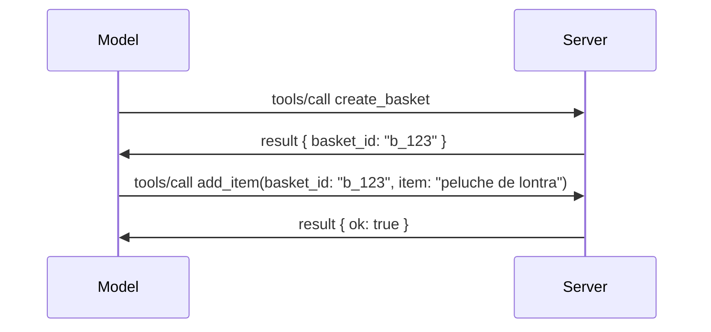

# O que está a mudar no MCP: Release Candidate de 2026-07-28

> **Estado:** Release Candidate. A especificação `2026-07-28` não está finalizada no momento da escrita. Foi anunciada a 21 de maio de 2026 e está planeada para ser lançada a 28 de julho de 2026. Tudo nesta lição descreve o release candidate; consulte a [especificação draft](https://modelcontextprotocol.io/specification/draft) e o seu [changelog](https://modelcontextprotocol.io/specification/draft/changelog) para o estado mais recente antes de desenvolver com base nela. O restante deste currículo está escrito com base no lançamento estável atual, **Especificação MCP 2025-11-25**, e será atualizado após o lançamento do `2026-07-28`.

## Visão Geral

`2026-07-28` é a maior revisão do MCP desde o seu lançamento. Seis Propostas de Melhoria da Especificação (SEPs) removem as sessões a nível de protocolo e tornam o MCP sem estado na camada de transporte, as extensões tornam-se um mecanismo de primeira classe, versionado, e várias funcionalidades que aprendeu anteriormente neste currículo (Roots, Sampling, Logging) são marcadas como descontinuadas sob uma nova política de ciclo de vida. Esta lição resume o que está a mudar, por que é importante e o que significa para o código que já escreveu com base na versão `2025-11-25`.

Fonte: [The 2026-07-28 MCP Specification Release Candidate](https://blog.modelcontextprotocol.io/posts/2026-07-28-release-candidate/) (Blog do Model Context Protocol, David Soria Parra e Den Delimarsky).

## Objetivos de Aprendizagem

No final desta lição, será capaz de:

- Explicar por que o MCP está a mover-se para um núcleo de protocolo sem estado e que problema isso resolve para implementações escaladas horizontalmente.
- Descrever como o handshake `initialize`/`initialized` e o cabeçalho `Mcp-Session-Id` são substituídos.
- Identificar os novos cabeçalhos `Mcp-Method` e `Mcp-Name` e os metadados de cache `ttlMs`/`cacheScope`.
- Reconhecer o framework de Extensões e as duas extensões incluídas com este lançamento: MCP Apps e Tasks.
- Listar as seis SEPs de autorização que reforçam o alinhamento com OAuth 2.0 / OIDC.
- Identificar quais as funcionalidades principais (Roots, Sampling, Logging) que agora estão descontinuadas, e o que isso significa na prática.
- Explicar a mudança para o JSON Schema Completo 2020-12 para as ferramentas `inputSchema`/`outputSchema`.

## Um Protocolo Sem Estado

A mudança principal: o MCP torna-se sem estado na camada de protocolo.

### Antes (2025-11-25): as sessões prendem-no a uma instância de servidor

A chamada a uma ferramenta através de Streamable HTTP começa com um handshake `initialize`. O servidor responde com um cabeçalho `Mcp-Session-Id` que todas as solicitações subsequentes devem conter:

```http
POST /mcp HTTP/1.1
Mcp-Session-Id: 1868a90c-3a3f-4f5b
Content-Type: application/json

{"jsonrpc":"2.0","id":2,"method":"tools/call",
 "params":{"name":"search","arguments":{"q":"otters"}}}
```

Porque a sessão fica fixa à instância do servidor que a emitiu, implementações escaladas horizontalmente precisam de **roteamento persistente** no balanceador de carga e um **armazenamento de sessão partilhado** entre as instâncias.

### Depois (2026-07-28): cada pedido é autónomo

```http
POST /mcp HTTP/1.1
MCP-Protocol-Version: 2026-07-28
Mcp-Method: tools/call
Mcp-Name: search
Content-Type: application/json

{"jsonrpc":"2.0","id":1,"method":"tools/call",
 "params":{"name":"search","arguments":{"q":"otters"},
           "_meta":{"io.modelcontextprotocol/clientInfo":{"name":"my-app","version":"1.0"}}}}
```

Qualquer instância de servidor pode tratar este pedido. Mudanças chave:

- **O handshake `initialize`/`initialized` é removido** ([SEP-2575](https://github.com/modelcontextprotocol/modelcontextprotocol/pull/2575)). A versão do protocolo, informações do cliente e capacidades do cliente mudam para `_meta` em cada pedido. Um novo método `server/discover` permite que o cliente obtenha capacidades do servidor antecipadamente quando necessário.
- **O cabeçalho `Mcp-Session-Id` e a sessão a nível de protocolo são removidos** ([SEP-2567](https://github.com/modelcontextprotocol/modelcontextprotocol/pull/2567)). Roteamento persistente e armazenamento de sessões partilhado não são mais necessários na camada de protocolo.

### Protocolo sem estado, aplicações com estado

Remover a sessão a nível de protocolo não significa que o seu servidor não possa ter estado. O padrão recomendado é o mesmo que APIs HTTP sempre utilizaram: criar um identificador explícito (um `basket_id`, um `browser_id`) numa chamada de ferramenta e deixar que o modelo passe esse identificador como um argumento comum em chamadas posteriores.



Isto torna o estado visível e razoável para o modelo em vez de o esconder em metadados de transporte, e permite que qualquer instância de servidor trate qualquer chamada.

### Pedidos do servidor para o cliente, reestruturados

Um protocolo sem estado ainda necessita de uma forma para o servidor pedir algo ao cliente durante a execução de uma chamada (por exemplo, um prompt de elicitação):

- **Pedidos iniciados pelo servidor só podem ser emitidos enquanto o servidor está a processar ativamente um pedido do cliente** ([SEP-2260](https://github.com/modelcontextprotocol/modelcontextprotocol/pull/2260)) — anteriormente era uma recomendação, agora é obrigatório. Nunca é pedido ao utilizador algo inesperadamente.
- **Pedidos com múltiplas viagens de ida e volta** ([SEP-2322](https://github.com/modelcontextprotocol/modelcontextprotocol/pull/2322)) substituem a necessidade de manter um stream SSE aberto. Em vez disso, o servidor retorna um `InputRequiredResult`:

  ```json
  {
    "resultType": "inputRequired",
    "inputRequests": {
      "confirm": {
        "type": "elicitation",
        "message": "Delete 3 files?",
        "schema": { "type": "boolean" }
      }
    },
    "requestState": "eyJzdGVwIjoxLCJmaWxlcyI6WyJhIiwiYiIsImMiXX0="
  }
  ```

  O cliente recolhe as respostas e reemite a chamada original com `inputResponses` mais o `requestState` ecoado. Qualquer instância de servidor pode realizar a repetição porque tudo o que é necessário está no payload.

### Roteável, cacheável, rastreável

Três pequenas mudanças tornam o tráfego sem estado mais fácil de operar:

- **Os cabeçalhos `Mcp-Method` e `Mcp-Name` são obrigatórios no Streamable HTTP** ([SEP-2243](https://github.com/modelcontextprotocol/modelcontextprotocol/pull/2243)), para que balanceadores de carga, gateways e limitadores de taxa possam fazer o roteamento pela operação sem inspecionar o corpo JSON. Os servidores rejeitam pedidos com desacordo entre cabeçalhos e corpo.
- **`tools/list` e os resultados de leitura de recurso transportam `ttlMs` e `cacheScope`** ([SEP-2549](https://github.com/modelcontextprotocol/modelcontextprotocol/pull/2549)), modelado no HTTP `Cache-Control`. Os clientes sabem durante quanto tempo um resultado de lista é fresco e se é seguro partilhá-lo entre utilizadores, sem precisar de manter um stream SSE de longa duração para saber sobre alterações.
- **A propagação do W3C Trace Context em `_meta` está documentada** ([SEP-414](https://github.com/modelcontextprotocol/modelcontextprotocol/pull/414)), corrigindo os nomes das chaves `traceparent`, `tracestate` e `baggage` para que um traço distribuído possa seguir uma chamada através do SDK do cliente, do servidor MCP e de sistemas a jusante num backend compatível com [OpenTelemetry](https://opentelemetry.io/).

## As Extensões Tornam-se de Primeira Classe

As extensões existiam informalmente em `2025-11-25`. [SEP-2133](https://github.com/modelcontextprotocol/modelcontextprotocol/pull/2133) formaliza-as:

- As extensões são identificadas por IDs em formato reverse-DNS.
- Elas são negociadas através de um mapa `extensions` em capacidades do cliente e servidor.
- Vivem em repositórios próprios `ext-*` com mantenedores delegados e versionam independentemente da especificação principal.
- Uma nova faixa de Extensões no processo de SEP dá-lhes um caminho de experimental para oficial.

Este lançamento inclui duas extensões oficiais.

### MCP Apps: interfaces de utilizador renderizadas no servidor

[MCP Apps](https://blog.modelcontextprotocol.io/posts/2026-01-26-mcp-apps/) ([SEP-1865](https://github.com/modelcontextprotocol/modelcontextprotocol/pull/1865)) permite que servidores enviem interfaces HTML interativas que os anfitriões renderizam em iframes sandboxed. As ferramentas declaram os seus modelos de UI antecipadamente para que os anfitriões possam pré-carregar, cachear e rever em termos de segurança antes de qualquer execução. Já abordou os fundamentos disto em [Lição 15: MCP Apps](../03-GettingStarted/15-mcp-apps/README.md) — sob o framework de Extensões, MCP Apps é agora formalmente uma extensão em vez de uma funcionalidade experimental do núcleo.

### Tasks passa a ser uma extensão

Tasks foi lançado como uma funcionalidade experimental do núcleo em `2025-11-25`. O uso em produção revelou uma necessidade de redesenho que faz com que o local certo para isso seja uma extensão: a [extensão Tasks](https://github.com/modelcontextprotocol/modelcontextprotocol/pull/2663) reformula o ciclo de vida em torno do modelo sem estado — um servidor pode responder `tools/call` com um identificador de tarefa, e o cliente conduz a tarefa adiante com `tasks/get`, `tasks/update`, e `tasks/cancel`. A criação de tarefas é dirigida pelo servidor: o cliente anuncia a extensão e o servidor decide quando uma chamada deve ser executada como uma tarefa. `tasks/list` é removida completamente porque não é possível garantir um escopo seguro sem sessões.

> **Nota sobre migração:** se implementou a API experimental `2025-11-25` de Tasks, terá de migrar para o novo ciclo de vida da extensão — não é compatível com versões anteriores.

## Reforço da Autorização

Seis SEPs reforçam a [especificação de autorização](https://modelcontextprotocol.io/specification/draft/basic/authorization) para a alinhar mais estreitamente com implementações reais de OAuth 2.0 / OpenID Connect:

| SEP | Mudança |
|---|---|
| [SEP-2468](https://github.com/modelcontextprotocol/modelcontextprotocol/pull/2468) | Os clientes devem validar o parâmetro `iss` nas respostas de autorização segundo o [RFC 9207](https://www.rfc-editor.org/rfc/rfc9207), mitigando ataques de mix-up comuns no padrão de MCP de cliente único e múltiplos servidores. Uma versão futura vai exigir rejeitar respostas sem `iss`. |
| [SEP-837](https://github.com/modelcontextprotocol/modelcontextprotocol/pull/837) | Os clientes declaram o seu `application_type` OpenID Connect durante o Registo Dinâmico de Clientes, evitando que servidores de autorização assumam um cliente desktop/CLI como `"web"` e rejeitem o seu URI de redirecionamento localhost. |
| [SEP-2352](https://github.com/modelcontextprotocol/modelcontextprotocol/pull/2352) | Os clientes vinculam as credenciais registadas ao `issuer` do servidor de autorização emissor e voltam a registar quando um recurso migra entre servidores de autorização. |
| [SEP-2207](https://github.com/modelcontextprotocol/modelcontextprotocol/pull/2207) | Documenta como solicitar tokens de atualização a servidores de autorização do tipo OpenID Connect. |
| [SEP-2350](https://github.com/modelcontextprotocol/modelcontextprotocol/pull/2350) | Esclarece a acumulação de escopos durante a autorização em escalão superior. |
| [SEP-2351](https://github.com/modelcontextprotocol/modelcontextprotocol/pull/2351) | Esclarece o sufixo `.well-known` para descoberta. |

Se está a construir um servidor de autorização para MCP atualmente, comece já a fornecer `iss` nas respostas de autorização — veja [02-Security](../02-Security/README.md) para as orientações atuais de autorização em que isto se baseará.

## Roots, Sampling, e Logging Estão Descontinuados

Sob a nova [política de ciclo de vida de funcionalidades](https://github.com/modelcontextprotocol/modelcontextprotocol/pull/2577) ([SEP-2577](https://github.com/modelcontextprotocol/modelcontextprotocol/pull/2577)), três primitivas principais do cliente que aprendeu em [Conceitos Básicos](./README.md#roots) passaram para o estado de **Descontinuado**:

| Funcionalidade | Substituição recomendada |
|---|---|
| Roots | Parâmetros da ferramenta, URIs de recursos, ou configuração do servidor |
| Sampling | Integração direta com APIs de fornecedores de LLM |
| Logging | `stderr` para transportes stdio; OpenTelemetry para observabilidade estruturada |

Estas são **desativações apenas por anotação**: os métodos, tipos e flags de capacidade continuam a funcionar nesta versão e em todas as versões da especificação publicadas dentro de um ano. A remoção total de qualquer deles exigirá um SEP separado sob a política de ciclo de vida — portanto nada falha nos seus exemplos atuais de [Sampling](../03-GettingStarted/14-sampling/README.md) hoje, mas novos servidores devem preferir os padrões de substituição acima.

## JSON Schema Completo 2020-12 para Ferramentas

Os `inputSchema` e `outputSchema` das ferramentas passam a ser o [JSON Schema 2020-12 completo](https://json-schema.org/draft/2020-12) ([SEP-2106](https://github.com/modelcontextprotocol/modelcontextprotocol/pull/2106)):

- Os esquemas de entrada mantêm a restrição root `type: "object"` mas agora permitem composição (`oneOf`, `anyOf`, `allOf`), condicionais e referências (`$ref`, `$defs`).
- Os esquemas de saída são irrestritos, e `structuredContent` pode agora ser qualquer valor JSON em vez de apenas um objeto.
- As implementações não devem auto-dereferenciar URIs externas em `$ref` e devem limitar a profundidade do esquema e o tempo de validação (uma consideração de negação de serviço a ter em conta se validar esquemas no servidor).

Separadamente, o código de erro para recurso em falta muda do código personalizado MCP `-32002` para o padrão JSON-RPC `-32602` (Parâmetros Inválidos) ([SEP-2164](https://github.com/modelcontextprotocol/modelcontextprotocol/pull/2164)). Se o seu cliente corresponde ao valor literal `-32002`, terá de o atualizar.

## Como o Protocolo Evolui a Partir daqui

Este lançamento contém mudanças incompatíveis, que os mantenedores do MCP não pretendem que sejam norma daqui em diante. Três SEPs de governança pretendem evitar uma repetição:

- A **política de ciclo de vida de funcionalidades** dá a cada funcionalidade um caminho Ativo → Descontinuado → Removido com pelo menos doze meses entre descontinuação e possível remoção.
- O **framework de Extensões** permite que novas capacidades sejam lançadas como extensões opcionalmente ativadas e se estabilizem aí antes de (se algum dia) migrarem para a especificação principal.

- Um SEP de Track de Standards já não pode alcançar o estado Final até que um cenário correspondente seja incluído no [conformance suite](https://github.com/modelcontextprotocol/conformance) ([SEP-2484](https://github.com/modelcontextprotocol/modelcontextprotocol/pull/2484)) — o mesmo conjunto onde o [sistema de tiers SDK](https://github.com/modelcontextprotocol/modelcontextprotocol/pull/1777) avalia os SDKs oficiais.

## Cronograma de Lançamento e Validação

- O candidato a lançamento foi bloqueado a 21 de maio de 2026.
- A especificação final está prevista para 28 de julho de 2026.
- A janela de dez semanas entre os dois permite aos mantenedores do SDK e implementadores de clientes validar as mudanças contra cargas de trabalho reais; espera-se que os SDKs Tier 1 entreguem suporte dentro desta janela sob o [sistema de tiers SDK](https://modelcontextprotocol.io/docs/sdk).
- Acompanhe o conjunto completo de alterações na [especificação draft](https://modelcontextprotocol.io/specification/draft) e no seu [registo de alterações](https://modelcontextprotocol.io/specification/draft/changelog).

## O Que Isto Significa para Este Currículo

Tudo o que aprendeu até agora neste curso tem como alvo **2025-11-25**, que permanece como a especificação estável atual até que o `2026-07-28` seja lançado. Concretamente:

- **Sessões e a handshake `initialize`** (cobertos em [Conceitos Fundamentais](./README.md) e [Lição 6: Streaming HTTP](../03-GettingStarted/06-http-streaming/README.md)) ainda funcionam como documentado hoje, mas espere que sejam substituídos pelo modelo de pedido sem estado acima assim que atualizar para SDKs compatíveis com o `2026-07-28`.
- **Sampling e Raízes** (também cobertos em [Conceitos Fundamentais](./README.md)) mantêm-se totalmente funcionais mas estão obsoletos — novos designs deverão preferir os padrões de substituição listados acima.
- **A funcionalidade experimental de Tasks**, caso a tenha usado, terá de ser migrada para o novo ciclo de vida da extensão Tasks.
- **Apps MCP** ([Lição 15](../03-GettingStarted/15-mcp-apps/README.md)) não é afetada na prática; simplesmente move-se para o quadro formal de Extensões.

## Recursos Adicionais

- [Candidato a Lançamento da Especificação MCP 2026-07-28 (post de blog)](https://blog.modelcontextprotocol.io/posts/2026-07-28-release-candidate/)
- [O Futuro dos Transportes MCP](https://blog.modelcontextprotocol.io/posts/2025-12-19-mcp-transport-future/)
- [Especificação Draft MCP](https://modelcontextprotocol.io/specification/draft)
- [Registo de Alterações Draft MCP](https://modelcontextprotocol.io/specification/draft/changelog)
- [Diretrizes SEP](https://modelcontextprotocol.io/community/sep-guidelines)
- [Sistema de Tiers do SDK MCP](https://modelcontextprotocol.io/docs/sdk)

## Próximos Passos

Volte a [Conceitos Fundamentais](./README.md) ou continue para [Segurança](../02-Security/README.md) para ver como a orientação atual `2025-11-25` se relaciona com o que está por vir.

---

<!-- CO-OP TRANSLATOR DISCLAIMER START -->
**Aviso Legal**:
Este documento foi traduzido utilizando o serviço de tradução automática [Co-op Translator](https://github.com/Azure/co-op-translator). Embora nos esforcemos pela precisão, esteja ciente de que traduções automáticas podem conter erros ou imprecisões. O documento original na sua língua nativa deve ser considerado a fonte autorizada. Para informações críticas, recomenda-se tradução profissional humana. Não nos responsabilizamos por quaisquer mal-entendidos ou interpretações incorretas resultantes da utilização desta tradução.
<!-- CO-OP TRANSLATOR DISCLAIMER END -->