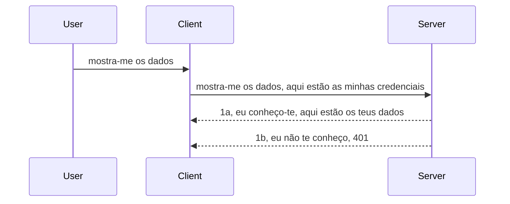

# Autenticação simples

Os SDKs MCP suportam o uso do OAuth 2.1 que, a ser justo, é um processo bastante complexo envolvendo conceitos como servidor de autenticação, servidor de recursos, envio de credenciais, obtenção de um código, troca do código por um token bearer até finalmente conseguir obter os dados do recurso. Se não está habituado ao OAuth, que é uma ótima coisa para implementar, é uma boa ideia começar com algum nível básico de autenticação e construir a partir daí uma segurança cada vez melhor. É por isso que este capítulo existe, para o preparar para autenticação mais avançada.

## Autenticação, o que queremos dizer?

Autenticação é a abreviação de autenticação e autorização. A ideia é que precisamos fazer duas coisas:

- **Autenticação**, que é o processo de perceber se deixamos uma pessoa entrar na nossa casa, que tem o direito de estar "aqui", ou seja, ter acesso ao nosso servidor de recursos onde vivem as funcionalidades do nosso Serviço MCP.
- **Autorização**, que é o processo de verificar se um utilizador deve ter acesso a estes recursos específicos que solicita, por exemplo estas encomendas ou estes produtos, ou se apenas tem permissão para ler o conteúdo mas não para apagar, como outro exemplo.

## Credenciais: como dizemos ao sistema quem somos

Bem, a maioria dos programadores web começa a pensar em termos de fornecer uma credencial ao servidor, normalmente um segredo que diz se têm permissão para aqui estar "Autenticação". Esta credencial é normalmente uma versão codificada em base64 de nome de utilizador e palavra-passe ou uma chave API que identifica unicamente um utilizador específico.

Isto envolve enviá-la através de um cabeçalho chamado "Authorization", assim:

```json
{ "Authorization": "secret123" }
```

Isto é geralmente referido como autenticação básica. O funcionamento geral do fluxo é então da seguinte forma:



Agora que percebemos como funciona do ponto de vista do fluxo, como é que o implementamos? Bem, a maioria dos servidores web tem um conceito chamado middleware, um pedaço de código que corre como parte do pedido que pode verificar as credenciais, e se as credenciais são válidas pode deixar o pedido passar. Se o pedido não tiver credenciais válidas então recebe um erro de autenticação. Vamos ver como isto pode ser implementado:

**Python**

```python
class AuthMiddleware(BaseHTTPMiddleware):
    async def dispatch(self, request, call_next):

        has_header = request.headers.get("Authorization")
        if not has_header:
            print("-> Missing Authorization header!")
            return Response(status_code=401, content="Unauthorized")

        if not valid_token(has_header):
            print("-> Invalid token!")
            return Response(status_code=403, content="Forbidden")

        print("Valid token, proceeding...")
       
        response = await call_next(request)
        # adicione quaisquer cabeçalhos personalizados ou altere a resposta de alguma forma
        return response


starlette_app.add_middleware(CustomHeaderMiddleware)
```

Aqui temos:

- Criado um middleware chamado `AuthMiddleware` onde o seu método `dispatch` é invocado pelo servidor web.
- Adicionado o middleware ao servidor web:

    ```python
    starlette_app.add_middleware(AuthMiddleware)
    ```

- Escrito a lógica de validação que verifica se o cabeçalho Authorization está presente e se o segredo enviado é válido:

    ```python
    has_header = request.headers.get("Authorization")
    if not has_header:
        print("-> Missing Authorization header!")
        return Response(status_code=401, content="Unauthorized")

    if not valid_token(has_header):
        print("-> Invalid token!")
        return Response(status_code=403, content="Forbidden")
    ```

    se o segredo estiver presente e válido então deixamos o pedido passar chamando `call_next` e devolvemos a resposta.

    ```python
    response = await call_next(request)
    # adicione quaisquer cabeçalhos do cliente ou altere a resposta de alguma forma
    return response
    ```

Funciona assim: se houver um pedido web enviado para o servidor, o middleware será invocado e dada a sua implementação, deixa passar o pedido ou acaba por devolver um erro que indica que o cliente não tem permissão para prosseguir.

**TypeScript**

Aqui criamos um middleware com o popular framework Express e interceptamos o pedido antes de chegar ao Servidor MCP. Eis o código para isso:

```typescript
function isValid(secret) {
    return secret === "secret123";
}

app.use((req, res, next) => {
    // 1. Cabeçalho de autorização presente?
    if(!req.headers["Authorization"]) {
        res.status(401).send('Unauthorized');
    }
    
    let token = req.headers["Authorization"];

    // 2. Verificar validade.
    if(!isValid(token)) {
        res.status(403).send('Forbidden');
    }

   
    console.log('Middleware executed');
    // 3. Passa a requisição para a próxima etapa na cadeia de processamento da requisição.
    next();
});
```

Neste código:

1. Verificamos se o cabeçalho Authorization está presente, se não estiver, enviamos um erro 401.
2. Garantimos que a credencial/token é válido, se não for, enviamos um erro 403.
3. Finalmente passa o pedido na pipeline e devolve o recurso solicitado.

## Exercício: Implementar autenticação

Vamos usar o nosso conhecimento e tentar implementá-lo. O plano é o seguinte:

Servidor

- Criar um servidor web e uma instância MCP.
- Implementar um middleware para o servidor.

Cliente

- Enviar pedido web, com credencial, via cabeçalho.

### -1- Criar servidor web e instância MCP

> **A olhar para a frente:** o exemplo TypeScript abaixo rastreia transportes HTTP num mapa `transports` chaveado por `mcp-session-id`, conforme a **Especificação MCP 2025-11-25**. O candidato a versão `2026-07-28` remove o handshake `initialize` e o ID da sessão completamente, pelo que este mapa de transporte por sessão desaparece em favor de pedidos independentes, autónomos. Veja [O que muda no MCP: O candidato a versão 2026-07-28](../../01-CoreConcepts/mcp-2026-07-28-release-candidate.md).

No nosso primeiro passo, precisamos criar a instância do servidor web e do servidor MCP.

**Python**

Aqui criamos uma instância do servidor MCP, criamos uma aplicação web starlette e hospedamo-la com uvicorn.

```python
# a criar servidor MCP

app = FastMCP(
    name="MCP Resource Server",
    instructions="Resource Server that validates tokens via Authorization Server introspection",
    host=settings["host"],
    port=settings["port"],
    debug=True
)

# a criar aplicação web starlette
starlette_app = app.streamable_http_app()

# a servir aplicação via uvicorn
async def run(starlette_app):
    import uvicorn
    config = uvicorn.Config(
            starlette_app,
            host=app.settings.host,
            port=app.settings.port,
            log_level=app.settings.log_level.lower(),
        )
    server = uvicorn.Server(config)
    await server.serve()

run(starlette_app)
```

Neste código:

- Criamos o Servidor MCP.
- Construímos a aplicação web starlette a partir do Servidor MCP, `app.streamable_http_app()`.
- Hospedamos e servimos a aplicação web usando uvicorn `server.serve()`.

**TypeScript**

Aqui criamos uma instância do Servidor MCP.

```typescript
const server = new McpServer({
      name: "example-server",
      version: "1.0.0"
    });

    // ... configurar recursos do servidor, ferramentas e prompts ...
```

Esta criação do Servidor MCP terá de acontecer dentro da nossa definição da rota POST /mcp, por isso vamos pegar no código acima e movê-lo assim:

```typescript
import express from "express";
import { randomUUID } from "node:crypto";
import { McpServer } from "@modelcontextprotocol/sdk/server/mcp.js";
import { StreamableHTTPServerTransport } from "@modelcontextprotocol/sdk/server/streamableHttp.js";
import { isInitializeRequest } from "@modelcontextprotocol/sdk/types.js"

const app = express();
app.use(express.json());

// Mapa para armazenar transportes por ID de sessão
const transports: { [sessionId: string]: StreamableHTTPServerTransport } = {};

// Lidar com pedidos POST para comunicação cliente-servidor
app.post('/mcp', async (req, res) => {
  // Verificar existência do ID de sessão
  const sessionId = req.headers['mcp-session-id'] as string | undefined;
  let transport: StreamableHTTPServerTransport;

  if (sessionId && transports[sessionId]) {
    // Reutilizar transporte existente
    transport = transports[sessionId];
  } else if (!sessionId && isInitializeRequest(req.body)) {
    // Novo pedido de inicialização
    transport = new StreamableHTTPServerTransport({
      sessionIdGenerator: () => randomUUID(),
      onsessioninitialized: (sessionId) => {
        // Armazenar o transporte pelo ID de sessão
        transports[sessionId] = transport;
      },
      // A proteção contra re-binding DNS está desativada por padrão para compatibilidade retroativa. Se estiver a executar este servidor
      // localmente, certifique-se de definir:
      // enableDnsRebindingProtection: true,
      // allowedHosts: ['127.0.0.1'],
    });

    // Limpar transporte quando fechado
    transport.onclose = () => {
      if (transport.sessionId) {
        delete transports[transport.sessionId];
      }
    };
    const server = new McpServer({
      name: "example-server",
      version: "1.0.0"
    });

    // ... configurar recursos, ferramentas e prompts do servidor ...

    // Ligar ao servidor MCP
    await server.connect(transport);
  } else {
    // Pedido inválido
    res.status(400).json({
      jsonrpc: '2.0',
      error: {
        code: -32000,
        message: 'Bad Request: No valid session ID provided',
      },
      id: null,
    });
    return;
  }

  // Lidar com o pedido
  await transport.handleRequest(req, res, req.body);
});

// Handler reutilizável para pedidos GET e DELETE
const handleSessionRequest = async (req: express.Request, res: express.Response) => {
  const sessionId = req.headers['mcp-session-id'] as string | undefined;
  if (!sessionId || !transports[sessionId]) {
    res.status(400).send('Invalid or missing session ID');
    return;
  }
  
  const transport = transports[sessionId];
  await transport.handleRequest(req, res);
};

// Lidar com pedidos GET para notificações servidor-cliente via SSE
app.get('/mcp', handleSessionRequest);

// Lidar com pedidos DELETE para terminação da sessão
app.delete('/mcp', handleSessionRequest);

app.listen(3000);
```

Agora vê como a criação do Servidor MCP foi movida para dentro de `app.post("/mcp")`.

Vamos passar ao próximo passo: criar o middleware para validarmos as credenciais que chegam.

### -2- Implementar middleware para o servidor

Vamos agora à parte do middleware. Aqui vamos criar um middleware que procure uma credencial no cabeçalho `Authorization` e a valide. Se for aceitável então o pedido avança para fazer o que for preciso (ex.: listar ferramentas, ler um recurso ou qualquer funcionalidade MCP que o cliente estava a pedir).

**Python**

Para criar o middleware, precisamos criar uma classe que herde de `BaseHTTPMiddleware`. Há duas coisas interessantes:

- O pedido `request`, do qual lemos a informação do cabeçalho.
- `call_next`, o callback que temos de invocar se o cliente trouxe uma credencial que aceitamos.

Primeiro, precisamos tratar o caso de o cabeçalho `Authorization` estar em falta:

```python
has_header = request.headers.get("Authorization")

# nenhum cabeçalho presente, falhar com 401, caso contrário continuar.
if not has_header:
    print("-> Missing Authorization header!")
    return Response(status_code=401, content="Unauthorized")
```

Aqui enviamos uma mensagem 401 não autorizada porque o cliente está a falhar na autenticação.

A seguir, se foi enviada uma credencial, temos de verificar a sua validade assim:

```python
 if not valid_token(has_header):
    print("-> Invalid token!")
    return Response(status_code=403, content="Forbidden")
```

Veja como enviamos uma mensagem 403 proibida acima. Vamos ver o middleware completo abaixo implementando tudo o que mencionámos:

```python
class AuthMiddleware(BaseHTTPMiddleware):
    async def dispatch(self, request, call_next):

        has_header = request.headers.get("Authorization")
        if not has_header:
            print("-> Missing Authorization header!")
            return Response(status_code=401, content="Unauthorized")

        if not valid_token(has_header):
            print("-> Invalid token!")
            return Response(status_code=403, content="Forbidden")

        print("Valid token, proceeding...")
        print(f"-> Received {request.method} {request.url}")
        response = await call_next(request)
        response.headers['Custom'] = 'Example'
        return response

```

Excelente, mas e a função `valid_token`? Aqui está:

```python
# NÃO usar para produção - melhorar isto !!
def valid_token(token: str) -> bool:
    # remover o prefixo "Bearer "
    if token.startswith("Bearer "):
        token = token[7:]
        return token == "secret-token"
    return False
```

Isto obviamente deve melhorar.

IMPORTANTE: Nunca deve ter segredos assim no código. O ideal é obter o valor para comparar a partir de uma fonte de dados ou de um IDP (provedor de identidade) ou melhor ainda, deixar o IDP fazer a validação.

**TypeScript**

Para implementar isto com Express, precisamos chamar o método `use` que aceita funções middleware.

Precisamos:

- Interagir com a variável pedido para verificar a credencial passada na propriedade `Authorization`.
- Validar a credencial, e se válida deixar o pedido avançar e permitir que o pedido MCP do cliente faça o que deve (ex.: listar ferramentas, ler recurso ou outra coisa MCP relacionada).

Aqui, verificamos se o cabeçalho `Authorization` existe e, caso contrário, impedimos o pedido de avançar:

```typescript
if(!req.headers["authorization"]) {
    res.status(401).send('Unauthorized');
    return;
}
```

Se o cabeçalho não for enviado, recebe um 401.

A seguir, verificamos se a credencial é válida, e se não for, bloqueamos de novo o pedido mas com uma mensagem diferente ligeiramente:

```typescript
if(!isValid(token)) {
    res.status(403).send('Forbidden');
    return;
} 
```

Veja como recebe um erro 403 agora.

Aqui está o código completo:

```typescript
app.use((req, res, next) => {
    console.log('Request received:', req.method, req.url, req.headers);
    console.log('Headers:', req.headers["authorization"]);
    if(!req.headers["authorization"]) {
        res.status(401).send('Unauthorized');
        return;
    }
    
    let token = req.headers["authorization"];

    if(!isValid(token)) {
        res.status(403).send('Forbidden');
        return;
    }  

    console.log('Middleware executed');
    next();
});
```

Configurámos o servidor web para aceitar middleware para verificar a credencial que o cliente, esperemos, nos está a enviar. E o cliente?

### -3- Enviar pedido web com credencial via cabeçalho

Precisamos garantir que o cliente está a passar a credencial através do cabeçalho. Como vamos usar um cliente MCP, temos de descobrir como isto é feito.

**Python**

Para o cliente, precisamos passar um cabeçalho com a nossa credencial assim:

```python
# NÃO codifique o valor diretamente, tenha-o pelo menos numa variável de ambiente ou num armazenamento mais seguro
token = "secret-token"

async with streamablehttp_client(
        url = f"http://localhost:{port}/mcp",
        headers = {"Authorization": f"Bearer {token}"}
    ) as (
        read_stream,
        write_stream,
        session_callback,
    ):
        async with ClientSession(
            read_stream,
            write_stream
        ) as session:
            await session.initialize()
      
            # PARA FAZER, o que quer que seja feito no cliente, por exemplo listar ferramentas, chamar ferramentas, etc.
```

Veja como povoamos a propriedade `headers` assim ` headers = {"Authorization": f"Bearer {token}"}`.

**TypeScript**

Podemos resolver isto em dois passos:

1. Popular um objeto de configuração com a nossa credencial.
2. Passar o objeto de configuração ao transporte.

```typescript

// NÃO codifique o valor diretamente como mostrado aqui. No mínimo, tenha-o como uma variável de ambiente e use algo como dotenv (em modo de desenvolvimento).
let token = "secret123"

// definir um objeto de opções de transporte do cliente
let options: StreamableHTTPClientTransportOptions = {
  sessionId: sessionId,
  requestInit: {
    headers: {
      "Authorization": "secret123"
    }
  }
};

// passar o objeto de opções para o transporte
async function main() {
   const transport = new StreamableHTTPClientTransport(
      new URL(serverUrl),
      options
   );
```

Aqui vê acima como tivemos de criar um objeto `options` e colocar os headers dentro da propriedade `requestInit`.

IMPORTANTE: Como melhorar isto daqui para a frente? A implementação atual tem alguns problemas. Em primeiro lugar, passar uma credencial assim é bastante arriscado a menos que pelo menos se tenha HTTPS. Mesmo assim, a credencial pode ser roubada, por isso precisa de um sistema onde o token pode ser revogado facilmente e adicionar verificações adicionais como de onde no mundo está a vir, se o pedido acontece com demasiada frequência (comportamento tipo bot), em suma, há um conjunto grande de preocupações.

Deve-se dizer contudo, para APIs muito simples onde não se quer que ninguém chame a API sem estar autenticado, o que temos aqui é um bom começo.

Dito isto, vamos tentar reforçar a segurança um pouco usando um formato padronizado como JSON Web Token, também conhecido por JWT ou tokens "JOT".

## JSON Web Tokens, JWT

Portanto, estamos a tentar melhorar as coisas a partir do envio de credenciais muito simples. Quais são as melhorias imediatas que obtemos ao usar JWT?

- **Melhorias na segurança**. Na autenticação básica, envia-se o nome de utilizador e palavra-passe como um token codificado base64 (ou uma chave API) repetidamente, o que aumenta o risco. Com JWT, envia o seu nome de utilizador e palavra-passe e recebe um token em troca, que também tem limite temporal, ou seja, expira. JWT permite usar facilmente controlo de acesso fino usando roles, scopes e permissões.
- **Independência de estado e escalabilidade**. Os JWT são autónomos, carregam toda a informação do utilizador e eliminam a necessidade de armazenar sessão do lado do servidor. O token também pode ser validado localmente.
- **Interoperabilidade e federação**. Os JWT são centrais no Open ID Connect e usados com provedores de identidade conhecidos como Entra ID, Google Identity e Auth0. Tornam possível ainda usar Single Sign-On e muito mais, tornando-os de nível empresarial.
- **Modularidade e flexibilidade**. Os JWTs também podem ser usados com gateways API como Azure API Management, NGINX e mais. Suportam cenários de autenticação de utilizadores e comunicação servidor-para-serviço, incluindo cenários de representação e delegação.
- **Performance e caching**. Os JWTs podem ser armazenados em cache depois de decodificados, o que reduz a necessidade de parsing. Isto ajuda especialmente em aplicações com muito tráfego, pois melhora o rendimento e reduz a carga na infraestrutura escolhida.
- **Funcionalidades avançadas**. Também suportam introspecção (verificação de validade no servidor) e revogação (tornar um token inválido).

Com todos estes benefícios, vejamos como podemos levar a nossa implementação ao próximo nível.

## Transformar autenticação básica em JWT

Então, as mudanças que precisamos fazer a alto nível são:

- **Aprender a construir um token JWT** e prepará-lo para ser enviado do cliente para o servidor.
- **Validar um token JWT**, e se válido, permitir que o cliente aceda aos nossos recursos.
- **Armazenamento seguro de token**. Como armazenamos este token.
- **Proteger as rotas**. Precisamos proteger as rotas, no nosso caso, proteger rotas e funcionalidades específicas MCP.
- **Adicionar tokens de refresh**. Garantir a criação de tokens de curta duração mas tokens de refresh de longa duração que possam ser usados para adquirir novos tokens se expirarem. Além disso, garantir que há um endpoint de refresh e uma estratégia de rotação.

### -1- Construir um token JWT

Em primeiro lugar, um token JWT tem as seguintes partes:

- **header**, algoritmo usado e tipo de token.
- **payload**, claims, como sub (o utilizador ou entidade que o token representa. Numa situação de autenticação é normalmente o userid), exp (quando expira) role (a role)
- **signature**, assinada com um segredo ou chave privada.

Para isso, precisaremos construir o header, payload e o token codificado.

**Python**

```python

import jwt
import jwt
from jwt.exceptions import ExpiredSignatureError, InvalidTokenError
import datetime

# Chave secreta usada para assinar o JWT
secret_key = 'your-secret-key'

header = {
    "alg": "HS256",
    "typ": "JWT"
}

# a informação do utilizador e as suas afirmações e tempo de expiração
payload = {
    "sub": "1234567890",               # Sujeito (ID do utilizador)
    "name": "User Userson",                # Reclamação personalizada
    "admin": True,                     # Reclamação personalizada
    "iat": datetime.datetime.utcnow(),# Emitido em
    "exp": datetime.datetime.utcnow() + datetime.timedelta(hours=1)  # Expiração
}

# codificá-lo
encoded_jwt = jwt.encode(payload, secret_key, algorithm="HS256", headers=header)
```

No código acima fizemos:

- Definimos um header usando HS256 como algoritmo e tipo a JWT.
- Construímos um payload que contém um sujeito ou ID de utilizador, um username, uma role, quando foi emitido e quando expira, implementando assim o aspeto temporal que mencionámos.

**TypeScript**

Aqui precisaremos de algumas dependências que nos ajudarão a construir o token JWT.

Dependências

```sh

npm install jsonwebtoken
npm install --save-dev @types/jsonwebtoken
```

Agora que temos isso pronto, vamos criar o header, o payload e através disso criar o token codificado.

```typescript
import jwt from 'jsonwebtoken';

const secretKey = 'your-secret-key'; // Usar variáveis de ambiente em produção

// Definir a carga útil
const payload = {
  sub: '1234567890',
  name: 'User usersson',
  admin: true,
  iat: Math.floor(Date.now() / 1000), // Emitido em
  exp: Math.floor(Date.now() / 1000) + 60 * 60 // Expira em 1 hora
};

// Definir o cabeçalho (opcional, jsonwebtoken define padrões)
const header = {
  alg: 'HS256',
  typ: 'JWT'
};

// Criar o token
const token = jwt.sign(payload, secretKey, {
  algorithm: 'HS256',
  header: header
});

console.log('JWT:', token);
```

Este token é:

Assinado usando HS256
Válido por 1 hora
Inclui claims como sub, name, admin, iat, e exp.

### -2- Validar um token

Também precisamos de validar um token, isto é algo que devemos fazer no servidor para garantir que o que o cliente nos está a enviar é de facto válido. Há muitas verificações que devemos fazer aqui, desde validar a sua estrutura até a sua validade. É também encorajado adicionar outras verificações para ver se o utilizador está no sistema e mais.

Para validar um token, precisamos decodificá-lo para que possamos lê-lo e depois começar a verificar a sua validade:

**Python**

```python

# Descodificar e verificar o JWT
try:
    decoded = jwt.decode(token, secret_key, algorithms=["HS256"])
    print("✅ Token is valid.")
    print("Decoded claims:")
    for key, value in decoded.items():
        print(f"  {key}: {value}")
except ExpiredSignatureError:
    print("❌ Token has expired.")
except InvalidTokenError as e:
    print(f"❌ Invalid token: {e}")

```


Neste código, chamamos `jwt.decode` usando o token, a chave secreta e o algoritmo escolhido como entrada. Note como utilizamos um bloco try-catch, pois uma validação falhada leva a que seja gerado um erro.

**TypeScript**

Aqui precisamos de chamar `jwt.verify` para obter uma versão decodificada do token que possamos analisar melhor. Se esta chamada falhar, isso significa que a estrutura do token está incorreta ou que este já não é válido.

```typescript

try {
  const decoded = jwt.verify(token, secretKey);
  console.log('Decoded Payload:', decoded);
} catch (err) {
  console.error('Token verification failed:', err);
}
```

NOTA: como referido anteriormente, devemos efetuar verificações adicionais para garantir que este token identifica um utilizador no nosso sistema e garantir que o utilizador tem os direitos que afirma ter.

A seguir, vamos analisar o controlo de acesso baseado em papéis, também conhecido como RBAC.

## Adicionar controlo de acesso baseado em papéis

A ideia é que queremos expressar que diferentes papéis têm permissões diferentes. Por exemplo, assumimos que um administrador pode fazer tudo, que um utilizador normal pode ler/escrever e que um convidado só pode ler. Portanto, aqui estão alguns possíveis níveis de permissão:

- Admin.Write 
- User.Read
- Guest.Read

Vamos ver como podemos implementar esse controlo com middleware. Os middlewares podem ser adicionados por rota, assim como para todas as rotas.

**Python**

```python
from starlette.middleware.base import BaseHTTPMiddleware
from starlette.responses import JSONResponse
import jwt

# NÃO tenha o segredo no código como, isto é apenas para fins de demonstração. Leia-o de um local seguro.
SECRET_KEY = "your-secret-key" # coloque isto numa variável de ambiente
REQUIRED_PERMISSION = "User.Read"

class JWTPermissionMiddleware(BaseHTTPMiddleware):
    async def dispatch(self, request, call_next):
        auth_header = request.headers.get("Authorization")
        if not auth_header or not auth_header.startswith("Bearer "):
            return JSONResponse({"error": "Missing or invalid Authorization header"}, status_code=401)

        token = auth_header.split(" ")[1]
        try:
            decoded = jwt.decode(token, SECRET_KEY, algorithms=["HS256"])
        except jwt.ExpiredSignatureError:
            return JSONResponse({"error": "Token expired"}, status_code=401)
        except jwt.InvalidTokenError:
            return JSONResponse({"error": "Invalid token"}, status_code=401)

        permissions = decoded.get("permissions", [])
        if REQUIRED_PERMISSION not in permissions:
            return JSONResponse({"error": "Permission denied"}, status_code=403)

        request.state.user = decoded
        return await call_next(request)


```

Existem algumas formas diferentes de adicionar o middleware como abaixo:

```python

# Alternativa 1: adicionar middleware durante a construção da aplicação starlette
middleware = [
    Middleware(JWTPermissionMiddleware)
]

app = Starlette(routes=routes, middleware=middleware)

# Alternativa 2: adicionar middleware depois da aplicação starlette estar já construída
starlette_app.add_middleware(JWTPermissionMiddleware)

# Alternativa 3: adicionar middleware por rota
routes = [
    Route(
        "/mcp",
        endpoint=..., # manipulador
        middleware=[Middleware(JWTPermissionMiddleware)]
    )
]
```

**TypeScript**

Podemos usar `app.use` e um middleware que será executado para todas as requisições.

```typescript
app.use((req, res, next) => {
    console.log('Request received:', req.method, req.url, req.headers);
    console.log('Headers:', req.headers["authorization"]);

    // 1. Verificar se o cabeçalho de autorização foi enviado

    if(!req.headers["authorization"]) {
        res.status(401).send('Unauthorized');
        return;
    }
    
    let token = req.headers["authorization"];

    // 2. Verificar se o token é válido
    if(!isValid(token)) {
        res.status(403).send('Forbidden');
        return;
    }  

    // 3. Verificar se o utilizador do token existe no nosso sistema
    if(!isExistingUser(token)) {
        res.status(403).send('Forbidden');
        console.log("User does not exist");
        return;
    }
    console.log("User exists");

    // 4. Verificar se o token tem as permissões corretas
    if(!hasScopes(token, ["User.Read"])){
        res.status(403).send('Forbidden - insufficient scopes');
    }

    console.log("User has required scopes");

    console.log('Middleware executed');
    next();
});

```

Há várias coisas que podemos deixar que o nosso middleware faça e que o middleware DEVE fazer, nomeadamente:

1. Verificar se o cabeçalho de autorização está presente
2. Verificar se o token é válido, chamamos `isValid` que é um método que escrevemos para verificar integridade e validade do token JWT.
3. Verificar se o utilizador existe no nosso sistema, devemos verificar isto.

   ```typescript
    // utilizadores na BD
   const users = [
     "user1",
     "User usersson",
   ]

   function isExistingUser(token) {
     let decodedToken = verifyToken(token);

     // TODO, verificar se o utilizador existe na BD
     return users.includes(decodedToken?.name || "");
   }
   ```

   Acima, criámos uma lista de `users` muito simples, que obviamente deveria estar numa base de dados.

4. Além disso, também devemos verificar se o token tem as permissões corretas.

   ```typescript
   if(!hasScopes(token, ["User.Read"])){
        res.status(403).send('Forbidden - insufficient scopes');
   }
   ```

   Neste código acima do middleware, verificamos que o token contém a permissão User.Read, se não, enviamos um erro 403. A seguir está o método auxiliar `hasScopes`.

   ```typescript
   function hasScopes(scope: string, requiredScopes: string[]) {
     let decodedToken = verifyToken(scope);
    return requiredScopes.every(scope => decodedToken?.scopes.includes(scope));
  }
   ```

Have a think which additional checks you should be doing, but these are the absolute minimum of checks you should be doing.

Using Express as a web framework is a common choice. There are helpers library when you use JWT so you can write less code.

- `express-jwt`, helper library that provides a middleware that helps decode your token.
- `express-jwt-permissions`, this provides a middleware `guard` that helps check if a certain permission is on the token.

Here's what these libraries can look like when used:

```typescript
const express = require('express');
const jwt = require('express-jwt');
const guard = require('express-jwt-permissions')();

const app = express();
const secretKey = 'your-secret-key'; // put this in env variable

// Decode JWT and attach to req.user
app.use(jwt({ secret: secretKey, algorithms: ['HS256'] }));

// Check for User.Read permission
app.use(guard.check('User.Read'));

// multiple permissions
// app.use(guard.check(['User.Read', 'Admin.Access']));

app.get('/protected', (req, res) => {
  res.json({ message: `Welcome ${req.user.name}` });
});

// Error handler
app.use((err, req, res, next) => {
  if (err.code === 'permission_denied') {
    return res.status(403).send('Forbidden');
  }
  next(err);
});

```

Agora que viu como middleware pode ser usado tanto para autenticação como para autorização, e quanto ao MCP, será que muda a forma como fazemos autenticação? Vamos descobrir na próxima secção.

### -3- Adicionar RBAC ao MCP

Já viu até agora como pode adicionar RBAC via middleware, no entanto, para MCP não existe uma forma fácil de adicionar RBAC por funcionalidade MCP, então o que fazemos? Bem, apenas temos de adicionar código como este que verifica neste caso se o cliente tem direitos para chamar uma ferramenta específica:

Tem algumas escolhas diferentes sobre como realizar RBAC por funcionalidade, aqui estão algumas:

- Adicionar uma verificação para cada ferramenta, recurso, prompt onde precisa de verificar o nível de permissão.

   **python**

   ```python
   @tool()
   def delete_product(id: int):
      try:
          check_permissions(role="Admin.Write", request)
      catch:
        pass # o cliente falhou na autorização, levantar erro de autorização
   ```

   **typescript**

   ```typescript
   server.registerTool(
    "delete-product",
    {
      title: Delete a product",
      description: "Deletes a product",
      inputSchema: { id: z.number() }
    },
    async ({ id }) => {
      
      try {
        checkPermissions("Admin.Write", request);
        // fazer, enviar id para productService e entrada remota
      } catch(Exception e) {
        console.log("Authorization error, you're not allowed");  
      }

      return {
        content: [{ type: "text", text: `Deletected product with id ${id}` }]
      };
    }
   );
   ```


- Usar uma abordagem avançada no servidor e os manipuladores de requisição de modo a minimizar quantos locais precisa fazer essa verificação.

   **Python**

   ```python
   
   tool_permission = {
      "create_product": ["User.Write", "Admin.Write"],
      "delete_product": ["Admin.Write"]
   }

   def has_permission(user_permissions, required_permissions) -> bool:
      # user_permissions: lista de permissões que o utilizador tem
      # required_permissions: lista de permissões necessárias para a ferramenta
      return any(perm in user_permissions for perm in required_permissions)

   @server.call_tool()
   async def handle_call_tool(
     name: str, arguments: dict[str, str] | None
   ) -> list[types.TextContent]:
    # Assuma que request.user.permissions é uma lista de permissões do utilizador
     user_permissions = request.user.permissions
     required_permissions = tool_permission.get(name, [])
     if not has_permission(user_permissions, required_permissions):
        # Levantar erro "Não tem permissão para chamar a ferramenta {name}"
        raise Exception(f"You don't have permission to call tool {name}")
     # continuar e chamar a ferramenta
     # ...
   ```   
   

   **TypeScript**

   ```typescript
   function hasPermission(userPermissions: string[], requiredPermissions: string[]): boolean {
       if (!Array.isArray(userPermissions) || !Array.isArray(requiredPermissions)) return false;
       // Retorna verdadeiro se o utilizador tiver pelo menos uma permissão necessária
       
       return requiredPermissions.some(perm => userPermissions.includes(perm));
   }
  
   server.setRequestHandler(CallToolRequestSchema, async (request) => {
      const { params: { name } } = request;
  
      let permissions = request.user.permissions;
  
      if (!hasPermission(permissions, toolPermissions[name])) {
         return new Error(`You don't have permission to call ${name}`);
      }
  
      // continua..
   });
   ```

   Note que terá de garantir que o seu middleware atribui um token decodificado à propriedade user da requisição para que o código acima seja simples.

### Resumindo

Agora que discutimos como adicionar suporte para RBAC em geral e para MCP em particular, é hora de tentar implementar segurança por sua conta para garantir que compreendeu os conceitos apresentados.

## Exercício 1: Construir um servidor MCP e cliente MCP usando autenticação básica

Aqui vai aplicar o que aprendeu em termos de envio de credenciais através dos cabeçalhos.

## Solução 1

[Solução 1](./code/basic/README.md)

## Exercício 2: Atualizar a solução do Exercício 1 para usar JWT

Pegue na primeira solução mas desta vez, vamos melhorar. 

Em vez de usar Autenticação Básica, vá usar JWT.

## Solução 2

[Solução 2](./solution/jwt-solution/README.md)

## Desafio

Adicione RBAC por ferramenta conforme descrevemos na secção "Adicionar RBAC ao MCP".

## Resumo

Esperamos que tenha aprendido muito neste capítulo, desde nenhuma segurança, até segurança básica, passando por JWT e como pode ser adicionada ao MCP.

Construímos uma base sólida com JWTs personalizados, mas à medida que escalamos, estamos a migrar para um modelo de identidade baseado em padrões. Adotar um IdP como Entra ou Keycloak permite-nos delegar a emissão, validação e gestão do ciclo de vida dos tokens a uma plataforma confiável — libertando-nos para focar na lógica da aplicação e na experiência do utilizador.

Para isso, temos um capítulo mais [avançado sobre Entra](../../05-AdvancedTopics/mcp-security-entra/README.md)

## Próximos Passos

- Seguinte: [Configurar Hosts MCP](../12-mcp-hosts/README.md)

---

<!-- CO-OP TRANSLATOR DISCLAIMER START -->
**Aviso Legal**:
Este documento foi traduzido utilizando o serviço de tradução automática [Co-op Translator](https://github.com/Azure/co-op-translator). Embora nos esforcemos pela precisão, esteja ciente de que traduções automáticas podem conter erros ou imprecisões. O documento original na sua língua nativa deve ser considerado a fonte autorizada. Para informações críticas, recomenda-se tradução profissional humana. Não nos responsabilizamos por quaisquer mal-entendidos ou interpretações incorretas resultantes da utilização desta tradução.
<!-- CO-OP TRANSLATOR DISCLAIMER END -->