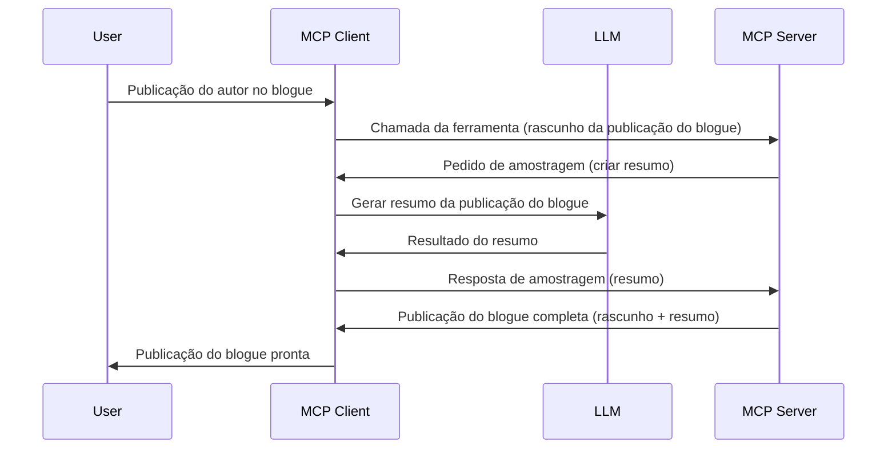

# Amostragem - delegar funcionalidades ao Cliente

> **Aviso de descontinuação:** o candidato a especificação MCP `2026-07-28` marca a Amostragem como descontinuada em favor da integração direta com APIs dos fornecedores de LLM. A Amostragem continuará a funcionar na versão `2025-11-25` e durante pelo menos um ano após qualquer descontinuação formal, por isso tudo nesta lição continua válido — mas os novos designs de servidor devem avaliar o padrão substituto. Veja [O que está a mudar no MCP: o candidato à versão 2026-07-28](../../01-CoreConcepts/mcp-2026-07-28-release-candidate.md).

Por vezes, é necessário que o Cliente MCP e o Servidor MCP colaborem para atingir um objetivo comum. Pode haver um caso em que o Servidor precise da ajuda de um LLM que está no cliente. Para esta situação, a amostragem é o que deve usar.

Vamos explorar alguns casos de uso e como construir uma solução envolvendo amostragem.

## Visão geral

Nesta lição, focamo-nos em explicar quando e onde usar a Amostragem e como a configurar.

## Objetivos de aprendizagem

Neste capítulo, iremos:

- Explicar o que é a Amostragem e quando a usar.
- Mostrar como configurar a Amostragem no MCP.
- Fornecer exemplos práticos de Amostragem em ação.

## O que é Amostragem e por que usá-la?

A amostragem é uma funcionalidade avançada que funciona da seguinte forma:



### Pedido de amostragem

Ok, agora que temos uma visão geral credível de um cenário, vamos falar sobre o pedido de amostragem que o servidor envia de volta ao cliente. Eis como pode ser esse pedido em formato JSON-RPC:

```json
{
  "jsonrpc": "2.0",
  "id": 1,
  "method": "sampling/createMessage",
  "params": {
    "messages": [
      {
        "role": "user",
        "content": {
          "type": "text",
          "text": "Create a blog post summary of the following blog post: <BLOG POST>"
        }
      }
    ],
    "modelPreferences": {
      "hints": [
        {
          "name": "claude-3-sonnet"
        }
      ],
      "intelligencePriority": 0.8,
      "speedPriority": 0.5
    },
    "systemPrompt": "You are a helpful assistant.",
    "maxTokens": 100
  }
}
```

Há alguns pontos que vale a pena destacar:

- Prompt, sob content -> text, é o nosso prompt, uma instrução para o LLM resumir o conteúdo de um post de blog.

- **modelPreferences**. Esta secção é exatamente isso, uma preferência, uma recomendação de que configuração usar com o LLM. O utilizador pode escolher seguir ou alterar essas recomendações. Neste caso, existem recomendações sobre modelo a usar, velocidade e prioridade de inteligência.
- **systemPrompt**, este é o seu prompt normal de sistema que dá personalidade ao seu LLM e contém instruções orientadoras.
- **maxTokens**, esta é outra propriedade usada para indicar quantos tokens são recomendados para a tarefa.

### Resposta de amostragem

Esta resposta é o que o Cliente MCP acaba por enviar de volta ao Servidor MCP e é o resultado da chamada do cliente ao LLM, esperar pela resposta e, depois, construir esta mensagem. Eis como pode ser em JSON-RPC:

```json
{
  "jsonrpc": "2.0",
  "id": 1,
  "result": {
    "role": "assistant",
    "content": {
      "type": "text",
      "text": "Here's your abstract <ABSTRACT>"
    },
    "model": "gpt-5",
    "stopReason": "endTurn"
  }
}
```

Note que a resposta é um resumo do post de blog, tal como pedimos. Note também que o `model` usado não é o que pedimos mas sim "gpt-5" em vez de "claude-3-sonnet". Isto ilustra que o utilizador pode mudar de opinião sobre o que usar e que o seu pedido de amostragem é uma recomendação.

Ok, agora que entendemos o fluxo principal e a tarefa útil para usar — "criação + resumo de post de blog" — vejamos o que precisamos fazer para pôr isto a funcionar.

### Tipos de mensagens

As mensagens de amostragem não se limitam a texto, mas também podem enviar imagens e áudio. Eis como o JSON-RPC fica diferente:

**Texto**

```json
{
  "type": "text",
  "text": "The message content"
}
```

**Conteúdo de imagem**

```json
{
  "type": "image",
  "data": "base64-encoded-image-data",
  "mimeType": "image/jpeg"
}
```

**Conteúdo de áudio**

```json
{
  "type": "audio",
  "data": "base64-encoded-audio-data",
  "mimeType": "audio/wav"
}
```

> NOTA: para mais informações detalhadas sobre Amostragem, consulte a [documentação oficial](https://modelcontextprotocol.io/specification/2025-11-25/client/sampling)

## Como configurar a Amostragem no Cliente

> Nota: se está só a construir um servidor, não precisa de fazer muito aqui.

Num cliente, precisa de especificar a funcionalidade seguinte da seguinte forma:

```json
{
  "capabilities": {
    "sampling": {}
  }
}
```

Isto será então detetado quando o cliente escolhido iniciar ligação com o servidor.

## Exemplo de Amostragem em ação – Criar um post de blog

Vamos programar juntos um servidor de amostragem; precisamos de fazer o seguinte:

1. Criar uma ferramenta no Servidor.
1. Essa ferramenta deverá criar um pedido de amostragem.
1. A ferramenta deve esperar pela resposta ao pedido de amostragem do cliente.
1. Depois deve produzir o resultado da ferramenta.

Vamos ver o código passo a passo:

### -1- Criar a ferramenta

**python**

```python
@mcp.tool()
async def create_blog(title: str, content: str, ctx: Context[ServerSession, None]) -> str:
    """Create a blog post and generate a summary"""

```

### -2- Criar um pedido de amostragem

Estenda a sua ferramenta com o seguinte código:

**python**

```python
post = BlogPost(
        id=len(posts) + 1,
        title=title,
        content=content,
        abstract=""
    )

prompt = f"Create an abstract of the following blog post: title: {title} and draft: {content} "

result = await ctx.session.create_message(
        messages=[
            SamplingMessage(
                role="user",
                content=TextContent(type="text", text=prompt),
            )
        ],
        max_tokens=100,
)

```

### -3- Esperar pela resposta e retornar essa resposta

**python**

```python
post.abstract = result.content.text

posts.append(post)

# retornar o produto completo
return json.dumps({
    "id": post.title,
    "abstract": post.abstract
})
```

### -4- Código completo

**python**

```python
from starlette.applications import Starlette
from starlette.routing import Mount, Host

from mcp.server.fastmcp import Context, FastMCP

from mcp.server.session import ServerSession
from mcp.types import SamplingMessage, TextContent

import json


from uuid import uuid4
from typing import List
from pydantic import BaseModel


mcp = FastMCP("Blog post generator")

# app = FastAPI()

posts = []

class BlogPost(BaseModel):
    id: int
    title: str
    content: str
    abstract: str

posts: List[BlogPost] = []

@mcp.tool()
async def create_blog(title: str, content: str, ctx: Context[ServerSession, None]) -> str:
    """Create a blog post and generate a summary"""

    post = BlogPost(
        id=len(posts) + 1,
        title=title,
        content=content,
        abstract=""
    )

    prompt = f"Create an abstract of the following blog post: title: {title} and draft: {content} "

    result = await ctx.session.create_message(
        messages=[
            SamplingMessage(
                role="user",
                content=TextContent(type="text", text=prompt),
            )
        ],
        max_tokens=100,
    )

    post.abstract = result.content.text

    posts.append(post)

    # retorna o post completo do blogue
    return json.dumps({
        "id": post.title,
        "abstract": post.abstract
    })

if __name__ == "__main__":
    print("Starting server...")
    # mcp.run()
    mcp.run(transport="streamable-http")

# executar app com: python server.py
```

### -5- Testar no Visual Studio Code

Para testar isto no Visual Studio Code, faça o seguinte:

1. Inicie o servidor no terminal
1. Adicione-o ao *mcp.json* (e assegure que está em funcionamento) algo como:

   ```json
   "servers": {
      "blog-server": {
        "type": "http",
        "url": "http://localhost:8000/mcp"
      }
   }
   ```

1. Escreva um prompt:

   ```text
   create a blog post named "Where Python comes from", the content is "Python is actually named after Monty Python Flying Circus"
   ```

1. Permita que a amostragem aconteça. Na primeira vez que testar, será apresentado um diálogo adicional que deverá aceitar; depois verá o diálogo normal a pedir para executar uma ferramenta.

1. Inspecione os resultados. Verá os resultados bem apresentados no GitHub Copilot Chat mas pode também examinar a resposta JSON em bruto.

**Bónus**. As ferramentas do Visual Studio Code têm ótimo suporte para amostragem. Pode configurar o acesso à Amostragem no servidor instalado navegando assim:

1. Navegue para a seção de extensões.
1. Selecione o ícone de engrenagem do seu servidor instalado na seção "MCP SERVERS - INSTALLED".
1 Selecione "Configurar Acesso ao Modelo", aqui pode selecionar quais os Modelos que o GitHub Copilot pode usar ao realizar amostragem. Pode também ver todos os pedidos de amostragem recentes selecionando "Mostrar pedidos de amostragem".

## Tarefa

Nesta tarefa, vai construir uma Amostragem ligeiramente diferente, nomeadamente uma integração de amostragem que suporta gerar uma descrição de produto. Eis o seu cenário:

**Cenário**: O colaborador do back office num e-commerce precisa de ajuda, leva demasiado tempo a gerar descrições de produto. Portanto, deve construir uma solução onde possa invocar uma ferramenta "create_product" com "title" e "keywords" como argumentos e deverá produzir um produto completo incluindo um campo "description" que será preenchido por um LLM do cliente.

DICA: use o que aprendeu antes para construir este servidor e a sua ferramenta usando um pedido de amostragem.

## Solução

[Solução](./solution/README.md)

## Principais conclusões

A amostragem é uma funcionalidade poderosa que permite ao servidor delegar tarefas ao cliente quando precisa da ajuda de um LLM.

## O que vem a seguir

- [Capítulo 4 - Implementação prática](../../04-PracticalImplementation/README.md)

---

<!-- CO-OP TRANSLATOR DISCLAIMER START -->
**Aviso Legal**:
Este documento foi traduzido utilizando o serviço de tradução automática [Co-op Translator](https://github.com/Azure/co-op-translator). Embora nos esforcemos pela precisão, esteja ciente de que traduções automáticas podem conter erros ou imprecisões. O documento original na sua língua nativa deve ser considerado a fonte autorizada. Para informações críticas, recomenda-se tradução profissional humana. Não nos responsabilizamos por quaisquer mal-entendidos ou interpretações incorretas resultantes da utilização desta tradução.
<!-- CO-OP TRANSLATOR DISCLAIMER END -->