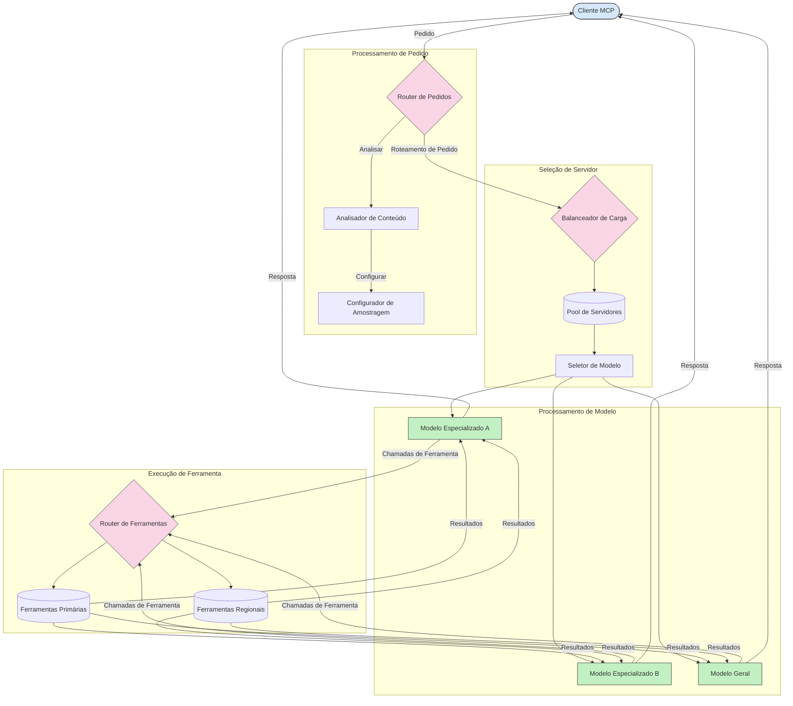

# Encaminhamento no Protocolo do Contexto do Modelo

O encaminhamento é essencial para direcionar pedidos aos modelos, ferramentas ou serviços apropriados dentro de um ecossistema MCP.

## Introdução

O encaminhamento no Protocolo do Contexto do Modelo (MCP) envolve direcionar pedidos para os modelos ou serviços mais adequados com base em vários critérios, como tipo de conteúdo, contexto do utilizador e carga do sistema. Isto garante um processamento eficiente e uma utilização ótima dos recursos.

## Objetivos de Aprendizagem

No final desta lição, será capaz de:

- Compreender os princípios do encaminhamento no MCP.
- Implementar encaminhamento baseado no conteúdo para direcionar pedidos a serviços especializados.
- Aplicar estratégias inteligentes de balanceamento de carga para otimizar a utilização de recursos.
- Implementar encaminhamento dinâmico de ferramentas com base no contexto do pedido.

## Encaminhamento Baseado no Conteúdo

O encaminhamento baseado no conteúdo direciona pedidos para serviços especializados com base no conteúdo do pedido. Por exemplo, pedidos relacionados com geração de código podem ser encaminhados para um modelo de código especializado, enquanto pedidos de escrita criativa podem ser enviados para um modelo de escrita criativa.

Vamos ver um exemplo de implementação em diferentes linguagens de programação.

<details>
<summary>.NET</summary>

```csharp
// .NET Example: Content-based routing in MCP
public class ContentBasedRouter
{
    private readonly Dictionary<string, McpClient> _specializedClients;
    private readonly RoutingClassifier _classifier;
    
    public ContentBasedRouter()
    {
        // Initialize specialized clients for different domains
        _specializedClients = new Dictionary<string, McpClient>
        {
            ["code"] = new McpClient("https://code-specialized-mcp.com"),
            ["creative"] = new McpClient("https://creative-specialized-mcp.com"),
            ["scientific"] = new McpClient("https://scientific-specialized-mcp.com"),
            ["general"] = new McpClient("https://general-mcp.com")
        };
        
        // Initialize content classifier
        _classifier = new RoutingClassifier();
    }
    
    public async Task<McpResponse> RouteAndProcessAsync(string prompt, IDictionary<string, object> parameters = null)
    {
        // Classify the prompt to determine the best specialized service
        string category = await _classifier.ClassifyPromptAsync(prompt);
        
        // Get the appropriate client or fall back to general
        var client = _specializedClients.ContainsKey(category) 
            ? _specializedClients[category] 
            : _specializedClients["general"];
            
        Console.WriteLine($"Routing request to {category} specialized service");
        
        // Send request to the selected service
        return await client.SendPromptAsync(prompt, parameters);
    }
    
    // Simple classifier for routing decisions
    private class RoutingClassifier
    {
        public Task<string> ClassifyPromptAsync(string prompt)
        {
            prompt = prompt.ToLowerInvariant();
            
            if (prompt.Contains("code") || prompt.Contains("function") || 
                prompt.Contains("program") || prompt.Contains("algorithm"))
            {
                return Task.FromResult("code");
            }
            
            if (prompt.Contains("story") || prompt.Contains("creative") || 
                prompt.Contains("imagine") || prompt.Contains("design"))
            {
                return Task.FromResult("creative");
            }
            
            if (prompt.Contains("science") || prompt.Contains("research") || 
                prompt.Contains("analyze") || prompt.Contains("study"))
            {
                return Task.FromResult("scientific");
            }
            
            return Task.FromResult("general");
        }
    }
}
```

No código anterior, nós:

- Criámos uma classe `ContentBasedRouter` que encaminha pedidos com base no conteúdo do prompt.
- Inicializámos clientes especializados para diferentes domínios (código, criativo, científico, geral).
- Implementámos um classificador simples que determina a categoria do prompt e o encaminha para o serviço especializado apropriado.
- Utilizámos um mecanismo de fallback para encaminhar pedidos a um serviço geral se não houver um serviço especializado disponível.
- Implementámos processamento assíncrono para tratar pedidos de forma eficiente.
- Utilizámos um dicionário para mapear categorias de conteúdo aos clientes especializados MCP.
- Implementámos um classificador simples que analisa o prompt e devolve a categoria apropriada.
- Utilizámos o cliente especializado para enviar o pedido e receber uma resposta.
- Tratámos casos em que o prompt não corresponde a nenhuma categoria especializada, encaminhando para um serviço geral.

</details>

## Balanceamento de Carga Inteligente

O balanceamento de carga otimiza a utilização de recursos e assegura alta disponibilidade para os serviços MCP. Existem diferentes formas de implementar o balanceamento de carga, como round-robin, tempo de resposta ponderado ou estratégias conscientes do conteúdo.

Vamos ver o exemplo abaixo que utiliza as seguintes estratégias:

- **Round Robin**: Distribui pedidos de forma equitativa pelos servidores disponíveis.
- **Tempo de Resposta Ponderado**: Encaminha pedidos para servidores com base no seu tempo médio de resposta.
- **Consciente do Conteúdo**: Encaminha pedidos para servidores especializados com base no conteúdo do pedido.

<details>
<summary>Java</summary>

```java
// Exemplo em Java: Balanceamento de carga inteligente para servidores MCP
public class McpLoadBalancer {
    private final List<McpServerNode> serverNodes;
    private final LoadBalancingStrategy strategy;
    
    public McpLoadBalancer(List<McpServerNode> nodes, LoadBalancingStrategy strategy) {
        this.serverNodes = new ArrayList<>(nodes);
        this.strategy = strategy;
    }
    
    public McpResponse processRequest(McpRequest request) {
        // Selecionar o melhor servidor com base na estratégia
        McpServerNode selectedNode = strategy.selectNode(serverNodes, request);
        
        try {
            // Encaminhar o pedido para o nó selecionado
            return selectedNode.processRequest(request);
        } catch (Exception e) {
            // Tratar falhas - implementar lógica de reintento ou alternativa
            System.err.println("Error processing request on node " + selectedNode.getId() + ": " + e.getMessage());
            
            // Marcar o nó como potencialmente não saudável
            selectedNode.recordFailure();
            
            // Tentar o próximo melhor nó como alternativa
            List<McpServerNode> remainingNodes = new ArrayList<>(serverNodes);
            remainingNodes.remove(selectedNode);
            
            if (!remainingNodes.isEmpty()) {
                McpServerNode fallbackNode = strategy.selectNode(remainingNodes, request);
                return fallbackNode.processRequest(request);
            } else {
                throw new RuntimeException("All MCP server nodes failed to process the request");
            }
        }
    }
    
    // Tarefa de verificação da saúde do nó
    public void startHealthChecks(Duration interval) {
        ScheduledExecutorService scheduler = Executors.newScheduledThreadPool(1);
        scheduler.scheduleAtFixedRate(() -> {
            for (McpServerNode node : serverNodes) {
                try {
                    boolean isHealthy = node.checkHealth();
                    System.out.println("Node " + node.getId() + " health status: " + 
                                      (isHealthy ? "HEALTHY" : "UNHEALTHY"));
                } catch (Exception e) {
                    System.err.println("Health check failed for node " + node.getId());
                    node.setHealthy(false);
                }
            }
        }, 0, interval.toMillis(), TimeUnit.MILLISECONDS);
    }
    
    // Interface para estratégias de balanceamento de carga
    public interface LoadBalancingStrategy {
        McpServerNode selectNode(List<McpServerNode> nodes, McpRequest request);
    }
    
    // Estratégia round-robin
    public static class RoundRobinStrategy implements LoadBalancingStrategy {
        private AtomicInteger counter = new AtomicInteger(0);
        
        @Override
        public McpServerNode selectNode(List<McpServerNode> nodes, McpRequest request) {
            List<McpServerNode> healthyNodes = nodes.stream()
                .filter(McpServerNode::isHealthy)
                .collect(Collectors.toList());
            
            if (healthyNodes.isEmpty()) {
                throw new RuntimeException("No healthy nodes available");
            }
            
            int index = counter.getAndIncrement() % healthyNodes.size();
            return healthyNodes.get(index);
        }
    }
    
    // Estratégia de tempo de resposta ponderado
    public static class ResponseTimeStrategy implements LoadBalancingStrategy {
        @Override
        public McpServerNode selectNode(List<McpServerNode> nodes, McpRequest request) {
            return nodes.stream()
                .filter(McpServerNode::isHealthy)
                .min(Comparator.comparing(McpServerNode::getAverageResponseTime))
                .orElseThrow(() -> new RuntimeException("No healthy nodes available"));
        }
    }
    
    // Estratégia sensível ao conteúdo
    public static class ContentAwareStrategy implements LoadBalancingStrategy {
        @Override
        public McpServerNode selectNode(List<McpServerNode> nodes, McpRequest request) {
            // Determinar características do pedido
            boolean isCodeRequest = request.getPrompt().contains("code") || 
                                   request.getAllowedTools().contains("codeInterpreter");
            
            boolean isCreativeRequest = request.getPrompt().contains("creative") || 
                                       request.getPrompt().contains("story");
            
            // Encontrar nós especializados
            Optional<McpServerNode> specializedNode = nodes.stream()
                .filter(McpServerNode::isHealthy)
                .filter(node -> {
                    if (isCodeRequest && node.getSpecialization().equals("code")) {
                        return true;
                    }
                    if (isCreativeRequest && node.getSpecialization().equals("creative")) {
                        return true;
                    }
                    return false;
                })
                .findFirst();
            
            // Retornar nó especializado ou nó com menor carga
            return specializedNode.orElse(
                nodes.stream()
                    .filter(McpServerNode::isHealthy)
                    .min(Comparator.comparing(McpServerNode::getCurrentLoad))
                    .orElseThrow(() -> new RuntimeException("No healthy nodes available"))
            );
        }
    }
}
```

No código anterior, nós:

- Criámos uma classe `McpLoadBalancer` que gere uma lista de nós de servidores MCP e encaminha pedidos com base na estratégia de balanceamento de carga selecionada.
- Implementámos diferentes estratégias de balanceamento de carga: `RoundRobinStrategy`, `ResponseTimeStrategy` e `ContentAwareStrategy`.
- Utilizámos um `ScheduledExecutorService` para verificar periodicamente a saúde dos nós servidores.
- Implementámos um mecanismo de verificação de saúde que marca os nós como saudáveis ou não saudáveis com base na resposta aos testes de saúde.
- Tratámos o processamento dos pedidos com gestão de erros e lógica de fallback para garantir alta disponibilidade.
- Utilizámos uma classe `McpServerNode` para representar nós individuais do servidor MCP, incluindo o estado de saúde, tempo médio de resposta e carga atual.
- Implementámos uma classe `McpRequest` para encapsular detalhes do pedido, como o prompt e as ferramentas permitidas.
- Utilizámos Streams Java para filtrar e selecionar nós com base no estado de saúde e especialização.

</details>

## Encaminhamento Dinâmico de Ferramentas

O encaminhamento de ferramentas assegura que as chamadas a ferramentas sejam direcionadas para o serviço mais apropriado com base no contexto. Por exemplo, uma chamada a uma ferramenta de previsão meteorológica pode precisar ser encaminhada para um endpoint regional com base na localização do utilizador, ou uma ferramenta de calculadora pode necessitar de utilizar uma versão específica da API.

Vamos ver um exemplo de implementação que demonstra encaminhamento dinâmico de ferramentas baseado na análise de pedidos, endpoints regionais e suporte a versionamento.

<details>
<summary>Python</summary>

```python
# Exemplo em Python: Encaminhamento dinâmico de ferramentas com base na análise do pedido
class McpToolRouter:
    def __init__(self):
        # Registar endpoints disponíveis das ferramentas
        self.tool_endpoints = {
            "weatherTool": "https://weather-service.example.com/api",
            "calculatorTool": "https://calculator-service.example.com/compute",
            "databaseTool": "https://database-service.example.com/query",
            "searchTool": "https://search-service.example.com/search"
        }
        
        # Endpoints regionais para distribuição global
        self.regional_endpoints = {
            "us": {
                "weatherTool": "https://us-west.weather-service.example.com/api",
                "searchTool": "https://us.search-service.example.com/search"
            },
            "europe": {
                "weatherTool": "https://eu.weather-service.example.com/api",
                "searchTool": "https://eu.search-service.example.com/search"
            },
            "asia": {
                "weatherTool": "https://asia.weather-service.example.com/api",
                "searchTool": "https://asia.search-service.example.com/search"
            }
        }
        
        # Suporte à versionamento das ferramentas
        self.tool_versions = {
            "weatherTool": {
                "default": "v2",
                "v1": "https://weather-service.example.com/api/v1",
                "v2": "https://weather-service.example.com/api/v2",
                "beta": "https://weather-service.example.com/api/beta"
            }
        }
    
    async def route_tool_request(self, tool_name, parameters, user_context=None):
        """Route a tool request to the appropriate endpoint based on context"""
        endpoint = self._select_endpoint(tool_name, parameters, user_context)
        
        if not endpoint:
            raise ValueError(f"No endpoint available for tool: {tool_name}")
        
        # Executar o pedido real para o endpoint selecionado
        return await self._execute_tool_request(endpoint, tool_name, parameters)
    
    def _select_endpoint(self, tool_name, parameters, user_context=None):
        """Select the most appropriate endpoint based on context"""
        # Endpoint base do registo
        if tool_name not in self.tool_endpoints:
            return None
            
        base_endpoint = self.tool_endpoints[tool_name]
        
        # Verificar se precisamos de usar uma versão específica da ferramenta
        if tool_name in self.tool_versions:
            version_info = self.tool_versions[tool_name]
            
            # Usar a versão especificada ou a predefinida
            requested_version = parameters.get("_version", version_info["default"])
            if requested_version in version_info:
                base_endpoint = version_info[requested_version]
        
        # Verificar encaminhamento regional se a região do utilizador for conhecida
        if user_context and "region" in user_context:
            user_region = user_context["region"]
            
            if user_region in self.regional_endpoints:
                regional_tools = self.regional_endpoints[user_region]
                
                if tool_name in regional_tools:
                    # Usar endpoint específico da região
                    return regional_tools[tool_name]
        
        # Verificar requisitos de residência dos dados
        if user_context and "data_residency" in user_context:
            # Isto implementaria lógica para garantir que os dados permanecem na jurisdição especificada
            pass
        
        # Verificar encaminhamento com base na latência
        if user_context and "latency_sensitive" in user_context and user_context["latency_sensitive"]:
            # Isto implementaria lógica para selecionar o endpoint com menor latência
            pass
            
        return base_endpoint
        
    async def _execute_tool_request(self, endpoint, tool_name, parameters):
        """Execute the actual tool request to the selected endpoint"""
        try:
            async with aiohttp.ClientSession() as session:
                async with session.post(
                    endpoint,
                    json={"toolName": tool_name, "parameters": parameters},
                    headers={"Content-Type": "application/json"}
                ) as response:
                    if response.status == 200:
                        result = await response.json()
                        return result
                    else:
                        error_text = await response.text()
                        raise Exception(f"Tool execution failed: {error_text}")
        except Exception as e:
            # Implementar lógica de repetição ou estratégia de recurso alternativo
            print(f"Error executing tool {tool_name} at {endpoint}: {str(e)}")
            raise
```

No código anterior, nós:

- Criámos uma classe `McpToolRouter` que gere o encaminhamento das ferramentas com base na análise do pedido, endpoints regionais e suporte a versionamento.
- Registámos endpoints de ferramentas disponíveis e endpoints regionais para distribuição global.
- Implementámos lógica de encaminhamento dinâmico que seleciona o endpoint apropriado com base no contexto do utilizador, como região e requisitos de residência de dados.
- Implementámos suporte ao versionamento das ferramentas, permitindo que os utilizadores especifiquem qual a versão da ferramenta que pretendem usar.
- Utilizámos pedidos HTTP assíncronos para executar chamadas às ferramentas e tratar respostas.

</details>

## Arquitectura de Amostragem e Encaminhamento no MCP

A amostragem é um componente crítico do Protocolo do Contexto do Modelo (MCP) que permite um processamento eficiente dos pedidos e encaminhamento. Envolve analisar os pedidos recebidos para determinar o modelo ou serviço mais apropriado para os tratar, com base em vários critérios como tipo de conteúdo, contexto do utilizador e carga do sistema.

A amostragem e o encaminhamento podem ser combinados para criar uma arquitetura robusta que otimiza a utilização dos recursos e garante alta disponibilidade. O processo de amostragem pode ser usado para classificar os pedidos, enquanto o encaminhamento direciona-os para os modelos ou serviços apropriados.

O diagrama abaixo ilustra como a amostragem e o encaminhamento trabalham em conjunto numa arquitetura abrangente MCP:



## Próximo passo

- [5.6 Amostragem](../mcp-sampling/README.md)

---

<!-- CO-OP TRANSLATOR DISCLAIMER START -->
**Aviso Legal**:
Este documento foi traduzido utilizando o serviço de tradução automática [Co-op Translator](https://github.com/Azure/co-op-translator). Embora nos esforcemos pela precisão, esteja ciente de que traduções automáticas podem conter erros ou imprecisões. O documento original na sua língua nativa deve ser considerado a fonte autorizada. Para informações críticas, recomenda-se tradução profissional humana. Não nos responsabilizamos por quaisquer mal-entendidos ou interpretações incorretas resultantes da utilização desta tradução.
<!-- CO-OP TRANSLATOR DISCLAIMER END -->