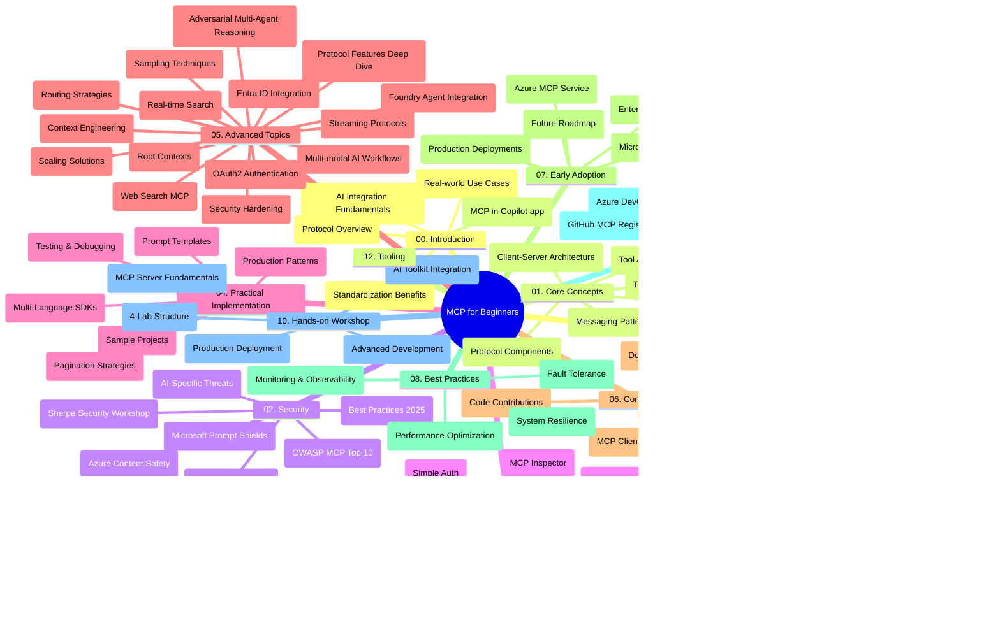

# Protocolo de Contexto do Modelo (MCP) para Iniciantes - Guia de Estudo

Este guia de estudo fornece uma visão geral da estrutura e conteúdo do repositório para o currículo "Protocolo de Contexto do Modelo (MCP) para Iniciantes". Utilize este guia para navegar pelo repositório de forma eficiente e tirar o máximo proveito dos recursos disponíveis.

## Visão Geral do Repositório

O Protocolo de Contexto do Modelo (MCP) é uma estrutura padronizada para as interações entre modelos de IA e aplicações cliente. Inicialmente criado pela Anthropic, o MCP é agora mantido pela comunidade MCP mais ampla através da organização oficial no GitHub. Este repositório oferece um currículo abrangente com exemplos práticos de código em C#, Java, JavaScript, Python e TypeScript, destinado a desenvolvedores de IA, arquitetos de sistemas e engenheiros de software.

## Mapa Visual do Currículo

## Estrutura do Repositório

O repositório está organizado em doze secções principais, cada uma focada em diferentes aspetos do MCP:

1. **Introdução (00-Introduction/)**
   - Visão geral do Protocolo de Contexto do Modelo
   - Por que a padronização é importante em pipelines de IA
   - Casos práticos e benefícios

2. **Conceitos Básicos (01-CoreConcepts/)**
   - Arquitetura cliente-servidor
   - Componentes principais do protocolo
   - Padrões de mensagens no MCP
   - Perspetivas futuras: [O que está a mudar no MCP: O Release Candidate de 2026-07-28](./01-CoreConcepts/mcp-2026-07-28-release-candidate.md) — o núcleo stateless do protocolo, estrutura de Extensões, e as desativações de Roots/Sampling/Logging previstas na próxima versão da especificação

3. **Segurança (02-Security/)**
   - Ameaças de segurança em sistemas baseados em MCP
   - Melhores práticas para proteger implementações
   - Estratégias de autenticação e autorização
   - **Documentação Abrangente de Segurança**:
     - Melhores Práticas de Segurança MCP 2025
     - Guia de Implementação de Segurança de Conteúdo Azure
     - Controlo e Técnicas de Segurança MCP
     - Referência Rápida de Melhores Práticas MCP
   - **Tópicos Chave de Segurança**:
     - Injeção de prompts e ataques de envenenamento de ferramentas
     - Sequestro de sessão e problemas de representante confundido
     - Vulnerabilidades de passagem de token
     - Permissões excessivas e controlo de acesso
     - Segurança da cadeia de fornecimento para componentes de IA
     - Integração com Microsoft Prompt Shields

4. **Primeiros Passos (03-GettingStarted/)**
   - Configuração e preparação do ambiente
   - Criação de servidores e clientes MCP simples
   - Integração com aplicações existentes
   - Inclui secções para:
     - Primeira implementação de servidor
     - Desenvolvimento de cliente
     - Integração de cliente LLM
     - Integração com VS Code
     - Servidor Server-Sent Events (SSE)
     - Uso avançado do servidor
     - Streaming HTTP
     - Integração do AI Toolkit
     - Estratégias de teste
     - Diretrizes de implantação

5. **Implementação Prática (04-PracticalImplementation/)**
   - Utilização de SDKs em diferentes linguagens de programação
   - Técnicas de depuração, teste e validação
   - Criação de modelos reutilizáveis de prompts e workflows
   - Projetos de exemplo com exemplos de implementação

6. **Tópicos Avançados (05-AdvancedTopics/)**
   - Técnicas de engenharia de contexto
   - Integração de agente Foundry
   - Workflows de IA multimodal 
   - Demonstrações de autenticação OAuth2
   - Capacidades de pesquisa em tempo real
   - Streaming em tempo real
   - Implementação de contextos Root
   - Estratégias de encaminhamento
   - Técnicas de sampling
   - Abordagens de escalabilidade
   - Considerações de segurança
   - Integração de segurança Entra ID
   - Integração de pesquisa web
   - Raciocínio multi-agente adversarial (padrões de debate)

7. **Contribuições da Comunidade (06-CommunityContributions/)**
   - Como contribuir com código e documentação
   - Colaboração via GitHub
   - Melhorias e feedback orientados pela comunidade
   - Uso de vários clientes MCP (Claude Desktop, Cline, VSCode)
   - Trabalho com servidores MCP populares incluindo geração de imagens

8. **Lições da Adoção Inicial (07-LessonsfromEarlyAdoption/)**
   - Implementações reais e histórias de sucesso
   - Construção e implantação de soluções baseadas em MCP
   - Tendências e roteiro futuro
   - **Guia dos Servidores MCP Microsoft**: Guia abrangente para 10 servidores MCP Microsoft prontos para produção incluindo:
     - Servidor Microsoft Learn Docs MCP
     - Servidor Azure MCP (15+ conectores especializados)
     - Servidor GitHub MCP
     - Servidor Azure DevOps MCP
     - Servidor MarkItDown MCP
     - Servidor SQL Server MCP
     - Servidor Playwright MCP
     - Servidor Dev Box MCP
     - Servidor Microsoft Foundry MCP
     - Servidor Microsoft 365 Agents Toolkit MCP

9. **Melhores Práticas (08-BestPractices/)**
   - Ajuste de desempenho e otimização
   - Desenho de sistemas MCP tolerantes a falhas
   - Estratégias de teste e resiliência

10. **Estudos de Caso (09-CaseStudy/)**
    - **Sete estudos de caso abrangentes** demonstrando a versatilidade do MCP em diversos cenários:
    - **Agentes de Viagens Azure AI**: Orquestração multi-agente com Azure OpenAI e AI Search
    - **Integração Azure DevOps**: Automação de processos de workflow com atualizações de dados do YouTube
    - **Recuperação de Documentação em Tempo Real**: Cliente consola Python com HTTP streaming
    - **Gerador Interativo de Planos de Estudo**: Aplicação web Chainlit com IA conversacional
    - **Documentação no Editor**: Integração no VS Code com workflows GitHub Copilot
    - **Gestão API Azure**: Integração empresarial de API com criação de servidor MCP
    - **Registo MCP GitHub**: Desenvolvimento de ecossistema e plataforma de integração agentic
    - Exemplos de implementação abrangendo integração empresarial, produtividade de desenvolvedores e desenvolvimento de ecossistema

11. **Workshop Prático (10-StreamliningAIWorkflowsBuildingAnMCPServerWithAIToolkit/)**
    - Workshop prático abrangente combinando MCP com AI Toolkit
    - Construção de aplicações inteligentes que ligam modelos de IA a ferramentas do mundo real
    - Módulos práticos cobrindo fundamentos, desenvolvimento de servidor personalizado e estratégias de implantação em produção
    - **Estrutura do Laboratório**:
      - Laboratório 1: Fundamentos do Servidor MCP
      - Laboratório 2: Desenvolvimento Avançado de Servidor MCP
      - Laboratório 3: Integração AI Toolkit
      - Laboratório 4: Implantação e Escalabilidade em Produção
    - Abordagem de aprendizagem baseada em laboratórios com instruções passo a passo

12. **Laboratórios de Integração de Bases de Dados no Servidor MCP (11-MCPServerHandsOnLabs/)**
    - **Caminho de aprendizagem abrangente com 13 laboratórios** para construção de servidores MCP prontos para produção com integração PostgreSQL
    - **Implementação real de análises no retalho** utilizando o caso de uso Zava Retail
    - **Padrões em nível empresarial** incluindo Row Level Security (RLS), pesquisa semântica e acesso a dados multi-inquilino
    - **Estrutura Completa do Laboratório**:
      - **Laboratórios 00-03: Fundamentos** - Introdução, Arquitetura, Segurança, Configuração do Ambiente
      - **Laboratórios 04-06: Construção do Servidor MCP** - Design de Base de Dados, Implementação de Servidor MCP, Desenvolvimento de Ferramenta
      - **Laboratórios 07-09: Funcionalidades Avançadas** - Pesquisa Semântica, Testes & Depuração, Integração VS Code
      - **Laboratórios 10-12: Produção & Melhores Práticas** - Implantação, Monitorização, Otimização
    - **Tecnologias Abrangidas**: Framework FastMCP, PostgreSQL, Azure OpenAI, Azure Container Apps, Application Insights
    - **Resultados de Aprendizagem**: Servidores MCP prontos para produção, padrões de integração de bases de dados, análises potenciadas por IA, segurança empresarial

13. **Ferramentas (12-tooling/)**
    - Aprender a usar o MCP na app Copilot e outras ferramentas

## Recursos Adicionais

O repositório inclui recursos de apoio:

- **Pasta de imagens**: Contém diagramas e ilustrações usadas ao longo do currículo
- **Traduções**: Suporte multilíngue com traduções automáticas da documentação
- **Recursos Oficiais MCP**:
  - [Documentação MCP](https://modelcontextprotocol.io/)
  - [Especificação MCP](https://spec.modelcontextprotocol.io/)
  - [Repositório GitHub MCP](https://github.com/modelcontextprotocol)

## Como Usar Este Repositório

1. **Aprendizagem Sequencial**: Siga os capítulos por ordem (de 00 a 11) para uma experiência de aprendizagem estruturada.
2. **Foco Específico por Linguagem**: Se estiver interessado numa linguagem de programação em particular, explore as pastas de exemplos para implementações na sua linguagem preferida.
3. **Implementação Prática**: Comece pela secção "Primeiros Passos" para configurar o seu ambiente e criar o seu primeiro servidor e cliente MCP.
4. **Exploração Avançada**: Quando se sentir confortável com o básico, aprofunde-se nos tópicos avançados para expandir o seu conhecimento.
5. **Engajamento Comunitário**: Junte-se à comunidade MCP através das discussões no GitHub e canais Discord para conectar-se com especialistas e outros desenvolvedores.

## Clientes e Ferramentas MCP

O currículo cobre vários clientes e ferramentas MCP:

1. **Clientes Oficiais**:
   - Visual Studio Code
   - MCP no Visual Studio Code
   - Claude Desktop
   - Claude no VSCode
   - Claude API

2. **Clientes da Comunidade**:
   - Cline (baseado em terminal)
   - Cursor (editor de código)
   - ChatMCP
   - Windsurf

3. **Ferramentas de Gestão MCP**:
   - MCP CLI
   - MCP Manager
   - MCP Linker
   - MCP Router

## Servidores MCP Populares

O repositório apresenta vários servidores MCP, incluindo:

1. **Servidores MCP Oficiais Microsoft**:
   - Servidor Microsoft Learn Docs MCP
   - Servidor Azure MCP (15+ conectores especializados)
   - Servidor GitHub MCP
   - Servidor Azure DevOps MCP
   - Servidor MarkItDown MCP
   - Servidor SQL Server MCP
   - Servidor Playwright MCP
   - Servidor Dev Box MCP
   - Servidor Microsoft Foundry MCP
   - Servidor Microsoft 365 Agents Toolkit MCP

2. **Servidores de Referência Oficiais**:
   - Filesystem
   - Fetch
   - Memory
   - Sequential Thinking

3. **Geração de Imagens**:
   - Azure OpenAI DALL-E 3
   - Stable Diffusion WebUI
   - Replicate

4. **Ferramentas de Desenvolvimento**:
   - Git MCP
   - Controlo de Terminal
   - Assistente de Código

5. **Servidores Especializados**:
   - Salesforce
   - Microsoft Teams
   - Jira & Confluence

## Contribuindo

Este repositório acolhe contribuições da comunidade. Veja a secção de Contribuições da Comunidade para orientação sobre como contribuir eficazmente para o ecossistema MCP.

----

*Este guia de estudo foi atualizado pela última vez a 5 de fevereiro de 2026, refletindo a mais recente Especificação MCP 2025-11-25 e fornece uma visão geral do repositório até essa data. O conteúdo do repositório poderá ser atualizado depois dessa data.*

*Adendo (2 de julho de 2026): foi adicionada uma lição sobre o Release Candidate da Especificação MCP de `2026-07-28` em [01-CoreConcepts](./01-CoreConcepts/mcp-2026-07-28-release-candidate.md); o padrão do currículo permanece 2025-11-25 até a nova especificação ser lançada.*

---

<!-- CO-OP TRANSLATOR DISCLAIMER START -->
**Aviso Legal**:
Este documento foi traduzido utilizando o serviço de tradução automática [Co-op Translator](https://github.com/Azure/co-op-translator). Embora nos esforcemos pela precisão, esteja ciente de que traduções automáticas podem conter erros ou imprecisões. O documento original na sua língua nativa deve ser considerado a fonte autorizada. Para informações críticas, recomenda-se tradução profissional humana. Não nos responsabilizamos por quaisquer mal-entendidos ou interpretações incorretas resultantes da utilização desta tradução.
<!-- CO-OP TRANSLATOR DISCLAIMER END -->