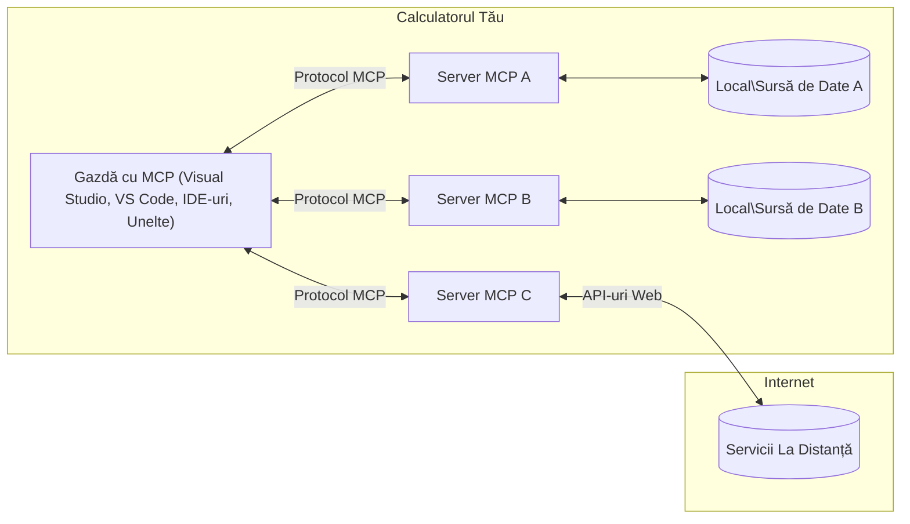

# Concepte de Bază MCP: Stăpânirea Protocolului Contextului Modelului pentru Integrarea AI

[](https://youtu.be/earDzWGtE84)

_(Faceți clic pe imaginea de mai sus pentru a viziona videoclipul acestei lecții)_

[Model Context Protocol (MCP)](https://github.com/modelcontextprotocol) este un cadru puternic, standardizat, care optimizează comunicarea între Modelele Mari de Limbaj (LLM-uri) și uneltele externe, aplicațiile și sursele de date.  
Acest ghid vă va conduce prin conceptele de bază ale MCP. Veți învăța despre arhitectura client-server, componentele esențiale, mecanismele de comunicare și cele mai bune practici de implementare.

- **Consimțământ Explicit al Utilizatorului**: Toate accesările și operațiunile asupra datelor necesită aprobarea explicită a utilizatorului înainte de execuție. Utilizatorii trebuie să înțeleagă clar ce date vor fi accesate și ce acțiuni vor fi efectuate, cu control granular asupra permisiunilor și autorizațiilor.

- **Protecția Confidențialității Datelor**: Datele utilizatorilor sunt expuse doar cu consimțământ explicit și trebuie protejate prin controale robuste de acces pe întreaga durată a interacțiunii. Implementările trebuie să prevină transmiterea neautorizată a datelor și să mențină limite stricte de confidențialitate.

- **Siguranța Executării Uneltelor**: Fiecare utilizare a unei unelte necesită consimțământ explicit al utilizatorului, cu înțelegerea clară a funcționalității, parametrilor și impactului potențial al uneltei. Limitele robuste de securitate trebuie să împiedice execuția neintenționată, nesigură sau rău intenționată a uneltelor.

- **Securitatea Straturilor de Transport**: Toate canalele de comunicare trebuie să folosească mecanisme corespunzătoare de criptare și autentificare. Conexiunile la distanță trebuie să implementeze protocoale de transport securizate și o gestionare adecvată a acreditărilor.

#### Linii directoare pentru implementare:

- **Gestionarea Permisiunilor**: Implementați sisteme de permisiuni detaliate care să permită utilizatorilor să controleze ce servere, unelte și resurse sunt accesibile
- **Autentificare și Autorizare**: Folosiți metode sigure de autentificare (OAuth, chei API) cu o gestionare corespunzătoare a tokenurilor și expirării acestora  
- **Validarea Intrărilor**: Validați toți parametrii și datele de intrare conform schemelor definite pentru a preveni atacurile de tip injecție
- **Logare în Auditurile Operațiunilor**: Mențineți jurnale cuprinzătoare ale tuturor operațiunilor pentru monitorizarea securității și conformitate

## Prezentare generală

Această lecție explorează arhitectura fundamentală și componentele care alcătuiesc ecosistemul Model Context Protocol (MCP). Veți învăța despre arhitectura client-server, componentele cheie și mecanismele de comunicare care susțin interacțiunile MCP.

## Obiective cheie de învățare

La finalul acestei lecții, veți:

- Înțelege arhitectura client-server MCP.
- Identifica rolurile și responsabilitățile gazdelor, clienților și serverelor.
- Analiza caracteristicile de bază care fac MCP un strat de integrare flexibil.
- Înțelege cum circulă informația în cadrul ecosistemului MCP.
- Dobândi perspective practice prin exemple de cod în .NET, Java, Python și JavaScript.

## Arhitectura MCP: O privire mai aprofundată

Ecosistemul MCP se bazează pe un model client-server. Această structură modulară permite aplicațiilor AI să interacționeze eficient cu unelte, baze de date, API-uri și resurse contextuale. Hai să detaliem această arhitectură în componentele sale fundamentale.

La bază, MCP urmează o arhitectură client-server unde o aplicație gazdă se poate conecta la mai mulți servere:



- **Gazde MCP**: Programe precum VSCode, Claude Desktop, IDE-uri sau unelte AI care doresc să acceseze date prin MCP
- **Clienți MCP**: Clienți de protocol care mențin conexiuni directe 1:1 cu serverele
- **Servere MCP**: Programe ușoare care expun fiecare capabilități specifice prin Protocolul Contextului Modelului standardizat
- **Surse Locale de Date**: Fișierele, bazele de date și serviciile calculatorului dvs. la care serverele MCP pot accesa securizat
- **Servicii la Distanță**: Sisteme externe disponibile prin internet la care serverele MCP se pot conecta prin API-uri.

Protocolul MCP este un standard în evoluție care utilizează versiuni bazate pe dată (format YYYY-MM-DD). Versiunea curentă a protocolului este **2025-11-25**. Puteți vedea ultimele actualizări la [specificația protocolului](https://modelcontextprotocol.io/specification/2025-11-25/)

> **Privind înainte:** un candidat pentru lansarea următoarei versiuni a specificației, **2026-07-28**, a fost anunțat în mai 2026 și este programat să fie lansat pe 28 iulie 2026. Acesta face protocolul lipsit de stare la nivelul stratului de transport (eliminând handshake-ul `initialize` și ID-urile de sesiune), formalizează un cadru de Extensii și deprecierea Roots, Sampling și Logging în favoarea unor modele noi. Consultați [Ce se schimbă în MCP: Candidatul pentru lansarea din 2026-07-28](./mcp-2026-07-28-release-candidate.md) pentru o descriere completă.

### 1. Gazde

În Protocolul Contextului Modelului (MCP), **Gazdele** sunt aplicații AI care servesc ca interfața principală prin care utilizatorii interacționează cu protocolul. Gazdele coordonează și gestionează conexiunile la mai mulți servere MCP, creând clienți MCP dedicați pentru fiecare conexiune la server. Exemple de Gazde includ:

- **Aplicații AI**: Claude Desktop, Visual Studio Code, Claude Code
- **Mediile de Dezvoltare**: IDE-uri și editori de cod cu integrare MCP  
- **Aplicații Personalizate**: Agenți și unelte AI concepute special

**Gazdele** sunt aplicații care coordonează interacțiunile modelelor AI. Ele:

- **Orchestrarea Modelelor AI**: Execută sau interacționează cu LLM-uri pentru a genera răspunsuri și a coordona fluxurile de lucru AI
- **Gestionarea Conexiunilor Clienților**: Creează și menține câte un client MCP pentru fiecare conexiune la server MCP
- **Controlul Interfeței Utilizatorului**: Gestionează fluxul conversației, interacțiunile utilizatorilor și prezentarea răspunsurilor  
- **Impunerea Securității**: Controlează permisiunile, constrângerile de securitate și autentificarea
- **Gestionarea Consimțământului Utilizatorului**: Administrează aprobările utilizatorului pentru partajarea datelor și execuția uneltelor


### 2. Clienți

**Clienții** sunt componente esențiale care mențin conexiuni dedicate unu-la-unu între Gazde și serverele MCP. Fiecare client MCP este creat de gazdă pentru a se conecta la un server MCP specific, asigurând canale de comunicare organizate și securizate. Mai mulți clienți permit Gazdelor să se conecteze la mai mulți servere simultan.

**Clienții** sunt componente conector în aplicația gazdă. Ei:

- **Comunicarea de Protocol**: Trimit solicitări JSON-RPC 2.0 către servere cu prompturi și instrucțiuni
- **Negocierea Capabilităților**: Negociază caracteristicile suportate și versiunile protocolului cu serverele în timpul inițializării
- **Executarea Uneltelor**: Gestionează cererile de execuție a uneltelor de la modele și procesează răspunsurile
- **Actualizări în Timp Real**: Manevrează notificările și actualizările în timp real de la servere
- **Procesarea Răspunsurilor**: Procesează și formatează răspunsurile serverelor pentru a fi afișate utilizatorilor

### 3. Servere

**Serverele** sunt programe care furnizează context, unelte și capabilități către clienții MCP. Ele pot rula local (pe aceeași mașină cu Gazda) sau la distanță (pe platforme externe) și sunt responsabile pentru gestionarea cererilor clienților și oferirea de răspunsuri structurate. Serverele expun funcționalitate specifică prin Protocolul Contextului Modelului standardizat.

**Serverele** sunt servicii care furnizează context și capabilități. Ele:

- **Înregistrarea Caracteristicilor**: Înregistrează și expun primitive disponibile (resurse, prompturi, unelte) către clienți
- **Procesarea Cererilor**: Primește și execută apeluri către unelte, solicitări de resurse și solicitări de prompturi de la clienți
- **Furnizarea Contextului**: Oferă informații și date contextuale pentru a îmbunătăți răspunsurile modelelor
- **Gestionarea Stării**: Menține starea sesiunii și gestionează interacțiunile cu stare, atunci când este nevoie

- **Notificări în timp real**: Trimite notificări despre modificările și actualizările capabilităților către clienții conectați

Serverele pot fi dezvoltate de oricine pentru a extinde capabilitățile modelului cu funcționalitate specializată și suportă atât scenarii de implementare locală, cât și la distanță.

### 4. Primitivele Serverului

Serverele în Protocolul Contextului Modelului (MCP) oferă trei **primitive** principale care definesc blocurile fundamentale pentru interacțiuni complexe între clienți, gazde și modele lingvistice. Aceste primitive specifică tipurile de informații contextuale și acțiunile disponibile prin protocol.

Serverele MCP pot expune orice combinație dintre următoarele trei primitive principale:

#### Resurse

**Resursele** sunt surse de date care furnizează informații contextuale aplicațiilor AI. Ele reprezintă conținut static sau dinamic care poate îmbunătăți înțelegerea modelelor și luarea deciziilor:

- **Date contextuale**: Informații structurate și context pentru consumul modelului AI
- **Baze de cunoștințe**: Repozitoare de documente, articole, manuale și lucrări de cercetare
- **Surse locale de date**: Fișiere, baze de date și informații locale ale sistemului  
- **Date externe**: Răspunsuri API, servicii web și date de la sistemele la distanță
- **Conținut dinamic**: Date în timp real care se actualizează în funcție de condiții externe

Resursele sunt identificate prin URI-uri și suportă descoperirea prin metodele `resources/list` și accesarea prin `resources/read`:

```text
file://documents/project-spec.md
database://production/users/schema
api://weather/current
```

#### Prompts

**Prompts** sunt șabloane reutilizabile care ajută la structurarea interacțiunilor cu modelele lingvistice. Ele oferă modele standardizate de interacțiune și fluxuri de lucru șablonate:

- **Interacțiuni bazate pe șabloane**: Mesaje pre-structurate și inițiatori de conversații
- **Șabloane de flux de lucru**: Secvențe standardizate pentru sarcini și interacțiuni comune
- **Exemple few-shot**: Șabloane bazate pe exemple pentru instruirea modelului
- **Prompts de sistem**: Prompts fundamentale care definesc comportamentul și contextul modelului
- **Șabloane dinamice**: Prompts parametrizate care se adaptează la contexte specifice

Prompts suportă înlocuirea variabilelor și pot fi descoperite prin `prompts/list` și accesate prin `prompts/get`:

```markdown
Generate a {{task_type}} for {{product}} targeting {{audience}} with the following requirements: {{requirements}}
```

#### Unelte

**Uneltele** sunt funcții executabile pe care modelele AI le pot invoca pentru a efectua acțiuni specifice. Ele reprezintă „verbele” ecosistemului MCP, permițând modelelor să interacționeze cu sisteme externe:

- **Funcții executabile**: Operații discrete pe care modelele le pot invoca cu parametri specifici
- **Integrare cu sisteme externe**: Apeluri API, interogări de baze de date, operațiuni pe fișiere, calcule
- **Identitate unică**: Fiecare unealtă are un nume, o descriere și un schema de parametri distinctă
- **I/O structurat**: Uneltele acceptă parametri validați și returnează răspunsuri structurate și tipizate
- **Capabilități de acțiune**: Permit modelelor să execute acțiuni în lumea reală și să obțină date live

Uneltele sunt definite cu ajutorul JSON Schema pentru validarea parametrilor, sunt descoperite prin `tools/list` și executate prin `tools/call`. Uneltele pot include de asemenea **icoane** ca metadate suplimentare pentru o mai bună prezentare UI.

**Anotări pentru unelte**: Uneltele suportă anotări comportamentale (ex. `readOnlyHint`, `destructiveHint`) care descriu dacă o unealtă este doar în citire sau distructivă, ajutând clienții să ia decizii informate despre execuția uneltei.

Exemplu de definiție a unei unelte:

```typescript
server.tool(
  "search_products", 
  {
    query: z.string().describe("Search query for products"),
    category: z.string().optional().describe("Product category filter"),
    max_results: z.number().default(10).describe("Maximum results to return")
  }, 
  async (params) => {
    // Execută căutarea și returnează rezultate structurate
    return await productService.search(params);
  }
);
```

## Primitive ale Clientului

În Model Context Protocol (MCP), **clienții** pot expune primitive care permit serverelor să solicite capabilități suplimentare din aplicația gazdă. Aceste primitive de partea clientului permit implementări mai bogate și interactive ale serverelor care pot accesa capabilitățile modelului AI și interacțiunile utilizatorului.

### Sampling

> **Notificare de deprecate:** candidatul de lansare `2026-07-28` marchează Sampling ca fiind depreciat în favoarea integrării directe cu API-urile furnizorilor LLM. Continuă să funcționeze în `2025-11-25` și cel puțin un an după orice deprecare, dar noile concepte ar trebui să prefere modelul de înlocuire. Vezi [Ce se schimbă în MCP: Candidatul de lansare 2026-07-28](./mcp-2026-07-28-release-candidate.md).

**Sampling** permite serverelor să solicite completări de la modelul lingvistic din aplicația AI a clientului. Această primitivă permite serverelor să acceseze capabilitățile LLM fără a-și integra propriile dependențe de model:

- **Acces independent de model**: Serverele pot solicita completări fără a include SDK-uri LLM sau a gestiona accesul la model
- **AI inițiat de server**: Permite serverelor să genereze autonom conținut cu modelul AI al clientului
- **Interacțiuni recursive LLM**: Suportă scenarii complexe în care serverele au nevoie de asistență AI pentru procesare
- **Generare dinamică de conținut**: Permite serverelor să creeze răspunsuri contextuale folosind modelul gazdei
- **Suport pentru apelarea uneltelor**: Serverele pot include parametrii `tools` și `toolChoice` pentru ca modelul clientului să invoce unelte în timpul samplingului

Sampling este inițiat prin metoda `sampling/complete`, unde serverele trimit cereri de completare către clienți.

### Roots

> **Notificare de deprecate:** candidatul de lansare `2026-07-28` marchează Roots ca fiind depreciat în favoarea parametrilor uneltelor, URI-urilor resurselor sau configurației serverului. Continuă să funcționeze în `2025-11-25` și cel puțin un an după orice deprecare. Vezi [Ce se schimbă în MCP: Candidatul de lansare 2026-07-28](./mcp-2026-07-28-release-candidate.md).

**Roots** furnizează o metodă standardizată pentru ca clienții să expună limitele sistemului de fișiere către servere, ajutând serverele să înțeleagă care directoare și fișiere sunt accesibile:

- **Limitele sistemului de fișiere**: Definirea limitelor unde serverele pot opera în sistemul de fișiere
- **Controlul accesului**: Ajută serverele să înțeleagă care directoare și fișiere au permisiunea de a fi accesate
- **Actualizări dinamice**: Clienții pot notifica serverele când lista de roots se schimbă
- **Identificare bazată pe URI**: Roots utilizează URI-uri `file://` pentru identificarea directoarelor și fișierelor accesibile

Roots sunt descoperite prin metoda `roots/list`, iar clienții trimit notificări `notifications/roots/list_changed` când roots se modifică.

### Elicitation

**Elicitation** permite serverelor să solicite informații suplimentare sau confirmări de la utilizatori prin interfața clientului:

- **Solicitări de input de la utilizator**: Serverele pot cere informații suplimentare atunci când sunt necesare pentru executarea unei unelte
- **Dialoguri de confirmare**: Solicită aprobarea utilizatorului pentru operațiuni sensibile sau cu impact
- **Fluxuri interactive**: Permite serverelor să creeze interacțiuni pas cu pas cu utilizatorii
- **Colectare dinamică de parametri**: Adună parametri lipsă sau opționali în timpul execuției uneltei

Cererile de elicitation se fac folosind metoda `elicitation/request` pentru a colecta input de la utilizator prin intermediul interfeței clientului.

**Elicitation în mod URL**: Serverele pot solicita și interacțiuni bazate pe URL, permițându-le să direcționeze utilizatorii către pagini web externe pentru autentificare, confirmare sau introducerea datelor.

### Înregistrare


> **Notificare de deprecate:** candidatul pentru lansarea `2026-07-28` marchează Logging ca fiind depreciat în favoarea `stderr` pentru transporturile stdio și OpenTelemetry pentru observabilitate structurată. Continuă să funcționeze în `2025-11-25` și cel puțin un an după orice deprecate. Vezi [Ce se schimbă în MCP: candidatul pentru lansarea 2026-07-28](./mcp-2026-07-28-release-candidate.md).

**Logging** permite serverelor să trimită mesaje structurate de log către clienți pentru depanare, monitorizare și vizibilitate operațională:

- **Suport pentru depanare**: Permite serverelor să ofere jurnale detaliate de execuție pentru depanare
- **Monitorizare operațională**: Trimite actualizări de stare și metrici de performanță către clienți
- **Raportare erori**: Oferă context detaliat al erorilor și informații diagnostice
- **Piste de audit**: Creează jurnale complete ale operațiunilor și deciziilor serverului

Mesajele de logging sunt trimise către clienți pentru a oferi transparență asupra operațiunilor serverului și pentru a facilita depanarea.

## Fluxul informației în MCP

Protocolul de Context al Modelului (MCP) definește un flux structurat de informații între gazde, clienți, servere și modele. Înțelegerea acestui flux ajută la clarificarea modului în care sunt procesate cererile utilizatorilor și cum sunt integrate uneltele și datele externe în răspunsurile modelului.

- **Inițierea conexiunii de către gazdă**  
  Aplicația gazdă (cum ar fi un IDE sau interfață de chat) stabilește o conexiune către un server MCP, de obicei prin STDIO, WebSocket sau alt transport suportat.

- **Negocierea capabilităților**  
  Clientul (încorporat în gazdă) și serverul schimbă informații despre funcțiile, instrumentele, resursele și versiunile protocolului pe care le susțin. Acest lucru asigură că ambele părți înțeleg ce capabilități sunt disponibile pentru sesiune.

- **Cererea utilizatorului**  
  Utilizatorul interacționează cu gazda (ex: introduce un prompt sau o comandă). Gazda colectează această intrare și o transmite clientului pentru procesare.

- **Utilizarea resurselor sau uneltelor**  
  - Clientul poate solicita context suplimentar sau resurse de la server (cum ar fi fișiere, înregistrări din baze de date sau articole din baze de cunoștințe) pentru a îmbogăți înțelegerea modelului.
  - Dacă modelul determină că este necesară o unealtă (ex: pentru a prelua date, a efectua un calcul sau a apela o API), clientul trimite o cerere de invocare a uneltei către server, specificând numele uneltei și parametrii.

- **Execuția pe server**  
  Serverul primește cererea de resurse sau unealtă, execută operațiile necesare (cum ar fi rularea unei funcții, interogarea unei baze de date sau recuperarea unui fișier) și returnează rezultatele clientului într-un format structurat.

- **Generarea răspunsului**  
  Clientul integrează răspunsurile serverului (date de resurse, rezultate ale uneltelor etc.) în interacțiunea curentă cu modelul. Modelul folosește aceste informații pentru a genera un răspuns cuprinzător și relevant contextual.

- **Prezentarea rezultatului**  
  Gazda primește output-ul final de la client și îl prezintă utilizatorului, adesea incluzând atât textul generat de model, cât și orice rezultate ale execuțiilor uneltelor sau căutărilor de resurse.

Acest flux permite MCP să susțină aplicații AI avansate, interactive și conștiente de context, conectând fără întreruperi modelele cu unelte externe și surse de date.

## Arhitectura și straturile protocolului

MCP constă din două straturi arhitecturale distincte care colaborează pentru a oferi un cadru complet de comunicare:

### Strat de date

**Stratul de date** implementează protocolul de bază MCP utilizând **JSON-RPC 2.0** ca fundament. Acest strat definește structura mesajelor, semantica și tiparele de interacțiune:

#### Componente principale:

- **Protocol JSON-RPC 2.0**: Toată comunicarea utilizează formatul standardizat JSON-RPC 2.0 pentru apeluri de metodă, răspunsuri și notificări
- **Managementul ciclului de viață**: Gestionează inițializarea conexiunii, negocierea capabilităților și terminarea sesiunii între clienți și servere
- **Primitivii serverului**: Permite serverelor să ofere funcționalități de bază prin unelte, resurse și prompturi
- **Primitivii clientului**: Permite serverelor să solicite eșantionare din LLM-uri, să ceară input de la utilizator și să trimită mesaje de log
- **Notificări în timp real**: Suportă notificări asincrone pentru actualizări dinamice fără polling

#### Caracteristici cheie:

- **Negocierea versiunii protocolului**: Folosește versionare bazată pe dată (YYYY-MM-DD) pentru a asigura compatibilitatea
- **Descoperirea capabilităților**: Clienții și serverele schimbă informații despre funcțiile suportate la inițializare
- **Sesiuni cu stare**: Menține starea conexiunii prin multiple interacțiuni pentru continuitatea contextului

### Strat de transport

**Stratul de transport** gestionează canalele de comunicare, încadrarea mesajelor și autentificarea între participanții MCP:

#### Mecanisme de transport suportate:

1. **Transport STDIO**:
   - Folosește fluxurile standard de intrare/ieșire pentru comunicare directă între procese
   - Optim pentru procese locale pe aceeași mașină fără overhead de rețea
   - Folosit frecvent pentru implementări locale de server MCP

2. **Transport HTTP Streamabil**:
   - Folosește HTTP POST pentru mesaje client-server  
   - Opțional, Server-Sent Events (SSE) pentru streaming server-client
   - Permite comunicarea cu servere remote prin rețele
   - Suportă autentificare standard HTTP (token-uri bearer, chei API, header-e custom)
   - MCP recomandă OAuth pentru autentificare sigură bazată pe token-uri

#### Abstractizarea transportului:

Strat de transport abstractizează detaliile comunicării față de stratul de date, permițând același format JSON-RPC 2.0 să fie folosit peste toate mecanismele de transport. Această abstractizare permite aplicațiilor să treacă fără probleme între servere locale și remote.

### Considerații de securitate

Implementările MCP trebuie să respecte mai multe principii critice de securitate pentru a asigura interacțiuni sigure, de încredere și securizate în toate operațiunile protocolului:

- **Consimțământul și controlul utilizatorului**: Utilizatorii trebuie să ofere consimțământ explicit înainte de accesarea oricăror date sau efectuarea operațiunilor. Ei trebuie să aibă un control clar asupra datelor distribuite și a acțiunilor autorizate, susținut de interfețe intuitive pentru revizuirea și aprobarea activităților.

- **Confidențialitatea datelor**: Datele utilizatorului trebuie expuse doar cu consimțământ explicit și trebuie protejate prin controale adecvate de acces. Implementările MCP trebuie să prevină transmiterea neautorizată a datelor și să asigure menținerea confidențialității în toate interacțiunile.

- **Siguranța uneltelor**: Înainte de a invoca orice unealtă, este necesar consimțământ explicit al utilizatorului. Utilizatorii trebuie să înțeleagă clar funcționalitatea fiecărei unelte, iar frontiere robuste de securitate trebuie aplicate pentru a preveni execuții accidentale sau nesigure.

Urmând aceste principii de securitate, MCP asigură încrederea utilizatorului, confidențialitatea și siguranța în toate interacțiunile protocolului, permițând integrări AI puternice.

## Exemple de cod: Componente cheie

Mai jos sunt exemple de cod în mai multe limbaje populare care ilustrează cum să implementezi componente cheie de server MCP și unelte.

### Exemplu .NET: Crearea unui server MCP simplu cu unelte

Iată un exemplu practic de cod .NET care demonstrează cum să implementezi un server MCP simplu cu unelte personalizate. Exemplul arată cum să definești și să înregistrezi unelte, să gestionezi cereri și să conectezi serverul folosind Protocolul de Context al Modelului.

```csharp
using System;
using System.Threading.Tasks;
using ModelContextProtocol.Server;
using ModelContextProtocol.Server.Transport;
using ModelContextProtocol.Server.Tools;

public class WeatherServer
{
    public static async Task Main(string[] args)
    {
        // Create an MCP server
        var server = new McpServer(
            name: "Weather MCP Server",
            version: "1.0.0"
        );
        
        // Register our custom weather tool
        server.AddTool<string, WeatherData>("weatherTool", 
            description: "Gets current weather for a location",
            execute: async (location) => {
                // Call weather API (simplified)
                var weatherData = await GetWeatherDataAsync(location);
                return weatherData;
            });
        
        // Connect the server using stdio transport
        var transport = new StdioServerTransport();
        await server.ConnectAsync(transport);
        
        Console.WriteLine("Weather MCP Server started");
        
        // Keep the server running until process is terminated
        await Task.Delay(-1);
    }
    
    private static async Task<WeatherData> GetWeatherDataAsync(string location)
    {
        // This would normally call a weather API
        // Simplified for demonstration
        await Task.Delay(100); // Simulate API call
        return new WeatherData { 
            Temperature = 72.5,
            Conditions = "Sunny",
            Location = location
        };
    }
}

public class WeatherData
{
    public double Temperature { get; set; }
    public string Conditions { get; set; }
    public string Location { get; set; }
}
```

### Exemplu Java: Componente server MCP

Acest exemplu demonstrează același server MCP și înregistrarea uneltelor ca exemplul .NET de mai sus, dar implementat în Java.

```java
import io.modelcontextprotocol.server.McpServer;
import io.modelcontextprotocol.server.McpToolDefinition;
import io.modelcontextprotocol.server.transport.StdioServerTransport;
import io.modelcontextprotocol.server.tool.ToolExecutionContext;
import io.modelcontextprotocol.server.tool.ToolResponse;

public class WeatherMcpServer {
    public static void main(String[] args) throws Exception {
        // Creează un server MCP
        McpServer server = McpServer.builder()
            .name("Weather MCP Server")
            .version("1.0.0")
            .build();
            
        // Înregistrează un instrument meteo
        server.registerTool(McpToolDefinition.builder("weatherTool")
            .description("Gets current weather for a location")
            .parameter("location", String.class)
            .execute((ToolExecutionContext ctx) -> {
                String location = ctx.getParameter("location", String.class);
                
                // Obține date meteo (simplificat)
                WeatherData data = getWeatherData(location);
                
                // Returnează un răspuns formatat
                return ToolResponse.content(
                    String.format("Temperature: %.1f°F, Conditions: %s, Location: %s", 
                    data.getTemperature(), 
                    data.getConditions(), 
                    data.getLocation())
                );
            })
            .build());
        
        // Conectează serverul folosind transport stdio
        try (StdioServerTransport transport = new StdioServerTransport()) {
            server.connect(transport);
            System.out.println("Weather MCP Server started");
            // Menține serverul activ până la terminarea procesului
            Thread.currentThread().join();
        }
    }
    
    private static WeatherData getWeatherData(String location) {
        // Implementarea ar apela o API meteo
        // Simplificat în scopuri de exemplu
        return new WeatherData(72.5, "Sunny", location);
    }
}

class WeatherData {
    private double temperature;
    private String conditions;
    private String location;
    
    public WeatherData(double temperature, String conditions, String location) {
        this.temperature = temperature;
        this.conditions = conditions;
        this.location = location;
    }
    
    public double getTemperature() {
        return temperature;
    }
    
    public String getConditions() {
        return conditions;
    }
    
    public String getLocation() {
        return location;
    }
}
```

### Exemplu Python: Construirea unui server MCP

Acest exemplu folosește fastmcp, așa că te rugăm să îl instalezi mai întâi:

```python
pip install fastmcp
```
Exemplu de cod:

```python
#!/usr/bin/env python3
import asyncio
from fastmcp import FastMCP
from fastmcp.transports.stdio import serve_stdio

# Creează un server FastMCP
mcp = FastMCP(
    name="Weather MCP Server",
    version="1.0.0"
)

@mcp.tool()
def get_weather(location: str) -> dict:
    """Gets current weather for a location."""
    return {
        "temperature": 72.5,
        "conditions": "Sunny",
        "location": location
    }

# Abordare alternativă folosind o clasă
class WeatherTools:
    @mcp.tool()
    def forecast(self, location: str, days: int = 1) -> dict:
        """Gets weather forecast for a location for the specified number of days."""
        return {
            "location": location,
            "forecast": [
                {"day": i+1, "temperature": 70 + i, "conditions": "Partly Cloudy"}
                for i in range(days)
            ]
        }

# Înregistrează uneltele clasei
weather_tools = WeatherTools()

# Pornește serverul
if __name__ == "__main__":
    asyncio.run(serve_stdio(mcp))
```

### Exemplu JavaScript: Crearea unui server MCP

Acest exemplu arată crearea unui server MCP în JavaScript și cum să înregistrezi două unelte legate de vreme.

```javascript
// Folosind SDK-ul oficial Model Context Protocol
import { McpServer } from "@modelcontextprotocol/sdk/server/mcp.js";
import { StdioServerTransport } from "@modelcontextprotocol/sdk/server/stdio.js";
import { z } from "zod"; // Pentru validarea parametrilor

// Creează un server MCP
const server = new McpServer({
  name: "Weather MCP Server",
  version: "1.0.0"
});

// Definește un instrument meteo
server.tool(
  "weatherTool",
  {
    location: z.string().describe("The location to get weather for")
  },
  async ({ location }) => {
    // Acesta ar apela în mod normal o API meteo
    // Simplificat pentru demonstrație
    const weatherData = await getWeatherData(location);
    
    return {
      content: [
        { 
          type: "text", 
          text: `Temperature: ${weatherData.temperature}°F, Conditions: ${weatherData.conditions}, Location: ${weatherData.location}` 
        }
      ]
    };
  }
);

// Definește un instrument de prognoză
server.tool(
  "forecastTool",
  {
    location: z.string(),
    days: z.number().default(3).describe("Number of days for forecast")
  },
  async ({ location, days }) => {
    // Acesta ar apela în mod normal o API meteo
    // Simplificat pentru demonstrație
    const forecast = await getForecastData(location, days);
    
    return {
      content: [
        { 
          type: "text", 
          text: `${days}-day forecast for ${location}: ${JSON.stringify(forecast)}` 
        }
      ]
    };
  }
);

// Funcții ajutătoare
async function getWeatherData(location) {
  // Simulează apelul API
  return {
    temperature: 72.5,
    conditions: "Sunny",
    location: location
  };
}

async function getForecastData(location, days) {
  // Simulează apelul API
  return Array.from({ length: days }, (_, i) => ({
    day: i + 1,
    temperature: 70 + Math.floor(Math.random() * 10),
    conditions: i % 2 === 0 ? "Sunny" : "Partly Cloudy"
  }));
}

// Conectează serverul folosind transportul stdio
const transport = new StdioServerTransport();
server.connect(transport).catch(console.error);

console.log("Weather MCP Server started");
```

Acest exemplu JavaScript demonstrează cum să creezi un server MCP folosind SDK-ul Model Context Protocol. Arată cum să înregistrezi două unelte numite `weatherTool` și `forecastTool` și să le faci disponibile clienților MCP prin `StdioServerTransport`.

## Securitate și autorizare

MCP include mai multe concepte și mecanisme încorporate pentru gestionarea securității și autorizării pe tot parcursul protocolului:

1. **Controlul permisiunilor uneltelor**:  
  Clienții pot specifica ce unelte are permisiunea să utilizeze un model în timpul unei sesiuni. Acest lucru asigură că doar uneltele autorizate explicit sunt accesibile, reducând riscul unor operațiuni neintenționate sau nesigure. Permisiunile pot fi configurate dinamic în funcție de preferințele utilizatorului, politicile organizaționale sau contextul interacțiunii.

2. **Autentificare**:  
  Serverele pot solicita autentificare înainte de a acorda acces la unelte, resurse sau operațiuni sensibile. Acest lucru poate implica chei API, token-uri OAuth sau alte scheme de autentificare. Autentificarea corectă asigură că doar clienții și utilizatorii de încredere pot invoca capabilități server-side.

3. **Validare**:  
  Validarea parametrilor este aplicată pentru toate invocările uneltelor. Fiecare unealtă definește tipurile, formatele și constrângerile așteptate pentru parametrii săi, iar serverul validează cererile primite în consecință. Acest lucru previne trimiterea de input formatat greșit sau malițios către implementările uneltelor și ajută la menținerea integrității operațiunilor.

4. **Limitare de rată**:  
  Pentru a preveni abuzurile și a asigura utilizarea echitabilă a resurselor serverului, serverele MCP pot implementa limitarea ratei pentru apelurile uneltelor și accesul la resurse. Limitele pot fi aplicate pe utilizator, pe sesiune sau global și ajută la protecția împotriva atacurilor de tip denial-of-service sau consumului excesiv de resurse.

Combinând aceste mecanisme, MCP oferă o fundație sigură pentru integrarea modelelor de limbaj cu unelte externe și surse de date, oferind utilizatorilor și dezvoltatorilor control detaliat asupra accesului și utilizării.

## Mesaje ale protocolului și fluxul de comunicare

Comunicarea MCP utilizează mesaje structurate **JSON-RPC 2.0** pentru a facilita interacțiuni clare și fiabile între gazde, clienți și servere. Protocolul definește tipare specifice de mesaje pentru diferite tipuri de operațiuni:

### Tipuri principale de mesaje:

#### **Mesaje de inițializare**
- **Cerere `initialize`**: Stabilește conexiunea și negociază versiunea protocolului și capabilitățile
- **Răspuns `initialize`**: Confirmă funcțiile și informațiile serverului susținute  
- **`notifications/initialized`**: Semnalează că inițializarea este completă și sesiunea este gata

#### **Mesaje de descoperire**
- **Cerere `tools/list`**: Descoperă uneltele disponibile de la server
- **Cerere `resources/list`**: Listează resursele disponibile (surse de date)
- **Cerere `prompts/list`**: Recuperează template-urile din prompturi disponibile

#### **Mesaje de execuție**  
- **Cerere `tools/call`**: Execută o unealtă specifică cu parametrii furnizați
- **Cerere `resources/read`**: Recuperează conținut dintr-o resursă specifică
- **Cerere `prompts/get`**: Obține un template de prompt cu parametri opționali

#### **Mesaje de partea clientului**
- **Cerere `sampling/complete`**: Serverul solicită completarea LLM de la client
- **`elicitation/request`**: Serverul solicită input de la utilizator prin interfața clientului
- **Mesaje de logging**: Serverul trimite mesaje structurate de log către client

#### **Mesaje de notificare**
- **`notifications/tools/list_changed`**: Serverul notifică clientul despre schimbările uneltelor
- **`notifications/resources/list_changed`**: Serverul notifică clientul despre schimbările resurselor  
- **`notifications/prompts/list_changed`**: Serverul notifică clientul despre schimbările prompturilor

### Structura mesajelor:

Toate mesajele MCP urmează formatul JSON-RPC 2.0 cu:
- **Mesaje de cerere**: Include `id`, `method` și parametri opționali
- **Mesaje de răspuns**: Include `id` și fie `result` sau `error`  
- **Mesaje de notificare**: Include `method` și parametri opționali (fără `id` și nu se așteaptă răspuns)

Această comunicare structurată asigură interacțiuni fiabile, trasabile și extensibile, susținând scenarii avansate precum actualizări în timp real, concatenare de unelte și gestionare robustă a erorilor.

### Task-uri (Experimental)

> **Privind înainte:** candidatul pentru lansarea `2026-07-28` mută Task-urile din nucleul experimental într-o extensie dedicată Task-uri cu un ciclu de viață redesenat (`tasks/get`, `tasks/update`, `tasks/cancel`; `tasks/list` este eliminat). Dacă construiești folosind API-ul experimental descris mai jos, planifică migrarea. Vezi [Ce se schimbă în MCP: candidatul pentru lansarea 2026-07-28](./mcp-2026-07-28-release-candidate.md).

**Task-urile** sunt o funcționalitate experimentală care oferă învelitori durabile de execuție, permițând recuperarea amânată a rezultatelor și urmărirea statusului pentru cererile MCP:

- **Operațiuni de lungă durată**: Urmează calcule costisitoare, automatizarea fluxului de lucru și procesarea batch
- **Rezultate amânate**: Interoghează statusul task-ului și recuperează rezultatele când operațiunile se termină
- **Urmărirea statusului**: Monitorizează progresul task-ului prin stări de ciclul de viață definite
- **Operațiuni multi-step**: Susține fluxuri complexe care se întind pe mai multe interacțiuni

Task-urile învelesc cereri standard MCP pentru a permite tipare de execuție asincronă pentru operațiuni care nu pot fi finalizate imediat.

## Concluzii cheie

- **Arhitectura**: MCP folosește o arhitectură client-server unde gazdele gestionează mai multe conexiuni client către servere
- **Participanți**: Ecosistemul include gazde (aplicații AI), clienți (conectori de protocol) și servere (furnizori de capabilități)
- **Mecanisme de transport**: Comunicarea suportă STDIO (local) și HTTP Streamabil cu SSE opțional (remote)
- **Primitivi de bază**: Serverele expun unelte (funcții executabile), resurse (surse de date) și prompturi (template-uri)
- **Primitivi client**: Serverele pot solicita eșantionare (completări LLM cu suport pentru apelarea uneltelor), elicitație (input utilizator inclusiv mod URL), rădăcini (frontiere de sistem de fișiere) și logging de la clienți
- **Funcționalități experimentale**: Task-urile oferă învelitori durabile de execuție pentru operații de lungă durată
- **Fundația protocolului**: Construiește pe JSON-RPC 2.0 cu versionare bazată pe dată (curent: 2025-11-25)
- **Capabilități în timp real**: Suportă notificări pentru actualizări dinamice și sincronizare în timp real
- **Securitate în prim-plan**: Consimțământ explicit al utilizatorului, protecția confidențialității și transport securizat sunt cerințe de bază

## Exercitiu

Proiectează o unealtă MCP simplă care ar fi utilă în domeniul tău. Definește:
1. Cum s-ar numi unealta
2. Ce parametri ar accepta
3. Ce output ar returna
4. Cum ar putea un model să folosească această unealtă pentru a rezolva problemele utilizatorului


---

## Ce urmează

Următorul: [Capitolul 2: Securitate](../02-Security/README.md)


Curios ce urmează după `2025-11-25`? Citește [Ce se schimbă în MCP: Candidatul pentru lansarea din 2026-07-28](./mcp-2026-07-28-release-candidate.md).

---

<!-- CO-OP TRANSLATOR DISCLAIMER START -->
**Declinare a responsabilității**:
Acest document a fost tradus folosind serviciul de traducere AI [Co-op Translator](https://github.com/Azure/co-op-translator). În timp ce ne străduim pentru acuratețe, vă rugăm să rețineți că traducerile automate pot conține erori sau inexactități. Documentul original în limba sa nativă trebuie considerat sursa autorizată. Pentru informații critice, se recomandă traducerea profesională realizată de un om. Nu ne asumăm responsabilitatea pentru eventualele neînțelegeri sau interpretări greșite care decurg din utilizarea acestei traduceri.
<!-- CO-OP TRANSLATOR DISCLAIMER END -->