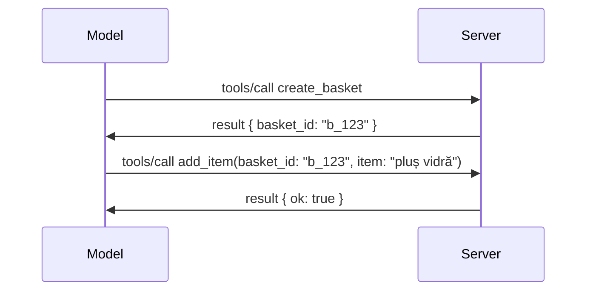

# Ce se schimbă în MCP: Candidatul la lansare 2026-07-28

> **Status:** Candidat la lansare. Specificația `2026-07-28` nu este finală la momentul scrierii. A fost anunțată pe 21 mai 2026 și este programată să fie lansată pe 28 iulie 2026. Tot ce este descris în această lecție se referă la candidatul la lansare; verificați [specificația în draft](https://modelcontextprotocol.io/specification/draft) și [jurnalul de modificări](https://modelcontextprotocol.io/specification/draft/changelog) pentru starea cea mai recentă înainte să construiți pe baza ei. Restul acestui curriculum este scris pe baza versiunii stabile curente, **Specificația MCP 2025-11-25**, și va fi actualizat după ce `2026-07-28` va fi lansată.

## Prezentare generală

`2026-07-28` este cea mai mare revizuire a MCP de la lansare. Șase Propuneri de Îmbunătățire a Specificației (SEP) elimină sesiunile la nivelul protocolului și fac MCP fără stare la nivelul transportului, extensiile devin un mecanism principal, versionat, iar mai multe caracteristici pe care le-ați învățat anterior în acest curriculum (Roots, Sampling, Logging) sunt marcate ca depreciate sub o nouă politică de ciclu de viață. Această lecție rezumă ce se schimbă, de ce contează și ce înseamnă pentru codul pe care deja l-ați scris pe baza `2025-11-25`.

Sursa: [Candidatul la lansarea specificației MCP 2026-07-28](https://blog.modelcontextprotocol.io/posts/2026-07-28-release-candidate/) (Blog Model Context Protocol, David Soria Parra și Den Delimarsky).

## Obiective de învățare

Până la finalul acestei lecții, veți putea:

- Explica de ce MCP trece la un nucleu de protocol fără stare și ce problemă rezolvă pentru implementările scalate orizontal.
- Descrie cum sunt înlocuite strângerea de mână `initialize`/`initialized` și antetul `Mcp-Session-Id`.
- Identifică noile antete `Mcp-Method` și `Mcp-Name` și metadata de cache `ttlMs`/`cacheScope`.
- Recunoaște cadrul Extensions și cele două extensii livrate cu această versiune: MCP Apps și Tasks.
- Listează cele șase SEP-uri de autorizare care întăresc alinierea la OAuth 2.0 / OIDC.
- Identifică care caracteristici de bază (Roots, Sampling, Logging) sunt acum depreciate și ce înseamnă asta în practică.
- Explica schimbarea completă la JSON Schema 2020-12 pentru inputSchema/outputSchema uneltelor.

## Un protocol fără stare

Schimbarea principală: MCP devine fără stare la nivelul protocolului.

### Înainte (2025-11-25): sesiunile te leagă de o singură instanță de server

Apelarea unui tool prin Streamable HTTP începe cu o strângere de mână `initialize`. Serverul răspunde cu un antet `Mcp-Session-Id` pe care fiecare cerere ulterioară trebuie să-l poarte:

```http
POST /mcp HTTP/1.1
Mcp-Session-Id: 1868a90c-3a3f-4f5b
Content-Type: application/json

{"jsonrpc":"2.0","id":2,"method":"tools/call",
 "params":{"name":"search","arguments":{"q":"otters"}}}
```

Deoarece sesiunea este legată de instanța de server care a emis-o, implementările scalate orizontal necesită **rutare sticky** la load balancer și un **depozit de sesiuni partajat** între instanțe.

### După (2026-07-28): fiecare cerere este autonomă

```http
POST /mcp HTTP/1.1
MCP-Protocol-Version: 2026-07-28
Mcp-Method: tools/call
Mcp-Name: search
Content-Type: application/json

{"jsonrpc":"2.0","id":1,"method":"tools/call",
 "params":{"name":"search","arguments":{"q":"otters"},
           "_meta":{"io.modelcontextprotocol/clientInfo":{"name":"my-app","version":"1.0"}}}}
```

Orice instanță de server poate procesa această cerere. Modificările cheie:

- **Strângerea de mână `initialize`/`initialized` este eliminată** ([SEP-2575](https://github.com/modelcontextprotocol/modelcontextprotocol/pull/2575)). Versiunea protocolului, informațiile clientului și capabilitățile clientului se mută în `_meta` pentru fiecare cerere. O metodă nouă `server/discover` le permite clienților să obțină capabilitățile serverului din timp, când au nevoie.
- **Antetul `Mcp-Session-Id` și sesiunea la nivel de protocol sunt eliminate** ([SEP-2567](https://github.com/modelcontextprotocol/modelcontextprotocol/pull/2567)). Rutarea sticky și depozitele de sesiuni partajate nu mai sunt necesare la nivel de protocol.

### Protocol fără stare, aplicații cu stare

Eliminarea sesiunii la nivel de protocol nu înseamnă că serverul tău nu poate avea stare. Modelul recomandat este același pe care API-urile HTTP l-au folosit întotdeauna: creezi un handle explicit (un `basket_id`, un `browser_id`) dintr-un apel la tool și modelul trece acest handle înapoi ca argument obișnuit în apelurile ulterioare.



Acest lucru face starea vizibilă și rezonabilă pentru model în loc să fie ascunsă în metadata de transport și permite oricărei instanțe de server să preia orice apel.

### Cereri server-către-client, restructurate

Un protocol fără stare are în continuare nevoie de o modalitate ca serverul să ceară ceva clientului pe parcursul unui apel (de exemplu, un prompt de elicitație):

- **Cererile inițiate de server pot fi emise doar în timp ce serverul procesează activ o cerere client** ([SEP-2260](https://github.com/modelcontextprotocol/modelcontextprotocol/pull/2260)) — anterior o recomandare, acum obligatoriu. Un utilizator nu este niciodată întrebat „din senin”.
- **Cereri multi runde** ([SEP-2322](https://github.com/modelcontextprotocol/modelcontextprotocol/pull/2322)) înlocuiesc menținerea deschisă a unui stream SSE. În schimb, serverul returnează un `InputRequiredResult`:

  ```json
  {
    "resultType": "inputRequired",
    "inputRequests": {
      "confirm": {
        "type": "elicitation",
        "message": "Delete 3 files?",
        "schema": { "type": "boolean" }
      }
    },
    "requestState": "eyJzdGVwIjoxLCJmaWxlcyI6WyJhIiwiYiIsImMiXX0="
  }
  ```

  Clientul colectează răspunsurile și re-emite apelul original cu `inputResponses` plus `requestState` reflectat. Orice instanță de server poate prelua retry-ul pentru că toată informația necesară este în payload.

### Rutabil, cache-abil, trasabil

Trei schimbări mai mici fac traficul fără stare mai ușor de operat:

- **Antetele `Mcp-Method` și `Mcp-Name` sunt obligatorii pe Streamable HTTP** ([SEP-2243](https://github.com/modelcontextprotocol/modelcontextprotocol/pull/2243)), astfel încât load balancers, gateway-uri și limitatoare de rată să poată ruta operația fără a inspecta corpul JSON. Serverele resping cererile în care antetele și corpul nu sunt în acord.
- **Rezultatele `tools/list` și citirile de resurse conțin `ttlMs` și `cacheScope`** ([SEP-2549](https://github.com/modelcontextprotocol/modelcontextprotocol/pull/2549)), modelate după HTTP `Cache-Control`. Clienții știu cât timp un rezultat de listă este proaspăt și dacă este sigur să fie partajat între utilizatori, fără a necesita un stream SSE de lungă durată pentru a afla modificările.
- **Propagarea contextului de trasabilitate W3C în `_meta` este documentată** ([SEP-414](https://github.com/modelcontextprotocol/modelcontextprotocol/pull/414)), fixând numele cheilor `traceparent`, `tracestate` și `baggage` pentru ca o urmare trasabilă distribuită să poată urmări un apel prin SDK-ul clientului, serverul MCP și sistemele downstream într-un backend compatibil [OpenTelemetry](https://opentelemetry.io/).

## Extensiile devin principale

Extensiile existau informal în `2025-11-25`. [SEP-2133](https://github.com/modelcontextprotocol/modelcontextprotocol/pull/2133) le formalizează:

- Extensiile sunt identificate prin ID-uri reverse-DNS.
- Sunt negociate printr-o hartă `extensions` pe capacitățile clientului și serverului.
- Conținutul lor este în propriile depozite `ext-*` cu mentori delegați și versionare independentă de specificația de bază.
- Un nou Track Extensions în procesul SEP le oferă o cale de la experimental la oficial.

Această lansare include două extensii oficiale.

### MCP Apps: interfețe utilizator renderizate pe server

[MCP Apps](https://blog.modelcontextprotocol.io/posts/2026-01-26-mcp-apps/) ([SEP-1865](https://github.com/modelcontextprotocol/modelcontextprotocol/pull/1865)) permite serverelor să trimită interfețe HTML interactive pe care gazdele le redau într-un iframe securizat. Uneltele declară șabloanele UI în avans, astfel încât gazdele pot prelua, cache-ui și revizui securitatea înainte să ruleze ceva. Ați acoperit deja fundamentele în [Lecția 15: MCP Apps](../03-GettingStarted/15-mcp-apps/README.md) — sub cadrul Extensions, MCP Apps este acum oficial o extensie, nu o caracteristică experimentală de bază.

### Tasks devin o extensie

Tasks a fost o caracteristică experimentală de bază în `2025-11-25`. Utilizarea în producție a evidențiat necesitatea unei reproiectări astfel încât locul potrivit este o extensie: [extensia Tasks](https://github.com/modelcontextprotocol/modelcontextprotocol/pull/2663) reformulează ciclul de viață în jurul modelului fără stare — un server poate răspunde `tools/call` cu un task handle, iar clientul îl conduce mai departe cu `tasks/get`, `tasks/update` și `tasks/cancel`. Crearea task-ului este dirijată de server: clientul anunță extensia, iar serverul decide când un apel trebuie să ruleze ca task. `tasks/list` este eliminat complet deoarece nu poate fi delimitar sigur fără sesiuni.

> **Notă de migrare:** dacă ați implementat API-ul experimenta `2025-11-25` Tasks, va trebui să migrați la noul ciclu de viață al extensiei — nu este compatibil retroactiv.

## Întărirea autorizării

Șase SEP-uri întăresc [specificația autorizării](https://modelcontextprotocol.io/specification/draft/basic/authorization) pentru a se alinia mai bine la implementările reale OAuth 2.0 / OpenID Connect:

| SEP | Schimbare |
|---|---|
| [SEP-2468](https://github.com/modelcontextprotocol/modelcontextprotocol/pull/2468) | Clienții trebuie să valideze parametrul `iss` în răspunsurile de autorizare conform [RFC 9207](https://www.rfc-editor.org/rfc/rfc9207), mitigând atacurile de mixare comune în tiparul MCP cu un singur client și mulți serveri. O versiune viitoare va impune respingerea răspunsurilor fără `iss`. |
| [SEP-837](https://github.com/modelcontextprotocol/modelcontextprotocol/pull/837) | Clienții declară `application_type` OpenID Connect înregistrării dinamice a clientului, evitând ca serverele de autorizare să considere implicit un client desktop/CLI ca `"web"` și să respingă URI-ul său de redirect localhost. |
| [SEP-2352](https://github.com/modelcontextprotocol/modelcontextprotocol/pull/2352) | Clienții leagă acreditările înregistrate de `issuer`-ul serverului de autorizare emitent și se reînregistrează atunci când o resursă migrează între servere de autorizare. |
| [SEP-2207](https://github.com/modelcontextprotocol/modelcontextprotocol/pull/2207) | Documentează modul de a solicita tokenuri de reîmprospătare de la servere de autorizare de tip OpenID Connect. |
| [SEP-2350](https://github.com/modelcontextprotocol/modelcontextprotocol/pull/2350) | Clarifică acumularea de scope-uri în timpul autorizării step-up. |
| [SEP-2351](https://github.com/modelcontextprotocol/modelcontextprotocol/pull/2351) | Clarifică sufixul de descoperire `.well-known`. |

Dacă dezvolți un server de autorizare pentru MCP astăzi, începe să furnizezi `iss` în răspunsurile de autorizare chiar acum — vezi [02-Security](../02-Security/README.md) pentru recomandările curente privind autorizarea pe care se va baza această schimbare.

## Roots, Sampling și Logging sunt depreciate

Sub noua [politică de ciclu de viață a caracteristicilor](https://github.com/modelcontextprotocol/modelcontextprotocol/pull/2577) ([SEP-2577](https://github.com/modelcontextprotocol/modelcontextprotocol/pull/2577)), trei primitive de bază pentru client pe care le-ați învățat în [Core Concepts](./README.md#roots) trec în starea **Depreciate**:

| Caracteristică | Înlocuitor recomandat |
|---|---|
| Roots | Parametrii uneltei, URI-uri de resurse sau configurarea serverului |
| Sampling | Integrare directă cu API-urile furnizorilor de LLM |
| Logging | `stderr` pentru transporturi stdio; OpenTelemetry pentru observabilitate structurată |

Acestea sunt **deprecieri doar prin anunț:** metodele, tipurile și flag-urile de capabilitate continuă să funcționeze în această versiune și în orice versiune a specificației publicată în termen de un an de la aceasta. Înlăturarea oricăruia dintre ele va necesita o SEP separată sub politica de ciclu a caracteristicilor — deci nimic nu se strică în exemplele voastre [Sampling](../03-GettingStarted/14-sampling/README.md) astăzi, dar serverele noi ar trebui să prefere modelele înlocuitoare de mai sus.

## JSON Schema complet 2020-12 pentru unelte

Tool `inputSchema` și `outputSchema` sunt actualizate la [JSON Schema 2020-12](https://json-schema.org/draft/2020-12) complet ([SEP-2106](https://github.com/modelcontextprotocol/modelcontextprotocol/pull/2106)):

- Schemele de input păstrează constrângerea rădăcină `type: "object"` dar acum permit compoziție (`oneOf`, `anyOf`, `allOf`), condiționale și referințe (`$ref`, `$defs`).
- Schemele de output sunt nelimitate, iar `structuredContent` poate fi orice valoare JSON, nu doar un obiect.
- Implementările nu trebuie să auto-dereferențieze URI-urile `$ref` externe și ar trebui să limiteze adâncimea schemei și timpul de validare (o considerație de tip denial-of-service dacă validați scheme server-side).

Separat, codul de eroare pentru resursa lipsă se schimbă de la `-32002` specific MCP la standardul JSON-RPC `-32602` (Invalid Params) ([SEP-2164](https://github.com/modelcontextprotocol/modelcontextprotocol/pull/2164)). Dacă clientul vostru face match pe valoarea literală `-32002`, va trebui să-l actualizați.

## Cum evoluează protocolul de aici înainte

Această lansare conține schimbări majore, pe care mentenanții MCP nu intenționează să le facă obișnuite pe viitor. Trei SEP-uri de guvernanță urmăresc să prevină o repetare:

- **Politica de ciclu de viață a caracteristicilor** oferă fiecărei caracteristici o cale Activă → Depreciată → Eliminată cu cel puțin douăsprezece luni între depreciere și primul moment posibil de eliminare.
- **Cadrul Extensions** permite noilor capabilități să apară ca extensii opționale și să se stabilizeze acolo înainte (dacă este cazul) să intre în specificația de bază.

- Un SEP pe traseul standardelor nu poate atinge statusul Final până când un scenariu corespunzător nu este inclus în [conformance suite](https://github.com/modelcontextprotocol/conformance) ([SEP-2484](https://github.com/modelcontextprotocol/modelcontextprotocol/pull/2484)) — aceeași suită cu care [sistemul de niveluri SDK](https://github.com/modelcontextprotocol/modelcontextprotocol/pull/1777) evaluează SDK-urile oficiale.

## Cronologia lansării și validarea

- Candidatul pentru lansare a fost blocat pe 21 mai 2026.
- Specificația finală este programată pentru 28 iulie 2026.
- Fereastra de zece săptămâni dintre cele două permite administratorilor SDK și implementatorilor clienți să valideze schimbările în funcție de sarcini reale; SDK-urile de Nivel 1 sunt așteptate să ofere suport în această fereastră în cadrul [sistemului de niveluri SDK](https://modelcontextprotocol.io/docs/sdk).
- Urmăriți setul complet de schimbări în [specificația în draft](https://modelcontextprotocol.io/specification/draft) și în [jurnalul de modificări](https://modelcontextprotocol.io/specification/draft/changelog).

## Ce înseamnă aceasta pentru acest curriculum

Tot ce ați învățat până acum în acest curs se adresează **2025-11-25**, care rămâne specificația stabilă curentă până la lansarea din `2026-07-28`. Concret:

- **Sesiunile și legătura `initialize`** (acoperite în [Core Concepts](./README.md) și [Lecția 6: HTTP Streaming](../03-GettingStarted/06-http-streaming/README.md)) funcționează în continuare așa cum sunt documentate astăzi, dar așteptați-vă să fie înlocuite de modelul fără stare de cerere de mai sus odată ce actualizați la SDK-uri compatibile cu `2026-07-28`.
- **Sampling și Roots** (de asemenea, acoperite în [Core Concepts](./README.md)) rămân complet funcționale, dar sunt depreciate — noile modele ar trebui să prefere tiparele de înlocuire enumerate mai sus.
- **Funcția experimentală Tasks**, dacă ați folosit-o, va trebui migrată la noul ciclu de viață al extensiei Tasks.
- **Aplicațiile MCP** ([Lecția 15](../03-GettingStarted/15-mcp-apps/README.md)) nu sunt afectate în practică; ele sunt doar plasate sub cadrul formal Extensions.

## Resurse suplimentare

- [Candidatul pentru Lansarea Specificației MCP 2026-07-28 (postare pe blog)](https://blog.modelcontextprotocol.io/posts/2026-07-28-release-candidate/)
- [Viitorul Transporturilor MCP](https://blog.modelcontextprotocol.io/posts/2025-12-19-mcp-transport-future/)
- [Specificatia Draft MCP](https://modelcontextprotocol.io/specification/draft)
- [Jurnalul de Modificări Draft MCP](https://modelcontextprotocol.io/specification/draft/changelog)
- [Ghiduri SEP](https://modelcontextprotocol.io/community/sep-guidelines)
- [Sistemul de Niveluri MCP SDK](https://modelcontextprotocol.io/docs/sdk)

## Pași următori

Întoarceți-vă la [Core Concepts](./README.md) sau continuați către [Securitate](../02-Security/README.md) pentru a vedea cum se reflectă ghidajul `2025-11-25` de azi asupra celor care urmează.

---

<!-- CO-OP TRANSLATOR DISCLAIMER START -->
**Declinare a responsabilității**:
Acest document a fost tradus folosind serviciul de traducere AI [Co-op Translator](https://github.com/Azure/co-op-translator). În timp ce ne străduim pentru acuratețe, vă rugăm să rețineți că traducerile automate pot conține erori sau inexactități. Documentul original în limba sa nativă trebuie considerat sursa autorizată. Pentru informații critice, se recomandă traducerea profesională realizată de un om. Nu ne asumăm responsabilitatea pentru eventualele neînțelegeri sau interpretări greșite care decurg din utilizarea acestei traduceri.
<!-- CO-OP TRANSLATOR DISCLAIMER END -->