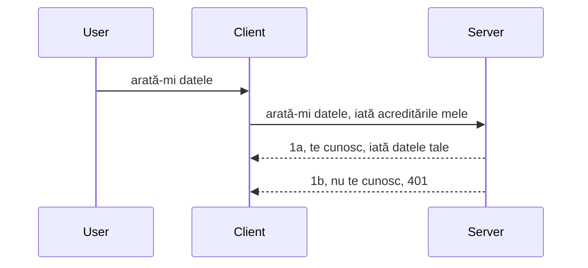

# Autentificare simplă

SDK-urile MCP suportă utilizarea OAuth 2.1, care, să fim corecți, este un proces destul de complex ce implică concepte precum server auth, server de resurse, trimiterea credențialelor, obținerea unui cod, schimbarea codului pentru un token bearer până când poți obține în sfârșit datele de resurse. Dacă nu ești obișnuit cu OAuth, care este un lucru grozav de implementat, este o idee bună să începi cu un nivel de autentificare de bază și să construiești treptat către o securitate tot mai bună. De aceea există acest capitol, pentru a te ajuta să avansezi spre autentificări mai avansate.

## Autentificare, ce înțelegem prin asta?

Autentificarea este prescurtarea de la autentificare și autorizare. Ideea este că trebuie să facem două lucruri:

- **Autentificare**, care este procesul de a afla dacă permitem unei persoane să intre în casa noastră, adică dacă au dreptul să fie "aici", adică să aibă acces la serverul nostru de resurse unde trăiesc funcționalitățile MCP Server.
- **Autorizare**, este procesul de a afla dacă un utilizator ar trebui să aibă acces la aceste resurse specifice pe care le cere, de exemplu aceste comenzi sau aceste produse sau dacă este permis să citească conținutul dar nu să șteargă, ca alt exemplu.

## Credențiale: cum spunem sistemului cine suntem

Ei bine, majoritatea dezvoltatorilor web încep să gândească în termeni de a oferi o credențială serverului, de obicei un secret care spune dacă au voie să fie aici „Autentificare”. Această credențială este de obicei o versiune codificată base64 a unui nume de utilizator și parolă sau o cheie API care identifică în mod unic un utilizator specific.

Aceasta implică trimiterea printr-un header numit „Authorization”, astfel:

```json
{ "Authorization": "secret123" }
```

Aceasta este de obicei denumită autentificare de bază. Cum funcționează apoi fluxul general este în felul următor:



Acum că înțelegem cum funcționează din punct de vedere al fluxului, cum o implementăm? Ei bine, majoritatea serverelor web au un concept numit middleware, o bucată de cod care rulează ca parte a cererii și poate verifica credențialele și, dacă acestea sunt valide, permite cererii să treacă. Dacă cererea nu are credențiale valide, obții o eroare de autentificare. Să vedem cum se poate implementa asta:

**Python**

```python
class AuthMiddleware(BaseHTTPMiddleware):
    async def dispatch(self, request, call_next):

        has_header = request.headers.get("Authorization")
        if not has_header:
            print("-> Missing Authorization header!")
            return Response(status_code=401, content="Unauthorized")

        if not valid_token(has_header):
            print("-> Invalid token!")
            return Response(status_code=403, content="Forbidden")

        print("Valid token, proceeding...")
       
        response = await call_next(request)
        # adaugă orice anteturi pentru client sau modifică în vreun fel răspunsul
        return response


starlette_app.add_middleware(CustomHeaderMiddleware)
```

Aici avem:

- Creat un middleware numit `AuthMiddleware` unde metoda sa `dispatch` este apelată de serverul web.
- Adăugat middleware-ul la serverul web:

    ```python
    starlette_app.add_middleware(AuthMiddleware)
    ```

- Scris logica de validare care verifică dacă header-ul Authorization este prezent și dacă secretul trimis este valid:

    ```python
    has_header = request.headers.get("Authorization")
    if not has_header:
        print("-> Missing Authorization header!")
        return Response(status_code=401, content="Unauthorized")

    if not valid_token(has_header):
        print("-> Invalid token!")
        return Response(status_code=403, content="Forbidden")
    ```

    dacă secretul este prezent și valid, atunci lăsăm cererea să treacă apelând `call_next` și returnăm răspunsul.

    ```python
    response = await call_next(request)
    # adaugă orice anteturi personalizate sau modifică răspunsul într-un fel
    return response
    ```

Cum funcționează este că dacă o cerere web este făcută către server, middleware-ul va fi invocat și, dată fiind implementarea, fie va lăsa cererea să treacă, fie va returna o eroare care indică faptul că clientul nu are permisiunea să continue.

**TypeScript**

Aici creăm un middleware cu framework-ul popular Express și interceptăm cererea înainte să ajungă la MCP Server. Iată codul pentru asta:

```typescript
function isValid(secret) {
    return secret === "secret123";
}

app.use((req, res, next) => {
    // 1. Headerul de autorizare este prezent?
    if(!req.headers["Authorization"]) {
        res.status(401).send('Unauthorized');
    }
    
    let token = req.headers["Authorization"];

    // 2. Verifică validitatea.
    if(!isValid(token)) {
        res.status(403).send('Forbidden');
    }

   
    console.log('Middleware executed');
    // 3. Trimite cererea la pasul următor în fluxul de procesare a cererilor.
    next();
});
```

În acest cod:

1. Verificăm dacă header-ul Authorization este prezent, dacă nu, trimitem o eroare 401.
2. Asigurăm că credențiala/tokenul este valid, dacă nu, trimitem o eroare 403.
3. În final, permite cererea în pipeline și returnează resursa solicitată.

## Exercițiu: Implementați autentificarea

Să ne folosim cunoștințele și să încercăm să implementăm. Iată planul:

Server

- Creăm un server web și o instanță MCP.
- Implementăm un middleware pentru server.

Client

- Trimitem cerere web, cu credențială, prin header.

### -1- Crearea unui server web și a unei instanțe MCP

> **Privind înainte:** exemplul de mai jos TypeScript urmărește transporturile HTTP într-o mapă `transports` indexată după `mcp-session-id`, conform **Specificației MCP 2025-11-25**. Candidatul la lansare `2026-07-28` elimină handshake-ul `initialize` și ID-ul sesiunii totalmente, deci această mapă per sesiune dispare în favoarea cererilor stateless, auto-conținute. Consultați [Ce se schimbă în MCP: candidatul la lansare 2026-07-28](../../01-CoreConcepts/mcp-2026-07-28-release-candidate.md).

În primul nostru pas, trebuie să creăm instanța serverului web și MCP Server.

**Python**

Aici creăm o instanță MCP server, creăm o aplicație web starlette și o găzduim cu uvicorn.

```python
# crearea serverului MCP

app = FastMCP(
    name="MCP Resource Server",
    instructions="Resource Server that validates tokens via Authorization Server introspection",
    host=settings["host"],
    port=settings["port"],
    debug=True
)

# crearea aplicației web starlette
starlette_app = app.streamable_http_app()

# servirea aplicației prin uvicorn
async def run(starlette_app):
    import uvicorn
    config = uvicorn.Config(
            starlette_app,
            host=app.settings.host,
            port=app.settings.port,
            log_level=app.settings.log_level.lower(),
        )
    server = uvicorn.Server(config)
    await server.serve()

run(starlette_app)
```

În acest cod:

- Creăm MCP Server.
- Construim aplicația web starlette din MCP Server, `app.streamable_http_app()`.
- Găzduim și servim aplicația web folosind uvicorn `server.serve()`.

**TypeScript**

Aici creăm o instanță MCP Server.

```typescript
const server = new McpServer({
      name: "example-server",
      version: "1.0.0"
    });

    // ... configurați resursele serverului, instrumentele și comenzile ...
```

Această creare a MCP Server trebuie să se întâmple în definiția rutei POST /mcp, deci să mutăm codul de mai sus astfel:

```typescript
import express from "express";
import { randomUUID } from "node:crypto";
import { McpServer } from "@modelcontextprotocol/sdk/server/mcp.js";
import { StreamableHTTPServerTransport } from "@modelcontextprotocol/sdk/server/streamableHttp.js";
import { isInitializeRequest } from "@modelcontextprotocol/sdk/types.js"

const app = express();
app.use(express.json());

// Harta pentru a stoca transporturile după ID-ul sesiunii
const transports: { [sessionId: string]: StreamableHTTPServerTransport } = {};

// Gestionați cererile POST pentru comunicarea client-server
app.post('/mcp', async (req, res) => {
  // Verificați existența ID-ului sesiunii
  const sessionId = req.headers['mcp-session-id'] as string | undefined;
  let transport: StreamableHTTPServerTransport;

  if (sessionId && transports[sessionId]) {
    // Reutilizați transportul existent
    transport = transports[sessionId];
  } else if (!sessionId && isInitializeRequest(req.body)) {
    // Cerere nouă de inițializare
    transport = new StreamableHTTPServerTransport({
      sessionIdGenerator: () => randomUUID(),
      onsessioninitialized: (sessionId) => {
        // Stocați transportul după ID-ul sesiunii
        transports[sessionId] = transport;
      },
      // Protecția împotriva rebinding-ului DNS este dezactivată implicit pentru compatibilitate inversă. Dacă rulați acest server
      // local, asigurați-vă că setați:
      // enableDnsRebindingProtection: true,
      // allowedHosts: ['127.0.0.1'],
    });

    // Curățați transportul când este închis
    transport.onclose = () => {
      if (transport.sessionId) {
        delete transports[transport.sessionId];
      }
    };
    const server = new McpServer({
      name: "example-server",
      version: "1.0.0"
    });

    // ... configurați resursele serverului, uneltele și prompturile ...

    // Conectați-vă la serverul MCP
    await server.connect(transport);
  } else {
    // Cerere invalidă
    res.status(400).json({
      jsonrpc: '2.0',
      error: {
        code: -32000,
        message: 'Bad Request: No valid session ID provided',
      },
      id: null,
    });
    return;
  }

  // Gestionează cererea
  await transport.handleRequest(req, res, req.body);
});

// Handler reutilizabil pentru cererile GET și DELETE
const handleSessionRequest = async (req: express.Request, res: express.Response) => {
  const sessionId = req.headers['mcp-session-id'] as string | undefined;
  if (!sessionId || !transports[sessionId]) {
    res.status(400).send('Invalid or missing session ID');
    return;
  }
  
  const transport = transports[sessionId];
  await transport.handleRequest(req, res);
};

// Gestionează cererile GET pentru notificări server-către-client prin SSE
app.get('/mcp', handleSessionRequest);

// Gestionează cererile DELETE pentru terminarea sesiunii
app.delete('/mcp', handleSessionRequest);

app.listen(3000);
```

Acum vezi cum crearea MCP Server a fost mutată în cadrul `app.post("/mcp")`.

Hai să trecem la pasul următor de creare a middleware-ului pentru a valida credențiala primită.

### -2- Implementarea unui middleware pentru server

Să trecem la partea de middleware. Aici vom crea un middleware care caută o credențială în header-ul `Authorization` și o validează. Dacă e acceptabilă, cererea va continua să facă ceea ce trebuie (de ex., listarea uneltelor, citirea unei resurse sau orice altă funcționalitate MCP pe care clientul o cere).

**Python**

Pentru a crea middleware-ul, trebuie să creăm o clasă care moștenește `BaseHTTPMiddleware`. Sunt două elemente interesante:

- Cererea `request`, din care citim informațiile din header.
- `call_next`, callback-ul pe care trebuie să-l apelăm dacă clientul a adus o credențială pe care o acceptăm.

Mai întâi, trebuie să gestionăm cazul în care header-ul `Authorization` lipsește:

```python
has_header = request.headers.get("Authorization")

# nu există antet, eșuează cu 401, altfel continuă.
if not has_header:
    print("-> Missing Authorization header!")
    return Response(status_code=401, content="Unauthorized")
```

Aici trimitem un mesaj 401 unauthorized pentru că clientul nu trece autentificarea.

Apoi, dacă o credențială a fost trimisă, trebuie să verificăm validitatea ei astfel:

```python
 if not valid_token(has_header):
    print("-> Invalid token!")
    return Response(status_code=403, content="Forbidden")
```

Observă cum trimitem un mesaj 403 forbidden mai sus. Să vedem middleware-ul complet mai jos implementând tot ce am descris:

```python
class AuthMiddleware(BaseHTTPMiddleware):
    async def dispatch(self, request, call_next):

        has_header = request.headers.get("Authorization")
        if not has_header:
            print("-> Missing Authorization header!")
            return Response(status_code=401, content="Unauthorized")

        if not valid_token(has_header):
            print("-> Invalid token!")
            return Response(status_code=403, content="Forbidden")

        print("Valid token, proceeding...")
        print(f"-> Received {request.method} {request.url}")
        response = await call_next(request)
        response.headers['Custom'] = 'Example'
        return response

```

Foarte bine, dar ce face funcția `valid_token`? Iată-o mai jos:

```python
# NU folosiți pentru producție - îmbunătățiți-l !!
def valid_token(token: str) -> bool:
    # eliminați prefixul "Bearer "
    if token.startswith("Bearer "):
        token = token[7:]
        return token == "secret-token"
    return False
```

Evident, acest lucru ar trebui să fie îmbunătățit.

IMPORTANT: Nu ar trebui NICIODATĂ să ai astfel de secrete în cod. Ideal ar fi să preiei valoarea pentru comparație dintr-o sursă de date sau de la un IDP (provider de identitate) sau mai bine, să lași IDP să facă validarea.

**TypeScript**

Pentru a implementa asta cu Express, trebuie să apelăm metoda `use` care ia funcții de middleware.

Trebuie să:

- Interacționăm cu variabila cerere pentru a verifica credențiala transmisă în proprietatea `Authorization`.
- Validăm credențiala și dacă este validă, permitem cererii să continue și solicitarea MCP a clientului să facă ce trebuie (de ex., listarea uneltelor, citirea unei resurse sau orice altceva legat de MCP).

Aici verificăm dacă header-ul `Authorization` este prezent și dacă nu, oprim cererea să treacă:

```typescript
if(!req.headers["authorization"]) {
    res.status(401).send('Unauthorized');
    return;
}
```

Dacă header-ul nu este trimis deloc, primești 401.

Apoi verificăm dacă credențiala este validă, dacă nu oprim din nou cererea, dar cu un mesaj ușor diferit:

```typescript
if(!isValid(token)) {
    res.status(403).send('Forbidden');
    return;
} 
```

Observă cum acum primești o eroare 403.

Iată codul complet:

```typescript
app.use((req, res, next) => {
    console.log('Request received:', req.method, req.url, req.headers);
    console.log('Headers:', req.headers["authorization"]);
    if(!req.headers["authorization"]) {
        res.status(401).send('Unauthorized');
        return;
    }
    
    let token = req.headers["authorization"];

    if(!isValid(token)) {
        res.status(403).send('Forbidden');
        return;
    }  

    console.log('Middleware executed');
    next();
});
```

Am configurat serverul web să accepte un middleware care verifică credențiala pe care clientul, sperăm, ne-o trimite. Ce facem cu clientul însuși?

### -3- Trimite cerere web cu credențială prin header

Trebuie să ne asigurăm că clientul transmite credențiala prin header. Deoarece vom folosi un client MCP pentru asta, trebuie să aflăm cum se face.

**Python**

Pentru client, trebuie să transmitem un header cu acea credențială astfel:

```python
# NU codifica valoarea direct, cel puțin să fie într-o variabilă de mediu sau un depozit mai sigur
token = "secret-token"

async with streamablehttp_client(
        url = f"http://localhost:{port}/mcp",
        headers = {"Authorization": f"Bearer {token}"}
    ) as (
        read_stream,
        write_stream,
        session_callback,
    ):
        async with ClientSession(
            read_stream,
            write_stream
        ) as session:
            await session.initialize()
      
            # TODO, ce dorești să faci în client, de ex. listarea uneltelor, apelarea uneltelor etc.
```

Observă cum completăm proprietatea `headers`, astfel ` headers = {"Authorization": f"Bearer {token}"}`.

**TypeScript**

Putem rezolva asta în doi pași:

1. Completăm un obiect de configurare cu credențiala noastră.
2. Transmitem obiectul de configurare transportului.

```typescript

// NU codifica valoarea direct așa cum este arătat aici. Cel puțin să fie o variabilă de mediu și folosește ceva de genul dotenv (în modul dev).
let token = "secret123"

// definește un obiect de opțiuni pentru transportul clientului
let options: StreamableHTTPClientTransportOptions = {
  sessionId: sessionId,
  requestInit: {
    headers: {
      "Authorization": "secret123"
    }
  }
};

// trece obiectul de opțiuni la transport
async function main() {
   const transport = new StreamableHTTPClientTransport(
      new URL(serverUrl),
      options
   );
```

Aici vezi mai sus cum a trebuit să creăm un obiect `options` și să punem header-urile sub proprietatea `requestInit`.

IMPORTANT: Cum îl îmbunătățim de aici? Ei bine, implementarea curentă are unele probleme. În primul rând, trimiterea unei credențiale așa este destul de riscantă decât dacă ai cel puțin HTTPS. Chiar și așa, credențiala poate fi furată, deci ai nevoie de un sistem unde poți revoca ușor tokenul și poți adăuga verificări suplimentare, precum de unde vine cererea, se întâmplă cererea prea des (comportament bot), pe scurt, sunt multe preocupări.

Totuși, trebuie spus că pentru API-uri foarte simple unde nu vrei ca oricine să apeleze API-ul fără autentificare, ceea ce avem aici este un bun început.

Cu asta spus, să încercăm să întărim securitatea puțin folosind un format standardizat precum JSON Web Token, cunoscut și ca JWT sau "JOT" tokens.

## JSON Web Tokens, JWT

Deci, încercăm să îmbunătățim lucrurile față de simpla trimitere a unor credențiale. Care sunt îmbunătățirile imediate pe care le aduce adoptarea JWT?

- **Îmbunătățiri de securitate**. În autentificarea de bază, trimiți numele de utilizator și parola ca un token codificat base64 (sau o cheie API) mereu, ceea ce crește riscul. Cu JWT, trimiți username-ul și parola și primești înapoi un token care este și limitat în timp, adică expiră. JWT îți permite să folosești control de acces detaliat folosind roluri, domenii și permisiuni.
- **Statelessness și scalabilitate**. JWT-urile sunt auto-conținute, transportă toată informația utilizatorului și elimină necesitatea de a stoca sesiuneserver-side. Tokenul poate fi validat local.
- **Interoperabilitate și federație**. JWT este central în Open ID Connect și este folosit cu furnizori de identitate cunoscuți precum Entra ID, Google Identity și Auth0. De asemenea, fac posibile single sign-on-ul și multe altele, oferind nivel enterprise.
- **Modularitate și flexibilitate**. JWT-urile pot fi folosite și cu API Gateways precum Azure API Management, NGINX și altele. Suportă scenarii de autentificare și comunicații server-to-service, inclusiv impersonare și delegare.
- **Performanță și caching**. JWT-urile pot fi puse în cache după decodare, ceea ce reduce nevoia de parsing. Acest lucru ajută în special la aplicațiile cu trafic mare, îmbunătățind throughput-ul și reducând încărcarea asupra infrastructurii alese.
- **Funcționalități avansate**. Suportă și introspecție (verificarea valabilității pe server) și revocare (anularea unui token).

Cu toate aceste beneficii, să vedem cum putem duce implementarea noastră la nivelul următor.

## Transformarea autentificării de bază în JWT

Deci, schimbările pe care trebuie să le facem la nivel înalt sunt:

- **Învățăm să construim un token JWT** și să-l pregătim pentru a fi trimis de la client la server.
- **Validăm un token JWT**, iar dacă este valid, permitem clientului să acceseze resursele noastre.
- **Stocarea securizată a tokenului**. Cum stocăm acest token.
- **Protejăm rutele**. Trebuie să protejăm rutele, în cazul nostru, trebuie protejate rutele și funcționalitățile MCP specifice.
- **Adăugăm tokenuri de refresh**. Să creăm tokenuri cu durată de viață scurtă și tokenuri de refresh cu durată lungă care pot fi folosite pentru a obține tokenuri noi dacă expiră. De asemenea, să existe un endpoint de refresh și o strategie de rotație.

### -1- Construirea unui token JWT

În primul rând, un token JWT are următoarele părți:

- **header**, algoritmul folosit și tipul tokenului.
- **payload**, declarații (claims), precum sub (utilizatorul sau entitatea pe care tokenul o reprezintă. Într-un scenariu auth acesta este de obicei userid-ul), exp (când expiră), role (rolul)
- **semnătură**, semnată cu un secret sau cheie privată.

Pentru asta, trebuie să construim header-ul, payload-ul și tokenul codificat.

**Python**

```python

import jwt
import jwt
from jwt.exceptions import ExpiredSignatureError, InvalidTokenError
import datetime

# Cheia secretă folosită pentru a semna JWT-ul
secret_key = 'your-secret-key'

header = {
    "alg": "HS256",
    "typ": "JWT"
}

# informațiile utilizatorului, revendicările și timpul de expirare
payload = {
    "sub": "1234567890",               # Subiect (ID-ul utilizatorului)
    "name": "User Userson",                # Revendicare personalizată
    "admin": True,                     # Revendicare personalizată
    "iat": datetime.datetime.utcnow(),# Emis la
    "exp": datetime.datetime.utcnow() + datetime.timedelta(hours=1)  # Expirare
}

# îl codifică
encoded_jwt = jwt.encode(payload, secret_key, algorithm="HS256", headers=header)
```

În codul de mai sus am:

- Definit un header folosind HS256 ca algoritm și tipul să fie JWT.
- Construim un payload care conține un subiect sau id-ul utilizatorului, un nume de utilizator, un rol, când a fost emis și când expiră, implementând astfel aspectul limitării în timp menționat anterior.

**TypeScript**

Aici vom avea nevoie de niște dependințe care ne vor ajuta să construim tokenul JWT.

Dependințe

```sh

npm install jsonwebtoken
npm install --save-dev @types/jsonwebtoken
```

Acum că avem asta pregătit, să creăm header-ul, payload-ul și prin ele să generăm tokenul codificat.

```typescript
import jwt from 'jsonwebtoken';

const secretKey = 'your-secret-key'; // Folosește variabile de mediu în producție

// Definește payload-ul
const payload = {
  sub: '1234567890',
  name: 'User usersson',
  admin: true,
  iat: Math.floor(Date.now() / 1000), // Emis la
  exp: Math.floor(Date.now() / 1000) + 60 * 60 // Expiră în 1 oră
};

// Definește antetul (opțional, jsonwebtoken setează valori implicite)
const header = {
  alg: 'HS256',
  typ: 'JWT'
};

// Creează tokenul
const token = jwt.sign(payload, secretKey, {
  algorithm: 'HS256',
  header: header
});

console.log('JWT:', token);
```

Acest token este:

Semnat folosind HS256
Valabil timp de 1 oră
Include declarații precum sub, name, admin, iat și exp.

### -2- Validarea unui token

Trebuie, de asemenea, să validăm un token, lucru pe care ar trebui să-l facem pe server pentru a ne asigura că ceea ce clientul ne trimite este într-adevăr valid. Sunt multe verificări pe care ar trebui să le facem, de la validarea structurii sale la valabilitatea lui. De asemenea, e recomandat să adăugăm alte verificări, cum ar fi dacă utilizatorul există în sistemul tău și altele.

Pentru a valida un token, trebuie să-l decodăm ca să-l putem citi și apoi să începem verificările de valabilitate:

**Python**

```python

# Decodează și verifică JWT-ul
try:
    decoded = jwt.decode(token, secret_key, algorithms=["HS256"])
    print("✅ Token is valid.")
    print("Decoded claims:")
    for key, value in decoded.items():
        print(f"  {key}: {value}")
except ExpiredSignatureError:
    print("❌ Token has expired.")
except InvalidTokenError as e:
    print(f"❌ Invalid token: {e}")

```


În acest cod, apelăm `jwt.decode` folosind tokenul, cheia secretă și algoritmul ales ca input. Observați cum folosim o construcție try-catch deoarece o validare eșuată duce la ridicarea unei erori.

**TypeScript**

Aici trebuie să apelăm `jwt.verify` pentru a obține o versiune decodificată a tokenului pe care o putem analiza în continuare. Dacă acest apel eșuează, înseamnă că structura tokenului este incorectă sau nu mai este valid.

```typescript

try {
  const decoded = jwt.verify(token, secretKey);
  console.log('Decoded Payload:', decoded);
} catch (err) {
  console.error('Token verification failed:', err);
}
```

NOTĂ: după cum s-a menționat anterior, ar trebui să efectuăm verificări suplimentare pentru a ne asigura că acest token indică un utilizator din sistemul nostru și să ne asigurăm că utilizatorul are drepturile pe care le pretinde.

Următorul pas este să explorăm controlul accesului bazat pe roluri, cunoscut și ca RBAC.

## Adăugarea controlului accesului bazat pe roluri

Ideea este că vrem să exprimăm faptul că diferitele roluri au permisiuni diferite. De exemplu, presupunem că un admin poate face totul, iar un utilizator normal poate doar citi/scrie, iar un oaspete poate doar citi. Prin urmare, aici sunt câteva niveluri posibile de permisiuni:

- Admin.Write 
- User.Read
- Guest.Read

Să vedem cum putem implementa un astfel de control cu middleware. Middleware-urile pot fi adăugate pe fiecare rută sau pentru toate rutele.

**Python**

```python
from starlette.middleware.base import BaseHTTPMiddleware
from starlette.responses import JSONResponse
import jwt

# NU aveți secretul în cod, acesta este doar pentru demonstrație. Citiți-l dintr-un loc sigur.
SECRET_KEY = "your-secret-key" # pune acest lucru într-o variabilă de mediu
REQUIRED_PERMISSION = "User.Read"

class JWTPermissionMiddleware(BaseHTTPMiddleware):
    async def dispatch(self, request, call_next):
        auth_header = request.headers.get("Authorization")
        if not auth_header or not auth_header.startswith("Bearer "):
            return JSONResponse({"error": "Missing or invalid Authorization header"}, status_code=401)

        token = auth_header.split(" ")[1]
        try:
            decoded = jwt.decode(token, SECRET_KEY, algorithms=["HS256"])
        except jwt.ExpiredSignatureError:
            return JSONResponse({"error": "Token expired"}, status_code=401)
        except jwt.InvalidTokenError:
            return JSONResponse({"error": "Invalid token"}, status_code=401)

        permissions = decoded.get("permissions", [])
        if REQUIRED_PERMISSION not in permissions:
            return JSONResponse({"error": "Permission denied"}, status_code=403)

        request.state.user = decoded
        return await call_next(request)


```

Există câteva moduri diferite de a adăuga middleware ca mai jos:

```python

# Alt 1: adaugă middleware în timp ce construiești aplicația starlette
middleware = [
    Middleware(JWTPermissionMiddleware)
]

app = Starlette(routes=routes, middleware=middleware)

# Alt 2: adaugă middleware după ce aplicația starlette a fost deja construită
starlette_app.add_middleware(JWTPermissionMiddleware)

# Alt 3: adaugă middleware pentru fiecare rută
routes = [
    Route(
        "/mcp",
        endpoint=..., # handler
        middleware=[Middleware(JWTPermissionMiddleware)]
    )
]
```

**TypeScript**

Putem folosi `app.use` și un middleware care va rula pentru toate cererile.

```typescript
app.use((req, res, next) => {
    console.log('Request received:', req.method, req.url, req.headers);
    console.log('Headers:', req.headers["authorization"]);

    // 1. Verifică dacă antetul de autorizare a fost trimis

    if(!req.headers["authorization"]) {
        res.status(401).send('Unauthorized');
        return;
    }
    
    let token = req.headers["authorization"];

    // 2. Verifică dacă tokenul este valid
    if(!isValid(token)) {
        res.status(403).send('Forbidden');
        return;
    }  

    // 3. Verifică dacă utilizatorul tokenului există în sistemul nostru
    if(!isExistingUser(token)) {
        res.status(403).send('Forbidden');
        console.log("User does not exist");
        return;
    }
    console.log("User exists");

    // 4. Verifică dacă tokenul are permisiunile corecte
    if(!hasScopes(token, ["User.Read"])){
        res.status(403).send('Forbidden - insufficient scopes');
    }

    console.log("User has required scopes");

    console.log('Middleware executed');
    next();
});

```

Sunt câteva lucruri pe care middleware-ul nostru ar trebui să le facă, și anume:

1. Verifică dacă există header-ul de autorizare
2. Verifică dacă tokenul este valid, apelăm `isValid` care este o metodă scrisă de noi ce verifică integritatea și validitatea tokenului JWT.
3. Verifică dacă utilizatorul există în sistemul nostru, ceea ce trebuie să verificăm.

   ```typescript
    // utilizatori în DB
   const users = [
     "user1",
     "User usersson",
   ]

   function isExistingUser(token) {
     let decodedToken = verifyToken(token);

     // DE FACUT, verifică dacă utilizatorul există în DB
     return users.includes(decodedToken?.name || "");
   }
   ```

   Mai sus, am creat o listă foarte simplă `users`, care evident ar trebui să fie într-o bază de date.

4. În plus, ar trebui să verificăm și dacă tokenul are permisiunile corecte.

   ```typescript
   if(!hasScopes(token, ["User.Read"])){
        res.status(403).send('Forbidden - insufficient scopes');
   }
   ```

   În codul de mai sus din middleware, verificăm că tokenul conține permisiunea User.Read, altfel returnăm o eroare 403. Mai jos este metoda helper `hasScopes`.

   ```typescript
   function hasScopes(scope: string, requiredScopes: string[]) {
     let decodedToken = verifyToken(scope);
    return requiredScopes.every(scope => decodedToken?.scopes.includes(scope));
  }
   ```

Have a think which additional checks you should be doing, but these are the absolute minimum of checks you should be doing.

Using Express as a web framework is a common choice. There are helpers library when you use JWT so you can write less code.

- `express-jwt`, helper library that provides a middleware that helps decode your token.
- `express-jwt-permissions`, this provides a middleware `guard` that helps check if a certain permission is on the token.

Here's what these libraries can look like when used:

```typescript
const express = require('express');
const jwt = require('express-jwt');
const guard = require('express-jwt-permissions')();

const app = express();
const secretKey = 'your-secret-key'; // put this in env variable

// Decode JWT and attach to req.user
app.use(jwt({ secret: secretKey, algorithms: ['HS256'] }));

// Check for User.Read permission
app.use(guard.check('User.Read'));

// multiple permissions
// app.use(guard.check(['User.Read', 'Admin.Access']));

app.get('/protected', (req, res) => {
  res.json({ message: `Welcome ${req.user.name}` });
});

// Error handler
app.use((err, req, res, next) => {
  if (err.code === 'permission_denied') {
    return res.status(403).send('Forbidden');
  }
  next(err);
});

```

Acum ați văzut cum middleware-ul poate fi folosit atât pentru autentificare, cât și pentru autorizare, dar cum rămâne cu MCP? Schimbă acesta modul în care facem autentificarea? Să aflăm în secțiunea următoare.

### -3- Adăugarea RBAC la MCP

Până acum ați văzut cum se poate adăuga RBAC prin middleware, însă pentru MCP nu există o modalitate ușoară de a adăuga RBAC per funcționalitate MCP, așadar ce facem? Ei bine, trebuie să adăugăm un cod ca acesta care verifică, în acest caz, dacă clientul are drepturile să apeleze un anumit instrument:

Aveți câteva opțiuni diferite pentru a realiza RBAC per funcționalitate, iată câteva dintre ele:

- Adăugați o verificare pentru fiecare instrument, resursă, prompt unde trebuie să verificați nivelul de permisiune.

   **python**

   ```python
   @tool()
   def delete_product(id: int):
      try:
          check_permissions(role="Admin.Write", request)
      catch:
        pass # clientul a eșuat autorizarea, generează eroare de autorizare
   ```

   **typescript**

   ```typescript
   server.registerTool(
    "delete-product",
    {
      title: Delete a product",
      description: "Deletes a product",
      inputSchema: { id: z.number() }
    },
    async ({ id }) => {
      
      try {
        checkPermissions("Admin.Write", request);
        // de făcut, trimite id la productService și intrarea la distanță
      } catch(Exception e) {
        console.log("Authorization error, you're not allowed");  
      }

      return {
        content: [{ type: "text", text: `Deletected product with id ${id}` }]
      };
    }
   );
   ```


- Folosiți o abordare avansată de server și handler-e de cereri pentru a minimiza numărul de locuri în care trebuie să faceți verificarea.

   **Python**

   ```python
   
   tool_permission = {
      "create_product": ["User.Write", "Admin.Write"],
      "delete_product": ["Admin.Write"]
   }

   def has_permission(user_permissions, required_permissions) -> bool:
      # user_permissions: lista de permisiuni pe care utilizatorul le are
      # required_permissions: lista de permisiuni necesare pentru unealtă
      return any(perm in user_permissions for perm in required_permissions)

   @server.call_tool()
   async def handle_call_tool(
     name: str, arguments: dict[str, str] | None
   ) -> list[types.TextContent]:
    # Presupunem că request.user.permissions este o listă de permisiuni pentru utilizator
     user_permissions = request.user.permissions
     required_permissions = tool_permission.get(name, [])
     if not has_permission(user_permissions, required_permissions):
        # Aruncă eroare "Nu aveți permisiunea să apelați unealta {name}"
        raise Exception(f"You don't have permission to call tool {name}")
     # continuă și apelează unealta
     # ...
   ```   
   

   **TypeScript**

   ```typescript
   function hasPermission(userPermissions: string[], requiredPermissions: string[]): boolean {
       if (!Array.isArray(userPermissions) || !Array.isArray(requiredPermissions)) return false;
       // Returnează true dacă utilizatorul are cel puțin o permisiune necesară
       
       return requiredPermissions.some(perm => userPermissions.includes(perm));
   }
  
   server.setRequestHandler(CallToolRequestSchema, async (request) => {
      const { params: { name } } = request;
  
      let permissions = request.user.permissions;
  
      if (!hasPermission(permissions, toolPermissions[name])) {
         return new Error(`You don't have permission to call ${name}`);
      }
  
      // continuă..
   });
   ```

   Notă, trebuie să vă asigurați că middleware-ul atribuie tokenul decodificat proprietății user a cererii astfel încât codul de mai sus să fie simplu.

### Recapitulare

Acum că am discutat cum să adăugăm suport pentru RBAC în general și pentru MCP în particular, este timpul să încercați să implementați securitatea pe cont propriu pentru a vă asigura că ați înțeles conceptele prezentate.

## Tema 1: Construiește un server MCP și un client MCP folosind autentificare de bază

Aici veți folosi ceea ce ați învățat despre trimiterea credențialelor prin header-e.

## Soluția 1

[Solution 1](./code/basic/README.md)

## Tema 2: Actualizează soluția din Tema 1 pentru a folosi JWT

Luați prima soluție, dar de data aceasta, să o îmbunătățim.

În loc să folosiți Basic Auth, să folosim JWT.

## Soluția 2

[Solution 2](./solution/jwt-solution/README.md)

## Provocare

Adăugați RBAC per instrument așa cum am descris în secțiunea "Add RBAC to MCP".

## Rezumat

Sperăm că ați învățat multe în acest capitol, de la lipsa totală a securității, la securitatea de bază, la JWT și cum poate fi adăugat în MCP.

Am construit o bază solidă folosind JWT-uri personalizate, dar pe măsură ce scalăm ne îndreptăm către un model de identitate bazat pe standarde. Adoptarea unui IdP precum Entra sau Keycloak ne permite să externalizăm emiterea tokenurilor, validarea și gestionarea ciclului de viață către o platformă de încredere — eliberându-ne să ne concentrăm pe logica aplicației și experiența utilizatorului.

Pentru asta, avem un [capitol mai avansat despre Entra](../../05-AdvancedTopics/mcp-security-entra/README.md)

## Ce urmează

- Următorul: [Setarea gazdelor MCP](../12-mcp-hosts/README.md)

---

<!-- CO-OP TRANSLATOR DISCLAIMER START -->
**Declinare a responsabilității**:
Acest document a fost tradus folosind serviciul de traducere AI [Co-op Translator](https://github.com/Azure/co-op-translator). În timp ce ne străduim pentru acuratețe, vă rugăm să rețineți că traducerile automate pot conține erori sau inexactități. Documentul original în limba sa nativă trebuie considerat sursa autorizată. Pentru informații critice, se recomandă traducerea profesională realizată de un om. Nu ne asumăm responsabilitatea pentru eventualele neînțelegeri sau interpretări greșite care decurg din utilizarea acestei traduceri.
<!-- CO-OP TRANSLATOR DISCLAIMER END -->