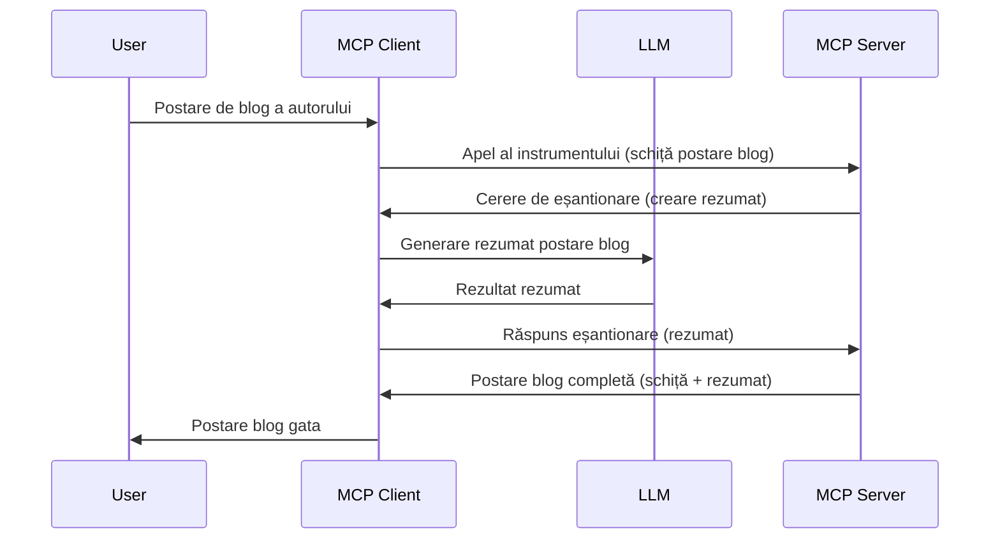

# Sampling - delegarea funcționalităților către Client

> **Notificare de depreciere:** candidatul pentru lansarea specificației MCP din `2026-07-28` marchează Sampling ca învechit în favoarea integrării directe cu API-urile furnizorilor LLM. Sampling continuă să funcționeze în `2025-11-25` și cel puțin un an după orice depreciere formală, deci tot ce este în această lecție rămâne valabil — dar noile designuri de servere ar trebui să evalueze modelul de înlocuire. Vezi [Ce se schimbă în MCP: Candidatul pentru lansarea din 2026-07-28](../../01-CoreConcepts/mcp-2026-07-28-release-candidate.md).

Uneori, este nevoie ca Clientul MCP și Serverul MCP să colaboreze pentru a atinge un scop comun. S-ar putea să ai o situație în care Serverul are nevoie de ajutorul unui LLM care stă pe client. Pentru această situație, Sampling este ceea ce ar trebui să folosești.

Hai să explorăm câteva cazuri de utilizare și cum să construim o soluție care implică sampling.

## Prezentare generală

În această lecție ne concentrăm pe explicarea când și unde să folosești Sampling și cum să îl configurezi.

## Obiective de învățare

În acest capitol vom:

- Explica ce este Sampling și când să îl folosești.
- Arăt cum să configurezi Sampling în MCP.
- Oferi exemple de Sampling în acțiune.

## Ce este Sampling și de ce să îl folosești?

Sampling este o funcție avansată care funcționează în următorul mod:



### Cerere de sampling

Ok, acum avem o privire de ansamblu asupra unui scenariu credibil, să vorbim despre cererea de sampling pe care serverul o trimite către client. Iată cum poate arăta o astfel de cerere în format JSON-RPC:

```json
{
  "jsonrpc": "2.0",
  "id": 1,
  "method": "sampling/createMessage",
  "params": {
    "messages": [
      {
        "role": "user",
        "content": {
          "type": "text",
          "text": "Create a blog post summary of the following blog post: <BLOG POST>"
        }
      }
    ],
    "modelPreferences": {
      "hints": [
        {
          "name": "claude-3-sonnet"
        }
      ],
      "intelligencePriority": 0.8,
      "speedPriority": 0.5
    },
    "systemPrompt": "You are a helpful assistant.",
    "maxTokens": 100
  }
}
```

Sunt câteva aspecte care merită menționate aici:

- Prompt-ul, sub content -> text, este promptul nostru, o instrucțiune pentru LLM să rezume conținutul unui articol de blog.

- **modelPreferences**. Această secțiune este exact asta, o preferință, o recomandare despre ce configurație să se folosească cu LLM. Utilizatorul poate alege să urmeze aceste recomandări sau să le modifice. În acest caz sunt recomandări despre modelul de folosit și prioritatea pentru viteză și inteligență.
- **systemPrompt**, acesta este promptul normal al sistemului care îi dă LLM-ului o personalitate și conține instrucțiuni de ghidare.
- **maxTokens**, aceasta este o altă proprietate folosită pentru a specifica câți tokens se recomandă a fi folosiți pentru această sarcină.

### Răspuns de sampling

Acest răspuns este ceea ce Clientul MCP trimite înapoi Serverului MCP și este rezultatul clientului care apelează LLM-ul, așteaptă acel răspuns și apoi construiește acest mesaj. Iată cum poate arăta în JSON-RPC:

```json
{
  "jsonrpc": "2.0",
  "id": 1,
  "result": {
    "role": "assistant",
    "content": {
      "type": "text",
      "text": "Here's your abstract <ABSTRACT>"
    },
    "model": "gpt-5",
    "stopReason": "endTurn"
  }
}
```

Observă cum răspunsul este un rezumat al articolului de blog așa cum am cerut. De asemenea, observă că modelul `model` folosit nu este cel pe care l-am cerut, ci "gpt-5" în loc de "claude-3-sonnet". Acest lucru ilustrează că utilizatorul poate să-și schimbe părerea despre ce să folosească și că cererea ta de sampling este o recomandare.

Ok, acum că înțelegem fluxul principal și o sarcină utilă de folosit este "crearea + rezumatul unui articol de blog", să vedem ce trebuie să facem pentru a funcționa.

### Tipuri de mesaje

Mesajele de sampling nu se limitează doar la text, ci poți trimite și imagini și audio. Iată cum arată JSON-RPC diferit:

**Text**

```json
{
  "type": "text",
  "text": "The message content"
}
```

**Conținut imagine**

```json
{
  "type": "image",
  "data": "base64-encoded-image-data",
  "mimeType": "image/jpeg"
}
```

**Conținut audio**

```json
{
  "type": "audio",
  "data": "base64-encoded-audio-data",
  "mimeType": "audio/wav"
}
```

> NOTĂ: pentru informații mai detaliate despre Sampling, consultă [documentația oficială](https://modelcontextprotocol.io/specification/2025-11-25/client/sampling)

## Cum să configurezi Sampling în Client

> Notă: dacă construiești doar un server nu este nevoie să faci mare lucru aici.

Într-un client, trebuie să specifici funcția următoare astfel:

```json
{
  "capabilities": {
    "sampling": {}
  }
}
```

Acest lucru va fi preluat când clientul tău ales se initializează cu serverul.

## Exemplu de Sampling în acțiune - Crearea unui articol de blog

Hai să codăm împreună un server de sampling, vom avea nevoie să facem următoarele:

1. Creează un tool pe Server.
1. Tool-ul respectiv trebuie să creeze o cerere de sampling
1. Tool-ul trebuie să aștepte răspunsul la cererea de sampling a clientului.
1. Apoi trebuie produs rezultatul tool-ului.

Hai să vedem codul pas cu pas:

### -1- Crearea tool-ului

**python**

```python
@mcp.tool()
async def create_blog(title: str, content: str, ctx: Context[ServerSession, None]) -> str:
    """Create a blog post and generate a summary"""

```

### -2- Crearea unei cereri de sampling

Extinde tool-ul tău cu următorul cod:

**python**

```python
post = BlogPost(
        id=len(posts) + 1,
        title=title,
        content=content,
        abstract=""
    )

prompt = f"Create an abstract of the following blog post: title: {title} and draft: {content} "

result = await ctx.session.create_message(
        messages=[
            SamplingMessage(
                role="user",
                content=TextContent(type="text", text=prompt),
            )
        ],
        max_tokens=100,
)

```

### -3- Așteaptă răspunsul și returnează răspunsul

**python**

```python
post.abstract = result.content.text

posts.append(post)

# returnează produsul complet
return json.dumps({
    "id": post.title,
    "abstract": post.abstract
})
```

### -4- Codul complet

**python**

```python
from starlette.applications import Starlette
from starlette.routing import Mount, Host

from mcp.server.fastmcp import Context, FastMCP

from mcp.server.session import ServerSession
from mcp.types import SamplingMessage, TextContent

import json


from uuid import uuid4
from typing import List
from pydantic import BaseModel


mcp = FastMCP("Blog post generator")

# app = FastAPI()

posts = []

class BlogPost(BaseModel):
    id: int
    title: str
    content: str
    abstract: str

posts: List[BlogPost] = []

@mcp.tool()
async def create_blog(title: str, content: str, ctx: Context[ServerSession, None]) -> str:
    """Create a blog post and generate a summary"""

    post = BlogPost(
        id=len(posts) + 1,
        title=title,
        content=content,
        abstract=""
    )

    prompt = f"Create an abstract of the following blog post: title: {title} and draft: {content} "

    result = await ctx.session.create_message(
        messages=[
            SamplingMessage(
                role="user",
                content=TextContent(type="text", text=prompt),
            )
        ],
        max_tokens=100,
    )

    post.abstract = result.content.text

    posts.append(post)

    # returnează postarea completă de pe blog
    return json.dumps({
        "id": post.title,
        "abstract": post.abstract
    })

if __name__ == "__main__":
    print("Starting server...")
    # mcp.run()
    mcp.run(transport="streamable-http")

# rulează aplicația cu: python server.py
```

### -5- Testarea în Visual Studio Code

Pentru a testa acest lucru în Visual Studio Code, fă următoarele:

1. Pornește serverul în terminal
1. Adaugă-l în *mcp.json* (și asigură-te că este pornit) ceva de genul:

   ```json
   "servers": {
      "blog-server": {
        "type": "http",
        "url": "http://localhost:8000/mcp"
      }
   }
   ```

1. Scrie un prompt:

   ```text
   create a blog post named "Where Python comes from", the content is "Python is actually named after Monty Python Flying Circus"
   ```

1. Permite să se execute sampling. Prima dată când testezi asta, ți se va prezenta un dialog suplimentar pe care va trebui să îl accepți, apoi vei vedea dialogul normal care îți cere să rulezi un tool

1. Verifică rezultatele. Vei vedea rezultatele afișate frumos în GitHub Copilot Chat, dar poți verifica și răspunsul JSON brut.

**Bonus**. Instrumentele Visual Studio Code au suport excelent pentru sampling. Poți configura accesul Sampling pe serverul instalat navigând astfel:

1. Accesează secțiunea extensii.
1. Selectează iconița roată pentru serverul instalat din secțiunea "MCP SERVERS - INSTALLED".
1. Selectează "Configure Model Access", aici poți selecta ce Modele GitHub Copilot este permis să le folosească când face sampling. De asemenea, poți vedea toate cererile de sampling recente selectând "Show Sampling requests".

## Tema

În această temă, vei construi un Sampling puțin diferit, și anume o integrare de sampling care suportă generarea unei descrieri de produs. Iată scenariul tău:

**Scenariu**: lucrătorul back office de la un e-commerce are nevoie de ajutor, durează mult prea mult să genereze descrieri de produs. Prin urmare, trebuie să construiești o soluție unde poți apela un tool "create_product" cu argumentele "title" și "keywords" și să producă un produs complet inclusiv un câmp "description" care să fie populat de un LLM al clientului.

SUGESTIE: folosește ceea ce ai învățat mai devreme pentru a construi acest server și tool-ul său folosind o cerere de sampling.

## Soluție

[Soluție](./solution/README.md)

## Principalele idei reținute

Sampling este o funcție puternică care permite serverului să delege sarcini clientului atunci când are nevoie de ajutorul unui LLM.

## Ce urmează

- [Capitolul 4 - Implementare practică](../../04-PracticalImplementation/README.md)

---

<!-- CO-OP TRANSLATOR DISCLAIMER START -->
**Declinare a responsabilității**:
Acest document a fost tradus folosind serviciul de traducere AI [Co-op Translator](https://github.com/Azure/co-op-translator). În timp ce ne străduim pentru acuratețe, vă rugăm să rețineți că traducerile automate pot conține erori sau inexactități. Documentul original în limba sa nativă trebuie considerat sursa autorizată. Pentru informații critice, se recomandă traducerea profesională realizată de un om. Nu ne asumăm responsabilitatea pentru eventualele neînțelegeri sau interpretări greșite care decurg din utilizarea acestei traduceri.
<!-- CO-OP TRANSLATOR DISCLAIMER END -->