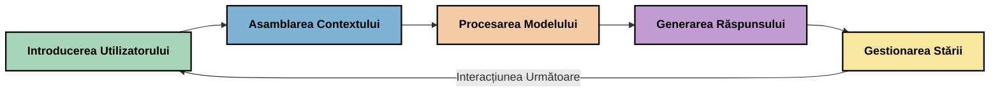
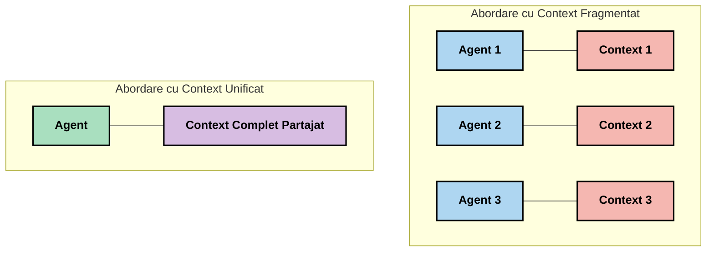
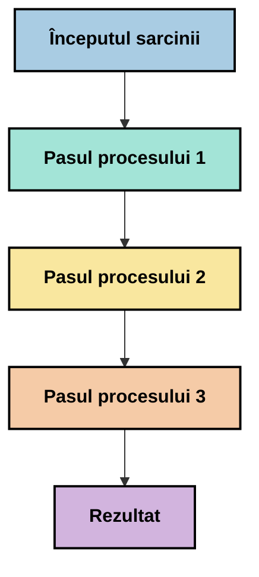
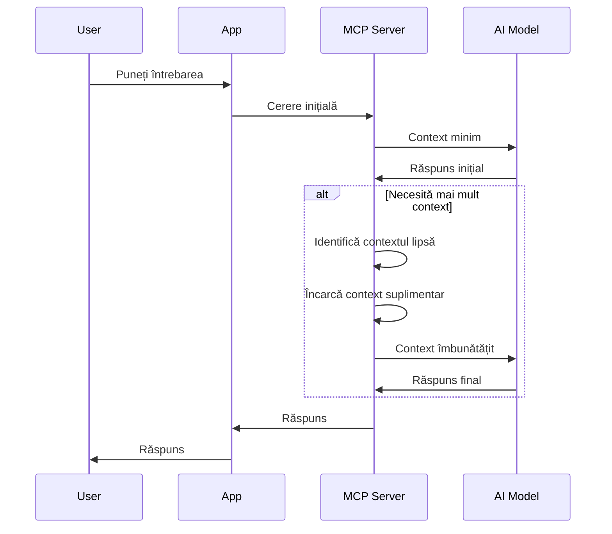
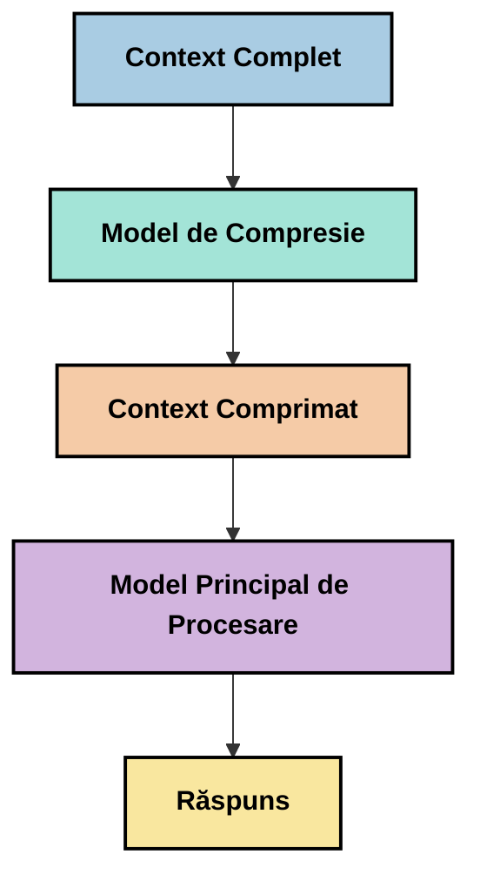
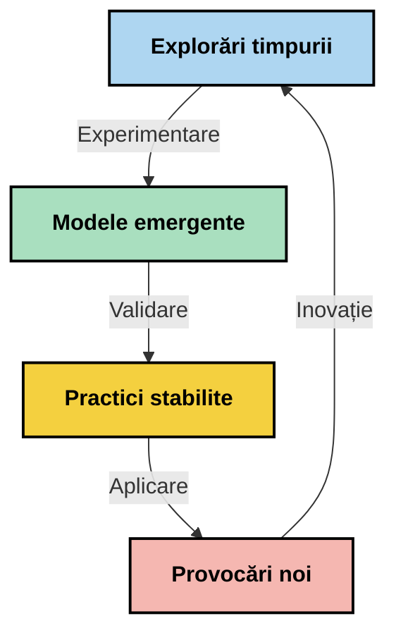

# Ingineria Contextului: Un Concept Emergător în Ecosistemul MCP

## Prezentare generală

Ingineria contextului este un concept emergător în domeniul AI care explorează modul în care informațiile sunt structurate, livrate și menținute pe parcursul interacțiunilor dintre clienți și servicii AI. Pe măsură ce ecosistemul Model Context Protocol (MCP) evoluează, înțelegerea modului de gestionare eficientă a contextului devine tot mai importantă. Acest modul introduce conceptul de inginerie a contextului și explorează potențialele aplicații ale acestuia în implementările MCP.

## Obiectivele de învățare

La finalul acestui modul, vei putea să:

- Înțelegi conceptul emergent de inginerie a contextului și rolul său potențial în aplicațiile MCP
- Identifici principalele provocări în gestionarea contextului pe care designul protocolului MCP le abordează
- Explorezi tehnici pentru îmbunătățirea performanței modelelor printr-o manipulare mai bună a contextului
- Considerezi abordări pentru măsurarea și evaluarea eficacității contextului
- Aplici aceste concepte emergente pentru a îmbunătăți experiențele AI prin cadrul MCP

## Introducere în Ingineria Contextului

Ingineria contextului este un concept emergent axat pe proiectarea deliberată și gestionarea fluxului de informații între utilizatori, aplicații și modele AI. Spre deosebire de domenii consacrate precum ingineria prompturilor, ingineria contextului este încă definită de practicieni pe măsură ce aceștia lucrează pentru a rezolva provocările unice de a oferi modelelor AI informațiile potrivite la momentul potrivit.

Pe măsură ce modelele mari de limbaj (LLM) au evoluat, importanța contextului a devenit tot mai evidentă. Calitatea, relevanța și structura contextului pe care îl oferim influențează direct rezultatele modelului. Ingineria contextului explorează această relație și caută să dezvolte principii pentru o gestionare eficientă a contextului.

> „În 2025, modelele existente sunt extrem de inteligente. Dar chiar și cel mai deștept om nu va putea să-și facă treaba eficient fără contextul a ceea ce i se cere să facă... ‘Ingineria contextului’ este următorul nivel al ingineriei prompturilor. Este vorba despre a face acest lucru automat într-un sistem dinamic.” — Walden Yan, Cognition AI

Ingineria contextului poate cuprinde:

1. **Selecția Contextului**: Determinarea ce informații sunt relevante pentru o anumită sarcină
2. **Structurarea Contextului**: Organizarea informațiilor pentru maximizarea înțelegerii modelului
3. **Livrarea Contextului**: Optimizarea modului și momentului în care informațiile sunt trimise către modele
4. **Menținerea Contextului**: Gestionarea stării și evoluției contextului în timp
5. **Evaluarea Contextului**: Măsurarea și îmbunătățirea eficacității contextului

Aceste domenii de interes sunt deosebit de relevante pentru ecosistemul MCP, care oferă un mod standardizat prin care aplicațiile pot furniza context modelelor LLM.


## Perspectiva Călătoriei Contextului

Un mod de a vizualiza ingineria contextului este să urmărești călătoria pe care o parcurge informația printr-un sistem MCP:



### Etape Cheie în Călătoria Contextului:

1. **Intrarea Utilizatorului**: Informații brute de la utilizator (text, imagini, documente)
2. **Asamblarea Contextului**: Combinarea intrării utilizatorului cu contextul sistemului, istoricul conversației și alte informații preluate
3. **Procesarea Modelului**: Modelul AI procesează contextul asamblat
4. **Generarea Răspunsului**: Modelul produce rezultate pe baza contextului oferit
5. **Gestionarea Stării**: Sistemul își actualizează starea internă bazat pe interacțiune

Această perspectivă evidențiază natura dinamică a contextului în sistemele AI și ridică întrebări importante despre cum să gestionăm cel mai bine informațiile în fiecare etapă.

## Principii Emergente în Ingineria Contextului

Pe măsură ce domeniul ingineriei contextului prinde contur, unele principii timpurii încep să iasă la iveală din partea practicienilor. Aceste principii pot ajuta la ghidarea alegerilor de implementare MCP:

### Principiul 1: Partajarea Completă a Contextului

Contextul ar trebui să fie partajat complet între toate componentele unui sistem, nu fragmentat între mai mulți agenți sau procese. Când contextul este distribuit, deciziile luate într-o parte a sistemului pot intra în conflict cu cele luate în altă parte.



În aplicațiile MCP, acest lucru sugerează proiectarea unor sisteme unde contextul curge fără întreruperi prin întregul lanț, în loc să fie compartimentat.

### Principiul 2: Recunoașterea Că Acțiunile Poartă Decizii Implicite

Fiecare acțiune pe care o ia un model întruchipează decizii implicite despre cum să interpreteze contextul. Când mai multe componente acționează pe contexte diferite, aceste decizii implicite pot intra în conflict, generând rezultate inconsistente.

Acest principiu are implicații importante pentru aplicațiile MCP:
- Preferă procesarea liniară a sarcinilor complexe în loc de execuția paralelă cu context fragmentat
- Asigură că toate punctele de decizie au acces la aceeași informație contextuală
- Proiectează sisteme în care pașii ulteriori pot vedea întregul context al deciziilor anterioare

### Principiul 3: Echilibrul între Adâncimea Contextului și Limitările Ferestrei

Pe măsură ce conversațiile și procesele devin mai lungi, ferestrele de context se umplu sau depășesc capacitatea. Ingineria contextului explorează abordări pentru a gestiona această tensiune între context cuprinzător și limitările tehnice.

Abordările potențiale includ:
- Compresia contextului, care păstrează informațiile esențiale reducând consumul de tokeni
- Încărcarea progresivă a contextului bazată pe relevanța față de nevoile curente
- Rezumarea interacțiunilor anterioare păstrând deciziile și faptele cheie

## Provocările Contextului și Designul Protocolului MCP

Protocolul Model Context (MCP) a fost proiectat conștient de provocările unice în gestionarea contextului. Înțelegerea acestor provocări ajută la explicarea aspectelor cheie ale designului protocolului MCP:


### Provocarea 1: Limitările Ferestrei de Context
Cele mai multe modele AI au dimensiuni fixe ale ferestrei de context, limitând câtă informație pot procesa odată.

**Răspunsul Designului MCP:** 
- Protocolul suportă context structurat, bazat pe resurse care pot fi referențiate eficient
- Resursele pot fi paginate și încărcate progresiv

### Provocarea 2: Determinarea Relevanței
Determinarea informațiilor cele mai relevante pentru includerea în context este dificilă.

**Răspunsul Designului MCP:**
- Unelte flexibile permit recuperarea dinamică a informațiilor pe baza necesității
- Prompturi structurate permit o organizare consistentă a contextului

### Provocarea 3: Persistența Contextului
Gestionarea stării pe durata interacțiunilor necesită urmărirea atentă a contextului.

**Răspunsul Designului MCP:**
- Management standardizat al sesiunilor
- Modele de interacțiune clar definite pentru evoluția contextului

### Provocarea 4: Context Multi-Modal
Tipuri diferite de date (text, imagini, date structurate) necesită tratare diferită.

**Răspunsul Designului MCP:**
- Designul protocolului acomodează diverse tipuri de conținut
- Reprezentare standardizată a informațiilor multi-modale

### Provocarea 5: Securitate și Confidențialitate
Contextul conține adesea informații sensibile care trebuie protejate.

**Răspunsul Designului MCP:**
- Limite clare între responsabilitățile clientului și ale serverului
- Opțiuni de procesare locală pentru a minimiza expunerea datelor

Înțelegerea acestor provocări și modul în care MCP le abordează oferă o bază pentru explorarea tehnicilor avansate de inginerie a contextului.

## Abordări Emergente în Ingineria Contextului

Pe măsură ce domeniul ingineriei contextului se dezvoltă, mai multe abordări promițătoare încep să apară. Acestea reprezintă gândirea curentă mai degrabă decât practici consacrate și, cel mai probabil, vor evolua pe măsură ce dobândim mai multă experiență în implementările MCP.

### 1. Procesare Linia Simplă

Spre deosebire de arhitecturile multi-agent care distribuie contextul, unii practicieni constată că procesarea liniară simplă dă rezultate mai consistente. Aceasta alină cu principiul de menținere a contextului unificat.



Deși această abordare poate părea mai puțin eficientă decât procesarea paralelă, ea produce adesea rezultate mai coerente și de încredere pentru că fiecare pas se bazează pe o înțelegere completă a deciziilor anterioare.

### 2. Fragmentarea și Prioritizarea Contextului

Împărțirea contextelor mari în părți gestionabile și prioritizarea celor mai importante.

```python
# Exemplu conceptual: Segmentarea și prioritizarea contextului
def process_with_chunked_context(documents, query):
    # 1. Împarte documentele în bucăți mai mici
    chunks = chunk_documents(documents)
    
    # 2. Calculează scorurile de relevanță pentru fiecare bucată
    scored_chunks = [(chunk, calculate_relevance(chunk, query)) for chunk in chunks]
    
    # 3. Sortează bucățile după scorul de relevanță
    sorted_chunks = sorted(scored_chunks, key=lambda x: x[1], reverse=True)
    
    # 4. Folosește cele mai relevante bucăți ca context
    context = create_context_from_chunks([chunk for chunk, score in sorted_chunks[:5]])
    
    # 5. Procesează cu contextul prioritizat
    return generate_response(context, query)
```

Conceptul de mai sus ilustrează cum putem împărți documente mari în părți gestionabile și selecta doar părțile cele mai relevante pentru context. Această abordare poate ajuta la respectarea limitărilor ferestrei de context, valorificând în același timp bazele mari de cunoștințe.

### 3. Încărcarea Progresivă a Contextului

Încărcarea contextului progresiv, pe măsură ce este necesar, în loc de încărcarea completă dintr-o dată.



Încărcarea progresivă începe cu un context minim și se extinde doar când este necesar. Aceasta poate reduce semnificativ utilizarea tokenilor pentru întrebări simple, păstrând totodată capacitatea de a răspunde la întrebări complexe.

### 4. Compresia și Rezumarea Contextului

Reducerea dimensiunii contextului păstrând informațiile esențiale.



Compresia contextului se concentrează pe:
- Eliminarea informațiilor redundante
- Rezumarea conținutului extins
- Extracția faptelor și detaliilor cheie
- Păstrarea elementelor critice din context
- Optimizarea pentru eficiența tokenilor

Această abordare poate fi valoroasă în special pentru menținerea conversațiilor lungi în ferestre de context sau pentru procesarea eficientă a documentelor mari. Unii practicieni utilizează modele specializate pentru compresia contextului și rezumarea istoricului conversației.


## Considerații Exploratorii în Ingineria Contextului

Pe măsură ce explorăm domeniul emergent al ingineriei contextului, câteva considerații merită reținute atunci când lucrăm cu implementări MCP. Acestea nu sunt practici prescrise, ci mai degrabă domenii de explorare care ar putea aduce îmbunătățiri în cazul tău specific.

### Întreabă-te care sunt obiectivele tale legate de context

Înainte de a implementa soluții complexe de gestionare a contextului, formulează clar ce vrei să realizezi:
- Ce informații specifice are nevoie modelul pentru a avea succes?
- Care informații sunt esențiale și care sunt suplimentare?
- Care sunt constrângerile tale de performanță (latență, limite de tokeni, costuri)?

### Explorează Abordări cu Context Stratificat

Unii practicieni au succes cu context aranjat în straturi conceptuale:
- **Stratul Esențial**: informațiile esențiale de care modelul are nevoie întotdeauna
- **Stratul Situațional**: context specific interacțiunii curente
- **Stratul de Suport**: informații suplimentare care pot fi utile
- **Stratul de Rezervă**: informații accesate doar când este necesar

### Investighează Strategii de Recuperare

Eficacitatea contextului tău depinde adesea de cum recuperezi informațiile:
- Căutare semantică și embedding-uri pentru găsirea informațiilor relevante conceptual
- Căutare pe bază de cuvinte cheie pentru detalii factuale specifice
- Abordări hibrid care combină multiple metode de recuperare
- Filtrare metadata pentru a restrânge domeniul după categorii, date sau surse

### Experimentează cu Coerența Contextului

Structura și fluxul contextului tău pot afecta înțelegerea modelului:
- Gruparea informațiilor înrudite împreună
- Utilizarea unui format și organizare consistente
- Menținerea unei ordonări logice sau cronologice acolo unde este potrivit
- Evitarea informațiilor contradictorii

### Cântărește Compromisurile Arhitecturilor Multi-Agent

Deși arhitecturile multi-agent sunt populare în multe cadre AI, acestea vin cu provocări semnificative pentru gestionarea contextului:
- Fragmentarea contextului poate conduce la decizii inconsistente între agenți
- Procesarea paralelă poate introduce conflicte dificil de reconciliat
- Suprasolicitarea comunicării între agenți poate anula câștigurile de performanță
- Gestionarea complexă a stării este necesară pentru a menține coerența

În multe cazuri, o abordare cu un singur agent și gestionare cuprinzătoare a contextului poate produce rezultate mai de încredere decât mai mulți agenți specializați cu context fragmentat.

### Dezvoltă Metode de Evaluare

Pentru a îmbunătăți ingineria contextului în timp, gândește-te cum vei măsura succesul:
- Testare A/B a diferitelor structuri de context
- Monitorizarea utilizării tokenilor și a timpiilor de răspuns
- Urmărirea satisfacției utilizatorilor și a ratelor de finalizare a sarcinilor
- Analiza momentelor și motivelor pentru care strategiile de context eșuează

Aceste considerații reprezintă domenii active de explorare în spațiul ingineriei contextului. Pe măsură ce domeniul se maturizează, probabil vor apărea tipare și practici mai definitive.

## Măsurarea Eficacității Contextului: Un Cadru în Evoluție

Pe măsură ce ingineria contextului apare ca concept, practicienii încep să exploreze cum am putea măsura eficacitatea acestuia. Nu există încă un cadru consacrat, dar sunt luate în considerare diverse metrice care ar putea ghida munca viitoare.

### Dimensiuni Potențiale de Măsurare


#### 1. Considerații legate de Eficiența Intrării

- **Raportul Context-Răspuns**: Cât context este necesar în raport cu dimensiunea răspunsului?
- **Utilizarea Tokenilor**: Ce procent din tokenii contextului oferit influențează răspunsul?
- **Reducerea Contextului**: Cât de eficient putem comprima informația brută?

#### 2. Considerații legate de Performanță

- **Impactul asupra Latenței**: Cum afectează gestionarea contextului timpul de răspuns?
- **Economia Tokenilor**: Optimizăm eficient utilizarea tokenilor?
- **Precizia Recuperării**: Cât de relevantă este informația recuperată?
- **Utilizarea Resurselor**: Ce resurse computaționale sunt necesare?

#### 3. Considerații legate de Calitate

- **Relevanța Răspunsului**: Cât de bine răspunde răspunsul la întrebare?
- **Acuratețea Factuală**: Îmbunătățește gestionarea contextului corectitudinea factuală?
- **Consistența**: Sunt răspunsurile consistente între întrebări similare?
- **Rata Halucinațiilor**: Reduce un context mai bun halucinațiile modelului?

#### 4. Considerații legate de Experiența Utilizatorului

- **Rata de Urmărire**: Cât de des au utilizatorii nevoie de precizări?
- **Finalizarea Sarcinii**: Reușesc utilizatorii să își atingă obiectivele?
- **Indicatori de Satisfacție**: Cum evaluează utilizatorii experiența lor?

### Abordări Exploratorii ale Măsurării

Când experimentezi ingineria contextului în implementările MCP, consideră aceste abordări exploratorii:

1. **Comparații de Bază**: Stabilește o bază cu abordări simple de context înainte de a testa metode mai sofisticate

2. **Schimbări Incrementale**: Modifică un aspect al gestionării contextului pe rând pentru a izola efectele

3. **Evaluare Centrată pe Utilizator**: Combină metrice cantitative cu feedback calitativ al utilizatorilor

4. **Analiza Eșecurilor**: Examinează cazurile în care strategiile de context eșuează pentru a înțelege potențiale îmbunătățiri

5. **Evaluare Multi-Dimensională**: Consideră compromisurile între eficiență, calitate și experiența utilizatorului

Această abordare experimentală și multifacetată de măsurare se aliniază cu natura emergentă a ingineriei contextului.

## Gânduri finale

Ingineria contextului este o zonă emergentă de explorare care poate deveni centrală pentru aplicațiile eficiente MCP. Prin considerarea atentă a modului în care informațiile circulă prin sistemul tău, poți crea experiențe AI mai eficiente, precise și valoroase pentru utilizatori.

Tehnicile și abordările prezentate în acest modul reprezintă gândirea timpurie în acest domeniu, nu practici consacrate. Ingineria contextului se poate dezvolta într-o disciplină mai definită pe măsură ce capabilitățile AI evoluează și înțelegerea noastră se adâncește. Pentru moment, experimentarea combinată cu măsurarea atentă pare abordarea cea mai productivă.

## Direcții Potențiale Viitoare

Domeniul ingineriei contextului este încă în fazele sale incipiente, dar mai multe direcții promițătoare încep să apară:

- Principiile ingineriei contextului ar putea influența semnificativ performanța modelelor, eficiența, experiența utilizatorului și fiabilitatea
- Abordările cu fir unic și gestionare completă a contextului ar putea depăși arhitecturile multi-agent pentru multe cazuri de utilizare
- Modelele specializate de compresie a contextului pot deveni componente standard în pipeline-urile AI
- Tensiunea dintre completitudinea contextului și limitările tokenilor va impulsiona probabil inovația în manipularea contextului
- Pe măsură ce modelele devin mai capabile de comunicare eficientă și asemănătoare cu cea umană, colaborarea multi-agent reală poate deveni mai viabilă
- Implementările MCP ar putea evolua pentru a standardiza tiparele de gestionare a contextului care apar din experimentarea curentă



## Resurse

### Resurse Oficiale MCP
- [Model Context Protocol Website](https://modelcontextprotocol.io/)
- [Model Context Protocol Specification](https://github.com/modelcontextprotocol/modelcontextprotocol)

- [Documentația MCP](https://modelcontextprotocol.io/docs)
- [SDK MCP C#](https://github.com/modelcontextprotocol/csharp-sdk)
- [SDK MCP Python](https://github.com/modelcontextprotocol/python-sdk)
- [SDK MCP TypeScript](https://github.com/modelcontextprotocol/typescript-sdk)
- [Inspector MCP](https://github.com/modelcontextprotocol/inspector) - Instrument vizual pentru testarea serverelor MCP

### Articole despre Ingineria Contextului
- [Nu construiți multi-agenti: Principiile ingineriei contextului](https://cognition.ai/blog/dont-build-multi-agents) - Perspectivele lui Walden Yan asupra principiilor ingineriei contextului
- [Un ghid practic pentru construirea agenților](https://cdn.openai.com/business-guides-and-resources/a-practical-guide-to-building-agents.pdf) - Ghidul OpenAI despre proiectarea eficientă a agenților
- [Construirea agenților eficienți](https://www.anthropic.com/engineering/building-effective-agents) - Abordarea Anthropic pentru dezvoltarea agenților

### Cercetări relevante
- [Augmentarea dinamică a recuperării pentru modele mari de limbaj](https://arxiv.org/abs/2310.01487) - Cercetări despre metode dinamice de recuperare
- [Pierdut în mijloc: Cum folosesc modelele de limbaj contexte lungi](https://arxiv.org/abs/2307.03172) - Cercetare importantă despre tiparele de procesare a contextului
- [Generarea ierarhică de imagini condiționată pe text cu latente CLIP](https://arxiv.org/abs/2204.06125) - Lucrarea DALL-E 2 cu perspective despre structurarea contextului
- [Explorarea rolului contextului în arhitecturile modelelor mari de limbaj](https://aclanthology.org/2023.findings-emnlp.124/) - Cercetări recente despre gestionarea contextului
- [Colaborarea multi-agent: Un sondaj](https://arxiv.org/abs/2304.03442) - Cercetare privind sistemele multi-agent și provocările acestora

### Resurse suplimentare
- [Tehnici de optimizare a ferestrei de context](https://learn.microsoft.com/en-us/azure/ai-services/openai/concepts/context-window)
- [Tehnici avansate RAG](https://www.microsoft.com/en-us/research/blog/retrieval-augmented-generation-rag-and-frontier-models/)
- [Documentația Semantic Kernel](https://github.com/microsoft/semantic-kernel)
- [Toolkit AI pentru gestionarea contextului](https://github.com/microsoft/aitoolkit)

## Ce urmează

- [5.15 Transport personalizat MCP](../mcp-transport/README.md)

---

<!-- CO-OP TRANSLATOR DISCLAIMER START -->
**Declinare a responsabilității**:
Acest document a fost tradus folosind serviciul de traducere AI [Co-op Translator](https://github.com/Azure/co-op-translator). În timp ce ne străduim pentru acuratețe, vă rugăm să rețineți că traducerile automate pot conține erori sau inexactități. Documentul original în limba sa nativă trebuie considerat sursa autorizată. Pentru informații critice, se recomandă traducerea profesională realizată de un om. Nu ne asumăm responsabilitatea pentru eventualele neînțelegeri sau interpretări greșite care decurg din utilizarea acestei traduceri.
<!-- CO-OP TRANSLATOR DISCLAIMER END -->