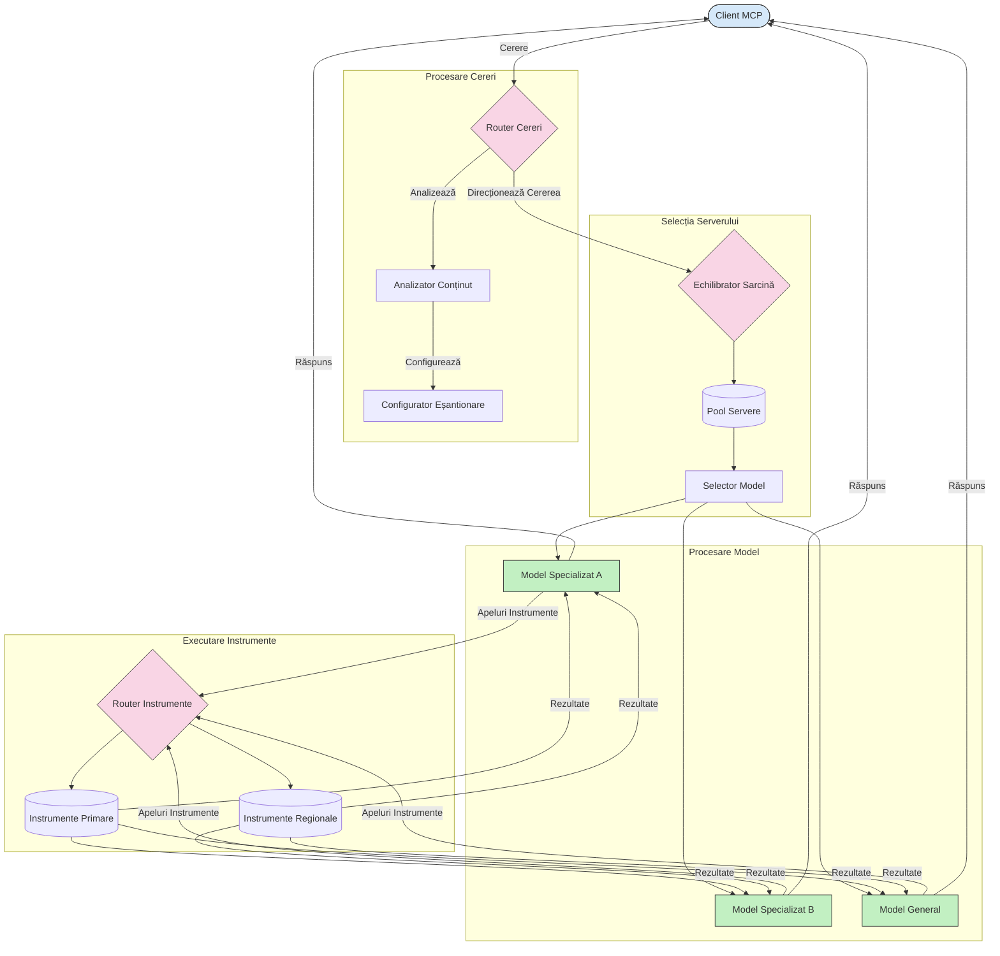

# Rutare în Protocolul Contextului Modelului

Rutarea este esențială pentru direcționarea cererilor către modelele, uneltele sau serviciile potrivite din cadrul unui ecosistem MCP.

## Introducere

Rutarea în Protocolul Contextului Modelului (MCP) implică direcționarea cererilor către cele mai potrivite modele sau servicii pe baza unor criterii variate, precum tipul conținutului, contextul utilizatorului și încărcarea sistemului. Acest lucru asigură o procesare eficientă și o utilizare optimă a resurselor.

## Obiectivele învățării

La finalul acestei lecții, vei putea:

- Înțelege principiile rutării în MCP.
- Implementa rutarea bazată pe conținut pentru a direcționa cererile către servicii specializate.
- Aplica strategii inteligente de echilibrare a încărcării pentru optimizarea utilizării resurselor.
- Implementa rutarea dinamică a uneltelor pe baza contextului cererii.

## Rutarea bazată pe conținut

Rutarea bazată pe conținut direcționează cererile către servicii specializate în funcție de conținutul cererii. De exemplu, cererile legate de generarea de cod pot fi rutate către un model specializat în cod, în timp ce cererile de scriere creativă pot fi trimise către un model de scriere creativă.

Să vedem un exemplu de implementare în diferite limbaje de programare.

<details>
<summary>.NET</summary>

```csharp
// .NET Example: Content-based routing in MCP
public class ContentBasedRouter
{
    private readonly Dictionary<string, McpClient> _specializedClients;
    private readonly RoutingClassifier _classifier;
    
    public ContentBasedRouter()
    {
        // Initialize specialized clients for different domains
        _specializedClients = new Dictionary<string, McpClient>
        {
            ["code"] = new McpClient("https://code-specialized-mcp.com"),
            ["creative"] = new McpClient("https://creative-specialized-mcp.com"),
            ["scientific"] = new McpClient("https://scientific-specialized-mcp.com"),
            ["general"] = new McpClient("https://general-mcp.com")
        };
        
        // Initialize content classifier
        _classifier = new RoutingClassifier();
    }
    
    public async Task<McpResponse> RouteAndProcessAsync(string prompt, IDictionary<string, object> parameters = null)
    {
        // Classify the prompt to determine the best specialized service
        string category = await _classifier.ClassifyPromptAsync(prompt);
        
        // Get the appropriate client or fall back to general
        var client = _specializedClients.ContainsKey(category) 
            ? _specializedClients[category] 
            : _specializedClients["general"];
            
        Console.WriteLine($"Routing request to {category} specialized service");
        
        // Send request to the selected service
        return await client.SendPromptAsync(prompt, parameters);
    }
    
    // Simple classifier for routing decisions
    private class RoutingClassifier
    {
        public Task<string> ClassifyPromptAsync(string prompt)
        {
            prompt = prompt.ToLowerInvariant();
            
            if (prompt.Contains("code") || prompt.Contains("function") || 
                prompt.Contains("program") || prompt.Contains("algorithm"))
            {
                return Task.FromResult("code");
            }
            
            if (prompt.Contains("story") || prompt.Contains("creative") || 
                prompt.Contains("imagine") || prompt.Contains("design"))
            {
                return Task.FromResult("creative");
            }
            
            if (prompt.Contains("science") || prompt.Contains("research") || 
                prompt.Contains("analyze") || prompt.Contains("study"))
            {
                return Task.FromResult("scientific");
            }
            
            return Task.FromResult("general");
        }
    }
}
```

În codul precedent, am:

- Creat o clasă `ContentBasedRouter` care rotește cererile în funcție de conținutul promptului.
- Inițializat clienți specializați pentru diferite domenii (cod, creativ, științific, general).
- Implementat un clasificator simplu care determină categoria promptului și îl rotește către serviciul specializat potrivit.
- Folosit un mecanism de fallback pentru a rula cererile către un serviciu general dacă nu este disponibil un serviciu specializat.
- Implementat procesare asincronă pentru a gestiona cererile eficient.
- Folosit un dicționar pentru a mapa categoriile de conținut cu clienții MCP specializați.
- Implementat un clasificator simplu care analizează promptul și întoarce categoria potrivită.
- Folosit clientul specializat pentru a trimite cererea și a primi un răspuns.
- Gestionat cazurile în care promptul nu corespunde niciunei categorii specializate prin rutarea către un serviciu general.

</details>

## Echilibrare inteligentă a încărcării

Echilibrarea încărcării optimizează utilizarea resurselor și asigură o disponibilitate ridicată pentru serviciile MCP. Există diferite metode de implementare a echilibrării încărcării, cum ar fi round-robin, timpul răspunsului ponderat sau strategii conștiente de conținut.

Să vedem un exemplu de implementare care folosește următoarele strategii:

- **Round Robin**: Distribuie cererile uniform între serverele disponibile.
- **Timp de răspuns ponderat**: Rotește cererile către servere în funcție de timpul mediu de răspuns.
- **Conștient de conținut**: Rotește cererile către servere specializate pe baza conținutului cererii.

<details>
<summary>Java</summary>

```java
// Exemplu Java: Echilibrare inteligentă a încărcării pentru serverele MCP
public class McpLoadBalancer {
    private final List<McpServerNode> serverNodes;
    private final LoadBalancingStrategy strategy;
    
    public McpLoadBalancer(List<McpServerNode> nodes, LoadBalancingStrategy strategy) {
        this.serverNodes = new ArrayList<>(nodes);
        this.strategy = strategy;
    }
    
    public McpResponse processRequest(McpRequest request) {
        // Selectează cel mai bun server bazat pe strategie
        McpServerNode selectedNode = strategy.selectNode(serverNodes, request);
        
        try {
            // Direcționează cererea către nodul selectat
            return selectedNode.processRequest(request);
        } catch (Exception e) {
            // Gestionează eșecul - implementează logică de reîncercare sau soluție alternativă
            System.err.println("Error processing request on node " + selectedNode.getId() + ": " + e.getMessage());
            
            // Marchează nodul ca potențial nesănătos
            selectedNode.recordFailure();
            
            // Încearcă următorul cel mai bun nod ca soluție de rezervă
            List<McpServerNode> remainingNodes = new ArrayList<>(serverNodes);
            remainingNodes.remove(selectedNode);
            
            if (!remainingNodes.isEmpty()) {
                McpServerNode fallbackNode = strategy.selectNode(remainingNodes, request);
                return fallbackNode.processRequest(request);
            } else {
                throw new RuntimeException("All MCP server nodes failed to process the request");
            }
        }
    }
    
    // Sarcină de verificare a stării nodului
    public void startHealthChecks(Duration interval) {
        ScheduledExecutorService scheduler = Executors.newScheduledThreadPool(1);
        scheduler.scheduleAtFixedRate(() -> {
            for (McpServerNode node : serverNodes) {
                try {
                    boolean isHealthy = node.checkHealth();
                    System.out.println("Node " + node.getId() + " health status: " + 
                                      (isHealthy ? "HEALTHY" : "UNHEALTHY"));
                } catch (Exception e) {
                    System.err.println("Health check failed for node " + node.getId());
                    node.setHealthy(false);
                }
            }
        }, 0, interval.toMillis(), TimeUnit.MILLISECONDS);
    }
    
    // Interfață pentru strategiile de echilibrare a încărcării
    public interface LoadBalancingStrategy {
        McpServerNode selectNode(List<McpServerNode> nodes, McpRequest request);
    }
    
    // Strategie round-robin
    public static class RoundRobinStrategy implements LoadBalancingStrategy {
        private AtomicInteger counter = new AtomicInteger(0);
        
        @Override
        public McpServerNode selectNode(List<McpServerNode> nodes, McpRequest request) {
            List<McpServerNode> healthyNodes = nodes.stream()
                .filter(McpServerNode::isHealthy)
                .collect(Collectors.toList());
            
            if (healthyNodes.isEmpty()) {
                throw new RuntimeException("No healthy nodes available");
            }
            
            int index = counter.getAndIncrement() % healthyNodes.size();
            return healthyNodes.get(index);
        }
    }
    
    // Strategie pe baza timpului de răspuns ponderat
    public static class ResponseTimeStrategy implements LoadBalancingStrategy {
        @Override
        public McpServerNode selectNode(List<McpServerNode> nodes, McpRequest request) {
            return nodes.stream()
                .filter(McpServerNode::isHealthy)
                .min(Comparator.comparing(McpServerNode::getAverageResponseTime))
                .orElseThrow(() -> new RuntimeException("No healthy nodes available"));
        }
    }
    
    // Strategie conștientă de conținut
    public static class ContentAwareStrategy implements LoadBalancingStrategy {
        @Override
        public McpServerNode selectNode(List<McpServerNode> nodes, McpRequest request) {
            // Determină caracteristicile cererii
            boolean isCodeRequest = request.getPrompt().contains("code") || 
                                   request.getAllowedTools().contains("codeInterpreter");
            
            boolean isCreativeRequest = request.getPrompt().contains("creative") || 
                                       request.getPrompt().contains("story");
            
            // Găsește noduri specializate
            Optional<McpServerNode> specializedNode = nodes.stream()
                .filter(McpServerNode::isHealthy)
                .filter(node -> {
                    if (isCodeRequest && node.getSpecialization().equals("code")) {
                        return true;
                    }
                    if (isCreativeRequest && node.getSpecialization().equals("creative")) {
                        return true;
                    }
                    return false;
                })
                .findFirst();
            
            // Returnează nodul specializat sau nodul cel mai puțin încărcat
            return specializedNode.orElse(
                nodes.stream()
                    .filter(McpServerNode::isHealthy)
                    .min(Comparator.comparing(McpServerNode::getCurrentLoad))
                    .orElseThrow(() -> new RuntimeException("No healthy nodes available"))
            );
        }
    }
}
```

În codul precedent, am:

- Creat o clasă `McpLoadBalancer` care gestionează o listă de noduri server MCP și rotește cererile pe baza strategiei de echilibrare selectate.
- Implementat diferite strategii de echilibrare: `RoundRobinStrategy`, `ResponseTimeStrategy` și `ContentAwareStrategy`.
- Folosit un `ScheduledExecutorService` pentru a verifica periodic sănătatea nodurilor server.
- Implementat un mecanism de verificare a sănătății care marchează nodurile ca sănătoase sau nesănătoase pe baza răspunsului la verificările de sănătate.
- Gestionat procesarea cererilor cu tratare a erorilor și logică de fallback pentru a asigura o disponibilitate ridicată.
- Folosit o clasă `McpServerNode` pentru a reprezenta nodurile individuale MCP, inclusiv starea lor de sănătate, timpul mediu de răspuns și încărcarea curentă.
- Implementat o clasă `McpRequest` pentru a încadra detaliile cererii, precum promptul și uneltele permise.
- Folosit Java Streams pentru a filtra și selecta noduri bazate pe starea de sănătate și specializare.

</details>

## Rutare dinamică a uneltelor

Rutarea uneltelor asigură că apelurile către unelte sunt direcționate către cel mai potrivit serviciu în funcție de context. De exemplu, un apel către o unealtă meteo poate trebui să fie rutat către un punct final regional pe baza locației utilizatorului, sau o unealtă de calculator poate necesita o versiune specifică a API-ului.

Să analizăm un exemplu de implementare care demonstrează rutarea dinamică a uneltelor pe baza analizei cererii, punctelor finale regionale și suportului pentru versiuni.

<details>
<summary>Python</summary>

```python
# Exemplu Python: Rutare dinamică a uneltelor bazată pe analiza cererii
class McpToolRouter:
    def __init__(self):
        # Înregistrează punctele finale disponibile ale uneltelor
        self.tool_endpoints = {
            "weatherTool": "https://weather-service.example.com/api",
            "calculatorTool": "https://calculator-service.example.com/compute",
            "databaseTool": "https://database-service.example.com/query",
            "searchTool": "https://search-service.example.com/search"
        }
        
        # Puncte finale regionale pentru distribuție globală
        self.regional_endpoints = {
            "us": {
                "weatherTool": "https://us-west.weather-service.example.com/api",
                "searchTool": "https://us.search-service.example.com/search"
            },
            "europe": {
                "weatherTool": "https://eu.weather-service.example.com/api",
                "searchTool": "https://eu.search-service.example.com/search"
            },
            "asia": {
                "weatherTool": "https://asia.weather-service.example.com/api",
                "searchTool": "https://asia.search-service.example.com/search"
            }
        }
        
        # Suport pentru versiuni ale uneltelor
        self.tool_versions = {
            "weatherTool": {
                "default": "v2",
                "v1": "https://weather-service.example.com/api/v1",
                "v2": "https://weather-service.example.com/api/v2",
                "beta": "https://weather-service.example.com/api/beta"
            }
        }
    
    async def route_tool_request(self, tool_name, parameters, user_context=None):
        """Route a tool request to the appropriate endpoint based on context"""
        endpoint = self._select_endpoint(tool_name, parameters, user_context)
        
        if not endpoint:
            raise ValueError(f"No endpoint available for tool: {tool_name}")
        
        # Efectuează cererea propriu-zisă către punctul final selectat
        return await self._execute_tool_request(endpoint, tool_name, parameters)
    
    def _select_endpoint(self, tool_name, parameters, user_context=None):
        """Select the most appropriate endpoint based on context"""
        # Punctul final de bază din registru
        if tool_name not in self.tool_endpoints:
            return None
            
        base_endpoint = self.tool_endpoints[tool_name]
        
        # Verifică dacă trebuie să folosim o versiune specifică a uneltei
        if tool_name in self.tool_versions:
            version_info = self.tool_versions[tool_name]
            
            # Folosește versiunea specificată sau cea implicită
            requested_version = parameters.get("_version", version_info["default"])
            if requested_version in version_info:
                base_endpoint = version_info[requested_version]
        
        # Verifică rutarea regională dacă regiunea utilizatorului este cunoscută
        if user_context and "region" in user_context:
            user_region = user_context["region"]
            
            if user_region in self.regional_endpoints:
                regional_tools = self.regional_endpoints[user_region]
                
                if tool_name in regional_tools:
                    # Folosește punctul final specific regiunii
                    return regional_tools[tool_name]
        
        # Verifică cerințele de rezidență a datelor
        if user_context and "data_residency" in user_context:
            # Aceasta ar implementa logica pentru a asigura că datele rămân în jurisdicția specificată
            pass
        
        # Verifică rutarea bazată pe latență
        if user_context and "latency_sensitive" in user_context and user_context["latency_sensitive"]:
            # Aceasta ar implementa logica pentru a selecta punctul final cu cea mai mică latență
            pass
            
        return base_endpoint
        
    async def _execute_tool_request(self, endpoint, tool_name, parameters):
        """Execute the actual tool request to the selected endpoint"""
        try:
            async with aiohttp.ClientSession() as session:
                async with session.post(
                    endpoint,
                    json={"toolName": tool_name, "parameters": parameters},
                    headers={"Content-Type": "application/json"}
                ) as response:
                    if response.status == 200:
                        result = await response.json()
                        return result
                    else:
                        error_text = await response.text()
                        raise Exception(f"Tool execution failed: {error_text}")
        except Exception as e:
            # Implementează logica de reîncercare sau strategia de rezervă
            print(f"Error executing tool {tool_name} at {endpoint}: {str(e)}")
            raise
```

În codul precedent, am:

- Creat o clasă `McpToolRouter` care gestionează rutarea uneltelor pe baza analizei cererii, punctelor finale regionale și suportului pentru versiuni.
- Înregistrat punctele finale disponibile pentru unelte și regiuni pentru distribuție globală.
- Implementat logica de rutare dinamică care selectează punctul final potrivit în funcție de contextul utilizatorului, cum ar fi regiunea și cerințele de rezidență a datelor.
- Implementat suport pentru versiuni la unelte, permițând utilizatorilor să specifice versiunea de unealtă dorită.
- Folosit cereri HTTP asincrone pentru a executa apelurile către unelte și a gestiona răspunsurile.

</details>

## Arhitectura de Sampling și Rutare în MCP

Samplingul este o componentă critică a Protocolului Contextului Modelului (MCP) care permite procesarea și rutarea eficientă a cererilor. Aceasta implică analiza cererilor primite pentru a determina modelul sau serviciul cel mai potrivit care să le gestioneze, pe baza unor criterii variate precum tipul conținutului, contextul utilizatorului și încărcarea sistemului.

Samplingul și rutarea pot fi combinate pentru a crea o arhitectură robustă care optimizează utilizarea resurselor și asigură o disponibilitate ridicată. Procesul de sampling poate fi folosit pentru a clasifica cererile, în timp ce rutarea le direcționează către modelele sau serviciile potrivite.

Diagrama de mai jos ilustrează modul în care samplingul și rutarea funcționează împreună într-o arhitectură complexă MCP:



## Ce urmează

- [5.6 Sampling](../mcp-sampling/README.md)

---

<!-- CO-OP TRANSLATOR DISCLAIMER START -->
**Declinare a responsabilității**:
Acest document a fost tradus folosind serviciul de traducere AI [Co-op Translator](https://github.com/Azure/co-op-translator). În timp ce ne străduim pentru acuratețe, vă rugăm să rețineți că traducerile automate pot conține erori sau inexactități. Documentul original în limba sa nativă trebuie considerat sursa autorizată. Pentru informații critice, se recomandă traducerea profesională realizată de un om. Nu ne asumăm responsabilitatea pentru eventualele neînțelegeri sau interpretări greșite care decurg din utilizarea acestei traduceri.
<!-- CO-OP TRANSLATOR DISCLAIMER END -->