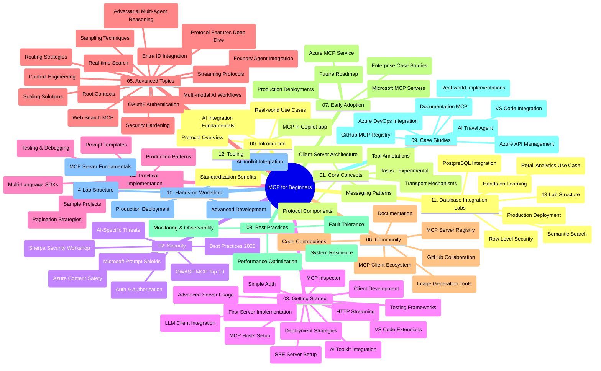

# Protocolul Contextului Modelului (MCP) pentru Începători - Ghid de Studiu

Acest ghid de studiu oferă o prezentare generală a structurii și conținutului depozitului pentru curriculumul „Protocolul Contextului Modelului (MCP) pentru Începători”. Folosește acest ghid pentru a naviga eficient prin depozit și a profita la maxim de resursele disponibile.

## Prezentare generală a depozitului

Protocolul Contextului Modelului (MCP) este un cadru standardizat pentru interacțiunile dintre modelele AI și aplicațiile client. Inițial creat de Anthropic, MCP este acum întreținut de comunitatea largă MCP prin organizația oficială GitHub. Acest depozit oferă un curriculum cuprinzător cu exemple practice de cod în C#, Java, JavaScript, Python și TypeScript, destinat dezvoltatorilor AI, arhitecților de sisteme și inginerilor software.

## Hartă vizuală a curriculumului

## Structura depozitului

Depozitul este organizat în douăsprezece secțiuni principale, fiecare concentrându-se pe diferite aspecte ale MCP:

1. **Introducere (00-Introduction/)**
   - Prezentare generală a Protocolului Contextului Modelului
   - De ce contează standardizarea în pipeline-urile AI
   - Cazuri practice și beneficii

2. **Concepte de bază (01-CoreConcepts/)**
   - Arhitectura client-server
   - Componentele cheie ale protocolului
   - Modele de mesagerie în MCP
   - Privind înainte: [Ce se schimbă în MCP: Candidat pentru versiunea 2026-07-28](./01-CoreConcepts/mcp-2026-07-28-release-candidate.md) — nucleul protocolului fără stare, cadrul Extensions și deprecierea Roots/Sampling/Logging așteptate în următoarea versiune a specificației

3. **Securitate (02-Security/)**
   - Amenințări de securitate în sistemele bazate pe MCP
   - Cele mai bune practici pentru securizarea implementărilor
   - Strategii de autentificare și autorizare
   - **Documentație cuprinzătoare de securitate**:
     - Cele mai bune practici de securitate MCP 2025
     - Ghid de implementare Azure Content Safety
     - Controale și tehnici de securitate MCP
     - Referință rapidă a celor mai bune practici MCP
   - **Subiecte cheie de securitate**:
     - Atacuri de injectare prompt și otrăvire a uneltelor
     - Deturnarea sesiunii și probleme de delegat confuz
     - Vulnerabilități de trecere a tokenului
     - Permisiuni excesive și controlul accesului
     - Securitatea lanțului de aprovizionare pentru componente AI
     - Integrarea Microsoft Prompt Shields

4. **Început rapid (03-GettingStarted/)**
   - Configurarea mediului și setările
   - Crearea serverelor și clienților MCP de bază
   - Integrare cu aplicații existente
   - Include secțiuni pentru:
     - Prima implementare de server
     - Dezvoltare client
     - Integrare client LLM
     - Integrare VS Code
     - Server cu Server-Sent Events (SSE)
     - Utilizare avansată a serverului
     - Streaming HTTP
     - Integrare AI Toolkit
     - Strategii de testare
     - Ghiduri de implementare

5. **Implementare practică (04-PracticalImplementation/)**
   - Utilizarea SDK-urilor în diverse limbaje de programare
   - Tehnici de depanare, testare și validare
   - Crearea șabloanelor reutilizabile de prompt și fluxuri de lucru
   - Proiecte de exemplu cu implementări

6. **Subiecte avansate (05-AdvancedTopics/)**
   - Tehnici de inginerie a contextului
   - Integrare agent Foundry
   - Fluxuri de lucru AI multi-modale 
   - Demonstrații de autentificare OAuth2
   - Capabilități de căutare în timp real
   - Streaming în timp real
   - Implementarea contextelor rădăcină
   - Strategii de rutare
   - Tehnici de eșantionare
   - Abordări de scalare
   - Considerații de securitate
   - Integrare securitate Entra ID
   - Integrare căutare web
   - Raționament multi-agent adversarial (modele de dezbatere)

7. **Contribuții comunitare (06-CommunityContributions/)**
   - Cum să contribui cu cod și documentație
   - Colaborare prin GitHub
   - Îmbunătățiri și feedback conduse de comunitate
   - Folosirea diverselor clienți MCP (Claude Desktop, Cline, VSCode)
   - Lucrul cu servere MCP populare inclusiv generare de imagini

8. **Lecții din adoptarea timpurie (07-LessonsfromEarlyAdoption/)**
   - Implementări reale și povești de succes
   - Construirea și implementarea soluțiilor bazate pe MCP
   - Tendințe și foaie de parcurs viitoare
   - **Ghid Microsoft MCP Servers**: Ghid complet pentru 10 servere MCP Microsoft gata de producție, inclusiv:
     - Microsoft Learn Docs MCP Server
     - Azure MCP Server (15+ conectori specializați)
     - GitHub MCP Server
     - Azure DevOps MCP Server
     - MarkItDown MCP Server
     - SQL Server MCP Server
     - Playwright MCP Server
     - Dev Box MCP Server
     - Microsoft Foundry MCP Server
     - Microsoft 365 Agents Toolkit MCP Server

9. **Cele mai bune practici (08-BestPractices/)**
   - Ajustarea performanței și optimizare
   - Proiectarea sistemelor MCP tolerante la defecte
   - Strategii de testare și reziliență

10. **Studii de caz (09-CaseStudy/)**
    - **Șapte studii de caz cuprinzătoare** demonstrând versatilitatea MCP în scenarii diverse:
    - **Agenți de călătorie AI Azure**: Orchestrare multi-agent cu Azure OpenAI și AI Search
    - **Integrare Azure DevOps**: Automatizarea proceselor de workflow cu actualizări de date YouTube
    - **Recuperare documentație în timp real**: client consolă Python cu streaming HTTP
    - **Generator interactiv plan de studiu**: aplicație web Chainlit cu AI conversațional
    - **Documentație în editor**: integrare VS Code cu fluxuri de lucru GitHub Copilot
    - **Gestionare API Azure**: integrare API enterprise cu crearea serverului MCP
    - **Registru GitHub MCP**: dezvoltare ecosistem și platformă de integrare agentică
    - Exemple de implementare acoperind integrarea enterprise, productivitatea dezvoltatorilor și dezvoltarea ecosistemului

11. **Atelier practic (10-StreamliningAIWorkflowsBuildingAnMCPServerWithAIToolkit/)**
    - Atelier practic complet combinând MCP cu AI Toolkit
    - Construirea aplicațiilor inteligente care leagă modelele AI cu unelte din lumea reală
    - Module practice acoperind fundamente, dezvoltare server personalizat și strategii de implementare în producție
    - **Structura laboratorului**:
      - Laborator 1: Fundamente MCP Server
      - Laborator 2: Dezvoltare avansată MCP Server
      - Laborator 3: Integrare AI Toolkit
      - Laborator 4: Implementare și scalare în producție
    - Abordare de învățare bazată pe laborator cu instrucțiuni pas cu pas

12. **Laboratoare de integrare a bazelor de date MCP Server (11-MCPServerHandsOnLabs/)**
    - **Traseu de învățare cuprinzător de 13 laboratoare** pentru construirea serverelor MCP gata de producție cu integrare PostgreSQL
    - **Implementare analize retail în lumea reală** folosind cazul de utilizare Zava Retail
    - **Modele de calitate enterprise** inclusiv Row Level Security (RLS), căutare semantică și acces multi-chiriaș la date
    - **Structura completă a laboratorului**:
      - **Laboratoarele 00-03: Fundamente** - Introducere, Arhitectură, Securitate, Configurarea mediului
      - **Laboratoarele 04-06: Construirea MCP Server** - Proiectare bază de date, Implementare MCP Server, Dezvoltare unelte
      - **Laboratoarele 07-09: Funcționalități avansate** - Căutare semantică, Testare & depanare, Integrare VS Code
      - **Laboratoarele 10-12: Producție și cele mai bune practici** - Implementare, Monitorizare, Optimizare
    - **Tehnologii acoperite**: cadrul FastMCP, PostgreSQL, Azure OpenAI, Azure Container Apps, Application Insights
    - **Rezultate de învățare**: servere MCP gata pentru producție, modele de integrare bază de date, analize AI, securitate enterprise

13. **Unelte (12-tooling/)**
    - Învață cum să utilizezi MCP în aplicația Copilot și alte unelte

## Resurse suplimentare

Depozitul include resurse suport:

- **Folderul Imaginii**: Conține diagrame și ilustrații utilizate în tot curriculumul
- **Traduceri**: Suport multi-limbaj cu traduceri automate ale documentației
- **Resurse oficiale MCP**:
  - [Documentația MCP](https://modelcontextprotocol.io/)
  - [Specificația MCP](https://spec.modelcontextprotocol.io/)
  - [Depozitul GitHub MCP](https://github.com/modelcontextprotocol)

## Cum să folosești acest depozit

1. **Învățare secvențială**: Urmează capitolele în ordine (de la 00 la 11) pentru o experiență de învățare structurată.
2. **Focalizare pe limbaj specific**: Dacă ești interesat de un anumit limbaj de programare, explorează directoarele cu exemple pentru implementări în limbajul tău preferat.
3. **Implementare practică**: Începe cu secțiunea „Început rapid” pentru a-ți configura mediul și a crea primul tău server și client MCP.
4. **Explorare avansată**: După ce ești familiarizat cu elementele de bază, aprofundează subiectele avansate pentru a-ți extinde cunoștințele.
5. **Implicare în comunitate**: Alătură-te comunității MCP prin discuții GitHub și canale Discord pentru a te conecta cu experți și dezvoltatori colegi.

## Clienți și unelte MCP

Curriculumul acoperă diverși clienți și unelte MCP:

1. **Clienți oficiali**:
   - Visual Studio Code 
   - MCP în Visual Studio Code
   - Claude Desktop
   - Claude în VSCode 
   - Claude API

2. **Clienți comunitari**:
   - Cline (bazat pe terminal)
   - Cursor (editor de cod)
   - ChatMCP
   - Windsurf

3. **Unelte de management MCP**:
   - MCP CLI
   - MCP Manager
   - MCP Linker
   - MCP Router

## Servere MCP populare

Depozitul prezintă diverse servere MCP, inclusiv:

1. **Servere MCP Microsoft oficiale**:
   - Microsoft Learn Docs MCP Server
   - Azure MCP Server (15+ conectori specializați)
   - GitHub MCP Server
   - Azure DevOps MCP Server
   - MarkItDown MCP Server
   - SQL Server MCP Server
   - Playwright MCP Server
   - Dev Box MCP Server
   - Microsoft Foundry MCP Server
   - Microsoft 365 Agents Toolkit MCP Server

2. **Servere de referință oficiale**:
   - Filesystem
   - Fetch
   - Memory
   - Sequential Thinking

3. **Generare imagini**:
   - Azure OpenAI DALL-E 3
   - Stable Diffusion WebUI
   - Replicate

4. **Unelte de dezvoltare**:
   - Git MCP
   - Control terminal
   - Asistent cod

5. **Servere specializate**:
   - Salesforce
   - Microsoft Teams
   - Jira & Confluence

## Contribuții

Acest depozit primește cu bine contribuții din partea comunității. Vezi secțiunea Contribuții Comunitare pentru îndrumări despre cum să contribui eficient la ecosistemul MCP.

----

*Acest ghid de studiu a fost actualizat ultima dată pe 5 februarie 2026, reflectând ultima Specificație MCP 2025-11-25 și oferă o prezentare generală a depozitului la acea dată. Conținutul depozitului poate fi actualizat după această dată.*

*Addendum (2 iulie 2026): a fost adăugată o lecție despre Candidatul pentru versiunea Specificației MCP `2026-07-28` sub [01-CoreConcepts](./01-CoreConcepts/mcp-2026-07-28-release-candidate.md); baza curriculumului rămâne 2025-11-25 până la lansarea noii specificații.*

---

<!-- CO-OP TRANSLATOR DISCLAIMER START -->
**Declinare a responsabilității**:
Acest document a fost tradus folosind serviciul de traducere AI [Co-op Translator](https://github.com/Azure/co-op-translator). În timp ce ne străduim pentru acuratețe, vă rugăm să rețineți că traducerile automate pot conține erori sau inexactități. Documentul original în limba sa nativă trebuie considerat sursa autorizată. Pentru informații critice, se recomandă traducerea profesională realizată de un om. Nu ne asumăm responsabilitatea pentru eventualele neînțelegeri sau interpretări greșite care decurg din utilizarea acestei traduceri.
<!-- CO-OP TRANSLATOR DISCLAIMER END -->