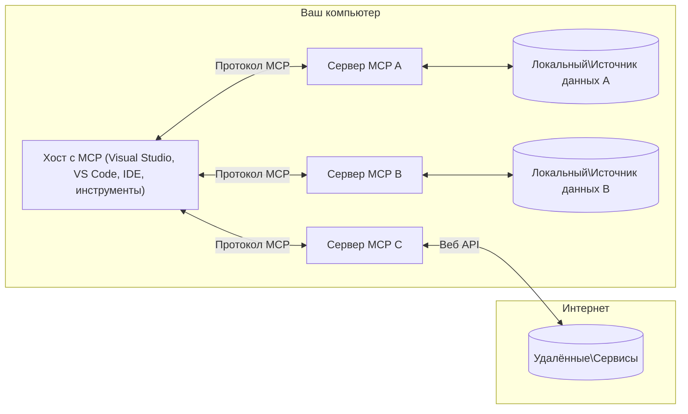

# Основные концепции MCP: Освоение Протокола Контекста Модели для интеграции ИИ

[](https://youtu.be/earDzWGtE84)

_(Нажмите на изображение выше, чтобы посмотреть видеоурок)_

[Протокол Контекста Модели (MCP)](https://github.com/modelcontextprotocol) представляет собой мощную стандартную структуру, которая оптимизирует взаимодействие между крупными языковыми моделями (LLM) и внешними инструментами, приложениями и источниками данных.
В этом руководстве вы познакомитесь с основными концепциями MCP. Вы узнаете о клиент-серверной архитектуре, ключевых компонентах, механизмах взаимодействия и лучших практиках реализации.

- **Явное согласие пользователя**: Все операции с данными требуют явного одобрения пользователя перед выполнением. Пользователь должен точно понимать, к каким данным будет осуществлен доступ и какие действия будут выполняться, с возможностью тонкой настройки разрешений и полномочий.

- **Защита приватности данных**: Пользовательские данные раскрываются только с явного согласия и должны быть защищены надежными средствами контроля доступа на протяжении всего цикла взаимодействия. Реализации должны предотвращать несанкционированную передачу данных и обеспечивать строгие границы конфиденциальности.

- **Безопасность выполнения инструментов**: Каждый вызов инструмента требует явного согласия пользователя с четким пониманием функционала, параметров и потенциального воздействия инструмента. Надежные границы безопасности должны предотвращать непреднамеренное, небезопасное или злонамеренное выполнение инструментов.

- **Безопасность транспортного уровня**: Все каналы связи должны использовать соответствующие механизмы шифрования и аутентификации. Удалённые соединения должны реализовывать защищённые транспортные протоколы и корректное управление учётными данными.

#### Рекомендации по реализации:

- **Управление разрешениями**: Внедрить системы тонкого управления разрешениями, позволяющие пользователям контролировать доступ к серверам, инструментам и ресурсам.
- **Аутентификация и авторизация**: Использовать защищённые методы аутентификации (OAuth, API-ключи) с правильным управлением токенами и сроками их действия.
- **Валидация вводимых данных**: Проверять все параметры и входные данные в соответствии с определёнными схемами, чтобы предотвратить инъекции.
- **Аудит и журналирование**: Вести подробные журналы всех операций для мониторинга безопасности и соответствия требованиям.

## Обзор

В этом уроке рассматривается фундаментальная архитектура и компоненты экосистемы Протокола Контекста Модели (MCP). Вы узнаете о клиент-серверной архитектуре, ключевых компонентах и механизмах взаимодействия, которые обеспечивают работу MCP.

## Основные цели обучения

В конце урока вы:

- Поймёте клиент-серверную архитектуру MCP.
- Определите роли и обязанности Хостов, Клиентов и Серверов.
- Проанализируете основные функции, которые делают MCP гибким интеграционным уровнем.
- Узнаете, как происходит поток информации в экосистеме MCP.
- Получите практические знания на примерах кода на .NET, Java, Python и JavaScript.

## Архитектура MCP: более детальный взгляд

Экосистема MCP построена на модели клиент-сервер. Такая модульная структура позволяет ИИ-приложениям эффективно взаимодействовать с инструментами, базами данных, API и контекстуальными ресурсами. Рассмотрим эту архитектуру и её основные компоненты.

В основе MCP лежит клиент-серверная архитектура, где хост-приложение может подключаться к нескольким серверам:



- **Хосты MCP**: программы, такие как VSCode, Claude Desktop, IDE или ИИ-инструменты, которые хотят получить доступ к данным через MCP
- **Клиенты MCP**: клиентские реализации протокола, поддерживающие связи 1:1 с серверами
- **Серверы MCP**: легковесные программы, обеспечивающие конкретные возможности через стандартизированный Протокол Контекста Модели
- **Локальные источники данных**: файлы вашего компьютера, базы данных и службы, к которым MCP-серверы получают безопасный доступ
- **Удалённые сервисы**: внешние системы, доступные через интернет, с которыми MCP-серверы могут взаимодействовать через API.

Протокол MCP — это развивающийся стандарт с версионированием по дате (формат ГГГГ-ММ-ДД). Текущая версия протокола — **2025-11-25**. Вы можете ознакомиться с последними обновлениями в [спецификации протокола](https://modelcontextprotocol.io/specification/2025-11-25/)

> **Заглядывая вперёд:** кандидат на релиз следующей версии спецификации, **2026-07-28**, был объявлен в мае 2026 года и запланирован к выпуску 28 июля 2026 года. Эта версия делает протокол статeless на транспортном уровне (исключая рукопожатие `initialize` и идентификаторы сессий), формализует фреймворк расширений и устаревшие элементы Roots, Sampling и Logging заменяет новыми паттернами. Полный разбор смотрите в разделе [Что меняется в MCP: кандидат на релиз 2026-07-28](./mcp-2026-07-28-release-candidate.md).

### 1. Хосты

В Протоколе Контекста Модели (MCP) **хосты** — это ИИ-приложения, которые служат основным интерфейсом для взаимодействия пользователей с протоколом. Хосты координируют и управляют подключениями к нескольким MCP-серверам, создавая отдельные MCP-клиенты для каждого подключения. Примеры хостов:

- **ИИ-приложения**: Claude Desktop, Visual Studio Code, Claude Code
- **Среды разработки**: IDE и редакторы кода с интеграцией MCP
- **Кастомные приложения**: созданные под задачу агенты и инструменты ИИ

**Хосты** — это приложения, которые координируют взаимодействия с моделями ИИ. Они:

- **Оркестрация моделей ИИ**: выполняют взаимодействие с LLM для генерации ответов и координации рабочих процессов ИИ
- **Управление подключениями клиентов**: создают и поддерживают по одному MCP-клиенту на каждое подключение к серверу MCP
- **Контроль пользовательского интерфейса**: обеспечивают управление потоком диалога, взаимодействиями пользователя и отображением ответов
- **Обеспечение безопасности**: контролируют разрешения, ограничения безопасности и аутентификацию
- **Обработка согласия пользователя**: управляют одобрением пользователя на обмен данными и выполнение инструментов


### 2. Клиенты

**Клиенты** — это ключевые компоненты, поддерживающие выделенные связи один-к-одному между хостами и MCP-серверами. Каждый MCP-клиент создаётся хостом для подключения к определённому MCP-серверу, обеспечивая организованные и безопасные каналы связи. Множество клиентов позволяет хосту одновременно подключаться к нескольким серверам.

**Клиенты** — это компоненты-соединители внутри хост-приложения. Они:

- **Коммуникация по протоколу**: отправляют запросы JSON-RPC 2.0 на серверы с подсказками и инструкциями
- **Переговоры возможностей**: согласуют поддерживаемые функции и версии протокола с серверами при инициализации
- **Выполнение инструментов**: управляют запросами на выполнение инструментов от моделей и обрабатывают ответы
- **Обновления в реальном времени**: обрабатывают уведомления и обновления от серверов
- **Обработка ответов**: обрабатывают и форматируют ответы серверов для отображения пользователю

### 3. Сервера

**Сервера** — это программы, которые предоставляют контекст, инструменты и возможности клиентам MCP. Они могут работать локально (на той же машине, что и хост) или удалённо (на внешних платформах), отвечают за обработку запросов клиентов и предоставление структурированных ответов. Сервера раскрывают конкретный функционал через стандартизированный Протокол Контекста Модели.

**Сервера** — это сервисы, предоставляющие контекст и возможности. Они:

- **Регистрация возможностей**: регистрируют и раскрывают доступные примитивы (ресурсы, подсказки, инструменты) клиентам
- **Обработка запросов**: принимают и выполняют вызовы инструментов, запросы ресурсов и подсказок от клиентов
- **Предоставление контекста**: предоставляют контекстную информацию и данные для улучшения ответов моделей
- **Управление состоянием**: поддерживают состояние сессии и обрабатывают состояние взаимодействий при необходимости
- **Уведомления в реальном времени**: отправляют уведомления об изменениях возможностей и обновлениях подключённым клиентам

Сервера могут быть разработаны кем угодно для расширения возможностей моделей специализированным функционалом и поддерживают как локальное, так и удалённое развертывание.

### 4. Примитивы сервера

Сервера MCP предоставляют три основных **примитива**, которые определяют фундаментальные строительные блоки для богатого взаимодействия между клиентами, хостами и языковыми моделями. Эти примитивы задают типы контекстной информации и действий, доступных через протокол.

MCP-сервера могут раскрывать любую комбинацию следующих трёх основных примитивов:

#### Ресурсы

**Ресурсы** — это источники данных, предоставляющие контекстную информацию ИИ-приложениям. Они представляют статический или динамический контент, который может улучшать понимание модели и принятие решений:

- **Контекстные данные**: структурированная информация и контекст для потребления моделью ИИ
- **Базы знаний**: репозитории документов, статьи, руководства и научные работы
- **Локальные источники данных**: файлы, базы данных и информация локальной системы  
- **Внешние данные**: ответы API, веб-сервисы и данные удалённых систем
- **Динамический контент**: данные в реальном времени, обновляющиеся в зависимости от внешних условий

Ресурсы идентифицируются через URI и поддерживают поиск по методам `resources/list` и получение через `resources/read`:

```text
file://documents/project-spec.md
database://production/users/schema
api://weather/current
```

#### Подсказки

**Подсказки** — это повторно используемые шаблоны, помогающие структурировать взаимодействия с языковыми моделями. Они предоставляют стандартизированные шаблоны взаимодействия и шаблоны рабочих процессов:

- **Взаимодействие на основе шаблонов**: заранее структурированные сообщения и стартовые фразы для диалогов
- **Шаблоны рабочих процессов**: стандартизированные последовательности для типовых задач и взаимодействий
- **Малое количество примеров**: примеры в шаблонах для инструкций модели
- **Системные подсказки**: базовые подсказки, которые определяют поведение и контекст модели
- **Динамические шаблоны**: параметризованные подсказки, адаптирующиеся к конкретному контексту

Подсказки поддерживают подстановку переменных, их можно найти через `prompts/list` и получить через `prompts/get`:

```markdown
Generate a {{task_type}} for {{product}} targeting {{audience}} with the following requirements: {{requirements}}
```

#### Инструменты

**Инструменты** — исполняемые функции, которые модели ИИ могут вызывать для выполнения конкретных действий. Они представляют \"глаголы\" экосистемы MCP, позволяя моделям взаимодействовать с внешними системами:

- **Исполняемые функции**: отдельные операции, которые модели могут вызывать с конкретными параметрами
- **Интеграция с внешними системами**: запросы API, запросы к базам данных, операции с файлами, вычисления
- **Уникальная идентичность**: каждый инструмент имеет уникальное имя, описание и схему параметров
- **Структурированный ввод-вывод**: инструменты принимают валидированные параметры и возвращают структурированные, типизированные ответы
- **Возможности действий**: позволяют моделям выполнять реальные действия и получать актуальные данные

Инструменты определяются с помощью JSON Schema для проверки параметров, их можно найти через `tools/list` и запускать через `tools/call`. Инструменты также могут включать **иконки** как дополнительные метаданные для лучшего отображения в интерфейсе.

**Аннотации инструментов**: инструменты поддерживают аннотации поведения (например, `readOnlyHint`, `destructiveHint`), которые описывают, является ли инструмент только для чтения или разрушительным, помогая клиентам принимать обоснованные решения о выполнении.

Пример определения инструмента:

```typescript
server.tool(
  "search_products", 
  {
    query: z.string().describe("Search query for products"),
    category: z.string().optional().describe("Product category filter"),
    max_results: z.number().default(10).describe("Maximum results to return")
  }, 
  async (params) => {
    // Выполнить поиск и вернуть структурированные результаты
    return await productService.search(params);
  }
);
```

## Примитивы клиента

В Протоколе Контекста Модели (MCP) **клиенты** могут раскрывать примитивы, позволяющие серверам запрашивать дополнительные возможности у хоста. Эти клиентские примитивы позволяют создавать более богатые и интерактивные реализации серверов, которые могут пользоваться возможностями моделей ИИ и взаимодействия с пользователями.

### Сэмплинг

> **Уведомление об устаревании:** кандидат на релиз `2026-07-28` объявляет Сэмплинг устаревшим в пользу прямой интеграции с API поставщиков LLM. Он продолжит работать в версии `2025-11-25` и как минимум год после устаревания, но новые разработки должны предпочитать заменяющий паттерн. Подробнее в разделе [Что меняется в MCP: кандидат на релиз 2026-07-28](./mcp-2026-07-28-release-candidate.md).

**Сэмплинг** позволяет серверам запрашивать дополнения языковой модели у клиентского ИИ-приложения. Этот примитив даёт серверам доступ к возможностям LLM без необходимости встраивать свои собственные зависимости моделей:

- **Независимый от модели доступ**: сервера могут запрашивать дополнения без включения SDK LLM или управления доступом к модели
- **Инициированное сервером ИИ**: серверам предоставляется возможность автономно генерировать контент с помощью модели клиента
- **Рекурсивные взаимодействия с LLM**: поддержка сложных сценариев, когда серверам нужна помощь ИИ для обработки
- **Динамическая генерация контента**: позволяют серверам создавать контекстные ответы с помощью модели хоста
- **Поддержка вызова инструментов**: сервера могут включать параметры `tools` и `toolChoice` для разрешения моделей клиента вызывать инструменты во время сэмплинга

Сэмплинг инициируется через метод `sampling/complete`, в котором сервера отправляют клиентам запросы на дополнение.

### Корни (Roots)

> **Уведомление об устаревании:** кандидат на релиз `2026-07-28` объявляет Roots устаревшими в пользу параметров инструментов, URI ресурсов или конфигурации сервера. Они продолжат работать в версии `2025-11-25` и как минимум год после устаревания. Подробнее в разделе [Что меняется в MCP: кандидат на релиз 2026-07-28](./mcp-2026-07-28-release-candidate.md).

**Roots** обеспечивают стандартизированный способ для клиентов раскрывать границы файловой системы серверам, помогая серверам понимать, к каким каталогам и файлам у них есть доступ:

- **Границы файловой системы**: определяют границы, в пределах которых сервера могут работать в файловой системе
- **Контроль доступа**: помогают серверам понять, к каким каталогам и файлам у них есть разрешение на доступ
- **Динамические обновления**: клиенты могут уведомлять серверы об изменениях списка корней
- **Идентификация по URI**: Roots используют URI с префиксом `file://` для идентификации доступных каталогов и файлов

Roots обнаруживаются через метод `roots/list`, при изменениях клиенты отправляют `notifications/roots/list_changed`.

### Запросы дополнительной информации (Elicitation)  

**Elicitation** позволяет серверам запрашивать дополнительную информацию или подтверждение у пользователей через клиентский интерфейс:

- **Запросы ввода от пользователя**: сервера могут запрашивать дополнительную информацию, необходимую для выполнения инструмента
- **Диалоги подтверждения**: запрос одобрения пользователя для чувствительных или значимых операций
- **Интерактивные рабочие процессы**: позволяют серверам создавать пошаговые взаимодействия с пользователем
- **Динамический сбор параметров**: собирают отсутствующие или дополнительные параметры во время выполнения инструментов

Запросы Elicitation выполняются с помощью метода `elicitation/request`, который собирает ввод пользователя через интерфейс клиента.

**Elicitation в режиме URL**: сервера также могут запрашивать взаимодействие с пользователем через URL, перенаправляя пользователей на внешние веб-страницы для аутентификации, подтверждения или ввода данных.

### Логирование


> **Уведомление о прекращении поддержки:** кандидат в выпуск `2026-07-28` объявляет Logging устаревшим в пользу использования `stderr` для stdio транспоротов и OpenTelemetry для структурированной наблюдаемости. Он продолжит работать в `2025-11-25` и как минимум год после любого прекращения поддержки. Смотрите [Что меняется в MCP: Кандидат в выпуск 2026-07-28](./mcp-2026-07-28-release-candidate.md).

**Logging** позволяет серверам отправлять структурированные лог-сообщения клиентам для отладки, мониторинга и операционной видимости:

- **Поддержка отладки**: позволяет серверам предоставлять подробные журналы выполнения для устранения неполадок
- **Оперативный мониторинг**: отправляет обновления статуса и метрики производительности клиентам
- **Отчеты об ошибках**: предоставляет подробный контекст ошибок и диагностическую информацию
- **Журналы аудита**: создает исчерпывающие журналы операций и решений сервера

Лог-сообщения отправляются клиентам для обеспечения прозрачности работы сервера и облегчения отладки.

## Информационный поток в MCP

Протокол контекста модели (MCP) определяет структурированный поток информации между хостами, клиентами, серверами и моделями. Понимание этого потока помогает прояснить, как обрабатываются пользовательские запросы и как внешние инструменты и данные интегрируются в ответы модели.

- **Хост инициирует подключение**  
  Приложение-хост (например, IDE или чат-интерфейс) устанавливает соединение с MCP-сервером, обычно через STDIO, WebSocket или другой поддерживаемый транспорт.

- **Обсуждение возможностей**  
  Клиент (встроенный в хост) и сервер обмениваются информацией о поддерживаемых функциях, инструментах, ресурсах и версиях протокола. Это обеспечивает понимание обеими сторонами доступных возможностей для сессии.

- **Пользовательский запрос**  
  Пользователь взаимодействует с хостом (например, вводит запрос или команду). Хост собирает этот ввод и передает его клиенту для обработки.

- **Использование ресурса или инструмента**  
  - Клиент может запросить дополнительный контекст или ресурсы у сервера (например, файлы, записи базы данных или статьи базы знаний) для обогащения понимания модели.
  - Если модель определяет необходимость инструмента (например, для извлечения данных, выполнения вычислений или вызова API), клиент отправляет запрос на вызов инструмента серверу, указывая имя инструмента и параметры.

- **Выполнение на сервере**  
  Сервер получает запрос на ресурс или инструмент, выполняет необходимые операции (например, запускает функцию, выполняет запрос к базе данных или получает файл) и возвращает результаты клиенту в структурированном формате.

- **Формирование ответа**  
  Клиент интегрирует ответы сервера (данные ресурсов, результаты инструментов и т.д.) в текущую интеракцию с моделью. Модель использует эту информацию для создания комплексного и контекстуально релевантного ответа.

- **Представление результата**  
  Хост получает окончательный вывод от клиента и представляет его пользователю, часто включая как сгенерированный текст модели, так и результаты выполнения инструментов или поиска ресурсов.

Этот поток обеспечивает MCP поддержку продвинутых, интерактивных и контекстно-зависимых AI-приложений, бесшовно связывая модели с внешними инструментами и источниками данных.

## Архитектура протокола и уровни

MCP состоит из двух отдельных архитектурных уровней, которые работают вместе для предоставления полной коммуникационной инфраструктуры:

### Уровень данных

**Уровень данных** реализует основной протокол MCP, используя **JSON-RPC 2.0** в качестве основы. Этот уровень определяет структуру сообщений, семантику и шаблоны взаимодействия:

#### Основные компоненты:

- **Протокол JSON-RPC 2.0**: Вся коммуникация использует стандартизированный формат сообщений JSON-RPC 2.0 для вызовов методов, ответов и уведомлений
- **Управление жизненным циклом**: Обрабатывает инициализацию соединения, обсуждение возможностей и завершение сессии между клиентами и серверами
- **Примитивы сервера**: Позволяет серверам предоставлять основную функциональность через инструменты, ресурсы и подсказки
- **Примитивы клиента**: Позволяет серверам запрашивать выборку из LLM, получать ввод пользователя и отправлять лог-сообщения
- **Уведомления в реальном времени**: Поддерживает асинхронные уведомления для динамических обновлений без опроса

#### Ключевые особенности:

- **Согласование версии протокола**: Использует версионирование на основе даты (ГГГГ-ММ-ДД) для обеспечения совместимости
- **Обнаружение возможностей**: Клиенты и серверы обмениваются информацией о поддерживаемых функциях при инициализации
- **Сессии с сохранением состояния**: Поддерживает состояние соединения между несколькими взаимодействиями для непрерывности контекста

### Транспортный уровень

**Транспортный уровень** управляет каналами связи, кадрированием сообщений и аутентификацией между участниками MCP:

#### Поддерживаемые транспортные механизмы:

1. **Транспорт STDIO**:
   - Использует стандартные потоки ввода/вывода для прямой коммуникации между процессами
   - Оптимально для локальных процессов на одной машине без сетевой нагрузки
   - Часто используется для локальных реализаций MCP-сервера

2. **Потоковый HTTP транспорт**:
   - Использует HTTP POST для сообщений клиент->сервер  
   - Опциональные серверные события (SSE) для стриминга сервер->клиент
   - Позволяет удаленную связь с сервером через сеть
   - Поддерживает стандартную HTTP-аутентификацию (токены bearer, API-ключи, пользовательские заголовки)
   - MCP рекомендует OAuth для безопасной аутентификации на основе токенов

#### Абстракция транспорта:

Транспортный уровень абстрагирует детали связи от уровня данных, позволяя использовать одинаковый формат сообщений JSON-RPC 2.0 на всех транспортных механизмах. Эта абстракция позволяет приложениям плавно переключаться между локальными и удаленными серверами.

### Вопросы безопасности

Реализации MCP должны соблюдать несколько критических принципов безопасности для обеспечения надежного, доверенного и безопасного взаимодействия во всех операциях протокола:

- **Согласие и контроль пользователя**: Пользователи должны давать явное согласие перед доступом к данным или выполнением операций. Им должен быть предоставлен ясный контроль над тем, какие данные делятся и какие действия разрешены, поддерживаемый интуитивными интерфейсами для обзора и одобрения действий.

- **Конфиденциальность данных**: Данные пользователя должны раскрыватьс только при явном согласии и защищаться соответствующими средствами контроля доступа. Реализации MCP должны предотвращать несанкционированную передачу данных и обеспечивать сохранность конфиденциальности во всех взаимодействиях.

- **Безопасность инструментов**: Перед вызовом любого инструмента требуется явное согласие пользователя. Пользователи должны четко понимать функциональность каждого инструмента, а также должны соблюдаться строгие границы безопасности для предотвращения непреднамеренного или небезопасного выполнения инструментов.

Соблюдение этих принципов безопасности гарантирует, что MCP обеспечивает доверие, конфиденциальность и безопасность пользователей во всех взаимодействиях протокола, при этом позволяя мощные AI-интеграции.

## Примеры кода: ключевые компоненты

Ниже приведены примеры кода на нескольких популярных языках программирования, демонстрирующие, как реализовать ключевые компоненты и инструменты MCP-сервера.

### Пример на .NET: создание простого MCP сервера с инструментами

Практический пример кода на .NET показывает, как реализовать простой MCP сервер с пользовательскими инструментами. В этом примере показано, как определить и зарегистрировать инструменты, обрабатывать запросы и подключать сервер с использованием протокола Model Context.

```csharp
using System;
using System.Threading.Tasks;
using ModelContextProtocol.Server;
using ModelContextProtocol.Server.Transport;
using ModelContextProtocol.Server.Tools;

public class WeatherServer
{
    public static async Task Main(string[] args)
    {
        // Create an MCP server
        var server = new McpServer(
            name: "Weather MCP Server",
            version: "1.0.0"
        );
        
        // Register our custom weather tool
        server.AddTool<string, WeatherData>("weatherTool", 
            description: "Gets current weather for a location",
            execute: async (location) => {
                // Call weather API (simplified)
                var weatherData = await GetWeatherDataAsync(location);
                return weatherData;
            });
        
        // Connect the server using stdio transport
        var transport = new StdioServerTransport();
        await server.ConnectAsync(transport);
        
        Console.WriteLine("Weather MCP Server started");
        
        // Keep the server running until process is terminated
        await Task.Delay(-1);
    }
    
    private static async Task<WeatherData> GetWeatherDataAsync(string location)
    {
        // This would normally call a weather API
        // Simplified for demonstration
        await Task.Delay(100); // Simulate API call
        return new WeatherData { 
            Temperature = 72.5,
            Conditions = "Sunny",
            Location = location
        };
    }
}

public class WeatherData
{
    public double Temperature { get; set; }
    public string Conditions { get; set; }
    public string Location { get; set; }
}
```

### Пример на Java: компоненты MCP сервера

Этот пример демонстрирует тот же MCP сервер и регистрацию инструментов, что и пример на .NET выше, но реализован на Java.

```java
import io.modelcontextprotocol.server.McpServer;
import io.modelcontextprotocol.server.McpToolDefinition;
import io.modelcontextprotocol.server.transport.StdioServerTransport;
import io.modelcontextprotocol.server.tool.ToolExecutionContext;
import io.modelcontextprotocol.server.tool.ToolResponse;

public class WeatherMcpServer {
    public static void main(String[] args) throws Exception {
        // Создать MCP сервер
        McpServer server = McpServer.builder()
            .name("Weather MCP Server")
            .version("1.0.0")
            .build();
            
        // Зарегистрировать инструмент погоды
        server.registerTool(McpToolDefinition.builder("weatherTool")
            .description("Gets current weather for a location")
            .parameter("location", String.class)
            .execute((ToolExecutionContext ctx) -> {
                String location = ctx.getParameter("location", String.class);
                
                // Получить данные о погоде (упрощенно)
                WeatherData data = getWeatherData(location);
                
                // Вернуть отформатированный ответ
                return ToolResponse.content(
                    String.format("Temperature: %.1f°F, Conditions: %s, Location: %s", 
                    data.getTemperature(), 
                    data.getConditions(), 
                    data.getLocation())
                );
            })
            .build());
        
        // Подключить сервер с использованием транспорта stdio
        try (StdioServerTransport transport = new StdioServerTransport()) {
            server.connect(transport);
            System.out.println("Weather MCP Server started");
            // Держать сервер запущенным до завершения процесса
            Thread.currentThread().join();
        }
    }
    
    private static WeatherData getWeatherData(String location) {
        // Реализация вызвала бы API погоды
        // Упрощено для примера
        return new WeatherData(72.5, "Sunny", location);
    }
}

class WeatherData {
    private double temperature;
    private String conditions;
    private String location;
    
    public WeatherData(double temperature, String conditions, String location) {
        this.temperature = temperature;
        this.conditions = conditions;
        this.location = location;
    }
    
    public double getTemperature() {
        return temperature;
    }
    
    public String getConditions() {
        return conditions;
    }
    
    public String getLocation() {
        return location;
    }
}
```

### Пример на Python: создание MCP сервера

В этом примере используется fastmcp, поэтому убедитесь, что вы его установили:

```python
pip install fastmcp
```
Пример кода:

```python
#!/usr/bin/env python3
import asyncio
from fastmcp import FastMCP
from fastmcp.transports.stdio import serve_stdio

# Создать сервер FastMCP
mcp = FastMCP(
    name="Weather MCP Server",
    version="1.0.0"
)

@mcp.tool()
def get_weather(location: str) -> dict:
    """Gets current weather for a location."""
    return {
        "temperature": 72.5,
        "conditions": "Sunny",
        "location": location
    }

# Альтернативный подход с использованием класса
class WeatherTools:
    @mcp.tool()
    def forecast(self, location: str, days: int = 1) -> dict:
        """Gets weather forecast for a location for the specified number of days."""
        return {
            "location": location,
            "forecast": [
                {"day": i+1, "temperature": 70 + i, "conditions": "Partly Cloudy"}
                for i in range(days)
            ]
        }

# Зарегистрировать инструменты класса
weather_tools = WeatherTools()

# Запустить сервер
if __name__ == "__main__":
    asyncio.run(serve_stdio(mcp))
```

### Пример на JavaScript: создание MCP сервера

Этот пример демонстрирует создание MCP сервера на JavaScript и регистрацию двух инструментов, связанных с погодой.

```javascript
// Использование официального SDK протокола Model Context
import { McpServer } from "@modelcontextprotocol/sdk/server/mcp.js";
import { StdioServerTransport } from "@modelcontextprotocol/sdk/server/stdio.js";
import { z } from "zod"; // Для проверки параметров

// Создать сервер MCP
const server = new McpServer({
  name: "Weather MCP Server",
  version: "1.0.0"
});

// Определить инструмент погоды
server.tool(
  "weatherTool",
  {
    location: z.string().describe("The location to get weather for")
  },
  async ({ location }) => {
    // Обычно это вызов погодного API
    // Упрощено для демонстрации
    const weatherData = await getWeatherData(location);
    
    return {
      content: [
        { 
          type: "text", 
          text: `Temperature: ${weatherData.temperature}°F, Conditions: ${weatherData.conditions}, Location: ${weatherData.location}` 
        }
      ]
    };
  }
);

// Определить инструмент прогноза
server.tool(
  "forecastTool",
  {
    location: z.string(),
    days: z.number().default(3).describe("Number of days for forecast")
  },
  async ({ location, days }) => {
    // Обычно это вызов погодного API
    // Упрощено для демонстрации
    const forecast = await getForecastData(location, days);
    
    return {
      content: [
        { 
          type: "text", 
          text: `${days}-day forecast for ${location}: ${JSON.stringify(forecast)}` 
        }
      ]
    };
  }
);

// Вспомогательные функции
async function getWeatherData(location) {
  // Симуляция вызова API
  return {
    temperature: 72.5,
    conditions: "Sunny",
    location: location
  };
}

async function getForecastData(location, days) {
  // Симуляция вызова API
  return Array.from({ length: days }, (_, i) => ({
    day: i + 1,
    temperature: 70 + Math.floor(Math.random() * 10),
    conditions: i % 2 === 0 ? "Sunny" : "Partly Cloudy"
  }));
}

// Подключить сервер с использованием stdio транспорта
const transport = new StdioServerTransport();
server.connect(transport).catch(console.error);

console.log("Weather MCP Server started");
```

В этом примере на JavaScript показано, как создать MCP сервер с использованием SDK Model Context Protocol. Показано, как зарегистрировать два инструмента с именами `weatherTool` и `forecastTool` и сделать их доступными для клиентов MCP через `StdioServerTransport`.

## Безопасность и авторизация

MCP включает несколько встроенных концепций и механизмов для управления безопасностью и авторизацией во всем протоколе:

1. **Контроль разрешений на инструменты**:  
  Клиенты могут указывать, какими инструментами модель может пользоваться во время сессии. Это обеспечивает доступ только к явно разрешенным инструментам, снижая риск непреднамеренных или небезопасных операций. Разрешения можно настраивать динамически в зависимости от предпочтений пользователя, корпоративной политики или контекста взаимодействия.

2. **Аутентификация**:  
  Серверы могут требовать аутентификацию перед предоставлением доступа к инструментам, ресурсам или чувствительным операциям. Это может включать API-ключи, OAuth-токены или другие схемы аутентификации. Корректная аутентификация гарантирует, что вызывать возможности сервера могут только доверенные клиенты и пользователи.

3. **Валидация**:  
  Для всех вызовов инструментов обязательна проверка параметров. Каждый инструмент определяет ожидаемые типы, форматы и ограничения для своих параметров, и сервер проверяет входящие запросы соответственно. Это предотвращает попадание некорректных или вредоносных данных в реализации инструментов и помогает сохранять целостность операций.

4. **Ограничение скорости**:  
  Для предотвращения злоупотреблений и обеспечения справедливого использования ресурсов сервера MCP-серверы могут реализовывать ограничение частоты вызовов инструментов и доступа к ресурсам. Ограничения могут применяться к пользователю, сессии или глобально и помогают защищать от атак типа отказа в обслуживании и чрезмерного потребления ресурсов.

Объединяя эти механизмы, MCP предоставляет безопасную основу для интеграции языковых моделей с внешними инструментами и источниками данных, обеспечивая при этом тонкий контроль доступа и использования для пользователей и разработчиков.

## Сообщения протокола и поток коммуникаций

Коммуникация в MCP использует структурированные сообщения **JSON-RPC 2.0** для обеспечения понятных и надежных взаимодействий между хостами, клиентами и серверами. Протокол определяет конкретные шаблоны сообщений для разных типов операций:

### Основные типы сообщений:

#### **Сообщения инициализации**
- **Запрос `initialize`**: устанавливает соединение и согласовывает версию протокола и возможности
- **Ответ `initialize`**: подтверждает поддерживаемые функции и информацию о сервере  
- **`notifications/initialized`**: сигнализирует, что инициализация завершена и сессия готова к работе

#### **Сообщения обнаружения**
- **Запрос `tools/list`**: обнаруживает доступные инструменты сервера
- **Запрос `resources/list`**: перечисляет доступные ресурсы (источники данных)
- **Запрос `prompts/list`**: получает доступные шаблоны подсказок

#### **Сообщения выполнения**  
- **Запрос `tools/call`**: выполняет конкретный инструмент с заданными параметрами
- **Запрос `resources/read`**: получает содержимое определенного ресурса
- **Запрос `prompts/get`**: извлекает шаблон подсказки с опциональными параметрами

#### **Сообщения со стороны клиента**
- **Запрос `sampling/complete`**: сервер запрашивает завершение LLM у клиента
- **`elicitation/request`**: сервер запрашивает ввод пользователя через клиентский интерфейс
- **Сообщения логирования**: сервер отправляет структурированные лог-сообщения клиенту

#### **Сообщения уведомлений**
- **`notifications/tools/list_changed`**: сервер уведомляет клиента об изменениях в списке инструментов
- **`notifications/resources/list_changed`**: сервер уведомляет клиента об изменениях в списке ресурсов  
- **`notifications/prompts/list_changed`**: сервер уведомляет клиента об изменениях в списке подсказок

### Структура сообщений:

Все сообщения MCP соответствуют формату JSON-RPC 2.0 с:
- **Запросами**: содержат `id`, `method` и опциональные `params`
- **Ответами**: содержат `id` и либо `result`, либо `error`  
- **Уведомлениями**: содержат `method` и опциональные `params` (без `id` и без ответа)

Такая структурированная коммуникация обеспечивает надежные, отслеживаемые и расширяемые взаимодействия, поддерживающие продвинутые сценарии, такие как обновления в реальном времени, последовательные вызовы инструментов и устойчивую обработку ошибок.

### Задачи (Экспериментально)

> **Взгляд в будущее:** кандидат в выпуск `2026-07-28` переводит Задачи из экспериментальной основной спецификации в отдельное расширение Задач с переработанным жизненным циклом (`tasks/get`, `tasks/update`, `tasks/cancel`; `tasks/list` удален). Если вы используете экспериментальный API, описанный ниже, запланируйте миграцию. См. [Что меняется в MCP: Кандидат в выпуск 2026-07-28](./mcp-2026-07-28-release-candidate.md).

**Задачи** — это экспериментальная функция, предоставляющая устойчивые обертки для выполнения с возможностью отложенного получения результатов и отслеживания статуса для запросов MCP:

- **Длительные операции**: отслеживают затратные вычисления, автоматизацию рабочих процессов и пакетную обработку
- **Отложенные результаты**: опрос статуса задач и получение результатов после завершения операций
- **Отслеживание статуса**: мониторинг прогресса задач через определенные состояния жизненного цикла
- **Многошаговые операции**: поддержка сложных рабочих процессов, охватывающих несколько взаимодействий

Задачи оборачивают стандартные запросы MCP, позволяя асинхронно выполнять операции, которые не могут завершиться немедленно.

## Основные выводы

- **Архитектура**: MCP использует архитектуру клиент-сервер, где хосты управляют несколькими клиентскими подключениями к серверам
- **Участники**: экосистема включает хосты (AI-приложения), клиенты (протокольные коннекторы) и серверы (поставщики возможностей)
- **Транспортные механизмы**: коммуникация поддерживает STDIO (локальный) и потоковый HTTP с опциональным SSE (удаленный)
- **Основные примитивы**: серверы предоставляют инструменты (выполняемые функции), ресурсы (источники данных) и подсказки (шаблоны)
- **Примитивы клиента**: серверы могут запрашивать выборку (завершения LLM с поддержкой вызова инструментов), опрос (ввод пользователя включая режим URL), корни (границы файловой системы) и логирование у клиентов
- **Экспериментальные функции**: задачи предоставляют устойчивые обертки для длительных операций
- **Основы протокола**: основан на JSON-RPC 2.0 с версионированием по дате (текущая: 2025-11-25)
- **Возможности в реальном времени**: поддерживает уведомления для динамических обновлений и синхронизации в реальном времени
- **Безопасность в первую очередь**: явное согласие пользователя, защита конфиденциальности данных и безопасный транспорт — ключевые требования

## Упражнение

Спроектируйте простой MCP инструмент, который был бы полезен в вашей области. Определите:
1. Как он будет называться
2. Какие параметры будет принимать
3. Какой результат будет возвращать
4. Как модель могла бы использовать этот инструмент для решения задач пользователя


---

## Что дальше

Далее: [Глава 2: Безопасность](../02-Security/README.md)


Интересно, что будет после `2025-11-25`? Читайте [Что изменится в MCP: кандидат в релизы от 2026-07-28](./mcp-2026-07-28-release-candidate.md).

---

<!-- CO-OP TRANSLATOR DISCLAIMER START -->
**Отказ от ответственности**:
Этот документ был переведен с использованием сервиса машинного перевода [Co-op Translator](https://github.com/Azure/co-op-translator). Несмотря на наши усилия по обеспечению точности, имейте в виду, что автоматический перевод может содержать ошибки или неточности. Оригинальный документ на его исходном языке следует считать авторитетным источником. Для получения критически важной информации рекомендуется обратиться к профессиональному человеческому переводу. Мы не несем ответственности за любые недоразумения или неправильные толкования, возникшие в результате использования этого перевода.
<!-- CO-OP TRANSLATOR DISCLAIMER END -->