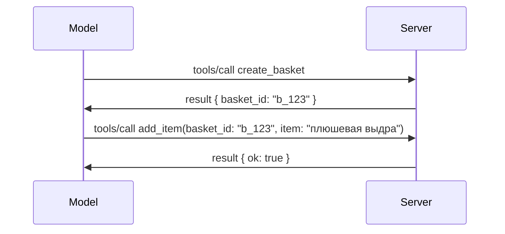

# Что меняется в MCP: кандидат в выпуск 2026-07-28

> **Статус:** кандидат в релиз. Спецификация `2026-07-28` на момент написания еще не финальна. Она была объявлена 21 мая 2026 года и запланирована к выпуску 28 июля 2026 года. Всё в этом уроке описывает кандидат в релиз; перед использованием ознакомьтесь с [черновиком спецификации](https://modelcontextprotocol.io/specification/draft) и её [журналом изменений](https://modelcontextprotocol.io/specification/draft/changelog) для получения последнего статуса. Остальная часть этой учебной программы написана для текущего стабильного релиза, **MCP Specification 2025-11-25**, и будет обновлена после выхода `2026-07-28`.

## Обзор

`2026-07-28` — крупнейшее обновление MCP с момента запуска. Шесть Предложений по улучшению спецификации (SEP) убирают сессии на уровне протокола и делают MCP без состояния на транспортном уровне, расширения становятся полноценным, версионированным механизмом, а несколько функций, изученных вами в этой учебной программе (Roots, Sampling, Logging), отмечены устаревшими согласно новой политике жизненного цикла. В этом уроке подытожено, что меняется, почему это важно и что это значит для кода, который вы уже написали для `2025-11-25`.

Источник: [Кандидат в релиз MCP Specification 2026-07-28](https://blog.modelcontextprotocol.io/posts/2026-07-28-release-candidate/) (блог Model Context Protocol, David Soria Parra и Den Delimarsky).

## Цели обучения

К концу этого урока вы сможете:

- Объяснить, почему MCP переходит к статeless протоколу и какую проблему это решает для горизонтально масштабируемых развертываний.
- Описать, как заменяется рукопожатие `initialize`/`initialized` и заголовок `Mcp-Session-Id`.
- Опознать новые заголовки `Mcp-Method` и `Mcp-Name`, а также метаданные кеширования `ttlMs`/`cacheScope`.
- Узнать о каркасе расширений и двух расширениях, поставляемых с этим релизом: MCP Apps и Tasks.
- Перечислить шесть SEP по авторизации, которые усиливают согласование с OAuth 2.0 / OIDC.
- Опознать, какие основные функции (Roots, Sampling, Logging) теперь считаются устаревшими, и что это значит на практике.
- Объяснить изменение с полным JSON Schema 2020-12 для инструментов `inputSchema`/`outputSchema`.

## Stateless протокол

Главное изменение: MCP становится протоколом без состояния на уровне протокола.

### Раньше (2025-11-25): сессии привязывают вас к одному серверу

Вызов инструмента через Streamable HTTP начинается с рукопожатия `initialize`. Сервер отвечает заголовком `Mcp-Session-Id`, который необходимо переносить в каждом последующем запросе:

```http
POST /mcp HTTP/1.1
Mcp-Session-Id: 1868a90c-3a3f-4f5b
Content-Type: application/json

{"jsonrpc":"2.0","id":2,"method":"tools/call",
 "params":{"name":"search","arguments":{"q":"otters"}}}
```

Поскольку сессия привязана к тому серверу, который её выдал, для горизонтально масштабируемых развертываний нужны **липкие маршруты** на балансировщике нагрузки и **общий хранилище сессий** между экземплярами.

### Теперь (2026-07-28): каждый запрос самодостаточен

```http
POST /mcp HTTP/1.1
MCP-Protocol-Version: 2026-07-28
Mcp-Method: tools/call
Mcp-Name: search
Content-Type: application/json

{"jsonrpc":"2.0","id":1,"method":"tools/call",
 "params":{"name":"search","arguments":{"q":"otters"},
           "_meta":{"io.modelcontextprotocol/clientInfo":{"name":"my-app","version":"1.0"}}}}
```

Любой экземпляр сервера может обработать этот запрос. Ключевые изменения:

- **Удалено рукопожатие `initialize`/`initialized`** ([SEP-2575](https://github.com/modelcontextprotocol/modelcontextprotocol/pull/2575)). Версия протокола, информация о клиенте и возможности клиента переносятся в `_meta` каждого запроса. Новый метод `server/discover` позволяет клиенту получить возможности сервера заранее, когда они нужны.
- **Удалён заголовок `Mcp-Session-Id` и сессия на уровне протокола** ([SEP-2567](https://github.com/modelcontextprotocol/modelcontextprotocol/pull/2567)). Липкие маршруты и общее хранилище сессий больше не требуются на уровне протокола.

### Stateless протокол, stateful приложения

Удаление сессии на уровне протокола не означает, что ваш сервер не может быть сохраняющим состояние. Рекомендуемый шаблон такой же, как у HTTP API: получить явный идентификатор (например, `basket_id`, `browser_id`) в одном вызове инструмента и передавать этот идентификатор модели в качестве обычного аргумента в последующих вызовах.



Это делает состояние видимым и логичным для модели, а не скрытым в транспортных метаданных, и позволяет любому экземпляру сервера обрабатывать любой вызов.

### Запросы от сервера к клиенту, перестроенные

Stateless протоколу всё же необходим способ, чтобы сервер мог запросить у клиента что-то в процессе выполнения (например, запрос для уточнения):

- **Запросы, инициируемые сервером, могут отправляться только во время активной обработки клиентского запроса** ([SEP-2260](https://github.com/modelcontextprotocol/modelcontextprotocol/pull/2260)) — раньше это было рекомендовано, теперь обязательно. Пользователь не будет вызван из ниоткуда.
- **Многораундовые запросы** ([SEP-2322](https://github.com/modelcontextprotocol/modelcontextprotocol/pull/2322)) заменяют удержание открытого SSE потока. Вместо этого сервер возвращает `InputRequiredResult`:

  ```json
  {
    "resultType": "inputRequired",
    "inputRequests": {
      "confirm": {
        "type": "elicitation",
        "message": "Delete 3 files?",
        "schema": { "type": "boolean" }
      }
    },
    "requestState": "eyJzdGVwIjoxLCJmaWxlcyI6WyJhIiwiYiIsImMiXX0="
  }
  ```

  Клиент собирает ответы и повторно отправляет исходный запрос с `inputResponses` и возвращённым `requestState`. Любой серверный экземпляр может продолжить обработку, так как вся нужная информация включена в полезную нагрузку.

### Маршрутизируемое, кэшируемое, трассируемое

Три небольших изменения облегчают работу с stateless трафиком:

- **Заголовки `Mcp-Method` и `Mcp-Name` обязательны на Streamable HTTP** ([SEP-2243](https://github.com/modelcontextprotocol/modelcontextprotocol/pull/2243)), чтобы балансировщики нагрузки, шлюзы и ограничители скорости могли маршрутизировать операции без разбора JSON тела. Серверы отклоняют запросы, если заголовки и тело не совпадают.
- **Результаты `tools/list` и чтения ресурсов содержат `ttlMs` и `cacheScope`** ([SEP-2549](https://github.com/modelcontextprotocol/modelcontextprotocol/pull/2549)), моделируя HTTP `Cache-Control`. Клиенты знают, как долго результат списка свеж и можно ли безопасно делиться им между пользователями, без необходимости долгоживущего SSE потока для отслеживания изменений.
- **Документируется распространение W3C Trace Context в `_meta`** ([SEP-414](https://github.com/modelcontextprotocol/modelcontextprotocol/pull/414)), фиксируя имена ключей `traceparent`, `tracestate` и `baggage`, чтобы распределённый трассинг мог отслеживать вызов между клиентским SDK, MCP сервером и системами ниже по цепочке в совместимом с [OpenTelemetry](https://opentelemetry.io/) бекенде.

## Расширения становятся полноценными

Расширения существовали неформально в `2025-11-25`. [SEP-2133](https://github.com/modelcontextprotocol/modelcontextprotocol/pull/2133) формализует их:

- Расширения идентифицируются по ID обратного DNS.
- Они согласовываются через карту `extensions` в возможностях клиента и сервера.
- Живут в своих собственных репозиториях `ext-*` с делегированными ответственными и версионируются независимо от основной спецификации.
- Новый трек Extensions в процессе SEP даёт им путь от экспериментального к официальному.

Этот релиз содержит два официальных расширения.

### MCP Apps: серверный интерактивный интерфейс

[MCP Apps](https://blog.modelcontextprotocol.io/posts/2026-01-26-mcp-apps/) ([SEP-1865](https://github.com/modelcontextprotocol/modelcontextprotocol/pull/1865)) позволяют серверам поставлять интерактивные HTML-интерфейсы, которые хосты рендерят в песочнице iframe. Инструменты объявляют свои шаблоны UI заранее, чтобы хосты могли их предварительно загрузить, кешировать и проанализировать по безопасности до запуска. Вы уже изучали основы этого в [Уроке 15: MCP Apps](../03-GettingStarted/15-mcp-apps/README.md) — теперь в рамках каркаса расширений MCP Apps формально является расширением, а не экспериментальной функцией ядра.

### Tasks переходит в расширение

Tasks был экспериментальной функцией ядра в `2025-11-25`. Практическое применение выявило необходимость перестройки, поэтому его место — в расширении: [Tasks extension](https://github.com/modelcontextprotocol/modelcontextprotocol/pull/2663) перестраивает жизненный цикл вокруг stateless модели — сервер может ответить на `tools/call` дескриптором задачи, а клиент продвигает её вызовы через `tasks/get`, `tasks/update` и `tasks/cancel`. Создание задачи управляется сервером: клиент объявляет поддержку расширения, сервер решает, когда запускать вызов как задачу. `tasks/list` полностью удалён, так как его невозможно безопасно ограничить без сессий.

> **Примечание по миграции:** если вы использовали экспериментальный API Tasks в `2025-11-25`, потребуется миграция на новый жизненный цикл расширения — он не обратно совместим.

## Усиление авторизации

Шесть SEP усиливают [спецификацию авторизации](https://modelcontextprotocol.io/specification/draft/basic/authorization), чтобы лучше согласовываться с реальными развертываниями OAuth 2.0 / OpenID Connect:

| SEP | Изменение |
|---|---|
| [SEP-2468](https://github.com/modelcontextprotocol/modelcontextprotocol/pull/2468) | Клиенты должны валидировать параметр `iss` в ответах авторизации согласно [RFC 9207](https://www.rfc-editor.org/rfc/rfc9207), что снижает риски атак смешивания, характерных для схемы MCP с одним клиентом и множеством серверов. В будущем версии будет требоваться отклонять ответы без `iss`. |
| [SEP-837](https://github.com/modelcontextprotocol/modelcontextprotocol/pull/837) | Клиенты объявляют `application_type` OpenID Connect при динамической регистрации клиента, предотвращая ошибочную установку сервером авторизации для настольных/CLI клиентов значения `"web"` и отклонение их redirect URI на localhost. |
| [SEP-2352](https://github.com/modelcontextprotocol/modelcontextprotocol/pull/2352) | Клиенты связывают зарегистрированные учетные данные с `issuer` сервера авторизации и перерегистрируют их при миграции ресурса между серверами авторизации. |
| [SEP-2207](https://github.com/modelcontextprotocol/modelcontextprotocol/pull/2207) | Описывает, как запрашивать refresh токены у серверов OpenID Connect. |
| [SEP-2350](https://github.com/modelcontextprotocol/modelcontextprotocol/pull/2350) | Уточняет накопление области действия (scope) при step-up авторизации. |
| [SEP-2351](https://github.com/modelcontextprotocol/modelcontextprotocol/pull/2351) | Уточняет суффикс `.well-known` для обнаружения. |

Если вы сегодня строите сервер авторизации для MCP, начните сейчас поддерживать `iss` в ответах авторизации — смотрите [02-Security](../02-Security/README.md) для текущих рекомендаций по авторизации, на которые это опирается.

## Roots, Sampling и Logging устарели

Согласно новой [политике жизненного цикла функций](https://github.com/modelcontextprotocol/modelcontextprotocol/pull/2577) ([SEP-2577](https://github.com/modelcontextprotocol/modelcontextprotocol/pull/2577)), три основных клиента примитива, изученных в [Основных концепциях](./README.md#roots), переходят в статус **Устаревшие**:

| Функция | Рекомендуемая замена |
|---|---|
| Roots | Параметры инструмента, URI ресурсов или конфигурация сервера |
| Sampling | Прямая интеграция с API поставщиков LLM |
| Logging | `stderr` для stdio транспортов; OpenTelemetry для структурируемой наблюдаемости |

Это **только информация об устаревании**: методы, типы и флаги возможностей остаются в работе в этом релизе и во всех версиях спецификации, опубликованных в течение года после него. Удаление любой из них потребует отдельного SEP согласно политике жизненного цикла — поэтому сегодняшний код с [Sampling](../03-GettingStarted/14-sampling/README.md) не сломается, но новые серверы должны предпочитать вышеуказанные замены.

## Полный JSON Schema 2020-12 для инструментов

`inputSchema` и `outputSchema` инструмента теперь полные [JSON Schema 2020-12](https://json-schema.org/draft/2020-12) ([SEP-2106](https://github.com/modelcontextprotocol/modelcontextprotocol/pull/2106)):

- Схемы входных данных сохраняют корневое ограничение `type: "object"`, но теперь поддерживают композицию (`oneOf`, `anyOf`, `allOf`), условные конструкции и ссылки (`$ref`, `$defs`).
- Схемы выходных данных не ограничены, а `structuredContent` теперь может быть любым JSON значением, а не только объектом.
- Реализации не должны автоматически разыменовывать внешние URI в `$ref` и должны ограничивать глубину схем и время валидации (учитывая возможность атак типа отказа в обслуживании, если валидация происходит серверной стороной).

Отдельно, код ошибки для отсутствующего ресурса изменён с MCP-специфичного `-32002` на стандарт JSON-RPC `-32602` (Неверные параметры) ([SEP-2164](https://github.com/modelcontextprotocol/modelcontextprotocol/pull/2164)). Если ваш клиент проверяет строго значение `-32002`, потребуется обновление.

## Как протокол будет развиваться дальше

Этот релиз содержит ломающие изменения, которые мейнтейнеры MCP не планируют делать нормой в дальнейшем. Три SEP по управлению призваны предотвратить повтор:

- **Политика жизненного цикла функций** задаёт каждой функции путь Active → Deprecated → Removed с минимум двенадцатью месяцами между устареванием и возможным удалением.
- **Каркас расширений** позволяет новым возможностям выходить как опциональные расширения и стабилизироваться там прежде (и если вообще) они войдут в основную спецификацию.

- Стандартный SEP на пути к финальному статусу не может быть достигнут, пока соответствующий сценарий не появится в [наборе для проверки соответствия](https://github.com/modelcontextprotocol/conformance) ([SEP-2484](https://github.com/modelcontextprotocol/modelcontextprotocol/pull/2484)) — том же наборе, на основе которого [система уровней SDK](https://github.com/modelcontextprotocol/modelcontextprotocol/pull/1777) оценивает официальные SDK.

## Временная шкала выпуска и проверка

- Кандидат на выпуск был зафиксирован 21 мая 2026 года.
- Окончательная спецификация запланирована на 28 июля 2026 года.
- Десятинедельный период между двумя этими датами даёт возможность сопровождающим SDK и разработчикам клиентов проверить изменения на реальных нагрузках; SDK первого уровня ожидается иметь поддержку в этот период согласно [системе уровней SDK](https://modelcontextprotocol.io/docs/sdk).
- Следите за полным набором изменений в [черновом варианте спецификации](https://modelcontextprotocol.io/specification/draft) и её [журнале изменений](https://modelcontextprotocol.io/specification/draft/changelog).

## Что это означает для данной учебной программы

Всё, чему вы научились до сих пор в этом курсе, ориентировано на **2025-11-25**, которая остаётся текущей стабильной спецификацией до выхода версии `2026-07-28`. Конкретно:

- **Сессии и рукопожатие `initialize`** (рассмотрены в [Основных концепциях](./README.md) и [Уроке 6: HTTP-стриминг](../03-GettingStarted/06-http-streaming/README.md)) по-прежнему работают, как описано сегодня, но ожидайте их замену на безсессионную модель запросов, описанную выше, после обновления SDK до версии, совместимой с `2026-07-28`.
- **Сэмплинг и корневые элементы** (тоже рассмотрены в [Основных концепциях](./README.md)) остаются полностью функциональными, но устарели — новые проекты должны предпочитать приведённые выше шаблоны замены.
- **Экспериментальная функция Tasks**, если вы её использовали, потребует миграции на новый цикл жизни расширения Tasks.
- **Приложения MCP** ([Урок 15](../03-GettingStarted/15-mcp-apps/README.md)) практически не затронуты; они просто переходят в формальный фреймворк Extensions.

## Дополнительные ресурсы

- [Кандидат на выпуск спецификации MCP 2026-07-28 (публикация в блоге)](https://blog.modelcontextprotocol.io/posts/2026-07-28-release-candidate/)
- [Будущее MCP Transport](https://blog.modelcontextprotocol.io/posts/2025-12-19-mcp-transport-future/)
- [Черновая спецификация MCP](https://modelcontextprotocol.io/specification/draft)
- [Журнал изменений MCP](https://modelcontextprotocol.io/specification/draft/changelog)
- [Руководства SEP](https://modelcontextprotocol.io/community/sep-guidelines)
- [Система уровней SDK MCP](https://modelcontextprotocol.io/docs/sdk)

## Следующие шаги

Вернитесь к [Основным концепциям](./README.md) или продолжите с разделом [Безопасность](../02-Security/README.md), чтобы узнать, как сегодняшние рекомендации `2025-11-25` соотносятся с предстоящими изменениями.

---

<!-- CO-OP TRANSLATOR DISCLAIMER START -->
**Отказ от ответственности**:
Этот документ был переведен с использованием сервиса машинного перевода [Co-op Translator](https://github.com/Azure/co-op-translator). Несмотря на наши усилия по обеспечению точности, имейте в виду, что автоматический перевод может содержать ошибки или неточности. Оригинальный документ на его исходном языке следует считать авторитетным источником. Для получения критически важной информации рекомендуется обратиться к профессиональному человеческому переводу. Мы не несем ответственности за любые недоразумения или неправильные толкования, возникшие в результате использования этого перевода.
<!-- CO-OP TRANSLATOR DISCLAIMER END -->