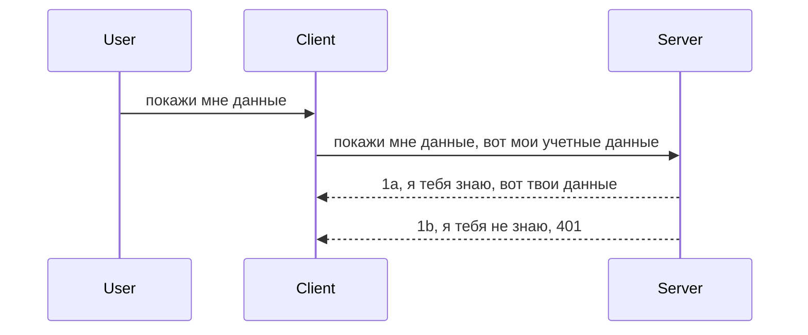

# Простая аутентификация

SDK MCP поддерживают использование OAuth 2.1, что, по правде говоря, является довольно сложным процессом, включающим такие понятия, как сервер аутентификации, сервер ресурсов, отправка учетных данных, получение кода, обмен кода на токен типа bearer, пока вы наконец не получите данные ресурса. Если вы не привыкли к OAuth, который отлично подходит для реализации, имеет смысл начать с базового уровня аутентификации и постепенно улучшать ее безопасность. Именно для этого существует эта глава — чтобы постепенно представить вас более продвинутым методам аутентификации.

## Аутентификация, что мы имеем в виду?

Аутентификация — это сокращение от аутентификации и авторизации. Идея в том, что нам нужно сделать две вещи:

- **Аутентификация**, это процесс определения позволим ли мы человеку войти в наш дом, то есть удостовериться, что у него есть право быть «здесь», то есть иметь доступ к нашему серверу ресурсов, где размещены функции MCP Server.
- **Авторизация** — это процесс определения, должен ли пользователь иметь доступ к конкретным ресурсам, которые он запрашивает, например, к этим заказам или этим продуктам, или разрешено ли ему читать контент, но не удалять, как другой пример.

## Учетные данные: как мы сообщаем системе, кто мы

Большинство веб-разработчиков начинают думать в терминах предоставления серверу учетных данных, обычно секрета, который говорит, разрешено ли им быть здесь — «Аутентификация». Этот учетный данные обычно представляет собой закодированную в base64 комбинацию имени пользователя и пароля или API ключ, который уникально идентифицирует конкретного пользователя.

Для этого обычно отправляют в заголовке под названием "Authorization" следующим образом:

```json
{ "Authorization": "secret123" }
```

Это обычно называется базовой аутентификацией. Общий ход работы выглядит так:



Теперь, когда мы понимаем, как это работает с точки зрения процесса, как мы это реализуем? Большинство веб-серверов имеют концепцию middleware — это часть кода, которая выполняется в рамках запроса, может проверять учетные данные и если они верны, пропускать запрос. Если учетные данные недействительны, вы получаете ошибку аутентификации. Посмотрим, как это можно реализовать:

**Python**

```python
class AuthMiddleware(BaseHTTPMiddleware):
    async def dispatch(self, request, call_next):

        has_header = request.headers.get("Authorization")
        if not has_header:
            print("-> Missing Authorization header!")
            return Response(status_code=401, content="Unauthorized")

        if not valid_token(has_header):
            print("-> Invalid token!")
            return Response(status_code=403, content="Forbidden")

        print("Valid token, proceeding...")
       
        response = await call_next(request)
        # добавьте любые пользовательские заголовки или измените ответ каким-либо образом
        return response


starlette_app.add_middleware(CustomHeaderMiddleware)
```

Здесь у нас:

- Создан middleware под названием `AuthMiddleware`, у которого метод `dispatch` вызывается веб-сервером.
- Middleware добавлен в веб-сервер:

    ```python
    starlette_app.add_middleware(AuthMiddleware)
    ```

- Написана логика проверки, которая проверяет наличие заголовка Authorization и валидность передаваемого секрета:

    ```python
    has_header = request.headers.get("Authorization")
    if not has_header:
        print("-> Missing Authorization header!")
        return Response(status_code=401, content="Unauthorized")

    if not valid_token(has_header):
        print("-> Invalid token!")
        return Response(status_code=403, content="Forbidden")
    ```

    если секрет существует и валиден, мы пропускаем запрос, вызывая `call_next`, и возвращаем ответ.

    ```python
    response = await call_next(request)
    # добавьте любые заголовки клиента или измените ответ каким-либо образом
    return response
    ```

Как это работает: если веб-запрос направлен на сервер, middleware вызывается и, учитывая его реализацию, он либо пропускает запрос дальше, либо возвращает ошибку, указывающую, что клиенту отказано в доступе.

**TypeScript**

Здесь мы создаем middleware с популярным фреймворком Express и перехватываем запрос до того, как он попадет в MCP Server. Вот код:

```typescript
function isValid(secret) {
    return secret === "secret123";
}

app.use((req, res, next) => {
    // 1. Присутствует заголовок авторизации?
    if(!req.headers["Authorization"]) {
        res.status(401).send('Unauthorized');
    }
    
    let token = req.headers["Authorization"];

    // 2. Проверить действительность.
    if(!isValid(token)) {
        res.status(403).send('Forbidden');
    }

   
    console.log('Middleware executed');
    // 3. Передать запрос на следующий этап обработки.
    next();
});
```

В этом коде мы:

1. Проверяем, есть ли заголовок Authorization, если нет — отправляем ошибку 401.
2. Проверяем валидность учетных данных/токена, если нет — отправляем ошибку 403.
3. В конце пропускаем запрос дальше по конвейеру и возвращаем запрошенный ресурс.

## Упражнение: Реализовать аутентификацию

Давайте применим наши знания на практике. План таков:

Сервер

- Создать веб-сервер и экземпляр MCP.
- Реализовать middleware для сервера.

Клиент

- Отправлять веб-запрос с учетными данными в заголовке.

### -1- Создать веб-сервер и MCP-инстанс

> **Заглядывая вперед:** пример на TypeScript ниже хранит HTTP-транспорты в `transports` карте, ключом которой является `mcp-session-id`, согласно **Спецификации MCP 2025-11-25**. Кандидат в релиз 2026-07-28 убирает handshake и ID сессии `initialize` полностью, поэтому эта карта по сессиям исчезнет в пользу статeless, самодостаточных запросов. См. [Что меняется в MCP: Кандидат релиза 2026-07-28](../../01-CoreConcepts/mcp-2026-07-28-release-candidate.md).

В первом шаге нам нужно создать веб-сервер инстанс и MCP Server.

**Python**

Здесь мы создаем экземпляр MCP сервера, создаем starlette веб-приложение и запускаем его с помощью uvicorn.

```python
# создание MCP сервера

app = FastMCP(
    name="MCP Resource Server",
    instructions="Resource Server that validates tokens via Authorization Server introspection",
    host=settings["host"],
    port=settings["port"],
    debug=True
)

# создание веб-приложения starlette
starlette_app = app.streamable_http_app()

# запуск приложения через uvicorn
async def run(starlette_app):
    import uvicorn
    config = uvicorn.Config(
            starlette_app,
            host=app.settings.host,
            port=app.settings.port,
            log_level=app.settings.log_level.lower(),
        )
    server = uvicorn.Server(config)
    await server.serve()

run(starlette_app)
```

В этом коде мы:

- Создаем MCP Server.
- Конструируем starlette веб-приложение из MCP Server, `app.streamable_http_app()`.
- Запускаем и обслуживаем веб-приложение с помощью uvicorn через `server.serve()`.

**TypeScript**

Здесь мы создаем инстанс MCP сервера.

```typescript
const server = new McpServer({
      name: "example-server",
      version: "1.0.0"
    });

    // ... настроить серверные ресурсы, инструменты и подсказки ...
```

Создание MCP Server должно происходить внутри определения маршрута POST /mcp, так что давайте возьмем вышеуказанный код и переместим его так:

```typescript
import express from "express";
import { randomUUID } from "node:crypto";
import { McpServer } from "@modelcontextprotocol/sdk/server/mcp.js";
import { StreamableHTTPServerTransport } from "@modelcontextprotocol/sdk/server/streamableHttp.js";
import { isInitializeRequest } from "@modelcontextprotocol/sdk/types.js"

const app = express();
app.use(express.json());

// Карта для хранения транспортов по идентификатору сессии
const transports: { [sessionId: string]: StreamableHTTPServerTransport } = {};

// Обработка POST-запросов для связи клиента с сервером
app.post('/mcp', async (req, res) => {
  // Проверка существующего идентификатора сессии
  const sessionId = req.headers['mcp-session-id'] as string | undefined;
  let transport: StreamableHTTPServerTransport;

  if (sessionId && transports[sessionId]) {
    // Повторное использование существующего транспорта
    transport = transports[sessionId];
  } else if (!sessionId && isInitializeRequest(req.body)) {
    // Новый инициализационный запрос
    transport = new StreamableHTTPServerTransport({
      sessionIdGenerator: () => randomUUID(),
      onsessioninitialized: (sessionId) => {
        // Сохраняем транспорт по идентификатору сессии
        transports[sessionId] = transport;
      },
      // Защита от DNS rebinding по умолчанию отключена для обратной совместимости. Если вы запускаете этот сервер
      // локально, убедитесь, что установили:
      // enableDnsRebindingProtection: true,
      // allowedHosts: ['127.0.0.1'],
    });

    // Очистить транспорт при закрытии
    transport.onclose = () => {
      if (transport.sessionId) {
        delete transports[transport.sessionId];
      }
    };
    const server = new McpServer({
      name: "example-server",
      version: "1.0.0"
    });

    // ... настройка ресурсов сервера, инструментов и подсказок ...

    // Подключение к серверу MCP
    await server.connect(transport);
  } else {
    // Неверный запрос
    res.status(400).json({
      jsonrpc: '2.0',
      error: {
        code: -32000,
        message: 'Bad Request: No valid session ID provided',
      },
      id: null,
    });
    return;
  }

  // Обработка запроса
  await transport.handleRequest(req, res, req.body);
});

// Переиспользуемый обработчик для GET и DELETE запросов
const handleSessionRequest = async (req: express.Request, res: express.Response) => {
  const sessionId = req.headers['mcp-session-id'] as string | undefined;
  if (!sessionId || !transports[sessionId]) {
    res.status(400).send('Invalid or missing session ID');
    return;
  }
  
  const transport = transports[sessionId];
  await transport.handleRequest(req, res);
};

// Обработка GET-запросов для уведомлений сервера клиенту через SSE
app.get('/mcp', handleSessionRequest);

// Обработка DELETE-запросов для завершения сессии
app.delete('/mcp', handleSessionRequest);

app.listen(3000);
```

Теперь вы видите, что создание MCP сервера было перемещено внутрь `app.post("/mcp")`.

Переходим к следующему шагу — созданию middleware для проверки входящих учетных данных.

### -2- Реализовать middleware для сервера

Давайте перейдем к части с middleware. Здесь мы создадим middleware, которое ищет учетные данные в заголовке `Authorization` и проверяет их. Если они приемлемы, запрос пройдет дальше и выполнит необходимое (например, перечислит инструменты, прочитает ресурс или любую другую функциональность MCP, которую запросил клиент).

**Python**

Для создания middleware нужно создать класс, наследующий `BaseHTTPMiddleware`. Есть два важных параметра:

- Запрос `request`, из которого читаем информацию из заголовков.
- `call_next` — callback, который нужно вызвать, если клиент передал приемлемые учетные данные.

Сначала нужно обработать случай отсутствия заголовка `Authorization`:

```python
has_header = request.headers.get("Authorization")

# заголовок отсутствует, ошибка 401, иначе продолжить.
if not has_header:
    print("-> Missing Authorization header!")
    return Response(status_code=401, content="Unauthorized")
```

Здесь мы отправляем сообщение 401 unauthorized, так как клиент не подтвердил аутентификацию.

Далее, если учетные данные были переданы, проверяем их валидность следующим образом:

```python
 if not valid_token(has_header):
    print("-> Invalid token!")
    return Response(status_code=403, content="Forbidden")
```

Обратите внимание, что здесь отправляется ошибка 403 forbidden. Посмотрим полный middleware, реализующий все вышеописанное:

```python
class AuthMiddleware(BaseHTTPMiddleware):
    async def dispatch(self, request, call_next):

        has_header = request.headers.get("Authorization")
        if not has_header:
            print("-> Missing Authorization header!")
            return Response(status_code=401, content="Unauthorized")

        if not valid_token(has_header):
            print("-> Invalid token!")
            return Response(status_code=403, content="Forbidden")

        print("Valid token, proceeding...")
        print(f"-> Received {request.method} {request.url}")
        response = await call_next(request)
        response.headers['Custom'] = 'Example'
        return response

```

Отлично, а что насчет функции `valid_token`? Вот она:

```python
# НЕ используйте в продакшене - улучшите !!
def valid_token(token: str) -> bool:
    # удалите префикс "Bearer "
    if token.startswith("Bearer "):
        token = token[7:]
        return token == "secret-token"
    return False
```

Естественно, это должно быть улучшено.

ВАЖНО: никогда не храните такие секреты в коде. Лучше получать значение для сравнения из источника данных или от поставщика идентификационных услуг (IDP), а еще лучше — разрешить IDP выполнять валидацию.

**TypeScript**

Для реализации с Express нужно вызвать метод `use`, который принимает middleware-функции.

Нужно:

- Взаимодействовать с переменной запроса для проверки переданных учетных данных в свойстве `Authorization`.
- Проверить учетные данные и, если они валидны, позволить запросу продолжить выполнение MCP запроса клиента (например, перечисление инструментов, чтение ресурсов или любые другие MCP операции).

Здесь мы проверяем, присутствует ли заголовок `Authorization`, и если нет, останавливаем запрос:

```typescript
if(!req.headers["authorization"]) {
    res.status(401).send('Unauthorized');
    return;
}
```

Если заголовок не отправлен, получите ошибку 401.

Далее мы проверяем валидность учетных данных, если они недействительны — запрос прекращается с другой ошибкой:

```typescript
if(!isValid(token)) {
    res.status(403).send('Forbidden');
    return;
} 
```

Обратите внимание, что теперь вы получите ошибку 403.

Вот полный код:

```typescript
app.use((req, res, next) => {
    console.log('Request received:', req.method, req.url, req.headers);
    console.log('Headers:', req.headers["authorization"]);
    if(!req.headers["authorization"]) {
        res.status(401).send('Unauthorized');
        return;
    }
    
    let token = req.headers["authorization"];

    if(!isValid(token)) {
        res.status(403).send('Forbidden');
        return;
    }  

    console.log('Middleware executed');
    next();
});
```

Мы настроили веб-сервер, чтобы он принимал middleware для проверки учетных данных, которые клиент, надеемся, отправит. А что насчет самого клиента?

### -3- Отправить веб-запрос с учетными данными в заголовке

Нужно убедиться, что клиент передает учетные данные в заголовке. Поскольку мы будем использовать MCP клиент, нужно понять, как это сделать.

**Python**

Для клиента нужно передать заголовок с учетными данными так:

```python
# НЕ жестко кодируйте значение, храните его как минимум в переменной окружения или в более защищенном хранилище
token = "secret-token"

async with streamablehttp_client(
        url = f"http://localhost:{port}/mcp",
        headers = {"Authorization": f"Bearer {token}"}
    ) as (
        read_stream,
        write_stream,
        session_callback,
    ):
        async with ClientSession(
            read_stream,
            write_stream
        ) as session:
            await session.initialize()
      
            # TODO, что вы хотите сделать в клиенте, например, перечислить инструменты, вызвать инструменты и т.д.
```

Обратите внимание, что мы заполняем свойство `headers` как ` headers = {"Authorization": f"Bearer {token}"}`.

**TypeScript**

Это можно решить в два шага:

1. Заполнить объект конфигурации нашими учетными данными.
2. Передать объект конфигурации в транспорт.

```typescript

// НЕ жёстко кодируйте значение, как показано здесь. Минимум используйте его как переменную окружения и что-то вроде dotenv (в режиме разработки).
let token = "secret123"

// определить объект параметров транспортного клиента
let options: StreamableHTTPClientTransportOptions = {
  sessionId: sessionId,
  requestInit: {
    headers: {
      "Authorization": "secret123"
    }
  }
};

// передать объект параметров в транспорт
async function main() {
   const transport = new StreamableHTTPClientTransport(
      new URL(serverUrl),
      options
   );
```

Здесь вы видите, что мы создали объект `options` и положили наши заголовки в свойство `requestInit`.

ВАЖНО: Как же улучшить этот подход? Текущая реализация имеет недостатки. Во-первых, передача учетных данных таким образом очень рискованна, если только у вас нет HTTPS как минимума. Тем не менее, секреты могут быть похищены, поэтому нужна система для быстрого отзыва токенов и дополнительные проверки, например, откуда в мире он пришёл, не слишком ли часто происходят запросы (поведение бота), и многое другое — полный набор проблем.

Однако стоит сказать, что для очень простых API, где вы не хотите, чтобы кто-либо обращался к вашему API без аутентификации, то то, что у нас есть, это хороший старт.

С учетом сказанного, давайте постараемся усилить безопасность, используя стандартизированный формат как JSON Web Token, также известный как JWT или «JOT» токен.

## JSON Web Tokens, JWT

Итак, мы пытаемся улучшить отправку очень простых учетных данных. Какие непосредственные преимущества мы получаем, применяя JWT?

- **Улучшение безопасности**. В базовой аутентификации вы отправляете имя пользователя и пароль как base64 токен (или API ключ) снова и снова, что увеличивает риски. С JWT вы отправляете имя пользователя и пароль и получаете токен в ответ, который еще и ограничен по времени действия — он истекает. JWT позволяет использовать тонкую настройку доступа через роли, области и разрешения.
- **Отсутствие состояния и масштабируемость**. JWT самодостаточен, содержит всю информацию о пользователе, устраняя необходимость хранения сессий на сервере. Токены могут проверяться локально.
- **Взаимодействие и федерация**. JWT является центральным элементом Open ID Connect и используется с известными провайдерами идентификации, такими как Entra ID, Google Identity и Auth0. Они также позволяют использовать единую аутентификацию и многое другое, делая систему подходящей для предприятий.
- **Модульность и гибкость**. JWT можно использовать с API Gateway, как Azure API Management, NGINX и другие. Поддерживается аутентификация пользователей и сервер-сервисных коммуникаций, включая имперсонацию и делегацию.
- **Производительность и кэширование**. JWT можно кэшировать после декодирования, что уменьшает необходимость парсинга. Это особенно полезно для высоконагруженных приложений, улучшая пропускную способность и снижая нагрузку на инфраструктуру.
- **Расширенные функции**. Поддерживается интроспекция (проверка валидности на сервере) и отзывание (делание токена недействительным).

Со всеми этими преимуществами посмотрим, как мы можем улучшить нашу реализацию.

## Превращение базовой аутентификации в JWT

Итак, изменения на высоком уровне такие:

- **Научиться формировать JWT токен** и подготовить его для отправки от клиента к серверу.
- **Проверять JWT токен**, и если он валиден, предоставлять клиенту доступ к ресурсам.
- **Безопасное хранение токена**. Способы хранения этого токена.
- **Защита маршрутов**. Нужно защитить маршруты, в нашем случае защитить маршруты и конкретные функции MCP.
- **Добавить refresh токены**. Обеспечить токены с коротким сроком жизни и refresh токены с длительным, которые позволяют получить новый токен при истечении срока. Также должен быть endpoint для обновления и стратегия ротации.

### -1- Формирование JWT токена

JWT токен состоит из следующих частей:

- **заголовок**, используемый алгоритм и тип токена.
- **payload**, утверждения, такие как sub (пользователь или сущность, которую представляет токен, обычно user id), exp (когда истекать), role (роль).
- **подпись**, подписанная секретом или приватным ключом.

Для этого нужно сформировать header, payload и закодированный токен.

**Python**

```python

import jwt
import jwt
from jwt.exceptions import ExpiredSignatureError, InvalidTokenError
import datetime

# Секретный ключ, используемый для подписи JWT
secret_key = 'your-secret-key'

header = {
    "alg": "HS256",
    "typ": "JWT"
}

# информация о пользователе, его утверждения и время истечения срока действия
payload = {
    "sub": "1234567890",               # Субъект (ID пользователя)
    "name": "User Userson",                # Пользовательское утверждение
    "admin": True,                     # Пользовательское утверждение
    "iat": datetime.datetime.utcnow(),# Время выпуска
    "exp": datetime.datetime.utcnow() + datetime.timedelta(hours=1)  # Время истечения
}

# закодировать это
encoded_jwt = jwt.encode(payload, secret_key, algorithm="HS256", headers=header)
```

В приведенном коде мы:

- Определили заголовок с алгоритмом HS256 и типом JWT.
- Сформировали payload, содержащий subject или user id, имя пользователя, роль, время создания и время истечения, реализуя тем самым аспект ограничения по времени.

**TypeScript**

Здесь нам потребуются зависимости, которые помогут сформировать JWT токен.

Зависимости

```sh

npm install jsonwebtoken
npm install --save-dev @types/jsonwebtoken
```

Теперь, когда все есть, создадим заголовок, payload и закодируем токен.

```typescript
import jwt from 'jsonwebtoken';

const secretKey = 'your-secret-key'; // Используйте переменные окружения в продакшене

// Определите нагрузку
const payload = {
  sub: '1234567890',
  name: 'User usersson',
  admin: true,
  iat: Math.floor(Date.now() / 1000), // Время выпуска
  exp: Math.floor(Date.now() / 1000) + 60 * 60 // Истекает через 1 час
};

// Определите заголовок (необязательно, jsonwebtoken устанавливает значения по умолчанию)
const header = {
  alg: 'HS256',
  typ: 'JWT'
};

// Создайте токен
const token = jwt.sign(payload, secretKey, {
  algorithm: 'HS256',
  header: header
});

console.log('JWT:', token);
```

Этот токен:

Подписан с использованием HS256
Валиден 1 час
Включает утверждения как sub, name, admin, iat и exp.

### -2- Проверка токена

Нам также нужно проверить токен. Это следует делать на сервере, чтобы удостовериться, что то, что отправляет клиент, действительно валидно. Нужно делать множество проверок — от структуры до действительности. Рекомендуется добавлять проверки, например, состоит ли пользователь в вашей системе и другие.

Для проверки токена нужно его декодировать, чтобы прочитать и затем проверить его валидность:

**Python**

```python

# Декодировать и проверить JWT
try:
    decoded = jwt.decode(token, secret_key, algorithms=["HS256"])
    print("✅ Token is valid.")
    print("Decoded claims:")
    for key, value in decoded.items():
        print(f"  {key}: {value}")
except ExpiredSignatureError:
    print("❌ Token has expired.")
except InvalidTokenError as e:
    print(f"❌ Invalid token: {e}")

```


В этом коде мы вызываем `jwt.decode`, используя токен, секретный ключ и выбранный алгоритм в качестве входных данных. Обратите внимание, что мы используем конструкцию try-catch, так как при ошибочной проверке возникает исключение.

**TypeScript**

Здесь нам нужно вызвать `jwt.verify`, чтобы получить декодированную версию токена, которую мы можем дальше анализировать. Если этот вызов не удался, это означает, что структура токена некорректна или он больше не действителен.

```typescript

try {
  const decoded = jwt.verify(token, secretKey);
  console.log('Decoded Payload:', decoded);
} catch (err) {
  console.error('Token verification failed:', err);
}
```

ПРИМЕЧАНИЕ: как уже упоминалось ранее, мы должны выполнить дополнительные проверки, чтобы убедиться, что этот токен указывает на пользователя в нашей системе и что у пользователя есть права, которые он заявляет.

Далее рассмотрим управление доступом на основе ролей, также известное как RBAC.

## Добавление управления доступом на основе ролей

Идея состоит в том, что мы хотим выразить, что разные роли имеют разные разрешения. Например, предполагается, что администратор может делать всё, обычный пользователь может читать/писать, а гость может только читать. Таким образом, возможные уровни разрешений следующие:

- Admin.Write
- User.Read
- Guest.Read

Посмотрим, как мы можем реализовать такой контроль с помощью middleware. Middleware можно добавлять как для конкретного маршрута, так и для всех маршрутов.

**Python**

```python
from starlette.middleware.base import BaseHTTPMiddleware
from starlette.responses import JSONResponse
import jwt

# НЕ храните секрет в коде, это только для демонстрационных целей. Читайте его из безопасного места.
SECRET_KEY = "your-secret-key" # поместите это в переменную окружения
REQUIRED_PERMISSION = "User.Read"

class JWTPermissionMiddleware(BaseHTTPMiddleware):
    async def dispatch(self, request, call_next):
        auth_header = request.headers.get("Authorization")
        if not auth_header or not auth_header.startswith("Bearer "):
            return JSONResponse({"error": "Missing or invalid Authorization header"}, status_code=401)

        token = auth_header.split(" ")[1]
        try:
            decoded = jwt.decode(token, SECRET_KEY, algorithms=["HS256"])
        except jwt.ExpiredSignatureError:
            return JSONResponse({"error": "Token expired"}, status_code=401)
        except jwt.InvalidTokenError:
            return JSONResponse({"error": "Invalid token"}, status_code=401)

        permissions = decoded.get("permissions", [])
        if REQUIRED_PERMISSION not in permissions:
            return JSONResponse({"error": "Permission denied"}, status_code=403)

        request.state.user = decoded
        return await call_next(request)


```

Существует несколько способов добавить middleware, например так:

```python

# Вариант 1: добавить middleware при создании приложения starlette
middleware = [
    Middleware(JWTPermissionMiddleware)
]

app = Starlette(routes=routes, middleware=middleware)

# Вариант 2: добавить middleware после того, как приложение starlette уже создано
starlette_app.add_middleware(JWTPermissionMiddleware)

# Вариант 3: добавить middleware для каждого маршрута
routes = [
    Route(
        "/mcp",
        endpoint=..., # обработчик
        middleware=[Middleware(JWTPermissionMiddleware)]
    )
]
```

**TypeScript**

Мы можем использовать `app.use` и middleware, который будет запускаться для всех запросов.

```typescript
app.use((req, res, next) => {
    console.log('Request received:', req.method, req.url, req.headers);
    console.log('Headers:', req.headers["authorization"]);

    // 1. Проверьте, был ли отправлен заголовок авторизации

    if(!req.headers["authorization"]) {
        res.status(401).send('Unauthorized');
        return;
    }
    
    let token = req.headers["authorization"];

    // 2. Проверьте, действителен ли токен
    if(!isValid(token)) {
        res.status(403).send('Forbidden');
        return;
    }  

    // 3. Проверьте, существует ли пользователь токена в нашей системе
    if(!isExistingUser(token)) {
        res.status(403).send('Forbidden');
        console.log("User does not exist");
        return;
    }
    console.log("User exists");

    // 4. Проверьте, имеет ли токен необходимые разрешения
    if(!hasScopes(token, ["User.Read"])){
        res.status(403).send('Forbidden - insufficient scopes');
    }

    console.log("User has required scopes");

    console.log('Middleware executed');
    next();
});

```

Есть несколько вещей, которые мы можем позволить нашему middleware делать и которые он ДОЛЖЕН делать, а именно:

1. Проверить, присутствует ли заголовок авторизации
2. Проверить, действителен ли токен, мы вызываем `isValid` - метод, который проверяет целостность и валидность JWT токена.
3. Проверить, что пользователь существует в нашей системе, это необходимо проверить.

   ```typescript
    // пользователи в базе данных
   const users = [
     "user1",
     "User usersson",
   ]

   function isExistingUser(token) {
     let decodedToken = verifyToken(token);

     // TODO, проверить, существует ли пользователь в базе данных
     return users.includes(decodedToken?.name || "");
   }
   ```

   Выше мы создали очень простой список `users`, который, разумеется, должен находиться в базе данных.

4. Дополнительно следует проверить, что токен имеет необходимые разрешения.

   ```typescript
   if(!hasScopes(token, ["User.Read"])){
        res.status(403).send('Forbidden - insufficient scopes');
   }
   ```

   В приведённом коде из middleware мы проверяем, что токен содержит разрешение User.Read, если нет — отправляем ошибку 403. Ниже приведён вспомогательный метод `hasScopes`.

   ```typescript
   function hasScopes(scope: string, requiredScopes: string[]) {
     let decodedToken = verifyToken(scope);
    return requiredScopes.every(scope => decodedToken?.scopes.includes(scope));
  }
   ```

Have a think which additional checks you should be doing, but these are the absolute minimum of checks you should be doing.

Using Express as a web framework is a common choice. There are helpers library when you use JWT so you can write less code.

- `express-jwt`, helper library that provides a middleware that helps decode your token.
- `express-jwt-permissions`, this provides a middleware `guard` that helps check if a certain permission is on the token.

Here's what these libraries can look like when used:

```typescript
const express = require('express');
const jwt = require('express-jwt');
const guard = require('express-jwt-permissions')();

const app = express();
const secretKey = 'your-secret-key'; // put this in env variable

// Decode JWT and attach to req.user
app.use(jwt({ secret: secretKey, algorithms: ['HS256'] }));

// Check for User.Read permission
app.use(guard.check('User.Read'));

// multiple permissions
// app.use(guard.check(['User.Read', 'Admin.Access']));

app.get('/protected', (req, res) => {
  res.json({ message: `Welcome ${req.user.name}` });
});

// Error handler
app.use((err, req, res, next) => {
  if (err.code === 'permission_denied') {
    return res.status(403).send('Forbidden');
  }
  next(err);
});

```

Теперь вы видели, как middleware может использоваться как для аутентификации, так и для авторизации. А как насчёт MCP, изменяет ли он подход к аутентификации? Давайте узнаем в следующем разделе.

### -3- Добавление RBAC в MCP

Вы уже видели, как можно добавить RBAC через middleware, однако для MCP нет простого способа добавить RBAC на уровне каждой функции MCP, что же делать? Просто нужно добавить код, который проверяет, есть ли у клиента права вызывать конкретный инструмент:

У вас есть несколько вариантов реализации RBAC на уровне функции, вот некоторые из них:

- Добавить проверку для каждого инструмента, ресурса, подсказки, где необходимо проверить уровень разрешений.

   **python**

   ```python
   @tool()
   def delete_product(id: int):
      try:
          check_permissions(role="Admin.Write", request)
      catch:
        pass # клиент не прошел авторизацию, вызовите ошибку авторизации
   ```

   **typescript**

   ```typescript
   server.registerTool(
    "delete-product",
    {
      title: Delete a product",
      description: "Deletes a product",
      inputSchema: { id: z.number() }
    },
    async ({ id }) => {
      
      try {
        checkPermissions("Admin.Write", request);
        // todo, отправить id в productService и remote entry
      } catch(Exception e) {
        console.log("Authorization error, you're not allowed");  
      }

      return {
        content: [{ type: "text", text: `Deletected product with id ${id}` }]
      };
    }
   );
   ```


- Использовать продвинутый серверный подход и обработчики запросов, чтобы минимизировать количество мест, где нужно выполнять проверки.

   **Python**

   ```python
   
   tool_permission = {
      "create_product": ["User.Write", "Admin.Write"],
      "delete_product": ["Admin.Write"]
   }

   def has_permission(user_permissions, required_permissions) -> bool:
      # user_permissions: список разрешений, которыми обладает пользователь
      # required_permissions: список разрешений, необходимых для инструмента
      return any(perm in user_permissions for perm in required_permissions)

   @server.call_tool()
   async def handle_call_tool(
     name: str, arguments: dict[str, str] | None
   ) -> list[types.TextContent]:
    # Предположим, что request.user.permissions — это список разрешений пользователя
     user_permissions = request.user.permissions
     required_permissions = tool_permission.get(name, [])
     if not has_permission(user_permissions, required_permissions):
        # Выдать ошибку "У вас нет разрешения на вызов инструмента {name}"
        raise Exception(f"You don't have permission to call tool {name}")
     # продолжить и вызвать инструмент
     # ...
   ```   
   

   **TypeScript**

   ```typescript
   function hasPermission(userPermissions: string[], requiredPermissions: string[]): boolean {
       if (!Array.isArray(userPermissions) || !Array.isArray(requiredPermissions)) return false;
       // Вернуть true, если у пользователя есть хотя бы одно нужное разрешение
       
       return requiredPermissions.some(perm => userPermissions.includes(perm));
   }
  
   server.setRequestHandler(CallToolRequestSchema, async (request) => {
      const { params: { name } } = request;
  
      let permissions = request.user.permissions;
  
      if (!hasPermission(permissions, toolPermissions[name])) {
         return new Error(`You don't have permission to call ${name}`);
      }
  
      // продолжаем..
   });
   ```

   Обратите внимание, что вам нужно обеспечить, чтобы ваше middleware присваивало декодированный токен свойству user объекта запроса, чтобы сделать приведённый выше код проще.

### Подводя итоги

Теперь, когда мы обсудили, как добавить поддержку RBAC в целом и для MCP в частности, пора попробовать реализовать безопасность самостоятельно, чтобы убедиться, что вы поняли представленные концепции.

## Задание 1: Создайте сервер MCP и клиент MCP, используя базовую аутентификацию

Здесь вы примените полученные знания о передаче учётных данных через заголовки.

## Решение 1

[Решение 1](./code/basic/README.md)

## Задание 2: Обновите решение из Задания 1 с использованием JWT

Возьмите первое решение, но на этот раз давайте его улучшим.

Вместо базовой аутентификации используйте JWT.

## Решение 2

[Решение 2](./solution/jwt-solution/README.md)

## Вызов

Добавьте RBAC на уровне инструментов, как описано в разделе "Добавление RBAC в MCP".

## Резюме

Надеюсь, вы много узнали в этой главе — начиная с отсутствия безопасности, далее базовой безопасности, JWT и того, как его можно добавить в MCP.

Мы построили прочную основу с кастомными JWT, но по мере масштабирования движемся к модели идентификации на основе стандартов. Принятие IdP, такого как Entra или Keycloak, позволяет нам переложить выпуск токенов, их проверку и управление жизненным циклом на надёжную платформу — что освобождает нас для сосредоточения на логике приложения и опыте пользователя.

Для этого у нас есть более [продвинутая глава по Entra](../../05-AdvancedTopics/mcp-security-entra/README.md)

## Что дальше

- Далее: [Настройка хостов MCP](../12-mcp-hosts/README.md)

---

<!-- CO-OP TRANSLATOR DISCLAIMER START -->
**Отказ от ответственности**:
Этот документ был переведен с использованием сервиса машинного перевода [Co-op Translator](https://github.com/Azure/co-op-translator). Несмотря на наши усилия по обеспечению точности, имейте в виду, что автоматический перевод может содержать ошибки или неточности. Оригинальный документ на его исходном языке следует считать авторитетным источником. Для получения критически важной информации рекомендуется обратиться к профессиональному человеческому переводу. Мы не несем ответственности за любые недоразумения или неправильные толкования, возникшие в результате использования этого перевода.
<!-- CO-OP TRANSLATOR DISCLAIMER END -->